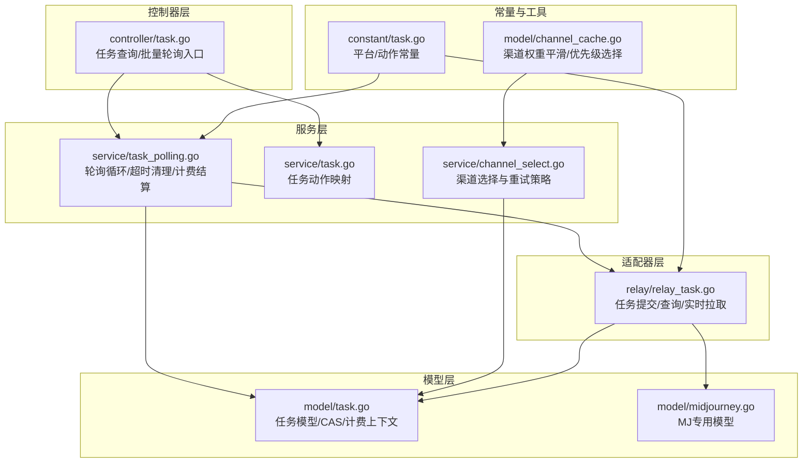
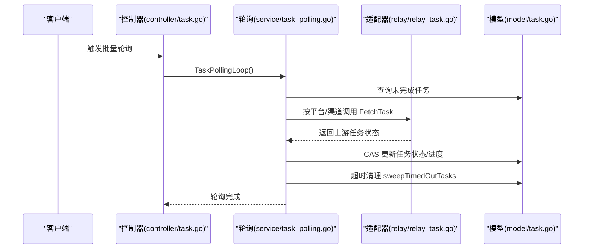
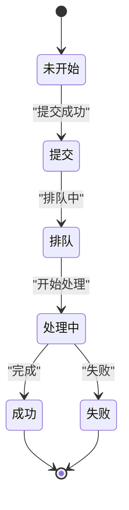
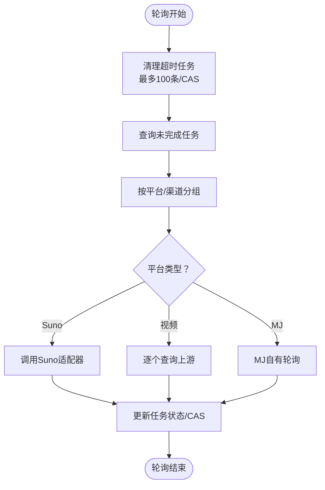
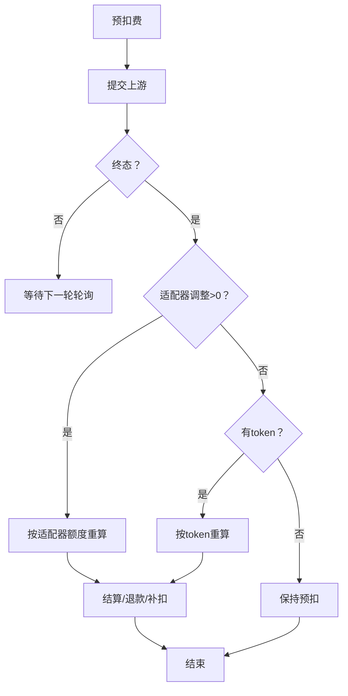
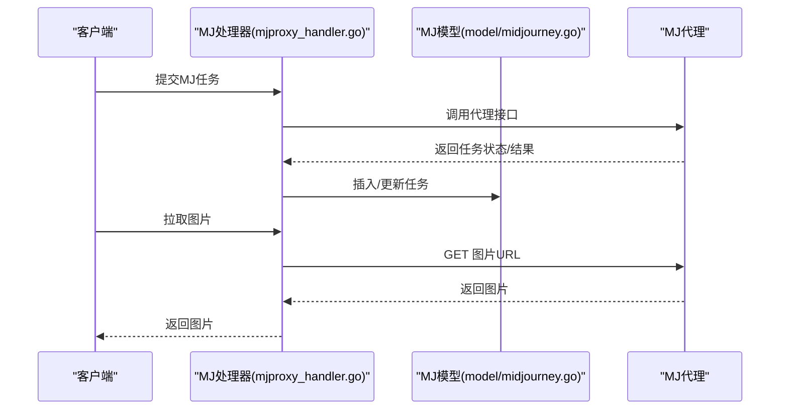
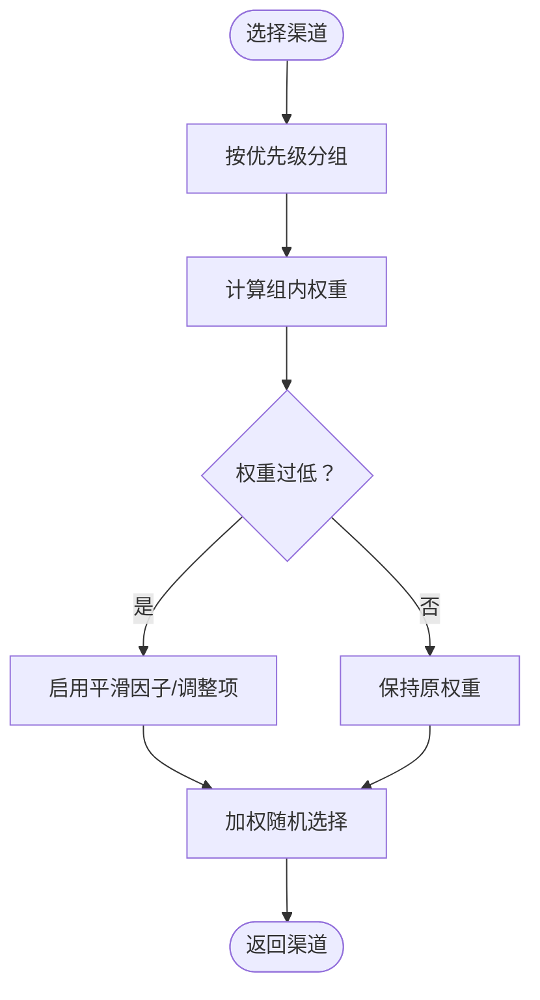
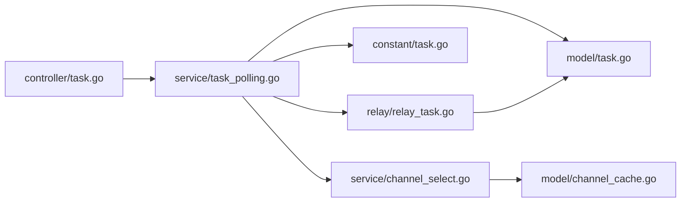

# 任务调度系统

<cite>
**本文引用的文件**
- [task.go](file://model/task.go)
- [task_polling.go](file://service/task_polling.go)
- [relay_task.go](file://relay/relay_task.go)
- [task.go](file://controller/task.go)
- [task.go](file://constant/task.go)
- [midjourney.go](file://model/midjourney.go)
- [mjproxy_handler.go](file://relay/mjproxy_handler.go)
- [task_cas_test.go](file://model/task_cas_test.go)
- [task_billing_test.go](file://service/task_billing_test.go)
- [channel_select.go](file://service/channel_select.go)
- [channel_cache.go](file://model/channel_cache.go)
</cite>

## 目录
1. [简介](#简介)
2. [项目结构](#项目结构)
3. [核心组件](#核心组件)
4. [架构总览](#架构总览)
5. [详细组件分析](#详细组件分析)
6. [依赖分析](#依赖分析)
7. [性能考量](#性能考量)
8. [故障排查指南](#故障排查指南)
9. [结论](#结论)
10. [附录](#附录)

## 简介
本技术文档面向 New API 的任务调度系统，聚焦异步任务处理机制、状态管理与轮询策略。系统支持多种平台的异步任务（如 Midjourney 代理任务、视频生成任务等），通过统一的任务模型、CAS 状态更新、差额计费结算与超时清理，保障高并发下的正确性与可观测性。本文将从架构、数据流、处理逻辑、错误恢复与性能优化等方面进行深入解析，并提供扩展指导。

## 项目结构
围绕任务调度的关键模块分布如下：
- 模型层：统一的任务模型与 Midjourney 专用模型，提供任务状态、进度、计费上下文与持久化能力
- 服务层：轮询调度、计费结算、超时清理与适配器接口
- 控制器层：对外暴露任务查询与批量轮询入口
- 适配器层：按平台抽象 FetchTask/Parsing/计费调整等行为，解耦具体上游差异
- 常量与工具：任务平台枚举、动作常量、渠道选择与权重平滑等

图表来源
- [task.go:17-20](file://controller/task.go#L17-L20)
- [task_polling.go:90-138](file://service/task_polling.go#L90-L138)
- [relay_task.go:139-258](file://relay/relay_task.go#L139-L258)
- [task.go:44-209](file://model/task.go#L44-L209)
- [midjourney.go:3-26](file://model/midjourney.go#L3-L26)
- [task.go:1-25](file://constant/task.go#L1-L25)
- [channel_cache.go:139-180](file://model/channel_cache.go#L139-L180)

章节来源
- [task.go:17-20](file://controller/task.go#L17-L20)
- [task_polling.go:90-138](file://service/task_polling.go#L90-L138)
- [relay_task.go:139-258](file://relay/relay_task.go#L139-L258)
- [task.go:44-209](file://model/task.go#L44-L209)
- [midjourney.go:3-26](file://model/midjourney.go#L3-L26)
- [task.go:1-25](file://constant/task.go#L1-L25)
- [channel_cache.go:139-180](file://model/channel_cache.go#L139-L180)

## 核心组件
- 任务模型与状态机
  - 统一任务模型包含任务标识、平台、用户、渠道、状态、进度、计费上下文与私有数据等字段
  - 状态包括未开始、提交、排队、处理中、成功、失败、未知
  - 提供快照与 CAS 更新，保证并发安全的状态推进
- 轮询调度与超时清理
  - 定期扫描未完成任务，按平台/渠道聚合，调用对应适配器查询上游状态
  - 独立清理超时任务，使用 CAS 防止覆盖已被轮询推进的任务
- 计费与结算
  - 提交前预扣费，完成后按适配器调整或按 token 重算，支持退款与补扣
  - 支持订阅与钱包两种计费来源，自动联动令牌额度
- Midjourney 代理任务
  - 通过 MJ 代理接口提交与查询，维护 MJ 专属模型与状态
- 渠道选择与权重
  - 基于优先级与权重的平滑选择，支持跨组重试与优先级回退

章节来源
- [task.go:44-209](file://model/task.go#L44-L209)
- [task_polling.go:38-88](file://service/task_polling.go#L38-L88)
- [task_polling.go:90-138](file://service/task_polling.go#L90-L138)
- [relay_task.go:139-258](file://relay/relay_task.go#L139-L258)
- [midjourney.go:3-26](file://model/midjourney.go#L3-L26)
- [channel_cache.go:139-180](file://model/channel_cache.go#L139-L180)

## 架构总览
系统采用“控制器-服务-适配器-模型”的分层设计，通过适配器接口屏蔽不同平台差异，统一任务生命周期管理。

图表来源
- [task.go:17-20](file://controller/task.go#L17-L20)
- [task_polling.go:90-138](file://service/task_polling.go#L90-L138)
- [relay_task.go:139-258](file://relay/relay_task.go#L139-L258)
- [task.go:44-209](file://model/task.go#L44-L209)

## 详细组件分析

### 任务模型与状态机
- 数据结构
  - 任务模型包含公开任务 ID、平台、用户、渠道、状态、进度、计费上下文与私有数据
  - 私有数据包含上游任务 ID、结果 URL、计费来源与订阅/令牌信息
- 状态机
  - 支持未开始、提交、排队、处理中、成功、失败、未知
  - 进度映射遵循平台约定，成功时填充结果 URL 或代理 URL
- 并发安全
  - 提供快照与 CAS 更新，避免并发写入导致状态回退
  - 批量更新不带 CAS，仅用于非计费路径

图表来源
- [task.go:34-42](file://model/task.go#L34-L42)

章节来源
- [task.go:44-209](file://model/task.go#L44-L209)
- [task_cas_test.go:129-170](file://model/task_cas_test.go#L129-L170)
- [task_cas_test.go:172-217](file://model/task_cas_test.go#L172-L217)

### 轮询调度与超时清理
- 主轮询循环
  - 每 15 秒执行一次，先清理超时任务，再按平台/渠道聚合查询
  - 不同平台走不同适配器，视频类任务逐个查询并应用速率限制
- 超时清理
  - 限定最大处理条数，使用 per-task CAS 防止覆盖
  - 成功清理时触发退款（非遗留任务且有额度）

图表来源
- [task_polling.go:90-138](file://service/task_polling.go#L90-L138)
- [task_polling.go:38-88](file://service/task_polling.go#L38-L88)
- [task_polling.go:290-342](file://service/task_polling.go#L290-L342)

章节来源
- [task_polling.go:90-138](file://service/task_polling.go#L90-L138)
- [task_polling.go:38-88](file://service/task_polling.go#L38-L88)
- [task_polling.go:290-342](file://service/task_polling.go#L290-L342)

### 计费与结算
- 预扣费与差额结算
  - 提交前预扣费，完成后优先由适配器决定最终额度，其次按 token 重算
  - 终态时进行结算，支持退款与补扣，避免重复计费
- 退款与补扣
  - 失败时按任务额度进行退款，联动用户钱包与订阅额度
  - 适配器返回正数触发差额结算，否则保持预扣不变

图表来源
- [relay_task.go:139-258](file://relay/relay_task.go#L139-L258)
- [task_polling.go:538-561](file://service/task_polling.go#L538-L561)
- [task_billing_test.go:201-288](file://service/task_billing_test.go#L201-L288)

章节来源
- [relay_task.go:139-258](file://relay/relay_task.go#L139-L258)
- [task_polling.go:538-561](file://service/task_polling.go#L538-L561)
- [task_billing_test.go:201-288](file://service/task_billing_test.go#L201-L288)

### Midjourney 代理任务
- 提交流程
  - 通过 MJ 代理接口提交，解析返回码与状态，必要时回填进度与结果
  - 插入 MJ 专属任务记录，维护状态与进度
- 查询与图片拉取
  - 支持通过代理接口查询任务状态
  - 图片下载前进行 SSRF 校验，确保安全

图表来源
- [mjproxy_handler.go:28-631](file://relay/mjproxy_handler.go#L28-L631)
- [midjourney.go:3-26](file://model/midjourney.go#L3-L26)

章节来源
- [mjproxy_handler.go:28-631](file://relay/mjproxy_handler.go#L28-L631)
- [midjourney.go:3-26](file://model/midjourney.go#L3-L26)

### 渠道选择与权重
- 优先级与权重
  - 按优先级分组，组内按权重随机选择，支持平滑因子与调整项
  - 当平均权重过低或总权重为 0 时，启用默认平滑策略
- 自动分组与跨组重试
  - “auto” 分组支持跨组重试，通过上下文跟踪当前组与重试次数，优先级回退

图表来源
- [channel_cache.go:139-180](file://model/channel_cache.go#L139-L180)
- [channel_select.go:48-74](file://service/channel_select.go#L48-L74)

章节来源
- [channel_cache.go:139-180](file://model/channel_cache.go#L139-L180)
- [channel_select.go:48-74](file://service/channel_select.go#L48-L74)

## 依赖分析
- 组件耦合
  - 服务层通过适配器接口与适配器层解耦，避免循环依赖
  - 控制器仅薄薄一层，实际逻辑集中在服务层
- 外部依赖
  - 上游平台接口（Suno、视频平台、MJ 代理）
  - 数据库与缓存（渠道信息、任务状态）
- 潜在风险
  - 超时清理与轮询更新需严格使用 CAS，防止竞态
  - 批量更新不应在计费路径使用，避免覆盖

图表来源
- [task.go:17-20](file://controller/task.go#L17-L20)
- [task_polling.go:90-138](file://service/task_polling.go#L90-L138)
- [relay_task.go:139-258](file://relay/relay_task.go#L139-L258)
- [task.go:44-209](file://model/task.go#L44-L209)
- [task.go:1-25](file://constant/task.go#L1-L25)
- [channel_select.go:48-74](file://service/channel_select.go#L48-L74)
- [channel_cache.go:139-180](file://model/channel_cache.go#L139-L180)

章节来源
- [task.go:17-20](file://controller/task.go#L17-L20)
- [task_polling.go:90-138](file://service/task_polling.go#L90-L138)
- [relay_task.go:139-258](file://relay/relay_task.go#L139-L258)
- [task.go:44-209](file://model/task.go#L44-L209)
- [task.go:1-25](file://constant/task.go#L1-L25)
- [channel_select.go:48-74](file://service/channel_select.go#L48-L74)
- [channel_cache.go:139-180](file://model/channel_cache.go#L139-L180)

## 性能考量
- 轮询频率与速率限制
  - 主轮询间隔固定，视频类任务在逐个查询时增加延迟，避免上游限流
- 批量与单点更新
  - 非计费路径可用批量更新，计费路径必须使用 CAS
- 超时清理
  - 单次最多处理 100 条，避免一次性阻塞
- 渠道权重平滑
  - 低权重场景启用平滑策略，提升公平性与稳定性

## 故障排查指南
- 任务长时间未更新
  - 检查轮询是否正常运行与上游接口状态
  - 确认任务是否进入超时清理流程
- 任务状态异常回退
  - 核查是否存在并发更新，确认 CAS 是否生效
- 计费异常
  - 检查适配器是否返回调整额度，或是否按 token 重算
  - 确认任务是否为按次计费模式
- Midjourney 图片无法下载
  - 校验 SSRF 校验规则与代理配置

章节来源
- [task_polling.go:90-138](file://service/task_polling.go#L90-L138)
- [task_polling.go:38-88](file://service/task_polling.go#L38-L88)
- [task_cas_test.go:129-170](file://model/task_cas_test.go#L129-L170)
- [task_cas_test.go:172-217](file://model/task_cas_test.go#L172-L217)
- [task_billing_test.go:201-288](file://service/task_billing_test.go#L201-L288)
- [mjproxy_handler.go:28-631](file://relay/mjproxy_handler.go#L28-L631)

## 结论
New API 的任务调度系统通过统一模型、适配器与 CAS 保障并发安全，结合超时清理与差额结算，实现了对多平台异步任务的稳定管理。系统具备良好的扩展性，可通过新增适配器接入更多平台，同时保留清晰的计费与可观测性。

## 附录
- 关键流程图与序列图已在相应章节展示，便于理解端到端流程
- 测试用例覆盖了 CAS 正负案例、并发胜者、计费结算与按次计费等关键场景