# API 客户端

<cite>
**本文引用的文件**   
- [web/src/helpers/api.js](file://web/src/helpers/api.js)
- [web/src/helpers/secureApiCall.js](file://web/src/helpers/secureApiCall.js)
- [web/src/services/secureVerification.js](file://web/src/services/secureVerification.js)
- [service/http_client.go](file://service/http_client.go)
- [service/http.go](file://service/http.go)
- [middleware/auth.go](file://middleware/auth.go)
- [middleware/cache.go](file://middleware/cache.go)
- [common/disk_cache_config.go](file://common/disk_cache_config.go)
- [common/ssrf_protection.go](file://common/ssrf_protection.go)
- [setting/operation_setting/status_code_ranges.go](file://setting/operation_setting/status_code_ranges.go)
- [controller/performance.go](file://controller/performance.go)
- [relay/channel/api_request.go](file://relay/channel/api_request.go)
- [relay/channel/jimeng/sign.go](file://relay/channel/jimeng/sign.go)
- [oauth/generic.go](file://oauth/generic.go)
- [.github/SECURITY.md](file://.github/SECURITY.md)
</cite>

## 目录
1. [简介](#简介)
2. [项目结构](#项目结构)
3. [核心组件](#核心组件)
4. [架构总览](#架构总览)
5. [详细组件分析](#详细组件分析)
6. [依赖分析](#依赖分析)
7. [性能考量](#性能考量)
8. [故障排除指南](#故障排除指南)
9. [结论](#结论)
10. [附录](#附录)

## 简介
本文件面向 New API 的 API 客户端，系统化梳理 RESTful 请求封装、请求/响应拦截器、安全认证与令牌管理、错误处理策略、请求配置与超时、重试与缓存策略，并结合后端中间件与服务层实现，给出安全验证流程、CSRF 防护与数据加密传输要点。同时提供最佳实践、性能优化技巧以及故障排除建议。

## 项目结构
前端 API 客户端位于 web/src/helpers 下，围绕 axios 实例构建统一的请求封装、拦截器与错误处理；后端通过中间件与服务层提供认证、缓存控制、HTTP 客户端与重试策略等能力；安全方面包括 CSRF 防护、SSRF 防护、磁盘缓存与 HTTPS 传输等。

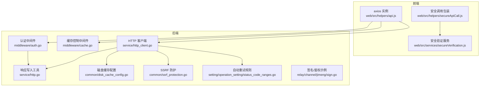

**图表来源**
- [web/src/helpers/api.js:29-37](file://web/src/helpers/api.js#L29-L37)
- [web/src/helpers/secureApiCall.js:30-47](file://web/src/helpers/secureApiCall.js#L30-L47)
- [web/src/services/secureVerification.js:31-43](file://web/src/services/secureVerification.js#L31-L43)
- [middleware/auth.go:36-157](file://middleware/auth.go#L36-L157)
- [middleware/cache.go:7-17](file://middleware/cache.go#L7-L17)
- [service/http_client.go:47-99](file://service/http_client.go#L47-L99)
- [service/http.go:15-61](file://service/http.go#L15-L61)
- [common/disk_cache_config.go:20-55](file://common/disk_cache_config.go#L20-L55)
- [common/ssrf_protection.go:11-312](file://common/ssrf_protection.go#L11-L312)
- [setting/operation_setting/status_code_ranges.go:17-85](file://setting/operation_setting/status_code_ranges.go#L17-L85)
- [relay/channel/jimeng/sign.go:58-108](file://relay/channel/jimeng/sign.go#L58-L108)

**章节来源**
- [web/src/helpers/api.js:29-37](file://web/src/helpers/api.js#L29-L37)
- [web/src/helpers/secureApiCall.js:30-47](file://web/src/helpers/secureApiCall.js#L30-L47)
- [web/src/services/secureVerification.js:31-43](file://web/src/services/secureVerification.js#L31-L43)
- [middleware/auth.go:36-157](file://middleware/auth.go#L36-L157)
- [middleware/cache.go:7-17](file://middleware/cache.go#L7-L17)
- [service/http_client.go:47-99](file://service/http_client.go#L47-L99)
- [service/http.go:15-61](file://service/http.go#L15-L61)
- [common/disk_cache_config.go:20-55](file://common/disk_cache_config.go#L20-L55)
- [common/ssrf_protection.go:11-312](file://common/ssrf_protection.go#L11-L312)
- [setting/operation_setting/status_code_ranges.go:17-85](file://setting/operation_setting/status_code_ranges.go#L17-L85)
- [relay/channel/jimeng/sign.go:58-108](file://relay/channel/jimeng/sign.go#L58-L108)

## 核心组件
- 前端 axios 实例与拦截器：统一基础配置、去重并发 GET、全局错误处理。
- 安全调用包装：识别 403 验证类错误并提取验证需求信息。
- 后端认证中间件：会话/令牌双轨认证、用户态校验、IP 限制、分组切换。
- HTTP 客户端与响应写入：统一超时、代理、重定向策略与响应头/体写入。
- 缓存控制中间件：静态页与资源缓存策略。
- 磁盘缓存配置：阈值、最大容量、路径与命中统计。
- SSRF 防护：协议、域名/IP 白/黑名单、端口限制与 DNS 校验。
- 自动重试规则：基于状态码范围的自动重试与跳过策略。
- 签名/鉴权示例：特定上游的请求签名与头部注入。

**章节来源**
- [web/src/helpers/api.js:29-37](file://web/src/helpers/api.js#L29-L37)
- [web/src/helpers/secureApiCall.js:30-47](file://web/src/helpers/secureApiCall.js#L30-L47)
- [middleware/auth.go:36-157](file://middleware/auth.go#L36-L157)
- [service/http_client.go:47-99](file://service/http_client.go#L47-L99)
- [service/http.go:15-61](file://service/http.go#L15-L61)
- [middleware/cache.go:7-17](file://middleware/cache.go#L7-L17)
- [common/disk_cache_config.go:20-55](file://common/disk_cache_config.go#L20-L55)
- [common/ssrf_protection.go:11-312](file://common/ssrf_protection.go#L11-L312)
- [setting/operation_setting/status_code_ranges.go:17-85](file://setting/operation_setting/status_code_ranges.go#L17-L85)
- [relay/channel/jimeng/sign.go:58-108](file://relay/channel/jimeng/sign.go#L58-L108)

## 架构总览
前端通过 axios 发起请求，经由后端认证中间件与缓存控制中间件，再由 HTTP 客户端与上游交互，必要时应用磁盘缓存与 SSRF 防护，最终将响应写回客户端。安全验证与错误处理贯穿前后两端。

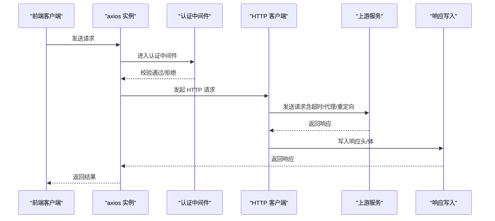

**图表来源**
- [web/src/helpers/api.js:29-37](file://web/src/helpers/api.js#L29-L37)
- [middleware/auth.go:36-157](file://middleware/auth.go#L36-L157)
- [service/http_client.go:47-99](file://service/http_client.go#L47-L99)
- [service/http.go:15-61](file://service/http.go#L15-L61)

## 详细组件分析

### 前端 API 客户端与拦截器
- axios 实例：设置基础 URL、用户标识头、禁止缓存。
- GET 去重：同一 URL+params 的并发请求合并，避免重复请求。
- 响应拦截器：统一错误处理，支持跳过全局错误处理的场景。

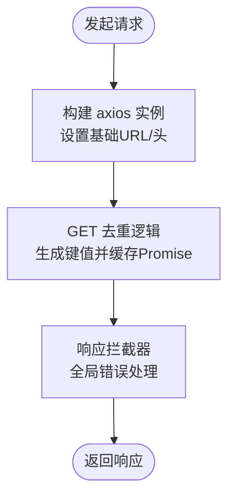

**图表来源**
- [web/src/helpers/api.js:29-37](file://web/src/helpers/api.js#L29-L37)
- [web/src/helpers/api.js:53-81](file://web/src/helpers/api.js#L53-L81)
- [web/src/helpers/api.js:97-107](file://web/src/helpers/api.js#L97-L107)

**章节来源**
- [web/src/helpers/api.js:29-37](file://web/src/helpers/api.js#L29-L37)
- [web/src/helpers/api.js:53-81](file://web/src/helpers/api.js#L53-L81)
- [web/src/helpers/api.js:97-107](file://web/src/helpers/api.js#L97-L107)

### 安全 API 调用与验证流程
- 识别 403 验证类错误：检查状态码与错误码集合。
- 提取验证需求信息：从响应体提取错误码、消息与“需要验证”标记。
- 安全验证服务：检查可用验证方式（如 2FA、Passkey），由后端 Session 控制状态。

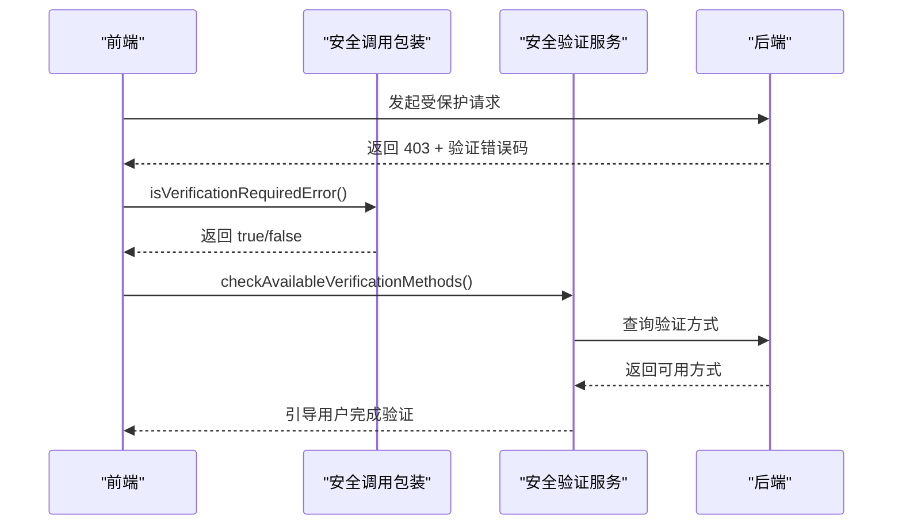

**图表来源**
- [web/src/helpers/secureApiCall.js:30-47](file://web/src/helpers/secureApiCall.js#L30-L47)
- [web/src/helpers/secureApiCall.js:54-62](file://web/src/helpers/secureApiCall.js#L54-L62)
- [web/src/services/secureVerification.js:31-43](file://web/src/services/secureVerification.js#L31-L43)

**章节来源**
- [web/src/helpers/secureApiCall.js:30-47](file://web/src/helpers/secureApiCall.js#L30-L47)
- [web/src/helpers/secureApiCall.js:54-62](file://web/src/helpers/secureApiCall.js#L54-L62)
- [web/src/services/secureVerification.js:31-43](file://web/src/services/secureVerification.js#L31-L43)

### 认证与令牌管理（后端）
- 会话/令牌双轨：优先会话，否则走令牌校验。
- 用户态校验：用户 ID 一致性、角色权限、封禁状态。
- 令牌级限制：IP 白名单、分组切换、额度上下文注入。
- 特殊协议适配：WebSocket、Anthropic/Gemini 等特殊头部/查询参数处理。

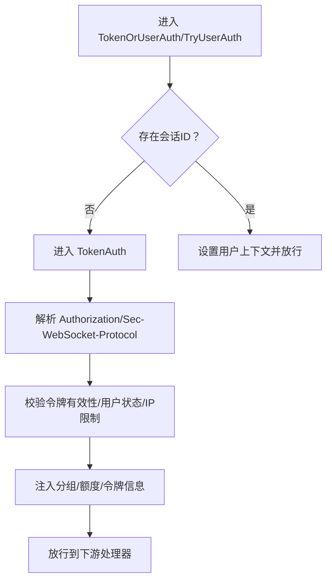

**图表来源**
- [middleware/auth.go:159-208](file://middleware/auth.go#L159-L208)
- [middleware/auth.go:276-407](file://middleware/auth.go#L276-L407)

**章节来源**
- [middleware/auth.go:159-208](file://middleware/auth.go#L159-L208)
- [middleware/auth.go:276-407](file://middleware/auth.go#L276-L407)

### 请求配置、超时与代理
- 统一 HTTP 客户端：支持超时、重定向、代理客户端缓存与复用。
- 代理客户端：按代理 URL 缓存实例，避免重复创建。
- 重定向策略：可自定义重定向行为。

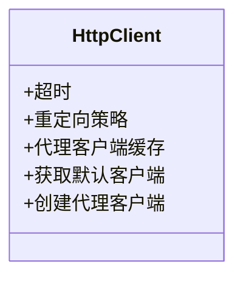

**图表来源**
- [service/http_client.go:47-99](file://service/http_client.go#L47-L99)

**章节来源**
- [service/http_client.go:47-99](file://service/http_client.go#L47-L99)

### 响应处理与头部写入
- 响应体安全关闭：避免泄漏连接。
- 响应头/体写入：在解析前避免设置 Content-Length，解析后再写入正确长度与状态码。

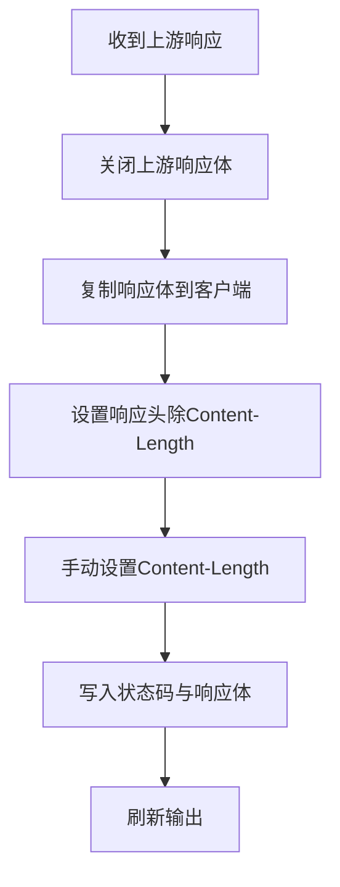

**图表来源**
- [service/http.go:15-61](file://service/http.go#L15-L61)

**章节来源**
- [service/http.go:15-61](file://service/http.go#L15-L61)

### 缓存策略与磁盘缓存
- 缓存控制中间件：首页禁用缓存，其他资源缓存一周并带版本头。
- 磁盘缓存配置：启用开关、阈值（MB）、最大容量（MB）、缓存目录。
- 统计与监控：命中次数、当前使用量、活跃文件数等原子计数。

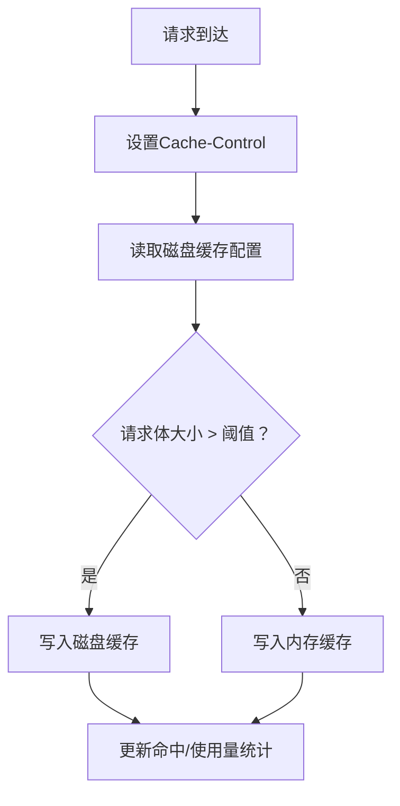

**图表来源**
- [middleware/cache.go:7-17](file://middleware/cache.go#L7-L17)
- [common/disk_cache_config.go:20-55](file://common/disk_cache_config.go#L20-L55)
- [controller/performance.go:92-120](file://controller/performance.go#L92-L120)

**章节来源**
- [middleware/cache.go:7-17](file://middleware/cache.go#L7-L17)
- [common/disk_cache_config.go:20-55](file://common/disk_cache_config.go#L20-L55)
- [controller/performance.go:92-120](file://controller/performance.go#L92-L120)

### SSRF 防护与安全验证
- SSRF 防护：仅允许 http/https，域名/IP 白/黑名单，端口范围，DNS 解析校验。
- 安全最佳实践：HTTPS、防火墙、密钥轮换、最小权限、定期更新与数据库隔离。

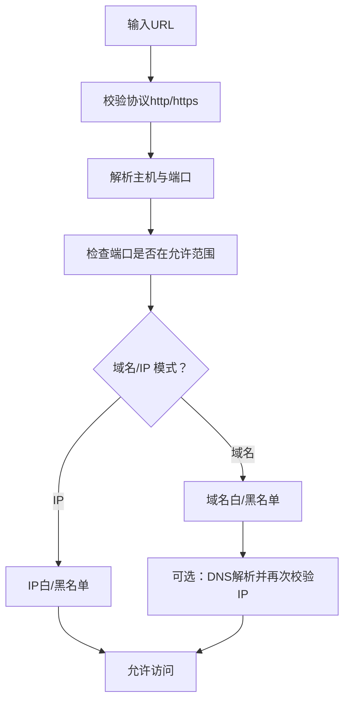

**图表来源**
- [common/ssrf_protection.go:207-286](file://common/ssrf_protection.go#L207-L286)
- [.github/SECURITY.md:41-72](file://.github/SECURITY.md#L41-L72)

**章节来源**
- [common/ssrf_protection.go:207-286](file://common/ssrf_protection.go#L207-L286)
- [.github/SECURITY.md:41-72](file://.github/SECURITY.md#L41-L72)

### 重试机制与错误处理
- 自动重试规则：基于状态码范围，默认重试 1xx、3xx、4xx（除 400/408）、5xx（除 504/524）。
- 跳过重试：固定状态码与错误码明确跳过。
- 上游签名/占位符：请求头模板支持 {api_key} 替换与客户端头占位符注入。

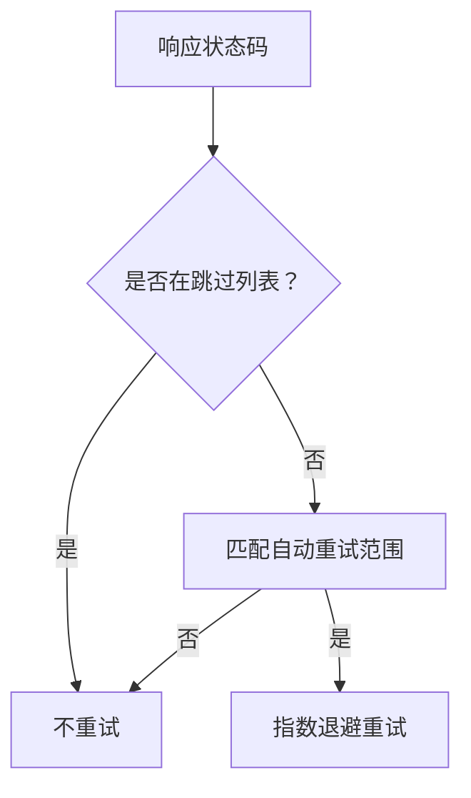

**图表来源**
- [setting/operation_setting/status_code_ranges.go:17-85](file://setting/operation_setting/status_code_ranges.go#L17-L85)
- [relay/channel/api_request.go:130-161](file://relay/channel/api_request.go#L130-L161)

**章节来源**
- [setting/operation_setting/status_code_ranges.go:17-85](file://setting/operation_setting/status_code_ranges.go#L17-L85)
- [relay/channel/api_request.go:130-161](file://relay/channel/api_request.go#L130-L161)

### 安全验证流程与 CSRF 防护
- 安全验证：后端 Session 控制验证状态，前端通过服务查询可用方式并引导完成。
- CSRF 防护：前端通过状态码与错误码识别需要验证的场景，后端通过会话与令牌校验保障请求来源可信。

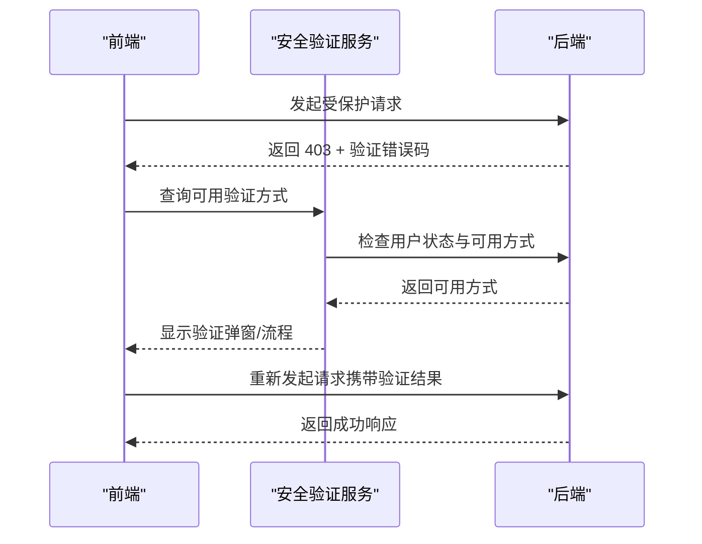

**图表来源**
- [web/src/services/secureVerification.js:31-43](file://web/src/services/secureVerification.js#L31-L43)
- [web/src/helpers/secureApiCall.js:30-47](file://web/src/helpers/secureApiCall.js#L30-L47)

**章节来源**
- [web/src/services/secureVerification.js:31-43](file://web/src/services/secureVerification.js#L31-L43)
- [web/src/helpers/secureApiCall.js:30-47](file://web/src/helpers/secureApiCall.js#L30-L47)

### 数据加密传输与认证令牌
- 传输安全：建议使用 HTTPS 保证传输层安全。
- 认证令牌：Authorization 头、WebSocket Sec-WebSocket-Protocol、特定上游头部/查询参数适配。
- OAuth 流程：通用 OAuth 提供商交换令牌，设置超时与错误处理。

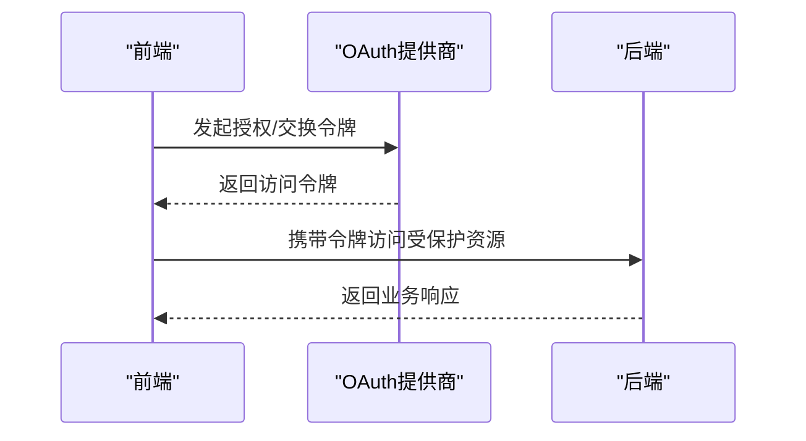

**图表来源**
- [oauth/generic.go:113-213](file://oauth/generic.go#L113-L213)

**章节来源**
- [oauth/generic.go:113-213](file://oauth/generic.go#L113-L213)

## 依赖分析
- 前端 axios 实例依赖 utils 与 i18n 工具函数，拦截器依赖全局错误提示。
- 后端中间件依赖会话、令牌模型、用户缓存与国际化消息。
- HTTP 客户端依赖传输层、代理缓存与重定向策略。
- 磁盘缓存与 SSRF 防护作为通用能力被多处使用。

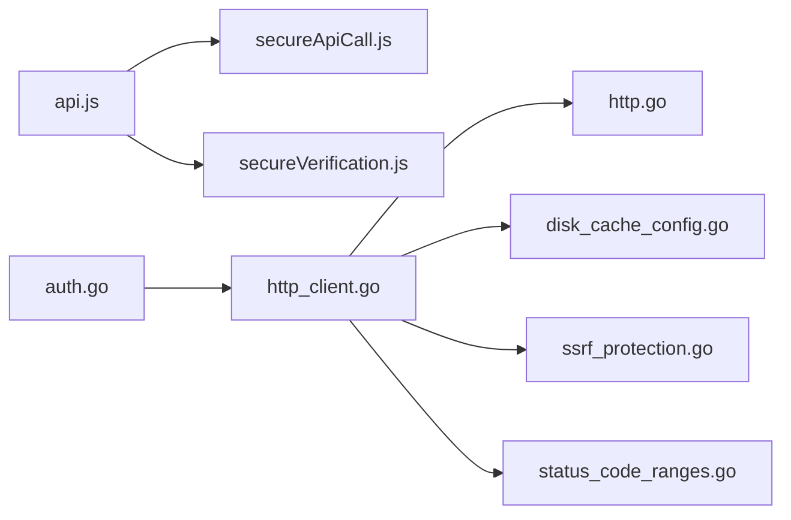

**图表来源**
- [web/src/helpers/api.js:29-37](file://web/src/helpers/api.js#L29-L37)
- [web/src/helpers/secureApiCall.js:30-47](file://web/src/helpers/secureApiCall.js#L30-L47)
- [web/src/services/secureVerification.js:31-43](file://web/src/services/secureVerification.js#L31-L43)
- [middleware/auth.go:36-157](file://middleware/auth.go#L36-L157)
- [service/http_client.go:47-99](file://service/http_client.go#L47-L99)
- [service/http.go:15-61](file://service/http.go#L15-L61)
- [common/disk_cache_config.go:20-55](file://common/disk_cache_config.go#L20-L55)
- [common/ssrf_protection.go:11-312](file://common/ssrf_protection.go#L11-L312)
- [setting/operation_setting/status_code_ranges.go:17-85](file://setting/operation_setting/status_code_ranges.go#L17-L85)

**章节来源**
- [web/src/helpers/api.js:29-37](file://web/src/helpers/api.js#L29-L37)
- [web/src/helpers/secureApiCall.js:30-47](file://web/src/helpers/secureApiCall.js#L30-L47)
- [web/src/services/secureVerification.js:31-43](file://web/src/services/secureVerification.js#L31-L43)
- [middleware/auth.go:36-157](file://middleware/auth.go#L36-L157)
- [service/http_client.go:47-99](file://service/http_client.go#L47-L99)
- [service/http.go:15-61](file://service/http.go#L15-L61)
- [common/disk_cache_config.go:20-55](file://common/disk_cache_config.go#L20-L55)
- [common/ssrf_protection.go:11-312](file://common/ssrf_protection.go#L11-L312)
- [setting/operation_setting/status_code_ranges.go:17-85](file://setting/operation_setting/status_code_ranges.go#L17-L85)

## 性能考量
- 请求去重：GET 并发去重减少重复请求。
- 缓存控制：静态页禁缓存，资源缓存一周，降低带宽与后端压力。
- 磁盘缓存：大请求体落盘，降低内存峰值，提升稳定性。
- 重试退避：指数退避 + 抖动，避免雪崩效应。
- 代理复用：代理客户端缓存，减少 Transport 重建成本。
- SSRF 防护：在安全与性能间平衡，避免无效 DNS 解析与连接。

[本节为通用指导，无需列出具体文件来源]

## 故障排除指南
- 403 需要安全验证：检查错误码是否属于验证相关，引导用户完成验证流程。
- 认证失败：确认 Authorization 头格式、令牌有效性、用户状态与 IP 限制。
- 超时/网络异常：检查 Relay 超时配置、代理设置与上游可达性。
- 缓存问题：确认磁盘缓存阈值与可用空间，清理缓存后重试。
- SSRF 拒绝：检查协议、域名/IP 白名单与端口配置，必要时调整策略。
- 重试无效：核对状态码范围与跳过规则，避免对固定错误码进行重试。

**章节来源**
- [web/src/helpers/secureApiCall.js:30-47](file://web/src/helpers/secureApiCall.js#L30-L47)
- [middleware/auth.go:36-157](file://middleware/auth.go#L36-L157)
- [service/http_client.go:47-99](file://service/http_client.go#L47-L99)
- [common/disk_cache_config.go:20-55](file://common/disk_cache_config.go#L20-L55)
- [common/ssrf_protection.go:207-286](file://common/ssrf_protection.go#L207-L286)
- [setting/operation_setting/status_code_ranges.go:17-85](file://setting/operation_setting/status_code_ranges.go#L17-L85)

## 结论
本技术文档从前端 axios 封装、后端认证与中间件、HTTP 客户端与响应处理、缓存与磁盘缓存、SSRF 防护与自动重试等多个维度，系统化阐述了 New API 的 API 客户端实现与最佳实践。通过统一的拦截器、严格的认证与安全验证、合理的缓存与重试策略，可在保证安全性的同时提升性能与稳定性。

[本节为总结性内容，无需列出具体文件来源]

## 附录
- 最佳实践清单
  - 使用 HTTPS 传输，严格密钥管理与轮换。
  - 启用并合理配置磁盘缓存，监控可用空间。
  - 使用 GET 去重与缓存控制，减少不必要的请求。
  - 配置自动重试规则，避免对固定错误码重试。
  - 启用 SSRF 防护，限制域名/IP 与端口范围。
  - 在 WebSocket/特殊上游场景下正确设置认证头与参数。

[本节为通用指导，无需列出具体文件来源]