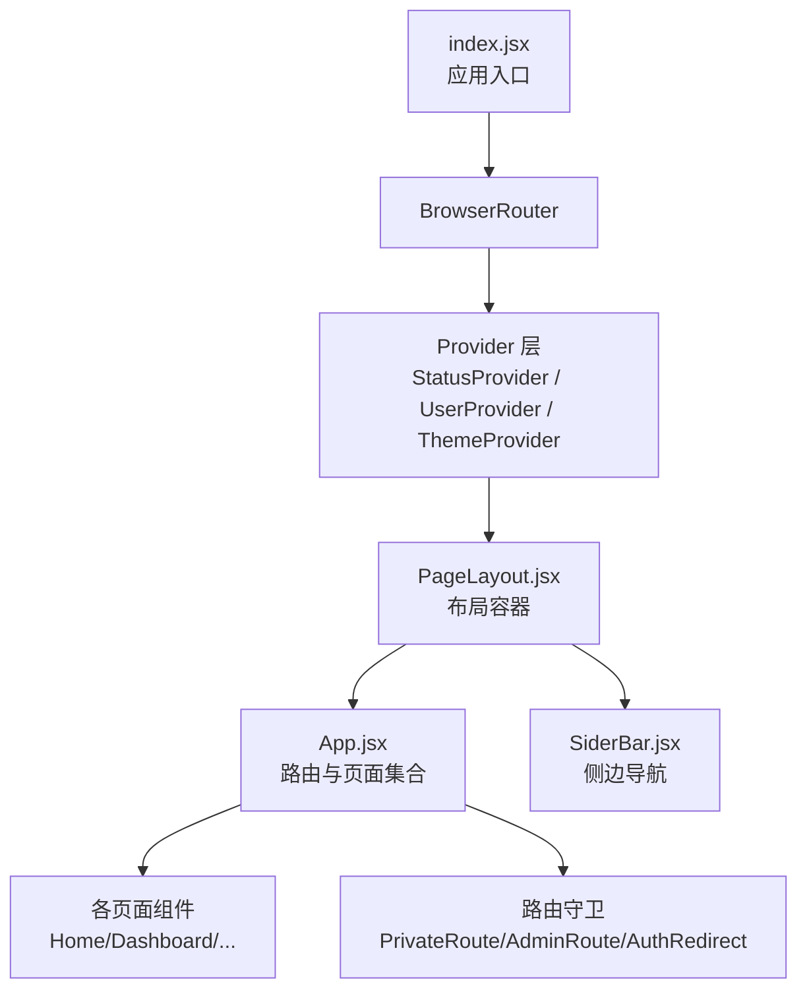
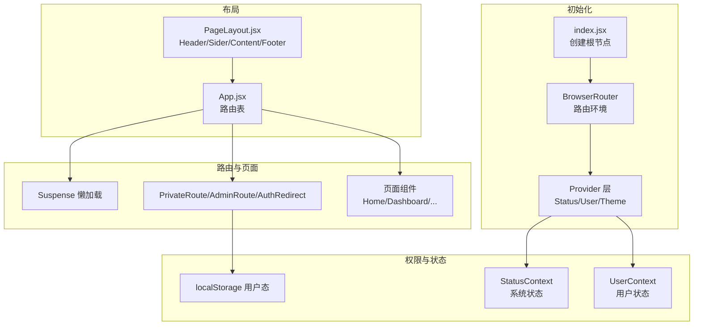
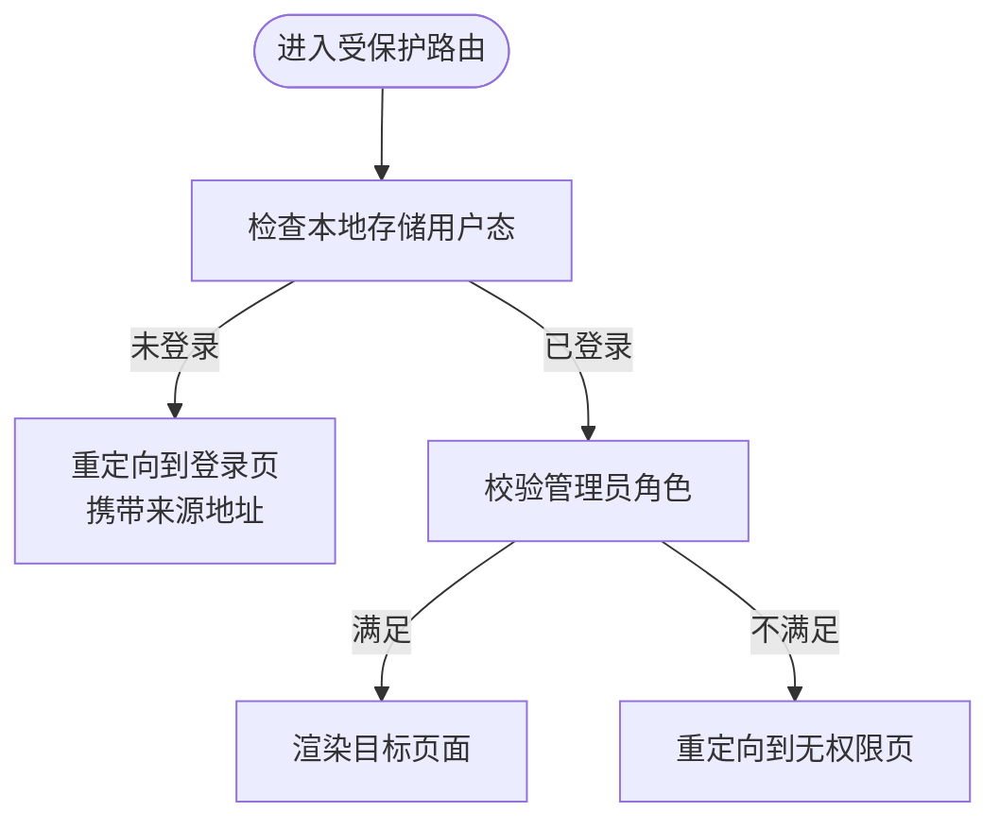
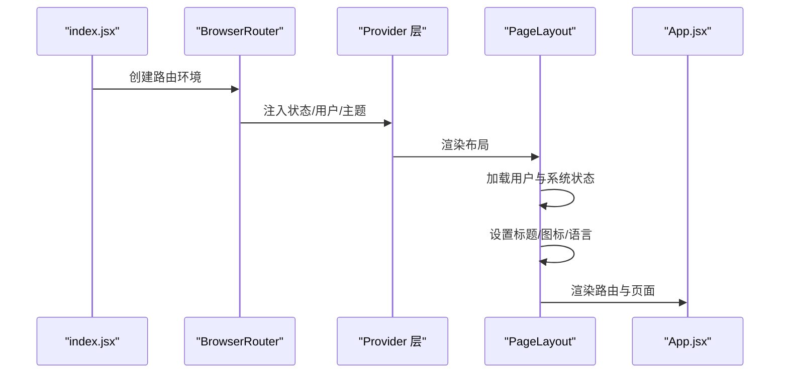
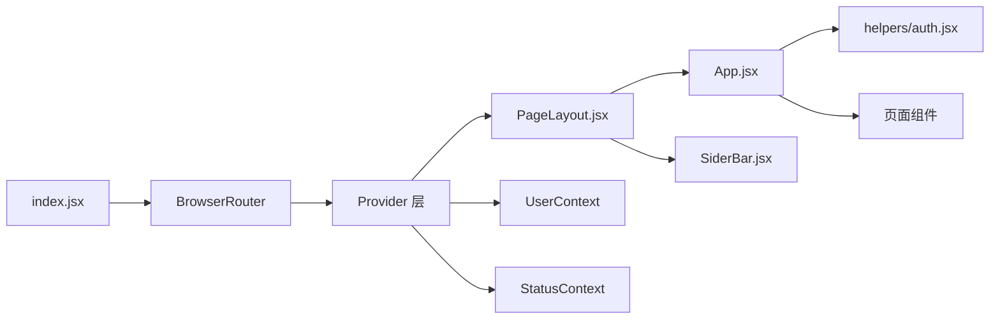

# React 应用架构

<cite>
**本文引用的文件**
- [web/src/App.jsx](file://web/src/App.jsx)
- [web/src/index.jsx](file://web/src/index.jsx)
- [web/src/helpers/auth.jsx](file://web/src/helpers/auth.jsx)
- [web/src/components/layout/PageLayout.jsx](file://web/src/components/layout/PageLayout.jsx)
- [web/src/context/User/index.jsx](file://web/src/context/User/index.jsx)
- [web/src/context/User/reducer.js](file://web/src/context/User/reducer.js)
- [web/src/context/Status/index.jsx](file://web/src/context/Status/index.jsx)
- [web/src/context/Status/reducer.js](file://web/src/context/Status/reducer.js)
- [web/src/components/layout/SiderBar.jsx](file://web/src/components/layout/SiderBar.jsx)
- [web/src/pages/Home/index.jsx](file://web/src/pages/Home/index.jsx)
- [web/src/pages/Dashboard/index.jsx](file://web/src/pages/Dashboard/index.jsx)
</cite>

## 目录
1. [简介](#简介)
2. [项目结构](#项目结构)
3. [核心组件](#核心组件)
4. [架构总览](#架构总览)
5. [组件与路由详解](#组件与路由详解)
6. [依赖关系分析](#依赖关系分析)
7. [性能考量](#性能考量)
8. [故障排查指南](#故障排查指南)
9. [结论](#结论)
10. [附录](#附录)

## 简介
本文件面向 New API 的 React 前端应用，系统化梳理其路由配置、页面组织、权限控制与状态上下文管理。重点覆盖以下方面：
- 组件层次结构与布局容器
- 路由守卫机制（PrivateRoute、AdminRoute、AuthRedirect）的实现原理与使用场景
- 懒加载路由、Suspense 处理与动态路由参数
- 应用初始化流程、状态上下文管理与权限控制
- 路由配置最佳实践、页面组件设计模式与性能优化建议

## 项目结构
前端入口位于 web/src/index.jsx，通过 BrowserRouter 包裹全局 Provider（状态、用户、主题），并挂载 PageLayout 作为根布局；PageLayout 内部渲染 App.jsx，后者集中定义所有路由与页面组件。

图表来源
- [web/src/index.jsx:55-77](file://web/src/index.jsx#L55-L77)
- [web/src/components/layout/PageLayout.jsx:147-238](file://web/src/components/layout/PageLayout.jsx#L147-L238)
- [web/src/App.jsx:64-384](file://web/src/App.jsx#L64-L384)

章节来源
- [web/src/index.jsx:55-77](file://web/src/index.jsx#L55-L77)
- [web/src/components/layout/PageLayout.jsx:44-118](file://web/src/components/layout/PageLayout.jsx#L44-L118)
- [web/src/App.jsx:64-384](file://web/src/App.jsx#L64-L384)

## 核心组件
- 应用入口与初始化
  - 在入口文件中，按序注入状态上下文、用户上下文、主题上下文，并通过 BrowserRouter 包裹应用，开启 v7 相对路径与过渡特性。
- 布局容器
  - PageLayout 负责头部、侧边栏、内容区与页脚的组织，同时负责加载用户与系统状态、国际化语言同步、标题与图标设置等。
- 路由与页面
  - App.jsx 定义全部路由，采用 Suspense 进行懒加载页面的水合等待，并在多处使用路由守卫保护受控区域。
- 权限守卫
  - helpers/auth.jsx 提供三类守卫：AuthRedirect（未登录才允许访问）、PrivateRoute（登录后才能访问）、AdminRoute（管理员及以上角色）。
- 上下文
  - User 与 Status 分别维护用户态与系统状态，配合 reducer 实现最小必要更新。

章节来源
- [web/src/index.jsx:55-77](file://web/src/index.jsx#L55-L77)
- [web/src/components/layout/PageLayout.jsx:44-118](file://web/src/components/layout/PageLayout.jsx#L44-L118)
- [web/src/App.jsx:64-384](file://web/src/App.jsx#L64-L384)
- [web/src/helpers/auth.jsx:35-68](file://web/src/helpers/auth.jsx#L35-L68)
- [web/src/context/User/index.jsx:30-57](file://web/src/context/User/index.jsx#L30-L57)
- [web/src/context/Status/index.jsx:28-36](file://web/src/context/Status/index.jsx#L28-L36)

## 架构总览
应用采用“入口 -> 布局 -> 路由”的三层结构。布局层负责全局行为（状态加载、国际化、UI 主题），路由层负责页面与权限控制，页面层负责具体业务展示与交互。

图表来源
- [web/src/index.jsx:55-77](file://web/src/index.jsx#L55-L77)
- [web/src/components/layout/PageLayout.jsx:147-238](file://web/src/components/layout/PageLayout.jsx#L147-L238)
- [web/src/App.jsx:64-384](file://web/src/App.jsx#L64-L384)
- [web/src/helpers/auth.jsx:35-68](file://web/src/helpers/auth.jsx#L35-L68)

## 组件与路由详解

### 路由守卫机制
- AuthRedirect
  - 场景：仅未登录用户可访问的页面（如登录、注册、重置密码）。
  - 行为：若检测到本地存在用户信息则重定向至控制台；否则放行。
- PrivateRoute
  - 场景：需要登录的普通功能页面（如仪表盘、聊天、充值、日志）。
  - 行为：未登录则重定向至登录页，并携带来源地址以便登录后回跳。
- AdminRoute
  - 场景：后台管理区域（如模型管理、用户管理、系统设置）。
  - 行为：未登录重定向至登录；登录但非管理员或角色不满足则重定向至无权限页。

图表来源
- [web/src/helpers/auth.jsx:35-68](file://web/src/helpers/auth.jsx#L35-L68)

章节来源
- [web/src/helpers/auth.jsx:35-68](file://web/src/helpers/auth.jsx#L35-L68)

### 懒加载与 Suspense
- 入口与路由中的懒加载
  - App.jsx 中对首页、控制台、关于、隐私政策、用户协议等页面使用 React.lazy 与 Suspense 包裹，确保首屏快速渲染。
  - 动态路由参数
    - OAuth 回调支持动态 provider 参数，通过 useParams 提取并在组件内消费。
    - 聊天路由支持可选的 id 参数，便于直接打开指定会话。
- 关键实现位置
  - 懒加载与 Suspense 使用集中在 App.jsx 的路由定义段落。
  - 动态路由参数处理集中在 App.jsx 的动态回调组件。

章节来源
- [web/src/App.jsx:53-57](file://web/src/App.jsx#L53-L57)
- [web/src/App.jsx:59-62](file://web/src/App.jsx#L59-L62)
- [web/src/App.jsx:362-368](file://web/src/App.jsx#L362-L368)
- [web/src/App.jsx:90-100](file://web/src/App.jsx#L90-L100)

### 页面组织与布局
- 布局容器
  - PageLayout 负责头部、侧边栏、内容区与页脚的组织；根据路由路径决定是否显示侧边栏、是否隐藏页脚、是否对内容区进行内边距处理。
  - 初始化阶段加载用户与系统状态，设置标题与图标，并根据用户偏好语言切换 i18n。
- 侧边导航
  - SiderBar 根据模块可见性与用户角色动态生成菜单项，支持工作区、个人中心与管理员三大区块；聊天子菜单支持从本地存储动态注入多个会话项。
- 页面组件
  - Home 页面负责首页内容加载、公告弹窗、端点轮播与第三方图标展示。
  - Dashboard 页面作为控制台首页，简单包装通用 Dashboard 组件并处理基础样式。

章节来源
- [web/src/components/layout/PageLayout.jsx:44-118](file://web/src/components/layout/PageLayout.jsx#L44-L118)
- [web/src/components/layout/SiderBar.jsx:33-52](file://web/src/components/layout/SiderBar.jsx#L33-L52)
- [web/src/components/layout/SiderBar.jsx:148-201](file://web/src/components/layout/SiderBar.jsx#L148-L201)
- [web/src/components/layout/SiderBar.jsx:240-272](file://web/src/components/layout/SiderBar.jsx#L240-L272)
- [web/src/pages/Home/index.jsx:68-142](file://web/src/pages/Home/index.jsx#L68-L142)
- [web/src/pages/Dashboard/index.jsx:20-29](file://web/src/pages/Dashboard/index.jsx#L20-L29)

### 应用初始化流程
- 入口初始化
  - 创建根节点，启用 v7 路由新特性，注入 Provider 层。
- 布局初始化
  - 加载用户信息（本地存储）并写入用户上下文；拉取系统状态并写入状态上下文；设置页面标题与图标；根据用户设置或本地存储的语言偏好切换 i18n。
- 路由与页面
  - App.jsx 定义路由表，结合守卫与懒加载实现安全与性能兼顾的页面访问。

图表来源
- [web/src/index.jsx:55-77](file://web/src/index.jsx#L55-L77)
- [web/src/components/layout/PageLayout.jsx:81-118](file://web/src/components/layout/PageLayout.jsx#L81-L118)
- [web/src/App.jsx:64-384](file://web/src/App.jsx#L64-L384)

章节来源
- [web/src/index.jsx:55-77](file://web/src/index.jsx#L55-L77)
- [web/src/components/layout/PageLayout.jsx:81-118](file://web/src/components/layout/PageLayout.jsx#L81-L118)
- [web/src/App.jsx:64-384](file://web/src/App.jsx#L64-L384)

### 权限控制机制
- 用户态来源
  - 用户信息来自本地存储，布局初始化时读取并写入用户上下文；用户上下文提供语言偏好同步能力。
- 角色判定
  - AdminRoute 通过解析本地存储中的用户角色字段进行管理员判定；AuthRedirect 用于避免已登录用户重复访问登录页。
- 状态驱动的动态配置
  - App.jsx 通过 StatusContext 中的 HeaderNavModules 配置动态决定“定价”页面是否需要登录。

章节来源
- [web/src/components/layout/PageLayout.jsx:81-87](file://web/src/components/layout/PageLayout.jsx#L81-L87)
- [web/src/context/User/index.jsx:30-57](file://web/src/context/User/index.jsx#L30-L57)
- [web/src/helpers/auth.jsx:35-68](file://web/src/helpers/auth.jsx#L35-L68)
- [web/src/App.jsx:69-88](file://web/src/App.jsx#L69-L88)

### 路由配置最佳实践
- 将公共页面与受控页面分离，优先使用 AuthRedirect 与 PrivateRoute/ AdminRoute 保护敏感区域。
- 对于大型页面采用 Suspense + lazy 懒加载，减少首屏体积。
- 动态路由参数使用 useParams 接收，避免硬编码路径。
- 使用 StatusContext 驱动的动态配置控制页面访问策略（如定价页是否需要登录）。

章节来源
- [web/src/App.jsx:90-100](file://web/src/App.jsx#L90-L100)
- [web/src/App.jsx:59-62](file://web/src/App.jsx#L59-L62)
- [web/src/App.jsx:319-336](file://web/src/App.jsx#L319-L336)

### 页面组件设计模式
- 布局容器模式：PageLayout 负责全局行为，App.jsx 负责路由与页面，形成清晰职责分离。
- 懒加载模式：通过 React.lazy 与 Suspense 实现按需加载，提升首屏性能。
- 动态菜单模式：SiderBar 根据模块可见性与用户角色动态生成菜单，支持扩展与配置化。

章节来源
- [web/src/components/layout/PageLayout.jsx:147-238](file://web/src/components/layout/PageLayout.jsx#L147-L238)
- [web/src/components/layout/SiderBar.jsx:33-52](file://web/src/components/layout/SiderBar.jsx#L33-L52)
- [web/src/components/layout/SiderBar.jsx:148-201](file://web/src/components/layout/SiderBar.jsx#L148-L201)

## 依赖关系分析
- 入口依赖
  - index.jsx 依赖 BrowserRouter、Provider 层与 PageLayout。
- 布局依赖
  - PageLayout 依赖用户与状态上下文、国际化与图标库，内部渲染 App。
- 路由与守卫
  - App.jsx 依赖路由守卫与页面组件；守卫依赖本地存储用户态。
- 上下文
  - User 与 Status 通过 reducer 管理状态，避免不必要的重渲染。

图表来源
- [web/src/index.jsx:55-77](file://web/src/index.jsx#L55-L77)
- [web/src/components/layout/PageLayout.jsx:147-238](file://web/src/components/layout/PageLayout.jsx#L147-L238)
- [web/src/App.jsx:64-384](file://web/src/App.jsx#L64-L384)
- [web/src/helpers/auth.jsx:35-68](file://web/src/helpers/auth.jsx#L35-L68)

章节来源
- [web/src/index.jsx:55-77](file://web/src/index.jsx#L55-L77)
- [web/src/components/layout/PageLayout.jsx:147-238](file://web/src/components/layout/PageLayout.jsx#L147-L238)
- [web/src/App.jsx:64-384](file://web/src/App.jsx#L64-L384)
- [web/src/helpers/auth.jsx:35-68](file://web/src/helpers/auth.jsx#L35-L68)

## 性能考量
- 首屏优化
  - 使用 Suspense + lazy 按需加载页面，减少初始包体。
  - 首页内容异步加载并缓存，避免重复请求。
- 渲染优化
  - 布局容器根据路由路径动态决定侧边栏与页脚显示，降低无效渲染。
  - 侧边栏菜单项按模块可见性与角色过滤，减少 DOM 结构复杂度。
- 状态管理
  - 使用 useReducer 与 Context 管理用户与系统状态，避免深层传递与重复渲染。

章节来源
- [web/src/App.jsx:90-100](file://web/src/App.jsx#L90-L100)
- [web/src/pages/Home/index.jsx:84-111](file://web/src/pages/Home/index.jsx#L84-L111)
- [web/src/components/layout/PageLayout.jsx:65-73](file://web/src/components/layout/PageLayout.jsx#L65-L73)
- [web/src/components/layout/SiderBar.jsx:110-123](file://web/src/components/layout/SiderBar.jsx#L110-L123)

## 故障排查指南
- 登录后仍被重定向到登录页
  - 检查本地存储中用户信息是否存在与格式是否正确；确认守卫逻辑与来源地址携带是否正常。
- 已登录用户被重定向到无权限页
  - 检查用户角色字段是否满足管理员要求；确认 AdminRoute 的角色判断逻辑。
- 侧边栏菜单不显示或显示异常
  - 检查模块可见性配置与用户角色；确认聊天会话列表本地存储格式是否正确。
- 首页内容未加载或加载失败
  - 检查系统状态接口返回与缓存逻辑；确认首页内容接口可用性。

章节来源
- [web/src/helpers/auth.jsx:35-68](file://web/src/helpers/auth.jsx#L35-L68)
- [web/src/components/layout/SiderBar.jsx:240-272](file://web/src/components/layout/SiderBar.jsx#L240-L272)
- [web/src/pages/Home/index.jsx:84-111](file://web/src/pages/Home/index.jsx#L84-L111)

## 结论
该 React 应用通过清晰的三层结构（入口 -> 布局 -> 路由）、完善的路由守卫与上下文管理，实现了安全、可扩展且高性能的前端体验。结合懒加载与动态配置，既保证了首屏性能，又提供了灵活的权限与页面控制能力。建议在后续迭代中持续关注路由健壮性与状态一致性，进一步完善错误边界与国际化覆盖。

## 附录
- 路由守卫使用清单
  - 登录/注册/重置密码：AuthRedirect
  - 控制台与功能页面：PrivateRoute
  - 后台管理：AdminRoute
- 动态路由参数
  - OAuth provider：动态参数
  - 聊天会话：可选 id 参数
- 上下文与状态
  - UserContext：用户态与语言偏好同步
  - StatusContext：系统状态与模块可见性配置