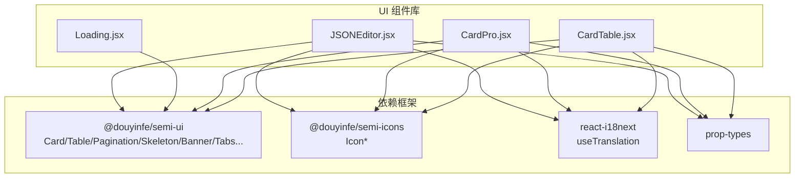
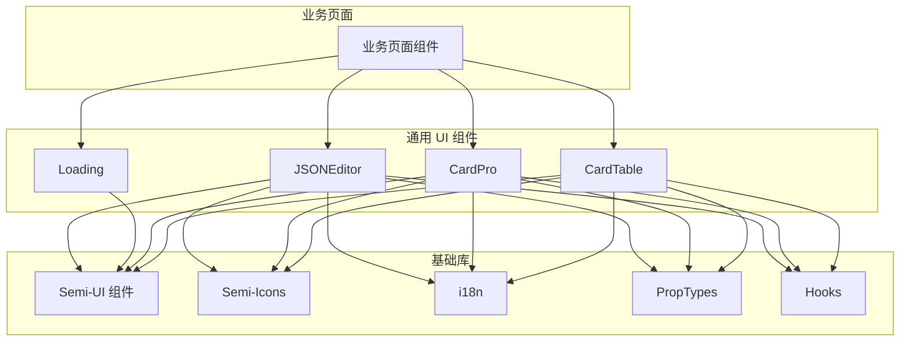
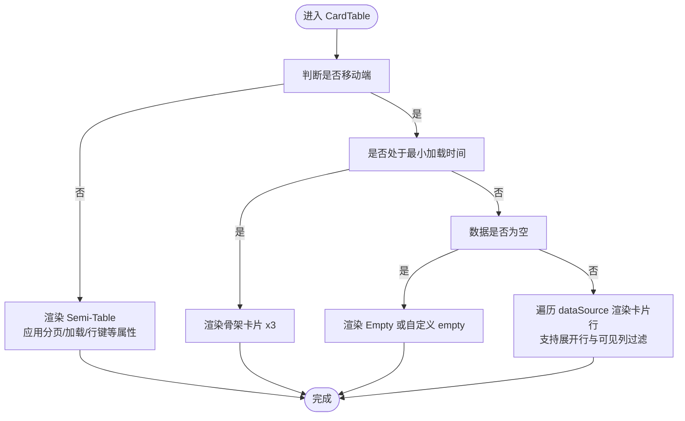
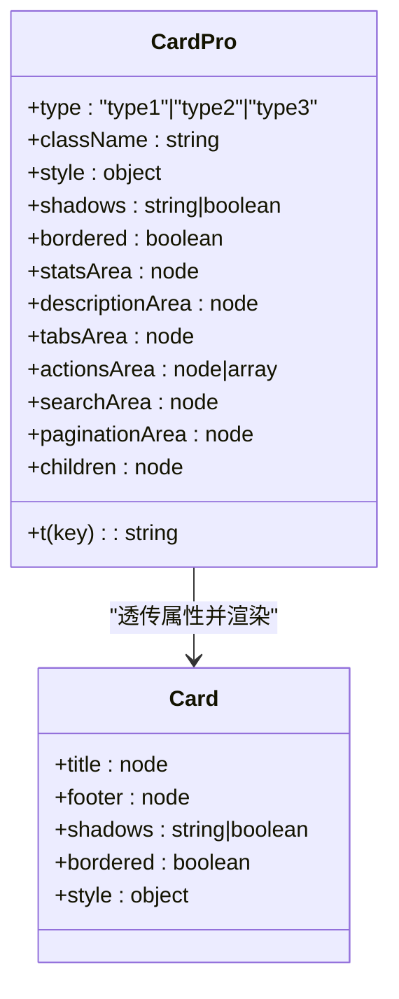
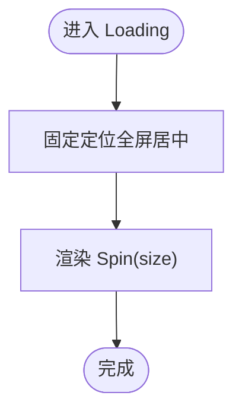
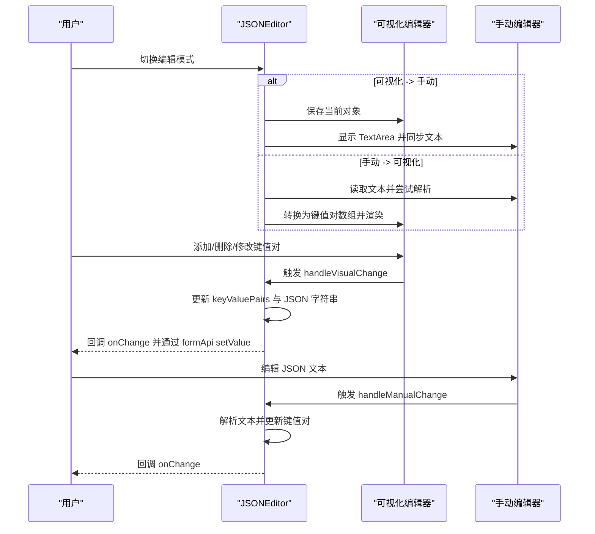
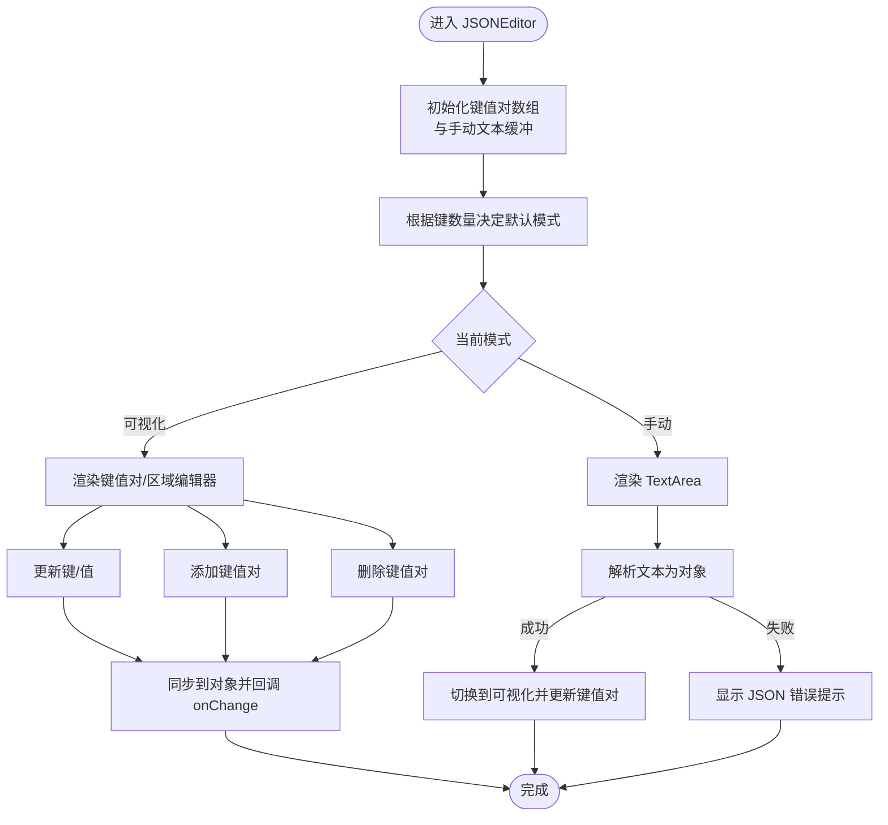
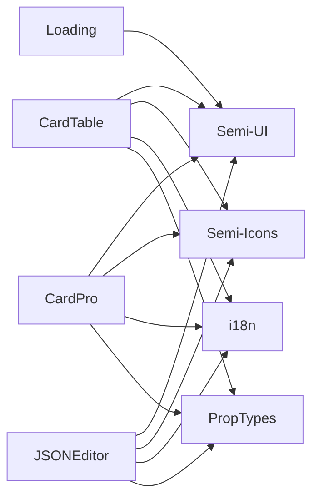

# UI 组件库

<cite>
**本文引用的文件**
- [CardTable.jsx](file://web/src/components/common/ui/CardTable.jsx)
- [CardPro.jsx](file://web/src/components/common/ui/CardPro.jsx)
- [Loading.jsx](file://web/src/components/common/ui/Loading.jsx)
- [JSONEditor.jsx](file://web/src/components/common/ui/JSONEditor.jsx)
</cite>

## 目录
1. [简介](#简介)
2. [项目结构](#项目结构)
3. [核心组件](#核心组件)
4. [架构总览](#架构总览)
5. [详细组件分析](#详细组件分析)
6. [依赖关系分析](#依赖关系分析)
7. [性能考量](#性能考量)
8. [故障排查指南](#故障排查指南)
9. [结论](#结论)
10. [附录](#附录)

## 简介
本文件面向 New API 的前端 UI 组件库，聚焦于基于 @douyinfe/semi-ui 的通用组件，系统梳理并深度解析以下核心组件的设计与实现：
- CardTable：响应式表格组件，桌面端使用 Semi-UI Table，移动端以卡片形式逐行展示，并支持骨架屏、空态、分页与展开行等能力。
- CardPro：高级卡片容器，提供六区布局（统计信息、描述信息、标签/切换、操作按钮、搜索表单、分页），支持三种布局类型与移动端折叠控制。
- Loading：全局加载指示器，居中显示 Spin。
- JSONEditor：可视化与手动双模式的 JSON 编辑器，支持键值对编辑、区域编辑、模板填充、重复键检测与表单集成。

文档从架构、数据流、处理逻辑、组合模式、状态管理与性能优化等维度进行说明，并提供使用示例路径、最佳实践与常见问题解决方案。

## 项目结构
组件位于 web/src/components/common/ui 目录下，采用按功能分组的组织方式，便于复用与维护：
- CardTable.jsx：响应式表格封装
- CardPro.jsx：卡片容器与布局
- Loading.jsx：全局加载
- JSONEditor.jsx：JSON 编辑器

**图表来源**
- [CardTable.jsx:20-35](file://web/src/components/common/ui/CardTable.jsx#L20-L35)
- [CardPro.jsx:20-26](file://web/src/components/common/ui/CardPro.jsx#L20-L26)
- [Loading.jsx:20-21](file://web/src/components/common/ui/Loading.jsx#L20-L21)
- [JSONEditor.jsx:20-41](file://web/src/components/common/ui/JSONEditor.jsx#L20-L41)

**章节来源**
- [CardTable.jsx:1-243](file://web/src/components/common/ui/CardTable.jsx#L1-L243)
- [CardPro.jsx:1-201](file://web/src/components/common/ui/CardPro.jsx#L1-L201)
- [Loading.jsx:1-32](file://web/src/components/common/ui/Loading.jsx#L1-L32)
- [JSONEditor.jsx:1-719](file://web/src/components/common/ui/JSONEditor.jsx#L1-L719)

## 核心组件
本节概述四个组件的功能定位、典型使用场景与关键特性：
- CardTable：用于替代 Semi-UI Table 的响应式组件，自动根据设备选择渲染策略；支持可见列过滤、骨架屏、空态、分页与展开行。
- CardPro：卡片容器，提供六区布局与三种布局类型，支持移动端“显示/隐藏操作项”切换、分页区域固定在底部。
- Loading：全局加载遮罩，适合页面级或异步请求加载。
- JSONEditor：双模式 JSON 编辑器，支持键值对可视化编辑、区域编辑（默认/模型）、模板填充、重复键检测与表单联动。

**章节来源**
- [CardTable.jsx:36-74](file://web/src/components/common/ui/CardTable.jsx#L36-L74)
- [CardPro.jsx:28-43](file://web/src/components/common/ui/CardPro.jsx#L28-L43)
- [Loading.jsx:23-29](file://web/src/components/common/ui/Loading.jsx#L23-L29)
- [JSONEditor.jsx:49-65](file://web/src/components/common/ui/JSONEditor.jsx#L49-L65)

## 架构总览
四个组件均以 Semi-UI 为基础，结合 react-i18next 实现国际化，使用 prop-types 进行运行时校验，并通过 hooks 提升可复用性与可测试性。

**图表来源**
- [CardTable.jsx:20-35](file://web/src/components/common/ui/CardTable.jsx#L20-L35)
- [CardPro.jsx:20-26](file://web/src/components/common/ui/CardPro.jsx#L20-L26)
- [Loading.jsx:20-21](file://web/src/components/common/ui/Loading.jsx#L20-L21)
- [JSONEditor.jsx:20-41](file://web/src/components/common/ui/JSONEditor.jsx#L20-L41)

## 详细组件分析

### CardTable 组件
- 设计目标：在桌面端使用 Semi-UI Table，在移动端以卡片逐行展示，统一 API，降低迁移成本。
- 关键能力：
  - 设备自适应：桌面端直接渲染 Table；移动端渲染为卡片列表，每行卡片包含标题-值对。
  - 骨架屏：通过最小加载时间钩子在 loading 期间渲染占位骨架，提升感知性能。
  - 可见列过滤：支持 visibleColumns 控制列显示。
  - 空态：当数据为空时渲染 Empty。
  - 展开行：支持 expandedRowRender 与 rowExpandable。
  - 分页：支持 pagination 与 hidePagination。
  - 行键：rowKey 支持字符串或函数。
- 性能与可访问性：
  - 使用 getRowKey 规范化行键，避免重复 key。
  - 移动端卡片使用语义化的 div 结构与可选的展开按钮，配合无障碍图标。
- 使用建议：
  - 桌面端优先使用原生 Table 的分页与排序能力；移动端仅在必要时启用分页。
  - visibleColumns 与列渲染函数配合，减少移动端卡片渲染压力。

**图表来源**
- [CardTable.jsx:60-231](file://web/src/components/common/ui/CardTable.jsx#L60-L231)

**章节来源**
- [CardTable.jsx:36-242](file://web/src/components/common/ui/CardTable.jsx#L36-L242)

### CardPro 组件
- 设计目标：提供统一的卡片容器与六区布局，支持多种布局类型与移动端折叠。
- 六区布局：
  - 统计信息区域（type2）
  - 描述信息区域（type1/type3）
  - 标签/切换区域（type3）
  - 操作按钮区域（type1/type3）
  - 搜索表单区域（所有类型可选）
  - 分页区域（固定在卡片底部）
- 布局类型：
  - type1：操作型（描述信息 + 操作按钮 + 搜索表单）
  - type2：查询型（统计信息 + 搜索表单）
  - type3：复杂型（描述信息 + 标签/切换 + 操作按钮 + 搜索表单）
- 移动端交互：提供“显示/隐藏操作项”按钮，折叠操作区与搜索区，仅保留描述区。
- 样式与扩展：支持 className、style、shadows、bordered 等透传至 Card。

**图表来源**
- [CardPro.jsx:44-63](file://web/src/components/common/ui/CardPro.jsx#L44-L63)
- [CardPro.jsx:161-173](file://web/src/components/common/ui/CardPro.jsx#L161-L173)

**章节来源**
- [CardPro.jsx:28-200](file://web/src/components/common/ui/CardPro.jsx#L28-L200)

### Loading 组件
- 设计目标：提供全局加载遮罩，居中显示 Spin。
- 关键点：
  - fixed 定位全屏覆盖，垂直水平居中。
  - size 支持 small/medium/large，默认 small。
- 使用建议：
  - 适用于页面级加载或长任务等待；避免在高频触发的局部区域频繁创建/销毁实例。

**图表来源**
- [Loading.jsx:23-29](file://web/src/components/common/ui/Loading.jsx#L23-L29)

**章节来源**
- [Loading.jsx:23-31](file://web/src/components/common/ui/Loading.jsx#L23-L31)

### JSONEditor 组件
- 设计目标：提供可视化与手动两种编辑模式，支持键值对、区域编辑、模板填充、重复键检测与表单集成。
- 编辑模式：
  - 可视化：键值对卡片，自动识别布尔/数字/对象/字符串类型，动态渲染对应输入控件。
  - 手动：TextArea，支持粘贴/编辑 JSON 文本。
- 数据结构与同步：
  - 内部以键值对数组存储，唯一 id 保证 React key 稳定；支持对象/字符串双向转换。
  - 外部 value 变化时，通过 effect 同步内部状态，避免循环更新。
- 功能特性：
  - 重复键检测：高亮并提示重复键影响。
  - 区域编辑：默认区域 + 模型专用区域，适合多模型配置。
  - 模板填充：支持传入 template 与 templateLabel，一键填充。
  - 表单集成：通过 formApi 与 field 实现校验与数据绑定。
- 性能与可用性：
  - 大对象自动切换到手动模式，提升交互体验。
  - 输入转换：字符串 true/false/数字自动类型推断。
  - 错误提示：JSON 解析失败时显示 Banner。

**图表来源**
- [JSONEditor.jsx:229-264](file://web/src/components/common/ui/JSONEditor.jsx#L229-L264)
- [JSONEditor.jsx:185-227](file://web/src/components/common/ui/JSONEditor.jsx#L185-L227)
- [JSONEditor.jsx:670-702](file://web/src/components/common/ui/JSONEditor.jsx#L670-L702)

**图表来源**
- [JSONEditor.jsx:96-132](file://web/src/components/common/ui/JSONEditor.jsx#L96-L132)
- [JSONEditor.jsx:136-151](file://web/src/components/common/ui/JSONEditor.jsx#L136-L151)
- [JSONEditor.jsx:266-336](file://web/src/components/common/ui/JSONEditor.jsx#L266-L336)

**章节来源**
- [JSONEditor.jsx:49-718](file://web/src/components/common/ui/JSONEditor.jsx#L49-L718)

## 依赖关系分析
- 组件间耦合度低，均以 Semi-UI 作为基础 UI 库，通过 props 与 hooks 进行解耦。
- 国际化：统一通过 react-i18next 的 useTranslation 提供翻译能力。
- 类型校验：使用 prop-types 对对外暴露的 props 进行运行时校验，提升健壮性。
- 可复用性：useIsMobile、useMinimumLoadingTime 等 hooks 提升跨组件复用。

**图表来源**
- [CardTable.jsx:20-35](file://web/src/components/common/ui/CardTable.jsx#L20-L35)
- [CardPro.jsx:20-26](file://web/src/components/common/ui/CardPro.jsx#L20-L26)
- [Loading.jsx:20-21](file://web/src/components/common/ui/Loading.jsx#L20-L21)
- [JSONEditor.jsx:20-41](file://web/src/components/common/ui/JSONEditor.jsx#L20-L41)

**章节来源**
- [CardTable.jsx:20-35](file://web/src/components/common/ui/CardTable.jsx#L20-L35)
- [CardPro.jsx:20-26](file://web/src/components/common/ui/CardPro.jsx#L20-L26)
- [Loading.jsx:20-21](file://web/src/components/common/ui/Loading.jsx#L20-L21)
- [JSONEditor.jsx:20-41](file://web/src/components/common/ui/JSONEditor.jsx#L20-L41)

## 性能考量
- CardTable
  - 骨架屏：通过最小加载时间钩子避免闪烁，提升感知性能。
  - 可见列过滤：减少移动端卡片渲染列数，降低 DOM 体积。
  - 分页：在移动端谨慎启用，避免频繁渲染大量卡片。
- CardPro
  - 移动端折叠：隐藏操作区与搜索区，减少一次性渲染节点数。
  - 分页区域固定：避免内容区频繁重排。
- JSONEditor
  - 大对象自动切换手动模式，避免可视化渲染过多键值对。
  - 唯一 id 稳定化：减少列表重排与重渲染。
  - 双向同步：外部 value 变化时仅在必要时更新，避免循环更新。
- Loading
  - 全屏覆盖：仅在需要时渲染，避免不必要的 DOM 节点。

[本节为通用性能指导，不直接分析具体文件]

## 故障排查指南
- CardTable
  - 问题：移动端空白或只显示骨架屏
    - 排查：确认 loading 是否正确传递；检查 visibleColumns 与列配置。
  - 问题：展开行不显示
    - 排查：确认 expandedRowRender 与 rowExpandable 条件满足。
- CardPro
  - 问题：移动端操作区未折叠
    - 排查：确认 actionsArea 或 searchArea 是否存在；检查 isMobile 判断。
  - 问题：分页区域未固定在底部
    - 排查：确认 paginationArea 是否传入。
- JSONEditor
  - 问题：切换模式后数据丢失
    - 排查：确认外部 value 与内部状态同步逻辑；检查 formApi.setValue 调用。
  - 问题：重复键导致误解读
    - 排查：查看重复键高亮与提示文案；确认最终对象仅保留最后一个同名键值。
  - 问题：手动模式 JSON 解析失败
    - 排查：查看错误提示 Banner；修正 JSON 格式。
- Loading
  - 问题：遮罩层无法关闭
    - 排查：确认组件是否仍被渲染；检查父组件的条件渲染逻辑。

**章节来源**
- [CardTable.jsx:76-129](file://web/src/components/common/ui/CardTable.jsx#L76-L129)
- [CardTable.jsx:137-204](file://web/src/components/common/ui/CardTable.jsx#L137-L204)
- [CardPro.jsx:97-113](file://web/src/components/common/ui/CardPro.jsx#L97-L113)
- [CardPro.jsx:145-157](file://web/src/components/common/ui/CardPro.jsx#L145-L157)
- [JSONEditor.jsx:136-151](file://web/src/components/common/ui/JSONEditor.jsx#L136-L151)
- [JSONEditor.jsx:229-264](file://web/src/components/common/ui/JSONEditor.jsx#L229-L264)
- [JSONEditor.jsx:660-667](file://web/src/components/common/ui/JSONEditor.jsx#L660-L667)
- [Loading.jsx:23-29](file://web/src/components/common/ui/Loading.jsx#L23-L29)

## 结论
本组件库以 Semi-UI 为核心，围绕响应式、可组合与易用性构建了通用 UI 组件：
- CardTable 提供统一的响应式表格体验，降低移动端适配成本。
- CardPro 通过六区布局与类型化设计，支撑多样业务卡片容器。
- Loading 提供简洁可靠的全局加载指示。
- JSONEditor 以双模式与强校验能力，满足复杂配置场景。

建议在实际业务中遵循“先卡片容器、再表格/表单”的组合思路，结合 hooks 与 i18n，实现一致的交互与视觉体验。

[本节为总结性内容，不直接分析具体文件]

## 附录
- 最佳实践
  - 使用 CardPro 的分页区域承载分页控件，确保在移动端也能稳定显示。
  - 在 CardTable 中合理使用 visibleColumns 与列渲染函数，减少移动端渲染负担。
  - JSONEditor 的模板功能可用于快速填充常用配置，提升运营效率。
  - Loading 组件应与业务状态管理配合，避免重复渲染与遮罩层堆积。
- 可访问性
  - 图标按钮提供可读文案；Skeleton 与 Banner 提供必要的状态提示。
  - 移动端交互使用明确的“显示/隐藏”按钮，提升可发现性。
- 响应式布局
  - 通过 useIsMobile 判定渲染策略；在小屏设备上优先简化布局与交互。

[本节为通用指导，不直接分析具体文件]