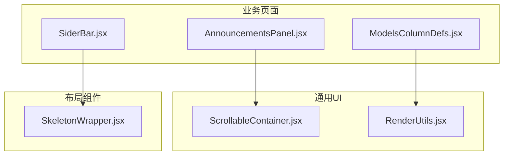
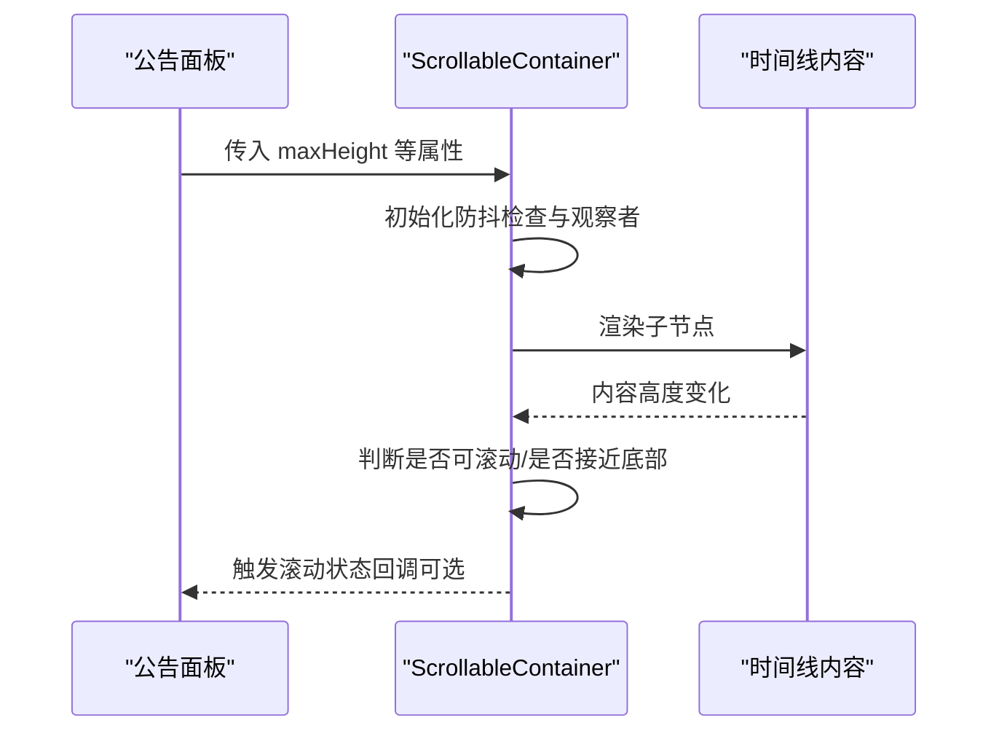
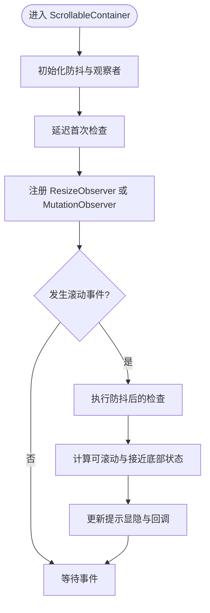
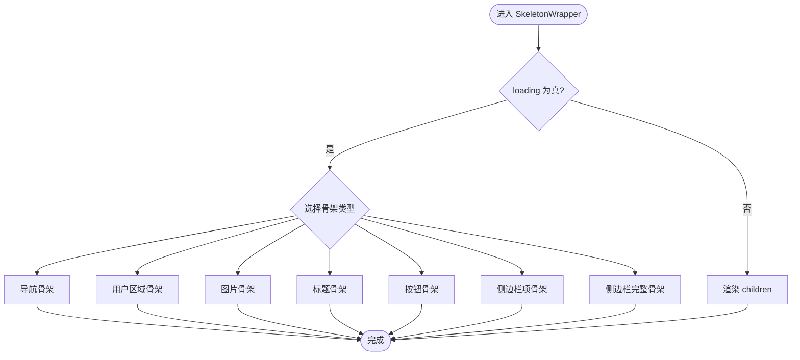
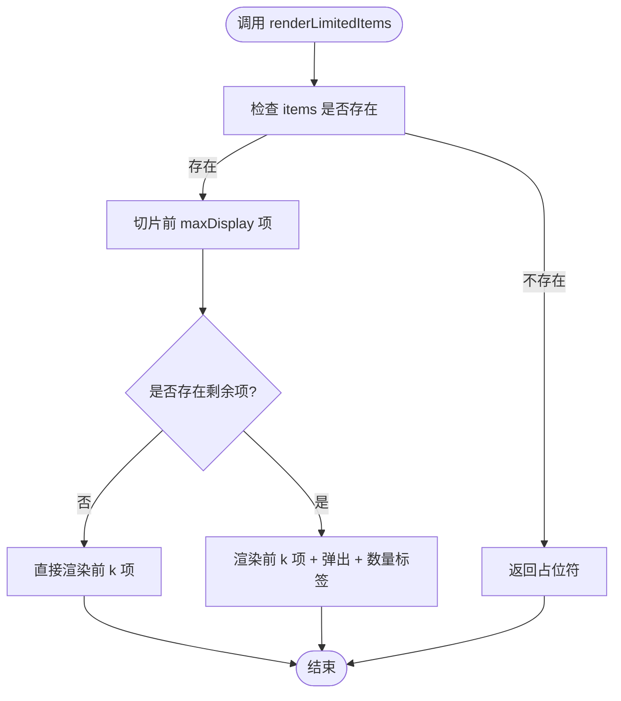
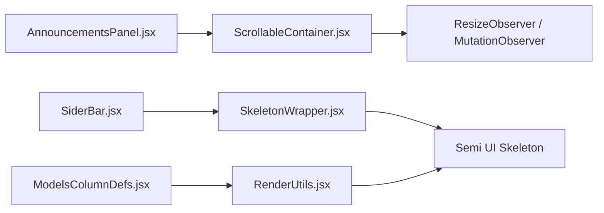

# 布局组件

<cite>
**本文引用的文件**
- [ScrollableContainer.jsx](file://web/src/components/common/ui/ScrollableContainer.jsx)
- [SkeletonWrapper.jsx](file://web/src/components/layout/components/SkeletonWrapper.jsx)
- [RenderUtils.jsx](file://web/src/components/common/ui/RenderUtils.jsx)
- [AnnouncementsPanel.jsx](file://web/src/components/dashboard/AnnouncementsPanel.jsx)
- [SiderBar.jsx](file://web/src/components/layout/SiderBar.jsx)
- [ModelsColumnDefs.jsx](file://web/src/components/table/models/ModelsColumnDefs.jsx)
</cite>

## 目录
1. [简介](#简介)
2. [项目结构](#项目结构)
3. [核心组件](#核心组件)
4. [架构总览](#架构总览)
5. [详细组件分析](#详细组件分析)
6. [依赖关系分析](#依赖关系分析)
7. [性能考量](#性能考量)
8. [故障排查指南](#故障排查指南)
9. [结论](#结论)
10. [附录](#附录)

## 简介
本文件聚焦 New API 前端布局辅助组件，围绕以下三个组件进行系统化文档化：
- ScrollableContainer：可滚动容器，负责滚动状态检测、边界判定与渐隐提示的呈现，并提供滚动控制与信息查询的实例方法。
- SkeletonWrapper：骨架屏包装器，根据类型渲染多种占位骨架，用于加载态的视觉反馈与交互体验优化。
- RenderUtils：渲染工具集，提供“有限项展示+弹出展开”和“超长文本省略+气泡提示”的通用渲染能力。

文档将从架构、数据流、处理逻辑、集成方式、性能与移动端适配等方面进行深入剖析，并给出常见布局场景、最佳实践与问题解决方案。

## 项目结构
这三个组件分别位于以下目录：
- ScrollableContainer 与 RenderUtils：位于通用 UI 组件目录，便于跨页面复用。
- SkeletonWrapper：位于布局组件目录，主要用于侧边栏等导航区域的加载态骨架渲染。

图表来源
- [ScrollableContainer.jsx:37-243](file://web/src/components/common/ui/ScrollableContainer.jsx#L37-L243)
- [SkeletonWrapper.jsx:23-380](file://web/src/components/layout/components/SkeletonWrapper.jsx#L23-L380)
- [RenderUtils.jsx:25-61](file://web/src/components/common/ui/RenderUtils.jsx#L25-L61)
- [AnnouncementsPanel.jsx:79-121](file://web/src/components/dashboard/AnnouncementsPanel.jsx#L79-L121)
- [SiderBar.jsx:396-491](file://web/src/components/layout/SiderBar.jsx#L396-L491)
- [ModelsColumnDefs.jsx:35-37](file://web/src/components/table/models/ModelsColumnDefs.jsx#L35-L37)

章节来源
- [ScrollableContainer.jsx:37-243](file://web/src/components/common/ui/ScrollableContainer.jsx#L37-L243)
- [SkeletonWrapper.jsx:23-380](file://web/src/components/layout/components/SkeletonWrapper.jsx#L23-L380)
- [RenderUtils.jsx:25-61](file://web/src/components/common/ui/RenderUtils.jsx#L25-L61)
- [AnnouncementsPanel.jsx:79-121](file://web/src/components/dashboard/AnnouncementsPanel.jsx#L79-L121)
- [SiderBar.jsx:396-491](file://web/src/components/layout/SiderBar.jsx#L396-L491)
- [ModelsColumnDefs.jsx:35-37](file://web/src/components/table/models/ModelsColumnDefs.jsx#L35-L37)

## 核心组件
- ScrollableContainer
  - 功能要点：检测内容是否可滚动、是否接近底部、显示底部渐隐提示；提供防抖检查、ResizeObserver/MutationObserver 兼容性处理；暴露实例方法用于滚动控制与信息查询。
  - 关键参数：最大高度、类名、滚动阈值、防抖延迟、检查间隔、回调钩子。
- SkeletonWrapper
  - 功能要点：按类型渲染多种骨架（导航、用户区、图片、标题、按钮、侧边栏项、侧边栏完整布局），支持移动端宽度差异、折叠态侧边栏、管理员可见性控制。
  - 关键参数：loading 状态、类型、重复次数、尺寸、移动端标记、折叠态、管理员开关、自定义类名。
- RenderUtils
  - 功能要点：renderLimitedItems 将列表限制显示数量并在有剩余时通过气泡弹窗展示全部；renderDescription 对长文本进行省略并提供 tooltip。
  - 关键参数：items 数组、渲染函数、最大显示数、文本内容、最大宽度。

章节来源
- [ScrollableContainer.jsx:37-243](file://web/src/components/common/ui/ScrollableContainer.jsx#L37-L243)
- [SkeletonWrapper.jsx:23-380](file://web/src/components/layout/components/SkeletonWrapper.jsx#L23-L380)
- [RenderUtils.jsx:25-61](file://web/src/components/common/ui/RenderUtils.jsx#L25-L61)

## 架构总览
三个组件在不同层级协同工作：
- 页面卡片或面板使用 ScrollableContainer 包裹可滚动内容，提升滚动体验与可访问性。
- 导航侧边栏使用 SkeletonWrapper 在加载期间提供一致的骨架占位，改善首屏与切换体验。
- 表格列定义使用 RenderUtils 渲染多值字段，避免拥挤与溢出，同时保留完整信息入口。

图表来源
- [AnnouncementsPanel.jsx:79-121](file://web/src/components/dashboard/AnnouncementsPanel.jsx#L79-L121)
- [ScrollableContainer.jsx:80-102](file://web/src/components/common/ui/ScrollableContainer.jsx#L80-L102)
- [ScrollableContainer.jsx:104-117](file://web/src/components/common/ui/ScrollableContainer.jsx#L104-L117)
- [ScrollableContainer.jsx:159-193](file://web/src/components/common/ui/ScrollableContainer.jsx#L159-L193)

## 详细组件分析

### ScrollableContainer 可滚动容器
- 滚动行为与边界检测
  - 使用 scrollHeight 与 clientHeight 判断可滚动性；通过 scrollTop + clientHeight 与 scrollHeight 的比较判断是否接近底部，结合阈值参数避免微小误差导致的状态抖动。
  - 暴露实例方法：checkScrollable 主动刷新状态；scrollToTop/scrollToBottom 快速滚动至顶部/底部；getScrollInfo 获取当前滚动信息。
- 性能优化
  - 防抖检查：默认约 60fps 的节流，减少频繁计算与重排。
  - 观察者：优先使用 ResizeObserver；若不支持则回退到 MutationObserver；均在卸载时清理。
  - 延迟首次检查：避免 DOM 尚未稳定时的误判。
- 响应式与样式
  - 支持通过 maxHeight 控制容器最大高度；渐隐指示器仅在需要时显示，避免视觉干扰。
- 错误处理
  - 引用为空时安全返回；观察者与定时器在卸载时清理，防止内存泄漏。

图表来源
- [ScrollableContainer.jsx:63-102](file://web/src/components/common/ui/ScrollableContainer.jsx#L63-L102)
- [ScrollableContainer.jsx:104-117](file://web/src/components/common/ui/ScrollableContainer.jsx#L104-L117)
- [ScrollableContainer.jsx:159-193](file://web/src/components/common/ui/ScrollableContainer.jsx#L159-L193)

章节来源
- [ScrollableContainer.jsx:37-243](file://web/src/components/common/ui/ScrollableContainer.jsx#L37-L243)

### SkeletonWrapper 骨架屏包装器
- 加载状态管理
  - 当 loading 为 false 时直接渲染真实子节点；为 true 时根据 type 渲染对应骨架。
- 动画与视觉
  - 使用 Semi UI 的 Skeleton 组件，配合 active 动效与占位符，保证加载态的一致性与流畅感。
- 类型与布局
  - 支持导航链接、用户区域、图片、标题、按钮、侧边栏项、侧边栏完整布局等类型。
  - 侧边栏骨架支持 collapsed 折叠态与 showAdmin 管理员可见性控制，按模块分组渲染。
- 移动端适配
  - 通过 isMobile 参数调整骨架尺寸与间距，确保在窄屏设备上的可读性与紧凑性。

图表来源
- [SkeletonWrapper.jsx:35-377](file://web/src/components/layout/components/SkeletonWrapper.jsx#L35-L377)

章节来源
- [SkeletonWrapper.jsx:23-380](file://web/src/components/layout/components/SkeletonWrapper.jsx#L23-L380)

### RenderUtils 渲染工具
- 条件渲染与动态组件
  - renderLimitedItems：对数组进行切片，限制显示数量，剩余项通过 Popover 展示，避免表格列拥挤。
  - renderDescription：对长文本使用 Typography.Text 并开启 ellipsis，超过最大宽度时显示 tooltip。
- 复杂度与性能
  - 切片操作为 O(k)，其中 k 为 maxDisplay；Popover 内容惰性渲染，仅在打开时生成。
- 使用场景
  - 在表格列定义中广泛用于标签、端点、分组、通道等多值字段的展示。

图表来源
- [RenderUtils.jsx:26-51](file://web/src/components/common/ui/RenderUtils.jsx#L26-L51)

章节来源
- [RenderUtils.jsx:25-61](file://web/src/components/common/ui/RenderUtils.jsx#L25-L61)
- [ModelsColumnDefs.jsx:73-83](file://web/src/components/table/models/ModelsColumnDefs.jsx#L73-L83)
- [ModelsColumnDefs.jsx:85-97](file://web/src/components/table/models/ModelsColumnDefs.jsx#L85-L97)
- [ModelsColumnDefs.jsx:99-132](file://web/src/components/table/models/ModelsColumnDefs.jsx#L99-L132)
- [ModelsColumnDefs.jsx:134-175](file://web/src/components/table/models/ModelsColumnDefs.jsx#L134-L175)

## 依赖关系分析
- 组件间协作
  - 业务面板（如公告面板）使用 ScrollableContainer 包裹可滚动内容，提升滚动体验。
  - 侧边栏使用 SkeletonWrapper 在加载态渲染骨架，改善首屏与切换体验。
  - 表格列定义使用 RenderUtils 渲染多值字段，保持界面整洁与信息完整性。
- 外部依赖
  - ScrollableContainer 依赖 ResizeObserver/MutationObserver；SkeletonWrapper 依赖 Semi UI 的 Skeleton 组件；RenderUtils 依赖 Semi UI 的 Space、Tag、Typography、Popover。

图表来源
- [AnnouncementsPanel.jsx:79-121](file://web/src/components/dashboard/AnnouncementsPanel.jsx#L79-L121)
- [SiderBar.jsx:396-491](file://web/src/components/layout/SiderBar.jsx#L396-L491)
- [ModelsColumnDefs.jsx:35-37](file://web/src/components/table/models/ModelsColumnDefs.jsx#L35-L37)
- [ScrollableContainer.jsx:159-193](file://web/src/components/common/ui/ScrollableContainer.jsx#L159-L193)
- [SkeletonWrapper.jsx:21-21](file://web/src/components/layout/components/SkeletonWrapper.jsx#L21-L21)
- [RenderUtils.jsx:21-23](file://web/src/components/common/ui/RenderUtils.jsx#L21-L23)

章节来源
- [AnnouncementsPanel.jsx:79-121](file://web/src/components/dashboard/AnnouncementsPanel.jsx#L79-L121)
- [SiderBar.jsx:396-491](file://web/src/components/layout/SiderBar.jsx#L396-L491)
- [ModelsColumnDefs.jsx:35-37](file://web/src/components/table/models/ModelsColumnDefs.jsx#L35-L37)

## 性能考量
- 滚动容器
  - 防抖与观察者：默认约 60fps 的防抖与 ResizeObserver/MutationObserver，降低频繁重排与计算成本。
  - 首次检查延迟：避免 DOM 未就绪导致的误判与额外开销。
  - 实例方法：主动滚动与状态查询避免不必要的全局监听。
- 骨架屏
  - 按需渲染：loading 为 false 时不渲染骨架，减少节点树复杂度。
  - 占位符与动画：Semi UI 的 Skeleton 提供轻量级动画，避免自定义动画带来的性能负担。
- 渲染工具
  - 列表切片：限制显示数量，Popover 内容惰性渲染，避免一次性渲染大量节点。
  - 文本省略：ellipsis 与 tooltip 仅在必要时触发，减少 DOM 与计算开销。

章节来源
- [ScrollableContainer.jsx:71-78](file://web/src/components/common/ui/ScrollableContainer.jsx#L71-L78)
- [ScrollableContainer.jsx:104-107](file://web/src/components/common/ui/ScrollableContainer.jsx#L104-L107)
- [ScrollableContainer.jsx:159-193](file://web/src/components/common/ui/ScrollableContainer.jsx#L159-L193)
- [SkeletonWrapper.jsx:35-377](file://web/src/components/layout/components/SkeletonWrapper.jsx#L35-L377)
- [RenderUtils.jsx:26-51](file://web/src/components/common/ui/RenderUtils.jsx#L26-L51)

## 故障排查指南
- 滚动容器无提示
  - 检查容器内容是否超出最大高度；确认 scrollThreshold 设置是否合理；验证防抖与观察者是否正常初始化。
  - 参考路径：[ScrollableContainer.jsx:80-102](file://web/src/components/common/ui/ScrollableContainer.jsx#L80-L102)、[ScrollableContainer.jsx:104-117](file://web/src/components/common/ui/ScrollableContainer.jsx#L104-L117)、[ScrollableContainer.jsx:159-193](file://web/src/components/common/ui/ScrollableContainer.jsx#L159-L193)
- 骨架屏不显示
  - 确认 loading 为 true；检查 type 是否正确；移动端与折叠态参数是否符合预期。
  - 参考路径：[SkeletonWrapper.jsx:35-377](file://web/src/components/layout/components/SkeletonWrapper.jsx#L35-L377)
- 渲染工具溢出
  - 检查 items 是否为空；maxDisplay 是否过小；Popover 打开时机是否正确。
  - 参考路径：[RenderUtils.jsx:26-51](file://web/src/components/common/ui/RenderUtils.jsx#L26-L51)

章节来源
- [ScrollableContainer.jsx:80-102](file://web/src/components/common/ui/ScrollableContainer.jsx#L80-L102)
- [ScrollableContainer.jsx:104-117](file://web/src/components/common/ui/ScrollableContainer.jsx#L104-L117)
- [ScrollableContainer.jsx:159-193](file://web/src/components/common/ui/ScrollableContainer.jsx#L159-L193)
- [SkeletonWrapper.jsx:35-377](file://web/src/components/layout/components/SkeletonWrapper.jsx#L35-L377)
- [RenderUtils.jsx:26-51](file://web/src/components/common/ui/RenderUtils.jsx#L26-L51)

## 结论
- ScrollableContainer 提供了可靠的滚动状态检测与边界提示，配合防抖与观察者机制，在性能与体验之间取得平衡。
- SkeletonWrapper 通过多样化的骨架类型与移动端适配，显著提升了加载态的用户体验一致性。
- RenderUtils 将通用渲染模式标准化，有效缓解了表格与列表中的拥挤与溢出问题。
- 三者在页面布局与数据展示层面形成互补，建议在新功能开发中优先采用这些组件以保持一致的交互与性能表现。

## 附录
- 常见布局场景
  - 卡片内时间线/列表：使用 ScrollableContainer 包裹，设置合适的 maxHeight 与阈值，提升滚动体验。
  - 侧边栏导航：在加载态使用 SkeletonWrapper 渲染侧边栏骨架，支持折叠态与管理员可见性控制。
  - 表格多值字段：使用 RenderUtils 的 renderLimitedItems 渲染标签、端点、分组等，避免列宽拥挤。
- 最佳实践
  - 滚动容器：合理设置 maxHeight 与 scrollThreshold；在需要时调用实例方法主动滚动或查询状态。
  - 骨架屏：按类型选择骨架，移动端与折叠态参数保持一致；loading 状态与最小加载时间钩子配合使用。
  - 渲染工具：为长文本设置合理的最大宽度；为多值字段设置合适的 maxDisplay 并提供 Popover 展示。
- 移动端适配
  - 骨架屏：通过 isMobile 参数调整尺寸与间距；在窄屏下优先使用紧凑布局。
  - 滚动容器：在移动端适当增大 scrollThreshold 以避免轻微滚动触发状态变化。
  - 渲染工具：缩短文本最大宽度，确保在小屏设备上可读性良好。