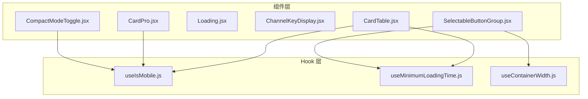
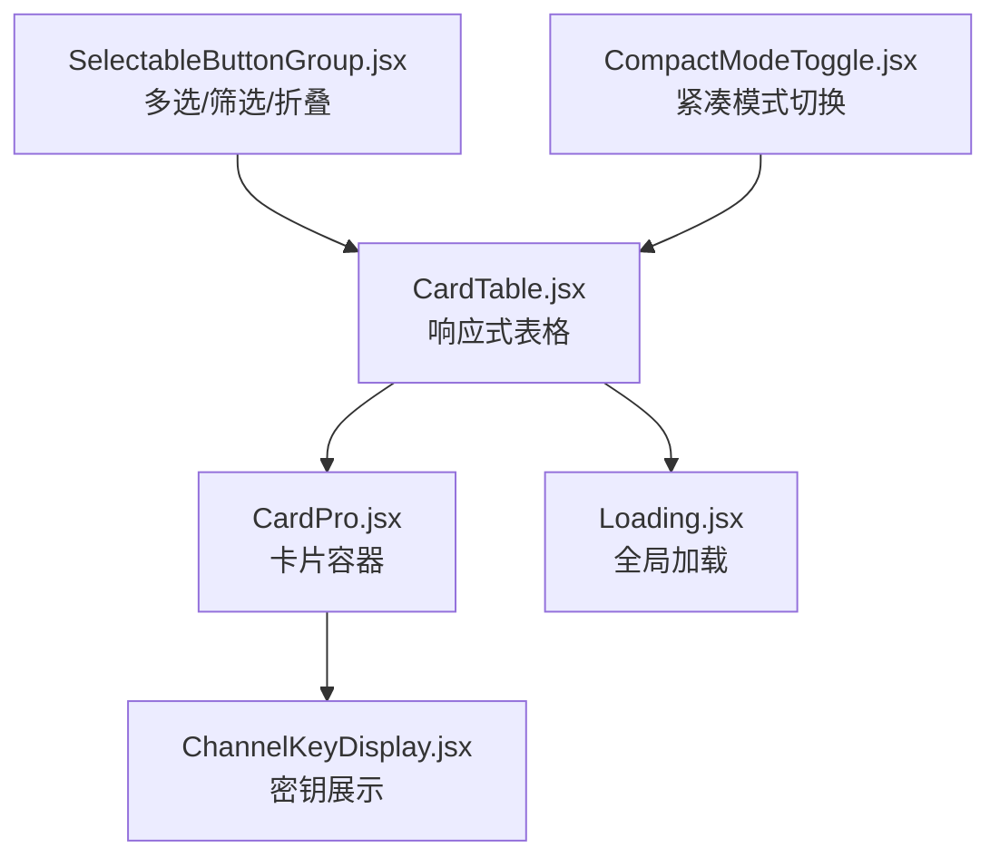
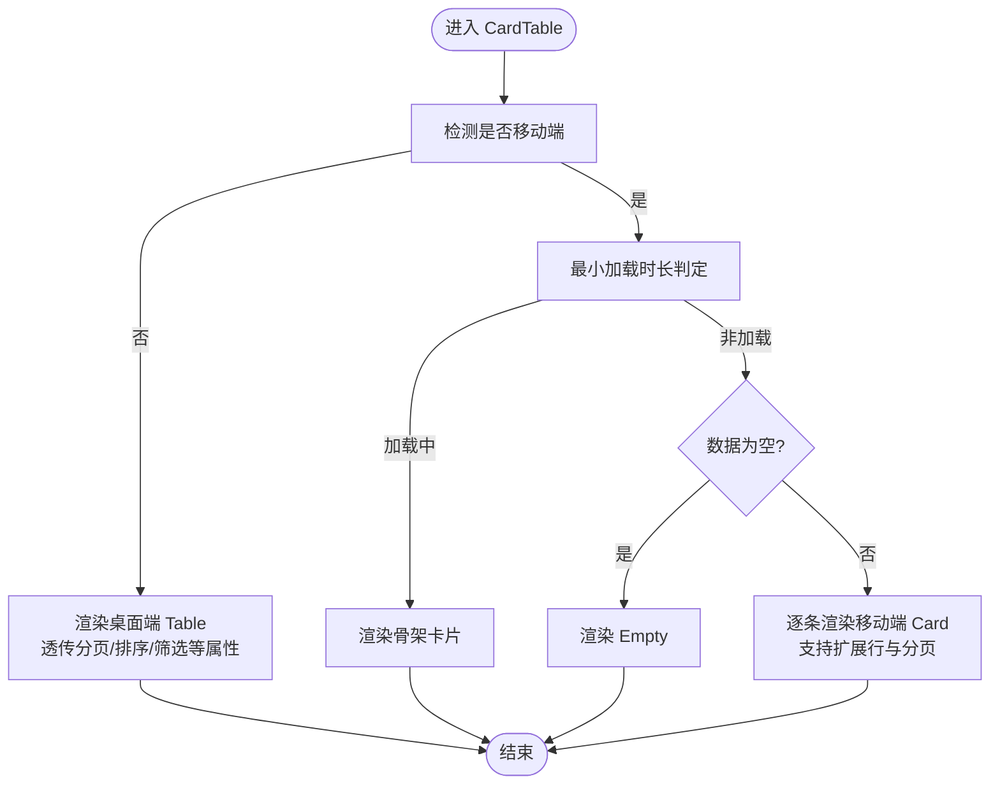
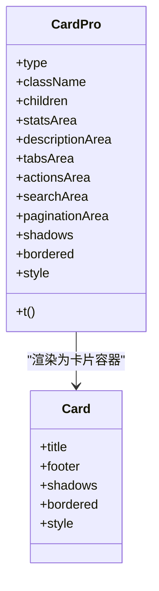
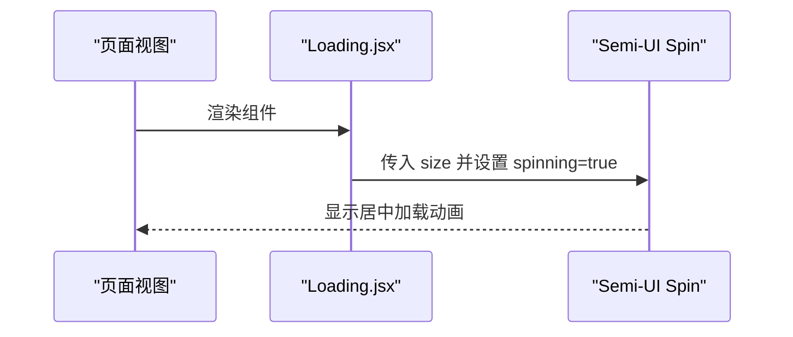
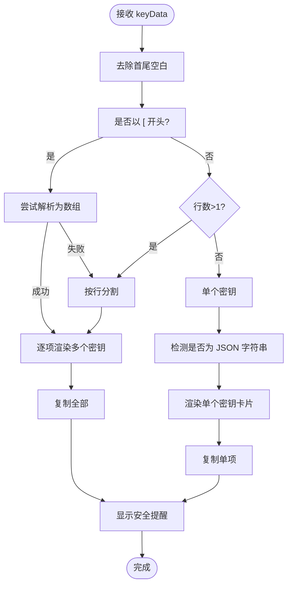
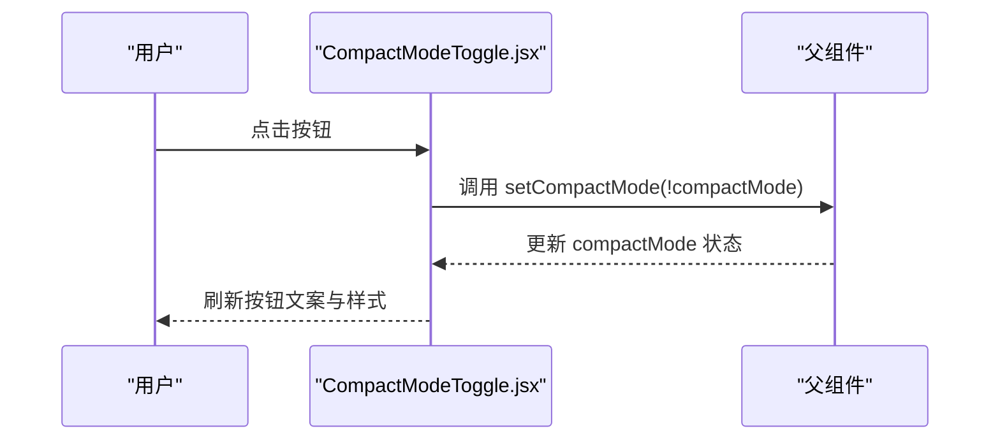
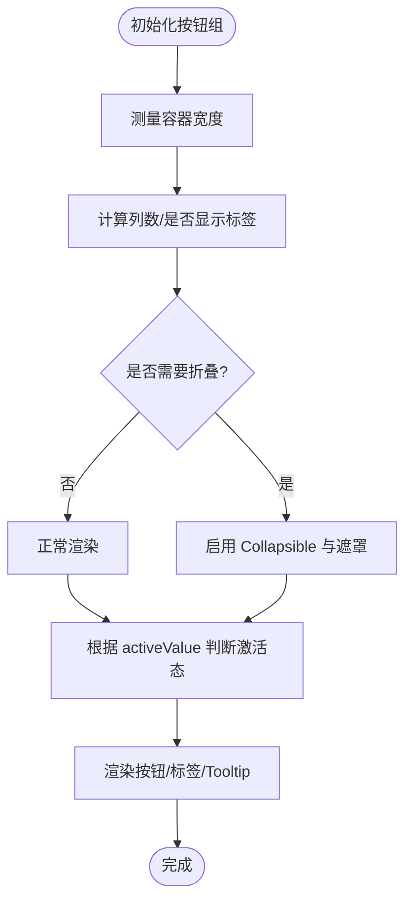
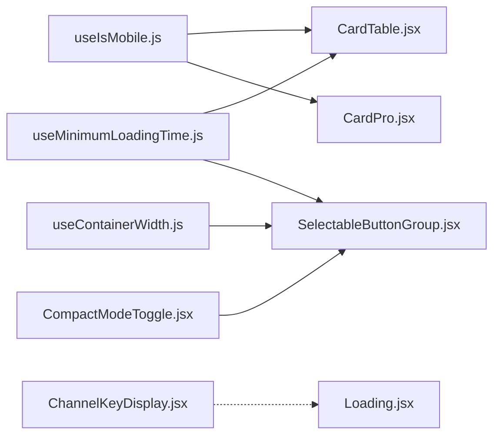

# 核心组件

<cite>
**本文引用的文件**
- [CardTable.jsx](file://web/src/components/common/ui/CardTable.jsx)
- [CardPro.jsx](file://web/src/components/common/ui/CardPro.jsx)
- [Loading.jsx](file://web/src/components/common/ui/Loading.jsx)
- [ChannelKeyDisplay.jsx](file://web/src/components/common/ui/ChannelKeyDisplay.jsx)
- [CompactModeToggle.jsx](file://web/src/components/common/ui/CompactModeToggle.jsx)
- [SelectableButtonGroup.jsx](file://web/src/components/common/ui/SelectableButtonGroup.jsx)
- [useIsMobile.js](file://web/src/hooks/common/useIsMobile.js)
- [useMinimumLoadingTime.js](file://web/src/hooks/common/useMinimumLoadingTime.js)
- [useContainerWidth.js](file://web/src/hooks/common/useContainerWidth.js)
</cite>

## 目录
1. [简介](#简介)
2. [项目结构](#项目结构)
3. [核心组件](#核心组件)
4. [架构总览](#架构总览)
5. [组件详解](#组件详解)
6. [依赖关系分析](#依赖关系分析)
7. [性能考量](#性能考量)
8. [故障排查指南](#故障排查指南)
9. [结论](#结论)
10. [附录](#附录)

## 简介
本文件聚焦 New API 前端的核心 UI 组件，系统性梳理以下组件的设计与实现要点：
- CardTable 表格组件：响应式布局、数据绑定、排序筛选与分页联动
- CardPro 卡片组件：六区布局模型、移动端交互与分页区域
- Loading 加载组件：全局覆盖层与动画状态管理
- ChannelKeyDisplay 密钥显示组件：多格式解析、安全提示与复制能力
- CompactModeToggle 紧凑模式切换：状态同步与移动端适配
- SelectableButtonGroup 可选择按钮组：多选逻辑、响应式布局与折叠展示

文档提供属性配置、事件回调、样式定制与响应式适配说明，并给出使用示例、最佳实践与性能优化建议。

## 项目结构
核心组件位于 web/src/components/common/ui 目录下，配套的通用 Hook 位于 web/src/hooks/common 下，分别负责设备判断、最小加载时长与容器宽度监听。

图表来源
- [CardTable.jsx:33-34](file://web/src/components/common/ui/CardTable.jsx#L33-L34)
- [CardPro.jsx:23-24](file://web/src/components/common/ui/CardPro.jsx#L23-L24)
- [CompactModeToggle.jsx:23-24](file://web/src/components/common/ui/CompactModeToggle.jsx#L23-L24)
- [SelectableButtonGroup.jsx:21-22](file://web/src/components/common/ui/SelectableButtonGroup.jsx#L21-L22)

章节来源
- [CardTable.jsx:33-34](file://web/src/components/common/ui/CardTable.jsx#L33-L34)
- [CardPro.jsx:23-24](file://web/src/components/common/ui/CardPro.jsx#L23-L24)
- [Loading.jsx:20-21](file://web/src/components/common/ui/Loading.jsx#L20-L21)
- [ChannelKeyDisplay.jsx:20-23](file://web/src/components/common/ui/ChannelKeyDisplay.jsx#L20-L23)
- [CompactModeToggle.jsx:23-24](file://web/src/components/common/ui/CompactModeToggle.jsx#L23-L24)
- [SelectableButtonGroup.jsx:21-22](file://web/src/components/common/ui/SelectableButtonGroup.jsx#L21-L22)

## 核心组件
- CardTable：桌面端使用 Semi-UI Table，移动端以 Card 列表呈现，支持可见列过滤、空态与分页透传
- CardPro：卡片容器，支持六区布局（统计/描述/标签/操作/搜索/分页），移动端“显示/隐藏操作项”切换
- Loading：全局覆盖层加载指示器
- ChannelKeyDisplay：密钥解析与展示，支持多密钥、JSON 格式、复制与安全提示
- CompactModeToggle：紧凑/自适应列表切换按钮（移动端隐藏）
- SelectableButtonGroup：可折叠按钮组，支持多选、标签计数、响应式列数与溢出提示

章节来源
- [CardTable.jsx:36-41](file://web/src/components/common/ui/CardTable.jsx#L36-L41)
- [CardPro.jsx:28-43](file://web/src/components/common/ui/CardPro.jsx#L28-L43)
- [Loading.jsx:23-29](file://web/src/components/common/ui/Loading.jsx#L23-L29)
- [ChannelKeyDisplay.jsx:77-85](file://web/src/components/common/ui/ChannelKeyDisplay.jsx#L77-L85)
- [CompactModeToggle.jsx:25-29](file://web/src/components/common/ui/CompactModeToggle.jsx#L25-L29)
- [SelectableButtonGroup.jsx:35-49](file://web/src/components/common/ui/SelectableButtonGroup.jsx#L35-L49)

## 架构总览
组件间协作关系如下：CardTable 与 CardPro 作为展示容器，SelectableButtonGroup 提供筛选与多选能力；CompactModeToggle 控制列表密度；ChannelKeyDisplay 用于密钥安全展示；Loading 提供全局加载占位；各组件通过 Hook 实现响应式与加载体验优化。

图表来源
- [CardTable.jsx:60-74](file://web/src/components/common/ui/CardTable.jsx#L60-L74)
- [CardPro.jsx:161-173](file://web/src/components/common/ui/CardPro.jsx#L161-L173)
- [CompactModeToggle.jsx:39-56](file://web/src/components/common/ui/CompactModeToggle.jsx#L39-L56)
- [SelectableButtonGroup.jsx:50-62](file://web/src/components/common/ui/SelectableButtonGroup.jsx#L50-L62)
- [ChannelKeyDisplay.jsx:108-151](file://web/src/components/common/ui/ChannelKeyDisplay.jsx#L108-L151)
- [Loading.jsx:24-28](file://web/src/components/common/ui/Loading.jsx#L24-L28)

## 组件详解

### CardTable 表格组件
- 数据绑定
  - 使用 dataSource 与 columns 进行数据绑定，rowKey 支持字符串或函数
  - 支持 visibleColumns 过滤列，移动端仅渲染可见列
- 排序与筛选
  - 桌面端直接透传原 Table 的排序/筛选等属性
  - 移动端通过列标题与内容映射渲染，不提供原生排序/筛选交互
- 分页
  - 桌面端关闭分页由 hidePagination 控制
  - 移动端分页通过 pagination 透传并在底部居中渲染
- 空态与骨架屏
  - 使用 useMinimumLoadingTime 控制最小加载时长，避免闪烁
  - 移动端在加载时渲染骨架卡片，空数据时渲染 Empty
- 扩展行
  - 支持 expandedRowRender 与 rowExpandable，移动端以可折叠按钮展开详情

图表来源
- [CardTable.jsx:60-74](file://web/src/components/common/ui/CardTable.jsx#L60-L74)
- [CardTable.jsx:76-129](file://web/src/components/common/ui/CardTable.jsx#L76-L129)
- [CardTable.jsx:131-231](file://web/src/components/common/ui/CardTable.jsx#L131-L231)

章节来源
- [CardTable.jsx:42-49](file://web/src/components/common/ui/CardTable.jsx#L42-L49)
- [CardTable.jsx:55-58](file://web/src/components/common/ui/CardTable.jsx#L55-L58)
- [CardTable.jsx:60-74](file://web/src/components/common/ui/CardTable.jsx#L60-L74)
- [CardTable.jsx:76-129](file://web/src/components/common/ui/CardTable.jsx#L76-L129)
- [CardTable.jsx:131-231](file://web/src/components/common/ui/CardTable.jsx#L131-L231)

### CardPro 卡片组件
- 布局区域
  - statsArea：统计信息区域（type2）
  - descriptionArea：描述信息区域（type1/type3）
  - tabsArea：类型切换/标签区域（type3）
  - actionsArea：操作按钮区域（type1/type3）
  - searchArea：搜索表单区域（所有类型）
  - paginationArea：分页区域（固定在卡片底部）
- 布局类型
  - type1：操作型（描述 + 操作 + 搜索）
  - type2：查询型（统计 + 搜索）
  - type3：复杂型（描述 + 标签 + 操作 + 搜索）
- 移动端交互
  - 提供“显示/隐藏操作项”按钮，控制 actionsArea 与 searchArea 的显隐
- 样式与定制
  - 支持 className、style、shadows、bordered 等属性透传至 Card

图表来源
- [CardPro.jsx:44-63](file://web/src/components/common/ui/CardPro.jsx#L44-L63)
- [CardPro.jsx:161-173](file://web/src/components/common/ui/CardPro.jsx#L161-L173)

章节来源
- [CardPro.jsx:28-43](file://web/src/components/common/ui/CardPro.jsx#L28-L43)
- [CardPro.jsx:44-63](file://web/src/components/common/ui/CardPro.jsx#L44-L63)
- [CardPro.jsx:73-141](file://web/src/components/common/ui/CardPro.jsx#L73-L141)
- [CardPro.jsx:145-157](file://web/src/components/common/ui/CardPro.jsx#L145-L157)
- [CardPro.jsx:161-173](file://web/src/components/common/ui/CardPro.jsx#L161-L173)

### Loading 加载组件
- 全局覆盖层
  - 固定定位，铺满视口，居中显示加载指示器
- 动画与尺寸
  - 使用 Semi-UI Spin，支持 size 参数（small/default/large）

图表来源
- [Loading.jsx:24-28](file://web/src/components/common/ui/Loading.jsx#L24-L28)

章节来源
- [Loading.jsx:23-29](file://web/src/components/common/ui/Loading.jsx#L23-L29)

### ChannelKeyDisplay 密钥显示组件
- 多格式解析
  - JSON 数组：尝试解析并逐项渲染
  - 多行文本：按行分割为多个密钥
  - 单个密钥：根据首字符判断是否为 JSON
- 安全处理
  - 默认显示安全提醒，支持自定义警告文本
  - 提供“复制全部”与“复制单项”能力
- UI 与交互
  - 多密钥时显示总数与复制全部按钮
  - JSON 密钥显示 JSON 标签与格式提示
  - 提供成功状态图标与文案

图表来源
- [ChannelKeyDisplay.jsx:31-75](file://web/src/components/common/ui/ChannelKeyDisplay.jsx#L31-L75)
- [ChannelKeyDisplay.jsx:98-106](file://web/src/components/common/ui/ChannelKeyDisplay.jsx#L98-L106)
- [ChannelKeyDisplay.jsx:108-277](file://web/src/components/common/ui/ChannelKeyDisplay.jsx#L108-L277)

章节来源
- [ChannelKeyDisplay.jsx:77-92](file://web/src/components/common/ui/ChannelKeyDisplay.jsx#L77-L92)
- [ChannelKeyDisplay.jsx:31-75](file://web/src/components/common/ui/ChannelKeyDisplay.jsx#L31-L75)
- [ChannelKeyDisplay.jsx:98-106](file://web/src/components/common/ui/ChannelKeyDisplay.jsx#L98-L106)
- [ChannelKeyDisplay.jsx:108-277](file://web/src/components/common/ui/ChannelKeyDisplay.jsx#L108-L277)

### CompactModeToggle 紧凑模式切换组件
- 状态同步
  - 接收 compactMode 与 setCompactMode，点击时翻转状态
- 移动端适配
  - 在移动端自动隐藏，避免重复控制同一内容
- 文案与样式
  - 文案根据当前模式动态切换（紧凑/自适应）
  - 支持 size、type、className 等属性透传

图表来源
- [CompactModeToggle.jsx:39-56](file://web/src/components/common/ui/CompactModeToggle.jsx#L39-L56)

章节来源
- [CompactModeToggle.jsx:30-38](file://web/src/components/common/ui/CompactModeToggle.jsx#L30-L38)
- [CompactModeToggle.jsx:39-56](file://web/src/components/common/ui/CompactModeToggle.jsx#L39-L56)

### SelectableButtonGroup 可选择按钮组
- 多选逻辑
  - activeValue 支持单值与数组；当为数组时，按钮根据包含关系决定激活态
- 响应式布局
  - 基于容器宽度动态计算每行列数与是否显示标签
  - 使用 Row/Col 实现紧凑网格间距
- 折叠展示
  - 超过最大可见行时，启用 Collapsible 与渐隐遮罩
  - 提供“展开更多/收起”链接
- 加载与提示
  - 使用 useMinimumLoadingTime 控制骨架屏
  - 文本溢出时提供 Tooltip
- 变体与样式
  - 支持 variant 参数注入颜色变体类名
  - 支持 withCheckbox 前缀勾选框（实际点击由 onChange 触发）

图表来源
- [SelectableButtonGroup.jsx:90-101](file://web/src/components/common/ui/SelectableButtonGroup.jsx#L90-L101)
- [SelectableButtonGroup.jsx:118-136](file://web/src/components/common/ui/SelectableButtonGroup.jsx#L118-L136)
- [SelectableButtonGroup.jsx:177-242](file://web/src/components/common/ui/SelectableButtonGroup.jsx#L177-L242)

章节来源
- [SelectableButtonGroup.jsx:50-62](file://web/src/components/common/ui/SelectableButtonGroup.jsx#L50-L62)
- [SelectableButtonGroup.jsx:90-101](file://web/src/components/common/ui/SelectableButtonGroup.jsx#L90-L101)
- [SelectableButtonGroup.jsx:118-136](file://web/src/components/common/ui/SelectableButtonGroup.jsx#L118-L136)
- [SelectableButtonGroup.jsx:177-242](file://web/src/components/common/ui/SelectableButtonGroup.jsx#L177-L242)
- [SelectableButtonGroup.jsx:244-292](file://web/src/components/common/ui/SelectableButtonGroup.jsx#L244-L292)

## 依赖关系分析
- 设备与布局
  - useIsMobile：驱动 CardTable 与 CardPro 的移动端渲染分支
  - useContainerWidth：驱动 SelectableButtonGroup 的响应式列数与标签显示策略
- 加载体验
  - useMinimumLoadingTime：统一控制骨架屏与最小加载时长，避免闪烁
- 组件耦合
  - CardTable 与 CardPro 低耦合，前者专注数据与分页，后者专注布局与交互
  - CompactModeToggle 与 SelectableButtonGroup 通过状态同步实现协同
  - ChannelKeyDisplay 与 Loading 无直接依赖，可在业务场景中组合使用

图表来源
- [CardTable.jsx:33-34](file://web/src/components/common/ui/CardTable.jsx#L33-L34)
- [CardPro.jsx:23-24](file://web/src/components/common/ui/CardPro.jsx#L23-L24)
- [SelectableButtonGroup.jsx:21-22](file://web/src/components/common/ui/SelectableButtonGroup.jsx#L21-L22)
- [CompactModeToggle.jsx:23-24](file://web/src/components/common/ui/CompactModeToggle.jsx#L23-L24)
- [ChannelKeyDisplay.jsx:20-23](file://web/src/components/common/ui/ChannelKeyDisplay.jsx#L20-L23)
- [Loading.jsx:20-21](file://web/src/components/common/ui/Loading.jsx#L20-L21)

章节来源
- [CardTable.jsx:33-34](file://web/src/components/common/ui/CardTable.jsx#L33-L34)
- [CardPro.jsx:23-24](file://web/src/components/common/ui/CardPro.jsx#L23-L24)
- [SelectableButtonGroup.jsx:21-22](file://web/src/components/common/ui/SelectableButtonGroup.jsx#L21-L22)
- [CompactModeToggle.jsx:23-24](file://web/src/components/common/ui/CompactModeToggle.jsx#L23-L24)
- [ChannelKeyDisplay.jsx:20-23](file://web/src/components/common/ui/ChannelKeyDisplay.jsx#L20-L23)
- [Loading.jsx:20-21](file://web/src/components/common/ui/Loading.jsx#L20-L21)

## 性能考量
- 骨架屏与最小加载时长
  - 使用 useMinimumLoadingTime 控制加载态，减少频繁闪烁对用户体验的影响
- 移动端渲染优化
  - CardTable 在移动端以 Card 列表渲染，避免大表格在小屏上的布局压力
  - SelectableButtonGroup 通过 Collapsible 限制可视高度，降低 DOM 节点数量
- 响应式布局
  - 通过 useContainerWidth 动态计算列数，避免过度换行与重排
- 复制与安全
  - ChannelKeyDisplay 的复制操作通过工具方法执行，避免不必要的状态更新

## 故障排查指南
- CardTable
  - 问题：移动端不显示分页
    - 检查是否传入 pagination 且未设置 hidePagination
  - 问题：列不显示
    - 检查 visibleColumns 与列 key 是否匹配
- CardPro
  - 问题：移动端操作区不显示
    - 检查 actionsArea 与 searchArea 是否存在，确认“显示/隐藏操作项”按钮是否被点击
- SelectableButtonGroup
  - 问题：按钮不响应点击
    - 确认 withCheckbox 模式下点击的是 Checkbox，onChange 应仅触发一次
  - 问题：折叠后无法展开
    - 检查 collapsible 与 collapseHeight 设置，确认容器高度变化
- ChannelKeyDisplay
  - 问题：JSON 格式密钥未识别
    - 确认输入为合法 JSON 字符串或数组
- CompactModeToggle
  - 问题：移动端出现按钮
    - 组件在移动端自动隐藏，无需手动处理

章节来源
- [CardTable.jsx:60-74](file://web/src/components/common/ui/CardTable.jsx#L60-L74)
- [CardTable.jsx:225-229](file://web/src/components/common/ui/CardTable.jsx#L225-L229)
- [CardPro.jsx:98-113](file://web/src/components/common/ui/CardPro.jsx#L98-L113)
- [SelectableButtonGroup.jsx:186-216](file://web/src/components/common/ui/SelectableButtonGroup.jsx#L186-L216)
- [SelectableButtonGroup.jsx:258-287](file://web/src/components/common/ui/SelectableButtonGroup.jsx#L258-L287)
- [ChannelKeyDisplay.jsx:36-53](file://web/src/components/common/ui/ChannelKeyDisplay.jsx#L36-L53)
- [CompactModeToggle.jsx:42-44](file://web/src/components/common/ui/CompactModeToggle.jsx#L42-L44)

## 结论
上述组件围绕“响应式、可组合、可扩展”的设计理念构建，通过 Hook 与属性透传实现高内聚低耦合。在实际业务中，建议：
- 使用 SelectableButtonGroup 作为筛选入口，结合 CardTable 实现数据筛选与分页
- 使用 CardPro 将筛选、搜索与分页进行模块化组织
- 使用 CompactModeToggle 与响应式列数提升移动端体验
- 使用 ChannelKeyDisplay 保障密钥展示的安全性与可用性
- 使用 Loading 提供一致的全局加载反馈

## 附录
- 使用示例与最佳实践
  - CardTable：传入 columns 与 dataSource，必要时设置 visibleColumns 与 pagination
  - CardPro：按需填充六个区域，移动端通过“显示/隐藏操作项”控制内容
  - SelectableButtonGroup：提供 items 与 activeValue，配合 onChange 实现筛选
  - ChannelKeyDisplay：传入 keyData，必要时关闭安全提醒或自定义警告文本
  - CompactModeToggle：与父组件共享 compactMode 状态，移动端自动隐藏
  - Loading：在关键异步流程开始时渲染，结束后移除
- 样式定制
  - 通过 className、style、shadows、bordered、variant 等属性进行外观定制
  - 建议使用主题变量与暗色模式适配，确保在深色背景下可读性良好
- 响应式适配
  - 优先保证移动端最小可用体验，再逐步增强桌面端交互
  - 对超长文本使用 Tooltip，对密集按钮使用 Collapsible 折叠