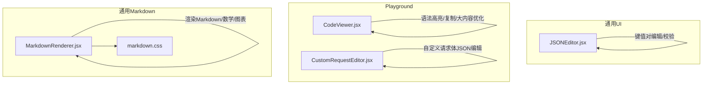
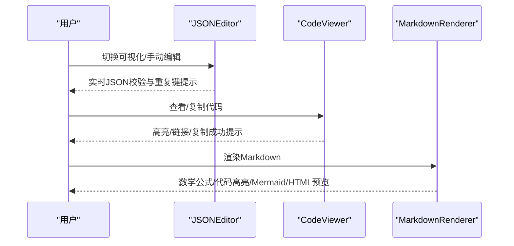
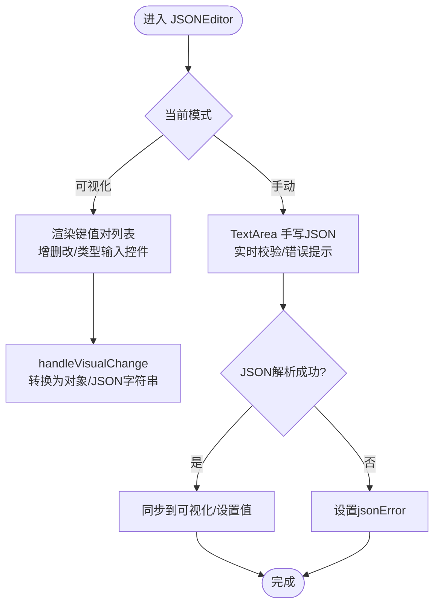
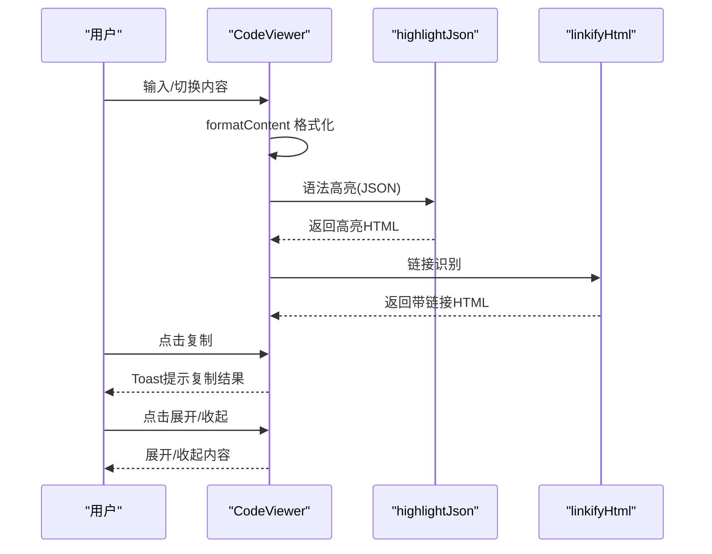
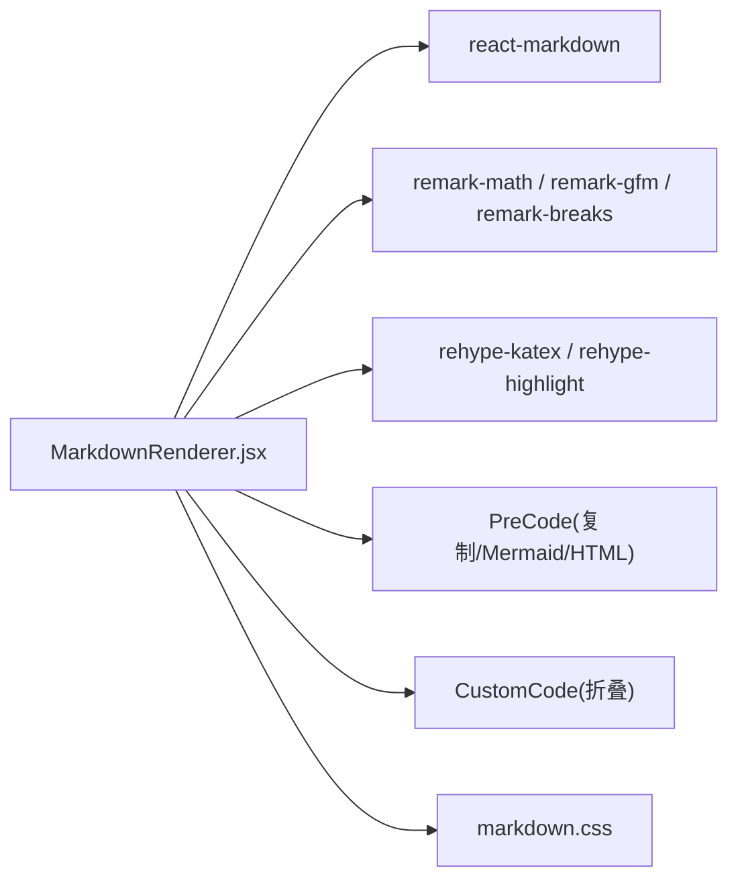
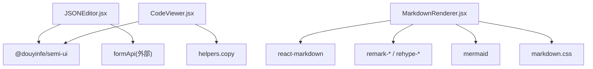

# 编辑器组件

<cite>
**本文引用的文件**
- [JSONEditor.jsx](file://web/src/components/common/ui/JSONEditor.jsx)
- [CodeViewer.jsx](file://web/src/components/playground/CodeViewer.jsx)
- [MarkdownRenderer.jsx](file://web/src/components/common/markdown/MarkdownRenderer.jsx)
- [markdown.css](file://web/src/components/common/markdown/markdown.css)
- [CustomRequestEditor.jsx](file://web/src/components/playground/CustomRequestEditor.jsx)
</cite>

## 目录
1. [简介](#简介)
2. [项目结构](#项目结构)
3. [核心组件](#核心组件)
4. [架构总览](#架构总览)
5. [详细组件分析](#详细组件分析)
6. [依赖关系分析](#依赖关系分析)
7. [性能考量](#性能考量)
8. [故障排查指南](#故障排查指南)
9. [结论](#结论)
10. [附录](#附录)

## 简介
本文件面向 New API 的前端编辑器类 UI 组件，系统性梳理以下三类组件的能力与实现要点：
- JSONEditor：键值对可视化编辑、纯文本手动编辑、模板填充、JSON 校验与去重键提示、与表单系统的联动。
- CodeViewer：代码/文本查看器，具备语法高亮（JSON）、链接识别、自动换行、复制、大内容性能优化与展开/收起。
- MarkdownRenderer：Markdown 渲染引擎，支持数学公式、表格、代码高亮、Mermaid 图表、HTML 预览、复制代码等。

文档将从架构、数据流、处理逻辑、事件与状态管理、配置与主题、扩展能力、性能优化、错误处理与无障碍等方面进行深入说明，并提供集成示例与最佳实践。

## 项目结构
三个编辑器组件分别位于：
- JSONEditor：通用 UI 组件，便于在各页面与表单中复用
- CodeViewer：Playground 场景下的代码查看器
- MarkdownRenderer：通用 Markdown 渲染器，含样式与插件配置

**图示来源**
- [JSONEditor.jsx:1-719](file://web/src/components/common/ui/JSONEditor.jsx#L1-L719)
- [CodeViewer.jsx:1-402](file://web/src/components/playground/CodeViewer.jsx#L1-L402)
- [MarkdownRenderer.jsx:1-698](file://web/src/components/common/markdown/MarkdownRenderer.jsx#L1-L698)
- [markdown.css:1-450](file://web/src/components/common/markdown/markdown.css#L1-L450)
- [CustomRequestEditor.jsx:1-218](file://web/src/components/playground/CustomRequestEditor.jsx#L1-L218)

**章节来源**
- [JSONEditor.jsx:1-719](file://web/src/components/common/ui/JSONEditor.jsx#L1-L719)
- [CodeViewer.jsx:1-402](file://web/src/components/playground/CodeViewer.jsx#L1-L402)
- [MarkdownRenderer.jsx:1-698](file://web/src/components/common/markdown/MarkdownRenderer.jsx#L1-L698)
- [markdown.css:1-450](file://web/src/components/common/markdown/markdown.css#L1-L450)
- [CustomRequestEditor.jsx:1-218](file://web/src/components/playground/CustomRequestEditor.jsx#L1-L218)

## 核心组件
- JSONEditor：支持可视化键值对编辑与纯文本手动编辑，内置 JSON 校验、重复键检测、模板填充、与 Semi Design 表单联动。
- CodeViewer：提供 JSON 语法高亮、链接识别、自动换行、复制、大内容性能优化与展开/收起。
- MarkdownRenderer：基于 react-markdown + remark/rehype 插件链，支持 KaTeX 数学公式、代码高亮、Mermaid 图表、HTML 预览、复制代码。

**章节来源**
- [JSONEditor.jsx:49-719](file://web/src/components/common/ui/JSONEditor.jsx#L49-L719)
- [CodeViewer.jsx:179-402](file://web/src/components/playground/CodeViewer.jsx#L179-L402)
- [MarkdownRenderer.jsx:637-698](file://web/src/components/common/markdown/MarkdownRenderer.jsx#L637-L698)

## 架构总览
三个组件均采用函数式组件与 Hooks 管理状态，遵循“受控/非受控”混合模式与“单向数据流”。JSONEditor 通过 formApi 与外部表单系统对接；CodeViewer 与 MarkdownRenderer 通过 props 输入内容并输出交互反馈（复制、展开、渲染）。

**图示来源**
- [JSONEditor.jsx:634-715](file://web/src/components/common/ui/JSONEditor.jsx#L634-L715)
- [CodeViewer.jsx:224-243](file://web/src/components/playground/CodeViewer.jsx#L224-L243)
- [MarkdownRenderer.jsx:637-698](file://web/src/components/common/markdown/MarkdownRenderer.jsx#L637-L698)

## 详细组件分析

### JSONEditor 组件
- 功能概览
  - 可视化编辑：键值对列表，动态增删改，按类型渲染输入控件（布尔、数值、字符串、对象），自动类型转换与校验。
  - 手动编辑：TextArea 手写 JSON，实时校验与错误提示，支持模板一键填充。
  - 模式切换：根据键数量自动选择可视化或手动模式，Tab 切换。
  - 重复键检测：高亮重复键并提示覆盖规则。
  - 表单联动：通过 formApi.setValue 与外部表单系统同步，隐藏 Form.Input 用于规则校验。
  - 模板填充：支持传入 template 与 templateLabel，一键填入默认值。
- 关键状态与逻辑
  - 状态：keyValuePairs、manualText、editMode、jsonError、duplicateKeys。
  - 同步：外部 value 变化时，内部通过 objectToKeyValueArray 与 keyValueArrayToObject 进行双向同步，避免循环更新。
  - 校验：手动模式下解析 JSON 并设置错误状态；可视化模式下即时转换为 JSON 字符串。
  - 事件：增删改键值、切换模式、模板填充、表单回调 onChange。
- 配置项与扩展
  - 支持 label、placeholder、extraText、extraFooter、showClear、template、templateLabel、editorType、rules、formApi、field、renderStringValueSuffix 等。
  - editorType 支持 keyValue 与 region 两种布局风格。
  - 可通过 formApi 与外部表单规则集成，实现复杂校验。
- 性能与可用性
  - 使用 useMemo 缓存重复键集合与对象转换结果，减少重渲染。
  - 使用 useCallback 包裹变更处理器，降低子组件重渲染。
  - 对于超大 JSON，建议使用手动模式以避免可视化列表性能问题。
- 无障碍与国际化
  - 使用 useTranslation 提供多语言文案。
  - 危险操作使用图标与提示，重复键使用警告条与 Tooltip 提示。

**图示来源**
- [JSONEditor.jsx:186-227](file://web/src/components/common/ui/JSONEditor.jsx#L186-L227)
- [JSONEditor.jsx:229-264](file://web/src/components/common/ui/JSONEditor.jsx#L229-L264)
- [JSONEditor.jsx:616-625](file://web/src/components/common/ui/JSONEditor.jsx#L616-L625)

**章节来源**
- [JSONEditor.jsx:49-719](file://web/src/components/common/ui/JSONEditor.jsx#L49-L719)

### CodeViewer 组件
- 功能概览
  - 语法高亮：针对 JSON 的 token 匹配与颜色标注，非 JSON 文本进行 HTML 转义。
  - 链接识别：自动将 URL 转为可点击链接。
  - 自动换行：长文本自动换行，避免横向滚动溢出。
  - 复制：一键复制原始内容（对象序列化为 JSON）。
  - 性能优化：大内容截断与“展开/收起”，超大内容启用“处理中”指示。
  - 展开控制：根据内容长度与阈值决定是否允许展开。
- 关键状态与逻辑
  - 状态：copied、isHoveringCopy、isExpanded、isProcessing。
  - 格式化：formatContent 将对象或 JSON 字符串格式化为标准缩进。
  - 高亮：highlightJson 使用正则匹配 token 并加色；linkifyHtml 将 URL 包裹为 a 标签。
  - 性能：PERFORMANCE_CONFIG 控制最大显示长度、预览长度与“超大倍数”阈值。
  - 事件：handleCopy、handleToggleExpand。
- 主题与样式
  - 内置 codeThemeStyles 定义容器、内容区、按钮、警告等样式。
  - 通过内联样式实现深色主题与半透明边框，适配暗色界面。
- 无障碍与国际化
  - 使用 Toast 提示复制成功/失败。
  - Tooltip 提示复制与展开行为。
  - 多语言文案来自 useTranslation。

**图示来源**
- [CodeViewer.jsx:103-145](file://web/src/components/playground/CodeViewer.jsx#L103-L145)
- [CodeViewer.jsx:224-255](file://web/src/components/playground/CodeViewer.jsx#L224-L255)

**章节来源**
- [CodeViewer.jsx:179-402](file://web/src/components/playground/CodeViewer.jsx#L179-L402)

### MarkdownRenderer 组件
- 功能概览
  - 渲染：基于 react-markdown，启用 remark-math、remark-gfm、remark-breaks、rehype-katex、rehype-highlight 等插件。
  - 代码块：支持复制按钮、自动换行、自定义折叠、Mermaid 图表渲染、HTML 预览（iframe sandbox）。
  - 数学公式：KaTeX 渲染行内与块级公式。
  - Mermaid：延迟渲染，错误捕获，支持点击 SVG 新窗口查看。
  - HTML 预览：SandboxedHtmlPreview 在沙箱 iframe 中渲染 HTML 片段。
  - 样式：markdown.css 提供深浅主题适配、代码高亮主题、动画与响应式。
- 关键状态与逻辑
  - 状态：animated、previousContentLength 控制逐字动画。
  - 插件链：remarkPlugins 与 rehypePlugins 组合，按需注入动画分词插件。
  - 自定义组件：PreCode（复制按钮、Mermaid、HTML 预览）、CustomCode（折叠）、Mermaid、SandboxedHtmlPreview。
  - 安全：HTML 预览使用 sandbox，Mermaid 错误抑制。
- 主题与样式
  - 使用 CSS 变量适配深浅主题，代码高亮使用 GitHub 风格主题。
  - 针对用户消息场景提供白色字体适配。
- 无障碍与国际化
  - 复制按钮与 Tooltip 提示。
  - 多语言文案来自 useTranslation。

**图示来源**
- [MarkdownRenderer.jsx:637-698](file://web/src/components/common/markdown/MarkdownRenderer.jsx#L637-L698)
- [MarkdownRenderer.jsx:396-411](file://web/src/components/common/markdown/MarkdownRenderer.jsx#L396-L411)
- [markdown.css:96-188](file://web/src/components/common/markdown/markdown.css#L96-L188)

**章节来源**
- [MarkdownRenderer.jsx:1-698](file://web/src/components/common/markdown/MarkdownRenderer.jsx#L1-L698)
- [markdown.css:1-450](file://web/src/components/common/markdown/markdown.css#L1-L450)

## 依赖关系分析
- JSONEditor
  - 依赖 Semi UI 组件库（Button、Form、Tabs、Card、Input、Switch、TextArea 等）。
  - 通过 formApi 与外部表单系统耦合，实现规则校验与值回填。
- CodeViewer
  - 依赖 @douyinfe/semi-ui 的 Toast、Tooltip、Button。
  - 依赖 helpers.copy 进行剪贴板操作。
- MarkdownRenderer
  - 依赖 react-markdown、remark-math、remark-gfm、remark-breaks、rehype-katex、rehype-highlight、mermaid。
  - 依赖 markdown.css 提供样式与高亮主题。

**图示来源**
- [JSONEditor.jsx:20-41](file://web/src/components/common/ui/JSONEditor.jsx#L20-L41)
- [CodeViewer.jsx:20-24](file://web/src/components/playground/CodeViewer.jsx#L20-L24)
- [MarkdownRenderer.jsx:20-37](file://web/src/components/common/markdown/MarkdownRenderer.jsx#L20-L37)

**章节来源**
- [JSONEditor.jsx:20-41](file://web/src/components/common/ui/JSONEditor.jsx#L20-L41)
- [CodeViewer.jsx:20-24](file://web/src/components/playground/CodeViewer.jsx#L20-L24)
- [MarkdownRenderer.jsx:20-37](file://web/src/components/common/markdown/MarkdownRenderer.jsx#L20-L37)

## 性能考量
- JSONEditor
  - 可视化模式适合键数较少的场景；当键数较多时自动切换到手动模式，避免列表渲染开销。
  - 使用 useMemo 缓存重复键集合与对象转换结果，减少不必要的重渲染。
- CodeViewer
  - 大内容阈值控制：超过阈值时启用截断与“展开/收起”，超大内容显示处理中指示，避免长时间渲染。
  - 仅在需要时进行高亮与链接识别，避免对超大文本进行昂贵的正则扫描。
- MarkdownRenderer
  - 代码块换行与复制按钮按需渲染，Mermaid 与 HTML 预览延迟执行，减少首屏压力。
  - 动画逐字渲染通过 use-debounce 控制，避免频繁重绘。

**章节来源**
- [JSONEditor.jsx:121-132](file://web/src/components/common/ui/JSONEditor.jsx#L121-L132)
- [CodeViewer.jsx:26-30](file://web/src/components/playground/CodeViewer.jsx#L26-L30)
- [MarkdownRenderer.jsx:139-187](file://web/src/components/common/markdown/MarkdownRenderer.jsx#L139-L187)

## 故障排查指南
- JSONEditor
  - JSON 解析错误：检查手动模式下的 JSON 格式；重复键会导致覆盖，注意提示信息。
  - 表单联动失效：确认传入 formApi 与 field；确保 rules 设置正确。
  - 模板填充无效：检查 template 是否为有效对象，templateLabel 是否设置。
- CodeViewer
  - 复制失败：检查浏览器剪贴板权限与安全上下文；组件会通过 Toast 报错。
  - 链接未识别：确认内容为合法 URL；仅对 http(s) 协议生效。
  - 大内容无法展开：等待处理中动画结束，或手动扩大阈值配置。
- MarkdownRenderer
  - 公式不渲染：检查 remark-math 与 rehype-katex 插件是否正确加载。
  - Mermaid 图表报错：查看控制台错误并修复语法；组件会抑制错误并记录日志。
  - HTML 预览空白：沙箱限制导致无法访问 DOM，属预期行为。

**章节来源**
- [JSONEditor.jsx:134-173](file://web/src/components/common/ui/JSONEditor.jsx#L134-L173)
- [CodeViewer.jsx:224-243](file://web/src/components/playground/CodeViewer.jsx#L224-L243)
- [MarkdownRenderer.jsx:49-61](file://web/src/components/common/markdown/MarkdownRenderer.jsx#L49-L61)

## 结论
- JSONEditor 提供了“可视化 + 手动”的双模式编辑体验，结合表单系统与校验规则，适用于复杂配置场景。
- CodeViewer 在保证可读性的前提下，兼顾性能与可用性，适合展示与调试长文本/JSON。
- MarkdownRenderer 以插件化方式实现丰富的渲染能力，兼顾数学公式、图表与安全预览。
- 三者均重视国际化、无障碍与主题适配，可在不同界面风格下保持一致的用户体验。

## 附录

### 组件配置与主题定制
- JSONEditor
  - 常用属性：value、onChange、field、label、placeholder、extraText、extraFooter、showClear、template、templateLabel、editorType、rules、formApi。
  - 主题：依赖 Semi Design 的主题变量，可通过全局样式覆盖。
- CodeViewer
  - 常用属性：content、title、language。
  - 主题：codeThemeStyles 内联样式定义深色主题，可按需调整颜色与字体。
- MarkdownRenderer
  - 常用属性：content、loading、fontSize、fontFamily、className、style、animated、previousContentLength。
  - 主题：markdown.css 使用 CSS 变量与高亮主题，支持用户消息白字适配。

**章节来源**
- [JSONEditor.jsx:49-65](file://web/src/components/common/ui/JSONEditor.jsx#L49-L65)
- [CodeViewer.jsx:179-186](file://web/src/components/playground/CodeViewer.jsx#L179-L186)
- [MarkdownRenderer.jsx:637-648](file://web/src/components/common/markdown/MarkdownRenderer.jsx#L637-L648)
- [markdown.css:96-188](file://web/src/components/common/markdown/markdown.css#L96-L188)

### 集成示例与最佳实践
- 在表单中使用 JSONEditor
  - 传入 formApi 与 field，设置 rules 实现必填/格式校验；通过 onChange 获取最终 JSON 字符串。
- 在 Playground 中使用 CodeViewer
  - 传入 content 与 language；需要复制时调用复制按钮；大内容开启自动截断与展开。
- 在文档/聊天中使用 MarkdownRenderer
  - 传入 content；启用 animated 时传入 previousContentLength；需要数学公式时确保插件链完整。
- 自定义配置
  - JSONEditor：根据 editorType 选择 keyValue 或 region；通过 template 提供默认值。
  - CodeViewer：通过 language 控制高亮范围；通过 title 显示占位文案。
  - MarkdownRenderer：通过 className 注入用户消息样式；通过 style 调整字号与字体。

**章节来源**
- [JSONEditor.jsx:197-204](file://web/src/components/common/ui/JSONEditor.jsx#L197-L204)
- [CodeViewer.jsx:224-243](file://web/src/components/playground/CodeViewer.jsx#L224-L243)
- [MarkdownRenderer.jsx:637-698](file://web/src/components/common/markdown/MarkdownRenderer.jsx#L637-L698)