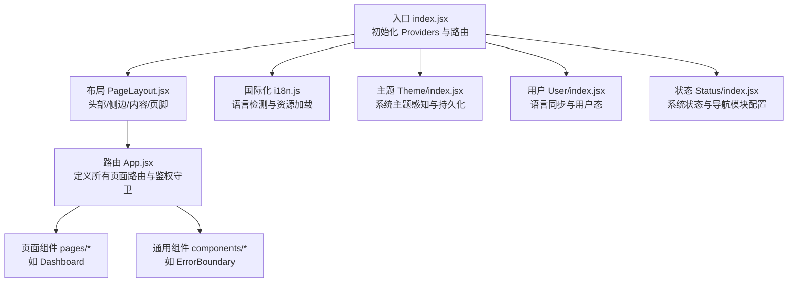
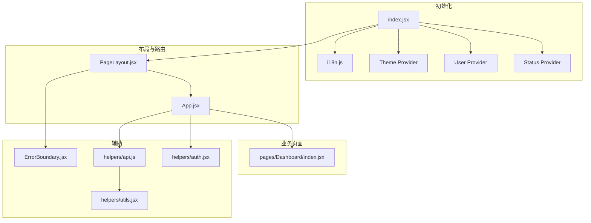
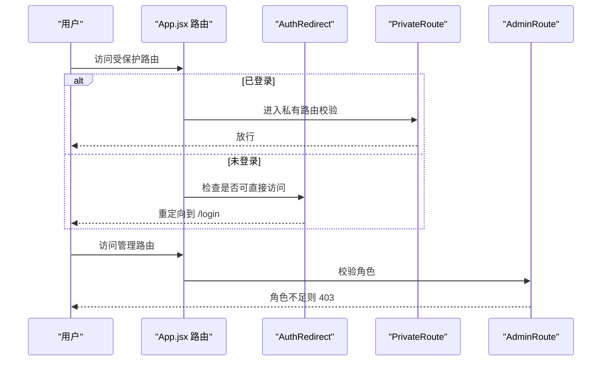
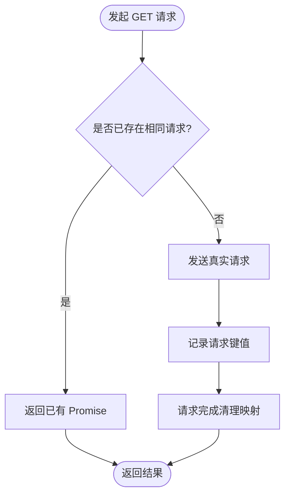
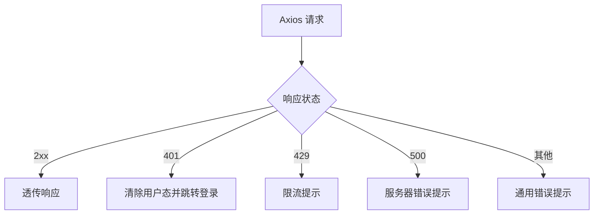
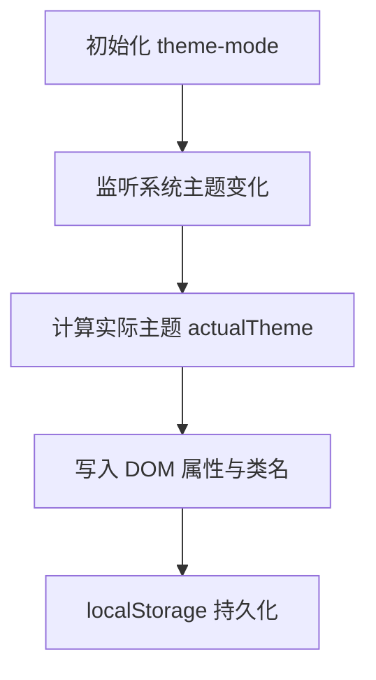
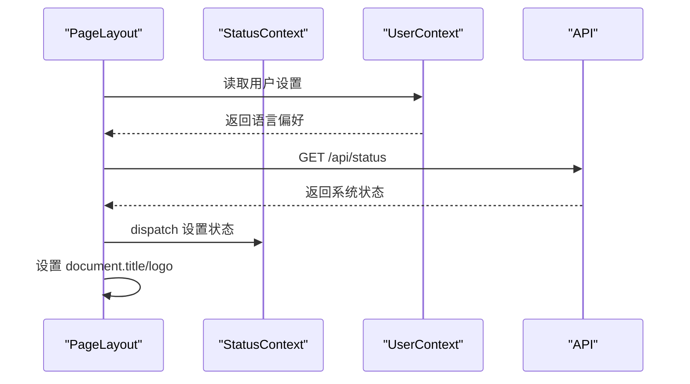
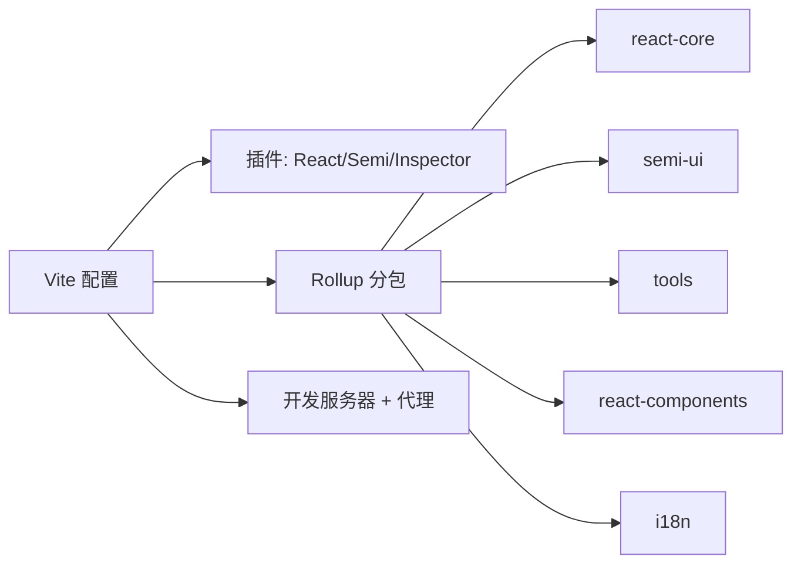

# 前端架构

<cite>
**本文引用的文件**   
- [web/package.json](file://web/package.json)
- [web/vite.config.js](file://web/vite.config.js)
- [web/src/index.jsx](file://web/src/index.jsx)
- [web/src/App.jsx](file://web/src/App.jsx)
- [web/src/helpers/auth.jsx](file://web/src/helpers/auth.jsx)
- [web/src/helpers/api.js](file://web/src/helpers/api.js)
- [web/src/helpers/utils.jsx](file://web/src/helpers/utils.jsx)
- [web/src/context/Theme/index.jsx](file://web/src/context/Theme/index.jsx)
- [web/src/context/User/index.jsx](file://web/src/context/User/index.jsx)
- [web/src/context/Status/index.jsx](file://web/src/context/Status/index.jsx)
- [web/src/components/layout/PageLayout.jsx](file://web/src/components/layout/PageLayout.jsx)
- [web/src/components/common/ErrorBoundary.jsx](file://web/src/components/common/ErrorBoundary.jsx)
- [web/src/pages/Dashboard/index.jsx](file://web/src/pages/Dashboard/index.jsx)
- [web/src/constants/index.js](file://web/src/constants/index.js)
- [web/src/i18n/i18n.js](file://web/src/i18n/i18n.js)
</cite>

## 目录
1. [简介](#简介)
2. [项目结构](#项目结构)
3. [核心组件](#核心组件)
4. [架构总览](#架构总览)
5. [详细组件分析](#详细组件分析)
6. [依赖关系分析](#依赖关系分析)
7. [性能考量](#性能考量)
8. [故障排查指南](#故障排查指南)
9. [结论](#结论)
10. [附录](#附录)

## 简介
本文件面向前端开发者，系统化梳理 New API 前端架构，覆盖 React 应用的组件架构、状态管理、路由配置、UI 组件库与主题系统、国际化实现、API 客户端封装、错误处理与缓存策略、设计模式与性能优化、响应式与无障碍、跨浏览器兼容性等。目标是帮助开发者快速理解并高效扩展现有前端能力。

## 项目结构
前端位于 web 目录，采用 Vite + React 18 + React Router DOM + Semi UI 的技术栈。构建层面通过 Vite 插件实现 JSX 自动转换、按需分包、本地开发代理与 Semi 主题注入；运行时通过 Provider 层级组合 Theme、User、Status 上下文，配合 PageLayout 统一布局与错误边界。

图表来源
- [web/src/index.jsx:55-77](file://web/src/index.jsx#L55-L77)
- [web/src/components/layout/PageLayout.jsx:147-239](file://web/src/components/layout/PageLayout.jsx#L147-L239)
- [web/src/App.jsx:64-384](file://web/src/App.jsx#L64-L384)
- [web/src/i18n/i18n.js:33-53](file://web/src/i18n/i18n.js#L33-L53)
- [web/src/context/Theme/index.jsx:47-114](file://web/src/context/Theme/index.jsx#L47-L114)
- [web/src/context/User/index.jsx:30-57](file://web/src/context/User/index.jsx#L30-L57)
- [web/src/context/Status/index.jsx:28-36](file://web/src/context/Status/index.jsx#L28-L36)

章节来源
- [web/package.json:1-97](file://web/package.json#L1-L97)
- [web/vite.config.js:28-107](file://web/vite.config.js#L28-L107)
- [web/src/index.jsx:55-77](file://web/src/index.jsx#L55-L77)

## 核心组件
- 入口与上下文
  - Providers 初始化顺序：Status → User → BrowserRouter → Theme → Semi 国际化包装 → PageLayout
  - PageLayout 负责加载用户与系统状态、标题与图标、侧边栏与移动端抽屉、错误边界与通知容器
- 路由与鉴权
  - App.jsx 定义全部路由，结合 PrivateRoute/AdminRoute/AuthRedirect 实现登录/权限控制
  - 动态 OAuth 回调路由支持多种提供商
- 主题系统
  - ThemeProvider 支持 light/dark/auto，自动监听系统主题变化并持久化
- 用户与国际化
  - UserProvider 同步用户设置中的语言偏好至 i18n
  - i18n.js 使用浏览器语言探测器与多语言资源
- 错误边界
  - ErrorBoundary.jsx 捕获渲染错误并引导用户刷新

章节来源
- [web/src/index.jsx:55-77](file://web/src/index.jsx#L55-L77)
- [web/src/components/layout/PageLayout.jsx:81-118](file://web/src/components/layout/PageLayout.jsx#L81-L118)
- [web/src/App.jsx:64-384](file://web/src/App.jsx#L64-L384)
- [web/src/context/Theme/index.jsx:47-114](file://web/src/context/Theme/index.jsx#L47-L114)
- [web/src/context/User/index.jsx:30-57](file://web/src/context/User/index.jsx#L30-L57)
- [web/src/i18n/i18n.js:33-53](file://web/src/i18n/i18n.js#L33-L53)
- [web/src/components/common/ErrorBoundary.jsx:9-52](file://web/src/components/common/ErrorBoundary.jsx#L9-L52)

## 架构总览
前端采用“Provider 层 + 布局层 + 路由层”的分层架构。Provider 层负责全局状态与主题；布局层负责页面骨架与交互；路由层负责页面切换与权限控制；API 层负责网络请求与错误处理；国际化层负责语言与 UI 文案。

图表来源
- [web/src/index.jsx:55-77](file://web/src/index.jsx#L55-L77)
- [web/src/components/layout/PageLayout.jsx:147-239](file://web/src/components/layout/PageLayout.jsx#L147-L239)
- [web/src/App.jsx:64-384](file://web/src/App.jsx#L64-L384)
- [web/src/pages/Dashboard/index.jsx:23-29](file://web/src/pages/Dashboard/index.jsx#L23-L29)
- [web/src/components/common/ErrorBoundary.jsx:9-52](file://web/src/components/common/ErrorBoundary.jsx#L9-L52)
- [web/src/helpers/api.js:29-95](file://web/src/helpers/api.js#L29-L95)
- [web/src/helpers/auth.jsx:35-68](file://web/src/helpers/auth.jsx#L35-L68)
- [web/src/helpers/utils.jsx:122-151](file://web/src/helpers/utils.jsx#L122-L151)

## 详细组件分析

### 路由与鉴权流程
- 路由定义集中在 App.jsx，覆盖首页、控制台、设置、个人中心、OAuth 回调、Pricing 权限控制等
- 鉴权守卫：
  - AuthRedirect：已登录用户跳转控制台
  - PrivateRoute：私有路由需要登录
  - AdminRoute：管理路由需要角色 ≥ 10
- 动态 OAuth：支持 GitHub、Discord、OIDC、LinuxDo 及自定义提供商回调

图表来源
- [web/src/App.jsx:183-249](file://web/src/App.jsx#L183-L249)
- [web/src/helpers/auth.jsx:35-68](file://web/src/helpers/auth.jsx#L35-L68)

章节来源
- [web/src/App.jsx:64-384](file://web/src/App.jsx#L64-L384)
- [web/src/helpers/auth.jsx:35-68](file://web/src/helpers/auth.jsx#L35-L68)

### API 客户端封装与缓存策略
- Axios 实例
  - 基础配置：baseURL、New-API-User 请求头、Cache-Control: no-store
  - 响应拦截器：统一错误处理，支持 skipErrorHandler 跳过全局错误提示
- GET 去重
  - 对相同 URL+params 的并发请求进行去重，避免重复网络请求
- OAuth 流程
  - 获取 state → 拼接授权 URL → 跳转登录 → 回调处理
- 数据处理
  - 模型/分组数据预处理、消息构建与校验、价格计算工具链

图表来源
- [web/src/helpers/api.js:53-81](file://web/src/helpers/api.js#L53-L81)
- [web/src/helpers/api.js:29-95](file://web/src/helpers/api.js#L29-L95)

章节来源
- [web/src/helpers/api.js:29-95](file://web/src/helpers/api.js#L29-L95)
- [web/src/helpers/api.js:243-368](file://web/src/helpers/api.js#L243-L368)
- [web/src/helpers/api.js:111-170](file://web/src/helpers/api.js#L111-L170)

### 错误处理与用户体验
- 全局错误处理
  - Axios 响应拦截器统一捕获错误，根据状态码执行不同提示或跳转
  - 401 自动清空用户态并跳转登录
  - 429/500 等特定状态码给出明确提示
- 通知系统
  - 基于 Semi Toast 与 react-toastify，区分错误/警告/成功/信息/公告
  - 移动端适配顶部居中展示
- 错误边界
  - 捕获子树渲染异常，提供刷新按钮

图表来源
- [web/src/helpers/api.js:97-107](file://web/src/helpers/api.js#L97-L107)
- [web/src/helpers/utils.jsx:122-151](file://web/src/helpers/utils.jsx#L122-L151)

章节来源
- [web/src/helpers/api.js:97-107](file://web/src/helpers/api.js#L97-L107)
- [web/src/helpers/utils.jsx:122-151](file://web/src/helpers/utils.jsx#L122-L151)
- [web/src/components/common/ErrorBoundary.jsx:9-52](file://web/src/components/common/ErrorBoundary.jsx#L9-L52)

### 主题系统与响应式设计
- 主题
  - 支持 light/dark/auto，自动监听系统主题变化，DOM 属性与类名同步
  - 本地存储持久化用户选择
- 响应式
  - 移动端抽屉菜单、侧边栏折叠、内边距动态调整
  - 布局基于 Flex，滚动行为适配移动端

图表来源
- [web/src/context/Theme/index.jsx:47-114](file://web/src/context/Theme/index.jsx#L47-L114)
- [web/src/components/layout/PageLayout.jsx:75-118](file://web/src/components/layout/PageLayout.jsx#L75-L118)

章节来源
- [web/src/context/Theme/index.jsx:47-114](file://web/src/context/Theme/index.jsx#L47-L114)
- [web/src/components/layout/PageLayout.jsx:75-118](file://web/src/components/layout/PageLayout.jsx#L75-L118)

### 国际化与 UI 组件库
- i18n.js
  - 使用浏览器语言探测器，支持多语言资源，回退到 zh-CN
- Semi UI
  - 通过 vite-plugin-semi 注入 CSS Layer，LocaleProvider 与 useTranslation 动态绑定语言
- UI 组件库
  - Semi UI 作为主要组件库，配合 lucide-react、katex、marked、mermaid 等生态组件

章节来源
- [web/src/i18n/i18n.js:33-53](file://web/src/i18n/i18n.js#L33-L53)
- [web/src/index.jsx:46-53](file://web/src/index.jsx#L46-L53)
- [web/package.json:7-42](file://web/package.json#L7-L42)

### 状态管理与数据流
- User Provider
  - 同步用户设置中的语言偏好，变更 i18n 语言与本地存储
- Status Provider
  - 加载系统状态（如 HeaderNavModules），驱动 Pricing 是否需要登录
- PageLayout
  - 首次渲染加载用户与系统状态，设置标题与图标，决定布局与侧边栏显示

图表来源
- [web/src/components/layout/PageLayout.jsx:89-118](file://web/src/components/layout/PageLayout.jsx#L89-L118)
- [web/src/context/Status/index.jsx:28-36](file://web/src/context/Status/index.jsx#L28-L36)
- [web/src/context/User/index.jsx:30-57](file://web/src/context/User/index.jsx#L30-L57)

章节来源
- [web/src/components/layout/PageLayout.jsx:89-118](file://web/src/components/layout/PageLayout.jsx#L89-L118)
- [web/src/context/Status/index.jsx:28-36](file://web/src/context/Status/index.jsx#L28-L36)
- [web/src/context/User/index.jsx:30-57](file://web/src/context/User/index.jsx#L30-L57)

### 组件设计模式与最佳实践
- Provider 分层：Theme/User/Status 独立管理各自域，避免耦合
- 布局解耦：PageLayout 负责骨架与副作用，App 负责路由与权限
- 错误边界：对渲染异常进行兜底，提升稳定性
- Hooks 抽象：useIsMobile/useSidebarCollapsed/useNotifications 等复用横切关注点
- 常量集中：constants/index.js 汇总各模块常量，便于维护

章节来源
- [web/src/components/layout/PageLayout.jsx:147-239](file://web/src/components/layout/PageLayout.jsx#L147-L239)
- [web/src/constants/index.js:20-27](file://web/src/constants/index.js#L20-L27)

## 依赖关系分析
- 构建与打包
  - Vite 插件：@vitejs/plugin-react、@douyinfe/vite-plugin-semi、code-inspector-plugin
  - 依赖优化：将 react、router、semi-ui、axios、i18n 等拆分为独立 chunk
  - 本地代理：/api、/mj、/pg 代理到后端 3000 端口
- 运行时依赖
  - React 生态、Semi UI、i18n、axios、react-router-dom、react-toastify、marked、mermaid 等

图表来源
- [web/vite.config.js:28-107](file://web/vite.config.js#L28-L107)
- [web/package.json:6-42](file://web/package.json#L6-L42)

章节来源
- [web/vite.config.js:28-107](file://web/vite.config.js#L28-L107)
- [web/package.json:6-42](file://web/package.json#L6-L42)

## 性能考量
- 代码分割
  - 通过 Rollup manualChunks 将核心库、UI 组件、工具库、国际化分别打包，利于缓存与并行加载
- 请求去重
  - GET 请求去重减少重复网络开销，适合高频列表/搜索场景
- 缓存策略
  - Axios 默认 no-store，避免浏览器缓存干扰；可通过接口配置 skipErrorHandler 控制错误提示
- 构建优化
  - JS 文件按 JSX 自动转换，减少构建复杂度；CSS Layer 注入提升主题覆盖效率
- 移动端体验
  - 顶部通知、触摸滚动、侧边栏抽屉，降低移动端交互成本

章节来源
- [web/vite.config.js:67-89](file://web/vite.config.js#L67-L89)
- [web/src/helpers/api.js:53-81](file://web/src/helpers/api.js#L53-L81)
- [web/src/helpers/utils.jsx:105-120](file://web/src/helpers/utils.jsx#L105-L120)

## 故障排查指南
- 登录态失效
  - 现象：出现 401 提示并被重定向到登录页
  - 排查：确认本地存储 user 是否存在；检查后端 JWT 是否过期
- 请求频繁触发
  - 现象：列表重复渲染或多次网络请求
  - 排查：确认是否使用了 GET 去重；避免在同一组件内重复发起相同请求
- 语言不生效
  - 现象：界面语言未按预期切换
  - 排查：确认用户设置中的 language 是否为受支持语言；检查 i18n 语言探测与本地存储
- 主题不生效
  - 现象：切换主题后未更新
  - 排查：确认 DOM 是否添加 dark 类；检查 localStorage 中 theme-mode 值
- 页面渲染异常
  - 现象：白屏或报错
  - 排查：查看 ErrorBoundary 提示；检查子组件是否存在未捕获异常

章节来源
- [web/src/helpers/utils.jsx:122-151](file://web/src/helpers/utils.jsx#L122-L151)
- [web/src/helpers/api.js:97-107](file://web/src/helpers/api.js#L97-L107)
- [web/src/components/common/ErrorBoundary.jsx:9-52](file://web/src/components/common/ErrorBoundary.jsx#L9-L52)
- [web/src/context/Theme/index.jsx:78-88](file://web/src/context/Theme/index.jsx#L78-L88)

## 结论
该前端架构以 Provider 分层、布局解耦、路由与鉴权分离为核心，结合 Semi UI 与国际化生态，形成稳定可扩展的前端基础。通过 API 客户端去重、统一错误处理与错误边界、主题与响应式适配，整体具备良好的开发体验与运行表现。建议后续在大型页面继续细化数据加载策略、引入更细粒度的缓存与懒加载，持续完善无障碍与跨浏览器兼容细节。

## 附录
- 组件使用指南
  - 路由守卫：在需要登录的页面使用 PrivateRoute；需要管理员权限使用 AdminRoute；无需登录可直接访问的页面使用 AuthRedirect 包裹
  - API 调用：优先使用 helpers/api.js 中的 API 实例；如需去重请避免设置 disableDuplicate；如需跳过全局错误提示可设置 skipErrorHandler
  - 主题切换：通过 useSetTheme 切换 'light'/'dark'/'auto'；主题会持久化到 localStorage
  - 国际化：在用户设置中保存 language；PageLayout 会自动同步 i18n 语言
- 样式定制方法
  - 使用 Semi UI 的 CSS Layer 注入；通过 Theme Provider 切换暗色模式；Tailwind 与 Semi 主题协同
- 响应式与无障碍
  - 移动端抽屉与侧边栏折叠；Toast 顶部居中；错误边界兜底；保持语义化标签与键盘可达性
- 跨浏览器兼容性
  - browserslist 指定现代浏览器；SSE、Clipboard API 等特性需做降级处理