# 国际化系统

<cite>
**本文档引用的文件**
- [i18n.go](file://i18n/i18n.go)
- [keys.go](file://i18n/keys.go)
- [en.yaml](file://i18n/locales/en.yaml)
- [zh-CN.yaml](file://i18n/locales/zh-CN.yaml)
- [zh-TW.yaml](file://i18n/locales/zh-TW.yaml)
- [i18n.go](file://middleware/i18n.go)
- [i18n.js](file://web/src/i18n/i18n.js)
- [language.js](file://web/src/i18n/language.js)
- [en.json](file://web/src/i18n/locales/en.json)
- [zh-CN.json](file://web/src/i18n/locales/zh-CN.json)
- [zh-TW.json](file://web/src/i18n/locales/zh-TW.json)
</cite>

## 目录
1. [简介](#简介)
2. [项目结构](#项目结构)
3. [核心组件](#核心组件)
4. [架构概览](#架构概览)
5. [详细组件分析](#详细组件分析)
6. [依赖关系分析](#依赖关系分析)
7. [性能考虑](#性能考虑)
8. [故障排除指南](#故障排除指南)
9. [结论](#结论)

## 简介

New API 的国际化系统是一个完整的多语言解决方案，涵盖了后端 Go 语言实现和前端 React 应用的国际化需求。该系统基于 i18next 框架构建，支持多种语言的动态切换、模板变量替换和本地化格式化。

系统的主要特点包括：
- 支持中英文简繁体等多种语言
- 动态语言包加载和缓存机制
- 语言检测和优先级处理
- 前后端统一的国际化接口
- 模板变量和复数形式支持

## 项目结构

国际化系统主要分布在以下几个目录中：

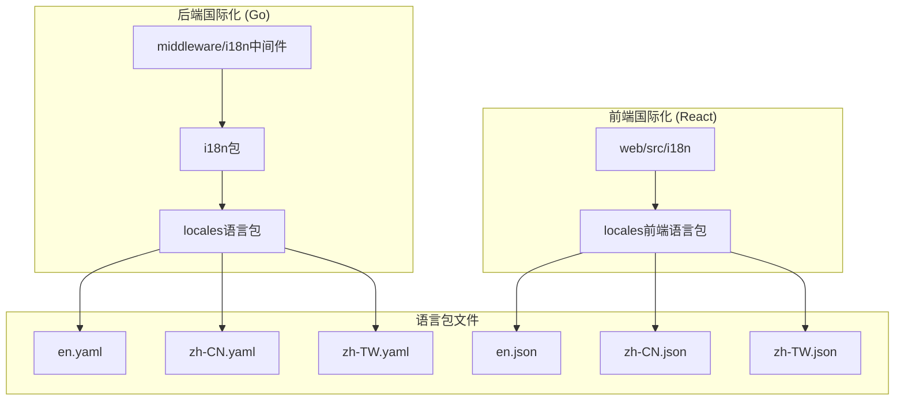

**图表来源**
- [i18n.go:1-232](file://i18n/i18n.go#L1-L232)
- [i18n.go:1-51](file://middleware/i18n.go#L1-L51)
- [i18n.js:1-58](file://web/src/i18n/i18n.js#L1-L58)

**章节来源**
- [i18n.go:1-232](file://i18n/i18n.go#L1-L232)
- [i18n.go:1-51](file://middleware/i18n.go#L1-L51)

## 核心组件

### 后端国际化组件

后端国际化系统由三个核心组件构成：

1. **i18n 包** - 主要的国际化引擎
2. **中间件** - 语言检测和设置
3. **语言包** - 多语言资源文件

### 前端国际化组件

前端国际化系统包含：

1. **i18n 配置** - React i18next 初始化
2. **语言检测** - 浏览器语言检测
3. **语言包** - 前端翻译资源

**章节来源**
- [i18n.go:1-232](file://i18n/i18n.go#L1-L232)
- [i18n.go:1-51](file://middleware/i18n.go#L1-L51)
- [i18n.js:1-58](file://web/src/i18n/i18n.js#L1-L58)

## 架构概览

国际化系统采用分层架构设计，实现了前后端分离的国际化解决方案：

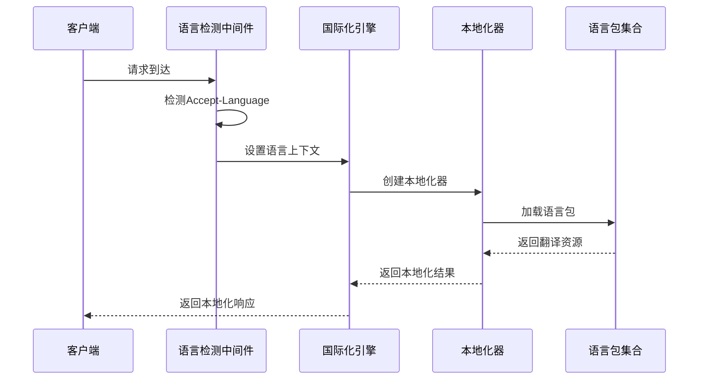

**图表来源**
- [i18n.go:124-177](file://i18n/i18n.go#L124-L177)
- [i18n.go:21-42](file://middleware/i18n.go#L21-L42)

系统架构的关键特性：

1. **嵌入式资源管理** - 使用 `//go:embed` 将语言包嵌入到二进制文件中
2. **本地化器缓存** - 预创建和缓存本地化器实例
3. **语言检测优先级** - 多层次的语言检测机制
4. **模板变量支持** - 支持复杂的模板替换和格式化

**章节来源**
- [i18n.go:25-61](file://i18n/i18n.go#L25-L61)
- [i18n.go:63-87](file://i18n/i18n.go#L63-L87)

## 详细组件分析

### 后端国际化引擎

后端国际化引擎是整个系统的核心，负责处理语言包加载、本地化和翻译逻辑。

#### 初始化流程

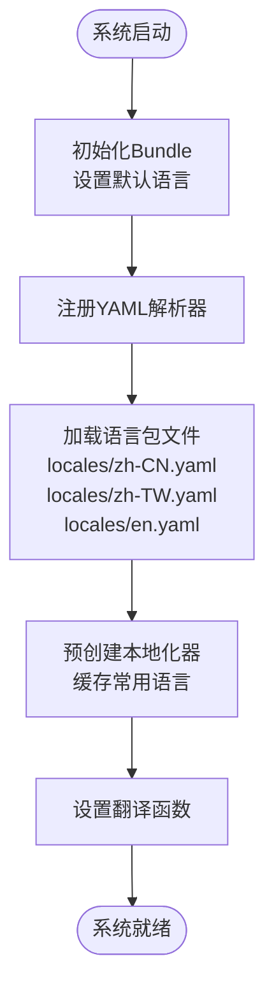

**图表来源**
- [i18n.go:36-61](file://i18n/i18n.go#L36-L61)

#### 语言检测机制

系统实现了多层次的语言检测机制：

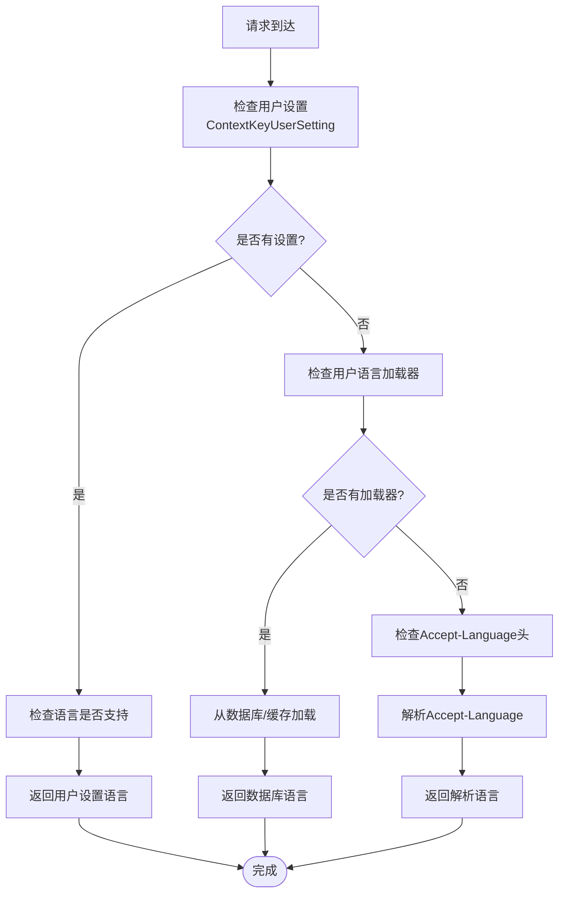

**图表来源**
- [i18n.go:124-177](file://i18n/i18n.go#L124-L177)

#### 翻译流程

翻译过程采用了高效的缓存策略：

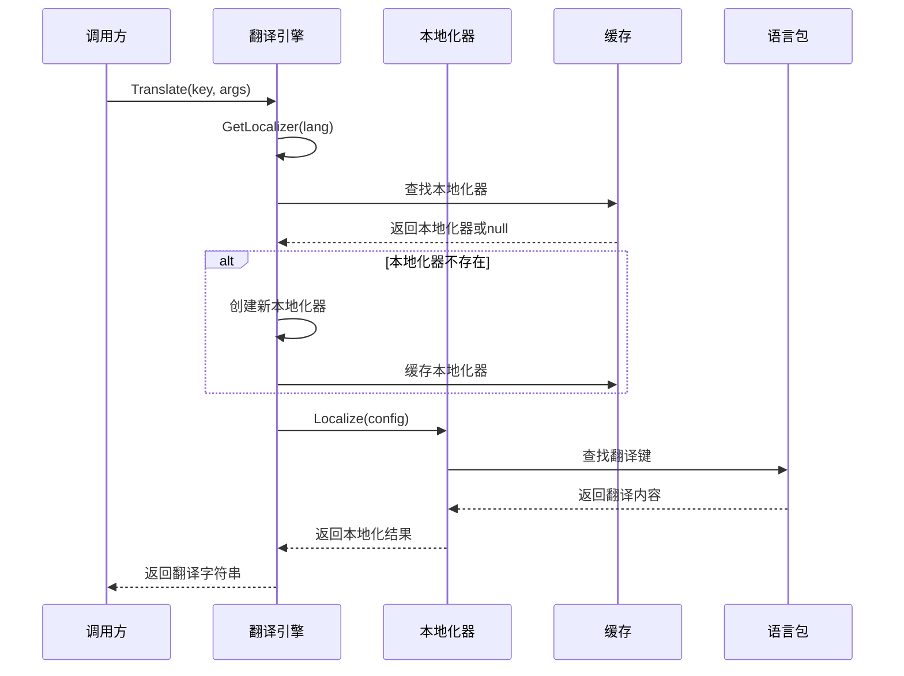

**图表来源**
- [i18n.go:63-113](file://i18n/i18n.go#L63-L113)

**章节来源**
- [i18n.go:18-61](file://i18n/i18n.go#L18-L61)
- [i18n.go:124-177](file://i18n/i18n.go#L124-L177)
- [i18n.go:89-113](file://i18n/i18n.go#L89-L113)

### 语言包管理系统

#### 语言包结构

语言包采用 YAML 格式，具有清晰的层次结构：

| 语言包 | 文件大小 | 键数量 | 支持状态 |
|--------|----------|--------|----------|
| en.yaml | 278 行 | 278 个键 | ✅ 完整 |
| zh-CN.yaml | 279 行 | 279 个键 | ✅ 完整 |
| zh-TW.yaml | 279 行 | 279 个键 | ✅ 完整 |

#### 键值命名规范

语言包遵循严格的命名规范：

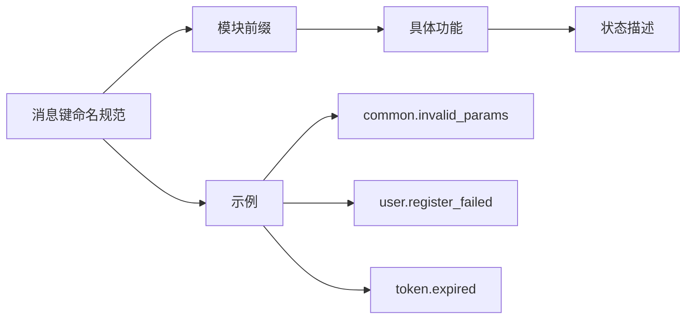

**图表来源**
- [keys.go:1-331](file://i18n/keys.go#L1-L331)

#### 模板变量支持

语言包支持复杂的模板变量替换：

| 变量类型 | 示例 | 描述 |
|----------|------|------|
| 基本变量 | `{{.Max}}` | 简单参数替换 |
| 复杂对象 | `{{.User.Name}}` | 结构体字段访问 |
| 数字格式 | `{{.Price}}` | 数值格式化 |
| 日期时间 | `{{.Date}}` | 日期格式化 |

**章节来源**
- [keys.go:1-331](file://i18n/keys.go#L1-L331)
- [en.yaml:1-278](file://i18n/locales/en.yaml#L1-L278)
- [zh-CN.yaml:1-279](file://i18n/locales/zh-CN.yaml#L1-L279)
- [zh-TW.yaml:1-279](file://i18n/locales/zh-TW.yaml#L1-L279)

### 前端国际化系统

#### React i18next 配置

前端国际化系统基于 i18next 框架构建，提供了完整的 React 集成：

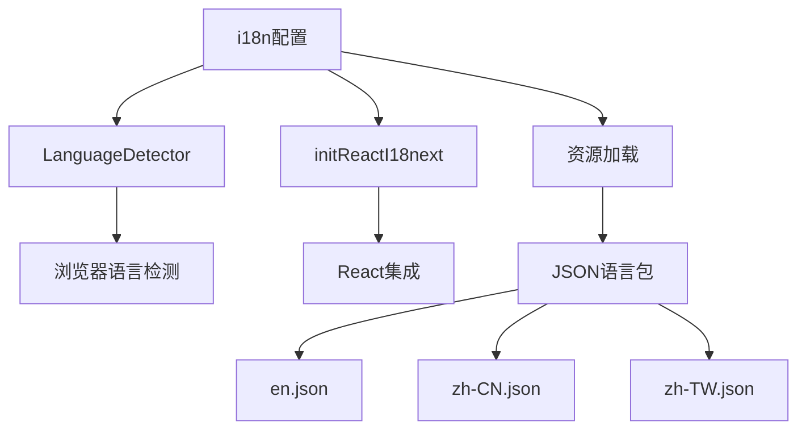

**图表来源**
- [i18n.js:33-53](file://web/src/i18n/i18n.js#L33-L53)

#### 语言包组织结构

前端语言包采用 JSON 格式，与后端保持一致的结构：

| 语言包 | 文件大小 | 键数量 | 支持状态 |
|--------|----------|--------|----------|
| en.json | 3521 行 | 3521 个键 | ✅ 完整 |
| zh-CN.json | 3007 行 | 3007 个键 | ✅ 完整 |
| zh-TW.json | 3143 行 | 3143 个键 | ✅ 完整 |

#### 语言标准化处理

前端提供了强大的语言标准化功能：

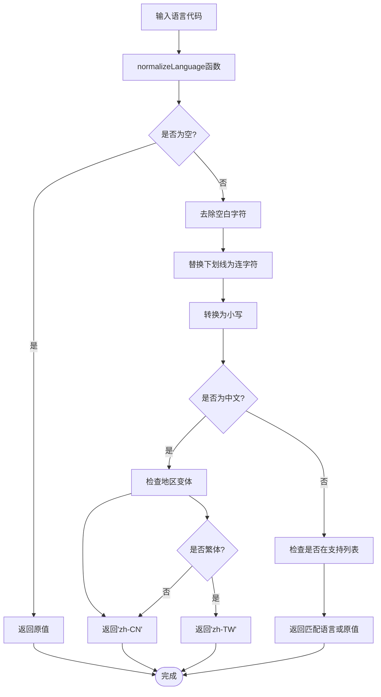

**图表来源**
- [language.js:30-61](file://web/src/i18n/language.js#L30-L61)

**章节来源**
- [i18n.js:1-58](file://web/src/i18n/i18n.js#L1-L58)
- [language.js:1-62](file://web/src/i18n/language.js#L1-L62)

### 中间件集成

#### 语言检测中间件

语言检测中间件实现了智能的语言选择逻辑：

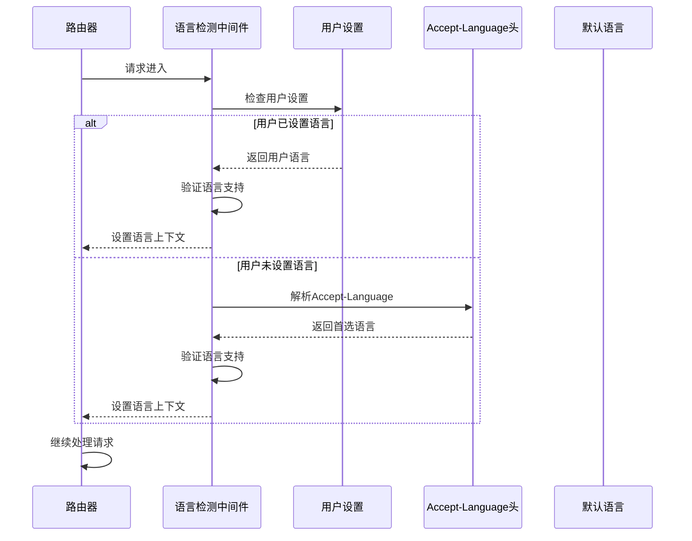

**图表来源**
- [i18n.go:13-42](file://middleware/i18n.go#L13-L42)

#### 语言获取工具

中间件提供了便捷的语言获取接口：

**章节来源**
- [i18n.go:1-51](file://middleware/i18n.go#L1-L51)

## 依赖关系分析

国际化系统展现了清晰的依赖关系和模块化设计：

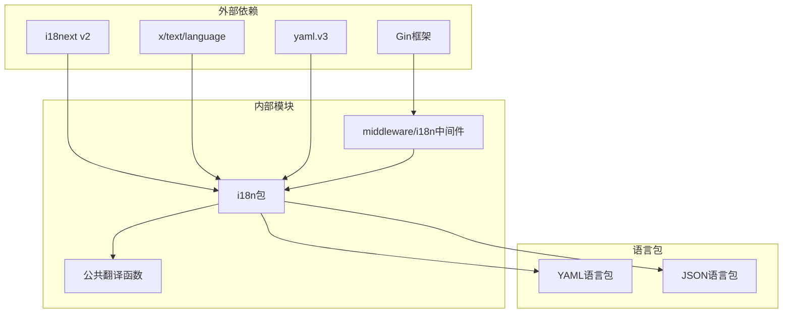

**图表来源**
- [i18n.go:3-16](file://i18n/i18n.go#L3-L16)
- [i18n.go:3-10](file://middleware/i18n.go#L3-L10)

### 关键依赖特性

1. **模块化设计** - 各组件职责明确，耦合度低
2. **嵌入式资源** - 语言包编译到二进制文件中，部署简单
3. **缓存优化** - 本地化器实例缓存，提高性能
4. **扩展性** - 易于添加新语言和新功能

**章节来源**
- [i18n.go:1-232](file://i18n/i18n.go#L1-L232)
- [i18n.go:1-51](file://middleware/i18n.go#L1-L51)

## 性能考虑

### 缓存策略

系统采用了多层次的缓存策略来优化性能：

1. **Bundle 缓存** - 语言包集合缓存
2. **Localizer 缓存** - 本地化器实例缓存
3. **翻译结果缓存** - 频繁使用的翻译结果缓存

### 内存优化

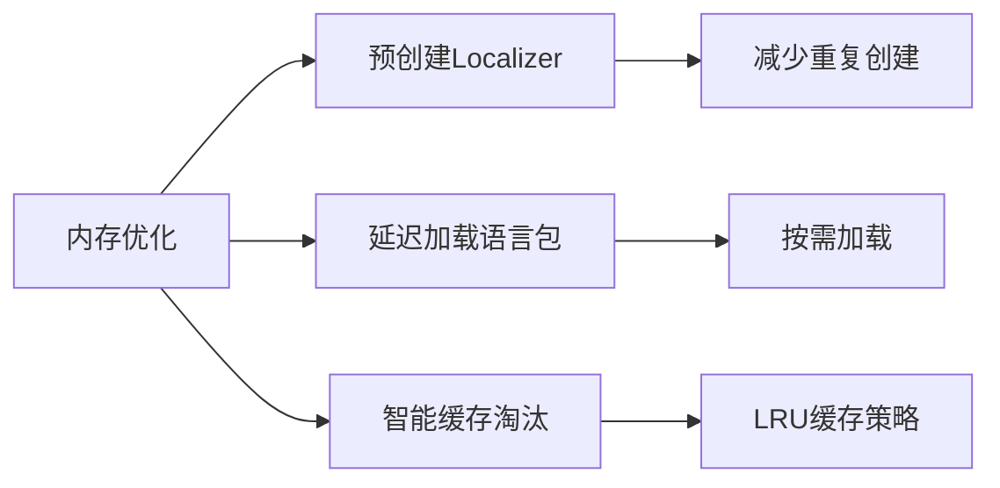

### 并发安全

系统使用了读写锁确保并发安全性：

- **读锁** - 多个 goroutine 可以同时读取
- **写锁** - 独占访问用于创建新本地化器
- **双重检查** - 防止竞态条件

**章节来源**
- [i18n.go:28-33](file://i18n/i18n.go#L28-L33)
- [i18n.go:67-86](file://i18n/i18n.go#L67-L86)

## 故障排除指南

### 常见问题诊断

#### 语言包加载失败

**症状**：应用程序启动时报语言包加载错误

**排查步骤**：
1. 检查 `//go:embed` 路径是否正确
2. 验证 YAML 文件语法
3. 确认文件编码为 UTF-8

**解决方案**：
```go
// 确保嵌入路径正确
//go:embed locales/*.yaml
var localeFS embed.FS
```

#### 语言检测异常

**症状**：用户语言设置不生效

**排查步骤**：
1. 检查用户设置是否正确存储
2. 验证语言代码格式
3. 确认语言包支持该语言

**解决方案**：
```go
// 使用标准化函数
lang := normalizeLang(userSetting.Language)
```

#### 翻译键缺失

**症状**：显示翻译键而非实际文本

**排查步骤**：
1. 检查翻译键是否存在
2. 验证 YAML 文件结构
3. 确认键值格式正确

**解决方案**：
```go
// 回退到键名
msg, err := loc.Localize(config)
if err != nil {
    return key  // 返回键名作为回退
}
```

### 调试技巧

#### 启用调试模式

```go
// 在开发环境中启用详细日志
log.SetLevel(log.DebugLevel)
```

#### 语言包验证

```go
// 验证语言包完整性
func validateLanguagePack(lang string) error {
    // 检查必需键
    // 验证模板语法
    // 确认无重复键
    return nil
}
```

**章节来源**
- [i18n.go:89-113](file://i18n/i18n.go#L89-L113)
- [i18n.go:179-198](file://i18n/i18n.go#L179-L198)

## 结论

New API 的国际化系统展现了优秀的工程实践，具有以下突出特点：

### 技术优势

1. **架构设计优秀** - 分层清晰，职责明确
2. **性能优化到位** - 多层次缓存和并发安全
3. **扩展性强** - 易于添加新语言和新功能
4. **用户体验佳** - 自动语言检测和无缝切换

### 最佳实践

1. **标准化命名** - 严格的消息键命名规范
2. **模板变量** - 支持复杂的参数替换
3. **嵌入式资源** - 简化部署和分发
4. **缓存策略** - 高效的性能优化

### 发展建议

1. **动态语言包** - 考虑支持运行时动态加载
2. **实时翻译** - 添加实时翻译功能
3. **机器学习** - 利用 ML 提高翻译质量
4. **社区贡献** - 建立翻译贡献机制

该国际化系统为 New API 提供了坚实的基础，支持全球化业务发展，同时为未来的扩展和优化奠定了良好基础。