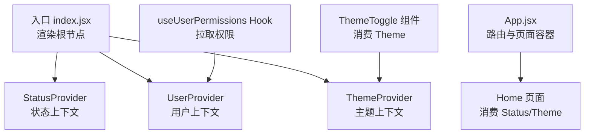
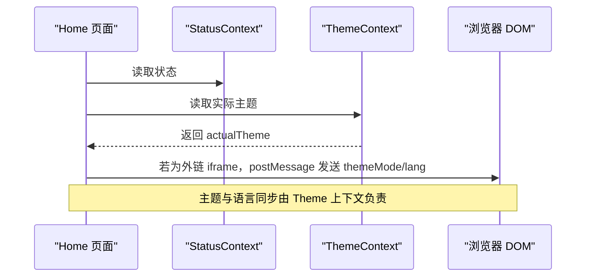
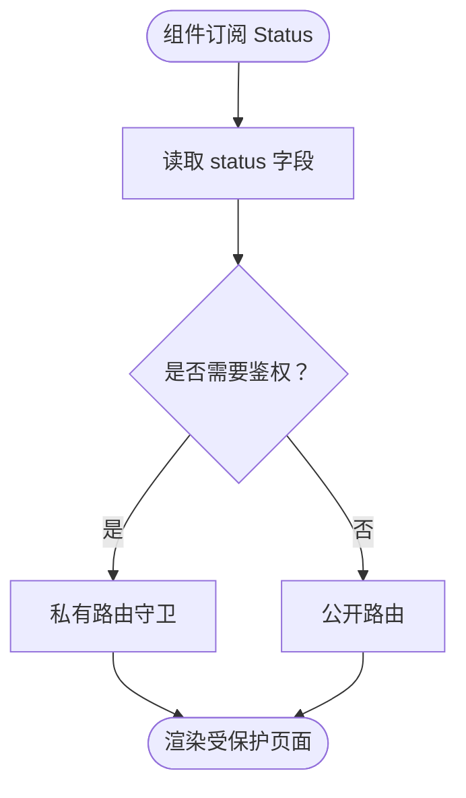
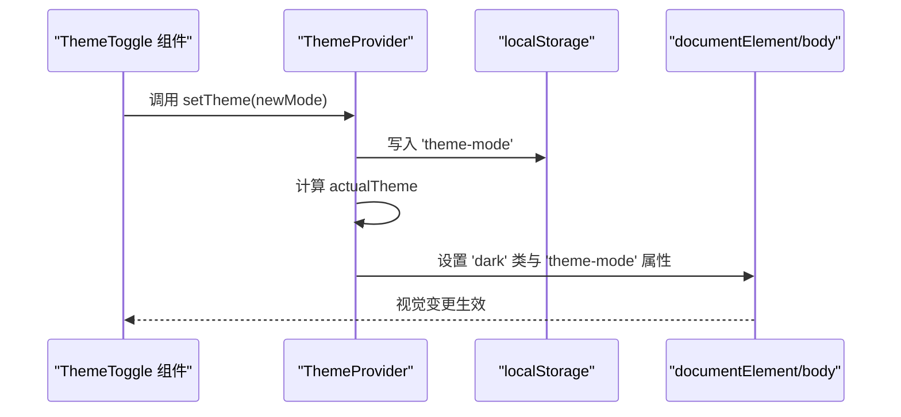
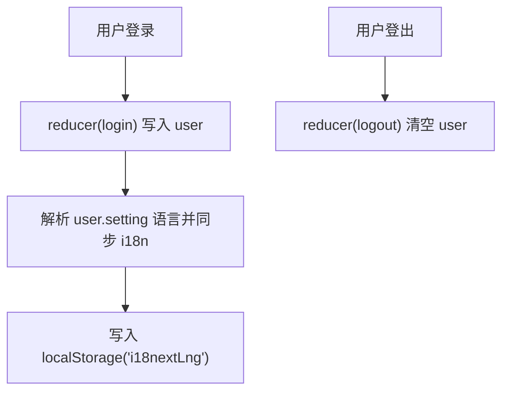
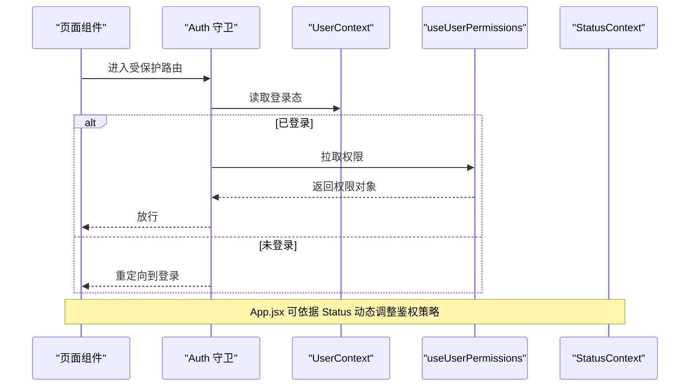
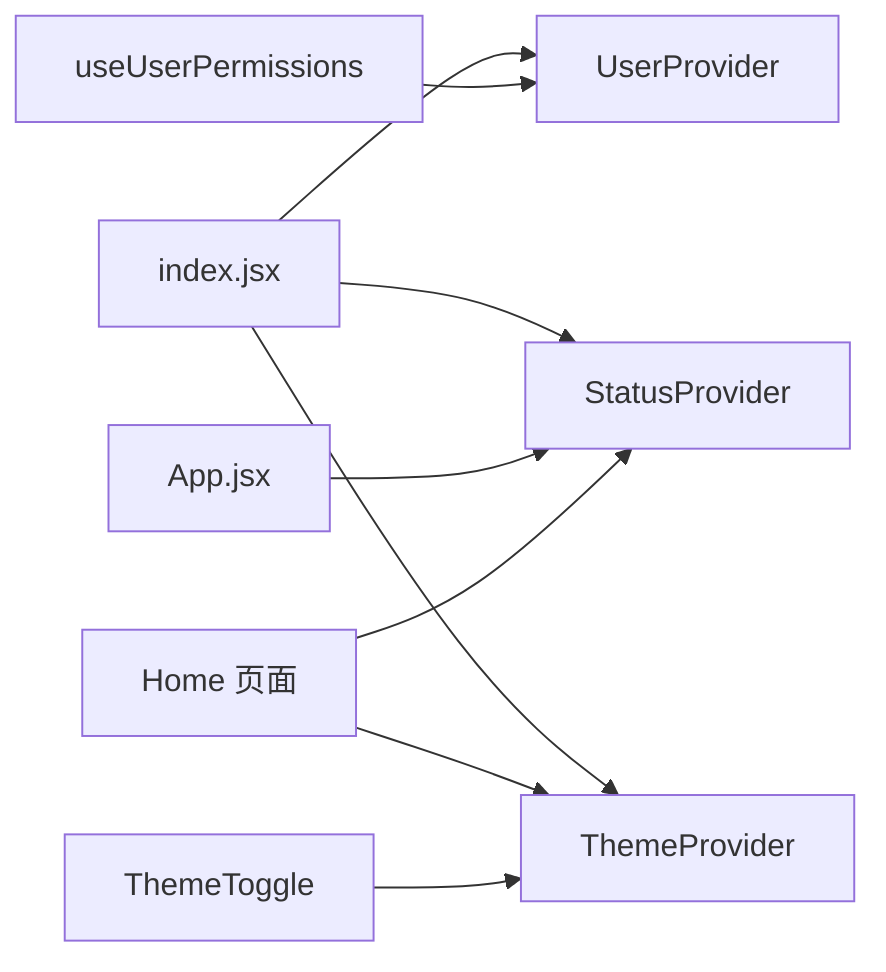

# 状态管理

<cite>
**本文引用的文件**
- [web/src/index.jsx](file://web/src/index.jsx)
- [web/src/App.jsx](file://web/src/App.jsx)
- [web/src/context/Status/index.jsx](file://web/src/context/Status/index.jsx)
- [web/src/context/Status/reducer.js](file://web/src/context/Status/reducer.js)
- [web/src/context/Theme/index.jsx](file://web/src/context/Theme/index.jsx)
- [web/src/context/User/index.jsx](file://web/src/context/User/index.jsx)
- [web/src/context/User/reducer.js](file://web/src/context/User/reducer.js)
- [web/src/components/layout/headerbar/ThemeToggle.jsx](file://web/src/components/layout/headerbar/ThemeToggle.jsx)
- [web/src/pages/Home/index.jsx](file://web/src/pages/Home/index.jsx)
- [web/src/hooks/common/useUserPermissions.js](file://web/src/hooks/common/useUserPermissions.js)
- [web/src/helpers/auth.jsx](file://web/src/helpers/auth.jsx)
</cite>

## 目录
1. [简介](#简介)
2. [项目结构](#项目结构)
3. [核心组件](#核心组件)
4. [架构总览](#架构总览)
5. [详细组件分析](#详细组件分析)
6. [依赖关系分析](#依赖关系分析)
7. [性能考量](#性能考量)
8. [故障排查指南](#故障排查指南)
9. [结论](#结论)
10. [附录](#附录)

## 简介
本文件面向 New API 前端的状态管理系统，聚焦于 Context API 的使用模式、状态提升策略与组件间通信机制。文档围绕 Status、Theme、User 三大上下文展开，系统阐述其状态结构、更新机制、订阅模式、自定义 Hook 设计、状态持久化与同步策略，并结合权限管理、主题切换与用户信息流转，给出最佳实践、性能优化与调试方法。

## 项目结构
前端入口在应用根节点集中注入三大 Provider：StatusProvider、UserProvider、ThemeProvider，随后通过路由与页面组件消费上下文或自定义 Hook 实现状态驱动的 UI 行为。

图表来源
- [web/src/index.jsx:58-77](file://web/src/index.jsx#L58-L77)
- [web/src/App.jsx:64-384](file://web/src/App.jsx#L64-L384)
- [web/src/pages/Home/index.jsx:68-149](file://web/src/pages/Home/index.jsx#L68-L149)
- [web/src/components/layout/headerbar/ThemeToggle.jsx:25-112](file://web/src/components/layout/headerbar/ThemeToggle.jsx#L25-L112)
- [web/src/hooks/common/useUserPermissions.js:26-117](file://web/src/hooks/common/useUserPermissions.js#L26-L117)

章节来源
- [web/src/index.jsx:58-77](file://web/src/index.jsx#L58-L77)
- [web/src/App.jsx:64-384](file://web/src/App.jsx#L64-L384)

## 核心组件
- Status 上下文：提供系统运行时状态（如 HeaderNavModules、版本号、演示开关等），用于控制导航模块可见性与路由鉴权策略。
- Theme 上下文：提供主题模式（light/dark/auto）及其实际应用值、设置函数；支持系统主题监听与 DOM 属性同步。
- User 上下文：提供用户登录态与设置（含语言偏好），并负责语言同步至 i18n。

章节来源
- [web/src/context/Status/index.jsx:23-36](file://web/src/context/Status/index.jsx#L23-L36)
- [web/src/context/Status/reducer.js:20-39](file://web/src/context/Status/reducer.js#L20-L39)
- [web/src/context/Theme/index.jsx:28-114](file://web/src/context/Theme/index.jsx#L28-L114)
- [web/src/context/User/index.jsx:25-57](file://web/src/context/User/index.jsx#L25-L57)
- [web/src/context/User/reducer.js:20-40](file://web/src/context/User/reducer.js#L20-L40)

## 架构总览
以下序列图展示“首页读取系统状态并传递主题模式”的典型流程，体现 Context 的单向数据流与跨组件通信。

图表来源
- [web/src/pages/Home/index.jsx:70-105](file://web/src/pages/Home/index.jsx#L70-L105)
- [web/src/context/Theme/index.jsx:78-88](file://web/src/context/Theme/index.jsx#L78-L88)

## 详细组件分析

### Status 上下文
- 状态结构：包含 status 字段，初始为空；典型字段包括 HeaderNavModules、demo_site_enabled、docs_link、server_address、version 等。
- 更新机制：通过 reducer 支持 set/unset 两类动作，set 将 payload 写入 status，unset 清空。
- 订阅模式：组件通过 useContext(StatusContext) 订阅状态；App.jsx 中基于 status 动态计算定价页是否需要鉴权。
- 状态提升策略：App.jsx 在顶层根据 Status 状态决定路由守卫策略，避免在多处重复解析配置。

图表来源
- [web/src/App.jsx:69-88](file://web/src/App.jsx#L69-L88)
- [web/src/context/Status/reducer.js:20-35](file://web/src/context/Status/reducer.js#L20-L35)

章节来源
- [web/src/context/Status/index.jsx:23-36](file://web/src/context/Status/index.jsx#L23-L36)
- [web/src/context/Status/reducer.js:20-39](file://web/src/context/Status/reducer.js#L20-L39)
- [web/src/App.jsx:69-88](file://web/src/App.jsx#L69-L88)

### Theme 上下文
- 状态结构：包含三类值
  - theme：用户设置（'light' | 'dark' | 'auto'），默认 'auto'
  - actualTheme：实际应用的主题（由 theme 与系统主题计算得出）
  - setTheme：设置主题的回调，同时写入 localStorage
- 更新机制：setTheme 接收布尔或字符串参数，内部标准化后更新状态并持久化。
- 订阅模式：useTheme/useActualTheme/useSetTheme 三个 Hook 分别暴露不同维度的上下文值。
- 状态持久化与同步：初始化优先读取 localStorage('theme-mode')，监听系统主题变化，应用到 documentElement.classList 并设置 body 属性以驱动样式。

图表来源
- [web/src/context/Theme/index.jsx:47-114](file://web/src/context/Theme/index.jsx#L47-L114)
- [web/src/components/layout/headerbar/ThemeToggle.jsx:25-112](file://web/src/components/layout/headerbar/ThemeToggle.jsx#L25-L112)

章节来源
- [web/src/context/Theme/index.jsx:28-114](file://web/src/context/Theme/index.jsx#L28-L114)
- [web/src/components/layout/headerbar/ThemeToggle.jsx:25-112](file://web/src/components/layout/headerbar/ThemeToggle.jsx#L25-L112)

### User 上下文
- 状态结构：包含 user 字段，初始为空；当存在时可包含用户设置（如语言）。
- 更新机制：reducer 支持 login/logout 两类动作，分别写入/清空 user。
- 订阅模式：组件通过 useContext(UserContext) 订阅用户状态。
- 状态同步：UserProvider 在用户设置变化时，解析用户设置中的语言并同步到 i18n 与 localStorage，确保界面语言与用户偏好一致。

图表来源
- [web/src/context/User/index.jsx:30-57](file://web/src/context/User/index.jsx#L30-L57)
- [web/src/context/User/reducer.js:20-36](file://web/src/context/User/reducer.js#L20-L36)

章节来源
- [web/src/context/User/index.jsx:25-57](file://web/src/context/User/index.jsx#L25-L57)
- [web/src/context/User/reducer.js:20-40](file://web/src/context/User/reducer.js#L20-L40)

### 权限管理与路由守卫
- 权限来源：useUserPermissions Hook 通过调用后端接口获取用户权限，返回权限对象与工具方法。
- 守卫策略：auth.jsx 提供 AuthRedirect/PrivateRoute/AdminRoute 三种守卫，结合用户登录态与角色进行路由拦截。
- 与 Status 协作：App.jsx 基于 Status 中的 HeaderNavModules 动态决定“定价”页面是否需要登录鉴权，实现运行时策略下发。

图表来源
- [web/src/helpers/auth.jsx:35-69](file://web/src/helpers/auth.jsx#L35-L69)
- [web/src/hooks/common/useUserPermissions.js:26-117](file://web/src/hooks/common/useUserPermissions.js#L26-L117)
- [web/src/App.jsx:69-88](file://web/src/App.jsx#L69-L88)

章节来源
- [web/src/helpers/auth.jsx:35-69](file://web/src/helpers/auth.jsx#L35-L69)
- [web/src/hooks/common/useUserPermissions.js:26-117](file://web/src/hooks/common/useUserPermissions.js#L26-L117)
- [web/src/App.jsx:69-88](file://web/src/App.jsx#L69-L88)

### 自定义 Hook 设计模式
- useUserPermissions：封装权限拉取逻辑，提供权限查询工具（区域/模块级），统一错误处理与加载状态，便于在多个页面复用。
- 设计要点：独立的数据获取、清晰的返回值结构、与 Context 解耦，避免在组件内分散权限判断逻辑。

章节来源
- [web/src/hooks/common/useUserPermissions.js:26-117](file://web/src/hooks/common/useUserPermissions.js#L26-L117)

### 状态持久化与同步策略
- Theme：localStorage('theme-mode') 持久化用户选择；系统主题变化监听实时更新 actualTheme 并同步 DOM。
- User：localStorage('i18nextLng') 持久化语言；UserProvider 在用户设置变化时同步 i18n 语言。
- Status：App.jsx 从 Status 中读取配置并动态影响路由行为，无需额外持久化。

章节来源
- [web/src/context/Theme/index.jsx:47-114](file://web/src/context/Theme/index.jsx#L47-L114)
- [web/src/context/User/index.jsx:30-57](file://web/src/context/User/index.jsx#L30-L57)
- [web/src/App.jsx:69-88](file://web/src/App.jsx#L69-L88)

## 依赖关系分析
- 入口依赖：index.jsx 注入三大 Provider，形成全局状态树。
- 组件依赖：页面与组件通过 useContext 或自定义 Hook 访问状态；ThemeToggle 仅依赖 Theme；Home 同时依赖 Status 与 Theme；useUserPermissions 依赖后端 API。
- 路由依赖：App.jsx 作为路由容器，根据 Status 动态决定路由守卫策略，间接依赖 Status。

图表来源
- [web/src/index.jsx:58-77](file://web/src/index.jsx#L58-L77)
- [web/src/App.jsx:64-384](file://web/src/App.jsx#L64-L384)
- [web/src/pages/Home/index.jsx:68-149](file://web/src/pages/Home/index.jsx#L68-L149)
- [web/src/components/layout/headerbar/ThemeToggle.jsx:25-112](file://web/src/components/layout/headerbar/ThemeToggle.jsx#L25-L112)
- [web/src/hooks/common/useUserPermissions.js:26-117](file://web/src/hooks/common/useUserPermissions.js#L26-L117)

章节来源
- [web/src/index.jsx:58-77](file://web/src/index.jsx#L58-L77)
- [web/src/App.jsx:64-384](file://web/src/App.jsx#L64-L384)

## 性能考量
- Context 订阅粒度：ThemeToggle 仅订阅 actualTheme，避免因主题切换导致非必要重渲染。
- 计算缓存：App.jsx 中对 HeaderNavModules 的解析使用 useMemo，减少重复解析开销。
- 异步加载：useUserPermissions 对权限请求进行统一处理，避免在多个组件中重复发起请求。
- DOM 同步：Theme 上下文仅在 actualTheme 变更时更新 DOM 属性，降低样式抖动风险。

章节来源
- [web/src/components/layout/headerbar/ThemeToggle.jsx:25-112](file://web/src/components/layout/headerbar/ThemeToggle.jsx#L25-L112)
- [web/src/App.jsx:69-88](file://web/src/App.jsx#L69-L88)
- [web/src/hooks/common/useUserPermissions.js:26-117](file://web/src/hooks/common/useUserPermissions.js#L26-L117)
- [web/src/context/Theme/index.jsx:78-88](file://web/src/context/Theme/index.jsx#L78-L88)

## 故障排查指南
- 主题不生效
  - 检查 localStorage('theme-mode') 是否正确写入
  - 确认 documentElement.classList 与 body 属性是否按 actualTheme 更新
  - 参考路径：[web/src/context/Theme/index.jsx:78-105](file://web/src/context/Theme/index.jsx#L78-L105)
- 语言不同步
  - 确认 UserProvider 是否解析 user.setting 并调用 i18n.changeLanguage
  - 检查 localStorage('i18nextLng') 是否写入
  - 参考路径：[web/src/context/User/index.jsx:34-50](file://web/src/context/User/index.jsx#L34-L50)
- 路由鉴权异常
  - 检查 Status 中 HeaderNavModules 的格式与 requireAuth 配置
  - 确认 App.jsx 的解析逻辑与 useMemo 缓存
  - 参考路径：[web/src/App.jsx:69-88](file://web/src/App.jsx#L69-L88)
- 权限判断不准确
  - 确认 useUserPermissions 是否成功拉取权限并缓存
  - 检查后端返回的 permissions 结构是否符合预期
  - 参考路径：[web/src/hooks/common/useUserPermissions.js:26-117](file://web/src/hooks/common/useUserPermissions.js#L26-L117)
- 登录态失效
  - 检查 authHeader 与路由守卫是否正确读取 localStorage('user')
  - 参考路径：[web/src/helpers/auth.jsx:24-69](file://web/src/helpers/auth.jsx#L24-L69)

章节来源
- [web/src/context/Theme/index.jsx:78-105](file://web/src/context/Theme/index.jsx#L78-L105)
- [web/src/context/User/index.jsx:34-50](file://web/src/context/User/index.jsx#L34-L50)
- [web/src/App.jsx:69-88](file://web/src/App.jsx#L69-L88)
- [web/src/hooks/common/useUserPermissions.js:26-117](file://web/src/hooks/common/useUserPermissions.js#L26-L117)
- [web/src/helpers/auth.jsx:24-69](file://web/src/helpers/auth.jsx#L24-L69)

## 结论
New API 前端采用 Context API 与自定义 Hook 构建轻量级状态管理：Status 提供运行时策略，Theme 提供主题持久化与 DOM 同步，User 提供用户偏好与语言同步。配合 useMemo 与 Hook 抽象，系统在保证安全性的同时实现了良好的性能与可维护性。建议后续在权限与状态规模扩大时引入更细粒度的拆分与选择性订阅，进一步降低重渲染成本。

## 附录
- Hook 使用指南
  - 访问主题：useActualTheme 获取实际主题；useSetTheme 设置主题；useTheme 获取用户设置
    - 参考路径：[web/src/context/Theme/index.jsx:28-35](file://web/src/context/Theme/index.jsx#L28-L35)
  - 访问用户：useContext(UserContext) 订阅用户状态；useUserPermissions 拉取权限
    - 参考路径：[web/src/context/User/index.jsx:25-57](file://web/src/context/User/index.jsx#L25-L57), [web/src/hooks/common/useUserPermissions.js:26-117](file://web/src/hooks/common/useUserPermissions.js#L26-L117)
  - 访问状态：useContext(StatusContext) 订阅系统状态
    - 参考路径：[web/src/context/Status/index.jsx:23-26](file://web/src/context/Status/index.jsx#L23-L26)
- 状态架构设计原则
  - 单一职责：每个 Context 负责一类领域状态
  - 最小订阅：组件仅订阅所需上下文，避免跨域重渲染
  - 明确边界：权限与登录态通过专用 Hook 与守卫处理，不混入业务组件
  - 可测试性：将异步数据拉取与副作用抽离为 Hook，便于单元测试