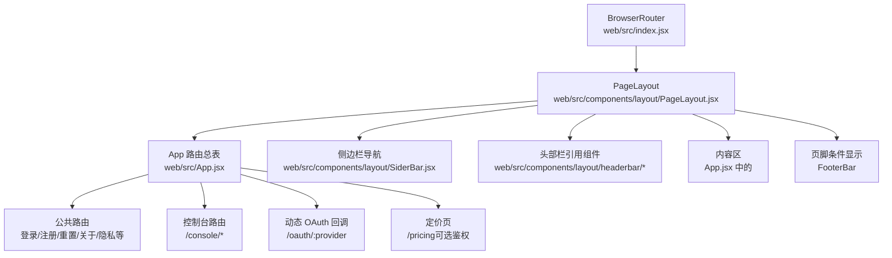
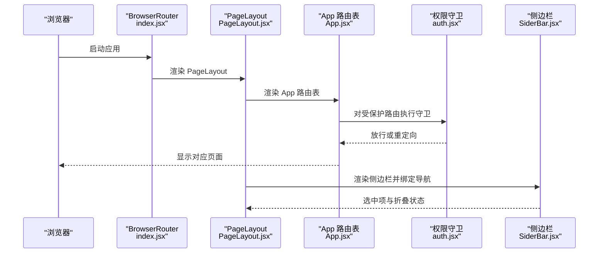
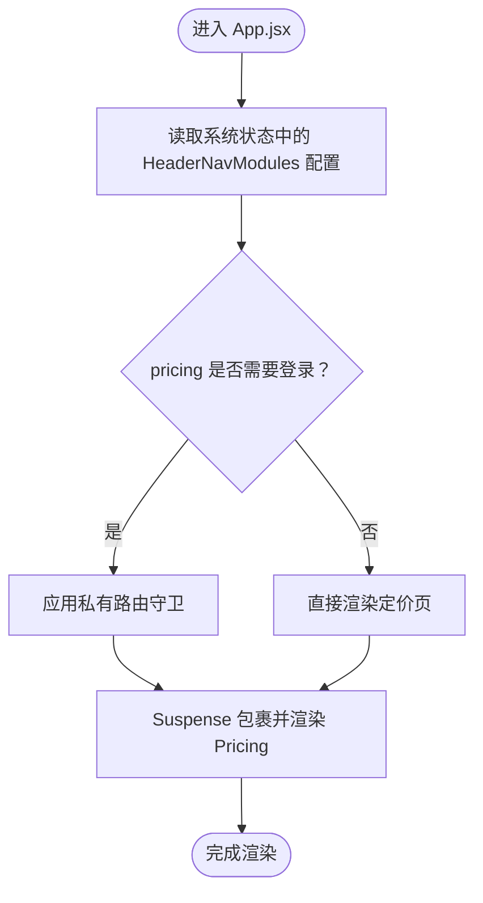
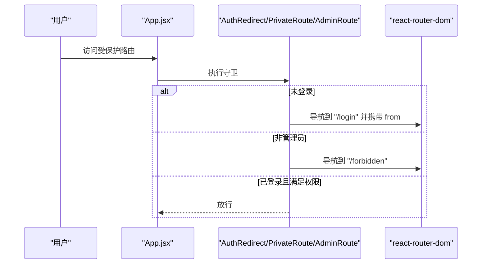
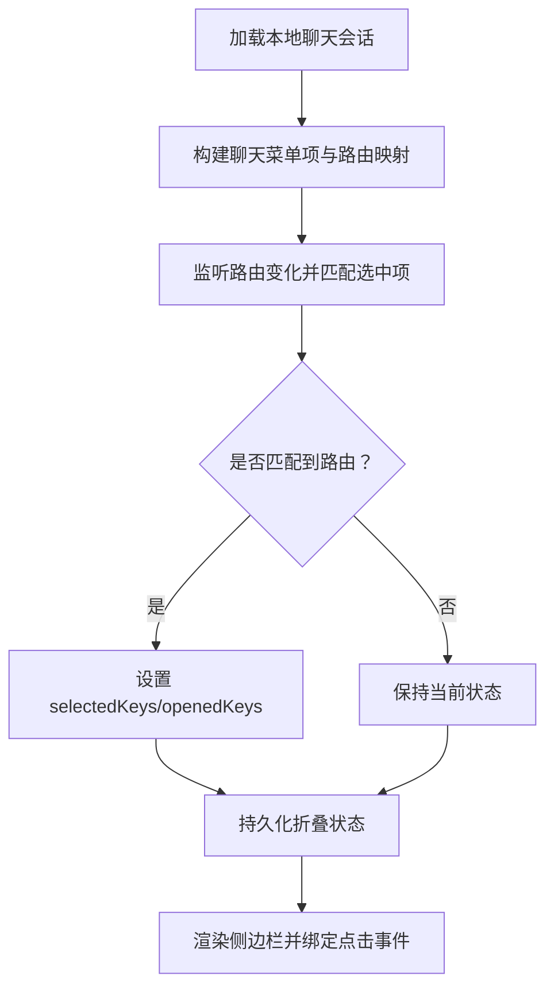
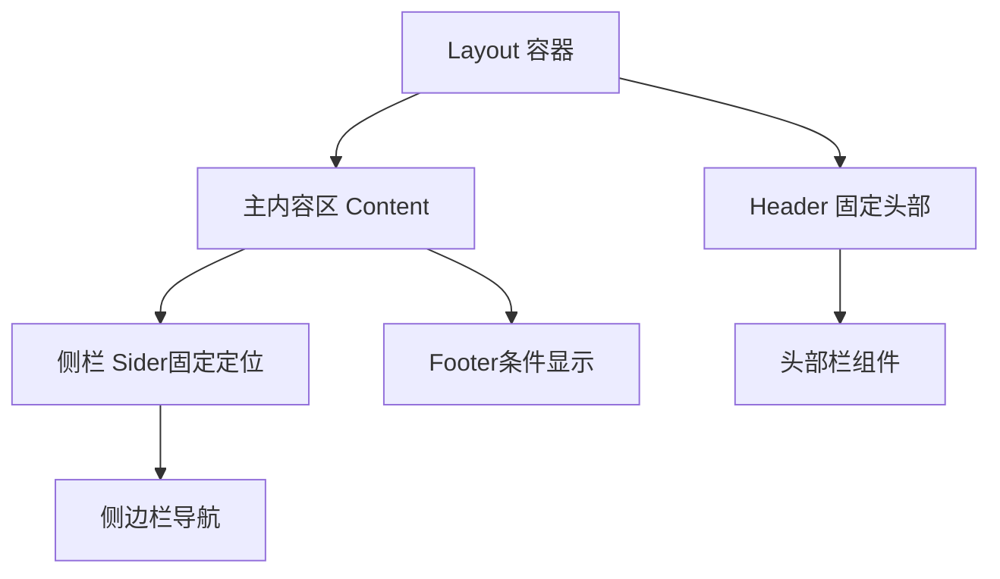
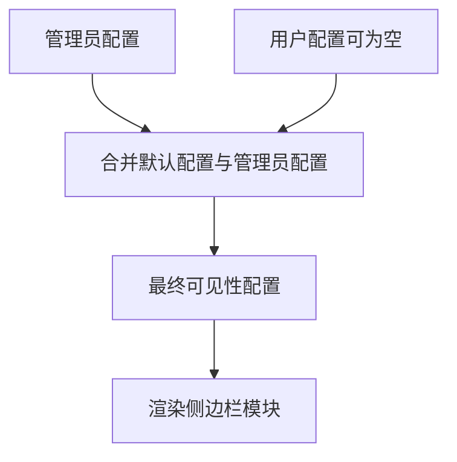
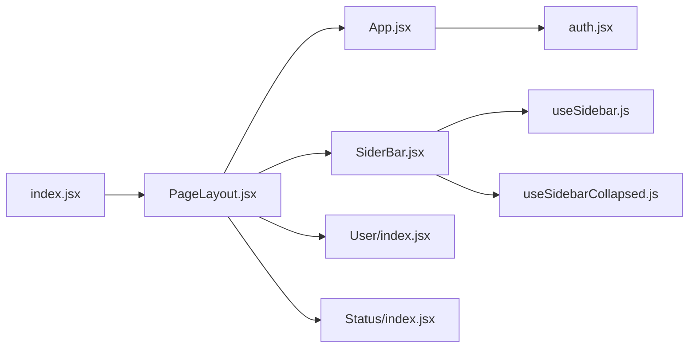

# 路由与导航

<cite>
**本文引用的文件**
- [web/src/index.jsx](file://web/src/index.jsx)
- [web/src/App.jsx](file://web/src/App.jsx)
- [web/src/components/layout/PageLayout.jsx](file://web/src/components/layout/PageLayout.jsx)
- [web/src/components/layout/SiderBar.jsx](file://web/src/components/layout/SiderBar.jsx)
- [web/src/helpers/auth.jsx](file://web/src/helpers/auth.jsx)
- [web/src/hooks/common/useSidebar.js](file://web/src/hooks/common/useSidebar.js)
- [web/src/hooks/common/useSidebarCollapsed.js](file://web/src/hooks/common/useSidebarCollapsed.js)
- [web/src/context/User/index.jsx](file://web/src/context/User/index.jsx)
- [web/src/context/Status/index.jsx](file://web/src/context/Status/index.jsx)
</cite>

## 目录
1. [简介](#简介)
2. [项目结构](#项目结构)
3. [核心组件](#核心组件)
4. [架构总览](#架构总览)
5. [详细组件分析](#详细组件分析)
6. [依赖关系分析](#依赖关系分析)
7. [性能考量](#性能考量)
8. [故障排查指南](#故障排查指南)
9. [结论](#结论)
10. [附录](#附录)

## 简介
本文件面向 New API 前端的“路由与导航”系统，围绕 React Router 的配置、路由守卫、导航组件设计进行系统化技术说明。重点覆盖：
- 路由配置与动态路由生成（含参数化路由与动态 OAuth 回调）
- 权限控制导航（私有路由、管理员路由、登录重定向）
- 侧边栏导航、分组与高亮、折叠状态管理
- 页面布局结构与响应式设计（移动端抽屉、固定头部与侧栏）
- 导航状态管理（选中项、打开项、本地持久化）
- 导航历史记录与回退策略
- 最佳实践、用户体验优化与移动端适配

## 项目结构
前端入口通过浏览器路由容器包裹应用根组件，应用根组件集中声明所有路由规则；页面布局负责组织头部、侧边栏、内容区与页脚，并根据路由路径决定侧栏显示与内边距等行为。

图表来源
- [web/src/index.jsx:55-77](file://web/src/index.jsx#L55-L77)
- [web/src/components/layout/PageLayout.jsx:147-238](file://web/src/components/layout/PageLayout.jsx#L147-L238)
- [web/src/App.jsx:90-383](file://web/src/App.jsx#L90-L383)

章节来源
- [web/src/index.jsx:55-77](file://web/src/index.jsx#L55-L77)
- [web/src/components/layout/PageLayout.jsx:44-118](file://web/src/components/layout/PageLayout.jsx#L44-L118)
- [web/src/App.jsx:64-383](file://web/src/App.jsx#L64-L383)

## 核心组件
- 浏览器路由容器与应用根：在入口文件中使用路由容器包裹应用，启用 v7 新特性以提升过渡与路径处理体验。
- 应用路由总表：集中声明所有路由，包括静态路由、控制台路由、动态 OAuth 回调、定价页等，并对部分路由应用权限守卫。
- 页面布局：负责头部、侧栏、内容区、页脚的组合与响应式布局，根据当前路由路径决定侧栏显示、内边距与页脚显示。
- 侧边栏导航：按模块分组渲染，支持动态聊天会话路由注入、权限过滤、选中高亮、折叠状态持久化。
- 权限守卫：提供登录态校验与管理员角色校验，支持登录重定向与无权限跳转。
- 导航状态钩子：侧栏折叠状态持久化与侧栏模块可见性计算。

章节来源
- [web/src/index.jsx:55-77](file://web/src/index.jsx#L55-L77)
- [web/src/App.jsx:90-383](file://web/src/App.jsx#L90-L383)
- [web/src/components/layout/PageLayout.jsx:147-238](file://web/src/components/layout/PageLayout.jsx#L147-L238)
- [web/src/components/layout/SiderBar.jsx:33-533](file://web/src/components/layout/SiderBar.jsx#L33-L533)
- [web/src/helpers/auth.jsx:35-69](file://web/src/helpers/auth.jsx#L35-L69)
- [web/src/hooks/common/useSidebar.js:79-301](file://web/src/hooks/common/useSidebar.js#L79-L301)
- [web/src/hooks/common/useSidebarCollapsed.js:24-43](file://web/src/hooks/common/useSidebarCollapsed.js#L24-L43)

## 架构总览
下图展示从浏览器到路由、布局与导航的整体流程：

图表来源
- [web/src/index.jsx:55-77](file://web/src/index.jsx#L55-L77)
- [web/src/components/layout/PageLayout.jsx:147-238](file://web/src/components/layout/PageLayout.jsx#L147-L238)
- [web/src/App.jsx:90-383](file://web/src/App.jsx#L90-L383)
- [web/src/helpers/auth.jsx:35-69](file://web/src/helpers/auth.jsx#L35-L69)
- [web/src/components/layout/SiderBar.jsx:403-441](file://web/src/components/layout/SiderBar.jsx#L403-L441)

## 详细组件分析

### 路由配置与动态路由生成
- 入口与容器
  - 在入口文件中使用浏览器路由容器包裹应用根组件，启用 v7 相对通配符与过渡特性，保证平滑切换与路径解析一致性。
- 路由总表
  - 集中声明所有路由，包括首页、控制台、设置、个人中心、定价、关于、隐私政策、登录/注册/重置、OAuth 回调等。
  - 定价页支持按系统状态动态决定是否需要登录鉴权，从而实现“公开/私有”两种模式的灵活切换。
  - 动态 OAuth 回调通过参数化路由捕获 provider 并渲染对应回调组件，同时保留通用回调组件以适配未知提供商。
  - 控制台路由采用私有守卫包装，确保仅登录用户可访问。
- 动态聊天路由
  - 侧边栏根据本地存储的聊天会话列表动态生成“/console/chat/:id”类路由，并在导航选中状态中识别这些路径，实现活动高亮。

图表来源
- [web/src/App.jsx:69-88](file://web/src/App.jsx#L69-L88)
- [web/src/App.jsx:319-336](file://web/src/App.jsx#L319-L336)

章节来源
- [web/src/index.jsx:55-77](file://web/src/index.jsx#L55-L77)
- [web/src/App.jsx:90-383](file://web/src/App.jsx#L90-L383)

### 路由守卫与导航组件设计
- 登录重定向
  - 对于登录/注册等页面，若检测到已登录用户则重定向至控制台首页，避免重复登录。
- 私有路由
  - 未登录用户访问受保护路由时，重定向至登录页，并携带来源地址以便登录后回跳。
- 管理员路由
  - 通过本地存储中的用户角色判断，非管理员或未登录将被重定向至无权限页。
- OAuth 回调
  - 统一的回调组件接收 provider 参数，内部根据类型处理不同提供商的授权回调逻辑。

图表来源
- [web/src/helpers/auth.jsx:35-69](file://web/src/helpers/auth.jsx#L35-L69)

章节来源
- [web/src/helpers/auth.jsx:35-69](file://web/src/helpers/auth.jsx#L35-L69)

### 侧边栏导航、分组与高亮
- 分组与权限
  - 侧边栏按“聊天/控制台/个人中心/管理员”四大区域分组，每组内的模块均可通过系统配置与用户配置双重控制显示与否。
  - 管理员与根用户拥有额外可见性与操作能力，例如系统设置、用户管理等。
- 动态路由注入
  - 根据本地存储的聊天会话列表动态生成“/console/chat/:id”路由，并在导航中作为子菜单呈现。
- 选中高亮与打开状态
  - 依据当前路由路径匹配选中项；对于“/console/chat/:id”这类参数化路由，能正确识别并高亮对应父级或具体项。
  - 子菜单的打开/收起状态通过 openKeys 管理，点击已展开父项可快速收起。
- 折叠状态与持久化
  - 折叠状态通过本地存储持久化，切换时自动更新 body 类名以驱动样式变化。
- 渲染与链接
  - 使用自定义 renderWrapper 将 Nav 项包裹为可点击的 Link，实现无刷新导航。

图表来源
- [web/src/components/layout/SiderBar.jsx:240-295](file://web/src/components/layout/SiderBar.jsx#L240-L295)
- [web/src/components/layout/SiderBar.jsx:403-441](file://web/src/components/layout/SiderBar.jsx#L403-L441)
- [web/src/hooks/common/useSidebarCollapsed.js:24-43](file://web/src/hooks/common/useSidebarCollapsed.js#L24-L43)

章节来源
- [web/src/components/layout/SiderBar.jsx:33-533](file://web/src/components/layout/SiderBar.jsx#L33-L533)
- [web/src/hooks/common/useSidebarCollapsed.js:24-43](file://web/src/hooks/common/useSidebarCollapsed.js#L24-L43)

### 页面布局结构与响应式设计
- 布局容器
  - 顶部固定头部、中间滚动内容区、底部可选页脚；侧栏固定定位并在移动端以抽屉形式呈现。
- 内边距与页脚控制
  - 控制台页面在特定路径下应用内边距，避免内容紧贴侧栏；部分页面隐藏页脚以优化空间利用。
- 移动端适配
  - 移动端时侧栏以抽屉形式出现，点击菜单项后自动关闭抽屉；折叠状态在移动设备上与抽屉联动。
- 语言与标题
  - 初始化时从服务端获取系统名称与图标，设置页面标题与 favicon；根据用户偏好语言调整界面语言。

图表来源
- [web/src/components/layout/PageLayout.jsx:147-238](file://web/src/components/layout/PageLayout.jsx#L147-L238)

章节来源
- [web/src/components/layout/PageLayout.jsx:44-118](file://web/src/components/layout/PageLayout.jsx#L44-L118)
- [web/src/components/layout/PageLayout.jsx:147-238](file://web/src/components/layout/PageLayout.jsx#L147-L238)

### 导航状态管理与历史记录
- 选中状态
  - 通过 selectedKeys 与 openedKeys 管理当前选中项与子菜单打开状态，结合路由监听实现自动高亮。
- 折叠状态
  - 折叠状态通过本地存储持久化，切换时更新 DOM 类名以驱动样式变化。
- 历史记录
  - 权限守卫在重定向时携带来源地址，便于登录后回跳至原页面。

章节来源
- [web/src/components/layout/SiderBar.jsx:429-440](file://web/src/components/layout/SiderBar.jsx#L429-L440)
- [web/src/hooks/common/useSidebarCollapsed.js:24-43](file://web/src/hooks/common/useSidebarCollapsed.js#L24-L43)
- [web/src/helpers/auth.jsx:45-50](file://web/src/helpers/auth.jsx#L45-L50)

### 权限控制导航与动态模块可见性
- 管理员配置与用户配置
  - 系统提供管理员侧的模块开关配置，用户可在自身配置中进一步细化可见性；两者取交集决定最终显示。
- 默认配置与合并策略
  - 若用户未设置或接口异常，系统生成默认配置，确保权限控制生效。
- 全局刷新机制
  - 通过事件系统广播刷新，确保多实例共享一致的可见性状态。

图表来源
- [web/src/hooks/common/useSidebar.js:79-301](file://web/src/hooks/common/useSidebar.js#L79-L301)

章节来源
- [web/src/hooks/common/useSidebar.js:79-301](file://web/src/hooks/common/useSidebar.js#L79-L301)

## 依赖关系分析
- 入口依赖
  - index.jsx 依赖 BrowserRouter、主题与国际化 Provider，以及 PageLayout 作为根布局组件。
- 布局依赖
  - PageLayout 依赖用户上下文、状态上下文、移动端检测、侧栏折叠钩子、国际化与 API 辅助函数。
- 路由依赖
  - App.jsx 依赖权限守卫、动态 OAuth 回调组件、Suspense 与懒加载页面。
- 导航依赖
  - SiderBar.jsx 依赖 useSidebar 钩子、useSidebarCollapsed 钩子、图标渲染辅助、用户与状态上下文。

图表来源
- [web/src/index.jsx:55-77](file://web/src/index.jsx#L55-L77)
- [web/src/components/layout/PageLayout.jsx:147-238](file://web/src/components/layout/PageLayout.jsx#L147-L238)
- [web/src/App.jsx:90-383](file://web/src/App.jsx#L90-L383)
- [web/src/helpers/auth.jsx:35-69](file://web/src/helpers/auth.jsx#L35-L69)
- [web/src/components/layout/SiderBar.jsx:33-533](file://web/src/components/layout/SiderBar.jsx#L33-L533)
- [web/src/hooks/common/useSidebar.js:79-301](file://web/src/hooks/common/useSidebar.js#L79-L301)
- [web/src/hooks/common/useSidebarCollapsed.js:24-43](file://web/src/hooks/common/useSidebarCollapsed.js#L24-L43)
- [web/src/context/User/index.jsx:30-57](file://web/src/context/User/index.jsx#L30-L57)
- [web/src/context/Status/index.jsx:28-36](file://web/src/context/Status/index.jsx#L28-L36)

章节来源
- [web/src/index.jsx:55-77](file://web/src/index.jsx#L55-L77)
- [web/src/components/layout/PageLayout.jsx:147-238](file://web/src/components/layout/PageLayout.jsx#L147-L238)
- [web/src/App.jsx:90-383](file://web/src/App.jsx#L90-L383)
- [web/src/helpers/auth.jsx:35-69](file://web/src/helpers/auth.jsx#L35-L69)
- [web/src/components/layout/SiderBar.jsx:33-533](file://web/src/components/layout/SiderBar.jsx#L33-L533)
- [web/src/hooks/common/useSidebar.js:79-301](file://web/src/hooks/common/useSidebar.js#L79-L301)
- [web/src/hooks/common/useSidebarCollapsed.js:24-43](file://web/src/hooks/common/useSidebarCollapsed.js#L24-L43)
- [web/src/context/User/index.jsx:30-57](file://web/src/context/User/index.jsx#L30-L57)
- [web/src/context/Status/index.jsx:28-36](file://web/src/context/Status/index.jsx#L28-L36)

## 性能考量
- 懒加载与骨架屏
  - 页面采用 Suspense 与懒加载，减少首屏体积；侧栏渲染前使用骨架屏占位，改善加载体验。
- 路由切换与最小加载时间
  - 侧栏加载状态通过最小加载时间钩子控制骨架屏显示时长，避免闪烁。
- 本地存储与持久化
  - 折叠状态、用户语言、聊天会话等均通过本地存储缓存，降低重复请求与计算成本。
- 事件广播与去抖
  - 侧栏可见性刷新通过事件系统广播，避免多实例重复拉取配置。

章节来源
- [web/src/App.jsx:90-383](file://web/src/App.jsx#L90-L383)
- [web/src/components/layout/SiderBar.jsx:63-63](file://web/src/components/layout/SiderBar.jsx#L63-L63)
- [web/src/hooks/common/useSidebar.js:168-212](file://web/src/hooks/common/useSidebar.js#L168-L212)

## 故障排查指南
- 登录后无法访问受保护路由
  - 检查本地存储中的用户信息是否存在与完整；确认守卫逻辑是否正确读取并解析用户角色。
- 定价页显示异常
  - 检查系统状态中的 HeaderNavModules 配置是否为对象且包含 requireAuth 字段；确认解析逻辑与默认值处理。
- 侧栏模块不显示
  - 检查管理员配置与用户配置的合并结果；确认 hasSectionVisibleModules 与 isModuleVisible 的判断逻辑。
- 聊天会话路由未生成
  - 检查本地存储中的聊天会话数据格式是否正确；确认数组遍历与键值提取逻辑。
- 移动端抽屉与侧栏冲突
  - 确认移动端抽屉开关与折叠状态联动逻辑；检查侧栏定位与内容区 margin-left 计算。

章节来源
- [web/src/helpers/auth.jsx:35-69](file://web/src/helpers/auth.jsx#L35-L69)
- [web/src/App.jsx:69-88](file://web/src/App.jsx#L69-L88)
- [web/src/hooks/common/useSidebar.js:214-290](file://web/src/hooks/common/useSidebar.js#L214-L290)
- [web/src/components/layout/SiderBar.jsx:240-295](file://web/src/components/layout/SiderBar.jsx#L240-L295)
- [web/src/components/layout/PageLayout.jsx:75-79](file://web/src/components/layout/PageLayout.jsx#L75-L79)

## 结论
New API 的路由与导航体系以 React Router 为核心，结合权限守卫、侧边栏模块化与动态路由生成，实现了灵活、可扩展且具备良好用户体验的导航架构。通过上下文与钩子实现状态共享与持久化，配合响应式布局与骨架屏优化，整体在可用性与性能之间取得平衡。建议在后续迭代中持续完善模块可见性的可视化配置与刷新机制，增强跨实例一致性与可观测性。

## 附录
- 最佳实践
  - 将路由守卫与权限判断集中在统一模块，避免分散逻辑。
  - 使用本地存储缓存关键状态（如折叠状态、语言偏好），减少网络与计算开销。
  - 对复杂导航结构采用分组与权限双层控制，确保可维护性。
  - 为移动端提供抽屉与折叠联动，保证在小屏设备上的可操作性。
- 用户体验优化
  - 在路由切换与模块加载期间提供骨架屏与最小加载时间，避免闪烁与空窗。
  - 保持导航高亮与打开状态的一致性，减少用户认知负担。
- 移动端适配
  - 固定头部与侧栏在移动端采用抽屉与定位策略，确保内容区滚动流畅。
  - 折叠状态与抽屉开关联动，提升移动端交互效率。