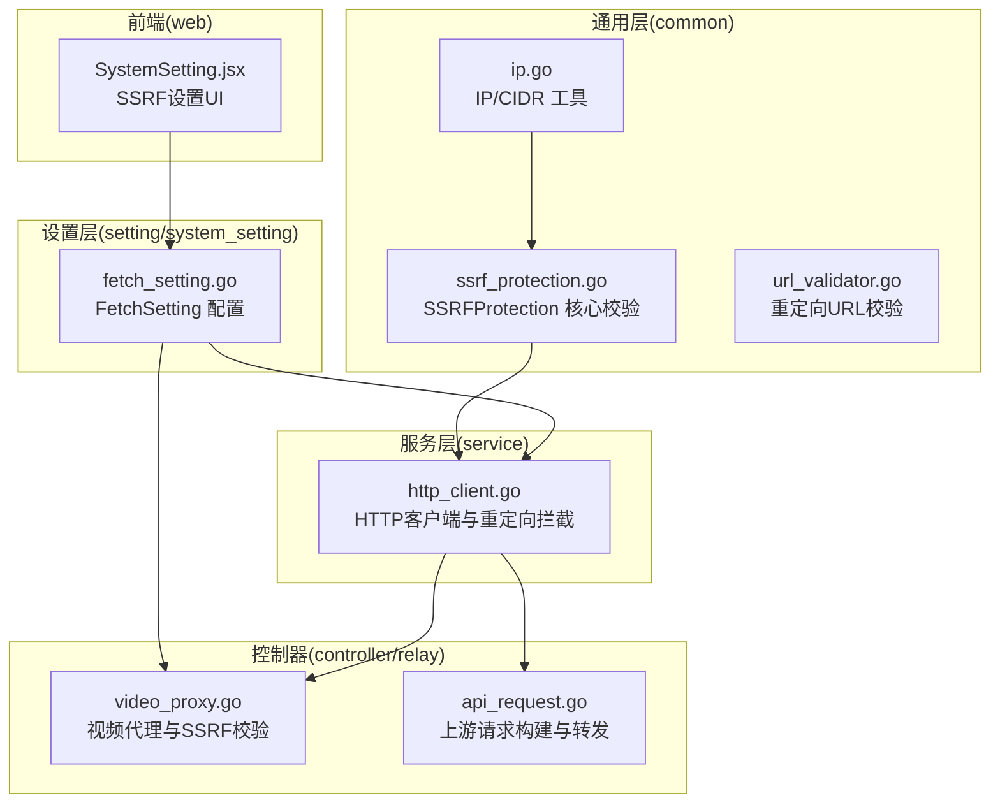
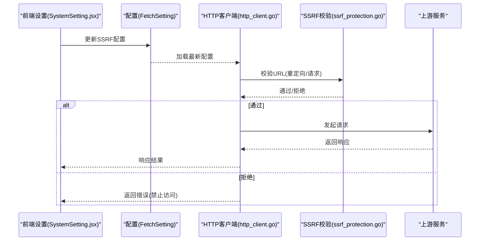
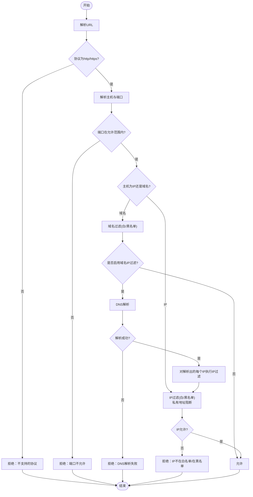
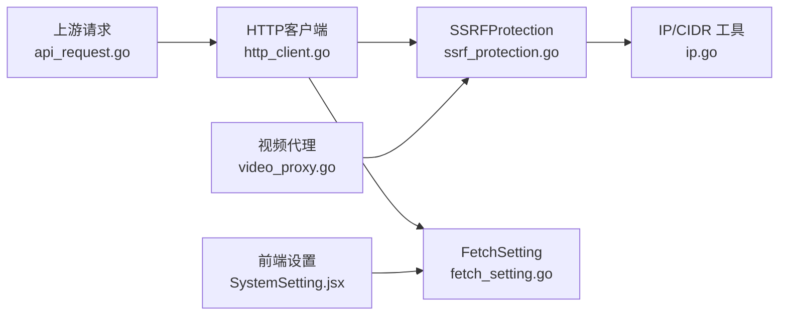

# SSRF 保护

<cite>
**本文引用的文件**
- [ssrf_protection.go](file://common/ssrf_protection.go)
- [ip.go](file://common/ip.go)
- [url_validator.go](file://common/url_validator.go)
- [url_validator_test.go](file://common/url_validator_test.go)
- [http_client.go](file://service/http_client.go)
- [fetch_setting.go](file://setting/system_setting/fetch_setting.go)
- [SystemSetting.jsx](file://web/src/components/settings/SystemSetting.jsx)
- [video_proxy.go](file://controller/video_proxy.go)
- [api_request.go](file://relay/channel/api_request.go)
- [env.go](file://constant/env.go)
</cite>

## 目录
1. [简介](#简介)
2. [项目结构](#项目结构)
3. [核心组件](#核心组件)
4. [架构总览](#架构总览)
5. [组件详解](#组件详解)
6. [依赖关系分析](#依赖关系分析)
7. [性能考量](#性能考量)
8. [故障排查指南](#故障排查指南)
9. [结论](#结论)
10. [附录](#附录)

## 简介
本文件面向 New API 的 SSRF（服务器端请求伪造）防护体系，系统化阐述 URL 验证机制、目标地址白名单与黑名单、网络访问控制策略及其实现细节。文档覆盖以下关键点：
- URL 格式与协议限制
- 域名白名单/黑名单与通配符匹配
- IP 地址范围检查与私有地址阻断
- 端口白名单/黑名单与端口范围解析
- 基于 FetchSetting 的动态配置与运行时校验
- 在代理请求与外部 API 调用中的应用方式
- 防护规则示例、测试用例与安全审计清单
- 常见攻击场景、检测方法与修复建议

## 项目结构
围绕 SSRF 防护的关键代码分布在如下模块：
- common：SSRF 核心逻辑与工具函数（URL 校验、CIDR/IP 判断）
- service：HTTP 客户端初始化与重定向拦截
- setting/system_setting：系统级 FetchSetting 配置
- controller/relay：对外部上游的代理与转发流程
- web：前端系统设置界面，提供 SSRF 防护参数配置入口
- constant：全局常量（含可信重定向域名列表）

**图表来源**
- [ssrf_protection.go](file://common/ssrf_protection.go)
- [ip.go](file://common/ip.go)
- [url_validator.go](file://common/url_validator.go)
- [http_client.go](file://service/http_client.go)
- [fetch_setting.go](file://setting/system_setting/fetch_setting.go)
- [video_proxy.go](file://controller/video_proxy.go)
- [api_request.go](file://relay/channel/api_request.go)
- [SystemSetting.jsx](file://web/src/components/settings/SystemSetting.jsx)

**章节来源**
- [ssrf_protection.go](file://common/ssrf_protection.go)
- [http_client.go](file://service/http_client.go)
- [fetch_setting.go](file://setting/system_setting/fetch_setting.go)
- [SystemSetting.jsx](file://web/src/components/settings/SystemSetting.jsx)

## 核心组件
- SSRFProtection：定义防护策略（域名/IP 过滤模式、白名单/黑名单、允许端口、私有 IP 开关、域名 IP 过滤开关），并提供 URL 校验主流程
- IP/CIDR 工具：判断私有地址、解析 CIDR 与单个 IP
- HTTP 客户端与重定向拦截：在发起 HTTP 请求前执行 SSRF 校验，阻止非法重定向
- FetchSetting：系统级配置项，集中控制 SSRF 防护策略
- 前端设置界面：提供可视化配置入口，便于管理员调整策略
- 视频代理与上游请求：在代理外部资源或转发上游请求时应用 SSRF 校验

**章节来源**
- [ssrf_protection.go](file://common/ssrf_protection.go)
- [ip.go](file://common/ip.go)
- [http_client.go](file://service/http_client.go)
- [fetch_setting.go](file://setting/system_setting/fetch_setting.go)
- [SystemSetting.jsx](file://web/src/components/settings/SystemSetting.jsx)
- [video_proxy.go](file://controller/video_proxy.go)
- [api_request.go](file://relay/channel/api_request.go)

## 架构总览
SSRF 防护贯穿“配置—校验—拦截—执行”的闭环：
- 配置阶段：系统设置页面写入 FetchSetting；默认值在初始化时注册
- 校验阶段：URL 解析、协议限制、端口校验、域名/IP 过滤、私有地址阻断
- 拦截阶段：HTTP 客户端在重定向与请求阶段统一拦截非法目标
- 执行阶段：仅当通过校验后才发起外部请求

**图表来源**
- [SystemSetting.jsx](file://web/src/components/settings/SystemSetting.jsx)
- [fetch_setting.go](file://setting/system_setting/fetch_setting.go)
- [http_client.go](file://service/http_client.go)
- [ssrf_protection.go](file://common/ssrf_protection.go)

## 组件详解

### SSRFProtection 核心校验流程
- URL 解析与协议限制：仅允许 http/https
- 主机与端口解析：若未显式指定端口，按协议推断默认端口
- 端口白名单/黑名单：支持单端口与端口范围
- 域名过滤：白名单/黑名单，支持通配符 *.example.com
- IP 过滤：CIDR/单 IP；可选择是否允许私有地址
- 域名 IP 过滤：可选对域名解析后的 IP 再次进行 IP 过滤
- DNS 解析失败处理：域名解析失败即拒绝

**图表来源**
- [ssrf_protection.go](file://common/ssrf_protection.go)

**章节来源**
- [ssrf_protection.go](file://common/ssrf_protection.go)

### IP 与 CIDR 工具
- 私有地址判定：包含 IPv4 私网段、环回、链路本地、组播、保留地址；以及 IPv6 环回、链路本地、唯一本地等
- CIDR 匹配：支持单 IP 与 CIDR 混合，解析失败时尝试按单 IP 处理

**章节来源**
- [ip.go](file://common/ip.go)

### HTTP 客户端与重定向拦截
- 初始化 HTTP 客户端时注册重定向拦截器
- 拦截器读取当前 FetchSetting，对每次重定向目标执行 SSRF 校验
- 同时限制最大重定向次数，避免循环重定向

**章节来源**
- [http_client.go](file://service/http_client.go)
- [fetch_setting.go](file://setting/system_setting/fetch_setting.go)

### FetchSetting 配置
- 字段含义：
  - enable_ssrf_protection：是否启用 SSRF 防护
  - allow_private_ip：是否允许访问私有 IP
  - domain_filter_mode：域名过滤模式（true 为白名单，false 为黑名单）
  - ip_filter_mode：IP 过滤模式（true 为白名单，false 为黑名单）
  - domain_list：域名白名单/黑名单（支持通配符）
  - ip_list：IP 白名单/黑名单（CIDR/单 IP）
  - allowed_ports：允许的端口（支持单端口与端口范围）
  - apply_ip_filter_for_domain：对域名启用 IP 过滤（实验性）
- 默认值：默认开启防护，允许常用端口集合，域名/IP 过滤均为空白列表模式，域名 IP 过滤默认开启

**章节来源**
- [fetch_setting.go](file://setting/system_setting/fetch_setting.go)
- [SystemSetting.jsx](file://web/src/components/settings/SystemSetting.jsx)

### 前端系统设置界面
- 提供开关与表单控件，支持：
  - 启用/禁用 SSRF 防护
  - 允许私有 IP 访问
  - 域名白名单/黑名单切换与输入
  - IP 白名单/黑名单切换与输入
  - 允许端口列表（单端口与端口范围）
  - 域名 IP 过滤开关
- 更新后写入配置并生效

**章节来源**
- [SystemSetting.jsx](file://web/src/components/settings/SystemSetting.jsx)

### 视频代理与上游请求中的应用
- 视频代理：在构造上游请求前，对目标 URL 应用 SSRF 校验，校验失败则拒绝请求
- 上游请求：在构建与转发请求时，同样基于 FetchSetting 执行校验，确保代理与转发的安全性

**章节来源**
- [video_proxy.go](file://controller/video_proxy.go)
- [api_request.go](file://relay/channel/api_request.go)

### 重定向 URL 校验（Redirect URL）
- 仅允许 http/https
- 域名必须在可信列表中（精确匹配或子域名匹配）
- 该校验用于受控的重定向场景，与 SSRFProtection 的通用校验互补

**章节来源**
- [url_validator.go](file://common/url_validator.go)
- [env.go](file://constant/env.go)

## 依赖关系分析
- SSRFProtection 依赖 IP/CIDR 工具进行私有地址与 CIDR 匹配
- HTTP 客户端依赖 FetchSetting 与 SSRFProtection 实现统一拦截
- 前端设置界面依赖 FetchSetting 进行参数持久化
- 控制器在代理与上游请求中复用 SSRF 校验逻辑

**图表来源**
- [ssrf_protection.go](file://common/ssrf_protection.go)
- [ip.go](file://common/ip.go)
- [http_client.go](file://service/http_client.go)
- [fetch_setting.go](file://setting/system_setting/fetch_setting.go)
- [SystemSetting.jsx](file://web/src/components/settings/SystemSetting.jsx)
- [video_proxy.go](file://controller/video_proxy.go)
- [api_request.go](file://relay/channel/api_request.go)

**章节来源**
- [ssrf_protection.go](file://common/ssrf_protection.go)
- [ip.go](file://common/ip.go)
- [http_client.go](file://service/http_client.go)
- [fetch_setting.go](file://setting/system_setting/fetch_setting.go)
- [SystemSetting.jsx](file://web/src/components/settings/SystemSetting.jsx)
- [video_proxy.go](file://controller/video_proxy.go)
- [api_request.go](file://relay/channel/api_request.go)

## 性能考量
- DNS 解析：域名 IP 过滤会触发 DNS 解析，可能带来额外延迟；建议合理配置域名白名单，减少不必要的解析
- 端口范围解析：端口范围解析为一次性操作，开销较小
- 重定向拦截：每次重定向都会执行校验，建议保持 allowed_ports 与域名/IP 列表精简，降低匹配成本
- 并发与连接池：HTTP 客户端使用连接池与并发优化，SSRF 校验不会引入额外的阻塞

[本节为通用指导，无需特定文件引用]

## 故障排查指南
- 现象：请求被拒绝，提示“不支持的协议”
  - 排查：确认 URL 协议为 http/https
  - 参考：[ssrf_protection.go](file://common/ssrf_protection.go)
- 现象：请求被拒绝，提示“端口不允许”
  - 排查：检查 allowed_ports 配置，确认端口在允许范围内
  - 参考：[fetch_setting.go](file://setting/system_setting/fetch_setting.go)
- 现象：请求被拒绝，提示“域名不在白名单/在黑名单”
  - 排查：核对 domain_list 与 domain_filter_mode；注意通配符匹配规则
  - 参考：[ssrf_protection.go](file://common/ssrf_protection.go)
- 现象：请求被拒绝，提示“DNS解析失败”
  - 排查：检查域名可用性与网络连通性；确认 DNS 服务器可达
  - 参考：[ssrf_protection.go](file://common/ssrf_protection.go)
- 现象：请求被拒绝，提示“私有IP地址不允许”
  - 排查：检查 allow_private_ip 配置；如需访问内网，请谨慎开启
  - 参考：[fetch_setting.go](file://setting/system_setting/fetch_setting.go)
- 现象：重定向被拦截
  - 排查：检查重定向目标 URL 是否满足 SSRF 校验；查看日志中的“redirect to ... blocked”信息
  - 参考：[http_client.go](file://service/http_client.go)

**章节来源**
- [ssrf_protection.go](file://common/ssrf_protection.go)
- [http_client.go](file://service/http_client.go)
- [fetch_setting.go](file://setting/system_setting/fetch_setting.go)

## 结论
New API 的 SSRF 防护体系通过“配置—校验—拦截—执行”的闭环，实现了对 URL 格式、协议、端口、域名与 IP 的多维控制。结合默认严格的白名单策略与可选的域名 IP 过滤，能够在保证功能灵活性的同时有效阻断内网探测与 SSRF 攻击面。建议在生产环境中默认开启防护，并根据业务需要精细化配置域名/IP 与端口列表。

[本节为总结，无需特定文件引用]

## 附录

### 常见攻击场景与防护策略
- 内网探测：通过 SSRF 访问内网服务（如 metadata 服务、本地服务）。防护：默认关闭私有 IP 访问；启用域名 IP 过滤；严格白名单
- 任意端口访问：利用非标准端口进行内网穿透。防护：限定 allowed_ports；对端口范围进行最小化配置
- 域名绕过：通过恶意域名或子域访问内网。防护：使用通配符白名单；启用 apply_ip_filter_for_domain
- 重定向攻击：通过中间人重定向至内网。防护：启用 HTTP 客户端重定向拦截；限制最大重定向次数

[本节为概念性内容，无需特定文件引用]

### 防护规则示例
- 域名白名单：example.com、*.api.example.com
- IP 白名单：192.168.1.0/24、10.0.0.0/8、8.8.8.8
- 允许端口：80、443、8443
- 私有 IP：关闭
- 域名 IP 过滤：开启

[本节为示例性内容，无需特定文件引用]

### 测试用例与验证清单
- URL 格式与协议：无效 URL、非 http/https 协议
- 域名过滤：白名单命中、黑名单命中、通配符匹配、大小写不敏感
- IP 过滤：CIDR 命中、单 IP 命中、私有地址阻断
- 端口过滤：单端口命中、端口范围命中、越界端口
- DNS 解析：正常解析、解析失败
- 重定向：合法重定向、非法重定向（被拦截）

参考测试文件路径：
- [url_validator_test.go](file://common/url_validator_test.go)

**章节来源**
- [url_validator_test.go](file://common/url_validator_test.go)

### 安全扫描与审计要点
- 配置审计：确认 enable_ssrf_protection、allow_private_ip、domain_filter_mode、ip_filter_mode、allowed_ports、apply_ip_filter_for_domain 的合理性
- 日志审计：关注“redirect to ... blocked”与“request blocked”类日志
- 端到端验证：对代理与上游请求路径分别进行 SSRF 校验测试
- 依赖与第三方：确保代理客户端与上游适配器均遵循统一的 SSRF 校验策略

[本节为通用指导，无需特定文件引用]