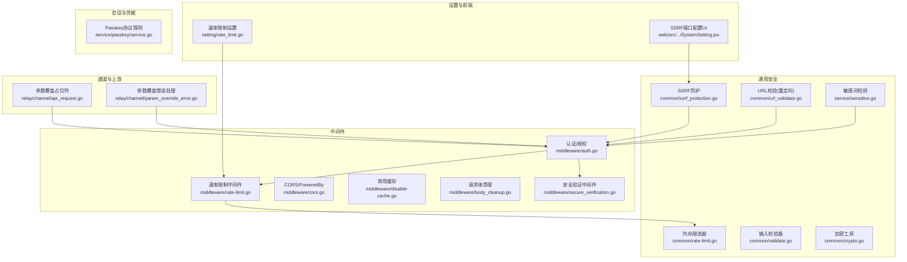
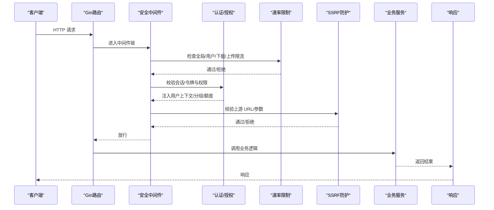
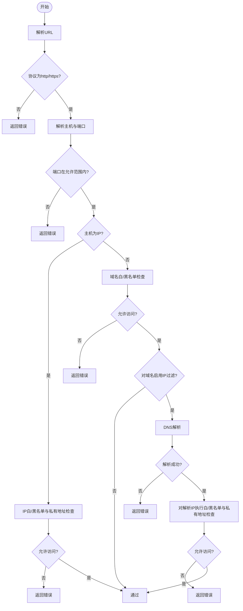
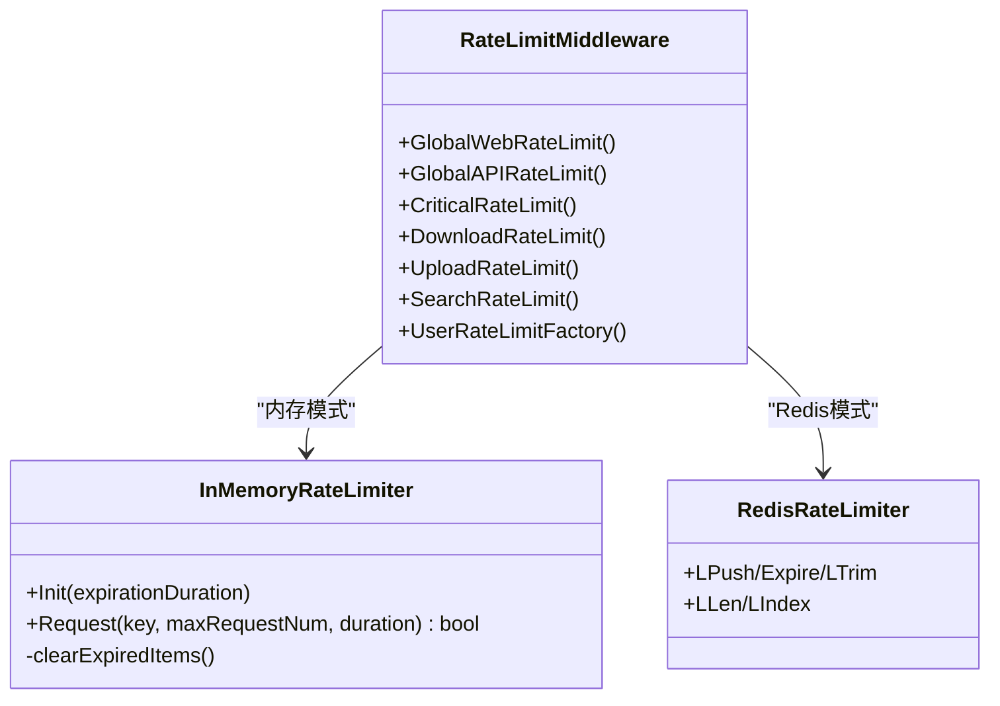
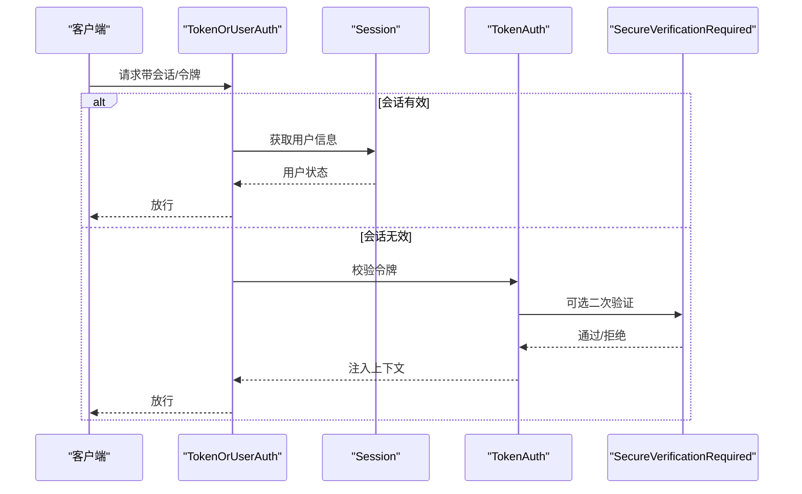
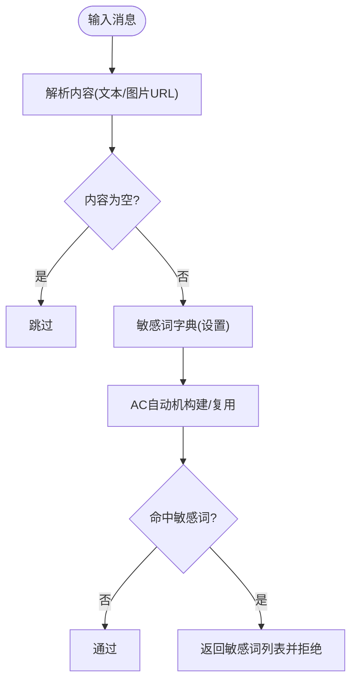
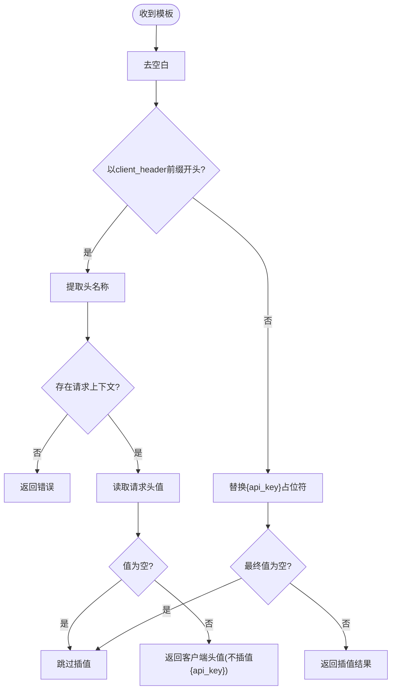
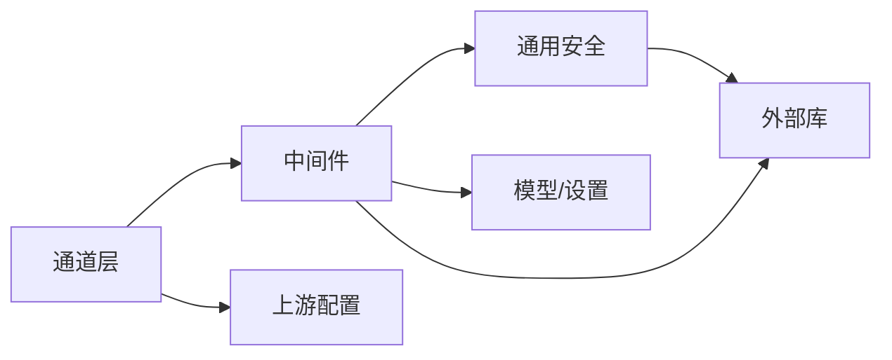

# 安全与防护

<cite>
**本文引用的文件**
- [ssrf_protection.go](file://common/ssrf_protection.go)
- [rate-limit.go](file://common/rate-limit.go)
- [validate.go](file://common/validate.go)
- [rate-limit.go](file://middleware/rate-limit.go)
- [auth.go](file://middleware/auth.go)
- [secure_verification.go](file://middleware/secure_verification.go)
- [cors.go](file://middleware/cors.go)
- [disable-cache.go](file://middleware/disable-cache.go)
- [body_cleanup.go](file://middleware/body_cleanup.go)
- [crypto.go](file://common/crypto.go)
- [url_validator.go](file://common/url_validator.go)
- [sensitive.go](file://service/sensitive.go)
- [sensitive.go](file://dto/sensitive.go)
- [rate_limit.go](file://setting/rate_limit.go)
- [SystemSetting.jsx](file://web/src/components/settings/SystemSetting.jsx)
- [param_override_error.go](file://relay/channel/param_override_error.go)
- [api_request.go](file://relay/channel/api_request.go)
- [service.go](file://service/passkey/service.go)
</cite>

## 目录
1. [简介](#简介)
2. [项目结构](#项目结构)
3. [核心组件](#核心组件)
4. [架构总览](#架构总览)
5. [详细组件分析](#详细组件分析)
6. [依赖分析](#依赖分析)
7. [性能考虑](#性能考虑)
8. [故障排查指南](#故障排查指南)
9. [结论](#结论)
10. [附录](#附录)

## 简介
本技术文档聚焦 New API 的安全与防护体系，围绕 CSRF 防护、SSRF 保护、速率限制、输入验证、数据验证与输出过滤、安全编码实践、身份认证与会话管理、敏感数据保护、安全配置与监控告警等方面展开。文档以代码级分析为基础，结合可视化图示帮助开发者快速理解并落地实施全面的安全防护措施。

## 项目结构
安全相关能力主要分布在以下模块：
- 通用安全工具：SSRF 防护、速率限制、输入校验、加密、URL 校验、敏感词检测
- 中间件层：认证授权、速率限制、CORS、缓存禁用、请求体清理、安全验证
- 设置与前端：速率限制配置、SSRF 端口配置、系统设置界面
- 通道适配与上游调用：参数覆盖占位符与头部注入风险控制
- 会话与凭据：Passkey 方案中的协议探测与安全传输

图表来源
- [ssrf_protection.go:11-311](file://common/ssrf_protection.go#L11-L311)
- [rate-limit.go:8-70](file://common/rate-limit.go#L8-L70)
- [validate.go:5-9](file://common/validate.go#L5-L9)
- [rate-limit.go:15-205](file://middleware/rate-limit.go#L15-L205)
- [auth.go:36-406](file://middleware/auth.go#L36-L406)
- [secure_verification.go:21-79](file://middleware/secure_verification.go#L21-L79)
- [cors.go:9-23](file://middleware/cors.go#L9-L23)
- [disable-cache.go:5-11](file://middleware/disable-cache.go#L5-L11)
- [body_cleanup.go:11-22](file://middleware/body_cleanup.go#L11-L22)
- [url_validator.go:19-39](file://common/url_validator.go#L19-L39)
- [sensitive.go:11-77](file://service/sensitive.go#L11-L77)
- [rate_limit.go:12-69](file://setting/rate_limit.go#L12-L69)
- [SystemSetting.jsx:947-984](file://web/src/components/settings/SystemSetting.jsx#L947-L984)
- [api_request.go:130-161](file://relay/channel/api_request.go#L130-L161)
- [param_override_error.go:1-200](file://relay/channel/param_override_error.go#L1-L200)
- [service.go:159-177](file://service/passkey/service.go#L159-L177)

章节来源
- [ssrf_protection.go:11-311](file://common/ssrf_protection.go#L11-L311)
- [rate-limit.go:8-70](file://common/rate-limit.go#L8-L70)
- [validate.go:5-9](file://common/validate.go#L5-L9)
- [rate-limit.go:15-205](file://middleware/rate-limit.go#L15-L205)
- [auth.go:36-406](file://middleware/auth.go#L36-L406)
- [secure_verification.go:21-79](file://middleware/secure_verification.go#L21-L79)
- [cors.go:9-23](file://middleware/cors.go#L9-L23)
- [disable-cache.go:5-11](file://middleware/disable-cache.go#L5-L11)
- [body_cleanup.go:11-22](file://middleware/body_cleanup.go#L11-L22)
- [url_validator.go:19-39](file://common/url_validator.go#L19-L39)
- [sensitive.go:11-77](file://service/sensitive.go#L11-L77)
- [rate_limit.go:12-69](file://setting/rate_limit.go#L12-L69)
- [SystemSetting.jsx:947-984](file://web/src/components/settings/SystemSetting.jsx#L947-L984)
- [api_request.go:130-161](file://relay/channel/api_request.go#L130-L161)
- [param_override_error.go:1-200](file://relay/channel/param_override_error.go#L1-L200)
- [service.go:159-177](file://service/passkey/service.go#L159-L177)

## 核心组件
- SSRF 防护：基于域名/IP 白/黑名单、端口范围、私有地址策略的 URL 安全校验。
- 速率限制：支持 Redis/内存双模式，按 IP 或用户维度限流，内置多类限流策略。
- 认证与会话：支持 Session 与 Access Token 双轨认证；Token 维度支持 IP 限制、分组切换与额度上下文注入。
- 输入验证与输出过滤：基于结构化校验器与敏感词检测，结合响应内容过滤。
- 安全中间件：CORS、缓存禁用、请求体清理、安全验证（5 分钟有效期）。
- 参数覆盖与头部注入：通道层对占位符与客户端自定义头进行严格校验与插值。
- 凭据与协议：Passkey 场景下根据代理头与 TLS 状态推断安全协议。

章节来源
- [ssrf_protection.go:11-311](file://common/ssrf_protection.go#L11-L311)
- [rate-limit.go:15-205](file://middleware/rate-limit.go#L15-L205)
- [auth.go:36-406](file://middleware/auth.go#L36-L406)
- [secure_verification.go:21-79](file://middleware/secure_verification.go#L21-L79)
- [url_validator.go:19-39](file://common/url_validator.go#L19-L39)
- [sensitive.go:11-77](file://service/sensitive.go#L11-L77)
- [api_request.go:130-161](file://relay/channel/api_request.go#L130-L161)
- [service.go:159-177](file://service/passkey/service.go#L159-L177)

## 架构总览
New API 的安全架构以“中间件前置、通道可控、设置可配置”为核心，形成“入口拦截—身份校验—资源保护—输出过滤”的闭环。

图表来源
- [rate-limit.go:76-117](file://middleware/rate-limit.go#L76-L117)
- [auth.go:36-156](file://middleware/auth.go#L36-L156)
- [ssrf_protection.go:207-285](file://common/ssrf_protection.go#L207-L285)

## 详细组件分析

### SSRF 防护组件分析
- 设计要点
  - 支持域名白/黑名单、IP 白/黑名单、端口范围、私有地址策略。
  - 对域名解析后可二次应用 IP 过滤，增强安全性。
  - 提供运行时配置解析与统一校验入口。
- 关键流程
  - URL 解析 → 协议校验 → 端口解析与限制 → 主机类型判定 → 域名/IP 过滤 → DNS 解析与二次 IP 校验。
- 配置项（来源于前端设置页）
  - 允许的端口：支持单端口与端口范围，如 80、443、8000-8999。
- 安全建议
  - 默认采用白名单模式，谨慎开启私有地址放行。
  - 对域名启用 IP 过滤，避免别名绕过。

图表来源
- [ssrf_protection.go:207-285](file://common/ssrf_protection.go#L207-L285)
- [SystemSetting.jsx:947-984](file://web/src/components/settings/SystemSetting.jsx#L947-L984)

章节来源
- [ssrf_protection.go:11-311](file://common/ssrf_protection.go#L11-L311)
- [SystemSetting.jsx:947-984](file://web/src/components/settings/SystemSetting.jsx#L947-L984)

### 速率限制组件分析
- 实现模式
  - 内存限流器：基于环形队列与过期清理，适合单实例。
  - Redis 限流器：基于列表与过期时间，适合分布式。
  - 用户级限流：基于用户 ID，抵御代理轮换攻击。
- 限流策略
  - 全局 Web/API、关键操作、下载、上传、搜索等多维度限流。
  - 支持动态开关与阈值配置。
- 性能与一致性
  - Redis 模式下注意时间解析与负时差处理，保证窗口计算正确性。
  - 内存模式下定期清理过期键，避免内存膨胀。

图表来源
- [rate-limit.go:8-70](file://common/rate-limit.go#L8-L70)
- [rate-limit.go:15-205](file://middleware/rate-limit.go#L15-L205)

章节来源
- [rate-limit.go:8-70](file://common/rate-limit.go#L8-L70)
- [rate-limit.go:15-205](file://middleware/rate-limit.go#L15-L205)
- [rate_limit.go:12-69](file://setting/rate_limit.go#L12-L69)

### 认证与会话组件分析
- 认证路径
  - 优先 Session（仪表板用户），失败则回落到 Token（API 客户端）。
  - Token 认证支持 WebSocket、Anthropic/Gemini 等特殊头部与查询参数取值。
  - Token 维度支持 IP 限制、分组切换、额度上下文注入。
- 会话与安全验证
  - 安全验证中间件要求 5 分钟内完成二次确认，超时需重新验证。
  - 提供可选安全验证中间件，用于区分是否已验证场景。
- 会话管理
  - 登出或强制重新验证时清除安全验证状态。
- 凭据与协议
  - Passkey 场景下根据 X-Forwarded-Proto、TLS、URL Scheme 推断安全协议，避免降级。

图表来源
- [auth.go:194-208](file://middleware/auth.go#L194-L208)
- [auth.go:276-406](file://middleware/auth.go#L276-L406)
- [secure_verification.go:21-79](file://middleware/secure_verification.go#L21-L79)
- [service.go:159-177](file://service/passkey/service.go#L159-L177)

章节来源
- [auth.go:36-406](file://middleware/auth.go#L36-L406)
- [secure_verification.go:21-79](file://middleware/secure_verification.go#L21-L79)
- [service.go:159-177](file://service/passkey/service.go#L159-L177)

### 输入验证与输出过滤
- 输入验证
  - 使用结构化校验器进行 DTO 层验证，初始化于通用包。
- 输出过滤
  - 敏感词检测：遍历消息内容，支持文本与图片 URL（待完善）。
  - 敏感词替换：构建 AC 自动机，命中即替换并返回敏感词列表。
- 配置与规则
  - 敏感词集合由设置模块维护，支持批量校验与替换。

图表来源
- [validate.go:5-9](file://common/validate.go#L5-L9)
- [sensitive.go:11-77](file://service/sensitive.go#L11-L77)
- [sensitive.go:3-6](file://dto/sensitive.go#L3-L6)

章节来源
- [validate.go:5-9](file://common/validate.go#L5-L9)
- [sensitive.go:11-77](file://service/sensitive.go#L11-L77)
- [sensitive.go:3-6](file://dto/sensitive.go#L3-L6)

### 参数覆盖与头部注入风险控制
- 占位符插值
  - 支持客户端自定义头占位符，仅当请求头存在且非空时才插值，避免污染上游 API Key。
- 错误处理
  - 对非法占位符格式与缺失上下文进行明确报错，防止注入风险。

图表来源
- [api_request.go:130-161](file://relay/channel/api_request.go#L130-L161)
- [param_override_error.go:1-200](file://relay/channel/param_override_error.go#L1-L200)

章节来源
- [api_request.go:130-161](file://relay/channel/api_request.go#L130-L161)
- [param_override_error.go:1-200](file://relay/channel/param_override_error.go#L1-L200)

### 安全中间件与配置
- CORS 与安全头
  - CORS 允许所有来源与凭证，同时设置标准方法与头。
  - 通过响应头暴露版本信息，便于追踪。
- 缓存禁用
  - 强制禁用缓存，降低敏感信息缓存风险。
- 请求体清理
  - 请求结束后清理临时存储与下载文件缓存，避免残留敏感数据。
- 安全验证
  - 5 分钟有效期，过期自动失效并清理会话。

章节来源
- [cors.go:9-23](file://middleware/cors.go#L9-L23)
- [disable-cache.go:5-11](file://middleware/disable-cache.go#L5-L11)
- [body_cleanup.go:11-22](file://middleware/body_cleanup.go#L11-L22)
- [secure_verification.go:21-79](file://middleware/secure_verification.go#L21-L79)

## 依赖分析
- 组件耦合
  - 中间件层依赖通用安全工具（SSRF、速率限制、加密、URL 校验）。
  - 认证中间件依赖模型层（令牌与用户缓存）、设置层（分组与额度）。
  - 通道层依赖中间件与上游配置，严格控制参数与头部。
- 外部依赖
  - Redis 用于分布式限流与会话存储。
  - Gin 生态中间件（sessions、cors、recover 等）。
- 循环依赖
  - 当前结构清晰，未见循环导入迹象。

图表来源
- [rate-limit.go:15-205](file://middleware/rate-limit.go#L15-L205)
- [auth.go:36-406](file://middleware/auth.go#L36-L406)
- [ssrf_protection.go:11-311](file://common/ssrf_protection.go#L11-L311)

章节来源
- [rate-limit.go:15-205](file://middleware/rate-limit.go#L15-L205)
- [auth.go:36-406](file://middleware/auth.go#L36-L406)
- [ssrf_protection.go:11-311](file://common/ssrf_protection.go#L11-L311)

## 性能考虑
- 速率限制
  - Redis 模式具备水平扩展能力，内存模式适合低并发场景。
  - 注意时间解析与负时差问题，避免误判。
- SSRF
  - DNS 解析可能带来额外延迟，建议结合缓存与白名单策略。
- 敏感词检测
  - AC 自动机一次性构建，后续命中高效；大词表时注意内存占用。
- 中间件顺序
  - 将高频短路逻辑（限流、CORS）置于前，减少后续处理开销。

## 故障排查指南
- 速率限制频繁触发
  - 检查 Redis 连接与键过期时间；核对用户级限流是否生效。
  - 参考路径：[速率限制中间件:15-205](file://middleware/rate-limit.go#L15-L205)，[内存限流器:8-70](file://common/rate-limit.go#L8-L70)
- 认证失败或权限不足
  - 核对 Authorization 头格式与令牌有效性；检查用户状态与分组切换。
  - 参考路径：[认证中间件:36-406](file://middleware/auth.go#L36-L406)
- SSRF 校验失败
  - 检查域名/IP 列表与端口配置；确认是否启用对域名的 IP 过滤。
  - 参考路径：[SSRF 防护:207-285](file://common/ssrf_protection.go#L207-L285)，[系统设置:947-984](file://web/src/components/settings/SystemSetting.jsx#L947-L984)
- 敏感词误判
  - 调整敏感词字典或放宽规则；关注替换策略对文本长度的影响。
  - 参考路径：[敏感词检测:11-77](file://service/sensitive.go#L11-L77)
- 参数覆盖报错
  - 检查占位符格式与请求上下文是否存在；避免空值插值。
  - 参考路径：[参数覆盖:130-161](file://relay/channel/api_request.go#L130-L161)，[错误处理:1-200](file://relay/channel/param_override_error.go#L1-L200)

章节来源
- [rate-limit.go:15-205](file://middleware/rate-limit.go#L15-L205)
- [rate-limit.go:8-70](file://common/rate-limit.go#L8-L70)
- [auth.go:36-406](file://middleware/auth.go#L36-L406)
- [ssrf_protection.go:207-285](file://common/ssrf_protection.go#L207-L285)
- [SystemSetting.jsx:947-984](file://web/src/components/settings/SystemSetting.jsx#L947-L984)
- [sensitive.go:11-77](file://service/sensitive.go#L11-L77)
- [api_request.go:130-161](file://relay/channel/api_request.go#L130-L161)
- [param_override_error.go:1-200](file://relay/channel/param_override_error.go#L1-L200)

## 结论
New API 的安全体系通过“中间件前置、通道可控、设置可配置”的方式，实现了从入口到出口的全链路防护。SSRF、速率限制、认证授权、敏感词过滤与参数覆盖风险控制共同构成稳固防线。建议在生产环境中启用 Redis 限流、严格白名单策略、定期审计敏感词与速率限制配置，并结合监控告警持续优化。

## 附录
- 安全配置清单
  - SSRF：启用域名/IP 白名单、限制端口范围、谨慎放行私有地址。
  - 速率限制：按场景启用全局/用户/下载/上传限流，合理设置阈值与窗口。
  - 认证：强制使用 HTTPS 与安全协议探测；启用安全验证中间件。
  - 敏感词：维护动态词表，结合替换策略与日志审计。
  - 参数覆盖：严格校验占位符与客户端自定义头，避免注入。
- 监控告警建议
  - 限流触发率、认证失败率、SSRF 拦截数、敏感词命中数、上游 DNS 失败率。
  - 会话安全验证过期与清除事件。