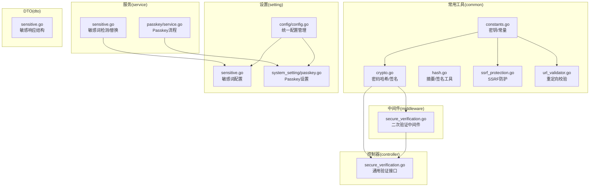
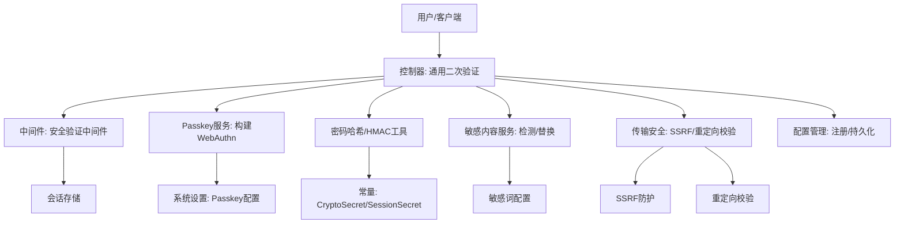
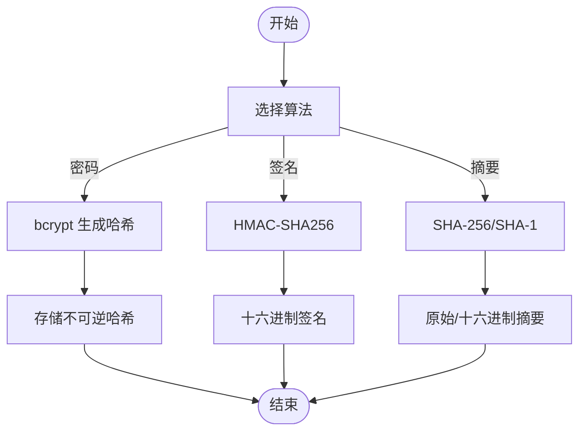
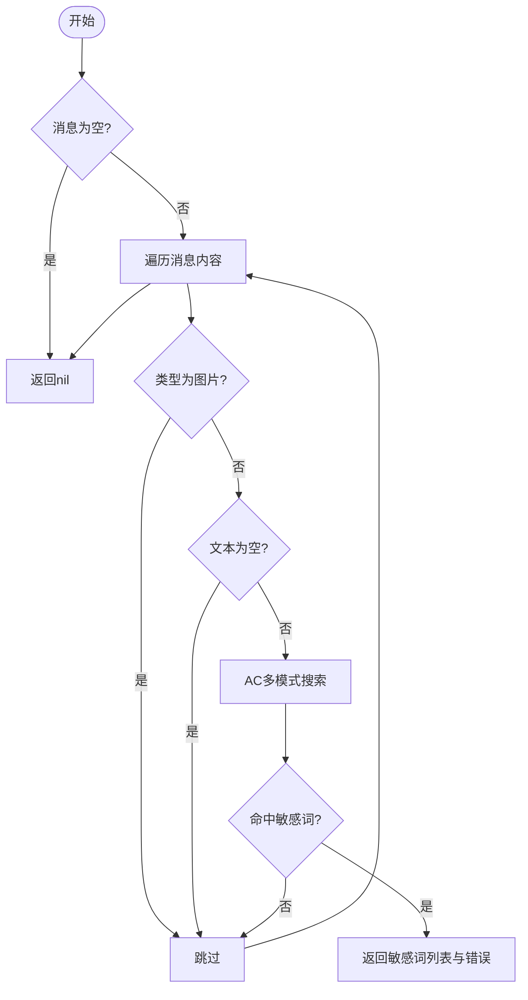
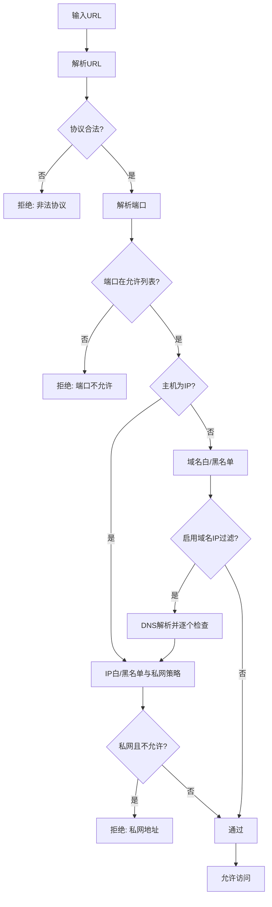
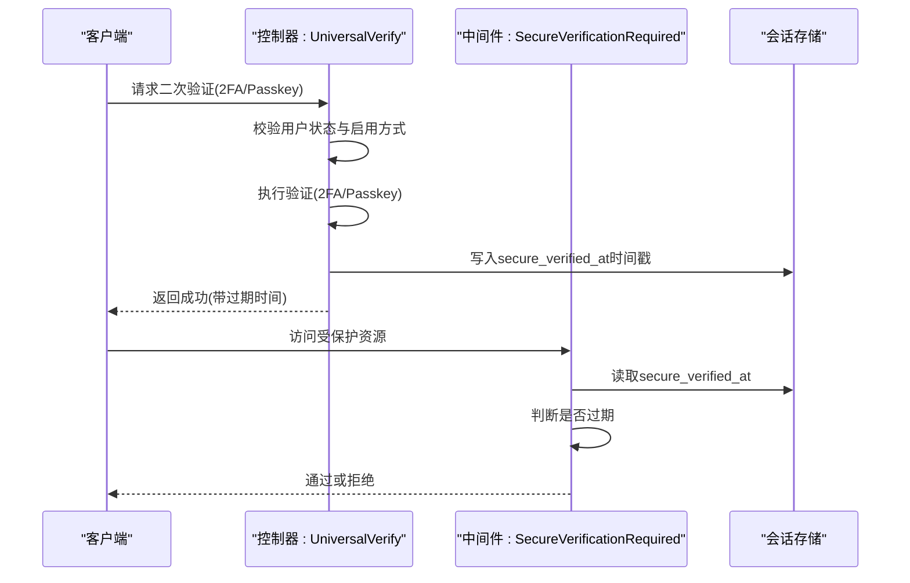
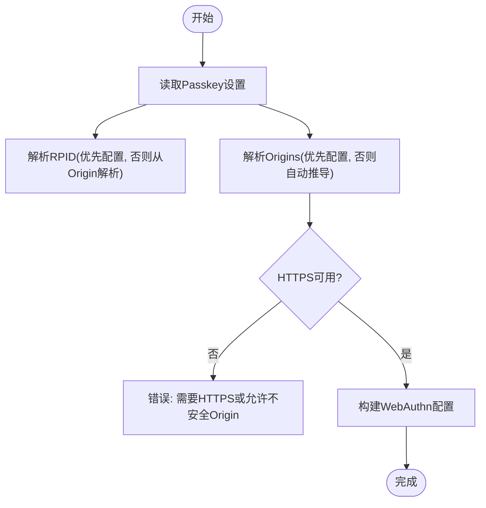
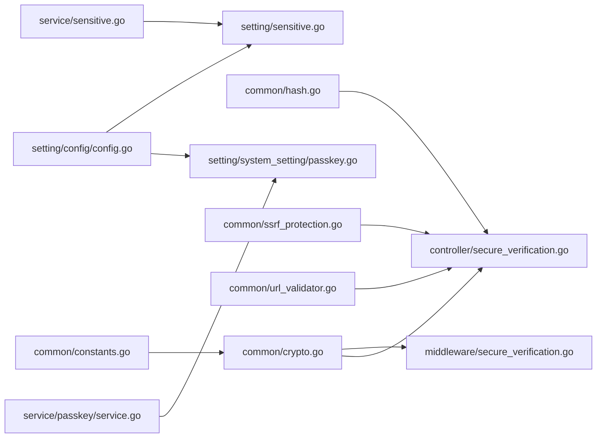

# 数据安全

<cite>
**本文引用的文件**
- [common/crypto.go](file://common/crypto.go)
- [common/hash.go](file://common/hash.go)
- [common/constants.go](file://common/constants.go)
- [common/ssrf_protection.go](file://common/ssrf_protection.go)
- [common/url_validator.go](file://common/url_validator.go)
- [service/sensitive.go](file://service/sensitive.go)
- [setting/sensitive.go](file://setting/sensitive.go)
- [dto/sensitive.go](file://dto/sensitive.go)
- [middleware/secure_verification.go](file://middleware/secure_verification.go)
- [controller/secure_verification.go](file://controller/secure_verification.go)
- [service/passkey/service.go](file://service/passkey/service.go)
- [setting/system_setting/passkey.go](file://setting/system_setting/passkey.go)
- [setting/config/config.go](file://setting/config/config.go)
</cite>

## 目录
1. [简介](#简介)
2. [项目结构](#项目结构)
3. [核心组件](#核心组件)
4. [架构总览](#架构总览)
5. [详细组件分析](#详细组件分析)
6. [依赖分析](#依赖分析)
7. [性能考量](#性能考量)
8. [故障排查指南](#故障排查指南)
9. [结论](#结论)
10. [附录](#附录)

## 简介
本技术文档聚焦 New API 的数据安全体系，围绕“数据加密、哈希算法与敏感信息保护”展开，系统性说明密码加密、数据签名与完整性校验的算法选择与配置方法；覆盖敏感数据的存储策略、传输加密与访问控制；提供数据安全配置指南、加密参数选择与密钥管理最佳实践，并结合用户数据处理、API 密钥管理与会话数据存储给出具体安全实践。

## 项目结构
本项目采用分层与功能域划分相结合的组织方式，数据安全相关能力主要分布在以下模块：
- 常用工具层(common)：提供密码哈希、HMAC、SHA 系列摘要、常量与安全策略工具
- 服务层(service)：敏感内容检测与替换、Passkey 认证流程
- 设置层(setting)：敏感词配置、Passkey 设置、统一配置管理
- 中间件(middleware)：安全验证中间件，基于会话的二次验证控制
- 控制器(controller)：通用安全验证接口，完成二次验证落盘与状态维护
- DTO(dto)：敏感响应结构体定义



图表来源
- [common/crypto.go:1-33](file://common/crypto.go#L1-L33)
- [common/hash.go:1-35](file://common/hash.go#L1-L35)
- [common/constants.go:35-36](file://common/constants.go#L35-L36)
- [common/ssrf_protection.go:11-31](#L11-L31)
- [common/url_validator.go:11-39](file://common/url_validator.go#L11-L39)
- [service/sensitive.go:11-77](file://service/sensitive.go#L11-L77)
- [setting/sensitive.go:16-43](file://setting/sensitive.go#L16-L43)
- [service/passkey/service.go:25-80](file://service/passkey/service.go#L25-L80)
- [setting/system_setting/passkey.go:11-50](file://setting/system_setting/passkey.go#L11-L50)
- [setting/config/config.go:13-90](file://setting/config/config.go#L13-L90)
- [middleware/secure_verification.go:18-80](file://middleware/secure_verification.go#L18-L80)
- [controller/secure_verification.go:35-140](file://controller/secure_verification.go#L35-L140)
- [dto/sensitive.go:3-6](file://dto/sensitive.go#L3-L6)

章节来源
- [common/crypto.go:1-33](file://common/crypto.go#L1-L33)
- [common/hash.go:1-35](file://common/hash.go#L1-L35)
- [common/constants.go:35-36](file://common/constants.go#L35-L36)
- [common/ssrf_protection.go:11-31](file://common/ssrf_protection.go#L11-L31)
- [common/url_validator.go:11-39](file://common/url_validator.go#L11-L39)
- [service/sensitive.go:11-77](file://service/sensitive.go#L11-L77)
- [setting/sensitive.go:16-43](file://setting/sensitive.go#L16-L43)
- [service/passkey/service.go:25-80](file://service/passkey/service.go#L25-L80)
- [setting/system_setting/passkey.go:11-50](file://setting/system_setting/passkey.go#L11-L50)
- [setting/config/config.go:13-90](file://setting/config/config.go#L13-L90)
- [middleware/secure_verification.go:18-80](file://middleware/secure_verification.go#L18-L80)
- [controller/secure_verification.go:35-140](file://controller/secure_verification.go#L35-L140)
- [dto/sensitive.go:3-6](file://dto/sensitive.go#L3-L6)

## 核心组件
- 密码与消息摘要
  - 密码哈希：使用 bcrypt，提供生成与校验接口，确保不可逆存储与高效校验
  - HMAC 签名：基于 SHA-256 的 HMAC，支持固定密钥与动态密钥两种生成方式
  - 摘要工具：提供 SHA-256、SHA-1 与 HMAC-SHA256 原始字节与十六进制输出
- 敏感信息保护
  - 敏感词检测与替换：基于 AC 自动机的多模式搜索，支持敏感词列表配置与替换策略
  - 敏感响应结构：统一返回敏感词列表与替换后的内容
- 传输与访问控制
  - SSRF 防护：支持域名/IP 白/黑名单、端口范围、私网地址策略与可选 DNS 解析校验
  - 重定向安全：限定可信域名白名单，避免开放重定向风险
- 会话与二次验证
  - 通用二次验证：支持 2FA 与 Passkey 两种方式，验证成功后在会话中写入时间戳，有效期 5 分钟
  - Passkey 设置：自动推导 RP ID 与 Origin，严格校验 HTTPS 与安全 Origin
- 配置管理
  - 统一配置注册与持久化：按模块导出/导入配置，支持复杂类型 JSON 序列化

章节来源
- [common/crypto.go:11-32](file://common/crypto.go#L11-L32)
- [common/hash.go:10-34](file://common/hash.go#L10-L34)
- [service/sensitive.go:11-77](file://service/sensitive.go#L11-L77)
- [dto/sensitive.go:3-6](file://dto/sensitive.go#L3-L6)
- [common/ssrf_protection.go:11-311](file://common/ssrf_protection.go#L11-L311)
- [common/url_validator.go:11-39](file://common/url_validator.go#L11-L39)
- [middleware/secure_verification.go:18-80](file://middleware/secure_verification.go#L18-L80)
- [controller/secure_verification.go:35-140](file://controller/secure_verification.go#L35-L140)
- [service/passkey/service.go:25-80](file://service/passkey/service.go#L25-L80)
- [setting/system_setting/passkey.go:11-50](file://setting/system_setting/passkey.go#L11-L50)
- [setting/config/config.go:13-90](file://setting/config/config.go#L13-L90)

## 架构总览
下图展示了数据安全关键路径：认证与会话、敏感内容处理、传输与访问控制、配置与密钥管理。



图表来源
- [controller/secure_verification.go:35-140](file://controller/secure_verification.go#L35-L140)
- [middleware/secure_verification.go:18-80](file://middleware/secure_verification.go#L18-L80)
- [service/passkey/service.go:25-80](file://service/passkey/service.go#L25-L80)
- [setting/system_setting/passkey.go:11-50](file://setting/system_setting/passkey.go#L11-L50)
- [common/crypto.go:11-32](file://common/crypto.go#L11-L32)
- [common/constants.go:35-36](file://common/constants.go#L35-L36)
- [service/sensitive.go:11-77](file://service/sensitive.go#L11-L77)
- [setting/sensitive.go:16-43](file://setting/sensitive.go#L16-L43)
- [common/ssrf_protection.go:207-286](file://common/ssrf_protection.go#L207-L286)
- [common/url_validator.go:19-39](file://common/url_validator.go#L19-L39)
- [setting/config/config.go:27-90](file://setting/config/config.go#L27-L90)

## 详细组件分析

### 密码与消息摘要
- 密码加密
  - 使用 bcrypt 生成不可逆哈希，成本参数采用默认值，兼顾安全性与性能
  - 提供校验函数，输入明文与存储哈希进行比较
- HMAC 签名
  - 固定密钥 HMAC：使用全局 CryptoSecret 生成签名
  - 动态密钥 HMAC：传入自定义密钥生成签名
  - 输出统一为十六进制字符串，便于存储与传输
- 摘要工具
  - 提供 SHA-256、SHA-1 原始字节与十六进制输出
  - 提供 HMAC-SHA256 原始字节与十六进制输出



图表来源
- [common/crypto.go:23-32](file://common/crypto.go#L23-L32)
- [common/crypto.go:11-21](file://common/crypto.go#L11-L21)
- [common/hash.go:10-34](file://common/hash.go#L10-L34)

章节来源
- [common/crypto.go:11-32](file://common/crypto.go#L11-L32)
- [common/hash.go:10-34](file://common/hash.go#L10-L34)

### 敏感内容检测与替换
- 检测流程
  - 遍历消息内容，跳过空文本与图片链接等类型
  - 使用 AC 自动机在预处理的小写文本中进行多模式匹配
  - 返回命中敏感词列表与错误
- 替换流程
  - 命中时构造替换后的文本，使用占位符替换敏感词
  - 返回是否命中、敏感词列表与替换后文本



图表来源
- [service/sensitive.go:11-33](file://service/sensitive.go#L11-L33)
- [service/sensitive.go:39-49](file://service/sensitive.go#L39-L49)
- [service/sensitive.go:51-77](file://service/sensitive.go#L51-L77)

章节来源
- [service/sensitive.go:11-77](file://service/sensitive.go#L11-L77)
- [setting/sensitive.go:16-43](file://setting/sensitive.go#L16-L43)
- [dto/sensitive.go:3-6](file://dto/sensitive.go#L3-L6)

### 传输与访问控制
- SSRF 防护
  - 支持域名/IP 白/黑名单、端口范围、私网地址策略
  - 可选对域名解析后的 IP 再次过滤
  - 仅允许 http/https 协议，校验端口合法性
- 重定向安全
  - 限定可信域名白名单，支持精确与子域匹配
  - 仅允许 http/https 方案



图表来源
- [common/ssrf_protection.go:207-286](file://common/ssrf_protection.go#L207-L286)
- [common/ssrf_protection.go:132-144](file://common/ssrf_protection.go#L132-L144)
- [common/ssrf_protection.go:173-180](file://common/ssrf_protection.go#L173-L180)
- [common/ssrf_protection.go:192-205](file://common/ssrf_protection.go#L192-L205)
- [common/url_validator.go:19-39](file://common/url_validator.go#L19-L39)

章节来源
- [common/ssrf_protection.go:11-311](file://common/ssrf_protection.go#L11-L311)
- [common/url_validator.go:11-39](file://common/url_validator.go#L11-L39)

### 会话与二次验证
- 通用二次验证接口
  - 支持 2FA 与 Passkey 两种方式
  - 验证成功后在会话中记录时间戳，有效期 5 分钟
  - 通过后记录系统日志
- 安全验证中间件
  - 强制二次验证：若未验证或过期则拒绝
  - 可选二次验证：在上下文中设置标记，不影响请求继续
  - 提供清理函数，用于登出或强制重新验证



图表来源
- [controller/secure_verification.go:35-140](file://controller/secure_verification.go#L35-L140)
- [middleware/secure_verification.go:18-80](file://middleware/secure_verification.go#L18-L80)

章节来源
- [controller/secure_verification.go:35-140](file://controller/secure_verification.go#L35-L140)
- [middleware/secure_verification.go:18-80](file://middleware/secure_verification.go#L18-L80)

### Passkey 认证与配置
- WebAuthn 构建
  - 自动推导 RP ID 与 Origin，严格校验 HTTPS 与安全 Origin
  - 用户验证偏好与设备附件偏好可配置
- 设置与回退
  - 若未显式配置，从 ServerAddress 推导 RPID 与 Origins
  - 支持允许不安全 Origin 的场景（需谨慎）



图表来源
- [service/passkey/service.go:25-80](file://service/passkey/service.go#L25-L80)
- [service/passkey/service.go:82-129](file://service/passkey/service.go#L82-L129)
- [service/passkey/service.go:131-144](file://service/passkey/service.go#L131-L144)
- [setting/system_setting/passkey.go:31-50](file://setting/system_setting/passkey.go#L31-L50)

章节来源
- [service/passkey/service.go:25-80](file://service/passkey/service.go#L25-L80)
- [setting/system_setting/passkey.go:11-50](file://setting/system_setting/passkey.go#L11-L50)

### 配置管理与密钥
- 统一配置管理
  - 按模块注册配置结构体，支持导出/导入为扁平键值对
  - 复杂类型使用 JSON 序列化，保证跨模块持久化一致性
- 密钥与常量
  - CryptoSecret：用于 HMAC 固定密钥签名
  - SessionSecret：用于会话相关安全用途
  - 建议在部署时替换默认随机值，确保唯一性与保密性

```mermaid
classDiagram
class ConfigManager {
+Register(name, config)
+Get(name) interface{}
+LoadFromDB(options)
+SaveToDB(updateFunc)
+ExportAllConfigs() map[string]string
}
class PasskeySettings {
+Enabled bool
+RPDisplayName string
+RPID string
+Origins string
+AllowInsecureOrigin bool
+UserVerification string
+AttachmentPreference string
}
class Constants {
+CryptoSecret string
+SessionSecret string
}
ConfigManager --> PasskeySettings : "注册/持久化"
Constants --> ConfigManager : "密钥注入"
```

图表来源
- [setting/config/config.go:13-90](file://setting/config/config.go#L13-L90)
- [setting/system_setting/passkey.go:11-33](file://setting/system_setting/passkey.go#L11-L33)
- [common/constants.go:35-36](file://common/constants.go#L35-L36)

章节来源
- [setting/config/config.go:13-90](file://setting/config/config.go#L13-L90)
- [setting/system_setting/passkey.go:11-50](file://setting/system_setting/passkey.go#L11-L50)
- [common/constants.go:35-36](file://common/constants.go#L35-L36)

## 依赖分析
- 组件耦合
  - 密码与签名工具独立于业务，被控制器与中间件广泛复用
  - 敏感内容服务依赖设置层敏感词配置，形成清晰的输入输出边界
  - SSRF 与重定向校验作为通用安全工具，被上游请求处理链复用
  - Passkey 服务依赖系统设置，配置变更通过统一配置管理生效
- 外部依赖
  - bcrypt：密码哈希
  - crypto/*：HMAC、SHA
  - webauthn：Passkey 实现
  - gin/sessions：会话存储



图表来源
- [common/crypto.go:11-32](file://common/crypto.go#L11-L32)
- [common/hash.go:10-34](file://common/hash.go#L10-L34)
- [service/sensitive.go:11-77](file://service/sensitive.go#L11-L77)
- [setting/sensitive.go:16-43](file://setting/sensitive.go#L16-L43)
- [common/ssrf_protection.go:207-286](file://common/ssrf_protection.go#L207-L286)
- [common/url_validator.go:19-39](file://common/url_validator.go#L19-L39)
- [service/passkey/service.go:25-80](file://service/passkey/service.go#L25-L80)
- [setting/system_setting/passkey.go:11-50](file://setting/system_setting/passkey.go#L11-L50)
- [setting/config/config.go:27-90](file://setting/config/config.go#L27-L90)
- [common/constants.go:35-36](file://common/constants.go#L35-L36)

## 性能考量
- 密码哈希
  - bcrypt 默认成本参数已平衡安全性与性能；如需调整，建议渐进式提升并监控延迟
- HMAC 与摘要
  - SHA-256 与 HMAC-SHA256 在现代 CPU 上开销较低，适合高频调用
  - 大批量敏感词检测建议预构建 AC 自动机，减少重复初始化
- SSRF 与重定向校验
  - 域名解析可能带来 DNS 延迟，建议在必要时启用域名 IP 过滤
  - 重定向校验仅做白名单匹配，复杂度低，可直接在入口处执行
- 会话与中间件
  - 二次验证中间件仅读取会话与时间差计算，开销极小

## 故障排查指南
- 二次验证失败
  - 检查用户是否启用相应验证方式（2FA/Passkey）
  - 确认会话中是否存在 secure_verified_at 且未过期
  - 查看控制器与中间件返回的错误码与提示
- Passkey 无法完成
  - 确认 Origin 与 RPID 解析正确，HTTPS 与安全 Origin 配置
  - 检查浏览器与系统平台对 Passkey 的支持情况
- 敏感词检测误报/漏报
  - 校验敏感词配置是否正确导入与生效
  - 调整敏感词列表或替换策略
- SSRF/重定向拒绝
  - 检查域名/IP 白/黑名单与端口配置
  - 确认目标 URL 协议与端口符合要求
  - 如需放宽策略，评估风险并最小化放行范围

章节来源
- [controller/secure_verification.go:35-140](file://controller/secure_verification.go#L35-L140)
- [middleware/secure_verification.go:18-80](file://middleware/secure_verification.go#L18-L80)
- [service/passkey/service.go:82-129](file://service/passkey/service.go#L82-L129)
- [setting/sensitive.go:22-35](file://setting/sensitive.go#L22-L35)
- [common/ssrf_protection.go:207-286](file://common/ssrf_protection.go#L207-L286)
- [common/url_validator.go:19-39](file://common/url_validator.go#L19-L39)

## 结论
本项目在数据安全方面形成了“密码不可逆存储、消息完整性校验、敏感内容治理、传输访问控制与会话二次验证”的闭环。通过统一配置管理与明确的密钥策略，既保障了安全性，也兼顾了可运维性。建议在生产环境强化密钥轮换、审计日志与监控告警，持续优化敏感词策略与 SSRF 规则，确保整体安全态势稳定可控。

## 附录
- 加密与签名最佳实践
  - 密码：始终使用 bcrypt，避免明文存储
  - 签名：HMAC-SHA256，密钥来自 CryptoSecret，定期轮换
  - 摘要：仅用于完整性校验，不替代密码哈希
- 敏感数据处理
  - 敏感词检测与替换策略应与合规要求一致
  - 敏感响应结构统一返回，避免泄露内部细节
- 传输与访问控制
  - SSRF 防护默认白名单模式更安全，谨慎启用黑名单
  - 重定向仅允许可信域名，避免开放重定向
- 会话与二次验证
  - 二次验证有效期建议根据业务风险调整
  - Passkey 配置务必启用 HTTPS 与安全 Origin
- 配置与密钥
  - 部署时替换默认 CryptoSecret 与 SessionSecret
  - 通过统一配置管理进行模块化配置与审计