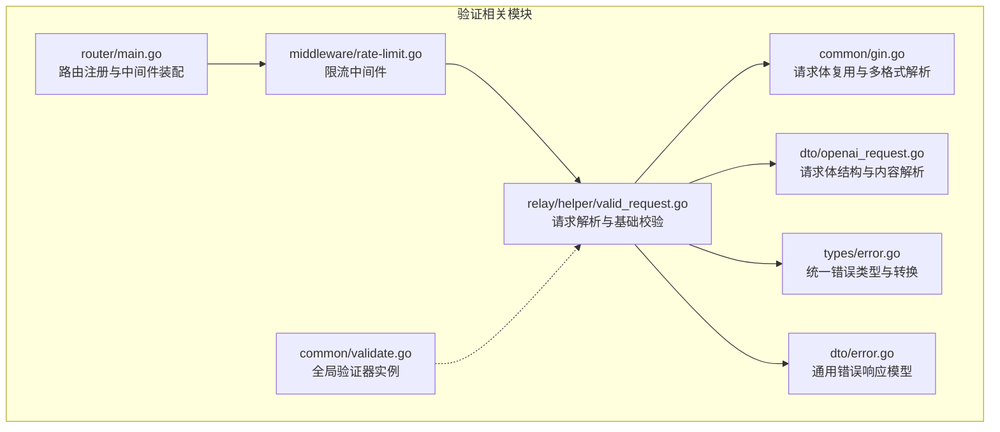
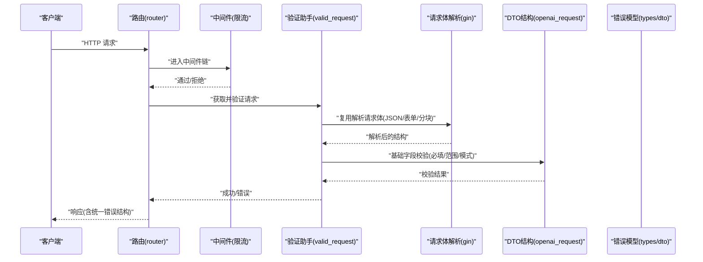
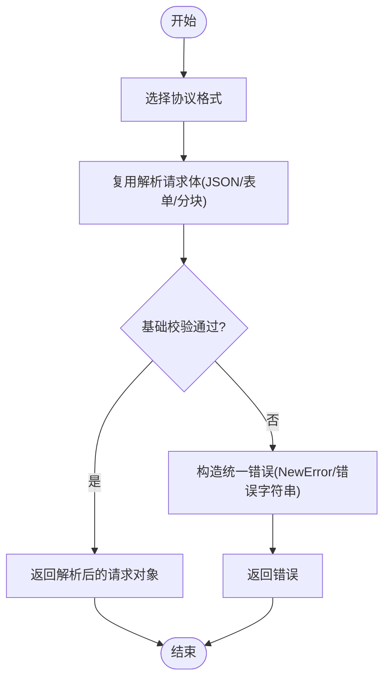
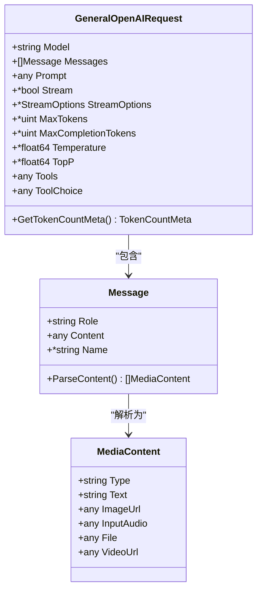
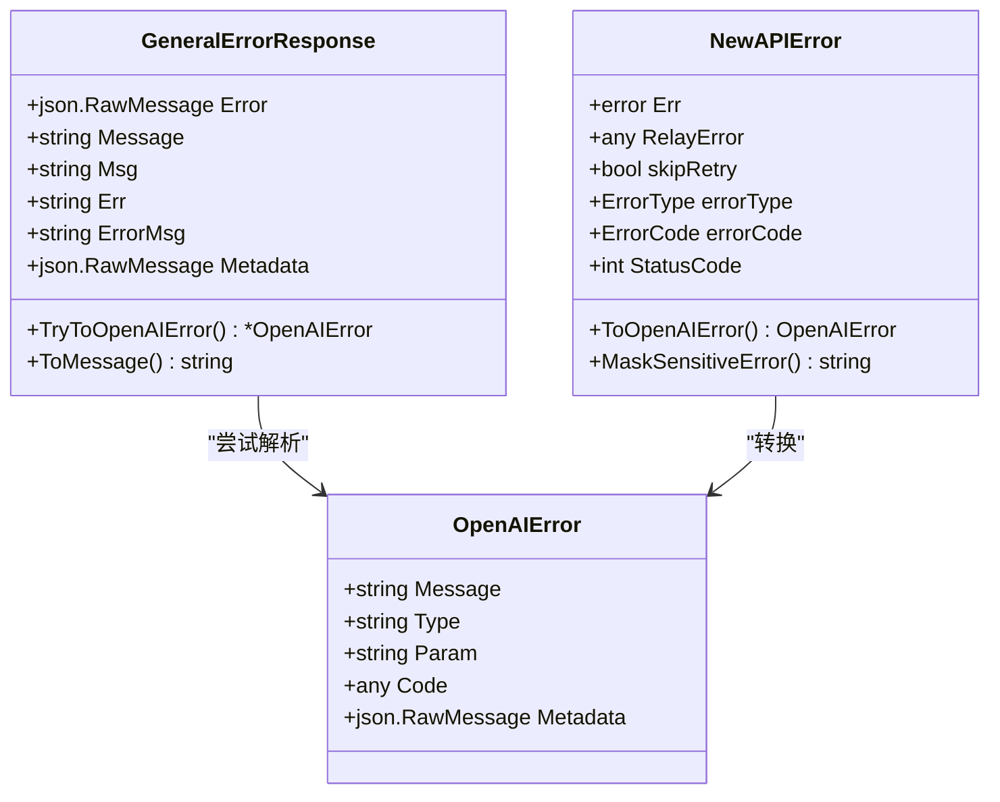
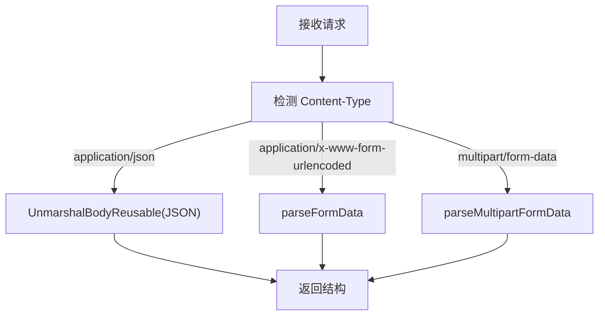
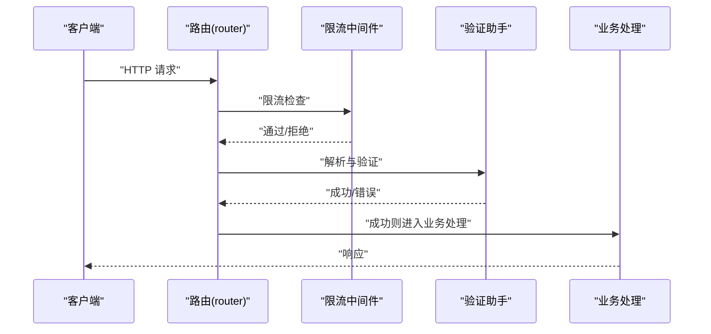
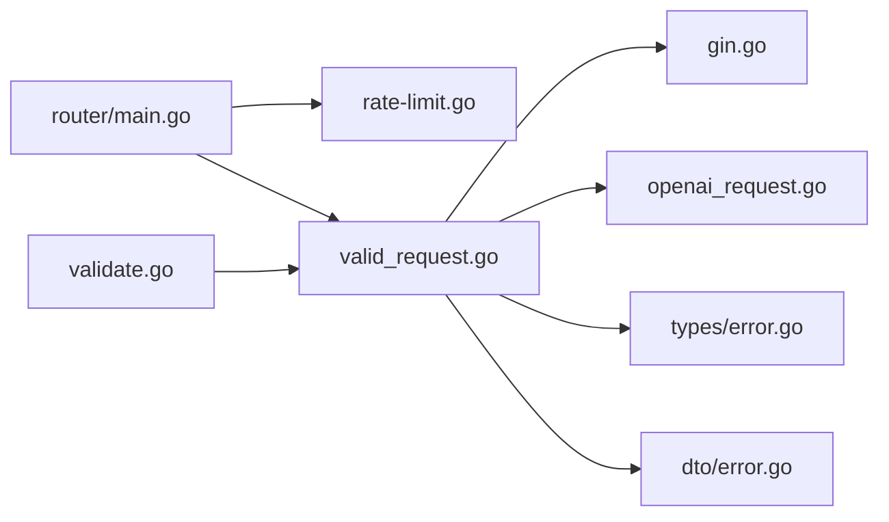

# 输入验证

<cite>
**本文引用的文件**
- [common/validate.go](file://common/validate.go)
- [relay/helper/valid_request.go](file://relay/helper/valid_request.go)
- [dto/openai_request.go](file://dto/openai_request.go)
- [dto/error.go](file://dto/error.go)
- [types/error.go](file://types/error.go)
- [common/gin.go](file://common/gin.go)
- [middleware/rate-limit.go](file://middleware/rate-limit.go)
- [router/main.go](file://router/main.go)
</cite>

## 目录
1. [引言](#引言)
2. [项目结构](#项目结构)
3. [核心组件](#核心组件)
4. [架构总览](#架构总览)
5. [详细组件分析](#详细组件分析)
6. [依赖分析](#依赖分析)
7. [性能考虑](#性能考虑)
8. [故障排查指南](#故障排查指南)
9. [结论](#结论)
10. [附录](#附录)

## 引言
本文件面向 New API 的输入验证系统，聚焦于请求参数与请求体的验证规则、字段类型检查与业务逻辑验证的实现机制。内容覆盖验证器的构建方式、错误处理策略与验证失败的统一响应格式，以及请求参数验证、请求体验证与自定义验证规则的落地方式。同时提供验证配置指南、常见验证场景与最佳实践，包括验证规则示例、错误消息定制与性能优化建议，并解释验证器在不同中间件中的集成方式与验证链的执行顺序。

## 项目结构
New API 的输入验证主要分布在以下模块：
- 通用验证器初始化：位于 common/validate.go，提供全局可用的结构化验证器实例。
- 请求体解析与验证：位于 relay/helper/valid_request.go，按不同协议格式对请求进行解析与基础字段校验。
- DTO 结构与媒体内容解析：位于 dto/openai_request.go，承载请求体结构、消息内容解析与工具调用等。
- 错误模型与统一响应：位于 dto/error.go 与 types/error.go，定义统一错误结构与错误转换方法。
- 请求体复用与多格式解析：位于 common/gin.go，支持 JSON、表单与分块上传的复用解析。
- 路由与中间件集成：位于 router/main.go 与 middleware/rate-limit.go，展示验证链在路由与限流中间件中的位置。

**图表来源**
- [common/validate.go:1-10](file://common/validate.go#L1-L10)
- [relay/helper/valid_request.go:1-342](file://relay/helper/valid_request.go#L1-L342)
- [dto/openai_request.go:1-1050](file://dto/openai_request.go#L1-L1050)
- [dto/error.go:1-94](file://dto/error.go#L1-L94)
- [types/error.go:1-418](file://types/error.go#L1-L418)
- [common/gin.go:108-366](file://common/gin.go#L108-L366)
- [middleware/rate-limit.go:1-65](file://middleware/rate-limit.go#L1-L65)
- [router/main.go:1-36](file://router/main.go#L1-L36)

**章节来源**
- [common/validate.go:1-10](file://common/validate.go#L1-L10)
- [relay/helper/valid_request.go:1-342](file://relay/helper/valid_request.go#L1-L342)
- [dto/openai_request.go:1-1050](file://dto/openai_request.go#L1-L1050)
- [dto/error.go:1-94](file://dto/error.go#L1-L94)
- [types/error.go:1-418](file://types/error.go#L1-L418)
- [common/gin.go:108-366](file://common/gin.go#L108-L366)
- [middleware/rate-limit.go:1-65](file://middleware/rate-limit.go#L1-L65)
- [router/main.go:1-36](file://router/main.go#L1-L36)

## 核心组件
- 全局验证器实例
  - 通过 common/validate.go 初始化全局验证器，供后续模块直接使用。
- 请求解析与基础验证
  - relay/helper/valid_request.go 提供多种协议格式的请求解析与基础字段校验，如必填项、取值范围、模式匹配等。
- DTO 结构与内容解析
  - dto/openai_request.go 定义了通用请求体结构、消息内容解析（文本、图片、音频、文件、视频等）、工具调用与流式选项等。
- 错误模型与统一响应
  - dto/error.go 与 types/error.go 提供统一的错误结构、错误类型枚举与错误转换方法，便于将内部错误映射为对外一致的响应格式。
- 请求体复用与多格式解析
  - common/gin.go 支持 JSON、表单与分块上传的复用解析，避免重复读取请求体，提升性能并保证中间件链的正确性。

**章节来源**
- [common/validate.go:1-10](file://common/validate.go#L1-L10)
- [relay/helper/valid_request.go:20-306](file://relay/helper/valid_request.go#L20-L306)
- [dto/openai_request.go:27-1050](file://dto/openai_request.go#L27-L1050)
- [dto/error.go:17-94](file://dto/error.go#L17-L94)
- [types/error.go:13-418](file://types/error.go#L13-L418)
- [common/gin.go:108-366](file://common/gin.go#L108-L366)

## 架构总览
New API 的输入验证遵循“路由 -> 中间件 -> 解析与验证 -> 业务处理”的链路。路由层负责装配中间件（如限流），解析与验证层负责请求体解析与基础校验，业务层根据验证结果继续处理或返回错误。

**图表来源**
- [router/main.go:16-35](file://router/main.go#L16-L35)
- [middleware/rate-limit.go:21-64](file://middleware/rate-limit.go#L21-L64)
- [relay/helper/valid_request.go:20-55](file://relay/helper/valid_request.go#L20-L55)
- [common/gin.go:108-137](file://common/gin.go#L108-L137)
- [dto/openai_request.go:27-1050](file://dto/openai_request.go#L27-L1050)
- [types/error.go:90-347](file://types/error.go#L90-L347)
- [dto/error.go:17-94](file://dto/error.go#L17-L94)

## 详细组件分析

### 组件A：请求解析与基础验证（relay/helper/valid_request.go）
- 功能概述
  - 按不同协议格式（OpenAI、Gemini、Claude、Responses、Embedding、Rerank、Audio、Image 等）解析请求体，并进行基础字段校验。
  - 对必填字段缺失、取值非法、模式不匹配等情况返回统一错误。
- 关键流程
  - 选择格式 -> 解析请求体 -> 基础校验 -> 返回结果或错误。
- 典型校验点
  - 必填字段：model、messages、input、prompt、instruction 等。
  - 取值范围：max_tokens 合法性、尺寸枚举值、质量默认值等。
  - 模式匹配：WebSearchOptions 的搜索上下文大小枚举、图像尺寸集合等。
- 错误处理
  - 使用 types.NewError 或 errors.New 包装错误，配合 ErrOptionWithSkipRetry 控制是否重试。
- 性能特性
  - 复用请求体解析，避免重复读取；对特定模式（如 Gemini Schema 类型规范化）进行浅层清理，降低深度遍历风险。

**图表来源**
- [relay/helper/valid_request.go:20-306](file://relay/helper/valid_request.go#L20-L306)
- [common/gin.go:108-137](file://common/gin.go#L108-L137)
- [types/error.go:244-315](file://types/error.go#L244-L315)

**章节来源**
- [relay/helper/valid_request.go:20-342](file://relay/helper/valid_request.go#L20-L342)
- [types/error.go:244-315](file://types/error.go#L244-L315)

### 组件B：请求体结构与内容解析（dto/openai_request.go）
- 功能概述
  - 定义通用请求体结构（如 GeneralOpenAIRequest、OpenAIResponsesRequest 等），支持多模态内容解析（文本、图片、音频、文件、视频）与工具调用。
- 关键能力
  - 多模态内容解析：将混合内容数组解析为标准化结构，提取文件源信息与文本片段。
  - 工具调用与流式选项：支持工具列表、工具选择、流式选项等。
  - Token 计数元数据：基于消息与工具参数生成 Token 计算所需的元数据。
- 数据结构复杂度
  - 内容解析涉及多轮类型判断与数组遍历，时间复杂度与消息数量及内容元素数量线性相关；建议在上游限制最大消息条数与内容元素数量以控制开销。

**图表来源**
- [dto/openai_request.go:27-482](file://dto/openai_request.go#L27-L482)

**章节来源**
- [dto/openai_request.go:27-1050](file://dto/openai_request.go#L27-L1050)

### 组件C：错误模型与统一响应（dto/error.go、types/error.go）
- 功能概述
  - 提供统一的错误结构（OpenAIError、GeneralErrorResponse）与错误类型枚举，支持将内部错误转换为对外一致的响应格式。
- 关键能力
  - OpenAI 兼容错误：包含 message、type、param、code、metadata 等字段。
  - 错误转换：NewAPIError 提供 ToOpenAIError、ToClaudeError 等转换方法，屏蔽敏感信息。
  - 统一响应：GeneralErrorResponse 支持从多种字段中提取消息，兼容不同上游返回风格。
- 错误消息定制
  - 通过 ErrOptionWithHideErrMsg 可替换错误消息，便于调试与生产环境区分。
  - 敏感信息掩码：除特定错误码外，其余错误消息均进行掩码处理。

**图表来源**
- [dto/error.go:17-94](file://dto/error.go#L17-L94)
- [types/error.go:13-240](file://types/error.go#L13-L240)

**章节来源**
- [dto/error.go:17-94](file://dto/error.go#L17-L94)
- [types/error.go:90-240](file://types/error.go#L90-L240)

### 组件D：请求体复用与多格式解析（common/gin.go）
- 功能概述
  - 提供 UnmarshalBodyReusable，支持 JSON、表单与分块上传的复用解析，避免重复读取请求体。
- 关键流程
  - 根据 Content-Type 分派解析逻辑 -> 读取缓存体 -> 解析到目标结构 -> 重置请求体指针。
- 性能特性
  - 缓存请求体字节，减少 IO；对 multipart 边界缺失时回退为 JSON 解析，增强健壮性。

**图表来源**
- [common/gin.go:108-366](file://common/gin.go#L108-L366)

**章节来源**
- [common/gin.go:108-366](file://common/gin.go#L108-L366)

### 组件E：全局验证器（common/validate.go）
- 功能概述
  - 初始化全局验证器实例，供其他模块直接使用。
- 使用建议
  - 在应用启动阶段完成初始化，确保验证器可用且线程安全。

**章节来源**
- [common/validate.go:1-10](file://common/validate.go#L1-L10)

### 组件F：中间件集成与验证链顺序（router/main.go、middleware/rate-limit.go）
- 功能概述
  - 路由层装配中间件（如限流），验证通常在中间件之后、业务处理之前执行。
- 集成要点
  - 限流中间件先于验证执行，避免无效请求占用验证资源。
  - 验证通过后再进入业务处理，失败则返回统一错误响应。

**图表来源**
- [router/main.go:16-35](file://router/main.go#L16-L35)
- [middleware/rate-limit.go:21-64](file://middleware/rate-limit.go#L21-L64)
- [relay/helper/valid_request.go:20-55](file://relay/helper/valid_request.go#L20-L55)

**章节来源**
- [router/main.go:16-35](file://router/main.go#L16-L35)
- [middleware/rate-limit.go:1-65](file://middleware/rate-limit.go#L1-L65)
- [relay/helper/valid_request.go:20-55](file://relay/helper/valid_request.go#L20-L55)

## 依赖分析
- 模块耦合
  - relay/helper/valid_request.go 依赖 common/gin.go 进行请求体解析，依赖 dto/openai_request.go 的结构定义，依赖 types/error.go 的错误封装。
  - dto/error.go 与 types/error.go 提供统一错误模型，被验证与业务层广泛使用。
  - router/main.go 与 middleware/rate-limit.go 影响验证链的执行时机与前置条件。
- 外部依赖
  - go-playground/validator/v10 作为全局验证器的基础库（通过 common/validate.go 初始化）。

**图表来源**
- [relay/helper/valid_request.go:1-342](file://relay/helper/valid_request.go#L1-L342)
- [common/gin.go:108-366](file://common/gin.go#L108-L366)
- [dto/openai_request.go:1-1050](file://dto/openai_request.go#L1-L1050)
- [dto/error.go:1-94](file://dto/error.go#L1-L94)
- [types/error.go:1-418](file://types/error.go#L1-L418)
- [router/main.go:1-36](file://router/main.go#L1-L36)
- [middleware/rate-limit.go:1-65](file://middleware/rate-limit.go#L1-L65)
- [common/validate.go:1-10](file://common/validate.go#L1-L10)

**章节来源**
- [relay/helper/valid_request.go:1-342](file://relay/helper/valid_request.go#L1-L342)
- [common/gin.go:108-366](file://common/gin.go#L108-L366)
- [dto/openai_request.go:1-1050](file://dto/openai_request.go#L1-L1050)
- [dto/error.go:1-94](file://dto/error.go#L1-L94)
- [types/error.go:1-418](file://types/error.go#L1-L418)
- [router/main.go:1-36](file://router/main.go#L1-L36)
- [middleware/rate-limit.go:1-65](file://middleware/rate-limit.go#L1-L65)
- [common/validate.go:1-10](file://common/validate.go#L1-L10)

## 性能考虑
- 请求体复用
  - 使用 common/gin.go 的 UnmarshalBodyReusable 避免重复读取请求体，减少 IO 并保持中间件链的正确性。
- 浅层清理与深度限制
  - 在处理复杂嵌套结构（如 Gemini Schema）时，采用浅层清理与深度限制策略，避免深度递归带来的性能问题。
- 早期失败
  - 在 relay/helper/valid_request.go 中尽早进行基础字段校验与范围检查，减少后续处理成本。
- 限流前置
  - middleware/rate-limit.go 将限流置于验证之前，避免无效请求占用验证资源。

**章节来源**
- [common/gin.go:108-366](file://common/gin.go#L108-L366)
- [relay/helper/valid_request.go:250-306](file://relay/helper/valid_request.go#L250-L306)
- [middleware/rate-limit.go:21-64](file://middleware/rate-limit.go#L21-L64)

## 故障排查指南
- 常见验证失败场景
  - 必填字段缺失：如 model、messages、input、prompt、instruction 等。
  - 取值非法：如 max_tokens 超出范围、尺寸枚举值不在允许集合内。
  - 模式不匹配：如 WebSearchOptions 的搜索上下文大小不在高/中/低范围内。
- 错误响应格式
  - 统一使用 types.NewError 或 errors.New 包装错误，结合 ErrOptionWithSkipRetry 控制是否重试。
  - 对外响应优先尝试解析为 OpenAI 兼容错误结构，否则回退到通用错误响应。
- 排查步骤
  - 检查请求体解析是否成功（common/gin.go）。
  - 确认基础字段校验是否通过（relay/helper/valid_request.go）。
  - 查看错误类型与错误码（types/error.go），必要时使用 ErrOptionWithHideErrMsg 替换消息以便定位。
  - 核对路由与中间件装配顺序（router/main.go、middleware/rate-limit.go）。

**章节来源**
- [relay/helper/valid_request.go:79-129](file://relay/helper/valid_request.go#L79-L129)
- [types/error.go:244-315](file://types/error.go#L244-L315)
- [dto/error.go:41-94](file://dto/error.go#L41-L94)
- [router/main.go:16-35](file://router/main.go#L16-L35)
- [middleware/rate-limit.go:21-64](file://middleware/rate-limit.go#L21-L64)

## 结论
New API 的输入验证体系以“请求体复用解析 + 基础字段校验 + 统一错误模型”为核心，通过中间件前置限流与验证前置执行，形成高效稳定的验证链。DTO 层提供多模态内容解析与工具调用支持，types/dto 层提供一致的错误表达与转换能力。整体设计兼顾易用性与性能，适合在高并发场景下稳定运行。

## 附录
- 验证配置指南
  - 在 relay/helper/valid_request.go 中新增或调整校验规则，确保与上游协议保持一致。
  - 对于敏感字段，使用 types/error.go 的掩码与隐藏选项，避免泄露敏感信息。
- 常见验证场景
  - 文本补全：校验 model、prompt、max_tokens 等。
  - 聊天补全：校验 model、messages 至少一条，或允许 prefix/suffix 的特殊模式。
  - 图像生成：校验 model、尺寸枚举、质量默认值等。
  - 嵌入与重排：校验 model、input/documents 等。
- 最佳实践
  - 尽早失败：在解析后立即进行基础校验，减少后续处理成本。
  - 统一错误：使用统一错误模型与转换方法，保证对外一致性。
  - 性能优先：启用请求体复用与浅层清理策略，避免深度递归与重复读取。
  - 中间件顺序：将限流置于验证之前，验证置于业务处理之前。