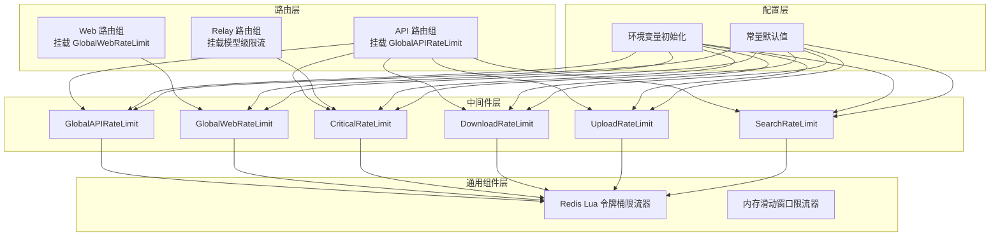
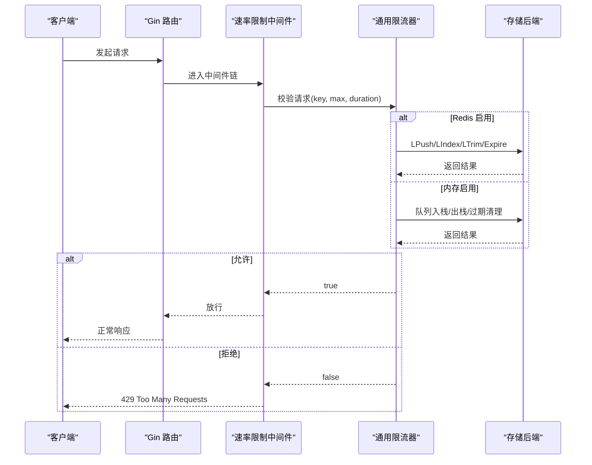
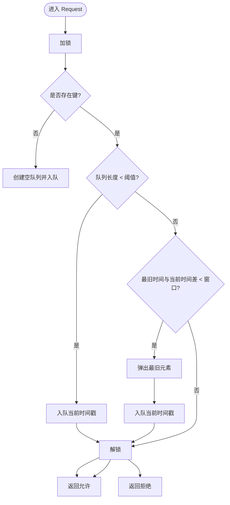
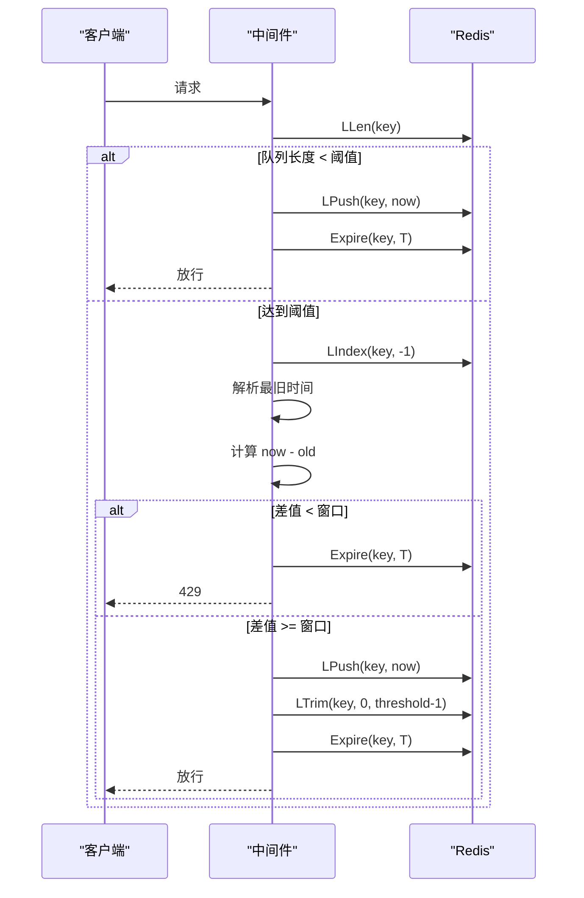
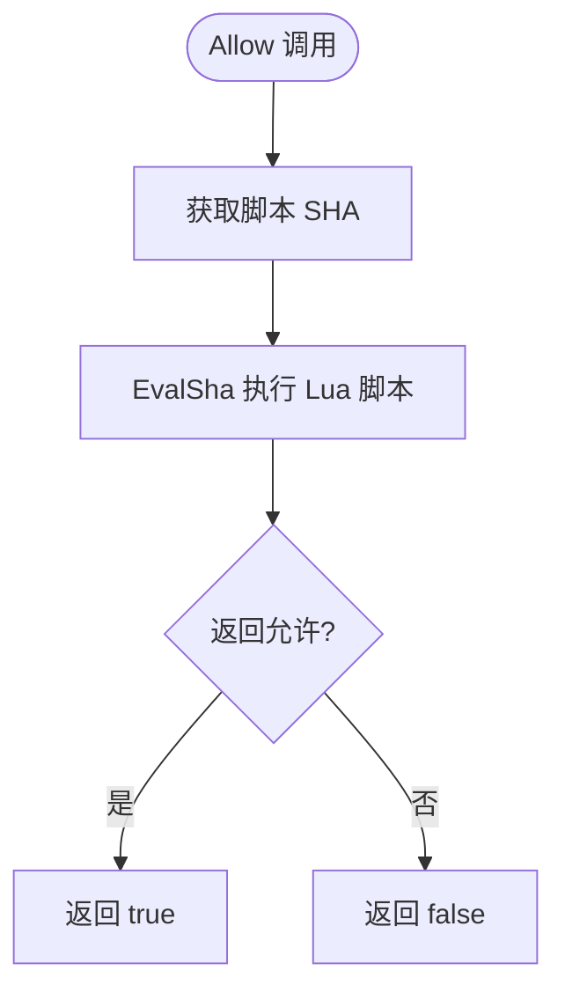
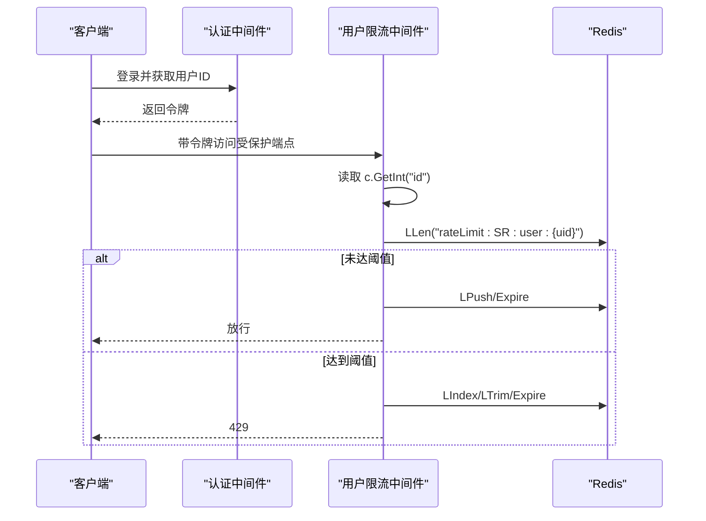
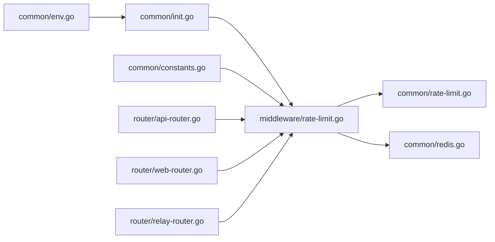

# 速率限制

<cite>
**本文引用的文件**
- [middleware/rate-limit.go](file://middleware/rate-limit.go)
- [common/rate-limit.go](file://common/rate-limit.go)
- [common/redis.go](file://common/redis.go)
- [common/init.go](file://common/init.go)
- [common/constants.go](file://common/constants.go)
- [common/env.go](file://common/env.go)
- [common/limiter/limiter.go](file://common/limiter/limiter.go)
- [common/limiter/lua/rate_limit.lua](file://common/limiter/lua/rate_limit.lua)
- [middleware/model-rate-limit.go](file://middleware/model-rate-limit.go)
- [router/api-router.go](file://router/api-router.go)
- [router/web-router.go](file://router/web-router.go)
- [router/relay-router.go](file://router/relay-router.go)
- [router/main.go](file://router/main.go)
- [setting/rate_limit.go](file://setting/rate_limit.go)
</cite>

## 目录
1. [简介](#简介)
2. [项目结构](#项目结构)
3. [核心组件](#核心组件)
4. [架构总览](#架构总览)
5. [详细组件分析](#详细组件分析)
6. [依赖关系分析](#依赖关系分析)
7. [性能考量](#性能考量)
8. [故障排除指南](#故障排除指南)
9. [结论](#结论)
10. [附录](#附录)

## 简介
本技术文档围绕 New API 的速率限制系统展开，系统性解析全局速率限制、用户特定速率限制与特殊场景速率限制的实现机制，并深入说明内存与 Redis 两种存储后端的速率限制算法、滑动窗口实现与过期时间管理。文档覆盖不同类型的速率限制器（GlobalWebRateLimit、GlobalAPIRateLimit、CriticalRateLimit、DownloadRateLimit、UploadRateLimit、SearchRateLimit）的配置参数与使用场景，提供配置指南、性能优化建议与故障排除方法，并解释用户 ID 基础的速率限制如何抵御代理轮换攻击。

## 项目结构
New API 的速率限制体系由以下层次构成：
- 中间件层：提供全局与特殊场景的速率限制中间件，按需选择内存或 Redis 后端。
- 通用组件层：封装内存滑动窗口与 Redis Lua 令牌桶限流器，统一对外暴露一致的 API。
- 路由层：在关键路由组上挂载速率限制中间件，形成“全局 Web/API/Critical/下载/上传/搜索”等多维度防护。
- 配置层：通过环境变量与常量初始化各限流器的阈值与窗口大小，并支持运行时动态调整。

图表来源
- [router/api-router.go:19](file://router/api-router.go#L19)
- [router/web-router.go:18](file://router/web-router.go#L18)
- [router/relay-router.go:73](file://router/relay-router.go#L73)
- [middleware/rate-limit.go:90-117](file://middleware/rate-limit.go#L90-L117)
- [common/limiter/limiter.go:42-91](file://common/limiter/limiter.go#L42-L91)
- [common/rate-limit.go:45-71](file://common/rate-limit.go#L45-L71)
- [common/init.go:111-128](file://common/init.go#L111-L128)
- [common/constants.go:174-186](file://common/constants.go#L174-L186)

章节来源
- [router/api-router.go:19-379](file://router/api-router.go#L19-L379)
- [router/web-router.go:18-31](file://router/web-router.go#L18-L31)
- [router/relay-router.go:73-201](file://router/relay-router.go#L73-L201)
- [middleware/rate-limit.go:90-205](file://middleware/rate-limit.go#L90-L205)
- [common/limiter/limiter.go:42-91](file://common/limiter/limiter.go#L42-L91)
- [common/rate-limit.go:45-71](file://common/rate-limit.go#L45-L71)
- [common/init.go:111-128](file://common/init.go#L111-L128)
- [common/constants.go:174-186](file://common/constants.go#L174-L186)

## 核心组件
- 内存滑动窗口限流器（InMemoryRateLimiter）
  - 基于并发安全的 map + 固定容量队列实现滑动窗口，支持自动清理过期键。
  - 提供 Request(key, maxRequestNum, duration) 接口，内部以 Unix 秒为单位记录时间戳。
- Redis 限流器（Redis Lua 令牌桶）
  - 通过预加载 Lua 脚本实现原子化的令牌桶限流，支持容量、速率与请求数配置。
  - 对外暴露 Allow(ctx, key, opts...) 接口，内部使用 SHA 缓存脚本，降低网络开销。
- 通用速率限制中间件工厂
  - rateLimitFactory(maxRequestNum, duration, mark)：根据 Redis 是否启用选择内存或 Redis 实现。
  - userRateLimitFactory(maxRequestNum, duration, mark)：基于认证后的用户 ID 构造键，抵御代理轮换攻击。
- 特殊场景限流器
  - GlobalWebRateLimit、GlobalAPIRateLimit、CriticalRateLimit、DownloadRateLimit、UploadRateLimit、SearchRateLimit：分别挂载到 Web/API/Critical/下载/上传/搜索等路由组或端点。

章节来源
- [common/rate-limit.go:8-71](file://common/rate-limit.go#L8-L71)
- [common/limiter/limiter.go:16-91](file://common/limiter/limiter.go#L16-L91)
- [common/limiter/lua/rate_limit.lua:1-44](file://common/limiter/lua/rate_limit.lua#L1-L44)
- [middleware/rate-limit.go:76-151](file://middleware/rate-limit.go#L76-L151)
- [middleware/rate-limit.go:198-205](file://middleware/rate-limit.go#L198-L205)

## 架构总览
New API 的速率限制采用“中间件 + 通用组件 + 配置”的分层设计。中间件负责在请求进入时进行判定，通用组件负责具体算法与数据持久化，配置层负责参数初始化与默认值设定。Redis 后端通过 Lua 脚本实现原子化操作，内存后端通过滑动窗口队列实现本地限流。

图表来源
- [middleware/rate-limit.go:21-65](file://middleware/rate-limit.go#L21-L65)
- [middleware/rate-limit.go:67-74](file://middleware/rate-limit.go#L67-L74)
- [common/rate-limit.go:45-71](file://common/rate-limit.go#L45-L71)
- [common/redis.go:24-54](file://common/redis.go#L24-L54)

## 详细组件分析

### 内存滑动窗口实现（InMemoryRateLimiter）
- 数据结构
  - map[string]*[]int64：以字符串键映射到固定容量的时间戳队列。
  - mutex：保证并发安全。
  - expirationDuration：键过期时间，启动后台 goroutine 定期清理。
- 算法流程
  - Request(key, max, duration)：若队列长度小于阈值，直接入队；否则检查最旧时间与当前时间差是否小于窗口，满足则淘汰最旧元素并入队，否则拒绝。
  - 后台清理：周期性扫描并删除超时键，避免内存膨胀。
- 时间复杂度
  - 单次请求 O(1)，清理 O(n)（n 为键数量）。
- 空间复杂度
  - O(k*m)，k 为活跃键数量，m 为每个键的最大容量。

图表来源
- [common/rate-limit.go:45-71](file://common/rate-limit.go#L45-L71)

章节来源
- [common/rate-limit.go:8-71](file://common/rate-limit.go#L8-L71)

### Redis 滑动窗口与过期时间管理
- 键命名规则
  - 基于 mark 前缀与客户端 IP 或用户 ID 组合，例如 "rateLimit:GW:IP" 或 "rateLimit:SR:user:UID"。
- 操作流程
  - LLen 获取当前队列长度；若小于阈值则 LPush 入队并 Expire 设置过期时间。
  - 若达到阈值，取队尾元素（最旧时间），计算与当前时间差，小于窗口则拒绝，否则 LPush 并 LTrim 保持队列长度，同时 Expire。
- 过期时间
  - 使用 RateLimitKeyExpirationDuration 控制键生命周期，默认 20 分钟，避免冷键长期占用内存。
- 异常处理
  - Redis 操作失败时返回 500 并中止请求；时间解析失败同样返回 500。

图表来源
- [middleware/rate-limit.go:21-65](file://middleware/rate-limit.go#L21-L65)
- [common/constants.go:186](file://common/constants.go#L186)

章节来源
- [middleware/rate-limit.go:21-65](file://middleware/rate-limit.go#L21-L65)
- [common/constants.go:186](file://common/constants.go#L186)

### Redis Lua 令牌桶限流器
- 脚本逻辑
  - 使用 HMGET/HMSET 维护 tokens 与 last_time，按时间推进计算新增令牌，判断是否允许请求并更新状态。
  - 脚本通过 SHA 缓存，避免重复传输，提升性能。
- 对外接口
  - Allow(ctx, key, opts...)：支持 WithCapacity、WithRate、WithRequested 选项，返回是否允许。
- 适用场景
  - 需要更精细的速率控制与跨节点一致性时，可优先使用该实现。

图表来源
- [common/limiter/limiter.go:42-69](file://common/limiter/limiter.go#L42-L69)
- [common/limiter/lua/rate_limit.lua:1-44](file://common/limiter/lua/rate_limit.lua#L1-L44)

章节来源
- [common/limiter/limiter.go:16-91](file://common/limiter/limiter.go#L16-L91)
- [common/limiter/lua/rate_limit.lua:1-44](file://common/limiter/lua/rate_limit.lua#L1-L44)

### 用户 ID 基础的速率限制与代理轮换防护
- 核心思想
  - 将限流键从客户端 IP 切换为用户 ID，即使攻击者更换代理或 IP，仍无法绕过基于账户的限流。
- 实现要点
  - userRateLimitFactory 在认证后读取 c.GetInt("id")，构造 "rateLimit:{mark}:user:{uid}" 键。
  - userRedisRateLimiter 与 redisRateLimiter 类似，但键空间独立，互不干扰。
- 场景覆盖
  - SearchRateLimit：对搜索类端点启用 per-user 限流，防止滥用。

图表来源
- [middleware/rate-limit.go:122-151](file://middleware/rate-limit.go#L122-L151)
- [middleware/rate-limit.go:198-205](file://middleware/rate-limit.go#L198-L205)

章节来源
- [middleware/rate-limit.go:122-151](file://middleware/rate-limit.go#L122-L151)
- [middleware/rate-limit.go:198-205](file://middleware/rate-limit.go#L198-L205)

### 不同类型速率限制器的配置与使用场景
- GlobalWebRateLimit
  - 作用：对 Web 前端静态资源与页面路由进行全局限流。
  - 默认：开启，阈值与窗口由环境变量与常量共同决定。
  - 应用：Web 路由组挂载。
- GlobalAPIRateLimit
  - 作用：对 API 路由进行全局限流。
  - 默认：开启，阈值与窗口由环境变量与常量共同决定。
  - 应用：API 路由组挂载。
- CriticalRateLimit
  - 作用：对高风险敏感操作（注册、登录、重置密码、支付等）进行严格限流。
  - 默认：开启，阈值与窗口较小，降低暴力尝试成功率。
  - 应用：多处关键路由挂载。
- DownloadRateLimit / UploadRateLimit
  - 作用：对下载与上传相关端点进行限流，避免带宽滥用。
  - 默认：开启，阈值与窗口较短。
  - 应用：API 路由组中对应端点挂载。
- SearchRateLimit
  - 作用：对搜索类端点进行 per-user 限流，结合用户 ID 抵御代理轮换。
  - 默认：开启，阈值与窗口由环境变量与常量共同决定。
  - 应用：搜索端点挂载 userRateLimitFactory。

章节来源
- [router/web-router.go:18](file://router/web-router.go#L18)
- [router/api-router.go:19](file://router/api-router.go#L19)
- [router/api-router.go:253](file://router/api-router.go#L253)
- [middleware/rate-limit.go:90-117](file://middleware/rate-limit.go#L90-L117)
- [middleware/rate-limit.go:198-205](file://middleware/rate-limit.go#L198-L205)

## 依赖关系分析
- 中间件依赖
  - middleware/rate-limit.go 依赖 common/rate-limit.go（内存）与 common/redis.go（Redis）。
  - 通过 common/redis.go 的 RDB 客户端与 RedisEnabled 标志选择后端。
- 配置依赖
  - common/init.go 与 common/constants.go 提供默认阈值与窗口大小。
  - common/env.go 提供环境变量解析工具，支持运行时覆盖默认值。
- 路由依赖
  - router/api-router.go、router/web-router.go、router/relay-router.go 在相应路由组挂载限流中间件。

图表来源
- [middleware/rate-limit.go:1-205](file://middleware/rate-limit.go#L1-L205)
- [common/rate-limit.go:1-71](file://common/rate-limit.go#L1-L71)
- [common/redis.go:1-328](file://common/redis.go#L1-L328)
- [common/init.go:111-128](file://common/init.go#L111-L128)
- [common/constants.go:174-186](file://common/constants.go#L174-L186)
- [common/env.go:1-39](file://common/env.go#L1-L39)
- [router/api-router.go:19-379](file://router/api-router.go#L19-L379)
- [router/web-router.go:18-31](file://router/web-router.go#L18-L31)
- [router/relay-router.go:73-201](file://router/relay-router.go#L73-L201)

章节来源
- [middleware/rate-limit.go:1-205](file://middleware/rate-limit.go#L1-L205)
- [common/rate-limit.go:1-71](file://common/rate-limit.go#L1-L71)
- [common/redis.go:1-328](file://common/redis.go#L1-L328)
- [common/init.go:111-128](file://common/init.go#L111-L128)
- [common/constants.go:174-186](file://common/constants.go#L174-L186)
- [common/env.go:1-39](file://common/env.go#L1-L39)
- [router/api-router.go:19-379](file://router/api-router.go#L19-L379)
- [router/web-router.go:18-31](file://router/web-router.go#L18-L31)
- [router/relay-router.go:73-201](file://router/relay-router.go#L73-L201)

## 性能考量
- Redis 后端
  - Lua 脚本执行与 SHA 缓存显著降低网络往返与脚本传输开销。
  - LPush/LTrim/Expire 组合操作原子化，避免竞态条件。
  - 建议合理设置 RateLimitKeyExpirationDuration，平衡内存占用与命中率。
- 内存后端
  - 适合单实例部署或低并发场景；后台清理 goroutine 降低内存压力。
  - 队列容量应与阈值一致，避免频繁扩容导致的额外分配。
- 模型级限流（可选）
  - middleware/model-rate-limit.go 提供基于 Redis 的模型请求/成功计数限流，适用于需要区分“总请求数”与“成功请求数”的场景。
  - 通过 setting/rate_limit.go 的 JSON 配置与校验函数维护分组阈值。

章节来源
- [common/limiter/limiter.go:26-40](file://common/limiter/limiter.go#L26-L40)
- [middleware/model-rate-limit.go:24-62](file://middleware/model-rate-limit.go#L24-L62)
- [setting/rate_limit.go:19-70](file://setting/rate_limit.go#L19-L70)

## 故障排除指南
- 429 Too Many Requests
  - 检查对应中间件的阈值与窗口设置，确认是否误触发。
  - 若使用 Redis，确认键是否被正确 Expire，以及时间格式解析是否异常。
- 500 Internal Server Error
  - Redis 操作失败或时间解析失败会导致 500；检查 Redis 连接与可用性。
- 代理轮换绕过
  - 确认 SearchRateLimit 等用户限流中间件在认证之后调用，确保 c.GetInt("id") 非零。
- 过期键清理不生效
  - 检查 RateLimitKeyExpirationDuration 是否合理，以及内存后端的后台清理 goroutine 是否正常运行。

章节来源
- [middleware/rate-limit.go:26-30](file://middleware/rate-limit.go#L26-L30)
- [middleware/rate-limit.go:38-51](file://middleware/rate-limit.go#L38-L51)
- [middleware/rate-limit.go:125-130](file://middleware/rate-limit.go#L125-L130)
- [common/rate-limit.go:28-42](file://common/rate-limit.go#L28-L42)

## 结论
New API 的速率限制系统通过中间件层抽象、通用组件层算法与配置层参数化，实现了灵活、可扩展且高性能的多维度限流能力。Redis 后端提供跨节点一致性与原子化操作，内存后端提供低延迟与简单部署方案。用户 ID 基础的限流策略有效抵御代理轮换攻击，结合不同场景的阈值与窗口设置，能够平衡用户体验与系统稳定性。

## 附录

### 配置参数与默认值
- 全局 Web 限流
  - 开关：GLOBAL_WEB_RATE_LIMIT_ENABLE（默认开启）
  - 阈值：GLOBAL_WEB_RATE_LIMIT（默认 60）
  - 窗口：GLOBAL_WEB_RATE_LIMIT_DURATION（默认 180 秒）
- 全局 API 限流
  - 开关：GLOBAL_API_RATE_LIMIT_ENABLE（默认开启）
  - 阈值：GLOBAL_API_RATE_LIMIT（默认 180）
  - 窗口：GLOBAL_API_RATE_LIMIT_DURATION（默认 180 秒）
- 关键操作限流
  - 开关：CRITICAL_RATE_LIMIT_ENABLE（默认开启）
  - 阈值：CRITICAL_RATE_LIMIT（默认 20）
  - 窗口：CRITICAL_RATE_LIMIT_DURATION（默认 1200 秒）
- 下载/上传限流
  - 下载：DOWNLOAD_RATE_LIMIT（默认 10），DURATION=60 秒
  - 上传：UPLOAD_RATE_LIMIT（默认 10），DURATION=60 秒
- 搜索限流
  - 开关：SEARCH_RATE_LIMIT_ENABLE（默认开启）
  - 阈值：SEARCH_RATE_LIMIT（默认 10）
  - 窗口：SEARCH_RATE_LIMIT_DURATION（默认 60 秒）
- 通用过期时间
  - RateLimitKeyExpirationDuration（默认 20 分钟）

章节来源
- [common/init.go:111-128](file://common/init.go#L111-L128)
- [common/constants.go:174-186](file://common/constants.go#L174-L186)
- [common/env.go:9-39](file://common/env.go#L9-L39)

### 速率限制配置指南
- 选择后端
  - 单实例或低并发：使用内存后端，简化部署。
  - 多实例或高并发：启用 Redis，确保限流状态共享。
- 参数调优
  - 阈值与窗口成反比：阈值越高、窗口越短，越接近“突发”；阈值越低、窗口越长，越接近“稳态”。
  - 过期时间建议：略大于窗口，避免冷键长期占用内存。
- 场景化策略
  - 注册/登录/重置密码等敏感操作：使用 CriticalRateLimit，阈值小、窗口短。
  - 搜索类端点：使用 SearchRateLimit，基于用户 ID 限流。
  - 文件上传/下载：使用 DownloadRateLimit/UploadRateLimit，窗口短、阈值适中。
  - Web 页面与静态资源：使用 GlobalWebRateLimit，避免爬虫与暴力扫描。
  - API 路由：使用 GlobalAPIRateLimit，平衡吞吐与安全。

### 监控与告警建议
- 指标采集
  - 429 计数：统计各中间件触发次数，识别异常峰值。
  - Redis 命中率：评估键过期与清理效率。
  - 内存使用：监控内存后端队列长度与 goroutine 数量。
- 告警策略
  - 429 触发次数在短时间内激增时告警。
  - Redis Ping 失败或连接池耗尽时告警。
  - 内存增长异常或 goroutine 数量异常上升时告警。