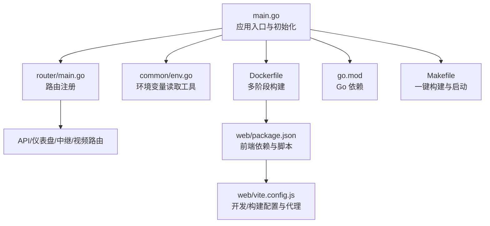
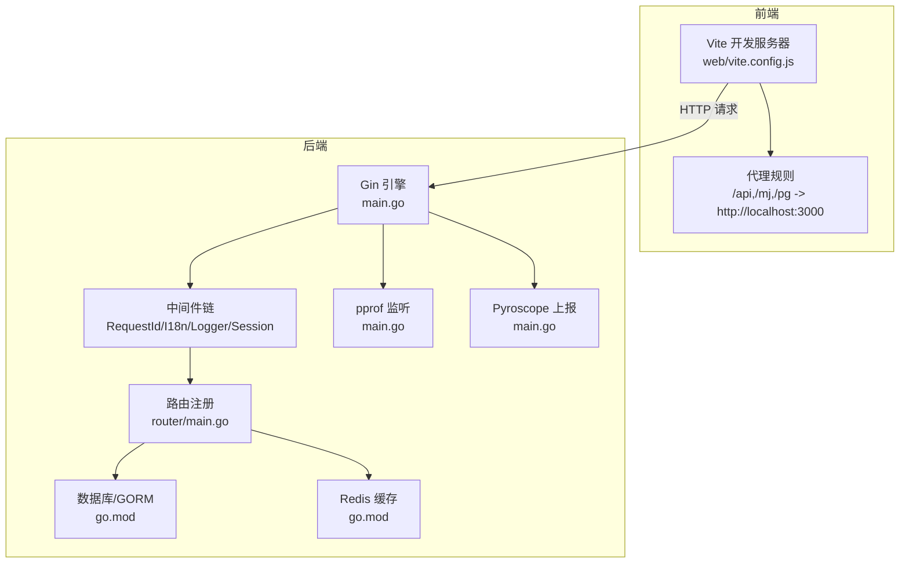
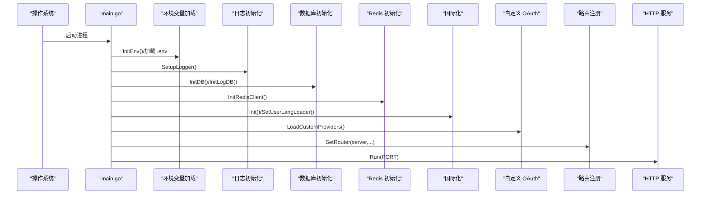
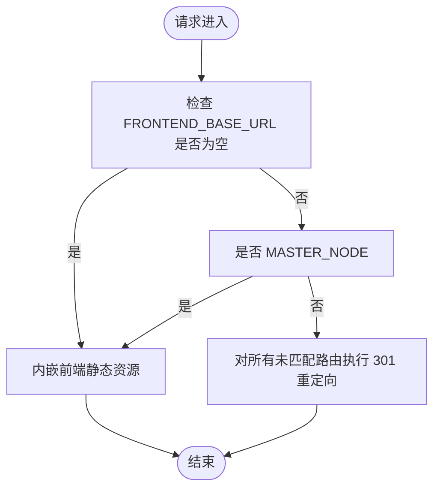
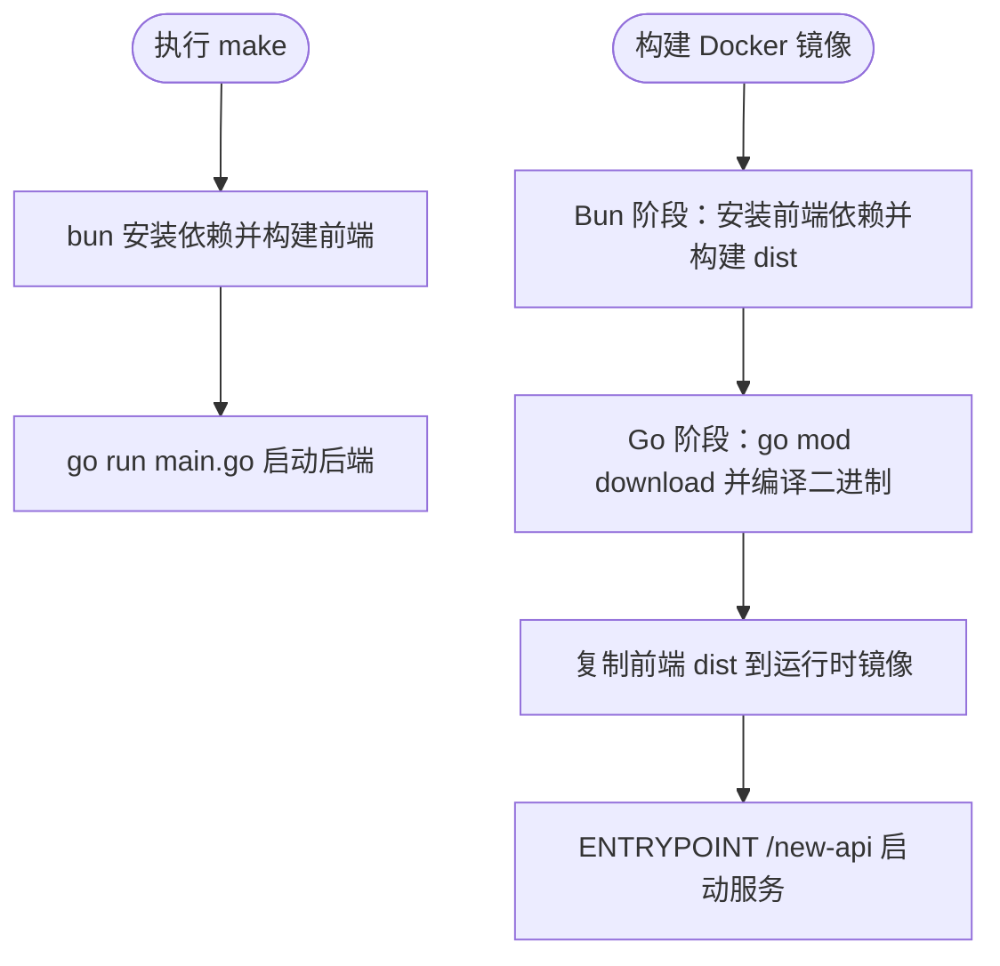
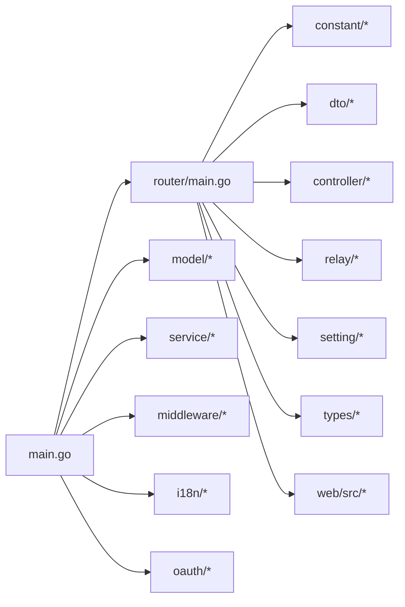

# 开发指南

<cite>
**本文引用的文件**   
- [README.md](file://README.md)
- [main.go](file://main.go)
- [go.mod](file://go.mod)
- [makefile](file://makefile)
- [Dockerfile](file://Dockerfile)
- [router/main.go](file://router/main.go)
- [web/package.json](file://web/package.json)
- [web/vite.config.js](file://web/vite.config.js)
- [.github/CODE_OF_CONDUCT.md](file://.github/CODE_OF_CONDUCT.md)
- [common/env.go](file://common/env.go)
</cite>

## 目录
1. [简介](#简介)
2. [项目结构](#项目结构)
3. [核心组件](#核心组件)
4. [架构总览](#架构总览)
5. [详细组件分析](#详细组件分析)
6. [依赖分析](#依赖分析)
7. [性能考虑](#性能考虑)
8. [故障排查指南](#故障排查指南)
9. [结论](#结论)
10. [附录](#附录)

## 简介
本指南面向新贡献者与现有开发者，帮助您快速完成开发环境搭建、理解项目结构与模块依赖、掌握构建与运行流程，并提供代码规范、调试技巧、测试策略（单元与集成）、覆盖率要求、贡献流程（PR 与代码审查）以及版本控制与发布建议。项目采用前后端分离架构：后端使用 Go（Gin 框架），前端使用 React/Vite，通过 Docker 进行容器化打包与部署。

## 项目结构
项目采用按功能域分层的组织方式：
- 后端入口与启动：main.go 负责初始化资源、数据库、会话、国际化、任务调度与路由注册。
- 路由层：router/main.go 统一挂载 API、仪表盘、中继与视频路由，并根据环境变量决定是否代理到外部前端。
- 前端：web 目录包含 React 应用，Vite 提供开发服务器与构建，配置了代理到后端 API。
- 构建与打包：根目录 Makefile 提供一键构建前端与启动后端；Dockerfile 使用多阶段构建，先构建前端静态资源，再编译后端并打包运行时镜像。
- 依赖管理：go.mod 定义 Go 语言版本与第三方库依赖；web/package.json 管理前端依赖与脚本。

**图示来源**
- [main.go:1-317](file://main.go#L1-L317)
- [router/main.go:16-35](file://router/main.go#L16-L35)
- [web/package.json:1-97](file://web/package.json#L1-L97)
- [web/vite.config.js:28-108](file://web/vite.config.js#L28-L108)
- [Dockerfile:1-39](file://Dockerfile#L1-L39)
- [go.mod:1-140](file://go.mod#L1-L140)
- [makefile:1-15](file://makefile#L1-L15)

**章节来源**
- [main.go:1-317](file://main.go#L1-L317)
- [router/main.go:16-35](file://router/main.go#L16-L35)
- [web/package.json:1-97](file://web/package.json#L1-L97)
- [web/vite.config.js:28-108](file://web/vite.config.js#L28-L108)
- [Dockerfile:1-39](file://Dockerfile#L1-L39)
- [go.mod:1-140](file://go.mod#L1-L140)
- [makefile:1-15](file://makefile#L1-L15)

## 核心组件
- 应用入口与生命周期
  - 初始化资源：加载 .env、设置日志、初始化数据库与日志库、选项映射、清理缓存、定价数据、Redis、系统监控、国际化与自定义 OAuth 提供商。
  - 启动任务：通道缓存同步、选项热更新、配额统计、通道自动测试与上游模型更新、订阅配额重置、Codex 凭据刷新等。
  - 注册中间件：请求 ID、Powered-By、国际化、会话存储、恢复处理。
  - 注册路由：API、仪表盘、中继、视频路由；根据 FRONTEND_BASE_URL 决定是否内嵌前端或重定向。
  - 启动 HTTP 服务，默认监听 PORT 或配置端口。
- 路由与前端集成
  - 当未配置 MASTER_NODE 且设置了 FRONTEND_BASE_URL 时，所有未匹配路由将永久重定向至该地址；否则内嵌前端静态资源。
- 构建与运行
  - Makefile：先构建前端（bun 安装依赖并构建），再启动后端（go run main.go）。
  - Dockerfile：多阶段构建，先在 Bun 镜像中构建前端静态资源，再在 Go 镜像中下载依赖并编译后端，最后以 Debian slim 运行时镜像启动。

**章节来源**
- [main.go:43-199](file://main.go#L43-L199)
- [main.go:242-316](file://main.go#L242-L316)
- [router/main.go:16-35](file://router/main.go#L16-L35)
- [makefile:8-14](file://makefile#L8-L14)
- [Dockerfile:1-39](file://Dockerfile#L1-L39)

## 架构总览
下图展示了从浏览器到后端服务的整体交互路径，包括前端开发服务器代理、后端路由与中间件、数据库与 Redis 的协作，以及可选的 pprof 性能分析与 Pyroscope 监控。

**图示来源**
- [web/vite.config.js:90-106](file://web/vite.config.js#L90-L106)
- [main.go:155-199](file://main.go#L155-L199)
- [router/main.go:16-35](file://router/main.go#L16-L35)
- [go.mod:21-60](file://go.mod#L21-L60)

## 详细组件分析

### 启动流程与初始化序列
以下序列图描述了应用启动的关键步骤与初始化顺序，便于定位问题与扩展初始化逻辑。

**图示来源**
- [main.go:242-316](file://main.go#L242-L316)
- [main.go:43-199](file://main.go#L43-L199)

**章节来源**
- [main.go:43-199](file://main.go#L43-L199)
- [main.go:242-316](file://main.go#L242-L316)

### 路由与前端集成
- 当未配置 MASTER_NODE 且设置了 FRONTEND_BASE_URL 时，所有未匹配路由将被永久重定向到该地址，用于将前端托管到外部 CDN 或独立域名。
- 当未设置 FRONTEND_BASE_URL 时，内嵌前端静态资源，直接返回 web/dist 下的页面。

**图示来源**
- [router/main.go:16-35](file://router/main.go#L16-L35)

**章节来源**
- [router/main.go:16-35](file://router/main.go#L16-L35)

### 构建与打包流程
- Makefile：先在 web 目录安装前端依赖并构建，再回到根目录启动后端。
- Dockerfile：多阶段构建，第一阶段使用 Bun 构建前端静态资源，第二阶段下载 Go 依赖并编译后端，最终以 Debian slim 运行时镜像启动。

**图示来源**
- [makefile:8-14](file://makefile#L8-L14)
- [Dockerfile:1-39](file://Dockerfile#L1-L39)

**章节来源**
- [makefile:8-14](file://makefile#L8-L14)
- [Dockerfile:1-39](file://Dockerfile#L1-L39)

## 依赖分析
- Go 语言版本：1.25.1（go.mod）
- 关键后端依赖：Gin Web 框架、GORM 数据库 ORM、Redis 客户端、JWT、i18n、Stripe、Epay、WebAuthn 等。
- 前端依赖：React、React Router、Axios、SSE.js、i18next、TailwindCSS、Vite、ESLint、Prettier 等。
- 依赖关系耦合点：
  - main.go 依赖 router、model、service、middleware、i18n、oauth 等模块。
  - 路由层依赖中间件与常量配置。
  - 前端通过代理访问后端 API，开发与生产环境分别由 vite.config.js 与 Dockerfile 控制。

**图示来源**
- [main.go:14-25](file://main.go#L14-L25)
- [router/main.go:3-14](file://router/main.go#L3-L14)
- [go.mod:6-61](file://go.mod#L6-L61)

**章节来源**
- [go.mod:1-140](file://go.mod#L1-L140)
- [main.go:14-25](file://main.go#L14-L25)
- [router/main.go:3-14](file://router/main.go#L3-L14)

## 性能考虑
- pprof 与系统监控
  - 可通过环境变量启用 pprof 性能分析监听，便于定位热点与内存问题。
  - 启用 Pyroscope 进行火焰图与采样分析，支持基础认证与采样率配置。
- 缓存与并发
  - 支持内存缓存与 Redis 缓存，配合通道缓存同步与选项热更新，降低数据库压力。
  - 使用 goroutine 并发执行任务（如通道更新、订阅重置、Codex 凭据刷新等）。
- 前端性能
  - Vite 配置了代码分割与别名，减少首屏体积；代理仅在开发环境生效。

**章节来源**
- [main.go:141-152](file://main.go#L141-L152)
- [main.go:90-114](file://main.go#L90-L114)
- [web/vite.config.js:67-89](file://web/vite.config.js#L67-L89)

## 故障排查指南
- 启动失败
  - 检查数据库连接字符串与端口占用；确认 .env 文件存在且参数正确。
  - 查看日志输出，定位初始化阶段错误（数据库、Redis、i18n、OAuth）。
- 路由异常
  - 若未设置 FRONTEND_BASE_URL，应内嵌前端；若设置了 MASTER_NODE，将忽略该变量。
  - 未匹配路由被重定向时，确认目标地址可达。
- 前端无法访问后端接口
  - 确认 Vite 代理配置已将 /api、/mj、/pg 代理到 http://localhost:3000。
- 环境变量解析
  - 使用 common/env.go 提供的工具函数读取整数、字符串、布尔值，注意默认值与解析失败回退。

**章节来源**
- [main.go:242-316](file://main.go#L242-L316)
- [router/main.go:16-35](file://router/main.go#L16-L35)
- [web/vite.config.js:90-106](file://web/vite.config.js#L90-L106)
- [common/env.go:9-38](file://common/env.go#L9-L38)

## 结论
本指南提供了从环境搭建、代码规范、调试技巧到测试与贡献流程的完整路径。建议新同学先通过 Docker 快速跑通整体流程，再逐步熟悉各层职责与依赖关系；有经验的开发者可基于本文档优化构建流程、完善测试覆盖与监控体系。

## 附录

### 开发环境搭建
- 前端
  - 使用 Bun 安装依赖并运行开发服务器；Vite 提供代理到后端 API。
- 后端
  - 使用 Go 1.25.1 运行 main.go；可结合 .env 配置数据库、Redis、会话密钥等。
- 构建与运行
  - 使用 Makefile 一键构建前端并启动后端；或使用 Dockerfile 多阶段构建镜像。

**章节来源**
- [web/package.json:44-56](file://web/package.json#L44-L56)
- [web/vite.config.js:90-106](file://web/vite.config.js#L90-L106)
- [makefile:8-14](file://makefile#L8-L14)
- [Dockerfile:1-39](file://Dockerfile#L1-L39)

### 代码规范与质量工具
- 前端
  - ESLint 与 Prettier 已配置，提供脚本进行检查与修复；TailwindCSS 与 Semi UI 主题变量统一。
- 后端
  - 使用 godotenv 加载 .env；日志与错误处理集中在 common 包；中间件统一注入。

**章节来源**
- [web/.eslintrc.cjs:1-43](file://web/.eslintrc.cjs#L1-L43)
- [web/.prettierrc.mjs:1-2](file://web/.prettierrc.mjs#L1-L2)
- [web/tailwind.config.js:20-150](file://web/tailwind.config.js#L20-L150)
- [main.go:245-255](file://main.go#L245-L255)

### 单元测试与集成测试
- 测试分布广泛，覆盖 relay、dto、service、controller、common 等多个包，建议遵循“每个包一个测试文件夹”的约定。
- 建议：
  - 单元测试：针对函数与方法边界条件、错误路径与空输入。
  - 集成测试：模拟 HTTP 请求与数据库/Redis 交互，验证路由与控制器行为。
  - 覆盖率：建议至少达到 70% 行覆盖率与 60% 函数覆盖率，关键路径优先。

**章节来源**
- [README.md:107-154](file://README.md#L107-L154)

### 贡献指南与 PR 流程
- 行为准则：遵守 Contributor Covenant 行为准则，尊重多样性与包容性。
- PR 流程建议：
  - 在本地创建分支并提交变更，保持每次提交聚焦单一主题。
  - 提交前运行前端与后端的 lint、格式化与测试命令。
  - 在 GitHub 提交 PR，填写模板并关联相关 Issue。
- 代码审查标准：
  - 代码清晰、注释充分、命名一致。
  - 覆盖关键路径与异常场景，避免破坏既有功能。
  - 遵循项目风格（ESLint/Prettier、Go 导入顺序与包结构）。

**章节来源**
- [.github/CODE_OF_CONDUCT.md:1-84](file://.github/CODE_OF_CONDUCT.md#L1-L84)
- [README.md:435-444](file://README.md#L435-L444)

### 版本控制与发布建议
- 分支策略：主分支稳定发布，特性开发在 feature/* 分支，hotfix/* 修复紧急问题。
- 提交信息：采用“类型: 内容”格式，如 feat: 新增某功能，fix: 修复某问题。
- 发布流程：打标签并推送，触发 CI 构建镜像与文档更新。

**章节来源**
- [README.md:290-404](file://README.md#L290-L404)