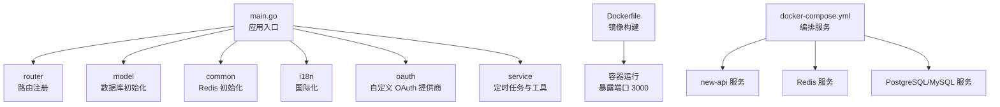
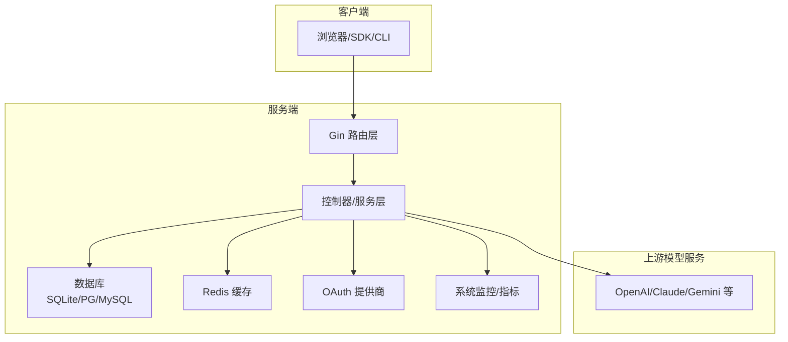
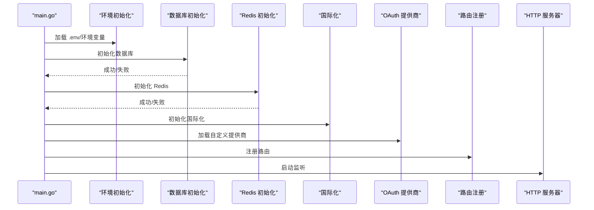
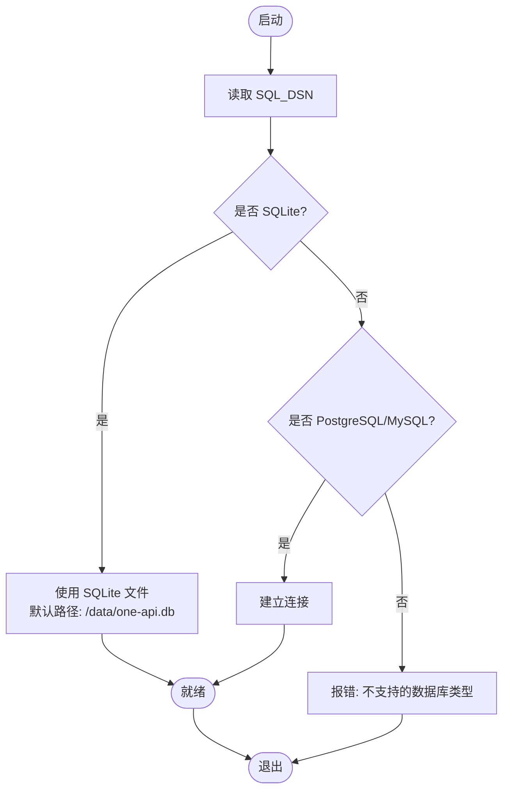
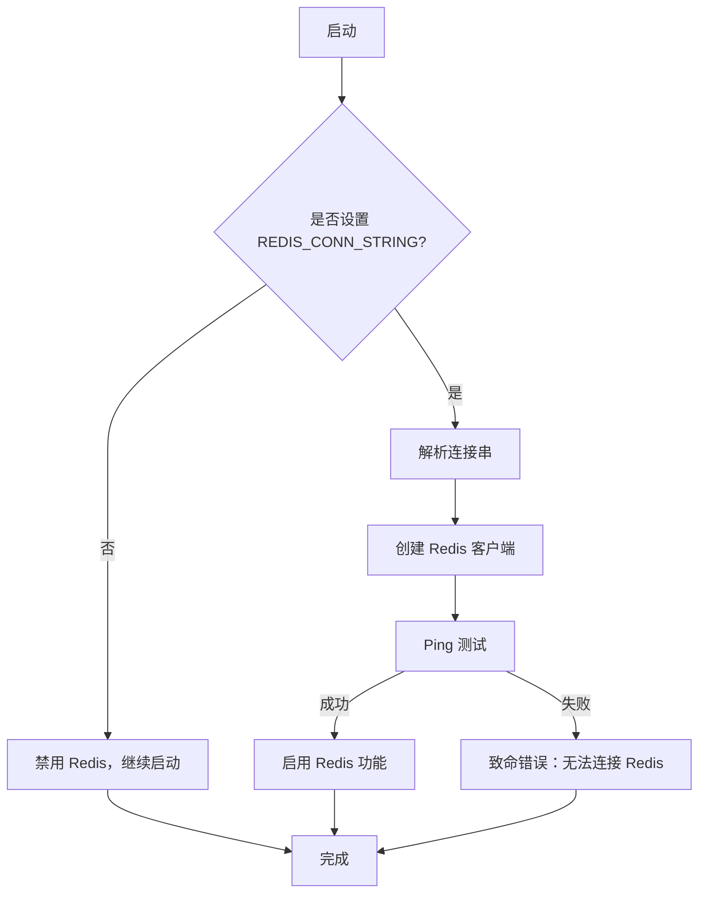
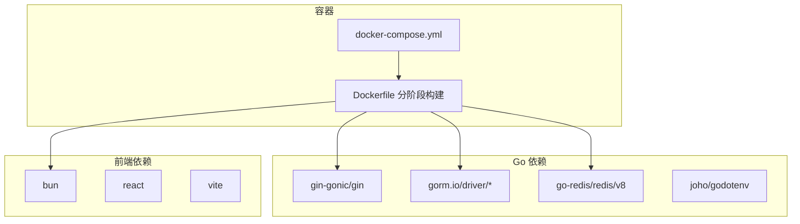

# 快速开始

<cite>
**本文引用的文件**
- [README.md](file://README.md)
- [main.go](file://main.go)
- [Dockerfile](file://Dockerfile)
- [docker-compose.yml](file://docker-compose.yml)
- [go.mod](file://go.mod)
- [makefile](file://makefile)
- [new-api.service](file://new-api.service)
- [common/env.go](file://common/env.go)
- [constant/env.go](file://constant/env.go)
- [common/constants.go](file://common/constants.go)
- [common/database.go](file://common/database.go)
- [common/redis.go](file://common/redis.go)
- [setting/config/config.go](file://setting/config/config.go)
- [model/setup.go](file://model/setup.go)
- [bin/migration_v0.3-v0.4.sql](file://bin/migration_v0.3-v0.4.sql)
</cite>

## 目录
1. [简介](#简介)
2. [项目结构](#项目结构)
3. [核心组件](#核心组件)
4. [架构总览](#架构总览)
5. [详细组件解析](#详细组件解析)
6. [依赖关系分析](#依赖关系分析)
7. [性能与容量建议](#性能与容量建议)
8. [故障排除指南](#故障排除指南)
9. [结论](#结论)
10. [附录](#附录)

## 简介
New API 是一个面向下一代大语言模型（LLM）的网关与 AI 资产管理系统，提供统一的 API 接口、多渠道智能路由、实时对话、图像/音频/视频处理、支付与计费、权限与配额管理、以及现代化的 Web 控制台与多语言界面。本“快速开始”旨在帮助新用户在最短时间内完成系统部署与基础配置，覆盖 Docker 一键部署、手动安装、SQLite/MySQL 选择、Redis 缓存、环境变量与关键配置项，并提供常见问题排查思路。

## 项目结构
项目采用后端 Go 语言 + 前端 React/Vite 的双栈架构，通过 Dockerfile 与 docker-compose.yml 提供容器化部署方案；后端启动流程贯穿资源初始化、数据库与 Redis 连接、国际化与 OAuth 提供商加载、定时任务与监控等环节；前端构建产物嵌入至二进制，运行时由 Gin 提供静态页面与 API 服务。

图表来源
- [main.go:43-199](file://main.go#L43-L199)
- [Dockerfile:28-39](file://Dockerfile#L28-L39)
- [docker-compose.yml:17-97](file://docker-compose.yml#L17-L97)

章节来源
- [README.md:107-155](file://README.md#L107-L155)
- [main.go:43-199](file://main.go#L43-L199)
- [Dockerfile:1-39](file://Dockerfile#L1-L39)
- [docker-compose.yml:1-97](file://docker-compose.yml#L1-L97)

## 核心组件
- 应用入口与生命周期
  - 初始化资源、加载 .env、设置日志、数据库与 Redis、国际化、OAuth 提供商、定时任务与监控，随后启动 HTTP 服务器并监听端口。
- 容器化与编排
  - Dockerfile 分阶段构建前端与后端，最终在 Debian 基础镜像中运行；docker-compose 提供默认 PostgreSQL + Redis + new-api 的最小可用拓扑。
- 配置管理
  - 通过 ConfigManager 统一注册与持久化配置模块，支持从数据库导入/导出键值映射，便于热更新与控制台配置。
- 数据层
  - 支持 SQLite、PostgreSQL、MySQL；默认使用 SQLite（Docker 需挂载 /data），日志库可切换为 SQLite。
- 缓存层
  - Redis 可选启用，用于内存缓存、配额与通道缓存同步、限流与会话等。

章节来源
- [main.go:242-316](file://main.go#L242-L316)
- [setting/config/config.go:13-90](file://setting/config/config.go#L13-L90)
- [common/database.go:1-16](file://common/database.go#L1-L16)
- [common/redis.go:23-54](file://common/redis.go#L23-L54)

## 架构总览
下图展示了从请求进入、路由分发、业务处理到上游模型服务的典型链路，以及数据库与缓存的关键交互点。

图表来源
- [main.go:154-199](file://main.go#L154-L199)
- [common/redis.go:23-54](file://common/redis.go#L23-L54)
- [common/database.go:1-16](file://common/database.go#L1-L16)

## 详细组件解析

### 启动流程与初始化
- 关键步骤
  - 加载 .env 或环境变量，初始化日志与配置。
  - 初始化数据库（SQLite/PG/MySQL），检查并迁移/初始化系统表。
  - 初始化 Redis（可选），开启内存缓存与同步任务。
  - 初始化国际化与 OAuth 提供商。
  - 注册路由并启动 HTTP 服务器。
- 并发与监控
  - 启用 pprof 与 Pyroscope（可选）进行性能分析与监控。
  - 启动通道测试、订阅配额重置、批次更新等后台任务。

图表来源
- [main.go:242-316](file://main.go#L242-L316)

章节来源
- [main.go:43-199](file://main.go#L43-L199)
- [main.go:242-316](file://main.go#L242-L316)

### 数据库选择与迁移
- 默认 SQLite（Docker 必须挂载 /data）
- 也可使用 PostgreSQL 或 MySQL，通过 SQL_DSN 指定连接串
- 提供迁移脚本用于初始化能力表数据

图表来源
- [common/database.go:1-16](file://common/database.go#L1-L16)
- [docker-compose.yml:28-31](file://docker-compose.yml#L28-L31)
- [bin/migration_v0.3-v0.4.sql:1-18](file://bin/migration_v0.3-v0.4.sql#L1-L18)

章节来源
- [README.md:296-303](file://README.md#L296-L303)
- [docker-compose.yml:28-31](file://docker-compose.yml#L28-L31)
- [bin/migration_v0.3-v0.4.sql:1-18](file://bin/migration_v0.3-v0.4.sql#L1-L18)

### Redis 缓存配置
- 启用条件：设置 REDIS_CONN_STRING
- 连接参数：支持连接串解析，池大小可通过 REDIS_POOL_SIZE 调整
- 功能：内存缓存、通道缓存同步、配额与限流、会话存储等

图表来源
- [common/redis.go:23-54](file://common/redis.go#L23-L54)

章节来源
- [README.md:304-330](file://README.md#L304-L330)
- [common/redis.go:23-54](file://common/redis.go#L23-L54)

### 环境变量与关键配置
- 常用变量
  - SESSION_SECRET：多机部署必需
  - CRYPTO_SECRET：加密密钥（Redis 场景）
  - SQL_DSN：数据库连接串（SQLite/PG/MySQL）
  - REDIS_CONN_STRING：Redis 连接串
  - STREAMING_TIMEOUT、STREAM_SCANNER_MAX_BUFFER_MB、MAX_REQUEST_BODY_MB：流式与请求体相关
  - ERROR_LOG_ENABLED：错误日志开关
  - GOOGLE_ANALYTICS_ID、UMAMI_WEBSITE_ID：统计埋点
- 变量解析工具
  - 提供整数、字符串、布尔型的默认值解析函数，保证配置健壮性

章节来源
- [README.md:304-330](file://README.md#L304-L330)
- [constant/env.go:1-27](file://constant/env.go#L1-L27)
- [common/env.go:9-38](file://common/env.go#L9-L38)

### 配置管理（热更新与持久化）
- ConfigManager 支持模块化注册、从数据库加载、保存到数据库、导出扁平映射
- 适用于系统设置、运营设置、性能设置等模块的热更新

章节来源
- [setting/config/config.go:13-90](file://setting/config/config.go#L13-L90)
- [setting/config/config.go:277-298](file://setting/config/config.go#L277-L298)

### 安装与部署方式

#### Docker Compose（推荐）
- 步骤
  - 克隆仓库并编辑 docker-compose.yml
  - 启动：docker-compose up -d
  - 访问 http://localhost:3000
- 数据库选择
  - 默认 PostgreSQL，注释/取消注释相应段落可切换到 MySQL
- 关键卷与环境
  - ./data:/data：持久化 SQLite 数据
  - ./logs:/app/logs：应用日志
  - REDIS_CONN_STRING：Redis 连接串
  - ERROR_LOG_ENABLED：启用错误日志

章节来源
- [README.md:109-121](file://README.md#L109-L121)
- [README.md:332-349](file://README.md#L332-L349)
- [docker-compose.yml:17-97](file://docker-compose.yml#L17-L97)

#### Docker 命令行
- 使用 SQLite（默认）
  - 映射本地 data 目录到 /data，设置时区
- 使用 MySQL
  - 通过 SQL_DSN 指定连接串，注意网络可达性

章节来源
- [README.md:123-148](file://README.md#L123-L148)
- [README.md:351-377](file://README.md#L351-L377)

#### 手动安装（开发/调试）
- 前端构建
  - 在 web 目录执行依赖安装与构建，生成 dist
- 后端运行
  - 使用 go run main.go 启动，或通过 makefile 的开发脚本

章节来源
- [makefile:8-15](file://makefile#L8-L15)
- [Dockerfile:4-9](file://Dockerfile#L4-L9)

#### systemd 服务（生产部署）
- 创建 new-api.service，配置工作目录、可执行文件路径、重启策略
- 使用 systemctl 管理启停与开机自启

章节来源
- [new-api.service:1-19](file://new-api.service#L1-L19)

## 依赖关系分析
- 技术栈
  - 后端：Go 1.25+，Gin Web 框架，GORM ORM，Redis 客户端
  - 前端：React + Vite，构建产物嵌入二进制
  - 数据库：SQLite、PostgreSQL、MySQL（驱动来自 gorm.io）
- 容器镜像
  - 前端构建使用 Bun，后端使用 Go Alpine/Debian 基础镜像
  - 最终镜像暴露 3000 端口，工作目录 /data

图表来源
- [go.mod:6-61](file://go.mod#L6-L61)
- [Dockerfile:1-39](file://Dockerfile#L1-L39)
- [docker-compose.yml:17-97](file://docker-compose.yml#L17-L97)

章节来源
- [go.mod:1-140](file://go.mod#L1-L140)
- [Dockerfile:1-39](file://Dockerfile#L1-L39)
- [docker-compose.yml:1-97](file://docker-compose.yml#L1-L97)

## 性能与容量建议
- Redis
  - 合理设置 REDIS_POOL_SIZE，避免高并发下的连接瓶颈
  - 使用内存缓存与通道缓存同步，降低数据库压力
- 数据库
  - SQLite 适合单机/小规模场景；生产建议 PostgreSQL/MySQL
  - 对高频查询与写入场景，结合索引与连接池优化
- 请求体与流式
  - 根据上游响应大小调整 STREAM_SCANNER_MAX_BUFFER_MB 与 MAX_REQUEST_BODY_MB
- 监控
  - 启用 pprof 与 Pyroscope，定位热点与内存问题

[本节为通用建议，无需特定文件引用]

## 故障排除指南
- 无法访问服务
  - 检查端口占用与防火墙，确认容器健康检查输出
  - 查看 logs 卷中的日志文件
- 数据库连接失败
  - 确认 SQL_DSN 格式正确，网络连通性良好
  - 若使用 MySQL/PG，确保版本满足要求
- Redis 连接失败
  - 检查 REDIS_CONN_STRING 语法与可达性
  - 确认池大小与超时设置合理
- 多机部署登录状态异常
  - 必须设置 SESSION_SECRET，且保持一致
- 首次启动未见控制台
  - 确认 /data 目录已挂载，且具备写权限
  - 如需初始化系统表，请参考迁移脚本与初始化流程

章节来源
- [README.md:390-404](file://README.md#L390-L404)
- [docker-compose.yml:48-52](file://docker-compose.yml#L48-L52)
- [common/redis.go:23-54](file://common/redis.go#L23-L54)
- [common/database.go:1-16](file://common/database.go#L1-L16)

## 结论
通过 Docker Compose 快速拉起 PostgreSQL + Redis + new-api 的最小可用拓扑，配合 SQLite/MySQL 与 Redis 的灵活配置，新用户可在数分钟内完成部署与验证。建议在生产环境中启用 Redis、完善日志与监控，并根据流量规模调优数据库与缓存参数。

[本节为总结，无需特定文件引用]

## 附录

### 环境变量一览（节选）
- SESSION_SECRET：多机部署必需
- CRYPTO_SECRET：加密密钥（Redis 场景）
- SQL_DSN：数据库连接串
- REDIS_CONN_STRING：Redis 连接串
- STREAMING_TIMEOUT、STREAM_SCANNER_MAX_BUFFER_MB、MAX_REQUEST_BODY_MB：流式与请求体相关
- ERROR_LOG_ENABLED：错误日志开关
- GOOGLE_ANALYTICS_ID、UMAMI_WEBSITE_ID：统计埋点

章节来源
- [README.md:304-330](file://README.md#L304-L330)

### 初始化与系统表
- 系统初始化信息存储于 setup 表，版本与初始化时间记录
- 迁移脚本用于补齐能力表数据，确保通道与模型映射完整

章节来源
- [model/setup.go:1-17](file://model/setup.go#L1-L17)
- [bin/migration_v0.3-v0.4.sql:1-18](file://bin/migration_v0.3-v0.4.sql#L1-L18)