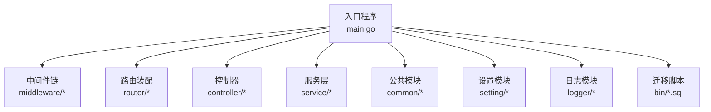
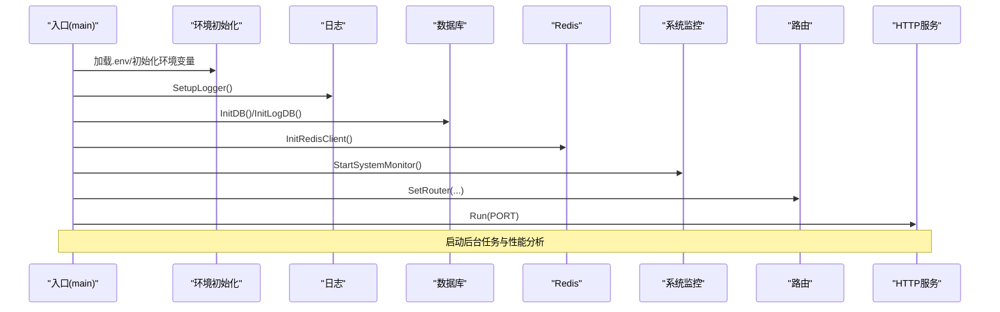
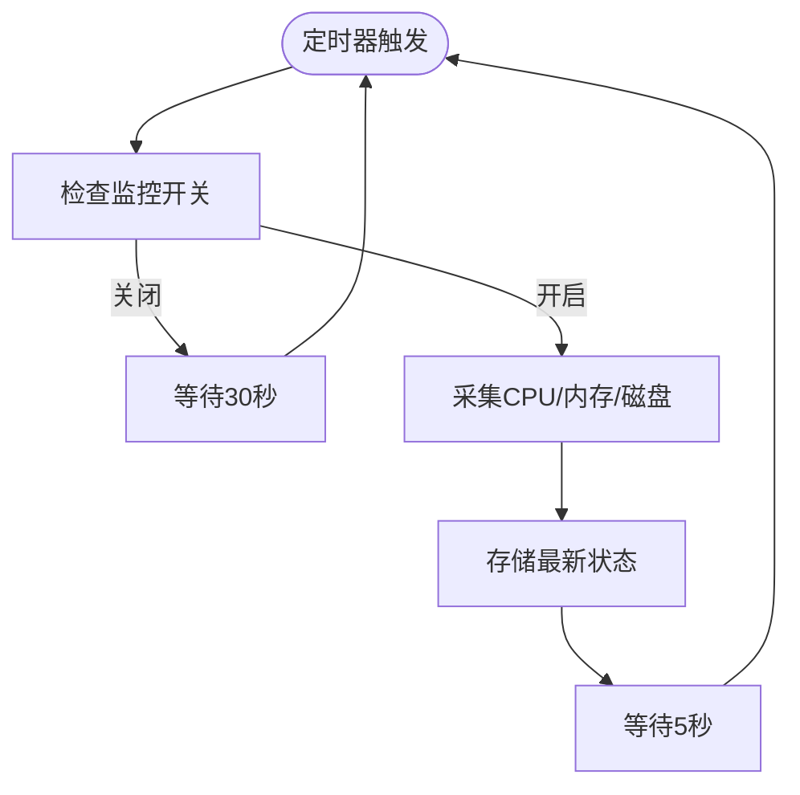
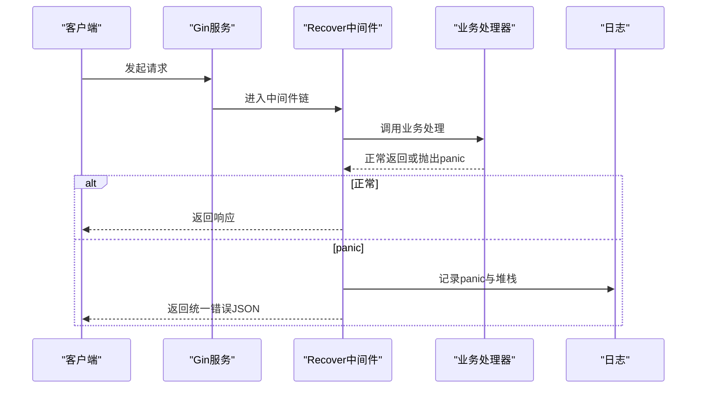
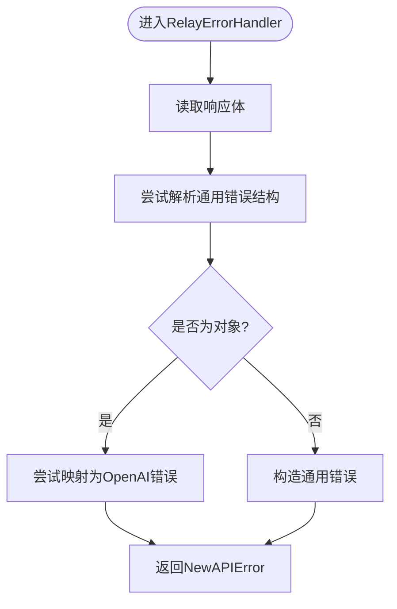
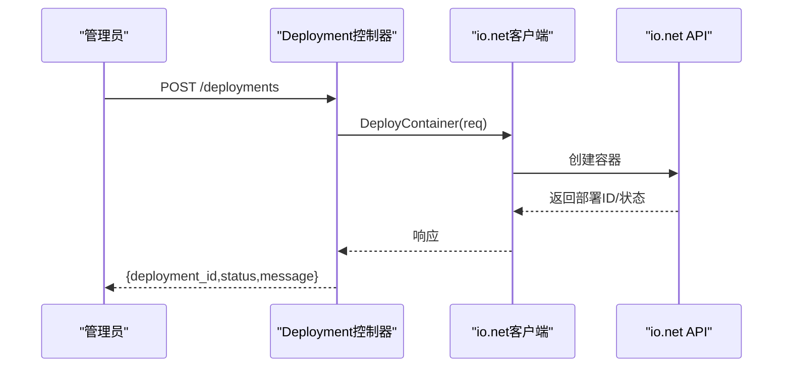
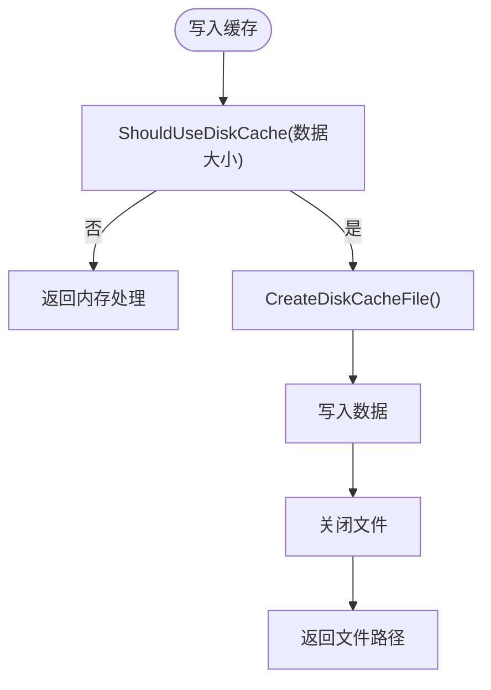
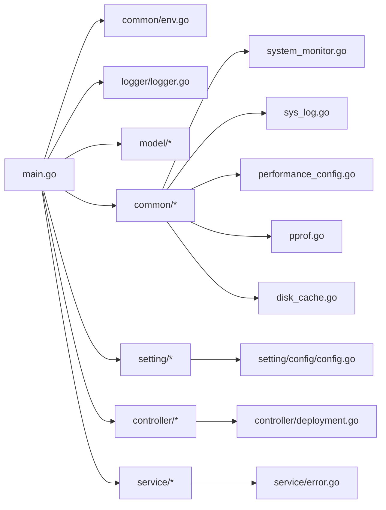

# 故障排除与维护

<cite>
**本文引用的文件**
- [main.go](file://main.go)
- [config.go](file://setting/config/config.go)
- [system_monitor.go](file://common/system_monitor.go)
- [sys_log.go](file://common/sys_log.go)
- [performance_config.go](file://common/performance_config.go)
- [pprof.go](file://common/pprof.go)
- [logger.go](file://logger/logger.go)
- [recover.go](file://middleware/recover.go)
- [error.go](file://service/error.go)
- [migration_v0.2-v0.3.sql](file://bin/migration_v0.2-v0.3.sql)
- [migration_v0.3-v0.4.sql](file://bin/migration_v0.3-v0.4.sql)
- [deployment.go](file://controller/deployment.go)
- [disk_cache.go](file://common/disk_cache.go)
- [env.go](file://common/env.go)
- [database.go](file://common/database.go)
</cite>

## 目录
1. [简介](#简介)
2. [项目结构](#项目结构)
3. [核心组件](#核心组件)
4. [架构总览](#架构总览)
5. [详细组件分析](#详细组件分析)
6. [依赖分析](#依赖分析)
7. [性能考虑](#性能考虑)
8. [故障排查指南](#故障排查指南)
9. [结论](#结论)
10. [附录](#附录)

## 简介
本指南面向运维与开发人员，围绕 New API 项目的部署、性能、配置、监控、日志、错误处理、数据库迁移、备份与升级等主题，提供系统化的故障排除与维护方法。内容覆盖常见问题定位、诊断流程、指标解读、优化建议与回滚策略，帮助快速恢复服务稳定。

## 项目结构
项目采用分层架构：入口程序负责资源初始化与路由装配；中间件提供统一日志、国际化、请求追踪与异常恢复；控制器处理业务路由；服务层封装上游适配与错误包装；公共模块提供系统监控、日志、缓存、环境变量解析与数据库类型常量；设置模块提供配置管理与热更新能力；迁移脚本用于数据库演进。



图表来源
- [main.go:43-199](file://main.go#L43-L199)

章节来源
- [main.go:43-199](file://main.go#L43-L199)

## 核心组件
- 入口与生命周期
  - 资源初始化：加载 .env、初始化日志、数据库、Redis、i18n、OAuth 提供商、系统监控等。
  - HTTP 服务器：Gin 中间件栈、路由注册、端口监听。
  - 后台任务：通道缓存同步、选项同步、看板数据更新、通道自动测试、上游模型更新、订阅配额重置、Codex 凭证刷新等。
  - 性能分析：可选 pprof 与 CPU 使用率监控。
- 配置管理
  - ConfigManager 提供注册、导入导出、从数据库加载/保存配置的能力，支持复杂类型序列化与反序列化。
- 监控与日志
  - 系统监控：CPU、内存、磁盘使用率采集与存储。
  - 日志：统一写入 stdout/stderr 与文件，支持轮转与上下文请求 ID 关联。
  - 异常恢复：全局 panic 恢复中间件与自定义 Recover。
- 错误处理
  - 上游响应错误解析与包装，屏蔽敏感信息，支持状态码映射。
- 运维与部署
  - 模型部署对接 io.net，提供连接测试、硬件查询、部署 CRUD、日志拉取等接口。
  - 磁盘缓存：请求体/文件缓存、清理策略、可用性判断。
  - 环境变量解析：整数、布尔、字符串安全解析与默认值回退。

章节来源
- [main.go:242-316](file://main.go#L242-L316)
- [config.go:13-298](file://setting/config/config.go#L13-L298)
- [system_monitor.go:23-82](file://common/system_monitor.go#L23-L82)
- [logger.go:42-118](file://logger/logger.go#L42-L118)
- [recover.go:12-29](file://middleware/recover.go#L12-L29)
- [error.go:86-129](file://service/error.go#L86-L129)
- [deployment.go:58-118](file://controller/deployment.go#L58-L118)
- [disk_cache.go:23-177](file://common/disk_cache.go#L23-L177)
- [env.go:9-39](file://common/env.go#L9-L39)

## 架构总览
系统启动流程与关键控制流如下：



图表来源
- [main.go:242-316](file://main.go#L242-L316)

章节来源
- [main.go:43-199](file://main.go#L43-L199)

## 详细组件分析

### 配置管理（ConfigManager）
- 功能要点
  - 注册多个配置模块，统一导出/导入为扁平键值对。
  - 从数据库加载时按模块前缀匹配并反序列化到对应结构体字段。
  - 保存到数据库时将结构体序列化为字符串键值对。
  - 支持字符串、布尔、整数、浮点、指针、数组/映射/结构体等类型。
- 并发与一致性
  - 读写锁保护配置表，避免并发读写冲突。
- 使用场景
  - 控制台热更新配置、持久化配置到 options 表。

```mermaid
classDiagram
class ConfigManager {
-configs map[string]interface{}
-mutex RWMutex
+Register(name, config)
+Get(name) interface{}
+LoadFromDB(options) error
+SaveToDB(updateFunc) error
+ExportAllConfigs() map[string]string
}
```

图表来源
- [config.go:13-298](file://setting/config/config.go#L13-L298)

章节来源
- [config.go:13-298](file://setting/config/config.go#L13-L298)

### 系统监控与性能阈值
- 系统状态采集
  - 周期性采集 CPU、内存、磁盘使用率，存储于原子变量，供外部读取。
- 性能监控配置
  - 默认启用，CPU/Memory/Disk 阈值均为 90%，可通过配置调整。
- pprof 自动采样
  - 当 CPU 使用率超过阈值时，自动写入 CPU Profile 文件，便于性能分析。



图表来源
- [system_monitor.go:36-76](file://common/system_monitor.go#L36-L76)

章节来源
- [system_monitor.go:23-82](file://common/system_monitor.go#L23-L82)
- [performance_config.go:5-34](file://common/performance_config.go#L5-L34)
- [pprof.go:12-46](file://common/pprof.go#L12-L46)

### 日志系统与错误恢复
- 日志
  - 统一写入 stdout/stderr，并可选写入文件；支持按日轮转与并发安全切换 writer。
  - 支持 INFO/WARN/ERR/DEBUG 四级日志，DEBUG 仅在调试模式生效。
  - 日志包含级别、时间戳、请求 ID、消息，便于关联定位。
- 异常恢复
  - Gin 自定义 Recover 中间件捕获 panic 并返回统一错误结构，同时记录堆栈。
  - 专用 Recover 中间件记录堆栈并返回 JSON 错误。



图表来源
- [recover.go:12-29](file://middleware/recover.go#L12-L29)
- [logger.go:76-118](file://logger/logger.go#L76-L118)

章节来源
- [sys_log.go:17-62](file://common/sys_log.go#L17-L62)
- [logger.go:42-118](file://logger/logger.go#L42-L118)
- [recover.go:12-29](file://middleware/recover.go#L12-L29)

### 错误处理与上游适配
- 上游错误解析
  - 读取响应体，尝试解析为通用错误结构；若为对象则进一步映射为 OpenAI 风格错误。
  - 支持按需将响应体加入错误描述，便于排障。
- 敏感信息脱敏
  - 对包含 HTTP 相关关键词的错误进行敏感信息掩码，避免泄露。
- 状态码映射
  - 支持通过配置将特定状态码映射为其他状态码，便于兼容下游。



图表来源
- [error.go:86-129](file://service/error.go#L86-L129)

章节来源
- [error.go:86-129](file://service/error.go#L86-L129)

### 模型部署与运维接口（io.net）
- 能力概览
  - 连接测试、硬件查询、部署 CRUD、日志拉取、容器列表与详情、价格估算、名称可用性检查等。
- 关键流程
  - 测试连接：使用企业版客户端调用，返回可用 GPU 数量与硬件统计。
  - 部署创建：绑定请求体后调用部署接口，返回部署 ID 与状态。
  - 日志拉取：支持按级别、流、游标、时间范围与 follow 实时拉取。



图表来源
- [deployment.go:494-518](file://controller/deployment.go#L494-L518)

章节来源
- [deployment.go:58-118](file://controller/deployment.go#L58-L118)
- [deployment.go:206-241](file://controller/deployment.go#L206-L241)
- [deployment.go:646-704](file://controller/deployment.go#L646-L704)

### 磁盘缓存与容量管理
- 缓存策略
  - 统一缓存目录，支持请求体与文件两类缓存。
  - 写入后返回文件路径，读取/删除提供便捷方法。
  - 可按阈值与可用性判断决定是否使用磁盘缓存。
- 清理策略
  - 按最大存活时间扫描并删除过期文件，减少磁盘占用。
- 监控与告警
  - 结合系统监控与日志，观察磁盘使用率与缓存文件数量/大小。



图表来源
- [disk_cache.go:39-85](file://common/disk_cache.go#L39-L85)
- [disk_cache.go:106-138](file://common/disk_cache.go#L106-L138)

章节来源
- [disk_cache.go:23-177](file://common/disk_cache.go#L23-L177)

### 环境变量与数据库类型
- 环境变量解析
  - 提供整数、布尔、字符串的安全解析与默认值回退，解析失败时记录警告并使用默认值。
- 数据库类型常量
  - 定义 MySQL、SQLite、PostgreSQL 类型标识与默认日志 SQL 数据库类型（SQLite）。
  - 提供 SQLite 路径默认值。

章节来源
- [env.go:9-39](file://common/env.go#L9-L39)
- [database.go:3-16](file://common/database.go#L3-L16)

## 依赖分析
- 启动阶段依赖
  - main 调用 common.InitEnv、logger.SetupLogger、model.InitDB/InitLogDB、common.InitRedisClient、common.StartSystemMonitor、i18n.Init、oauth.LoadCustomProviders。
- 配置依赖
  - ConfigManager 依赖反射与 JSON 序列化，读写锁保证并发安全。
- 监控与日志
  - system_monitor 依赖 gopsutil；logger 依赖 gin 默认 writer 与文件句柄切换。
- 错误处理
  - service.error 依赖 dto/types 与 common 工具，屏蔽敏感信息并支持状态码映射。
- 运维接口
  - controller.deployment 依赖 pkg.ionet 客户端与 setting.operation_setting。



图表来源
- [main.go:242-316](file://main.go#L242-L316)
- [config.go:13-298](file://setting/config/config.go#L13-L298)
- [system_monitor.go:36-76](file://common/system_monitor.go#L36-L76)
- [logger.go:42-118](file://logger/logger.go#L42-L118)
- [error.go:86-129](file://service/error.go#L86-L129)
- [deployment.go:58-118](file://controller/deployment.go#L58-L118)
- [disk_cache.go:23-177](file://common/disk_cache.go#L23-L177)

章节来源
- [main.go:242-316](file://main.go#L242-L316)

## 性能考虑
- 监控与阈值
  - 默认监控开启，CPU/Memory/Disk 阈值 90%。可根据环境调低阈值以提前预警。
- pprof 自动采样
  - CPU 使用率过高时自动写入 CPU Profile 文件，便于定位热点。
- 日志与 IO
  - 日志写入文件时注意磁盘 IO 压力，建议在高负载环境降低 DEBUG 级别或限制日志轮转频率。
- 缓存策略
  - 对大体量响应体启用磁盘缓存可降低内存压力，但需关注磁盘空间与清理策略。
- 并发与池化
  - 后台任务使用 goroutine 池执行，避免瞬时并发过高导致资源争用。

章节来源
- [performance_config.go:5-34](file://common/performance_config.go#L5-L34)
- [pprof.go:12-46](file://common/pprof.go#L12-L46)
- [logger.go:42-118](file://logger/logger.go#L42-L118)
- [disk_cache.go:106-138](file://common/disk_cache.go#L106-L138)

## 故障排查指南

### 1. 启动失败
- 症状
  - 启动即退出或端口占用。
- 排查步骤
  - 检查 .env 是否存在且变量正确；查看初始化日志输出。
  - 确认数据库初始化成功（InitDB/InitLogDB），Redis 连接正常。
  - 端口冲突：修改 PORT 或释放占用端口。
- 相关代码路径
  - [main.go:242-316](file://main.go#L242-L316)
  - [main.go:195-198](file://main.go#L195-L198)

章节来源
- [main.go:242-316](file://main.go#L242-L316)
- [main.go:195-198](file://main.go#L195-L198)

### 2. 数据库相关问题
- 症状
  - 初始化失败、迁移后数据不一致。
- 排查步骤
  - 查看数据库类型与路径配置，确认 SQLite/MySQL/PostgreSQL 驱动可用。
  - 执行迁移脚本，核对目标版本与实际版本。
- 相关代码路径
  - [database.go:3-16](file://common/database.go#L3-L16)
  - [migration_v0.2-v0.3.sql:1-7](file://bin/migration_v0.2-v0.3.sql#L1-L7)
  - [migration_v0.3-v0.4.sql:1-18](file://bin/migration_v0.3-v0.4.sql#L1-L18)

章节来源
- [database.go:3-16](file://common/database.go#L3-L16)
- [migration_v0.2-v0.3.sql:1-7](file://bin/migration_v0.2-v0.3.sql#L1-L7)
- [migration_v0.3-v0.4.sql:1-18](file://bin/migration_v0.3-v0.4.sql#L1-L18)

### 3. 配置热更新异常
- 症状
  - 控制台修改配置后未生效。
- 排查步骤
  - 确认配置模块已注册，键前缀与模块名一致。
  - 检查 LoadFromDB/SaveToDB 调用链，确认序列化/反序列化过程未报错。
- 相关代码路径
  - [config.go:42-90](file://setting/config/config.go#L42-L90)

章节来源
- [config.go:42-90](file://setting/config/config.go#L42-L90)

### 4. 上游错误与状态码异常
- 症状
  - 返回错误信息含敏感 URL 或状态码不符合预期。
- 排查步骤
  - 使用 RelayErrorHandler 解析响应体，确认是否为通用错误对象。
  - 检查状态码映射配置，必要时调整映射规则。
  - 对包含 HTTP 关键词的错误进行敏感信息脱敏。
- 相关代码路径
  - [error.go:86-129](file://service/error.go#L86-L129)
  - [error.go:131-154](file://service/error.go#L131-L154)
  - [error.go:194-198](file://service/error.go#L194-L198)

章节来源
- [error.go:86-129](file://service/error.go#L86-L129)
- [error.go:131-154](file://service/error.go#L131-L154)
- [error.go:194-198](file://service/error.go#L194-L198)

### 5. 模型部署（io.net）问题
- 症状
  - 连接测试失败、部署创建报错、日志拉取为空。
- 排查步骤
  - 校验 API Key 与企业版客户端配置。
  - 使用 TestIoNetConnection 校验连通性与可用 GPU 数。
  - 检查部署状态与容器事件，定位失败原因。
- 相关代码路径
  - [deployment.go:58-118](file://controller/deployment.go#L58-L118)
  - [deployment.go:494-518](file://controller/deployment.go#L494-L518)
  - [deployment.go:646-704](file://controller/deployment.go#L646-L704)

章节来源
- [deployment.go:58-118](file://controller/deployment.go#L58-L118)
- [deployment.go:494-518](file://controller/deployment.go#L494-L518)
- [deployment.go:646-704](file://controller/deployment.go#L646-L704)

### 6. 性能与资源瓶颈
- 症状
  - CPU/内存/磁盘使用率持续偏高。
- 排查步骤
  - 开启 pprof 并观察自动采样文件生成。
  - 调整性能监控阈值，结合系统监控数据定位热点。
  - 评估磁盘缓存策略与清理周期。
- 相关代码路径
  - [pprof.go:12-46](file://common/pprof.go#L12-L46)
  - [system_monitor.go:36-76](file://common/system_monitor.go#L36-L76)
  - [performance_config.go:5-34](file://common/performance_config.go#L5-L34)
  - [disk_cache.go:106-138](file://common/disk_cache.go#L106-L138)

章节来源
- [pprof.go:12-46](file://common/pprof.go#L12-L46)
- [system_monitor.go:36-76](file://common/system_monitor.go#L36-L76)
- [performance_config.go:5-34](file://common/performance_config.go#L5-L34)
- [disk_cache.go:106-138](file://common/disk_cache.go#L106-L138)

### 7. 日志与诊断
- 症状
  - 无法定位请求来源或错误上下文。
- 排查步骤
  - 确认日志写入文件路径与轮转逻辑正常。
  - 使用请求 ID 关联日志行，结合 panic 堆栈定位问题。
- 相关代码路径
  - [logger.go:42-118](file://logger/logger.go#L42-L118)
  - [sys_log.go:17-62](file://common/sys_log.go#L17-L62)
  - [recover.go:12-29](file://middleware/recover.go#L12-L29)

章节来源
- [logger.go:42-118](file://logger/logger.go#L42-L118)
- [sys_log.go:17-62](file://common/sys_log.go#L17-L62)
- [recover.go:12-29](file://middleware/recover.go#L12-L29)

## 结论
通过完善的启动流程、配置热更新、系统监控、日志与错误处理机制，以及运维接口与磁盘缓存策略，New API 项目具备较强的稳定性与可维护性。建议在生产环境中：
- 明确性能阈值与告警策略；
- 规范日志级别与轮转；
- 定期执行数据库迁移与备份；
- 在升级前做好回滚准备与验证。

## 附录

### A. 常见部署问题与解决方案
- 端口占用
  - 现象：启动失败，提示端口被占用。
  - 处理：修改 PORT 或释放占用端口。
  - 参考路径：[main.go:187-190](file://main.go#L187-L190)
- 数据库初始化失败
  - 现象：InitDB/InitLogDB 报错。
  - 处理：检查数据库类型、连接参数与权限，确认驱动可用。
  - 参考路径：[main.go:264-286](file://main.go#L264-L286)，[database.go:3-16](file://common/database.go#L3-L16)
- Redis 连接失败
  - 现象：InitRedisClient 报错。
  - 处理：检查 Redis 地址、认证与网络连通性。
  - 参考路径：[main.go:288-292](file://main.go#L288-L292)

章节来源
- [main.go:187-190](file://main.go#L187-L190)
- [main.go:264-286](file://main.go#L264-L286)
- [main.go:288-292](file://main.go#L288-L292)
- [database.go:3-16](file://common/database.go#L3-L16)

### B. 性能问题与优化建议
- CPU 使用率高
  - 现象：pprof 自动采样频繁。
  - 处理：分析采样文件，定位热点函数；优化算法或引入缓存。
  - 参考路径：[pprof.go:12-46](file://common/pprof.go#L12-L46)
- 内存/磁盘压力大
  - 现象：内存使用上升、磁盘空间不足。
  - 处理：降低日志级别、缩短磁盘缓存保留时间、清理过期缓存。
  - 参考路径：[logger.go:42-118](file://logger/logger.go#L42-L118)，[disk_cache.go:106-138](file://common/disk_cache.go#L106-L138)

章节来源
- [pprof.go:12-46](file://common/pprof.go#L12-L46)
- [logger.go:42-118](file://logger/logger.go#L42-L118)
- [disk_cache.go:106-138](file://common/disk_cache.go#L106-L138)

### C. 配置问题与热更新
- 现象：修改配置后未生效。
- 处理：确认模块注册、键前缀与序列化/反序列化流程。
- 参考路径：[config.go:42-90](file://setting/config/config.go#L42-L90)

章节来源
- [config.go:42-90](file://setting/config/config.go#L42-L90)

### D. 数据备份策略
- 数据库备份
  - SQLite：直接复制数据库文件。
  - MySQL/PostgreSQL：使用官方工具进行逻辑/物理备份。
- 日志与缓存
  - 备份日志目录与磁盘缓存目录，定期清理过期文件。
- 参考路径
  - [database.go:3-16](file://common/database.go#L3-L16)
  - [logger.go:42-74](file://logger/logger.go#L42-L74)
  - [disk_cache.go:106-138](file://common/disk_cache.go#L106-L138)

章节来源
- [database.go:3-16](file://common/database.go#L3-L16)
- [logger.go:42-74](file://logger/logger.go#L42-L74)
- [disk_cache.go:106-138](file://common/disk_cache.go#L106-L138)

### E. 系统升级与回滚
- 升级流程
  - 备份数据库与日志/缓存目录。
  - 应用迁移脚本至目标版本。
  - 重启服务并验证功能。
- 回滚策略
  - 停机回滚至备份版本，恢复数据库与配置。
  - 如需数据库回滚，使用对应版本的迁移脚本逆向执行。
- 参考路径
  - [migration_v0.2-v0.3.sql:1-7](file://bin/migration_v0.2-v0.3.sql#L1-L7)
  - [migration_v0.3-v0.4.sql:1-18](file://bin/migration_v0.3-v0.4.sql#L1-L18)

章节来源
- [migration_v0.2-v0.3.sql:1-7](file://bin/migration_v0.2-v0.3.sql#L1-L7)
- [migration_v0.3-v0.4.sql:1-18](file://bin/migration_v0.3-v0.4.sql#L1-L18)

### F. 维护最佳实践
- 监控与告警
  - 设定合理的 CPU/Memory/Disk 阈值，结合 pprof 与系统监控。
- 日志管理
  - 生产环境避免 DEBUG 级别，按天轮转并保留合理期限。
- 缓存与 IO
  - 合理设置磁盘缓存阈值与清理周期，避免磁盘爆满。
- 配置治理
  - 统一前缀命名，定期审计配置项，避免冗余。
- 参考路径
  - [performance_config.go:5-34](file://common/performance_config.go#L5-L34)
  - [logger.go:42-118](file://logger/logger.go#L42-L118)
  - [disk_cache.go:106-138](file://common/disk_cache.go#L106-L138)
  - [config.go:278-297](file://setting/config/config.go#L278-L297)

章节来源
- [performance_config.go:5-34](file://common/performance_config.go#L5-L34)
- [logger.go:42-118](file://logger/logger.go#L42-L118)
- [disk_cache.go:106-138](file://common/disk_cache.go#L106-L138)
- [config.go:278-297](file://setting/config/config.go#L278-L297)