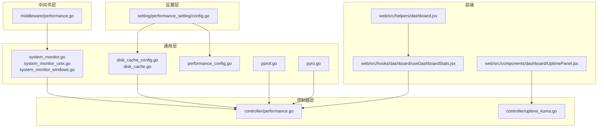
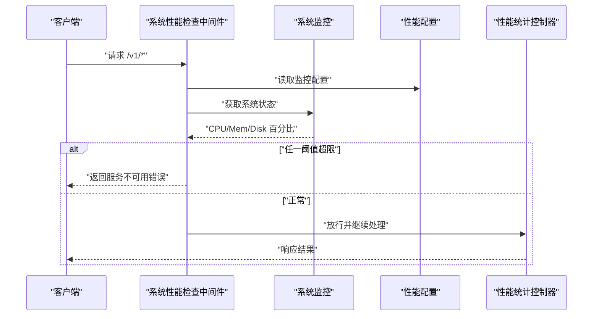
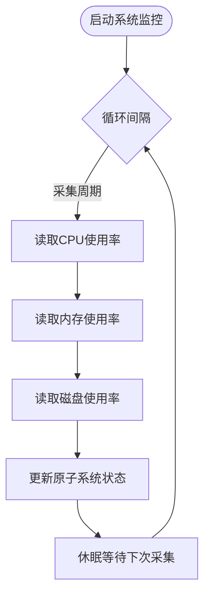
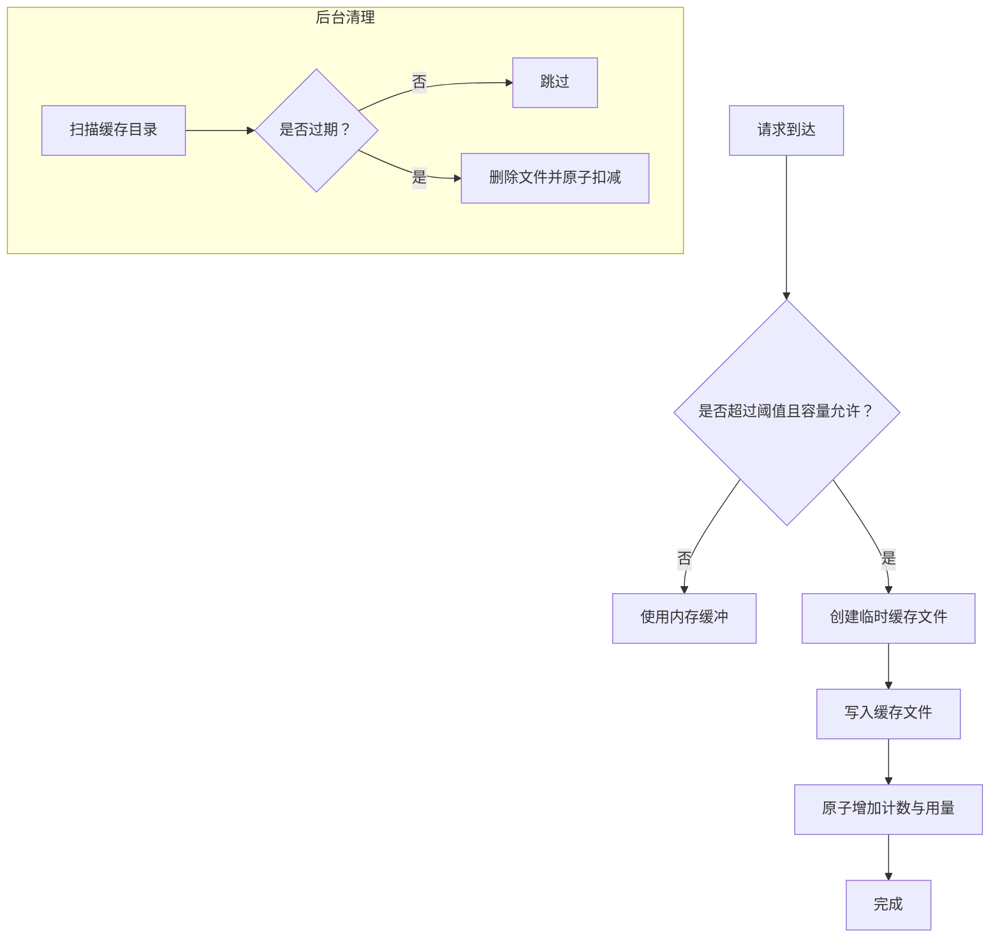
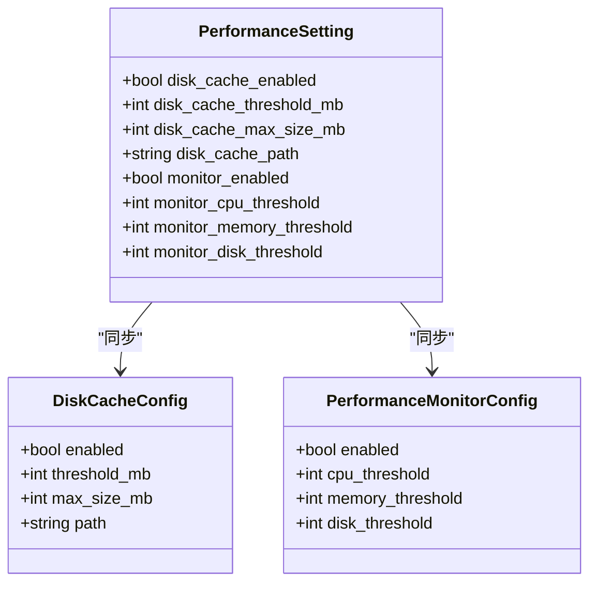
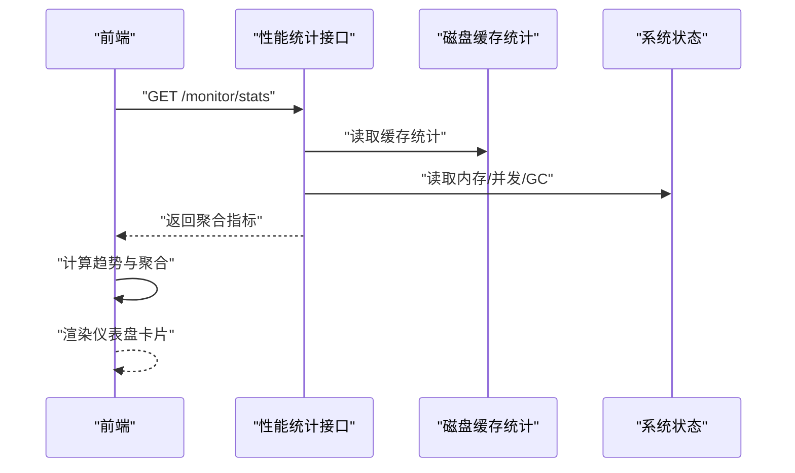
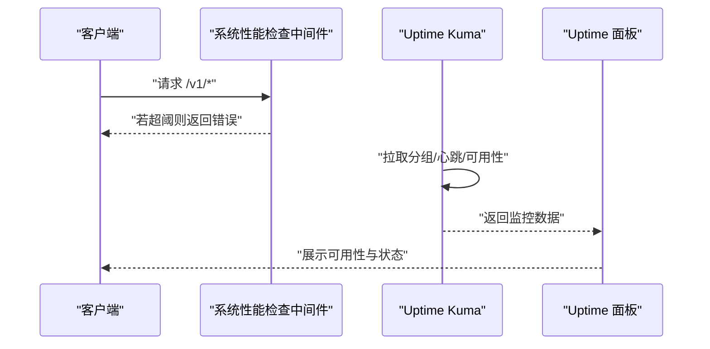
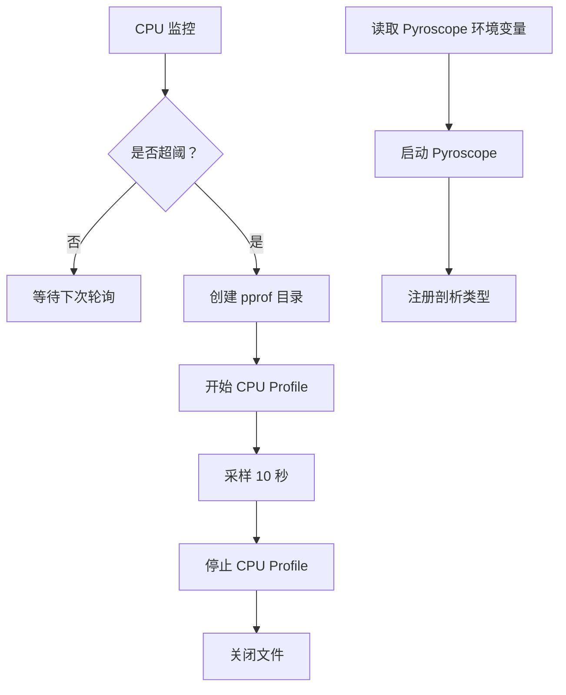
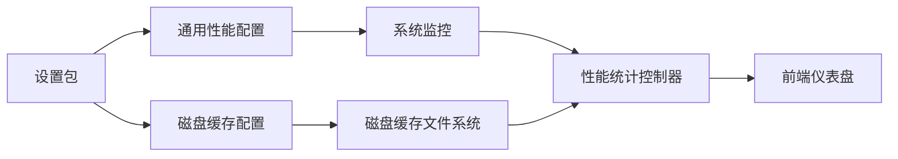

# 性能监控

<cite>
**本文引用的文件**
- [performance_config.go](file://common/performance_config.go)
- [system_monitor.go](file://common/system_monitor.go)
- [system_monitor_unix.go](file://common/system_monitor_unix.go)
- [system_monitor_windows.go](file://common/system_monitor_windows.go)
- [disk_cache_config.go](file://common/disk_cache_config.go)
- [disk_cache.go](file://common/disk_cache.go)
- [pprof.go](file://common/pprof.go)
- [pyro.go](file://common/pyro.go)
- [performance.go](file://controller/performance.go)
- [performance.go（中间件）](file://middleware/performance.go)
- [config.go（性能设置）](file://setting/performance_setting/config.go)
- [performance.go（控制器）](file://controller/performance.go)
- [useDashboardStats.jsx](file://web/src/hooks/dashboard/useDashboardStats.jsx)
- [dashboard.jsx](file://web/src/helpers/dashboard.jsx)
- [uptime_kuma.go](file://controller/uptime_kuma.go)
- [UptimePanel.jsx](file://web/src/components/dashboard/UptimePanel.jsx)
</cite>

## 目录
1. [简介](#简介)
2. [项目结构](#项目结构)
3. [核心组件](#核心组件)
4. [架构总览](#架构总览)
5. [组件详解](#组件详解)
6. [依赖关系分析](#依赖关系分析)
7. [性能考量](#性能考量)
8. [故障排查指南](#故障排查指南)
9. [结论](#结论)
10. [附录](#附录)

## 简介
本技术文档面向 New API 的性能监控体系，覆盖系统资源监控、业务指标统计、性能配置、实时分析、pprof 性能剖析、健康检查与瓶颈识别，并提供分布式监控、指标聚合与可视化展示的实践建议。目标是帮助开发者与运维人员有效掌握系统运行状态，快速定位性能问题并实施优化。

## 项目结构
围绕性能监控的关键模块分布如下：
- 通用层（common）：系统监控、磁盘缓存、性能配置、pprof、Pyroscope 集成
- 控制器层（controller）：性能统计接口、日志与磁盘缓存清理、强制 GC、健康检查
- 中间件层（middleware）：系统性能检查中间件
- 设置层（setting）：性能相关配置项与同步逻辑
- 前端（web）：仪表盘指标聚合与趋势计算、Uptime Kuma 可用性面板

图表来源
- [system_monitor.go:36-81](file://common/system_monitor.go#L36-L81)
- [disk_cache_config.go:29-106](file://common/disk_cache_config.go#L29-L106)
- [performance_config.go:25-33](file://common/performance_config.go#L25-L33)
- [pprof.go:12-45](file://common/pprof.go#L12-L45)
- [pyro.go:9-55](file://common/pyro.go#L9-L55)
- [performance.go（控制器）:82-140](file://controller/performance.go#L82-L140)
- [performance.go（中间件）:13-71](file://middleware/performance.go#L13-L71)
- [config.go（性能设置）:42-64](file://setting/performance_setting/config.go#L42-L64)
- [useDashboardStats.jsx:81-153](file://web/src/hooks/dashboard/useDashboardStats.jsx#L81-L153)
- [dashboard.jsx:281-329](file://web/src/helpers/dashboard.jsx#L281-L329)
- [uptime_kuma.go:131-155](file://controller/uptime_kuma.go#L131-L155)
- [UptimePanel.jsx:37-152](file://web/src/components/dashboard/UptimePanel.jsx#L37-L152)

章节来源
- [system_monitor.go:36-81](file://common/system_monitor.go#L36-L81)
- [disk_cache_config.go:29-106](file://common/disk_cache_config.go#L29-L106)
- [performance_config.go:25-33](file://common/performance_config.go#L25-L33)
- [pprof.go:12-45](file://common/pprof.go#L12-L45)
- [pyro.go:9-55](file://common/pyro.go#L9-L55)
- [performance.go（控制器）:82-140](file://controller/performance.go#L82-L140)
- [performance.go（中间件）:13-71](file://middleware/performance.go#L13-L71)
- [config.go（性能设置）:42-64](file://setting/performance_setting/config.go#L42-L64)
- [useDashboardStats.jsx:81-153](file://web/src/hooks/dashboard/useDashboardStats.jsx#L81-L153)
- [dashboard.jsx:281-329](file://web/src/helpers/dashboard.jsx#L281-L329)
- [uptime_kuma.go:131-155](file://controller/uptime_kuma.go#L131-L155)
- [UptimePanel.jsx:37-152](file://web/src/components/dashboard/UptimePanel.jsx#L37-L152)

## 核心组件
- 系统监控与阈值控制：定时采集 CPU/内存/磁盘使用率，支持阈值告警与中间件拦截
- 磁盘缓存与统计：按阈值与容量策略写入/清理磁盘缓存，提供命中与用量统计
- 性能配置：集中化配置磁盘缓存与监控阈值，支持运行时热更新
- 实时性能分析：控制器提供性能统计接口；前端进行趋势与聚合计算
- 健康检查与告警：中间件基于系统状态拦截高负载请求；Uptime Kuma 面板展示可用性
- 剖析工具：pprof 自动采样；Pyroscope 远程上报

章节来源
- [system_monitor.go:36-81](file://common/system_monitor.go#L36-L81)
- [disk_cache_config.go:71-106](file://common/disk_cache_config.go#L71-L106)
- [performance_config.go:25-33](file://common/performance_config.go#L25-L33)
- [performance.go（控制器）:82-140](file://controller/performance.go#L82-L140)
- [performance.go（中间件）:13-71](file://middleware/performance.go#L13-L71)
- [config.go（性能设置）:42-64](file://setting/performance_setting/config.go#L42-L64)
- [useDashboardStats.jsx:81-153](file://web/src/hooks/dashboard/useDashboardStats.jsx#L81-L153)
- [dashboard.jsx:281-329](file://web/src/helpers/dashboard.jsx#L281-L329)
- [uptime_kuma.go:131-155](file://controller/uptime_kuma.go#L131-L155)

## 架构总览
New API 的性能监控采用“配置驱动 + 采集-统计-暴露-消费”的闭环设计：
- 配置层：性能设置与磁盘缓存配置通过设置包注册并同步至通用层
- 采集层：系统监控定时采集资源使用率；磁盘缓存写入/清理触发统计变更
- 统计层：控制器聚合内存、磁盘缓存、配置等指标，提供管理接口
- 消费层：前端仪表盘进行趋势与聚合展示；Uptime Kuma 展示外部可用性
- 剖析层：pprof 自动采样；Pyroscope 远程上报

图表来源
- [performance.go（中间件）:13-71](file://middleware/performance.go#L13-L71)
- [system_monitor.go:78-81](file://common/system_monitor.go#L78-L81)
- [performance_config.go:25-33](file://common/performance_config.go#L25-L33)
- [performance.go（控制器）:82-140](file://controller/performance.go#L82-L140)

## 组件详解

### 系统监控与阈值控制
- 定时采集：后台协程周期性读取 CPU/内存/磁盘使用率，存储于原子变量供查询
- 阈值检查：中间件在请求进入时读取配置与最新系统状态，若任一指标超阈则拒绝请求并返回服务不可用
- 平台适配：Unix/Linux/macOS 使用 Statfs，Windows 使用 GetDiskFreeSpaceEx

图表来源
- [system_monitor.go:36-81](file://common/system_monitor.go#L36-L81)
- [system_monitor_unix.go:11-37](file://common/system_monitor_unix.go#L11-L37)
- [system_monitor_windows.go:11-50](file://common/system_monitor_windows.go#L11-L50)

章节来源
- [system_monitor.go:36-81](file://common/system_monitor.go#L36-L81)
- [system_monitor_unix.go:11-37](file://common/system_monitor_unix.go#L11-L37)
- [system_monitor_windows.go:11-50](file://common/system_monitor_windows.go#L11-L50)
- [performance.go（中间件）:13-71](file://middleware/performance.go#L13-L71)

### 磁盘缓存与统计
- 缓存策略：根据阈值与最大容量决定是否启用磁盘缓存；写入成功后原子性增加计数与用量
- 清理策略：按文件最后修改时间清理过期缓存文件，同时原子性减少计数与用量
- 统计接口：提供当前活跃文件数、总用量、命中次数、阈值与上限等指标

图表来源
- [disk_cache.go:166-177](file://common/disk_cache.go#L166-L177)
- [disk_cache.go:106-138](file://common/disk_cache.go#L106-L138)
- [disk_cache_config.go:71-106](file://common/disk_cache_config.go#L71-L106)

章节来源
- [disk_cache.go:166-177](file://common/disk_cache.go#L166-L177)
- [disk_cache.go:106-138](file://common/disk_cache.go#L106-L138)
- [disk_cache_config.go:71-106](file://common/disk_cache_config.go#L71-L106)

### 性能配置与同步
- 配置项：磁盘缓存开关、阈值、最大容量、路径；监控开关与 CPU/内存/磁盘阈值
- 同步机制：设置包初始化时注册并同步到通用层；通用层提供读写接口
- 热更新：通过设置更新后同步至通用层，立即生效

图表来源
- [config.go（性能设置）:8-27](file://setting/performance_setting/config.go#L8-L27)
- [config.go（性能设置）:49-64](file://setting/performance_setting/config.go#L49-L64)
- [performance_config.go:5-11](file://common/performance_config.go#L5-L11)
- [disk_cache_config.go:8-18](file://common/disk_cache_config.go#L8-L18)

章节来源
- [config.go（性能设置）:42-64](file://setting/performance_setting/config.go#L42-L64)
- [performance_config.go:25-33](file://common/performance_config.go#L25-L33)
- [disk_cache_config.go:29-41](file://common/disk_cache_config.go#L29-L41)

### 实时性能分析与指标聚合
- 控制器接口：提供内存、磁盘缓存、配置等聚合指标；支持清理不活跃缓存、重置统计、强制 GC
- 前端趋势：对时间序列进行聚合与趋势计算，生成 RPM/TPM 等指标
- 仪表盘：按组组织统计卡片，包含次数、额度、Tokens、平均 RPM/TPM 等

图表来源
- [performance.go（控制器）:82-140](file://controller/performance.go#L82-L140)
- [useDashboardStats.jsx:81-153](file://web/src/hooks/dashboard/useDashboardStats.jsx#L81-L153)
- [dashboard.jsx:281-329](file://web/src/helpers/dashboard.jsx#L281-L329)

章节来源
- [performance.go（控制器）:82-140](file://controller/performance.go#L82-L140)
- [useDashboardStats.jsx:81-153](file://web/src/hooks/dashboard/useDashboardStats.jsx#L81-L153)
- [dashboard.jsx:281-329](file://web/src/helpers/dashboard.jsx#L281-L329)

### 健康检查与可用性面板
- 中间件拦截：在高负载场景拒绝新请求，避免雪崩
- 外部可用性：通过 Uptime Kuma 拉取分组与监控状态，前端以标签页展示

图表来源
- [performance.go（中间件）:13-71](file://middleware/performance.go#L13-L71)
- [uptime_kuma.go:131-155](file://controller/uptime_kuma.go#L131-L155)
- [UptimePanel.jsx:37-152](file://web/src/components/dashboard/UptimePanel.jsx#L37-L152)

章节来源
- [performance.go（中间件）:13-71](file://middleware/performance.go#L13-L71)
- [uptime_kuma.go:131-155](file://controller/uptime_kuma.go#L131-L155)
- [UptimePanel.jsx:37-152](file://web/src/components/dashboard/UptimePanel.jsx#L37-L152)

### pprof 性能剖析与 Pyroscope 集成
- pprof：当 CPU 使用率持续高于阈值时，自动创建 CPU Profile 文件，便于离线分析
- Pyroscope：通过环境变量启用远程剖析，上报 CPU/Goroutines/阻塞/互斥等多维指标

图表来源
- [pprof.go:12-45](file://common/pprof.go#L12-L45)
- [pyro.go:9-55](file://common/pyro.go#L9-L55)

章节来源
- [pprof.go:12-45](file://common/pprof.go#L12-L45)
- [pyro.go:9-55](file://common/pyro.go#L9-L55)

## 依赖关系分析
- 配置依赖：设置包依赖通用层配置接口，实现集中化配置与同步
- 采集依赖：系统监控依赖 gopsutil 与平台 API；磁盘缓存依赖文件系统
- 控制器依赖：控制器聚合系统状态与缓存统计，暴露管理接口
- 前端依赖：前端通过钩子与辅助函数进行趋势与聚合计算

图表来源
- [config.go（性能设置）:42-64](file://setting/performance_setting/config.go#L42-L64)
- [performance_config.go:25-33](file://common/performance_config.go#L25-L33)
- [disk_cache_config.go:29-41](file://common/disk_cache_config.go#L29-L41)
- [system_monitor.go:36-81](file://common/system_monitor.go#L36-L81)
- [disk_cache.go:166-177](file://common/disk_cache.go#L166-L177)
- [performance.go（控制器）:82-140](file://controller/performance.go#L82-L140)

章节来源
- [config.go（性能设置）:42-64](file://setting/performance_setting/config.go#L42-L64)
- [performance_config.go:25-33](file://common/performance_config.go#L25-L33)
- [disk_cache_config.go:29-41](file://common/disk_cache_config.go#L29-L41)
- [system_monitor.go:36-81](file://common/system_monitor.go#L36-L81)
- [disk_cache.go:166-177](file://common/disk_cache.go#L166-L177)
- [performance.go（控制器）:82-140](file://controller/performance.go#L82-L140)

## 性能考量
- 低开销采集：系统监控以短周期轮询，避免频繁系统调用；磁盘缓存统计使用原子操作
- 按需清理：后台扫描过期文件，避免阻塞主流程；清理时仅按磁盘大小扣减，简化逻辑
- 中间件保护：在高负载场景拒绝新请求，防止级联故障
- 建议优化：
  - 将 CPU/内存/磁盘阈值参数化为环境变量，便于不同环境差异化配置
  - 在高 QPS 场景下，适当延长系统监控采集间隔，降低轮询成本
  - 对磁盘缓存清理任务增加并发扫描与批量删除，提升吞吐

[本节为通用指导，不直接分析具体文件]

## 故障排查指南
- 磁盘缓存异常
  - 症状：缓存命中率低、磁盘占用异常
  - 排查：检查阈值与最大容量配置；确认缓存目录权限；查看清理任务是否正常
  - 参考路径：[磁盘缓存统计:93-106](file://common/disk_cache_config.go#L93-L106)，[清理逻辑:106-138](file://common/disk_cache.go#L106-L138)
- 系统过载
  - 症状：中间件返回服务不可用
  - 排查：检查 CPU/内存/磁盘阈值；查看系统监控采集是否稳定
  - 参考路径：[中间件检查:13-71](file://middleware/performance.go#L13-L71)，[系统监控:36-81](file://common/system_monitor.go#L36-L81)
- 崩溃与卡顿
  - 症状：偶发卡顿或崩溃
  - 排查：启用 pprof 自动采样；结合 Pyroscope 远程剖析定位热点
  - 参考路径：[pprof 定时监控:12-45](file://common/pprof.go#L12-L45)，[Pyroscope 启动:9-55](file://common/pyro.go#L9-L55)
- 可用性异常
  - 症状：外部可用性下降
  - 排查：检查 Uptime Kuma 配置与网络连通性；核对分组与监控项
  - 参考路径：[Uptime Kuma 接口:131-155](file://controller/uptime_kuma.go#L131-L155)，[Uptime 面板:37-152](file://web/src/components/dashboard/UptimePanel.jsx#L37-L152)

章节来源
- [disk_cache_config.go:93-106](file://common/disk_cache_config.go#L93-L106)
- [disk_cache.go:106-138](file://common/disk_cache.go#L106-L138)
- [performance.go（中间件）:13-71](file://middleware/performance.go#L13-L71)
- [system_monitor.go:36-81](file://common/system_monitor.go#L36-L81)
- [pprof.go:12-45](file://common/pprof.go#L12-L45)
- [pyro.go:9-55](file://common/pyro.go#L9-L55)
- [uptime_kuma.go:131-155](file://controller/uptime_kuma.go#L131-L155)
- [UptimePanel.jsx:37-152](file://web/src/components/dashboard/UptimePanel.jsx#L37-L152)

## 结论
New API 的性能监控体系以配置为中心、以采集与统计为基础、以中间件保护与外部可用性面板为补充，辅以 pprof 与 Pyroscope 的剖析能力，形成从“感知—预警—定位—优化”的完整闭环。通过合理配置阈值与清理策略，可显著降低资源压力并提升稳定性。

[本节为总结，不直接分析具体文件]

## 附录

### 监控指标定义与含义
- 磁盘缓存指标
  - 活跃磁盘文件数：当前磁盘缓存文件数量
  - 当前磁盘缓存用量：字节
  - 内存缓冲数量/用量：同上
  - 磁盘/内存缓存命中次数：统计命中情况
  - 磁盘缓存阈值/上限：字节
- 系统资源指标
  - CPU 使用率：百分比
  - 内存使用率：百分比
  - 磁盘使用率：百分比
- 业务指标（前端聚合）
  - 平均 RPM（Requests Per Minute）
  - 平均 TPM（Tokens Per Minute）

章节来源
- [disk_cache_config.go:71-106](file://common/disk_cache_config.go#L71-L106)
- [system_monitor.go:23-28](file://common/system_monitor.go#L23-L28)
- [dashboard.jsx:296-329](file://web/src/helpers/dashboard.jsx#L296-L329)

### 告警规则配置建议
- CPU/内存/磁盘阈值：根据实例规格与历史峰值设定，建议留有 10%~20% 安全余量
- 磁盘缓存阈值：按请求体大小分布设定，避免过大导致 IO 压力
- 中间件拦截：在高负载阶段主动拒绝新请求，保护系统
- 外部可用性：结合 Uptime Kuma 的分组与监控项，设置合理的告警策略

[本节为通用建议，不直接分析具体文件]

### 性能优化策略
- 调整系统监控采集间隔，平衡精度与开销
- 优化磁盘缓存阈值与清理策略，减少碎片与 IO 抖动
- 启用 Pyroscope 远程剖析，定期巡检热点函数与 goroutine 泄漏
- 在前端仪表盘中增加更细粒度的时间窗口与聚合维度

[本节为通用建议，不直接分析具体文件]