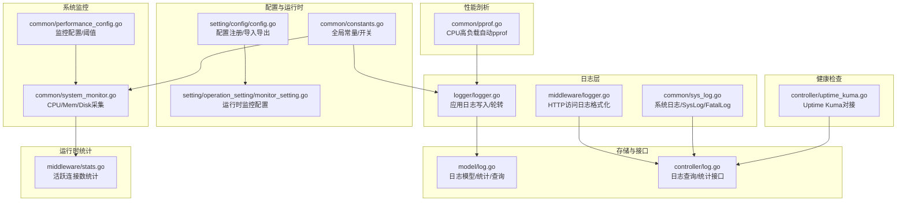
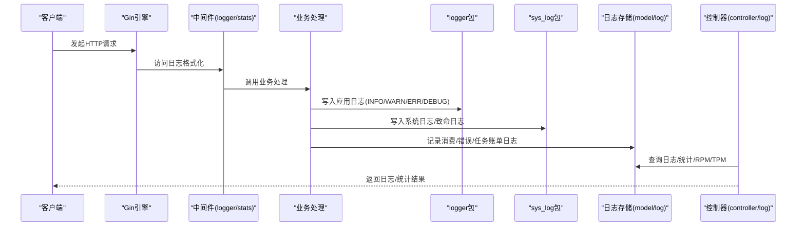
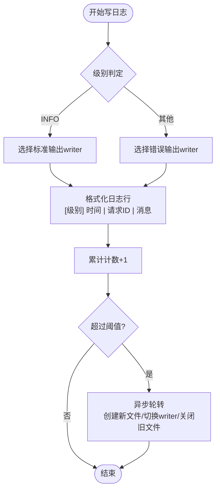
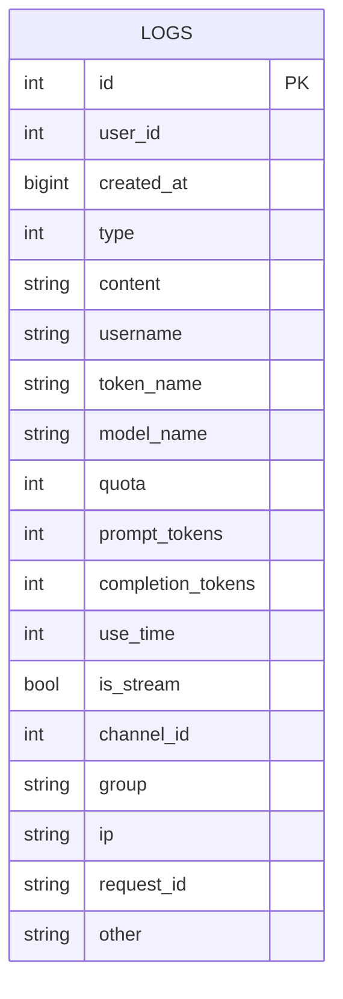
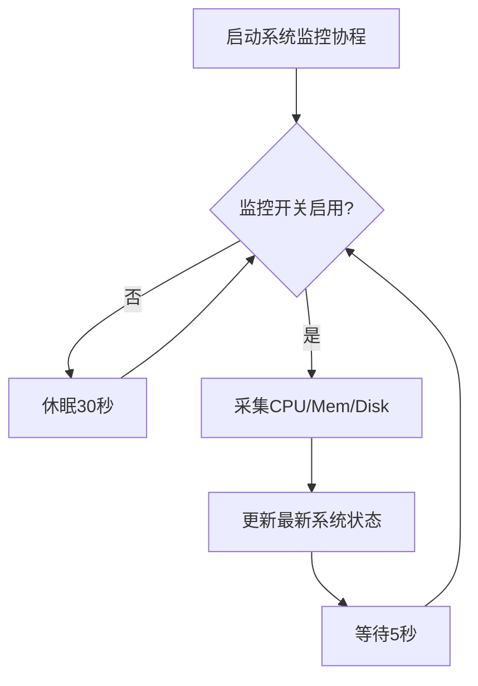
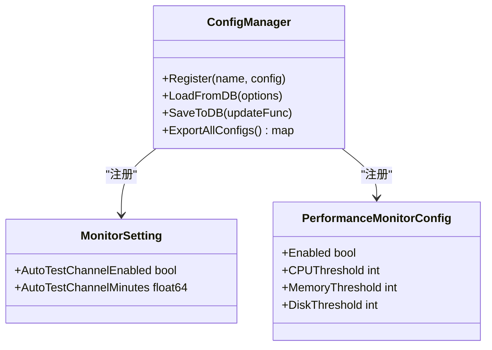
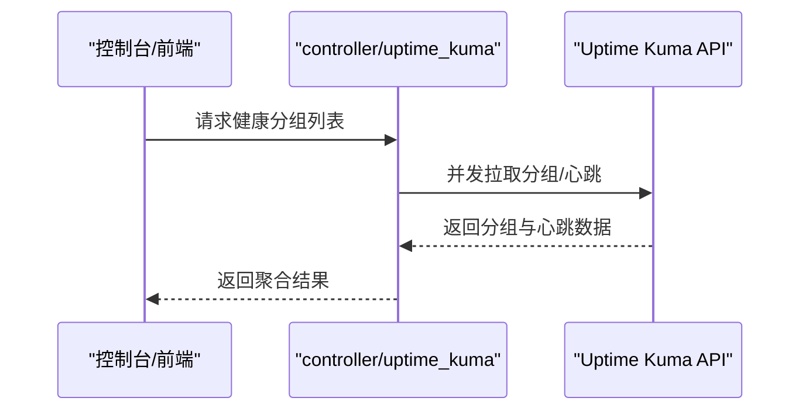
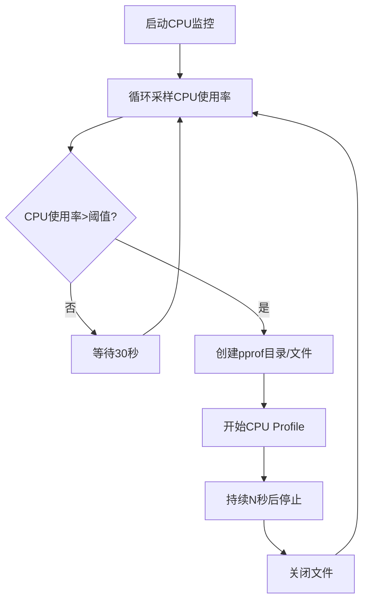
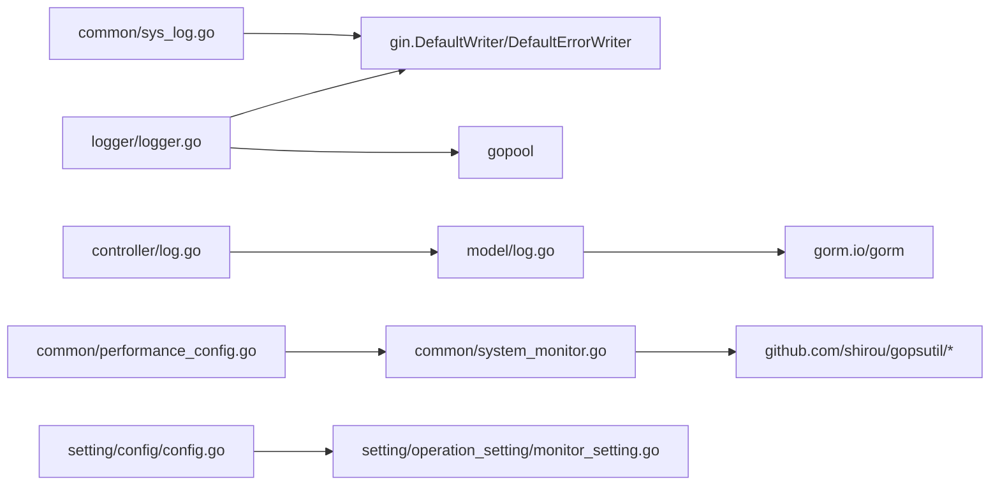

# 日志与监控

<cite>
**本文引用的文件**
- [logger.go](file://logger/logger.go)
- [sys_log.go](file://common/sys_log.go)
- [system_monitor.go](file://common/system_monitor.go)
- [performance_config.go](file://common/performance_config.go)
- [log.go](file://model/log.go)
- [log.go](file://controller/log.go)
- [logger.go](file://middleware/logger.go)
- [stats.go](file://middleware/stats.go)
- [pprof.go](file://common/pprof.go)
- [monitor_setting.go](file://setting/operation_setting/monitor_setting.go)
- [config.go](file://setting/config/config.go)
- [constants.go](file://common/constants.go)
- [uptime_kuma.go](file://controller/uptime_kuma.go)
</cite>

## 目录
1. [简介](#简介)
2. [项目结构](#项目结构)
3. [核心组件](#核心组件)
4. [架构总览](#架构总览)
5. [详细组件分析](#详细组件分析)
6. [依赖分析](#依赖分析)
7. [性能考虑](#性能考虑)
8. [故障排查指南](#故障排查指南)
9. [结论](#结论)
10. [附录](#附录)

## 简介
本文件面向运维与开发人员，系统性阐述 New API 的日志与监控体系，覆盖以下主题：
- 日志系统架构与日志级别管理
- 日志轮转与持久化策略
- 性能监控指标与业务指标采集
- 告警机制与集成方案
- 日志配置选项与监控数据可视化
- 分布式追踪、性能剖析与健康检查
- 运维最佳实践与可扩展建议

## 项目结构
围绕日志与监控的关键模块分布如下：
- 日志写入与轮转：logger 包负责应用日志写入、级别格式化与定时轮转；middleware/logger 提供 HTTP 访问日志格式化；common/sys_log 提供系统级日志与启动成功提示。
- 日志存储与检索：model/log 定义日志模型与统计聚合；controller/log 提供日志查询与统计接口。
- 系统监控：common/system_monitor 采集 CPU/Mem/Disk 使用率并周期性更新；common/performance_config 提供性能监控开关与阈值配置。
- 配置中心：setting/config/config 提供统一配置注册、导入导出与热更新能力；setting/operation_setting/monitor_setting 提供监控相关运行时配置。
- 运行时统计：middleware/stats 提供活跃连接数等轻量指标。
- 性能剖析：common/pprof 在 CPU 使用率过高时自动输出 pprof 文件。
- 健康与外部监控：controller/uptime_kuma 对接 Uptime Kuma，拉取分组与心跳状态。

**图表来源**
- [logger.go:1-182](file://logger/logger.go#L1-L182)
- [logger.go:1-41](file://middleware/logger.go#L1-L41)
- [sys_log.go:1-63](file://common/sys_log.go#L1-L63)
- [log.go:1-482](file://model/log.go#L1-L482)
- [log.go:1-172](file://controller/log.go#L1-L172)
- [system_monitor.go:1-82](file://common/system_monitor.go#L1-L82)
- [performance_config.go:1-34](file://common/performance_config.go#L1-L34)
- [config.go:1-298](file://setting/config/config.go#L1-L298)
- [monitor_setting.go:1-36](file://setting/operation_setting/monitor_setting.go#L1-L36)
- [stats.go:1-42](file://middleware/stats.go#L1-L42)
- [pprof.go:1-46](file://common/pprof.go#L1-L46)
- [uptime_kuma.go:1-155](file://controller/uptime_kuma.go#L1-L155)

**章节来源**
- [logger.go:1-182](file://logger/logger.go#L1-L182)
- [logger.go:1-41](file://middleware/logger.go#L1-L41)
- [sys_log.go:1-63](file://common/sys_log.go#L1-L63)
- [log.go:1-482](file://model/log.go#L1-L482)
- [log.go:1-172](file://controller/log.go#L1-L172)
- [system_monitor.go:1-82](file://common/system_monitor.go#L1-L82)
- [performance_config.go:1-34](file://common/performance_config.go#L1-L34)
- [config.go:1-298](file://setting/config/config.go#L1-L298)
- [monitor_setting.go:1-36](file://setting/operation_setting/monitor_setting.go#L1-L36)
- [stats.go:1-42](file://middleware/stats.go#L1-L42)
- [pprof.go:1-46](file://common/pprof.go#L1-L46)
- [uptime_kuma.go:1-155](file://controller/uptime_kuma.go#L1-L155)

## 核心组件
- 应用日志与轮转
  - logger 包提供 INFO/WARN/ERR/DEBUG 级别写入，基于请求上下文携带请求 ID 输出；当累计日志条数达到阈值时触发异步轮转，新建带时间戳的日志文件并切换 writer。
  - middleware/logger 提供 Gin 访问日志格式化，包含时间、路由标签、请求 ID、状态码、耗时、客户端 IP、方法与路径。
  - common/sys_log 提供系统日志与致命日志输出，并在启动成功时打印本地与网络访问地址。
- 日志存储与查询
  - model/log 定义日志表结构与索引，支持按用户、模型、令牌、渠道、分组、时间段、请求 ID 等维度查询与统计；提供消费额度、RPM、TPM 统计。
  - controller/log 提供全量/用户日志查询、统计接口以及历史日志清理。
- 系统监控与性能配置
  - system_monitor 通过 gopsutil 采集 CPU/Mem/Disk 使用率，周期性更新最新系统状态；performance_config 提供开关与阈值配置。
- 配置中心与运行时
  - config 提供统一配置注册、导入导出与热更新；monitor_setting 提供通道自检频率等运行时配置。
- 运行时统计与剖析
  - middleware/stats 提供活跃连接数统计；pprof 在 CPU 使用率高于阈值时自动输出 pprof 文件用于性能分析。
- 健康检查与外部监控
  - controller/uptime_kuma 对接 Uptime Kuma，批量获取分组与心跳状态，便于集中展示服务健康度。

**章节来源**
- [logger.go:1-182](file://logger/logger.go#L1-L182)
- [logger.go:1-41](file://middleware/logger.go#L1-L41)
- [sys_log.go:1-63](file://common/sys_log.go#L1-L63)
- [log.go:1-482](file://model/log.go#L1-L482)
- [log.go:1-172](file://controller/log.go#L1-L172)
- [system_monitor.go:1-82](file://common/system_monitor.go#L1-L82)
- [performance_config.go:1-34](file://common/performance_config.go#L1-L34)
- [config.go:1-298](file://setting/config/config.go#L1-L298)
- [monitor_setting.go:1-36](file://setting/operation_setting/monitor_setting.go#L1-L36)
- [stats.go:1-42](file://middleware/stats.go#L1-L42)
- [pprof.go:1-46](file://common/pprof.go#L1-L46)
- [uptime_kuma.go:1-155](file://controller/uptime_kuma.go#L1-L155)

## 架构总览
下图展示了日志与监控在系统中的交互关系与数据流：

**图表来源**
- [logger.go:76-118](file://logger/logger.go#L76-L118)
- [logger.go:19-40](file://middleware/logger.go#L19-L40)
- [sys_log.go:17-37](file://common/sys_log.go#L17-L37)
- [log.go:75-201](file://model/log.go#L75-L201)
- [log.go:13-121](file://controller/log.go#L13-L121)

## 详细组件分析

### 日志系统与轮转机制
- 日志级别与格式
  - 应用日志支持 INFO/WARN/ERR/DEBUG 四级；DEBUG 仅在调试开关开启时输出。
  - 日志行包含级别、时间、请求 ID 与消息正文，便于跨服务串联定位问题。
- 日志轮转策略
  - 当累计日志条数超过阈值时，触发异步轮转：生成带时间戳的新文件，切换 gin.DefaultWriter/DefaultErrorWriter，关闭旧文件句柄。
  - 轮转期间通过互斥保护 writer 切换，避免并发写入冲突。
- HTTP 访问日志
  - 中间件提供统一格式化输出，包含路由标签、请求 ID、状态码、耗时、IP、方法与路径，便于审计与性能分析。
- 系统日志与启动提示
  - SysLog/SysError/FatalLog 提供系统级日志与致命退出；启动成功后打印本地与网络访问地址，便于快速验证部署。

**图表来源**
- [logger.go:76-118](file://logger/logger.go#L76-L118)
- [logger.go:19-40](file://middleware/logger.go#L19-L40)
- [sys_log.go:17-37](file://common/sys_log.go#L17-L37)

**章节来源**
- [logger.go:1-182](file://logger/logger.go#L1-L182)
- [logger.go:1-41](file://middleware/logger.go#L1-L41)
- [sys_log.go:1-63](file://common/sys_log.go#L1-L63)

### 日志存储与查询
- 数据模型与索引
  - 日志表包含用户、模型、令牌、渠道、分组、请求 ID、IP、内容、额度、tokens、耗时、是否流式等字段；多处建立复合索引以优化查询。
- 查询与统计
  - 支持按类型、用户名、令牌名、模型名、渠道、分组、时间段、请求 ID 等条件过滤；提供额度、RPM、TPM 统计接口。
  - 用户侧查询限制搜索上限，避免超大范围扫描。
- 历史清理
  - 提供按目标时间戳分批删除历史日志的能力，结合上下文取消控制长任务。

**图表来源**
- [log.go:19-40](file://model/log.go#L19-L40)

**章节来源**
- [log.go:1-482](file://model/log.go#L1-L482)
- [log.go:1-172](file://controller/log.go#L1-L172)

### 系统监控与性能配置
- 监控指标
  - CPU 使用率、内存使用率、磁盘使用率（总量、可用、已用、百分比）。
- 更新机制
  - 启动后台协程，按配置开关决定是否采集；采集间隔固定，更新最新系统状态。
- 配置项
  - 开关与阈值（CPU/Mem/Disk），默认均开启且阈值较高，便于在生产环境按需调整。

**图表来源**
- [system_monitor.go:36-81](file://common/system_monitor.go#L36-L81)
- [performance_config.go:5-34](file://common/performance_config.go#L5-L34)

**章节来源**
- [system_monitor.go:1-82](file://common/system_monitor.go#L1-L82)
- [performance_config.go:1-34](file://common/performance_config.go#L1-L34)

### 配置中心与运行时
- 配置注册与热更新
  - 通过 ConfigManager 注册各模块配置，支持从数据库导入与导出，键命名采用“模块名.配置项”形式。
- 运行时监控配置
  - monitor_setting 提供通道自检开关与频率，可通过环境变量覆盖。
- 全局常量与开关
  - constants 提供全局常量、开关（如日志消费开关、调试开关、数据导出开关等），影响日志与监控行为。

**图表来源**
- [config.go:13-298](file://setting/config/config.go#L13-L298)
- [monitor_setting.go:10-36](file://setting/operation_setting/monitor_setting.go#L10-L36)
- [performance_config.go:5-34](file://common/performance_config.go#L5-L34)

**章节来源**
- [config.go:1-298](file://setting/config/config.go#L1-L298)
- [monitor_setting.go:1-36](file://setting/operation_setting/monitor_setting.go#L1-L36)
- [constants.go:72-79](file://common/constants.go#L72-L79)

### 运行时统计与健康检查
- 活跃连接数
  - middleware/stats 提供轻量活跃连接数统计，适合短期观察与限流参考。
- Uptime Kuma 对接
  - controller/uptime_kuma 并发拉取多个分组的监控与心跳状态，返回聚合结果，便于在控制台集中展示健康度。

**图表来源**
- [uptime_kuma.go:131-155](file://controller/uptime_kuma.go#L131-L155)

**章节来源**
- [stats.go:1-42](file://middleware/stats.go#L1-L42)
- [uptime_kuma.go:1-155](file://controller/uptime_kuma.go#L1-L155)

### 性能剖析与告警
- 自动性能剖析
  - pprof 监控 CPU 使用率，超过阈值后创建 pprof 文件，持续一段时间后停止，便于离线分析热点。
- 告警机制设计
  - 建议结合系统监控阈值与外部监控平台（如 Uptime Kuma）实现告警；对 CPU/Mem/Disk 超阈值与服务不可用进行分级告警。

**图表来源**
- [pprof.go:12-45](file://common/pprof.go#L12-L45)

**章节来源**
- [pprof.go:1-46](file://common/pprof.go#L1-L46)

## 依赖分析
- 组件耦合
  - 日志写入依赖 Gin Writer 与互斥保护，避免轮转期间并发写入冲突。
  - 系统监控依赖第三方库采集 CPU/Mem/Disk，配置通过 ConfigManager 管理。
  - 日志查询与统计依赖数据库 ORM，提供多维过滤与聚合。
- 外部依赖
  - gopsutil 用于系统资源采集；gopool 用于异步任务；gorm 用于日志持久化。
- 循环依赖
  - 未发现直接循环依赖；配置与监控通过常量与接口解耦。

**图表来源**
- [logger.go:1-182](file://logger/logger.go#L1-L182)
- [sys_log.go:1-63](file://common/sys_log.go#L1-L63)
- [log.go:1-482](file://model/log.go#L1-L482)
- [log.go:1-172](file://controller/log.go#L1-L172)
- [system_monitor.go:1-82](file://common/system_monitor.go#L1-L82)
- [performance_config.go:1-34](file://common/performance_config.go#L1-L34)
- [config.go:1-298](file://setting/config/config.go#L1-L298)
- [monitor_setting.go:1-36](file://setting/operation_setting/monitor_setting.go#L1-L36)

**章节来源**
- [logger.go:1-182](file://logger/logger.go#L1-L182)
- [sys_log.go:1-63](file://common/sys_log.go#L1-L63)
- [log.go:1-482](file://model/log.go#L1-L482)
- [log.go:1-172](file://controller/log.go#L1-L172)
- [system_monitor.go:1-82](file://common/system_monitor.go#L1-L82)
- [performance_config.go:1-34](file://common/performance_config.go#L1-L34)
- [config.go:1-298](file://setting/config/config.go#L1-L298)
- [monitor_setting.go:1-36](file://setting/operation_setting/monitor_setting.go#L1-L36)

## 性能考虑
- 日志写入
  - 使用互斥保护 writer 切换，避免轮转期间阻塞；异步轮转降低主线程压力。
  - DEBUG 日志受开关控制，避免在生产环境产生过多冗余输出。
- 查询与统计
  - 多维过滤与索引配合，避免全表扫描；用户侧查询限制上限，防止放大查询。
  - RPM/TPM 统计限定最近窗口，兼顾实时性与性能。
- 系统监控
  - 采集间隔与开关可控，默认较低频率，可根据资源占用调整。
- 运行时统计
  - 原子计数的活跃连接数适合轻量观测，不建议作为重负载下的精确指标。

[本节为通用指导，无需具体文件分析]

## 故障排查指南
- 日志无法输出或丢失
  - 检查日志目录权限与磁盘空间；确认轮转是否频繁导致文件被覆盖；核对 DEBUG 开关与级别过滤。
  - 参考路径：[logger.go:42-74](file://logger/logger.go#L42-L74)，[sys_log.go:17-37](file://common/sys_log.go#L17-L37)
- 日志查询异常或性能下降
  - 检查过滤条件与索引使用；关注用户侧查询上限；确认统计窗口设置。
  - 参考路径：[log.go:246-375](file://model/log.go#L246-L375)，[log.go:13-121](file://controller/log.go#L13-L121)
- 系统监控不生效
  - 检查监控开关与阈值配置；确认第三方库可用性；查看后台协程是否正常运行。
  - 参考路径：[system_monitor.go:36-81](file://common/system_monitor.go#L36-L81)，[performance_config.go:25-34](file://common/performance_config.go#L25-L34)
- CPU 高负载
  - 观察 pprof 文件生成情况；结合业务热点优化关键路径；必要时降低并发或增加资源。
  - 参考路径：[pprof.go:12-45](file://common/pprof.go#L12-L45)
- 健康检查异常
  - 检查 Uptime Kuma 接口连通性与认证；确认分组配置正确；关注并发拉取超时。
  - 参考路径：[uptime_kuma.go:131-155](file://controller/uptime_kuma.go#L131-L155)

**章节来源**
- [logger.go:42-74](file://logger/logger.go#L42-L74)
- [sys_log.go:17-37](file://common/sys_log.go#L17-L37)
- [log.go:246-375](file://model/log.go#L246-L375)
- [log.go:13-121](file://controller/log.go#L13-L121)
- [system_monitor.go:36-81](file://common/system_monitor.go#L36-L81)
- [performance_config.go:25-34](file://common/performance_config.go#L25-L34)
- [pprof.go:12-45](file://common/pprof.go#L12-L45)
- [uptime_kuma.go:131-155](file://controller/uptime_kuma.go#L131-L155)

## 结论
New API 的日志与监控体系以“可审计、可观察、可扩展”为目标：通过结构化的日志写入与轮转、完善的日志存储与查询、系统级资源监控与运行时统计，结合配置中心与外部健康检查，形成闭环的可观测性能力。建议在生产环境中合理设置日志级别与轮转策略，审慎配置监控阈值，并结合外部平台实现分级告警，持续优化性能与稳定性。

[本节为总结，无需具体文件分析]

## 附录

### 日志配置选项与参数
- 日志目录
  - 通过公共变量设置日志根目录，轮转时在该目录下生成带时间戳的文件。
  - 参考路径：[logger.go:46-74](file://logger/logger.go#L46-L74)，[constants.go](file://common/constants.go#L75)
- 日志级别
  - INFO/WARN/ERR/DEBUG；DEBUG 受开关控制。
  - 参考路径：[logger.go:76-95](file://logger/logger.go#L76-L95)
- HTTP 访问日志格式
  - 包含时间、路由标签、请求 ID、状态码、耗时、IP、方法与路径。
  - 参考路径：[logger.go:19-40](file://middleware/logger.go#L19-L40)

**章节来源**
- [logger.go:42-74](file://logger/logger.go#L42-L74)
- [logger.go:76-95](file://logger/logger.go#L76-L95)
- [logger.go:19-40](file://middleware/logger.go#L19-L40)
- [constants.go](file://common/constants.go#L75)

### 监控数据可视化与集成
- 系统监控
  - 通过系统状态结构体暴露 CPU/Mem/Disk 指标，可用于仪表盘展示。
  - 参考路径：[system_monitor.go:23-81](file://common/system_monitor.go#L23-L81)
- 日志统计
  - 提供额度、RPM、TPM 统计接口，便于前端图表展示。
  - 参考路径：[log.go:96-121](file://controller/log.go#L96-L121)，[log.go:383-437](file://model/log.go#L383-L437)
- 健康检查
  - Uptime Kuma 对接接口返回分组与心跳状态，便于集中展示。
  - 参考路径：[uptime_kuma.go:131-155](file://controller/uptime_kuma.go#L131-L155)

**章节来源**
- [system_monitor.go:23-81](file://common/system_monitor.go#L23-L81)
- [log.go:96-121](file://controller/log.go#L96-L121)
- [log.go:383-437](file://model/log.go#L383-L437)
- [uptime_kuma.go:131-155](file://controller/uptime_kuma.go#L131-L155)

### 自定义指标开发与告警规则配置
- 自定义指标
  - 可在现有统计接口基础上扩展维度（如按渠道、分组、模型细化），并在前端面板新增图表。
  - 参考路径：[log.go:383-437](file://model/log.go#L383-L437)，[log.go:96-121](file://controller/log.go#L96-L121)
- 告警规则
  - CPU/Mem/Disk 超阈值告警；服务不可用告警；RPM/TPM 异常波动告警。
  - 参考路径：[performance_config.go:5-34](file://common/performance_config.go#L5-L34)，[uptime_kuma.go:131-155](file://controller/uptime_kuma.go#L131-L155)

**章节来源**
- [performance_config.go:5-34](file://common/performance_config.go#L5-L34)
- [uptime_kuma.go:131-155](file://controller/uptime_kuma.go#L131-L155)

### 运维最佳实践
- 日志
  - 生产环境关闭 DEBUG；合理设置轮转阈值与保留策略；定期巡检日志目录空间。
- 监控
  - 启用系统监控并设定合理阈值；结合外部健康检查平台；定期复盘告警与性能剖析结果。
- 配置
  - 使用配置中心统一管理，避免硬编码；变更前做好灰度与回滚预案。
- 安全
  - 严格控制日志中敏感信息（如 IP 可按用户设置开关记录）；对外接口鉴权与限流。

[本节为通用指导，无需具体文件分析]