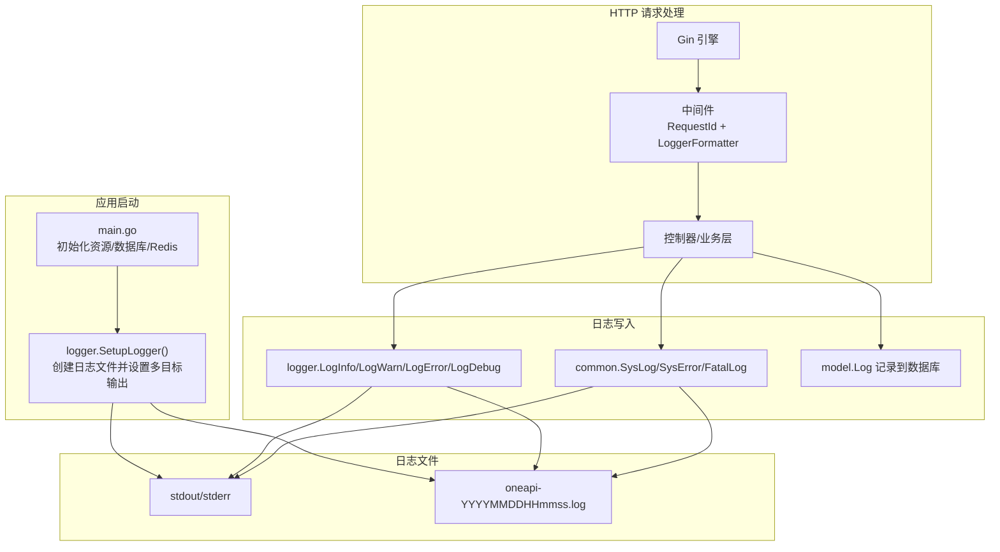
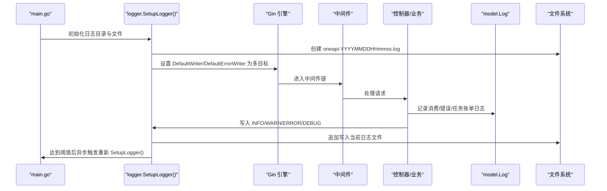
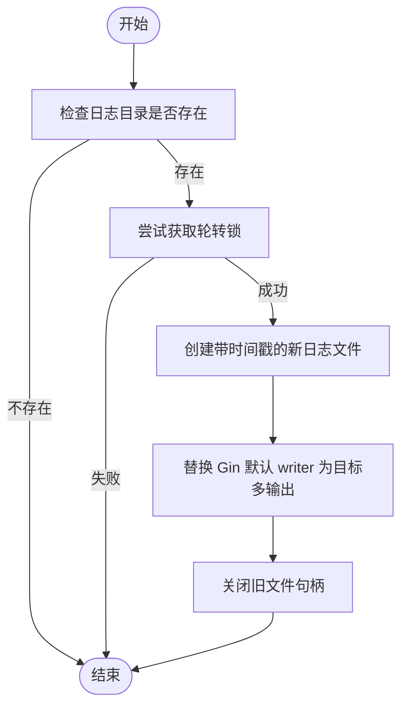
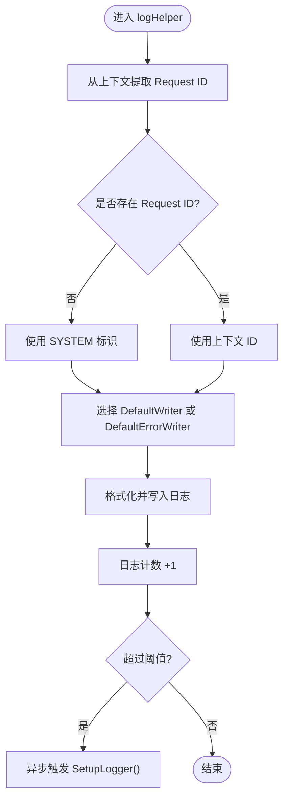
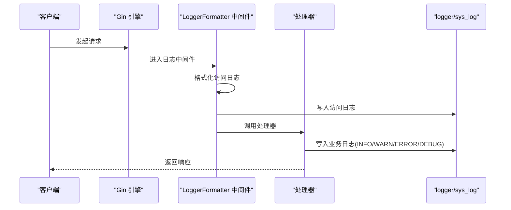
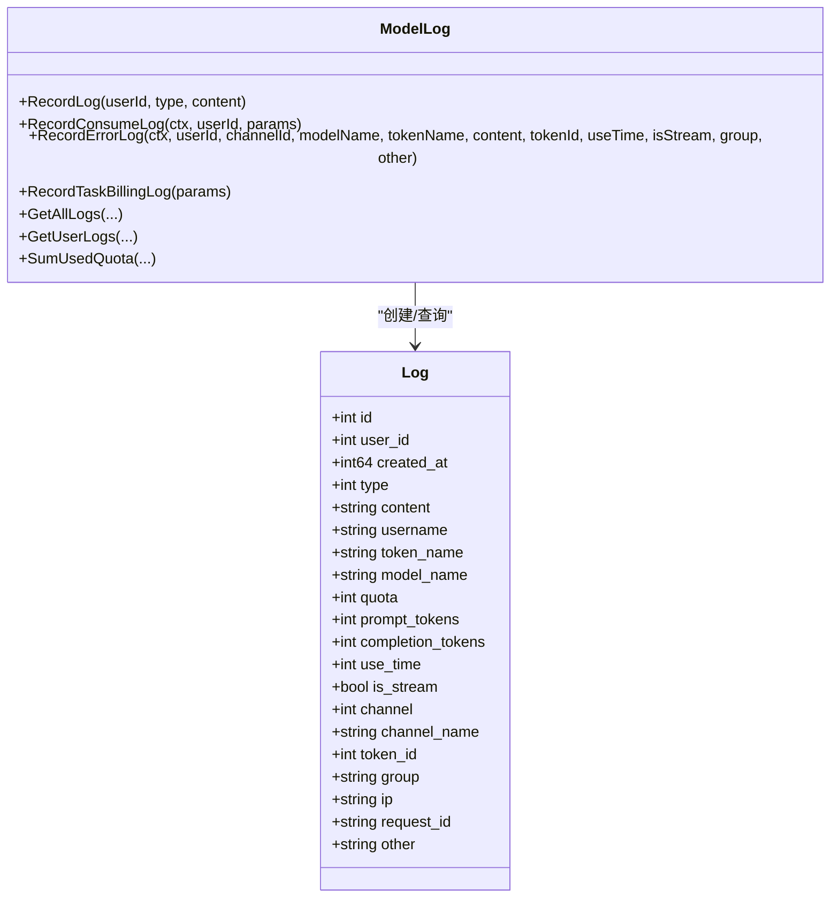
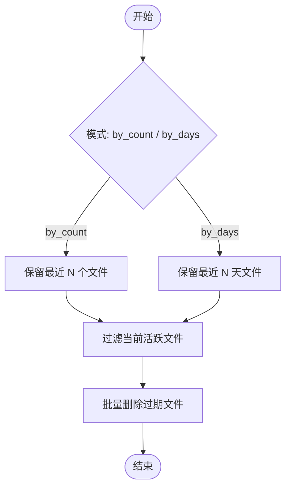
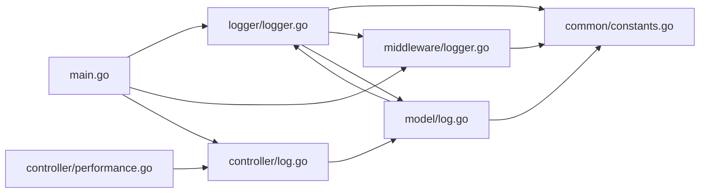

# 日志系统

<cite>
**本文引用的文件**
- [logger/logger.go](file://logger/logger.go)
- [common/sys_log.go](file://common/sys_log.go)
- [common/constants.go](file://common/constants.go)
- [middleware/logger.go](file://middleware/logger.go)
- [model/log.go](file://model/log.go)
- [controller/log.go](file://controller/log.go)
- [main.go](file://main.go)
- [controller/performance.go](file://controller/performance.go)
</cite>

## 目录
1. [简介](#简介)
2. [项目结构](#项目结构)
3. [核心组件](#核心组件)
4. [架构总览](#架构总览)
5. [组件详解](#组件详解)
6. [依赖关系分析](#依赖关系分析)
7. [性能与内存管理](#性能与内存管理)
8. [故障排查指南](#故障排查指南)
9. [结论](#结论)
10. [附录](#附录)

## 简介
本技术文档面向 New API 的日志系统，围绕以下主题展开：日志架构设计、日志级别管理（INFO/WARN/ERROR/DEBUG）、Gin 框架集成、并发安全写入、上下文关联（Request ID）与多目标输出（控制台与文件）、日志轮转与清理策略、配置项与使用场景、性能优化建议与运维实践。文档同时给出关键流程的时序图与类图，帮助读者快速理解并正确使用日志系统。

## 项目结构
日志系统涉及如下模块：
- 入口与初始化：在应用启动时初始化日志目录与文件句柄，并设置 Gin 的默认输出目标为“控制台+文件”。
- 日志写入：提供 INFO/WARN/ERROR/DEBUG 四级日志方法；DEBUG 仅在调试模式下生效；支持将日志写入 Gin 默认 writer 或错误 writer。
- 上下文关联：通过 Gin 中间件注入 Request ID，日志中统一携带该标识，便于跨服务链路追踪。
- 日志轮转：基于日志条数阈值触发异步轮转，避免阻塞主请求路径。
- 日志持久化与查询：日志模型与 DAO 提供消费日志、错误日志、任务账单日志的记录与查询能力。
- 日志清理：提供按文件数量或天数的清理策略，配合后台任务实现自动化维护。

图表来源
- [main.go:255](file://main.go#L255)
- [logger/logger.go:42-74](file://logger/logger.go#L42-L74)
- [middleware/logger.go:19-40](file://middleware/logger.go#L19-L40)
- [common/sys_log.go:17-37](file://common/sys_log.go#L17-L37)
- [model/log.go:75-91](file://model/log.go#L75-L91)

章节来源
- [main.go:242-316](file://main.go#L242-L316)
- [logger/logger.go:42-118](file://logger/logger.go#L42-L118)
- [middleware/logger.go:19-40](file://middleware/logger.go#L19-L40)
- [common/sys_log.go:17-37](file://common/sys_log.go#L17-L37)
- [model/log.go:75-91](file://model/log.go#L75-L91)

## 核心组件
- 日志初始化与轮转
  - 负责创建带时间戳的 log 文件，将 Gin 默认 writer 与错误 writer 指向“控制台+文件”的多目标输出。
  - 基于日志计数阈值触发异步轮转，避免阻塞请求。
- 日志级别与上下文
  - 提供 INFO/WARN/ERROR/DEBUG 四级方法；DEBUG 仅在调试模式开启时生效。
  - 统一从上下文提取 Request ID，若不存在则回退为 SYSTEM。
- Gin 集成
  - 自定义 LoggerFormatter 输出包含时间、标签、Request ID、状态码、耗时、客户端 IP、方法与路径等字段。
- 日志持久化与查询
  - 提供消费日志、错误日志、任务账单日志的记录方法；提供全量/用户日志查询、统计与历史清理接口。
- 日志清理
  - 支持按文件数量或天数清理策略；提供获取日志文件列表与清理操作的接口。

章节来源
- [logger/logger.go:20-118](file://logger/logger.go#L20-L118)
- [middleware/logger.go:19-40](file://middleware/logger.go#L19-L40)
- [model/log.go:75-201](file://model/log.go#L75-L201)
- [controller/log.go:13-171](file://controller/log.go#L13-L171)
- [controller/performance.go:231-292](file://controller/performance.go#L231-L292)

## 架构总览
下图展示了从应用启动到请求处理、日志写入与持久化的整体流程，以及日志轮转与清理的触发点。

图表来源
- [main.go:255](file://main.go#L255)
- [logger/logger.go:42-74](file://logger/logger.go#L42-L74)
- [middleware/logger.go:19-40](file://middleware/logger.go#L19-L40)
- [model/log.go:75-201](file://model/log.go#L75-L201)

## 组件详解

### 日志初始化与轮转
- 初始化时机
  - 应用启动时调用 SetupLogger，在指定目录创建带时间戳的 log 文件。
  - 将 Gin 的默认 writer 与错误 writer 设为“控制台+文件”的多目标输出。
- 轮转策略
  - 内部维护一个日志计数器，超过阈值后置位工作标志并异步触发新一轮 SetupLogger。
  - 新一轮 SetupLogger 会打开新文件并替换 writer，旧文件句柄在安全时机关闭。
- 并发与线程池
  - 使用互斥锁保护轮转过程中的状态切换；使用协程池执行异步轮转任务，避免阻塞主线程。

图表来源
- [logger/logger.go:42-74](file://logger/logger.go#L42-L74)
- [logger/logger.go:97-118](file://logger/logger.go#L97-L118)

章节来源
- [logger/logger.go:42-118](file://logger/logger.go#L42-L118)

### 日志级别与上下文关联
- 级别映射
  - INFO/WARN/ERROR 对应不同 writer；DEBUG 仅在调试模式下输出。
- 上下文提取
  - 从上下文中读取 Request ID，若为空则回退为 SYSTEM，确保每条日志具备可追踪性。
- Writer 并发保护
  - 读写 writer 时使用读写锁保护，轮转期间写入方持有读锁，轮转方持有写锁进行替换与关闭。

图表来源
- [logger/logger.go:97-118](file://logger/logger.go#L97-L118)
- [common/sys_log.go:17-29](file://common/sys_log.go#L17-L29)

章节来源
- [logger/logger.go:76-118](file://logger/logger.go#L76-L118)
- [common/sys_log.go:17-29](file://common/sys_log.go#L17-L29)

### Gin 框架集成与访问日志
- 中间件
  - 使用自定义日志格式化器，输出时间、标签、Request ID、状态码、耗时、客户端 IP、方法与路径。
  - 标签默认 web，可通过 RouteTag 中间件设置。
- 与日志模块协作
  - 访问日志与业务日志共享同一 writer，保证输出一致性与轮转透明。

图表来源
- [middleware/logger.go:19-40](file://middleware/logger.go#L19-L40)
- [logger/logger.go:76-118](file://logger/logger.go#L76-L118)
- [common/sys_log.go:17-29](file://common/sys_log.go#L17-L29)

章节来源
- [middleware/logger.go:19-40](file://middleware/logger.go#L19-L40)

### 日志持久化与查询
- 日志类型
  - 消费日志、错误日志、任务账单日志、系统日志等。
- 记录流程
  - 业务层调用 model 层记录方法，构造日志实体并写入数据库；必要时异步导出数据。
- 查询与统计
  - 支持按类型、用户名、令牌名、模型名、渠道、分组、时间范围、Request ID 等条件查询。
  - 提供额度、RPM、TPM 统计接口，限定最近 60 秒窗口内的 RPM/TPM 统计。

图表来源
- [model/log.go:19-41](file://model/log.go#L19-L41)
- [model/log.go:75-201](file://model/log.go#L75-L201)

章节来源
- [model/log.go:75-201](file://model/log.go#L75-L201)
- [controller/log.go:13-171](file://controller/log.go#L13-L171)

### 日志清理与文件管理
- 清理策略
  - 支持按文件数量或保留天数两种模式；按模式计算待删除文件集合。
  - 当前活跃日志文件不参与清理。
- 接口能力
  - 获取日志文件列表（含目录、文件数、总大小、最早/最晚时间）。
  - 执行清理并返回删除结果。

图表来源
- [controller/performance.go:231-292](file://controller/performance.go#L231-L292)

章节来源
- [controller/performance.go:231-292](file://controller/performance.go#L231-L292)

## 依赖关系分析
- 模块耦合
  - logger 依赖 common 的 RequestIdKey 与 LogWriterMu，保证并发安全与上下文一致。
  - middleware 依赖 common 的 RequestIdKey，为日志提供统一的 Request ID。
  - model 依赖 logger 与 common，用于记录日志与系统日志。
  - controller 提供日志查询与清理接口，依赖 model 与 common。
- 外部依赖
  - Gin：默认 writer/错误 writer 的多目标输出。
  - gopool：异步轮转任务调度。
  - gorm：日志持久化。

图表来源
- [logger/logger.go:3-18](file://logger/logger.go#L3-L18)
- [middleware/logger.go:3-8](file://middleware/logger.go#L3-L8)
- [model/log.go:3-17](file://model/log.go#L3-L17)
- [controller/log.go:3-11](file://controller/log.go#L3-L11)
- [controller/performance.go:231-292](file://controller/performance.go#L231-L292)
- [main.go:255](file://main.go#L255)

章节来源
- [logger/logger.go:3-18](file://logger/logger.go#L3-L18)
- [middleware/logger.go:3-8](file://middleware/logger.go#L3-L8)
- [model/log.go:3-17](file://model/log.go#L3-L17)
- [controller/log.go:3-11](file://controller/log.go#L3-L11)
- [controller/performance.go:231-292](file://controller/performance.go#L231-L292)
- [main.go:255](file://main.go#L255)

## 性能与内存管理
- 写入路径
  - 所有日志写入均通过 Gin 的 writer 完成，避免直接文件 IO 阻塞请求。
- 并发安全
  - 读写 writer 使用读写锁保护；轮转期间写入持有读锁，轮转持有写锁，确保切换原子性。
- 异步轮转
  - 轮转阈值触发后，使用协程池异步执行 SetupLogger，避免阻塞请求处理。
- 日志计数
  - 使用简单计数器并在阈值后重置，减少锁竞争；轮转期间通过标志位避免重复触发。
- 内存占用
  - 日志内容以字符串形式写入，无额外缓冲池；建议结合外部日志收集工具（如 systemd/journald/rsyslog）集中处理与轮转，减轻应用侧负担。

章节来源
- [logger/logger.go:97-118](file://logger/logger.go#L97-L118)
- [common/sys_log.go:17-29](file://common/sys_log.go#L17-L29)

## 故障排查指南
- 无法写入日志文件
  - 检查日志目录权限与磁盘空间；确认 SetupLogger 是否成功创建文件并替换 writer。
  - 关注轮转期间的 writer 替换是否完成。
- 日志缺失或乱序
  - 确认是否在轮转期间发生 writer 切换；检查读写锁使用是否正确。
- 访问日志缺失
  - 检查中间件是否正确注册；确认 LoggerFormatter 是否被调用。
- 查询不到日志
  - 检查数据库连接与表结构；确认查询参数（类型、时间范围、Request ID 等）是否正确。
- 清理无效
  - 确认日志目录配置；检查当前活跃文件是否被误删；核对清理模式与阈值。

章节来源
- [logger/logger.go:42-74](file://logger/logger.go#L42-L74)
- [middleware/logger.go:19-40](file://middleware/logger.go#L19-L40)
- [controller/log.go:13-171](file://controller/log.go#L13-L171)
- [controller/performance.go:231-292](file://controller/performance.go#L231-L292)

## 结论
本日志系统以 Gin 为核心，结合自定义轮转与清理策略，实现了 INFO/WARN/ERROR/DEBUG 四级日志、上下文关联（Request ID）、多目标输出（控制台+文件）与并发安全写入。通过模型层对日志的持久化与查询，满足了运营与排障需求。建议在生产环境中配合外部日志收集与轮转工具，进一步提升稳定性与可维护性。

## 附录

### 日志级别与使用场景
- INFO：常规业务事件、成功路径提示。
- WARN：潜在问题、异常但可恢复的情况。
- ERROR：错误事件、失败路径。
- DEBUG：调试信息，仅在调试模式开启。

章节来源
- [logger/logger.go:20-25](file://logger/logger.go#L20-L25)
- [logger/logger.go:76-95](file://logger/logger.go#L76-L95)

### 配置项与环境变量
- 日志目录
  - 通过公共常量中的日志目录指针决定是否启用文件输出。
- 调试模式
  - 开启后允许 DEBUG 级别日志输出。
- 其他相关开关
  - 消费日志记录开关、数据导出开关等。

章节来源
- [common/constants.go:72-75](file://common/constants.go#L72-L75)
- [common/constants.go:137-139](file://common/constants.go#L137-L139)

### 最佳实践与运维建议
- 建议将日志目录挂载到独立磁盘分区，预留充足空间。
- 生产环境建议关闭 DEBUG 日志，降低 I/O 压力。
- 使用外部日志收集工具统一采集与轮转，避免应用侧频繁轮转。
- 定期清理过期日志文件，结合“保留最近 N 个文件/天”策略。
- 在高并发场景下，优先使用异步轮转与只追加写入，避免随机写导致的性能抖动。