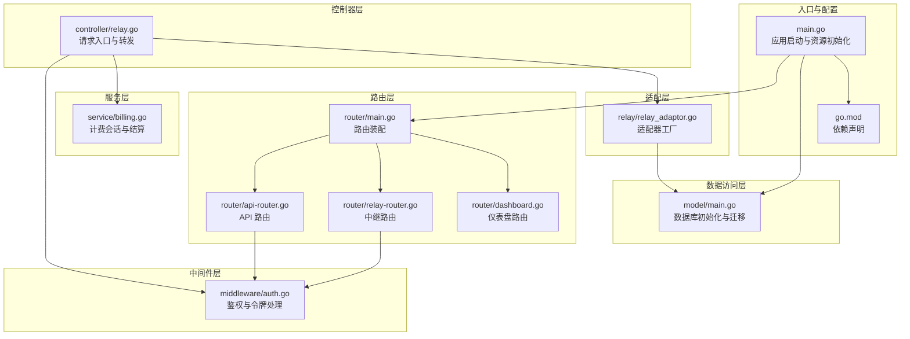
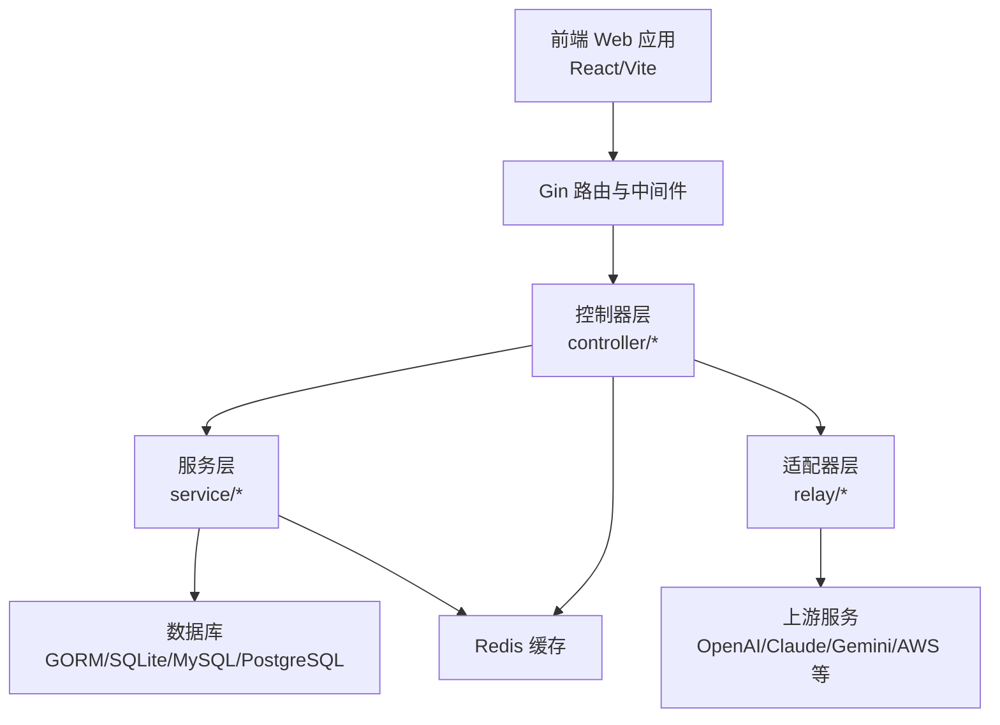
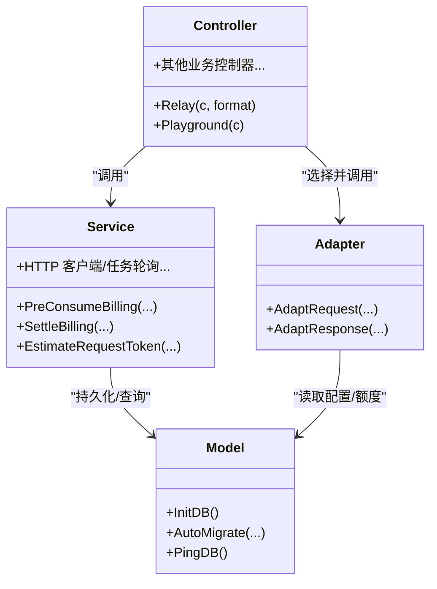
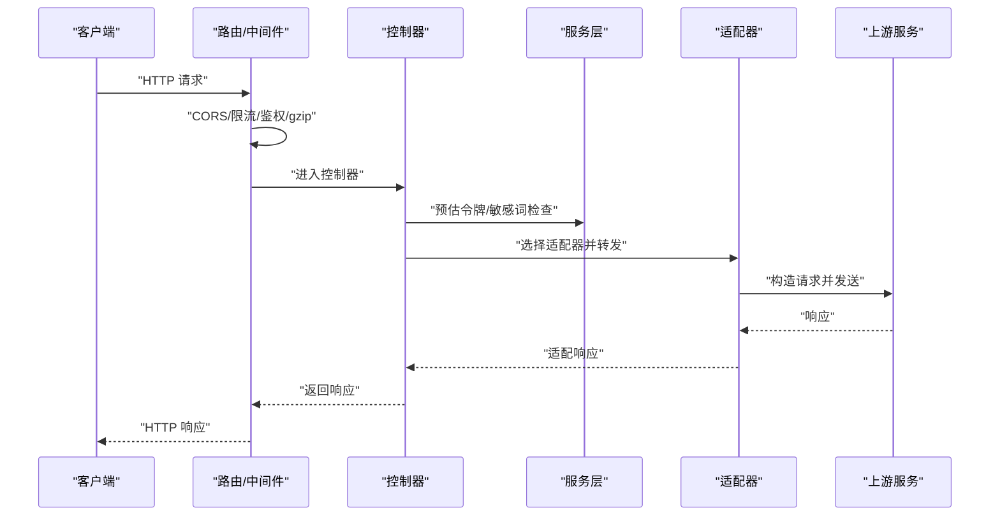
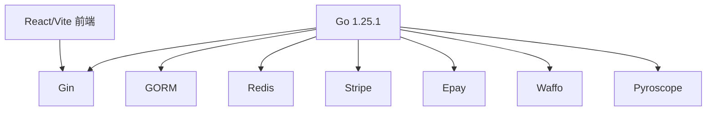

# 架构概览

<cite>
**本文档引用的文件**
- [main.go](file://main.go)
- [router/main.go](file://router/main.go)
- [router/api-router.go](file://router/api-router.go)
- [router/relay-router.go](file://router/relay-router.go)
- [router/dashboard.go](file://router/dashboard.go)
- [middleware/auth.go](file://middleware/auth.go)
- [controller/relay.go](file://controller/relay.go)
- [relay/relay_adaptor.go](file://relay/relay_adaptor.go)
- [common/constants.go](file://common/constants.go)
- [model/main.go](file://model/main.go)
- [service/billing.go](file://service/billing.go)
- [go.mod](file://go.mod)
- [README.md](file://README.md)
</cite>

## 目录
1. [引言](#引言)
2. [项目结构](#项目结构)
3. [核心组件](#核心组件)
4. [架构总览](#架构总览)
5. [详细组件分析](#详细组件分析)
6. [依赖关系分析](#依赖关系分析)
7. [性能考量](#性能考量)
8. [故障排查指南](#故障排查指南)
9. [结论](#结论)
10. [附录](#附录)

## 引言
本项目是一个面向多模型、多供应商的统一网关与 AI 资产管理平台，提供 OpenAI 兼容接口、实时对话、图像/音频/视频生成、嵌入与重排、以及丰富的第三方适配能力。系统采用前后端分离架构，后端基于 Go/Gin 提供高并发 API 与中继转发能力，前端使用 React/Vite 构建仪表盘与控制台。

系统目标包括：
- 统一接入多家上游模型与服务（OpenAI、Claude、Gemini、AWS、阿里云、百度、火山引擎等）
- 支持灵活的路由与适配器模式，实现协议转换与格式兼容
- 提供完善的鉴权、限流、审计与计费体系
- 支持多租户、分组、订阅与配额管理
- 保证高可用、可观测与可扩展

## 项目结构
后端采用分层架构与模块化组织：
- 入口与资源初始化：main.go
- 路由注册：router 子包
- 中间件：middleware 子包（鉴权、限流、CORS、gzip、日志等）
- 控制器：controller 子包（业务入口，调用服务层）
- 服务层：service 子包（业务编排、计费、任务轮询、HTTP 客户端等）
- 数据访问层：model 子包（GORM 模型与数据库初始化）
- 适配层：relay 子包（各上游适配器与任务适配器）
- DTO/常量/工具：dto、constant、common、types 等

**图表来源**
- [main.go:43-199](file://main.go#L43-L199)
- [router/main.go:16-35](file://router/main.go#L16-L35)
- [router/api-router.go:14-379](file://router/api-router.go#L14-L379)
- [router/relay-router.go:13-225](file://router/relay-router.go#L13-L225)
- [router/dashboard.go:10-23](file://router/dashboard.go#L10-L23)
- [middleware/auth.go:170-440](file://middleware/auth.go#L170-L440)
- [controller/relay.go:67-200](file://controller/relay.go#L67-L200)
- [service/billing.go:17-79](file://service/billing.go#L17-L79)
- [relay/relay_adaptor.go:53-166](file://relay/relay_adaptor.go#L53-L166)
- [model/main.go:177-248](file://model/main.go#L177-L248)

**章节来源**
- [main.go:43-199](file://main.go#L43-L199)
- [router/main.go:16-35](file://router/main.go#L16-L35)
- [go.mod:1-140](file://go.mod#L1-140)

## 核心组件
- 应用入口与生命周期
  - 初始化环境变量、日志、数据库、Redis、国际化、OAuth 提供商等
  - 注册路由、启动 HTTP 服务器、后台任务与监控
- 路由与中间件
  - API 路由：用户、订阅、通道、令牌、日志、数据看板等
  - 中继路由：统一 /v1 与 /v1beta 接口，支持 OpenAI/Claude/Gemini/音频/图像/嵌入/重排等
  - 中间件：CORS、gzip、请求体清理、全局/模型级限流、鉴权、性能检查、分发策略等
- 控制器与服务
  - 控制器：接收请求、参数校验、生成 RelayInfo、调用服务层进行计费与调度
  - 服务：计费会话、令牌估算、违规费用、HTTP 客户端、任务轮询等
- 适配器与数据访问
  - 适配器：根据上游类型选择具体适配器，完成请求转换与响应处理
  - 数据访问：GORM 初始化、迁移、连接池配置、Ping 健康检查

**章节来源**
- [main.go:242-316](file://main.go#L242-L316)
- [router/api-router.go:14-379](file://router/api-router.go#L14-L379)
- [router/relay-router.go:13-225](file://router/relay-router.go#L13-L225)
- [middleware/auth.go:170-440](file://middleware/auth.go#L170-L440)
- [controller/relay.go:67-200](file://controller/relay.go#L67-L200)
- [service/billing.go:17-79](file://service/billing.go#L17-L79)
- [relay/relay_adaptor.go:53-166](file://relay/relay_adaptor.go#L53-L166)
- [model/main.go:177-248](file://model/main.go#L177-L248)

## 架构总览
系统采用“控制器层-服务层-数据访问层”的分层设计，并通过中间件与适配器实现横切关注点与协议解耦。前端通过 REST/WebSocket 与后端交互，后端通过适配器对接多家上游服务，实现统一的 OpenAI 兼容接口与多模型支持。

**图表来源**
- [main.go:154-199](file://main.go#L154-L199)
- [router/main.go:16-35](file://router/main.go#L16-L35)
- [controller/relay.go:67-200](file://controller/relay.go#L67-L200)
- [service/billing.go:17-79](file://service/billing.go#L17-L79)
- [relay/relay_adaptor.go:53-166](file://relay/relay_adaptor.go#L53-L166)
- [model/main.go:177-248](file://model/main.go#L177-L248)

## 详细组件分析

### 分层架构与职责
- 控制器层
  - 负责请求入口、参数校验、上下文注入、错误映射与响应返回
  - 在中继场景中，负责生成 RelayInfo、触发敏感词检查、估算令牌、预扣费、调度通道与适配器
- 服务层
  - 封装业务编排：计费会话、令牌估算、违规费用、HTTP 客户端、任务轮询
  - 提供跨模块共享能力：如用户可用分组、比率配置、性能统计等
- 数据访问层
  - 统一数据库初始化、迁移与连接池配置
  - 支持 SQLite、MySQL、PostgreSQL，自动迁移与健康检查

**图表来源**
- [controller/relay.go:67-200](file://controller/relay.go#L67-L200)
- [service/billing.go:17-79](file://service/billing.go#L17-L79)
- [relay/relay_adaptor.go:53-166](file://relay/relay_adaptor.go#L53-L166)
- [model/main.go:177-248](file://model/main.go#L177-L248)

**章节来源**
- [controller/relay.go:67-200](file://controller/relay.go#L67-L200)
- [service/billing.go:17-79](file://service/billing.go#L17-L79)
- [relay/relay_adaptor.go:53-166](file://relay/relay_adaptor.go#L53-L166)
- [model/main.go:177-248](file://model/main.go#L177-L248)

### 中间件机制与适配器模式
- 中间件
  - 鉴权：支持会话与令牌两种方式，区分用户/管理员/根用户角色
  - 限流：全局 API 限流、关键路径限流、搜索限流、模型级限流
  - CORS/gzip/日志/请求体清理/性能检查/分发策略等
- 适配器
  - 通过工厂方法按上游类型选择适配器，屏蔽协议差异
  - 支持文本、图像、音频、嵌入、重排、Gemini、Claude、OpenAI 实时等多种格式

**图表来源**
- [middleware/auth.go:170-440](file://middleware/auth.go#L170-L440)
- [controller/relay.go:67-200](file://controller/relay.go#L67-L200)
- [relay/relay_adaptor.go:53-166](file://relay/relay_adaptor.go#L53-L166)

**章节来源**
- [middleware/auth.go:170-440](file://middleware/auth.go#L170-L440)
- [relay/relay_adaptor.go:53-166](file://relay/relay_adaptor.go#L53-L166)

### 前后端分离与微服务理念
- 前后端分离
  - 前端静态资源内嵌于后端，通过 Gin 路由统一托管；也可通过环境变量将前端部署到独立域名
- 微服务理念
  - 通过适配器与任务适配器实现“插件化”扩展，新增上游只需实现对应接口
  - 计费与任务轮询抽象为服务层能力，便于横向扩展与替换

**章节来源**
- [router/main.go:21-35](file://router/main.go#L21-L35)
- [README.md:107-156](file://README.md#L107-L156)

### 系统边界与组件交互
- 系统边界
  - 外部：浏览器/移动客户端、第三方支付网关、上游模型服务
  - 内部：控制器、服务、适配器、数据访问层
- 关键交互
  - 用户通过 API 登录/注册，获取令牌后访问中继接口
  - 控制器根据令牌与模型信息选择通道与适配器，完成请求转发与计费结算

**章节来源**
- [router/api-router.go:14-379](file://router/api-router.go#L14-L379)
- [router/relay-router.go:13-225](file://router/relay-router.go#L13-L225)
- [controller/relay.go:67-200](file://controller/relay.go#L67-L200)

## 依赖关系分析
- 技术栈
  - 后端：Go 1.25.1、Gin、GORM、Redis、Pyroscope、Stripe、Epay、Waffo 等
  - 前端：React/Vite、TailwindCSS、i18n
- 外部集成
  - 支付：Stripe、Epay、Creem、Waffo
  - 认证：Discord、LinuxDO、Telegram、OIDC、Passkey
  - 监控：Pyroscope、pprof
  - 数据库：SQLite/MySQL/PostgreSQL

**图表来源**
- [go.mod:1-140](file://go.mod#L1-140)
- [main.go:25-34](file://main.go#L25-L34)

**章节来源**
- [go.mod:1-140](file://go.mod#L1-140)
- [main.go:25-34](file://main.go#L25-L34)

## 性能考量
- 连接池与数据库
  - GORM 连接池参数可配置，支持 SQLite/MySQL/PostgreSQL
- 缓存与内存
  - 支持内存缓存与 Redis 缓存，提升通道与用户信息读取性能
- 压缩与传输
  - 默认启用 gzip 压缩，减少带宽占用
- 监控与剖析
  - 可选开启 pprof 与 Pyroscope，定位性能瓶颈
- 限流与降载
  - 全局/模型级限流、搜索限流、关键路径限流，保障系统稳定性

**章节来源**
- [model/main.go:194-197](file://model/main.go#L194-L197)
- [common/constants.go:161-186](file://common/constants.go#L161-L186)
- [main.go:141-152](file://main.go#L141-L152)

## 故障排查指南
- 常见问题
  - 令牌无效/过期/封禁：检查令牌状态与用户状态，确认 IP 白名单
  - 上游超时/失败：查看重试次数与通道状态，必要时切换通道
  - 计费异常：核对预扣费与后结算差异，检查订阅与钱包余额
- 日志与诊断
  - 启用错误日志与性能日志，结合请求 ID 定位问题
  - 使用 pprof/Pyroscope 进行 CPU/内存剖析
- 数据库健康
  - 定期执行 PingDB 与迁移，确保字符集与排序规则满足中文需求

**章节来源**
- [middleware/auth.go:332-406](file://middleware/auth.go#L332-L406)
- [service/billing.go:34-79](file://service/billing.go#L34-L79)
- [model/main.go:681-704](file://model/main.go#L681-L704)

## 结论
本项目通过清晰的分层架构、中间件与适配器模式，实现了对多上游服务的统一接入与兼容。配合完善的鉴权、限流、计费与监控体系，能够支撑高并发与多样化的业务场景。建议在生产环境中合理配置缓存、连接池与限流策略，并持续优化适配器与任务轮询逻辑以提升可扩展性。

## 附录
- 快速开始与部署参考官方文档与 README
- 环境变量与配置项详见 README 的环境变量章节

**章节来源**
- [README.md:107-156](file://README.md#L107-L156)
- [README.md:304-331](file://README.md#L304-L331)