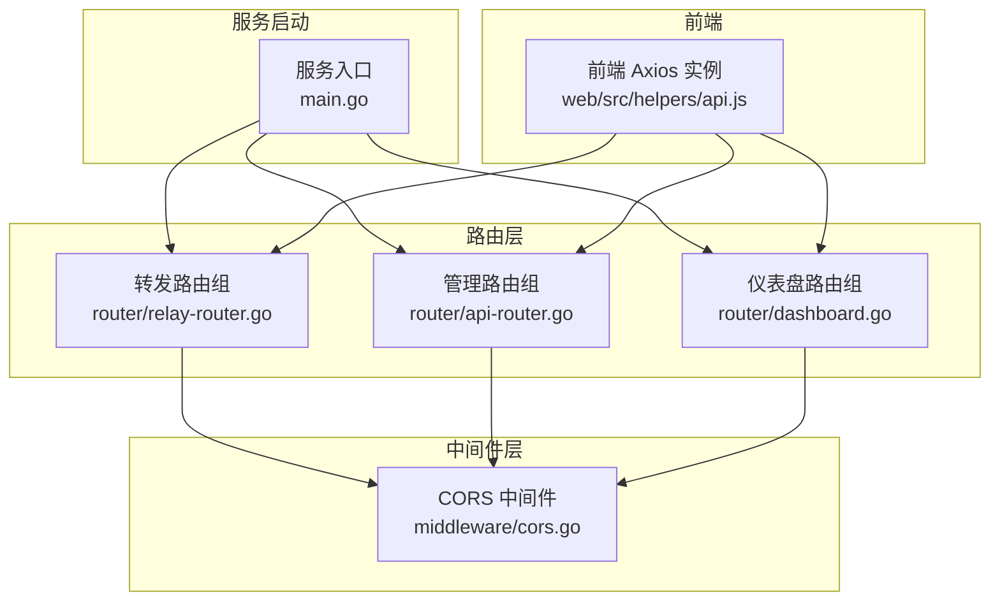
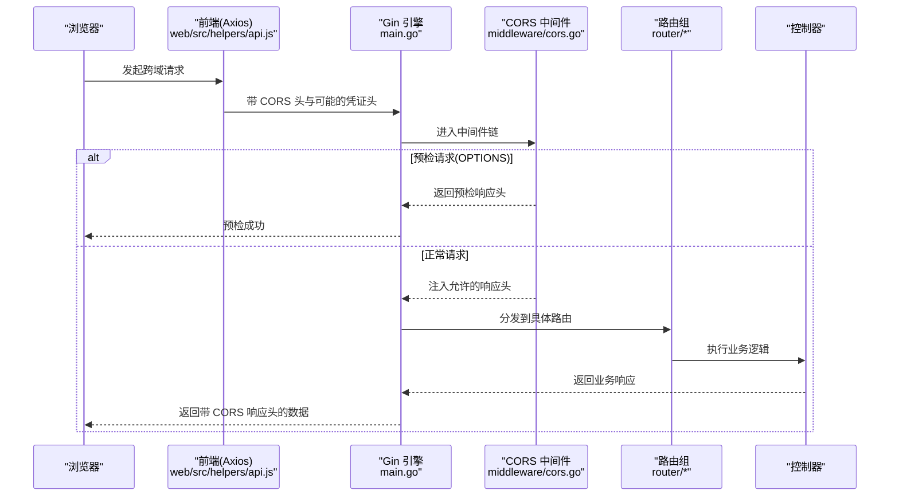
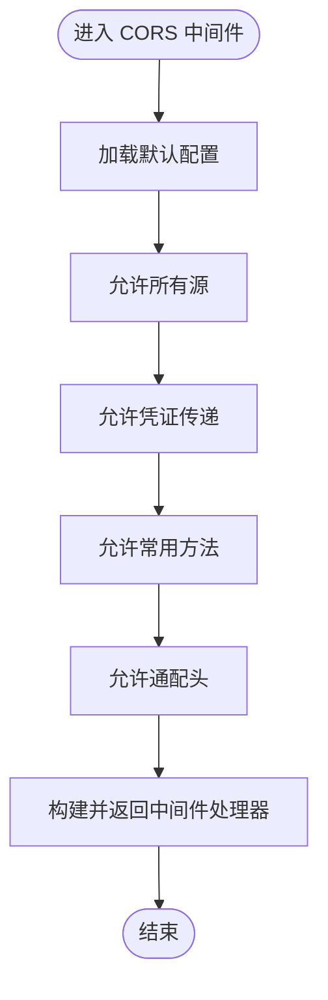
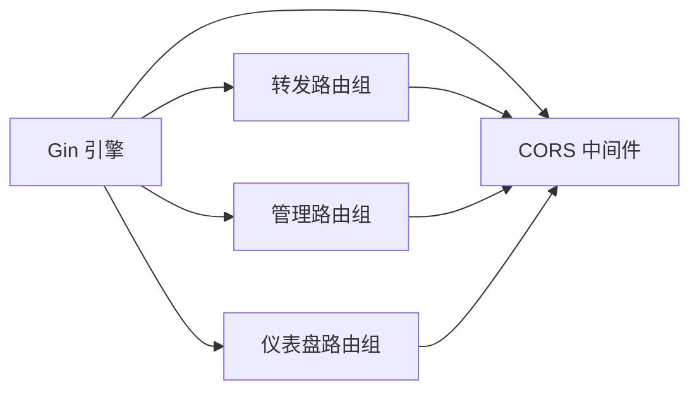
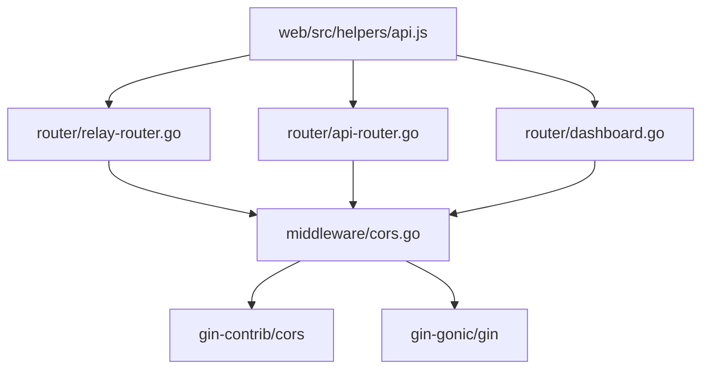

# CORS 中间件

<cite>
**本文引用的文件**
- [middleware/cors.go](file://middleware/cors.go)
- [router/api-router.go](file://router/api-router.go)
- [router/dashboard.go](file://router/dashboard.go)
- [router/relay-router.go](file://router/relay-router.go)
- [common/constants.go](file://common/constants.go)
- [web/src/helpers/api.js](file://web/src/helpers/api.js)
- [main.go](file://main.go)
</cite>

## 目录
1. [简介](#简介)
2. [项目结构](#项目结构)
3. [核心组件](#核心组件)
4. [架构总览](#架构总览)
5. [详细组件分析](#详细组件分析)
6. [依赖分析](#依赖分析)
7. [性能考量](#性能考量)
8. [故障排查指南](#故障排查指南)
9. [结论](#结论)
10. [附录](#附录)

## 简介
本文件面向 New API 项目的 CORS 中间件，系统化阐述其设计原理、实现机制与最佳实践。重点覆盖以下方面：
- 跨域请求处理、预检请求与凭证传递的实现细节
- CORS 头部配置、允许的源域名、方法与头字段的设置
- 安全策略、默认配置与可扩展的自定义规则
- 与前端应用、API 网关及安全策略的关系
- 严格 CORS 模式、动态源域名匹配与预检缓存优化建议
- 浏览器兼容性与调试技巧

## 项目结构
CORS 中间件位于中间件层，通过 Gin 的中间件机制在路由层面生效；同时在多个路由组中被集中使用，确保 API 与仪表盘等入口具备一致的跨域行为。

图表来源
- [middleware/cors.go:1-23](file://middleware/cors.go#L1-L23)
- [router/relay-router.go:13-14](file://router/relay-router.go#L13-L14)
- [router/api-router.go:263](file://router/api-router.go#L263)
- [router/dashboard.go:15](file://router/dashboard.go#L15)
- [web/src/helpers/api.js:29-37](file://web/src/helpers/api.js#L29-L37)
- [main.go:185-186](file://main.go#L185-L186)

章节来源
- [middleware/cors.go:1-23](file://middleware/cors.go#L1-L23)
- [router/relay-router.go:13-14](file://router/relay-router.go#L13-L14)
- [router/api-router.go:263](file://router/api-router.go#L263)
- [router/dashboard.go:15](file://router/dashboard.go#L15)
- [web/src/helpers/api.js:29-37](file://web/src/helpers/api.js#L29-L37)
- [main.go:185-186](file://main.go#L185-L186)

## 核心组件
- CORS 中间件函数
  - 基于默认配置进行扩展，启用允许所有源、凭证传递、常用 HTTP 方法与通配头，最终返回 Gin 中间件处理器。
  - 关键点：允许所有源与通配头带来便利，但需结合部署场景评估安全边界。
- 路由集成
  - 转发路由组与仪表盘路由组均在顶层注册 CORS 中间件，保证跨域访问一致性。
  - 部分业务路由组在组级别使用 CORS 中间件，确保细粒度控制。
- 前端交互
  - 前端 Axios 实例设置基础头与缓存控制，配合后端 CORS 头共同完成跨域与缓存策略。

章节来源
- [middleware/cors.go:9-16](file://middleware/cors.go#L9-L16)
- [router/relay-router.go:13-14](file://router/relay-router.go#L13-L14)
- [router/dashboard.go:15](file://router/dashboard.go#L15)
- [router/api-router.go:263](file://router/api-router.go#L263)
- [web/src/helpers/api.js:29-37](file://web/src/helpers/api.js#L29-L37)

## 架构总览
下图展示浏览器请求经由前端、CORS 中间件与后端控制器的整体流程，突出预检请求与凭证传递的关键节点。

图表来源
- [web/src/helpers/api.js:29-37](file://web/src/helpers/api.js#L29-L37)
- [middleware/cors.go:9-16](file://middleware/cors.go#L9-L16)
- [router/relay-router.go:13-14](file://router/relay-router.go#L13-L14)
- [router/api-router.go:263](file://router/api-router.go#L263)
- [router/dashboard.go:15](file://router/dashboard.go#L15)
- [main.go:185-186](file://main.go#L185-L186)

## 详细组件分析

### CORS 中间件实现
- 默认配置扩展
  - 允许所有源：简化开发与多前端部署场景，便于联调与灰度发布。
  - 凭证传递：允许携带 Cookie、Authorization 等凭据，满足登录态跨域需求。
  - 方法与头：开放常见方法与通配头，降低接入成本。
- 返回中间件处理器
  - 通过 gin.HandlerFunc 形式注入到路由链，按注册顺序生效。

图表来源
- [middleware/cors.go:9-16](file://middleware/cors.go#L9-L16)

章节来源
- [middleware/cors.go:9-16](file://middleware/cors.go#L9-L16)

### 路由中的 CORS 使用
- 转发路由组
  - 在引擎顶层注册 CORS，确保所有转发接口具备跨域能力。
- 仪表盘路由组
  - 在顶层注册 CORS，保障仪表盘相关接口的跨域访问。
- 业务路由组
  - 部分路由组在组级别使用 CORS 中间件，形成更细粒度的跨域控制。

图表来源
- [router/relay-router.go:13-14](file://router/relay-router.go#L13-L14)
- [router/api-router.go:263](file://router/api-router.go#L263)
- [router/dashboard.go:15](file://router/dashboard.go#L15)

章节来源
- [router/relay-router.go:13-14](file://router/relay-router.go#L13-L14)
- [router/api-router.go:263](file://router/api-router.go#L263)
- [router/dashboard.go:15](file://router/dashboard.go#L15)

### 前端应用与 CORS 的协作
- 前端 Axios 实例
  - 设置基础头与缓存控制，避免缓存干扰跨域响应。
  - 通过环境变量配置服务端地址，确保请求目标与源一致时减少跨域。
- 与后端中间件的配合
  - 后端 CORS 中间件负责注入允许的响应头；前端负责发起符合预期的请求头与方法。

章节来源
- [web/src/helpers/api.js:29-37](file://web/src/helpers/api.js#L29-L37)
- [middleware/cors.go:9-16](file://middleware/cors.go#L9-L16)

### 预检请求与凭证传递
- 预检请求
  - 当请求方法或自定义头不在简单方法与简单头范围内，浏览器会先发送 OPTIONS 预检。
  - CORS 中间件对预检请求返回必要的响应头，使后续主请求得以继续。
- 凭证传递
  - 当前端需要携带 Cookie 或 Authorization 等凭据时，后端需允许凭证传递，前端也需正确设置跨域请求选项。

章节来源
- [middleware/cors.go:11-14](file://middleware/cors.go#L11-L14)
- [web/src/helpers/api.js:29-37](file://web/src/helpers/api.js#L29-L37)

### 安全策略与默认配置
- 默认配置要点
  - 允许所有源与通配头简化接入，但可能扩大攻击面。
  - 凭证传递需谨慎，仅在受控环境下启用。
- 自定义规则建议
  - 生产环境建议限定允许源列表，避免通配符。
  - 明确允许的方法与头，减少不必要的宽泛放行。
  - 对敏感接口启用更严格的源校验与凭据策略。

章节来源
- [middleware/cors.go:9-16](file://middleware/cors.go#L9-L16)

### 严格 CORS 模式与动态源匹配
- 严格 CORS 模式
  - 在生产环境建议关闭“允许所有源”，改为白名单源列表，并明确允许的方法与头。
- 动态源域名匹配
  - 可基于运行时配置或环境变量动态生成允许源列表，结合中间件工厂函数实现按租户或实例动态调整。
- 预检缓存优化
  - 合理设置预检缓存时间，减少重复预检带来的延迟。
  - 对静态资源与公共接口可适当放宽，对鉴权接口保持更严格策略。

章节来源
- [middleware/cors.go:9-16](file://middleware/cors.go#L9-L16)

## 依赖分析
- 组件耦合
  - CORS 中间件与路由层松耦合，通过中间件注册方式生效。
  - 与前端 Axios 实例通过约定的请求头与方法协同工作。
- 外部依赖
  - 基于 Gin 与 gin-contrib/cors，遵循 Gin 中间件链规范。
- 潜在风险
  - “允许所有源”与“通配头”在生产环境可能引入跨站风险，需结合业务场景审慎评估。

图表来源
- [middleware/cors.go:3-7](file://middleware/cors.go#L3-L7)
- [router/relay-router.go:13-14](file://router/relay-router.go#L13-L14)
- [router/api-router.go:263](file://router/api-router.go#L263)
- [router/dashboard.go:15](file://router/dashboard.go#L15)
- [web/src/helpers/api.js:29-37](file://web/src/helpers/api.js#L29-L37)

章节来源
- [middleware/cors.go:3-7](file://middleware/cors.go#L3-L7)
- [router/relay-router.go:13-14](file://router/relay-router.go#L13-L14)
- [router/api-router.go:263](file://router/api-router.go#L263)
- [router/dashboard.go:15](file://router/dashboard.go#L15)
- [web/src/helpers/api.js:29-37](file://web/src/helpers/api.js#L29-L37)

## 性能考量
- 预检缓存
  - 通过合理设置预检缓存时间，减少重复 OPTIONS 请求，提升整体吞吐。
- 方法与头的最小化
  - 仅暴露必要方法与头，避免过度放行导致的额外处理开销。
- 中间件顺序
  - 将 CORS 放置在鉴权与限流之后，避免对未授权请求产生不必要的跨域头注入。

## 故障排查指南
- 常见问题定位
  - 预检失败：检查是否使用了非简单方法或自定义头，确认后端已允许相应方法与头。
  - 凭证丢失：确认前端请求是否携带凭据，后端是否允许凭证传递。
  - 源不匹配：生产环境若出现跨域错误，检查是否启用了“允许所有源”，建议改为白名单。
- 调试技巧
  - 使用浏览器开发者工具查看 Network 面板中的预检请求与响应头。
  - 对比前端请求头与后端响应头，确认关键 CORS 头是否存在。
  - 在本地开发阶段可临时放宽策略以便快速验证，上线前务必收紧。

## 结论
本项目的 CORS 中间件采用“默认宽松+路由级控制”的策略，兼顾易用性与灵活性。在生产环境中，建议将“允许所有源”替换为白名单源，并明确允许的方法与头，同时对凭证传递与预检缓存进行精细化配置，以在安全性与可用性之间取得平衡。

## 附录
- 版本信息
  - 服务版本号通过通用常量提供，可用于在响应头中标识版本，辅助排障与监控。
- 前端基线配置
  - 前端 Axios 实例设置基础头与缓存控制，确保与后端 CORS 行为协调一致。

章节来源
- [common/constants.go:14](file://common/constants.go#L14)
- [web/src/helpers/api.js:29-37](file://web/src/helpers/api.js#L29-L37)