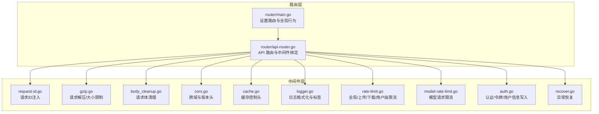
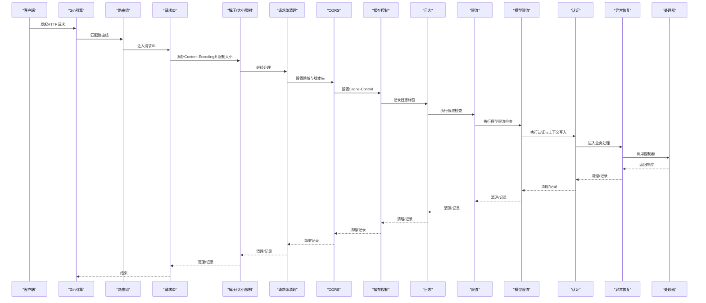
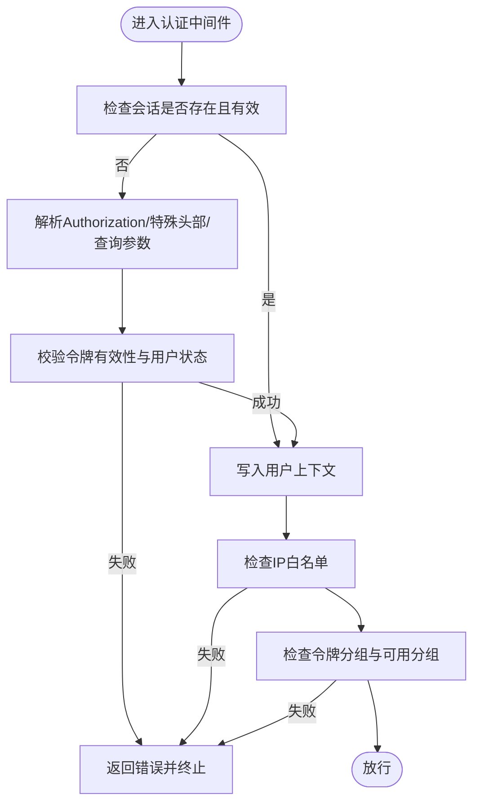
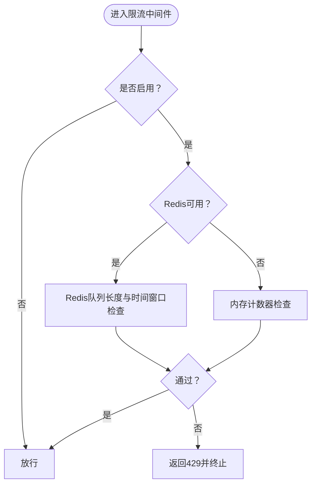
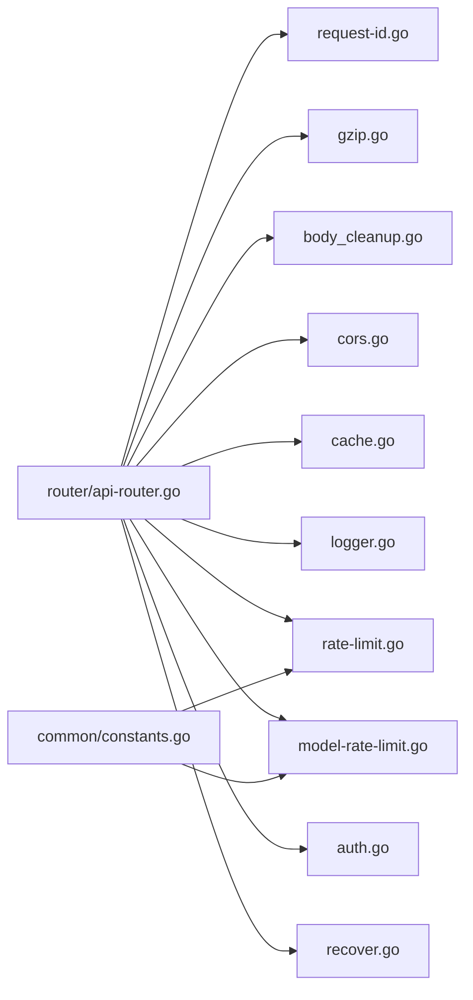

# 中间件系统

<cite>
**本文引用的文件**
- [auth.go](file://middleware/auth.go)
- [rate-limit.go](file://middleware/rate-limit.go)
- [logger.go](file://middleware/logger.go)
- [cors.go](file://middleware/cors.go)
- [cache.go](file://middleware/cache.go)
- [body_cleanup.go](file://middleware/body_cleanup.go)
- [gzip.go](file://middleware/gzip.go)
- [recover.go](file://middleware/recover.go)
- [request-id.go](file://middleware/request-id.go)
- [utils.go](file://middleware/utils.go)
- [api-router.go](file://router/api-router.go)
- [main.go](file://router/main.go)
- [constants.go](file://common/constants.go)
- [model-rate-limit.go](file://middleware/model-rate-limit.go)
</cite>

## 目录
1. [简介](#简介)
2. [项目结构](#项目结构)
3. [核心组件](#核心组件)
4. [架构总览](#架构总览)
5. [详细组件分析](#详细组件分析)
6. [依赖分析](#依赖分析)
7. [性能考量](#性能考量)
8. [故障排查指南](#故障排查指南)
9. [结论](#结论)
10. [附录](#附录)

## 简介
本文件系统性阐述 New API 项目的中间件体系，覆盖设计模式、执行顺序与链式调用机制，并对认证、限流、日志、CORS、缓存等关键中间件进行深入解析。内容包括配置项、参数传递、上下文管理、执行流程、错误处理、与路由系统的集成方式、性能影响与调试技巧，以及自定义中间件的开发与组合使用模式。

## 项目结构
中间件集中位于 middleware 目录，路由注册位于 router 目录。整体采用 Gin Engine 的全局与分组中间件链式调用，结合路由组的局部中间件叠加，形成灵活可组合的控制流。

图表来源
- [main.go:16-35](file://router/main.go#L16-L35)
- [api-router.go:14-379](file://router/api-router.go#L14-L379)
- [request-id.go:21-30](file://middleware/request-id.go#L21-L30)
- [gzip.go:25-76](file://middleware/gzip.go#L25-L76)
- [body_cleanup.go:11-22](file://middleware/body_cleanup.go#L11-L22)
- [cors.go:9-23](file://middleware/cors.go#L9-L23)
- [cache.go:7-17](file://middleware/cache.go#L7-L17)
- [logger.go:19-40](file://middleware/logger.go#L19-L40)
- [rate-limit.go:76-117](file://middleware/rate-limit.go#L76-L117)
- [model-rate-limit.go:166-178](file://middleware/model-rate-limit.go#L166-L178)
- [auth.go:170-186](file://middleware/auth.go#L170-L186)
- [recover.go:12-29](file://middleware/recover.go#L12-L29)

章节来源
- [main.go:16-35](file://router/main.go#L16-L35)
- [api-router.go:14-379](file://router/api-router.go#L14-L379)

## 核心组件
- 请求ID中间件：为每次请求生成唯一标识，写入 Header 与 Context，便于日志追踪与错误定位。
- 解压与大小限制中间件：根据 Content-Encoding 自动解压请求体，同时限制最大请求体积，防止资源滥用。
- 请求体清理中间件：在请求处理完成后清理临时存储与文件缓存，避免资源泄漏。
- CORS 中间件：统一允许所有来源、凭证与常用方法，设置版本响应头。
- 缓存控制中间件：首页禁用缓存，其他路径默认一周缓存，统一版本头。
- 日志中间件：基于 Gin 内置 LoggerWithFormatter，支持路由标签与请求ID输出。
- 限流中间件：支持全局、API、关键操作、上传、下载与按用户维度的限流；可选 Redis 或内存实现。
- 模型请求限流中间件：基于内存计数器的总请求数与成功请求数双维度限流。
- 认证中间件：支持会话与令牌两种认证路径，写入用户上下文、分组、额度等信息。
- 异常恢复中间件：捕获 panic 并返回统一错误结构，记录堆栈信息。

章节来源
- [request-id.go:21-30](file://middleware/request-id.go#L21-L30)
- [gzip.go:25-76](file://middleware/gzip.go#L25-L76)
- [body_cleanup.go:11-22](file://middleware/body_cleanup.go#L11-L22)
- [cors.go:9-23](file://middleware/cors.go#L9-L23)
- [cache.go:7-17](file://middleware/cache.go#L7-L17)
- [logger.go:19-40](file://middleware/logger.go#L19-L40)
- [rate-limit.go:76-117](file://middleware/rate-limit.go#L76-L117)
- [model-rate-limit.go:166-178](file://middleware/model-rate-limit.go#L166-L178)
- [auth.go:170-186](file://middleware/auth.go#L170-L186)
- [recover.go:12-29](file://middleware/recover.go#L12-L29)

## 架构总览
中间件以“链式调用”贯穿请求生命周期：从进入路由组开始，依次执行全局与分组中间件，再进入控制器处理，最后逆序返回阶段执行清理与收尾逻辑。路由层通过 Group 与 Use 将中间件挂载到特定路径空间，实现细粒度控制。

图表来源
- [api-router.go:14-379](file://router/api-router.go#L14-L379)
- [request-id.go:21-30](file://middleware/request-id.go#L21-L30)
- [gzip.go:25-76](file://middleware/gzip.go#L25-L76)
- [body_cleanup.go:11-22](file://middleware/body_cleanup.go#L11-L22)
- [cors.go:9-23](file://middleware/cors.go#L9-L23)
- [cache.go:7-17](file://middleware/cache.go#L7-L17)
- [logger.go:19-40](file://middleware/logger.go#L19-L40)
- [rate-limit.go:76-117](file://middleware/rate-limit.go#L76-L117)
- [model-rate-limit.go:166-178](file://middleware/model-rate-limit.go#L166-L178)
- [auth.go:170-186](file://middleware/auth.go#L170-L186)
- [recover.go:12-29](file://middleware/recover.go#L12-L29)

## 详细组件分析

### 认证中间件
- 设计要点
  - 支持会话认证与令牌认证两条路径，优先尝试会话，否则回落到令牌校验。
  - 对 WebSocket 与特殊第三方 API 的密钥提取有专门适配。
  - 校验用户状态、角色权限、IP 白名单、分组与额度上下文，并写入 Gin 上下文。
- 关键流程
  - 会话路径：从 Session 读取用户信息，校验状态与角色，写入上下文。
  - 令牌路径：解析 Authorization，支持多种前缀与变体，校验令牌与用户状态，写入上下文。
  - 特殊路径：针对 Gemini、Anthropic 等上游 API 的密钥透传。
- 错误处理
  - 数据库错误与无效令牌分别返回不同状态码与消息，统一通过工具函数输出带请求ID的日志。
- 上下文与参数
  - 写入字段：用户名、角色、ID、分组、令牌ID、名称、额度、模型限制、分组切换、跨组重试等。
  - 参数传递：通过 Header 与 Query 的约定，将密钥注入到 Authorization。

图表来源
- [auth.go:36-157](file://middleware/auth.go#L36-L157)
- [auth.go:276-407](file://middleware/auth.go#L276-L407)
- [utils.go:12-27](file://middleware/utils.go#L12-L27)

章节来源
- [auth.go:36-157](file://middleware/auth.go#L36-L157)
- [auth.go:170-186](file://middleware/auth.go#L170-L186)
- [auth.go:276-407](file://middleware/auth.go#L276-L407)
- [utils.go:12-27](file://middleware/utils.go#L12-L27)

### 限流中间件
- 设计要点
  - 提供全局 API/Web、关键操作、上传、下载与按用户维度的限流工厂。
  - 支持 Redis 与内存两种实现，Redis 开启时优先使用，否则回退到内存计数器。
  - 时间窗口与阈值通过全局配置控制，键空间包含标记与用户ID/IP区分。
- 执行顺序
  - 通常置于路由组内部，先于业务处理，后于日志与CORS之后，保证统计与可观测性。
- 错误处理
  - 触发限流直接返回状态码并终止后续处理，避免资源浪费。

图表来源
- [rate-limit.go:76-117](file://middleware/rate-limit.go#L76-L117)
- [rate-limit.go:119-151](file://middleware/rate-limit.go#L119-L151)
- [constants.go:161-184](file://common/constants.go#L161-L184)

章节来源
- [rate-limit.go:76-117](file://middleware/rate-limit.go#L76-L117)
- [rate-limit.go:119-151](file://middleware/rate-limit.go#L119-L151)
- [constants.go:161-184](file://common/constants.go#L161-L184)

### 日志中间件
- 设计要点
  - 基于 Gin 的 LoggerWithFormatter，输出时间、标签、请求ID、状态码、耗时、客户端IP、方法与路径。
  - 通过 RouteTag 中间件为每条路由组设置标签，便于区分 API/Web 等场景。
- 集成点
  - 在路由组上设置标签，在全局日志中间件中读取并格式化输出。

章节来源
- [logger.go:19-40](file://middleware/logger.go#L19-L40)
- [api-router.go:14-19](file://router/api-router.go#L14-L19)

### CORS 中间件
- 设计要点
  - 允许所有来源、凭证与常用方法，允许所有请求头，统一设置版本响应头。
- 集成点
  - 在需要跨域的路由组上启用，如使用只读令牌查询的用量接口。

章节来源
- [cors.go:9-23](file://middleware/cors.go#L9-L23)
- [api-router.go:264-271](file://router/api-router.go#L264-L271)

### 缓存中间件
- 设计要点
  - 首页禁用缓存，其他路径默认设置一周缓存，统一版本头。
- 集成点
  - 作为静态资源或页面入口的保护性中间件。

章节来源
- [cache.go:7-17](file://middleware/cache.go#L7-L17)

### 请求体清理中间件
- 设计要点
  - 在 c.Next() 之后执行，确保请求处理完成后再清理临时存储与文件缓存。
- 集成点
  - 一般置于路由组内部靠前位置，确保在业务处理之前解压与限制大小。

章节来源
- [body_cleanup.go:11-22](file://middleware/body_cleanup.go#L11-L22)

### 请求解压与大小限制中间件
- 设计要点
  - 根据 Content-Encoding 自动解压 gzip/br，同时限制最大请求体积，防止内存与磁盘压力过大。
- 集成点
  - 通常在请求体清理之前执行，确保后续处理拿到解压后的稳定输入。

章节来源
- [gzip.go:25-76](file://middleware/gzip.go#L25-L76)

### 异常恢复中间件
- 设计要点
  - 使用 defer + recover 捕获 panic，记录堆栈并返回统一错误结构，随后终止请求。
- 集成点
  - 一般置于路由组末尾，确保所有中间件与控制器均能被保护。

章节来源
- [recover.go:12-29](file://middleware/recover.go#L12-L29)

### 模型请求限流中间件
- 设计要点
  - 基于内存计数器，对总请求数与成功请求数分别计数，仅在请求成功时计入成功计数。
  - 通过设置开关与时间窗口、阈值进行控制，适合对上游模型请求进行保护。
- 集成点
  - 与全局限流配合使用，针对特定业务场景细化控制。

章节来源
- [model-rate-limit.go:166-178](file://middleware/model-rate-limit.go#L166-L178)

## 依赖分析
- 路由层依赖中间件层：通过 router/api-router.go 将中间件挂载到各路由组，形成“按需叠加”的控制面。
- 中间件之间弱耦合：除认证依赖请求ID（用于上下文）外，其余中间件彼此独立，便于组合与替换。
- 配置来源：限流与行为开关主要来自 common/constants.go 中的全局变量，支持运行时调整。

图表来源
- [api-router.go:14-379](file://router/api-router.go#L14-L379)
- [constants.go:161-184](file://common/constants.go#L161-L184)

章节来源
- [api-router.go:14-379](file://router/api-router.go#L14-L379)
- [constants.go:161-184](file://common/constants.go#L161-L184)

## 性能考量
- 中间件顺序影响性能：将高开销中间件（如限流、解压）放在靠前位置，尽早短路失败请求，减少后续处理成本。
- Redis 与内存限流的选择：Redis 适合分布式部署，内存限流适合单机或低并发场景；注意键空间与过期策略对内存的影响。
- 请求体大小限制：合理设置最大请求体积，避免大体积请求占用过多内存与IO。
- 日志与异常恢复：日志输出与 panic 恢复属于高频路径，建议在生产环境控制日志级别与采样率。

## 故障排查指南
- 认证失败
  - 检查 Authorization 头格式与来源（会话/令牌/特殊头部/查询参数）。
  - 查看用户状态与角色是否满足要求，确认 IP 白名单与分组限制。
- 限流触发
  - 确认限流开关与阈值配置，检查 Redis 是否可用与键空间是否正确。
  - 对用户级限流，确认认证中间件已在限流之前执行。
- 日志与追踪
  - 确认请求ID中间件已生效，日志格式中包含请求ID与路由标签。
- 异常崩溃
  - 检查异常恢复中间件是否在路由组末尾，查看返回的统一错误结构与堆栈日志。

章节来源
- [auth.go:36-157](file://middleware/auth.go#L36-L157)
- [rate-limit.go:76-117](file://middleware/rate-limit.go#L76-L117)
- [logger.go:19-40](file://middleware/logger.go#L19-L40)
- [recover.go:12-29](file://middleware/recover.go#L12-L29)

## 结论
该中间件系统以 Gin 的链式调用为基础，通过“全局+分组+按需叠加”的模式实现了认证、限流、日志、CORS、缓存、解压与异常恢复等横切能力。其配置化与可插拔特性使得在不同路由空间内灵活组合成为可能，既保证了安全性与稳定性，也为性能优化与可观测性提供了基础。

## 附录

### 中间件配置与参数传递
- 限流配置
  - 通过全局常量控制开关、阈值与时间窗口，支持 Redis 与内存两种实现。
- 认证参数
  - 通过 Header（Authorization、Sec-WebSocket-Protocol、x-api-key、x-goog-api-key、mj-api-secret）与 Query（key）传递密钥。
- 日志标签
  - 通过 RouteTag 为路由组设置标签，便于区分 API/Web 等场景。
- 请求ID
  - 自动生成并写入 Header 与 Context，便于全链路追踪。

章节来源
- [constants.go:161-184](file://common/constants.go#L161-L184)
- [auth.go:276-313](file://middleware/auth.go#L276-L313)
- [logger.go:12-17](file://middleware/logger.go#L12-L17)
- [request-id.go:21-30](file://middleware/request-id.go#L21-L30)

### 自定义中间件开发与组合
- 开发步骤
  - 定义 gin.HandlerFunc，按需读取/写入上下文，调用 c.Next() 实现链式调用。
  - 在路由组中通过 Use 挂载，注意与其他中间件的顺序关系。
- 条件执行
  - 在中间件内部根据配置或请求特征决定是否放行或短路。
- 组合使用
  - 将多个中间件按功能分层组织，如“安全层（认证/限流）+ 传输层（解压/大小限制）+ 观测层（日志/异常恢复）”。

章节来源
- [api-router.go:14-379](file://router/api-router.go#L14-L379)
- [rate-limit.go:76-117](file://middleware/rate-limit.go#L76-L117)
- [gzip.go:25-76](file://middleware/gzip.go#L25-L76)
- [logger.go:19-40](file://middleware/logger.go#L19-L40)
- [recover.go:12-29](file://middleware/recover.go#L12-L29)