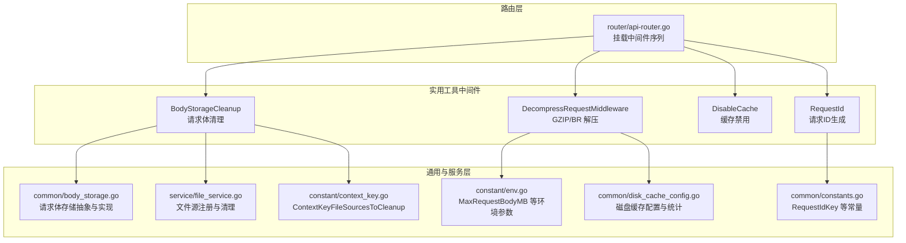
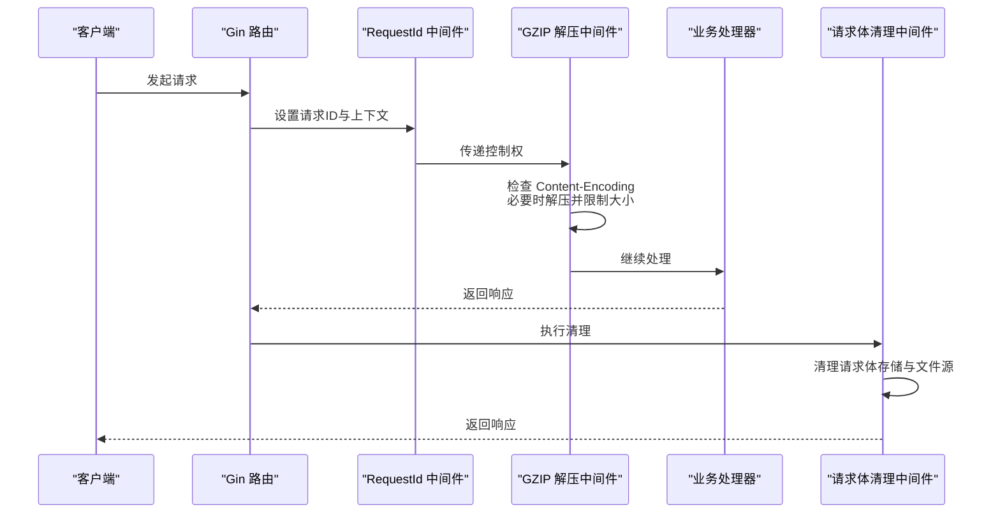
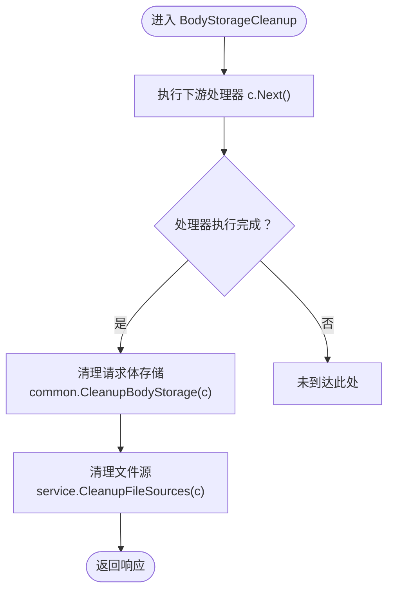
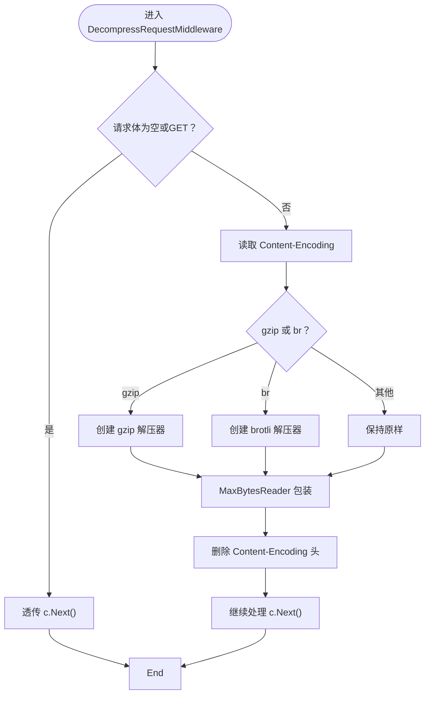
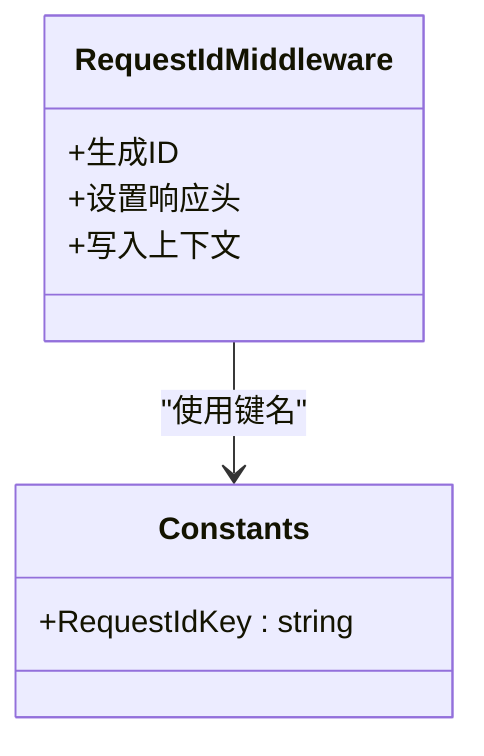
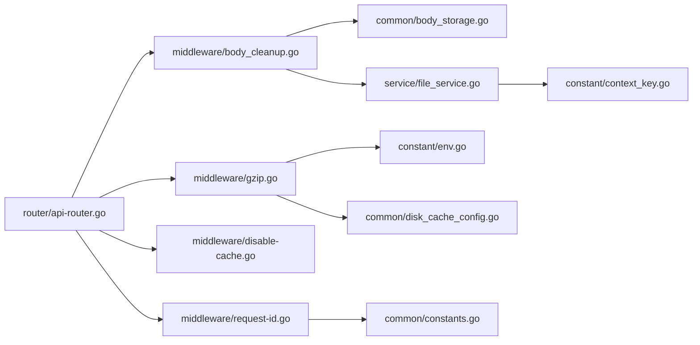

# 实用工具中间件

<cite>
**本文引用的文件**
- [middleware/body_cleanup.go](file://middleware/body_cleanup.go)
- [middleware/gzip.go](file://middleware/gzip.go)
- [middleware/disable-cache.go](file://middleware/disable-cache.go)
- [middleware/request-id.go](file://middleware/request-id.go)
- [middleware/utils.go](file://middleware/utils.go)
- [common/body_storage.go](file://common/body_storage.go)
- [service/file_service.go](file://service/file_service.go)
- [common/constants.go](file://common/constants.go)
- [constant/context_key.go](file://constant/context_key.go)
- [constant/env.go](file://constant/env.go)
- [common/disk_cache_config.go](file://common/disk_cache_config.go)
- [router/api-router.go](file://router/api-router.go)
</cite>

## 目录
1. [简介](#简介)
2. [项目结构](#项目结构)
3. [核心组件](#核心组件)
4. [架构总览](#架构总览)
5. [详细组件分析](#详细组件分析)
6. [依赖分析](#依赖分析)
7. [性能考量](#性能考量)
8. [故障排查指南](#故障排查指南)
9. [结论](#结论)
10. [附录](#附录)

## 简介
本文件系统化梳理 New API 项目的“实用工具中间件”，聚焦以下能力：
- 请求体清理：在请求处理完成后自动释放内存/磁盘缓存与文件资源，防止资源泄漏。
- GZIP 解压：对 gzip/br 压缩请求体进行透明解压，同时限制最大请求体大小，保障稳定性。
- 缓存禁用：设置标准 HTTP 缓存头，避免代理层或浏览器缓存动态响应。
- 请求 ID 生成：为每个请求生成全局唯一标识，贯穿日志与上下文，便于追踪。

文档将说明各中间件的功能特性、配置项、执行顺序与优先级、相互影响、组合使用策略、条件执行与动态配置，并给出与核心模块的协作关系与最佳实践。

## 项目结构
实用工具中间件位于 middleware 目录，配合 common 与 service 层完成资源管理与文件缓存清理；路由层在 API 路由组中按序挂载中间件。

**图表来源**
- [router/api-router.go:14-380](file://router/api-router.go#L14-L380)
- [middleware/body_cleanup.go:1-23](file://middleware/body_cleanup.go#L1-L23)
- [middleware/gzip.go:1-77](file://middleware/gzip.go#L1-L77)
- [middleware/disable-cache.go:1-13](file://middleware/disable-cache.go#L1-L13)
- [middleware/request-id.go:1-31](file://middleware/request-id.go#L1-L31)
- [common/body_storage.go:1-316](file://common/body_storage.go#L1-L316)
- [service/file_service.go:1-608](file://service/file_service.go#L1-L608)
- [common/constants.go:137-139](file://common/constants.go#L137-L139)
- [constant/context_key.go:59-60](file://constant/context_key.go#L59-L60)
- [common/disk_cache_config.go:1-178](file://common/disk_cache_config.go#L1-L178)
- [constant/env.go:12](file://constant/env.go#L12)

**章节来源**
- [router/api-router.go:14-380](file://router/api-router.go#L14-L380)

## 核心组件
- 请求体清理中间件：在 c.Next() 后清理请求体存储与文件源，避免内存/磁盘占用持续增长。
- GZIP 解压中间件：根据 Content-Encoding 自动解压 gzip/br，限制最大请求体大小，保证安全与性能。
- 缓存禁用中间件：设置 Cache-Control/Pragma/Expires 头，阻止缓存。
- 请求 ID 中间件：生成 X-Oneapi-Request-Id 并注入上下文，便于日志与审计。

**章节来源**
- [middleware/body_cleanup.go:9-22](file://middleware/body_cleanup.go#L9-L22)
- [middleware/gzip.go:25-76](file://middleware/gzip.go#L25-L76)
- [middleware/disable-cache.go:5-12](file://middleware/disable-cache.go#L5-L12)
- [middleware/request-id.go:21-30](file://middleware/request-id.go#L21-L30)

## 架构总览
实用工具中间件在 API 路由组中按序挂载，形成稳定的请求生命周期处理链。下图展示了典型请求在中间件中的流转与职责分工。

**图表来源**
- [router/api-router.go:16-18](file://router/api-router.go#L16-L18)
- [middleware/request-id.go:21-29](file://middleware/request-id.go#L21-L29)
- [middleware/gzip.go:25-75](file://middleware/gzip.go#L25-L75)
- [middleware/body_cleanup.go:11-21](file://middleware/body_cleanup.go#L11-L21)

## 详细组件分析

### 请求体清理中间件（BodyStorageCleanup）
- 功能特性
  - 在请求处理完成后自动清理请求体存储（内存/磁盘）。
  - 清理文件源（如 URL 下载的文件），避免临时文件残留。
- 关键实现点
  - 使用 c.Next() 先执行下游处理器，再进行清理，确保响应已生成。
  - 调用公共清理函数与服务层清理函数，分别处理请求体存储与文件源。
- 协作关系
  - 依赖 common 的请求体存储接口与清理逻辑。
  - 依赖 service 的文件源注册与清理机制。
- 配置与动态行为
  - 无显式配置项；清理行为受磁盘缓存开关与阈值影响（见磁盘缓存配置）。
- 性能与兼容性
  - 对于大请求体，磁盘缓存可降低内存峰值；清理阶段及时回收资源。
  - 若磁盘缓存不可用，自动回退至内存存储，清理成本较低。
- 使用建议
  - 建议始终挂载在路由组末尾，确保所有处理器执行完毕后再清理。
  - 与其他需要读取原始请求体的中间件组合时，注意调用顺序。

**图表来源**
- [middleware/body_cleanup.go:11-21](file://middleware/body_cleanup.go#L11-L21)
- [common/body_storage.go:311-316](file://common/body_storage.go#L311-L316)
- [service/file_service.go:142-154](file://service/file_service.go#L142-L154)

**章节来源**
- [middleware/body_cleanup.go:9-22](file://middleware/body_cleanup.go#L9-L22)
- [common/body_storage.go:240-303](file://common/body_storage.go#L240-L303)
- [service/file_service.go:126-154](file://service/file_service.go#L126-L154)

### GZIP 解压中间件（DecompressRequestMiddleware）
- 功能特性
  - 自动识别 gzip/br 压缩请求体并解压。
  - 强制最大请求体大小限制，防止内存膨胀与拒绝服务。
  - 清理 Content-Encoding 头，确保下游逻辑无需感知压缩。
- 关键实现点
  - 通过 Content-Encoding 判断压缩算法，选择对应解压器。
  - 使用 MaxBytesReader 限制读取上限，超限则终止请求。
  - 无论是否解压，均对原始请求体进行大小限制包装。
- 配置与动态行为
  - 最大请求体大小来自环境配置项，若未设置则使用默认值。
  - 与磁盘缓存配置无关，但会影响内存/磁盘缓存命中统计（见磁盘缓存统计）。
- 性能与兼容性
  - 解压与限制读取带来额外 CPU 与内存开销，需结合业务流量评估。
  - 支持常见压缩算法，兼容性良好。
- 使用建议
  - 与缓存禁用中间件组合使用，避免压缩响应被缓存。
  - 对于高并发场景，建议合理设置最大请求体大小，平衡安全与性能。

**图表来源**
- [middleware/gzip.go:25-76](file://middleware/gzip.go#L25-L76)
- [constant/env.go:12](file://constant/env.go#L12)

**章节来源**
- [middleware/gzip.go:25-76](file://middleware/gzip.go#L25-L76)
- [constant/env.go:12](file://constant/env.go#L12)

### 缓存禁用中间件（DisableCache）
- 功能特性
  - 设置标准 HTTP 缓存头，禁止缓存动态响应。
- 关键实现点
  - 设置 Cache-Control、Pragma、Expires 头，确保响应不会被缓存。
- 配置与动态行为
  - 无配置项；行为固定。
- 使用建议
  - 与 GZIP 解压中间件组合使用，避免压缩响应被缓存。
  - 对于需要缓存的静态资源，应单独配置静态文件路由，避免污染动态响应。

**章节来源**
- [middleware/disable-cache.go:5-12](file://middleware/disable-cache.go#L5-L12)

### 请求 ID 中间件（RequestId）
- 功能特性
  - 生成全局唯一请求 ID，注入响应头与上下文，便于日志追踪。
- 关键实现点
  - 使用时间戳、构建信息摘要与随机字符串拼接生成 ID。
  - 将 ID 写入响应头与 gin 上下文，键名为 RequestIdKey。
- 配置与动态行为
  - 无配置项；ID 生成策略固定。
- 使用建议
  - 建议在路由组最前端挂载，确保后续中间件与处理器均可访问该 ID。
  - 与错误处理工具函数配合，统一输出带请求 ID 的错误消息。

**图表来源**
- [middleware/request-id.go:21-30](file://middleware/request-id.go#L21-L30)
- [common/constants.go:137-139](file://common/constants.go#L137-L139)

**章节来源**
- [middleware/request-id.go:21-30](file://middleware/request-id.go#L21-L30)
- [common/constants.go:137-139](file://common/constants.go#L137-L139)

### 错误处理工具（abortWithOpenAiMessage / abortWithMidjourneyMessage）
- 功能特性
  - 统一错误响应格式，自动附加请求 ID 与用户标识，便于定位问题。
- 关键实现点
  - 构造 JSON 错误体，包含 message、type、code 等字段。
  - 记录错误日志，支持可选错误码与描述。
- 使用建议
  - 在处理器中遇到异常时调用，确保错误消息标准化。
  - 与 RequestId 中间件配合，日志中可直接关联请求 ID。

**章节来源**
- [middleware/utils.go:12-37](file://middleware/utils.go#L12-L37)

## 依赖分析
- 中间件之间的耦合度低，职责清晰，便于独立测试与替换。
- 与公共模块的耦合体现在：
  - 请求体清理依赖 common 的存储接口与清理函数。
  - 文件源清理依赖 service 的注册与清理流程。
  - 请求 ID 依赖 common 的常量键名。
  - GZIP 中间件依赖环境配置项与磁盘缓存统计。
- 路由层通过 API 路由组集中挂载，形成稳定的执行顺序。

**图表来源**
- [router/api-router.go:16-18](file://router/api-router.go#L16-L18)
- [middleware/body_cleanup.go:11-21](file://middleware/body_cleanup.go#L11-L21)
- [middleware/gzip.go:31-35](file://middleware/gzip.go#L31-L35)
- [middleware/request-id.go:23-27](file://middleware/request-id.go#L23-L27)
- [service/file_service.go:127-140](file://service/file_service.go#L127-L140)
- [constant/context_key.go:59-60](file://constant/context_key.go#L59-L60)
- [common/disk_cache_config.go:30-41](file://common/disk_cache_config.go#L30-L41)
- [common/constants.go:137-139](file://common/constants.go#L137-L139)
- [constant/env.go:12](file://constant/env.go#L12)

**章节来源**
- [router/api-router.go:14-380](file://router/api-router.go#L14-L380)

## 性能考量
- 请求体清理
  - 大请求体优先使用磁盘缓存，减少内存峰值；清理阶段及时回收，避免碎片化。
  - 磁盘缓存可用性与阈值由配置决定，清理统计可用于监控资源使用。
- GZIP 解压
  - 解压与大小限制带来 CPU 与内存消耗，建议结合业务流量与硬件资源评估。
  - 默认最大请求体大小可由环境变量调整，避免过大请求导致内存压力。
- 缓存禁用
  - 对动态响应禁用缓存，避免不必要的缓存穿透与过期问题。
- 请求 ID
  - 生成成本极低，但能显著提升可观测性与排障效率。

[本节为通用性能讨论，不直接分析具体文件]

## 故障排查指南
- 请求体过大导致失败
  - 现象：请求被拒绝或返回错误。
  - 排查：检查环境配置的最大请求体大小；确认是否启用磁盘缓存；查看磁盘缓存统计。
  - 参考
    - [middleware/gzip.go:31-35](file://middleware/gzip.go#L31-L35)
    - [constant/env.go:12](file://constant/env.go#L12)
    - [common/disk_cache_config.go:169-177](file://common/disk_cache_config.go#L169-L177)
- 请求体清理未生效
  - 现象：内存/磁盘占用持续增长。
  - 排查：确认中间件挂载顺序是否正确；检查是否存在提前返回或异常中断。
  - 参考
    - [middleware/body_cleanup.go:11-21](file://middleware/body_cleanup.go#L11-L21)
    - [common/body_storage.go:311-316](file://common/body_storage.go#L311-L316)
    - [service/file_service.go:142-154](file://service/file_service.go#L142-L154)
- 错误消息缺少请求 ID
  - 现象：日志中无法关联请求。
  - 排查：确认 RequestId 中间件是否在路由组前端挂载；检查响应头是否包含请求 ID。
  - 参考
    - [middleware/request-id.go:23-27](file://middleware/request-id.go#L23-L27)
    - [common/constants.go:137-139](file://common/constants.go#L137-L139)
    - [middleware/utils.go:18-24](file://middleware/utils.go#L18-L24)

**章节来源**
- [middleware/gzip.go:31-35](file://middleware/gzip.go#L31-L35)
- [constant/env.go:12](file://constant/env.go#L12)
- [common/disk_cache_config.go:169-177](file://common/disk_cache_config.go#L169-L177)
- [middleware/body_cleanup.go:11-21](file://middleware/body_cleanup.go#L11-L21)
- [common/body_storage.go:311-316](file://common/body_storage.go#L311-L316)
- [service/file_service.go:142-154](file://service/file_service.go#L142-L154)
- [middleware/request-id.go:23-27](file://middleware/request-id.go#L23-L27)
- [common/constants.go:137-139](file://common/constants.go#L137-L139)
- [middleware/utils.go:18-24](file://middleware/utils.go#L18-L24)

## 结论
实用工具中间件通过明确的职责划分与稳定的执行顺序，为请求生命周期提供了可靠保障：
- 请求体清理确保资源及时回收；
- GZIP 解压在安全与性能之间取得平衡；
- 缓存禁用避免缓存污染；
- 请求 ID 提升可观测性与排障效率。

建议在路由组中按“请求 ID → GZIP 解压 → 缓存禁用 → 请求体清理”的顺序挂载，并结合磁盘缓存配置与环境参数进行动态调优。

[本节为总结性内容，不直接分析具体文件]

## 附录

### 中间件执行顺序与优先级
- 在 API 路由组中，中间件按声明顺序依次执行，先挂载者先执行。
- 建议顺序
  1) RequestId（最先，便于全链路追踪）
  2) DecompressRequestMiddleware（解压与限制）
  3) DisableCache（禁用缓存）
  4) BodyStorageCleanup（最后，确保清理）

**章节来源**
- [router/api-router.go:16-18](file://router/api-router.go#L16-L18)

### 配置项与常量参考
- 最大请求体大小（MB）
  - 来源：环境配置项
  - 参考：[constant/env.go:12](file://constant/env.go#L12)
- 磁盘缓存配置
  - 开关、阈值、最大大小、路径
  - 参考：[common/disk_cache_config.go:8-69](file://common/disk_cache_config.go#L8-L69)
- 请求 ID 键名
  - 参考：[common/constants.go:137-139](file://common/constants.go#L137-L139)
- 文件源清理上下文键
  - 参考：[constant/context_key.go:59-60](file://constant/context_key.go#L59-L60)

**章节来源**
- [constant/env.go:12](file://constant/env.go#L12)
- [common/disk_cache_config.go:8-69](file://common/disk_cache_config.go#L8-L69)
- [common/constants.go:137-139](file://common/constants.go#L137-L139)
- [constant/context_key.go:59-60](file://constant/context_key.go#L59-L60)