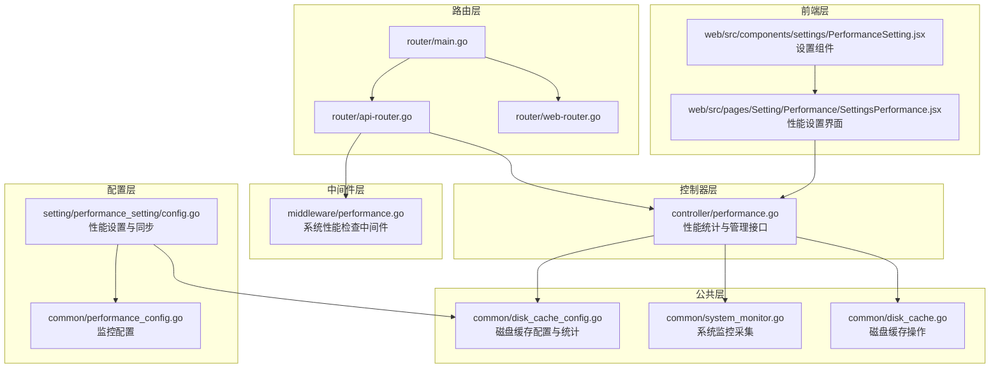
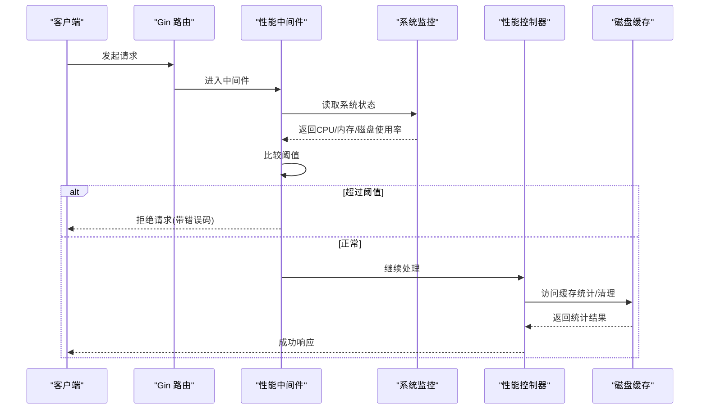
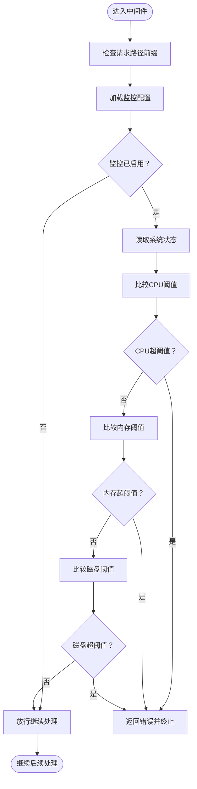
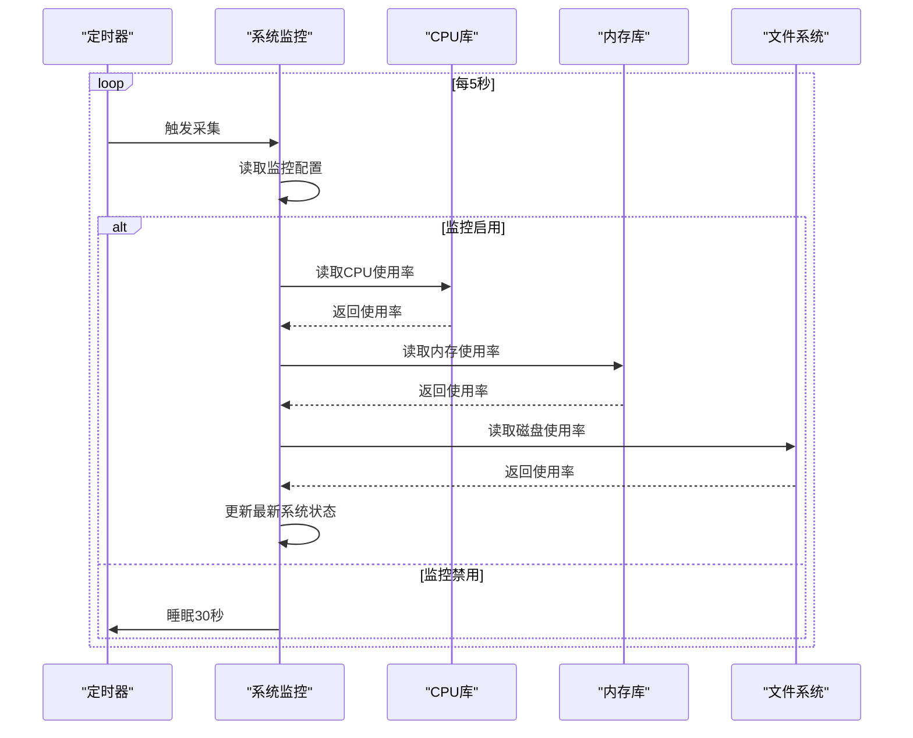
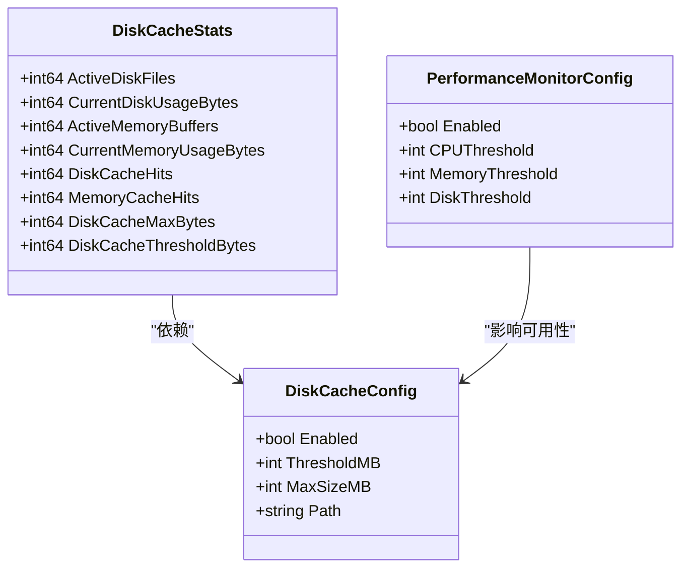
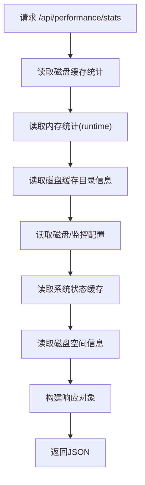
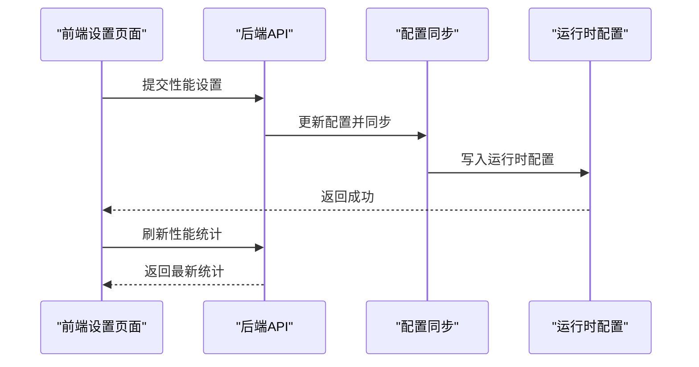
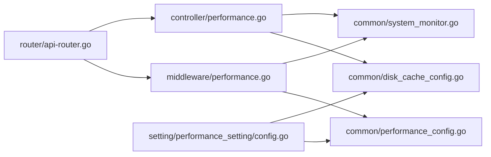

# 性能监控中间件

<cite>
**本文档引用的文件**
- [middleware/performance.go](file://middleware/performance.go)
- [controller/performance.go](file://controller/performance.go)
- [setting/performance_setting/config.go](file://setting/performance_setting/config.go)
- [common/performance_config.go](file://common/performance_config.go)
- [common/system_monitor.go](file://common/system_monitor.go)
- [common/disk_cache_config.go](file://common/disk_cache_config.go)
- [common/disk_cache.go](file://common/disk_cache.go)
- [web/src/pages/Setting/Performance/SettingsPerformance.jsx](file://web/src/pages/Setting/Performance/SettingsPerformance.jsx)
- [web/src/components/settings/PerformanceSetting.jsx](file://web/src/components/settings/PerformanceSetting.jsx)
- [router/main.go](file://router/main.go)
- [router/api-router.go](file://router/api-router.go)
- [router/web-router.go](file://router/web-router.go)
</cite>

## 目录
1. [简介](#简介)
2. [项目结构](#项目结构)
3. [核心组件](#核心组件)
4. [架构概览](#架构概览)
5. [详细组件分析](#详细组件分析)
6. [依赖关系分析](#依赖关系分析)
7. [性能考量](#性能考量)
8. [故障排除指南](#故障排除指南)
9. [结论](#结论)
10. [附录](#附录)

## 简介
本文件为 New API 项目的性能监控中间件提供全面技术文档。该中间件通过系统资源监控、磁盘缓存策略与管理接口，帮助开发者在高负载场景下维持服务稳定性，并提供实时性能仪表板与历史趋势分析能力。文档覆盖设计原理、实现机制、配置选项、阈值设置、告警与导出、瓶颈识别与优化建议，以及与系统监控、APM 工具和运维平台的集成关系。

## 项目结构
性能监控相关代码分布在以下模块：
- 中间件层：系统性能检查中间件，拦截特定路由并进行阈值校验
- 控制器层：性能统计查询、磁盘缓存清理、GC 强制触发等管理接口
- 配置层：性能设置与配置同步，支持热更新
- 公共层：系统监控采集、磁盘缓存配置与统计、系统状态缓存
- 前端层：性能设置界面与统计展示

**图表来源**
- [middleware/performance.go:1-72](file://middleware/performance.go#L1-L72)
- [controller/performance.go:1-386](file://controller/performance.go#L1-L386)
- [setting/performance_setting/config.go:1-86](file://setting/performance_setting/config.go#L1-L86)
- [common/performance_config.go:1-34](file://common/performance_config.go#L1-L34)
- [common/system_monitor.go:1-82](file://common/system_monitor.go#L1-L82)
- [common/disk_cache_config.go:1-178](file://common/disk_cache_config.go#L1-L178)
- [common/disk_cache.go:1-177](file://common/disk_cache.go#L1-L177)
- [router/main.go:1-36](file://router/main.go#L1-L36)
- [router/api-router.go:1-35](file://router/api-router.go#L1-L35)
- [router/web-router.go:1-30](file://router/web-router.go#L1-L30)
- [web/src/pages/Setting/Performance/SettingsPerformance.jsx:1-737](file://web/src/pages/Setting/Performance/SettingsPerformance.jsx#L1-L737)
- [web/src/components/settings/PerformanceSetting.jsx:1-81](file://web/src/components/settings/PerformanceSetting.jsx#L1-L81)

**章节来源**
- [middleware/performance.go:1-72](file://middleware/performance.go#L1-L72)
- [controller/performance.go:1-386](file://controller/performance.go#L1-L386)
- [setting/performance_setting/config.go:1-86](file://setting/performance_setting/config.go#L1-L86)
- [common/performance_config.go:1-34](file://common/performance_config.go#L1-L34)
- [common/system_monitor.go:1-82](file://common/system_monitor.go#L1-L82)
- [common/disk_cache_config.go:1-178](file://common/disk_cache_config.go#L1-L178)
- [common/disk_cache.go:1-177](file://common/disk_cache.go#L1-L177)
- [router/main.go:1-36](file://router/main.go#L1-L36)
- [router/api-router.go:1-35](file://router/api-router.go#L1-L35)
- [router/web-router.go:1-30](file://router/web-router.go#L1-L30)
- [web/src/pages/Setting/Performance/SettingsPerformance.jsx:1-737](file://web/src/pages/Setting/Performance/SettingsPerformance.jsx#L1-L737)
- [web/src/components/settings/PerformanceSetting.jsx:1-81](file://web/src/components/settings/PerformanceSetting.jsx#L1-L81)

## 核心组件
- 系统性能检查中间件：对特定路由（如 /v1/messages）进行系统资源阈值检查，超限时拒绝请求并返回对应错误格式
- 系统监控采集：定时采集 CPU、内存、磁盘使用率，缓存最新状态供中间件与控制器使用
- 磁盘缓存策略：根据请求体大小自动选择内存或磁盘缓存，控制缓存大小与命中统计
- 性能统计控制器：提供性能统计查询、缓存清理、GC 强制触发、日志文件管理等管理接口
- 性能设置与同步：将前端配置同步至运行时配置，支持热更新

**章节来源**
- [middleware/performance.go:13-38](file://middleware/performance.go#L13-L38)
- [common/system_monitor.go:36-81](file://common/system_monitor.go#L36-L81)
- [common/disk_cache_config.go:71-178](file://common/disk_cache_config.go#L71-L178)
- [controller/performance.go:82-176](file://controller/performance.go#L82-L176)
- [setting/performance_setting/config.go:49-85](file://setting/performance_setting/config.go#L49-L85)

## 架构概览
性能监控中间件采用“中间件 + 采集 + 管理”的分层架构：
- 中间件层在请求进入时快速决策，避免过载
- 采集层异步维护系统状态，降低请求路径开销
- 管理层提供查询与运维能力，支撑仪表板与告警

**图表来源**
- [middleware/performance.go:14-37](file://middleware/performance.go#L14-L37)
- [common/system_monitor.go:78-81](file://common/system_monitor.go#L78-L81)
- [controller/performance.go:82-140](file://controller/performance.go#L82-L140)
- [common/disk_cache_config.go:93-106](file://common/disk_cache_config.go#L93-L106)

## 详细组件分析

### 系统性能检查中间件
- 功能：对指定路由进行系统资源阈值检查，超限则拒绝请求
- 路由匹配：基于路径前缀判断是否为 Relay 接口
- 错误处理：根据请求类型返回不同错误格式（Claude/OpenAI）
- 配置来源：读取运行时监控配置与系统状态

**图表来源**
- [middleware/performance.go:14-37](file://middleware/performance.go#L14-L37)
- [middleware/performance.go:41-71](file://middleware/performance.go#L41-L71)

**章节来源**
- [middleware/performance.go:13-38](file://middleware/performance.go#L13-L38)
- [middleware/performance.go:40-71](file://middleware/performance.go#L40-L71)

### 系统监控采集
- 定时任务：每 5 秒采集一次系统状态，支持开关控制
- 数据源：CPU 使用率、内存使用率、磁盘使用率
- 缓存机制：使用原子值缓存最新状态，降低读取成本
- 采集逻辑：首次调用可能不稳定，循环中逐步趋于稳定

**图表来源**
- [common/system_monitor.go:36-81](file://common/system_monitor.go#L36-L81)

**章节来源**
- [common/system_monitor.go:36-81](file://common/system_monitor.go#L36-L81)

### 磁盘缓存配置与统计
- 配置项：启用开关、阈值（MB）、最大大小（MB）、缓存目录
- 统计项：活跃磁盘文件数、当前磁盘使用量、活跃内存缓冲数、内存使用量、命中次数
- 原子计数：使用原子变量保证并发安全
- 可用性检查：根据当前使用量与阈值判断是否可创建新缓存

**图表来源**
- [common/disk_cache_config.go:8-89](file://common/disk_cache_config.go#L8-L89)
- [common/performance_config.go:5-11](file://common/performance_config.go#L5-L11)

**章节来源**
- [common/disk_cache_config.go:71-178](file://common/disk_cache_config.go#L71-L178)
- [common/performance_config.go:5-33](file://common/performance_config.go#L5-L33)

### 性能统计控制器
- 统计内容：缓存统计、内存统计、磁盘缓存目录信息、磁盘空间信息、配置信息
- 管理接口：清理不活跃磁盘缓存、重置统计、强制 GC、日志文件列表与清理
- 优化策略：避免全量扫描磁盘，依赖原子计数器；系统状态缓存减少频繁系统调用

**图表来源**
- [controller/performance.go:82-140](file://controller/performance.go#L82-L140)

**章节来源**
- [controller/performance.go:19-140](file://controller/performance.go#L19-L140)

### 性能设置与前端集成
- 设置项：磁盘缓存开关、阈值、最大大小、缓存目录；监控开关、CPU/内存/磁盘阈值
- 同步机制：前端提交配置后，后端同步至运行时配置
- 前端界面：提供性能统计展示、缓存清理、GC 触发、日志清理等功能入口

**图表来源**
- [web/src/pages/Setting/Performance/SettingsPerformance.jsx:89-123](file://web/src/pages/Setting/Performance/SettingsPerformance.jsx#L89-L123)
- [setting/performance_setting/config.go:71-85](file://setting/performance_setting/config.go#L71-L85)

**章节来源**
- [web/src/pages/Setting/Performance/SettingsPerformance.jsx:61-123](file://web/src/pages/Setting/Performance/SettingsPerformance.jsx#L61-L123)
- [web/src/components/settings/PerformanceSetting.jsx:25-81](file://web/src/components/settings/PerformanceSetting.jsx#L25-L81)
- [setting/performance_setting/config.go:49-85](file://setting/performance_setting/config.go#L49-L85)

## 依赖关系分析
- 中间件依赖公共层的系统状态与配置
- 控制器依赖磁盘缓存配置与系统监控
- 配置层负责将设置同步到公共层
- 路由层将中间件与控制器挂载到相应路由组

**图表来源**
- [middleware/performance.go:1-11](file://middleware/performance.go#L1-L11)
- [controller/performance.go:1-17](file://controller/performance.go#L1-L17)
- [setting/performance_setting/config.go:1-6](file://setting/performance_setting/config.go#L1-L6)
- [router/api-router.go:1-12](file://router/api-router.go#L1-L12)

**章节来源**
- [middleware/performance.go:1-11](file://middleware/performance.go#L1-L11)
- [controller/performance.go:1-17](file://controller/performance.go#L1-L17)
- [setting/performance_setting/config.go:1-6](file://setting/performance_setting/config.go#L1-L6)
- [router/api-router.go:1-12](file://router/api-router.go#L1-L12)

## 性能考量
- 采样频率：系统监控每 5 秒采集一次，兼顾准确性与开销
- 并发安全：磁盘缓存统计使用原子计数器，避免锁竞争
- 缓存策略：磁盘缓存按请求体大小阈值自动切换，减少内存压力
- I/O 优化：磁盘缓存目录信息按需读取，避免全量扫描
- 前端交互：性能统计接口为管理用途，调用频率低，直接读取系统信息可接受

[本节为通用性能讨论，无需具体文件来源]

## 故障排除指南
- 中间件拒绝请求
  - 检查监控配置是否启用及阈值设置
  - 查看系统状态缓存是否正常更新
  - 确认请求路径是否匹配中间件判定规则
- 磁盘缓存异常
  - 检查缓存目录权限与可用空间
  - 确认缓存阈值与最大大小设置合理
  - 使用清理接口移除不活跃缓存文件
- 性能统计不准确
  - 确认系统监控定时任务正常运行
  - 检查磁盘缓存统计是否被重置或同步

**章节来源**
- [middleware/performance.go:40-71](file://middleware/performance.go#L40-L71)
- [common/system_monitor.go:36-50](file://common/system_monitor.go#L36-L50)
- [controller/performance.go:142-176](file://controller/performance.go#L142-L176)
- [common/disk_cache_config.go:158-178](file://common/disk_cache_config.go#L158-L178)

## 结论
该性能监控中间件通过轻量级的系统资源阈值检查、高效的磁盘缓存策略与完善的管理接口，为 New API 在高并发场景下的稳定性提供了坚实保障。配合前端仪表板与历史趋势分析，开发者可以快速定位瓶颈并进行针对性优化。建议在生产环境中结合 APM 工具与运维平台，实现更全面的可观测性与自动化运维。

[本节为总结性内容，无需具体文件来源]

## 附录

### 性能配置选项与阈值设置
- 磁盘缓存
  - 开关：是否启用磁盘缓存
  - 阈值（MB）：超过该大小的请求体会使用磁盘缓存
  - 最大大小（MB）：磁盘缓存占用的最大空间
  - 目录：留空使用系统临时目录
- 系统性能监控
  - 开关：是否启用性能监控
  - CPU 阈值（%）：CPU 使用率超过该值时拒绝新请求
  - 内存阈值（%）：内存使用率超过该值时拒绝新请求
  - 磁盘阈值（%）：磁盘使用率超过该值时拒绝新请求

**章节来源**
- [setting/performance_setting/config.go:8-27](file://setting/performance_setting/config.go#L8-L27)
- [web/src/pages/Setting/Performance/SettingsPerformance.jsx:265-397](file://web/src/pages/Setting/Performance/SettingsPerformance.jsx#L265-L397)

### 监控数据导出与仪表板
- 导出能力：性能统计接口返回 JSON，可对接外部监控系统
- 实时仪表板：前端提供性能统计卡片、缓存使用进度条、内存统计表等
- 历史趋势：结合外部时序数据库可实现历史趋势分析

**章节来源**
- [controller/performance.go:82-140](file://controller/performance.go#L82-L140)
- [web/src/pages/Setting/Performance/SettingsPerformance.jsx:508-733](file://web/src/pages/Setting/Performance/SettingsPerformance.jsx#L508-L733)

### 与系统监控、APM 工具和运维平台的关系
- 系统监控：gopsutil 提供 CPU/内存/磁盘使用率采集
- APM 工具：可通过性能统计接口与外部 APM 平台集成
- 运维平台：支持通过管理接口进行缓存清理、GC 触发、日志清理等运维操作

**章节来源**
- [common/system_monitor.go:7-8](file://common/system_monitor.go#L7-L8)
- [controller/performance.go:142-176](file://controller/performance.go#L142-L176)
- [web/src/pages/Setting/Performance/SettingsPerformance.jsx:139-175](file://web/src/pages/Setting/Performance/SettingsPerformance.jsx#L139-L175)