# 日志中间件

<cite>
**本文档引用的文件**
- [logger.go](file://logger/logger.go)
- [middleware_logger.go](file://middleware/logger.go)
- [controller_log.go](file://controller/log.go)
- [model_log.go](file://model/log.go)
- [service_log_info_generate.go](file://service/log_info_generate.go)
- [common_sys_log.go](file://common/sys_log.go)
- [common_constants.go](file://common/constants.go)
- [setting_general_setting.go](file://setting/operation_setting/general_setting.go)
- [setting_performance_config.go](file://setting/performance_setting/config.go)
- [main.go](file://main.go)
- [controller_performance.go](file://controller/performance.go)
- [system_monitor.go](file://common/system_monitor.go)
</cite>

## 目录
1. [简介](#简介)
2. [项目结构](#项目结构)
3. [核心组件](#核心组件)
4. [架构概览](#架构概览)
5. [详细组件分析](#详细组件分析)
6. [依赖关系分析](#依赖关系分析)
7. [性能考虑](#性能考虑)
8. [故障排除指南](#故障排除指南)
9. [结论](#结论)
10. [附录](#附录)

## 简介

New API 项目的日志中间件是一个经过精心设计的可观测性基础设施，提供了全面的日志记录解决方案。该系统采用多层架构设计，支持请求日志、响应日志、错误日志和系统日志的统一管理。

日志中间件的核心特性包括：
- **结构化日志格式**：统一的格式标准，便于日志分析和检索
- **多级别日志管理**：支持 INFO、WARN、ERROR、DEBUG 等不同级别的日志
- **异步日志写入**：通过 goroutine 池实现非阻塞的日志记录
- **自动轮转机制**：基于日志数量的智能文件轮转
- **敏感信息过滤**：在用户日志中自动过滤敏感数据
- **性能监控集成**：与系统监控和性能分析紧密集成

## 项目结构

日志系统在项目中的组织结构如下：

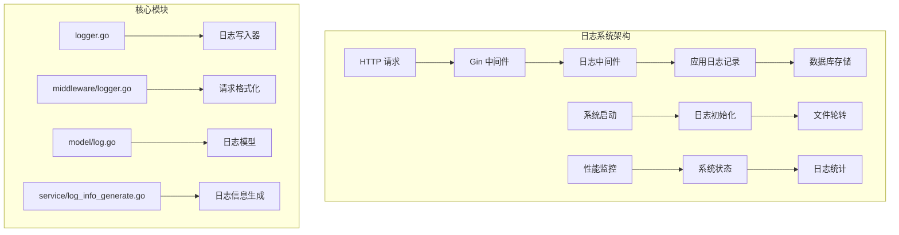

**图表来源**
- [logger.go:1-182](file://logger/logger.go#L1-L182)
- [middleware_logger.go:1-41](file://middleware/logger.go#L1-L41)
- [model_log.go:1-482](file://model/log.go#L1-L482)

**章节来源**
- [logger.go:1-182](file://logger/logger.go#L1-L182)
- [middleware_logger.go:1-41](file://middleware/logger.go#L1-L41)
- [model_log.go:1-482](file://model/log.go#L1-L482)

## 核心组件

### 日志中间件核心功能

日志中间件提供了以下核心功能：

#### 1. 请求日志记录
- **Gin 集成**：通过 Gin 的 LoggerWithFormatter 实现请求级别的日志记录
- **请求标识**：自动提取和记录 Request-Id，便于请求追踪
- **性能指标**：记录响应状态码、延迟时间、客户端 IP 等关键指标

#### 2. 应用日志管理
- **多级别支持**：INFO、WARN、ERROR、DEBUG 四种日志级别
- **上下文感知**：自动关联请求上下文和用户信息
- **异步写入**：使用 goroutine 池实现非阻塞的日志记录

#### 3. 错误日志处理
- **自动捕获**：集成 Gin 的 Recovery 中间件，自动捕获 panic 和异常
- **详细信息**：记录错误堆栈信息和上下文数据
- **降级处理**：即使日志系统故障也不会影响主业务流程

**章节来源**
- [logger.go:76-118](file://logger/logger.go#L76-L118)
- [middleware_logger.go:19-40](file://middleware/logger.go#L19-L40)

## 架构概览

日志系统的整体架构采用分层设计，确保了高内聚低耦合的特性：

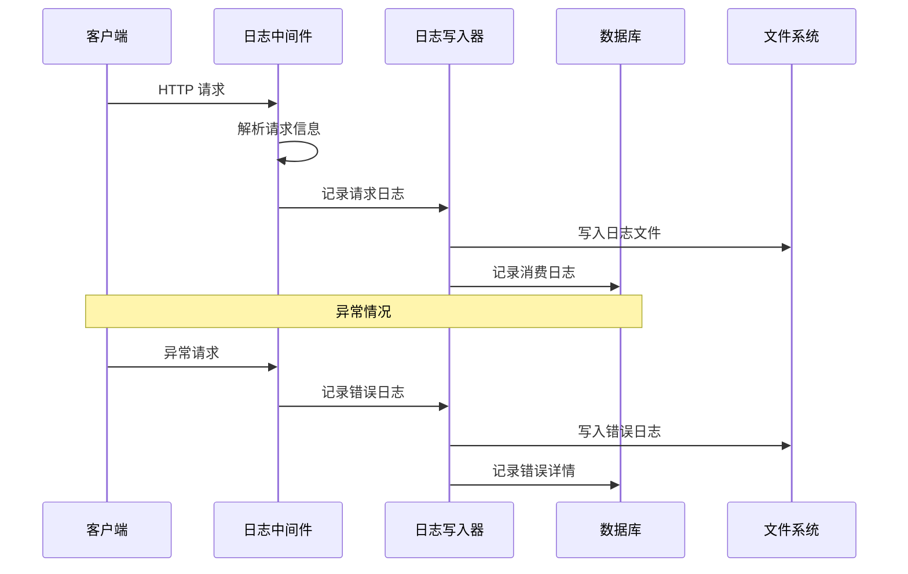

**图表来源**
- [main.go:155-170](file://main.go#L155-L170)
- [logger.go:42-74](file://logger/logger.go#L42-L74)
- [model_log.go:152-201](file://model/log.go#L152-L201)

### 组件交互关系

```mermaid
classDiagram
class LoggerMiddleware {
+SetUpLogger(server) void
+RouteTag(tag) HandlerFunc
}
class LogWriter {
+LogInfo(ctx, msg) void
+LogWarn(ctx, msg) void
+LogError(ctx, msg) void
+LogDebug(ctx, msg) void
+SetupLogger() void
}
class LogModel {
+RecordConsumeLog(ctx, userId, params) void
+RecordErrorLog(ctx, userId, channelId, ...) void
+GetAllLogs(...) []*Log
+GetUserLogs(...) []*Log
}
class LogInfoGenerator {
+GenerateTextOtherInfo(...) map[string]interface{}
+GenerateAudioOtherInfo(...) map[string]interface{}
+GenerateClaudeOtherInfo(...) map[string]interface{}
}
LoggerMiddleware --> LogWriter : 使用
LogWriter --> LogModel : 记录
LogModel --> LogInfoGenerator : 生成
LogInfoGenerator --> LogModel : 数据
```

**图表来源**
- [middleware_logger.go:12-40](file://middleware/logger.go#L12-L40)
- [logger.go:76-182](file://logger/logger.go#L76-L182)
- [model_log.go:137-244](file://model/log.go#L137-L244)
- [service_log_info_generate.go:34-265](file://service/log_info_generate.go#L34-L265)

## 详细组件分析

### 日志中间件实现

#### 请求日志中间件

日志中间件通过 Gin 的中间件机制实现，提供灵活的请求日志记录功能：

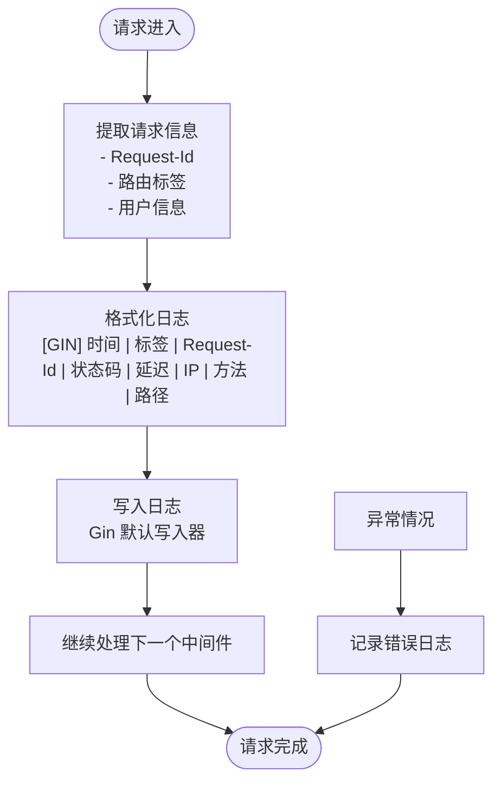

**图表来源**
- [middleware_logger.go:19-40](file://middleware/logger.go#L19-L40)

#### 日志级别管理

系统实现了完整的日志级别管理体系：

| 日志级别 | 用途 | 输出目标 | 条件 |
|---------|------|----------|------|
| DEBUG | 调试信息 | 标准输出 | DebugEnabled=true |
| INFO | 一般信息 | 标准输出 | 始终 |
| WARN | 警告信息 | 标准输出 | 始终 |
| ERROR | 错误信息 | 标准错误 | 始终 |

**章节来源**
- [logger.go:20-25](file://logger/logger.go#L20-L25)
- [logger.go:76-95](file://logger/logger.go#L76-L95)

### 日志写入器

#### 文件轮转机制

日志写入器实现了智能的文件轮转功能：

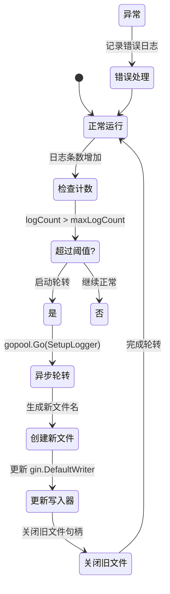

**图表来源**
- [logger.go:111-118](file://logger/logger.go#L111-L118)
- [logger.go:42-74](file://logger/logger.go#L42-L74)

#### 结构化日志格式

系统采用统一的结构化日志格式：

**请求日志格式**：
```
[GIN] 2006/01/02 - 15:04:05 | 标签 | Request-Id | 200 | 123.456µs | 192.168.1.1 | GET | /api/users
```

**应用日志格式**：
```
[INFO] 2006/01/02 - 15:04:05 | Request-Id | 日志消息内容
```

**章节来源**
- [middleware_logger.go:29-38](file://middleware/logger.go#L29-L38)
- [logger.go:107-108](file://logger/logger.go#L107-L108)

### 日志模型和数据存储

#### 日志数据模型

日志系统使用统一的数据模型来存储不同类型的信息：

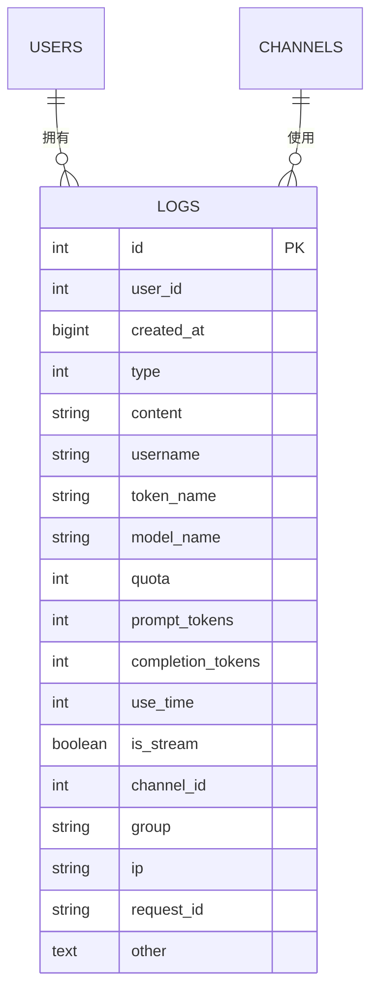

**图表来源**
- [model_log.go:19-40](file://model/log.go#L19-L40)

#### 日志类型分类

系统定义了多种日志类型，每种类型都有特定的用途：

| 日志类型 | 编号 | 描述 | 主要字段 |
|---------|------|------|----------|
| Unknown | 0 | 未知类型 | 通用日志 |
| Topup | 1 | 充值记录 | 充值金额、方式 |
| Consume | 2 | 消费记录 | 额度消耗、tokens |
| Manage | 3 | 管理操作 | 管理员操作 |
| System | 4 | 系统日志 | 系统状态、事件 |
| Error | 5 | 错误日志 | 错误详情、堆栈 |
| Refund | 6 | 退款记录 | 退款金额、原因 |

**章节来源**
- [model_log.go:42-51](file://model_log.go#L42-L51)

### 敏感信息过滤

#### 用户日志安全处理

系统在用户日志中实现了敏感信息的自动过滤机制：

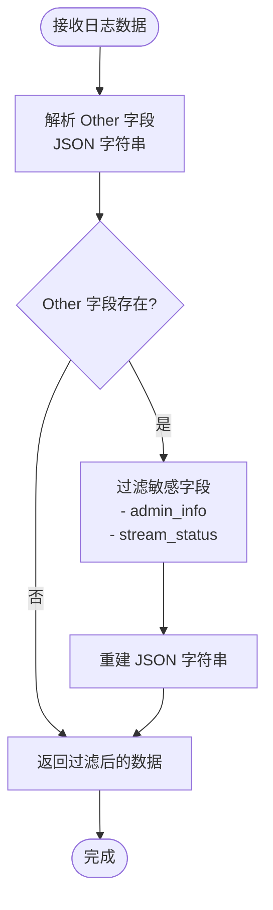

**图表来源**
- [model_log.go:53-67](file://model_log.go#L53-L67)

#### 过滤规则

系统自动过滤以下敏感信息：
- `admin_info`：管理员专用调试信息
- `stream_status`：流式处理状态详情

这些信息仅对管理员可见，普通用户无法查看。

**章节来源**
- [model_log.go:59-62](file://model_log.go#L59-L62)

### 日志配置选项

#### 配置参数详解

系统提供了丰富的日志配置选项：

| 配置项 | 类型 | 默认值 | 描述 |
|--------|------|--------|------|
| LogConsumeEnabled | bool | true | 是否记录消费日志 |
| DebugEnabled | bool | false | 是否启用调试模式 |
| LogDir | string | "" | 日志文件目录 |
| RequestIdKey | string | "X-Oneapi-Request-Id" | 请求标识键名 |

**章节来源**
- [common_constants.go:75](file://common/constants.go#L75)
- [common_constants.go:138](file://common/constants.go#L138)

#### 额度显示配置

系统支持多种额度显示格式：

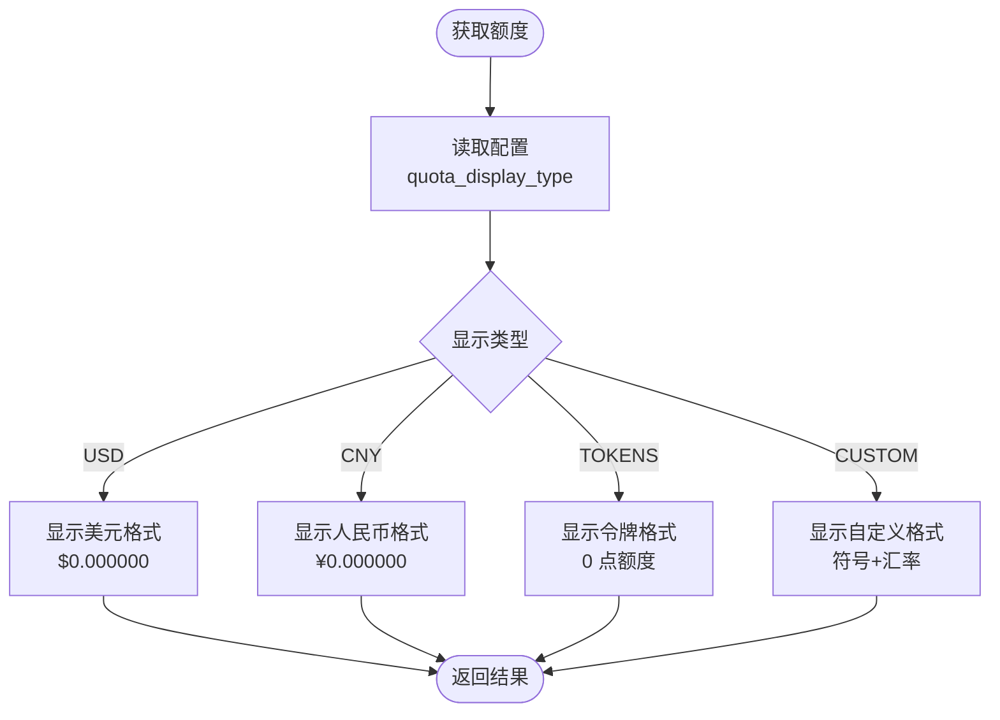

**图表来源**
- [setting_general_setting.go:17-23](file://setting/operation_setting/general_setting.go#L17-L23)
- [logger.go:123-144](file://logger/logger.go#L123-L144)

**章节来源**
- [setting_general_setting.go:54-92](file://setting/operation_setting/general_setting.go#L54-L92)
- [logger.go:120-171](file://logger/logger.go#L120-L171)

### 输出目标和轮转策略

#### 多目标输出

日志系统支持同时向多个目标输出：

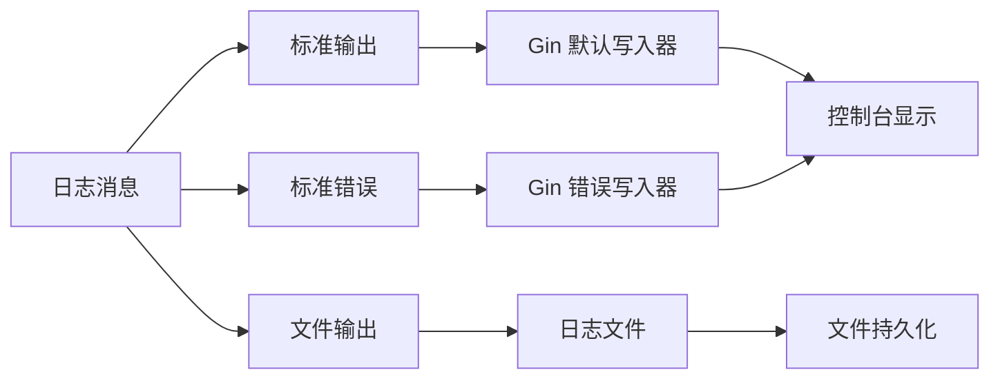

**图表来源**
- [logger.go:66-72](file://logger/logger.go#L66-L72)

#### 轮转策略

系统采用智能的轮转策略：

1. **基于计数的轮转**：当日志条数超过阈值时触发轮转
2. **异步处理**：使用 goroutine 池避免阻塞主线程
3. **原子切换**：通过互斥锁确保写入器切换的原子性
4. **资源清理**：自动关闭旧文件句柄，释放系统资源

**章节来源**
- [logger.go:111-118](file://logger/logger.go#L111-L118)
- [logger.go:66-72](file://logger/logger.go#L66-L72)

### 性能监控和审计追踪

#### 性能监控集成

日志系统与性能监控紧密集成：

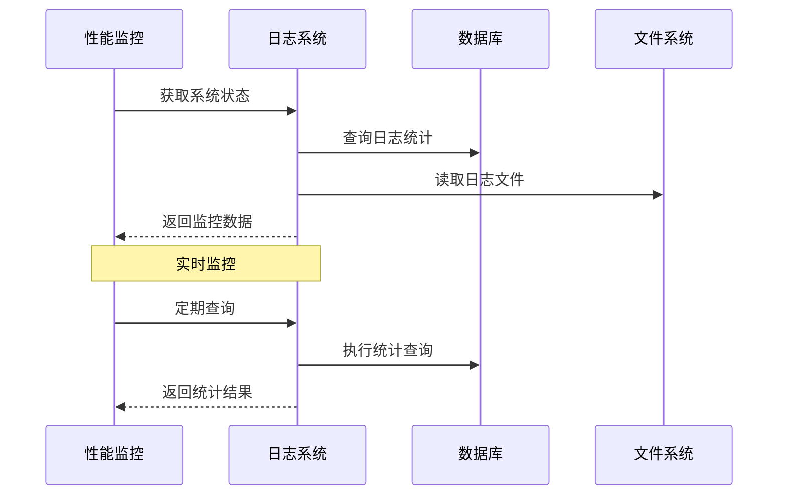

**图表来源**
- [system_monitor.go:36-82](file://common/system_monitor.go#L36-L82)
- [controller_performance.go:231-292](file://controller/performance.go#L231-L292)

#### 审计追踪功能

系统提供了完整的审计追踪能力：

| 功能 | 描述 | 实现方式 |
|------|------|----------|
| 请求追踪 | 跟踪单个请求的完整生命周期 | Request-Id 关联 |
| 用户行为 | 记录用户的所有操作 | 日志类型分类 |
| 系统事件 | 监控系统状态变化 | 系统日志 |
| 错误分析 | 分析错误发生的原因和频率 | 错误日志聚合 |

**章节来源**
- [common_sys_log.go:17-37](file://common/sys_log.go#L17-L37)
- [model_log.go:383-437](file://model/log.go#L383-L437)

## 依赖关系分析

### 组件耦合度分析

日志系统的组件设计遵循了低耦合高内聚的原则：

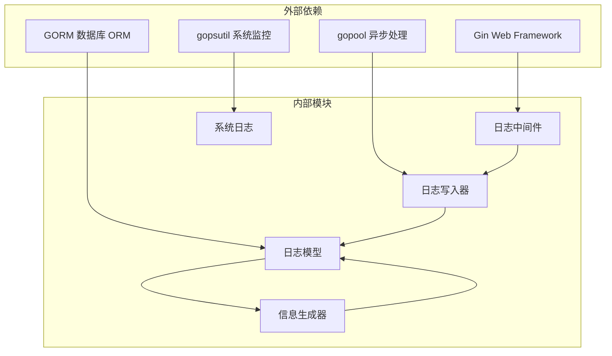

**图表来源**
- [main.go:14-35](file://main.go#L14-L35)
- [logger.go:3-18](file://logger/logger.go#L3-L18)

### 关键依赖关系

1. **Gin 集成**：日志中间件完全依赖于 Gin 的中间件机制
2. **异步处理**：使用 gopool 实现非阻塞的日志写入
3. **数据库访问**：通过 GORM 进行日志数据的持久化
4. **系统监控**：集成 gopsutil 获取系统状态信息

**章节来源**
- [main.go:155-170](file://main.go#L155-L170)
- [logger.go:114-117](file://logger/logger.go#L114-L117)

## 性能考虑

### 性能优化策略

#### 异步写入优化

系统采用了多种异步优化策略：

1. **goroutine 池**：使用 gopool 管理异步任务
2. **互斥锁优化**：最小化锁持有时间
3. **原子操作**：使用 atomic.Value 存储系统状态
4. **批量处理**：日志数据的批量写入

#### 内存管理

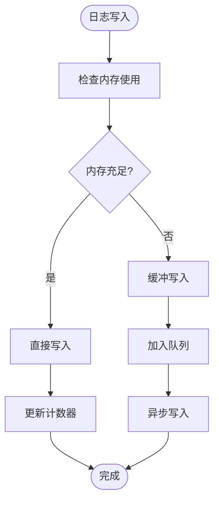

**图表来源**
- [logger.go:110-118](file://logger/logger.go#L110-L118)

#### 并发安全

系统在并发环境下保证了数据一致性：

- **读写分离**：使用 RWMutex 实现读写分离
- **原子操作**：关键状态使用 atomic.Value
- **无锁设计**：日志计数器使用无锁技术

**章节来源**
- [logger.go:30-35](file://logger/logger.go#L30-L35)
- [common_sys_log.go:12-15](file://common/sys_log.go#L12-L15)

## 故障排除指南

### 常见问题诊断

#### 日志文件无法创建

**症状**：启动时出现日志文件创建失败

**可能原因**：
1. 日志目录权限不足
2. 磁盘空间不足
3. 目录路径不存在

**解决方法**：
1. 检查日志目录权限
2. 确保磁盘有足够空间
3. 创建必要的目录结构

#### 日志轮转异常

**症状**：日志文件没有按预期轮转

**可能原因**：
1. 文件句柄未正确关闭
2. 并发访问冲突
3. 轮转条件判断错误

**解决方法**：
1. 检查文件句柄管理
2. 验证互斥锁使用
3. 调试轮转逻辑

#### 性能问题

**症状**：高并发下日志写入影响系统性能

**诊断步骤**：
1. 检查 goroutine 数量
2. 监控内存使用情况
3. 分析锁竞争情况

**优化建议**：
1. 调整异步处理队列大小
2. 优化日志格式化过程
3. 实施背压机制

**章节来源**
- [logger.go:42-74](file://logger/logger.go#L42-L74)
- [common_sys_log.go:31-37](file://common/sys_log.go#L31-L37)

### 调试技巧

#### 开启调试模式

```go
// 在开发环境中启用调试日志
common.DebugEnabled = true
```

#### 日志级别调整

系统支持动态调整日志级别，便于问题定位和性能优化。

#### 性能监控

利用内置的性能监控功能，实时观察系统状态和日志写入性能。

## 结论

New API 项目的日志中间件是一个设计精良的可观测性基础设施，具有以下显著特点：

### 技术优势

1. **架构设计优秀**：采用分层架构，职责清晰，易于维护
2. **性能表现优异**：异步写入、无锁设计确保高并发下的稳定性能
3. **功能完整丰富**：支持多种日志类型、格式化输出和智能轮转
4. **安全性考虑周全**：自动过滤敏感信息，保护用户隐私

### 实践价值

- **开发调试**：详细的日志信息帮助快速定位问题
- **运维监控**：完善的监控指标支持系统运维
- **审计合规**：完整的审计追踪满足合规要求
- **性能分析**：丰富的统计数据支持性能优化

### 发展方向

未来可以在以下方面进一步改进：
1. **分布式追踪**：支持跨服务的日志关联
2. **日志聚合**：集成 ELK 或类似系统
3. **智能分析**：引入机器学习进行异常检测
4. **可视化界面**：提供更友好的日志查询界面

日志中间件为 New API 项目提供了坚实的可观测性基础，是构建可靠、可维护系统的重要组成部分。

## 附录

### API 接口参考

#### 日志查询接口

| 接口 | 方法 | 描述 |
|------|------|------|
| `/logs` | GET | 获取所有日志 |
| `/logs/user` | GET | 获取用户日志 |
| `/logs/stat` | GET | 获取日志统计 |
| `/logs/history` | DELETE | 删除历史日志 |

#### 性能监控接口

| 接口 | 方法 | 描述 |
|------|------|------|
| `/performance/logs` | GET | 获取日志文件信息 |
| `/performance/logs/cleanup` | DELETE | 清理日志文件 |

### 配置示例

#### 环境变量配置

```bash
# 启用调试模式
DEBUG=true

# 设置日志目录
LOG_DIR=/var/log/new-api

# 设置端口
PORT=3000
```

#### 日志级别配置

```go
// 在代码中设置
common.DebugEnabled = true
common.LogConsumeEnabled = true
```