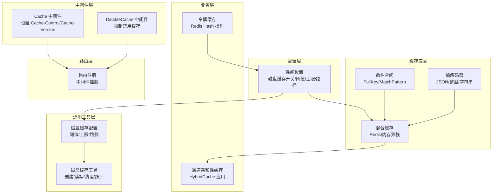
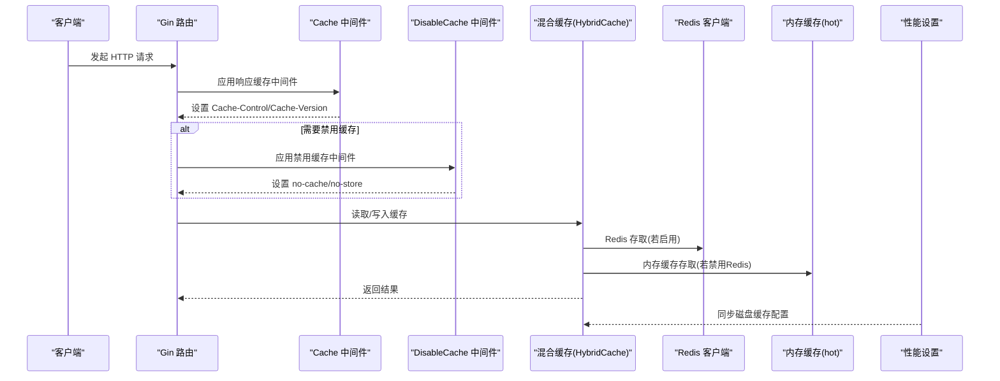
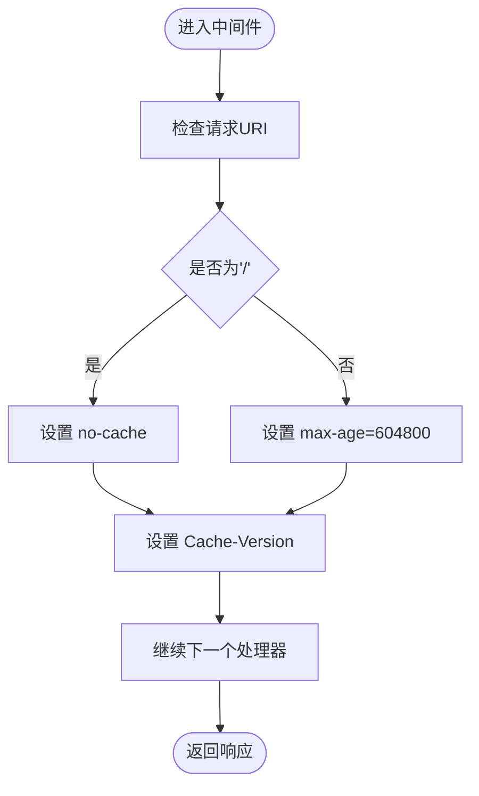
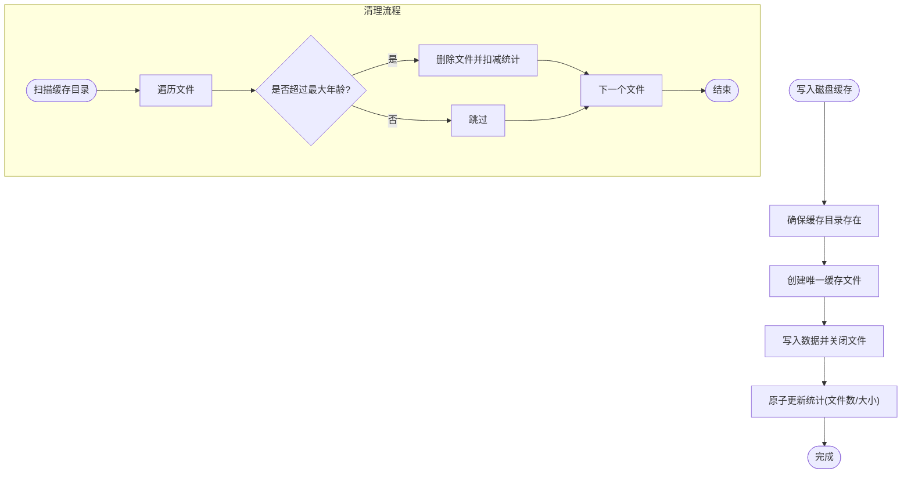
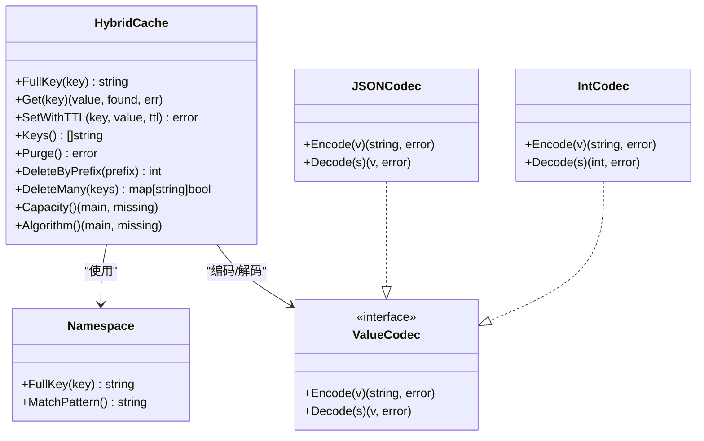
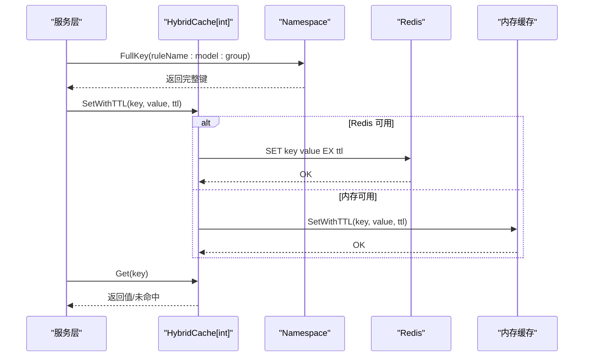
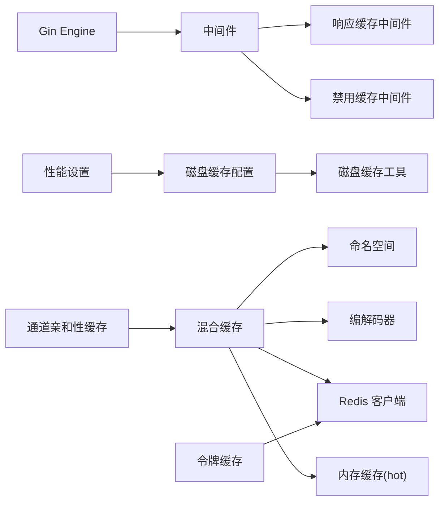

# 缓存中间件

<cite>
**本文引用的文件**
- [middleware/cache.go](file://middleware/cache.go)
- [middleware/disable-cache.go](file://middleware/disable-cache.go)
- [common/disk_cache.go](file://common/disk_cache.go)
- [common/disk_cache_config.go](file://common/disk_cache_config.go)
- [pkg/cachex/hybrid_cache.go](file://pkg/cachex/hybrid_cache.go)
- [pkg/cachex/namespace.go](file://pkg/cachex/namespace.go)
- [pkg/cachex/codec.go](file://pkg/cachex/codec.go)
- [setting/performance_setting/config.go](file://setting/performance_setting/config.go)
- [service/channel_affinity.go](file://service/channel_affinity.go)
- [model/channel_cache.go](file://model/channel_cache.go)
- [model/token_cache.go](file://model/token_cache.go)
- [router/main.go](file://router/main.go)
</cite>

## 目录
1. [简介](#简介)
2. [项目结构](#项目结构)
3. [核心组件](#核心组件)
4. [架构总览](#架构总览)
5. [详细组件分析](#详细组件分析)
6. [依赖分析](#依赖分析)
7. [性能考量](#性能考量)
8. [故障排查指南](#故障排查指南)
9. [结论](#结论)
10. [附录](#附录)

## 简介
本技术文档围绕 New API 项目的缓存中间件展开，系统性解析其设计模式与实现机制，覆盖响应缓存、磁盘缓存与内存缓存策略；详解缓存键生成、过期时间与命中率优化；明确缓存配置项、存储策略与清理机制；给出与数据库查询、外部 API 调用及静态资源的关系说明，并提供缓存穿透防护、缓存雪崩预防与缓存一致性的保障方案。目标是帮助开发者快速理解并高效扩展缓存系统。

## 项目结构
缓存相关能力分布于以下模块：
- 中间件层：HTTP 层面的响应缓存控制与禁用策略
- 通用工具层：磁盘缓存的创建、读写、清理与统计
- 配置层：性能设置与磁盘缓存配置同步
- 缓存库层：混合缓存（Redis/内存）抽象与命名空间隔离
- 业务层：通道亲和性缓存、令牌缓存等具体应用
- 路由层：中间件注册与生效范围

图表来源
- [middleware/cache.go:1-17](file://middleware/cache.go#L1-L17)
- [middleware/disable-cache.go:1-12](file://middleware/disable-cache.go#L1-L12)
- [common/disk_cache.go:1-177](file://common/disk_cache.go#L1-L177)
- [common/disk_cache_config.go:1-178](file://common/disk_cache_config.go#L1-L178)
- [setting/performance_setting/config.go:1-86](file://setting/performance_setting/config.go#L1-L86)
- [pkg/cachex/hybrid_cache.go:1-286](file://pkg/cachex/hybrid_cache.go#L1-L286)
- [pkg/cachex/namespace.go:1-39](file://pkg/cachex/namespace.go#L1-L39)
- [pkg/cachex/codec.go:1-54](file://pkg/cachex/codec.go#L1-L54)
- [service/channel_affinity.go:93-109](file://service/channel_affinity.go#L93-L109)
- [model/token_cache.go:1-66](file://model/token_cache.go#L1-L66)
- [router/main.go:16-36](file://router/main.go#L16-L36)

章节来源
- [middleware/cache.go:1-17](file://middleware/cache.go#L1-L17)
- [middleware/disable-cache.go:1-12](file://middleware/disable-cache.go#L1-L12)
- [common/disk_cache.go:1-177](file://common/disk_cache.go#L1-L177)
- [common/disk_cache_config.go:1-178](file://common/disk_cache_config.go#L1-L178)
- [setting/performance_setting/config.go:1-86](file://setting/performance_setting/config.go#L1-L86)
- [pkg/cachex/hybrid_cache.go:1-286](file://pkg/cachex/hybrid_cache.go#L1-L286)
- [pkg/cachex/namespace.go:1-39](file://pkg/cachex/namespace.go#L1-L39)
- [pkg/cachex/codec.go:1-54](file://pkg/cachex/codec.go#L1-L54)
- [service/channel_affinity.go:93-109](file://service/channel_affinity.go#L93-L109)
- [model/token_cache.go:1-66](file://model/token_cache.go#L1-L66)
- [router/main.go:16-36](file://router/main.go#L16-L36)

## 核心组件
- 响应缓存中间件：通过设置 Cache-Control 与 Cache-Version 头，控制浏览器/代理缓存行为，首页禁用缓存，其他路径默认一周缓存。
- 禁用缓存中间件：强制设置 no-store/no-cache/pragmma/expires，确保敏感或动态内容不被缓存。
- 磁盘缓存工具：提供统一缓存目录、文件创建/写入/读取/删除、旧文件清理、统计信息与可用性判断。
- 混合缓存库：基于 Redis 的分布式缓存与内存热缓存（hot）的双栈实现，支持 TTL、批量扫描/删除、命名空间隔离与编解码。
- 命名空间与编解码：命名空间确保键隔离，编解码器支持 JSON/整型/字符串等序列化格式。
- 性能设置：集中管理磁盘缓存开关、阈值、上限与路径，并同步至通用配置与统计模块。
- 业务应用：通道亲和性缓存与令牌缓存均采用混合缓存，结合命名空间与 TTL 实现高可用与低延迟。

章节来源
- [middleware/cache.go:7-17](file://middleware/cache.go#L7-L17)
- [middleware/disable-cache.go:5-12](file://middleware/disable-cache.go#L5-L12)
- [common/disk_cache.go:39-177](file://common/disk_cache.go#L39-L177)
- [common/disk_cache_config.go:8-178](file://common/disk_cache_config.go#L8-L178)
- [pkg/cachex/hybrid_cache.go:20-53](file://pkg/cachex/hybrid_cache.go#L20-L53)
- [pkg/cachex/namespace.go:5-39](file://pkg/cachex/namespace.go#L5-L39)
- [pkg/cachex/codec.go:10-54](file://pkg/cachex/codec.go#L10-L54)
- [setting/performance_setting/config.go:8-86](file://setting/performance_setting/config.go#L8-L86)
- [service/channel_affinity.go:93-109](file://service/channel_affinity.go#L93-L109)
- [model/token_cache.go:11-66](file://model/token_cache.go#L11-L66)

## 架构总览
缓存系统分三层协同：
- HTTP 层中间件负责响应缓存策略下发；
- 通用层提供磁盘缓存能力与配置同步；
- 缓存库层提供混合缓存抽象，业务层通过命名空间与编解码器落地具体场景。

图表来源
- [middleware/cache.go:7-17](file://middleware/cache.go#L7-L17)
- [middleware/disable-cache.go:5-12](file://middleware/disable-cache.go#L5-L12)
- [pkg/cachex/hybrid_cache.go:80-129](file://pkg/cachex/hybrid_cache.go#L80-L129)
- [setting/performance_setting/config.go:49-75](file://setting/performance_setting/config.go#L49-L75)

## 详细组件分析

### 响应缓存中间件
- 设计要点
  - 针对根路径“/”禁用缓存，其余路径默认缓存一周；
  - 固定版本头用于缓存失效与灰度发布控制。
- 适用场景
  - 静态页面与公开资源的浏览器/CDN缓存；
  - 动态接口配合禁用中间件精准控制。
- 风险与对策
  - 避免将敏感数据默认缓存；
  - 对需要实时性的接口显式挂载禁用中间件。

图表来源
- [middleware/cache.go:7-17](file://middleware/cache.go#L7-L17)

章节来源
- [middleware/cache.go:7-17](file://middleware/cache.go#L7-L17)

### 禁用缓存中间件
- 设计要点
  - 强制设置 no-store/no-cache/pragmma/expires，确保响应不被缓存。
- 适用场景
  - 登录态、鉴权态、用户私有数据、动态内容。
- 集成方式
  - 在路由层按需挂载，覆盖响应缓存中间件。

章节来源
- [middleware/disable-cache.go:5-12](file://middleware/disable-cache.go#L5-L12)

### 磁盘缓存工具与配置
- 能力概览
  - 统一缓存目录与文件命名；
  - 创建/写入/读取/删除磁盘缓存文件；
  - 清理超期文件并同步统计；
  - 判断是否启用磁盘缓存与容量可用性。
- 配置项
  - 开关、阈值（MB）、最大容量（MB）、自定义路径；
  - 与性能设置双向同步。
- 统计与清理
  - 活跃文件数、当前使用量、命中计数；
  - 后台按最大存活时间清理旧文件。

图表来源
- [common/disk_cache.go:39-138](file://common/disk_cache.go#L39-L138)
- [common/disk_cache_config.go:71-178](file://common/disk_cache_config.go#L71-L178)
- [setting/performance_setting/config.go:49-75](file://setting/performance_setting/config.go#L49-L75)

章节来源
- [common/disk_cache.go:23-177](file://common/disk_cache.go#L23-L177)
- [common/disk_cache_config.go:8-178](file://common/disk_cache_config.go#L8-L178)
- [setting/performance_setting/config.go:8-86](file://setting/performance_setting/config.go#L8-L86)

### 混合缓存库（Redis/内存）
- 设计模式
  - 条件启用：当 Redis 可用且开启时走 Redis，否则回退内存缓存；
  - 命名空间隔离：避免键冲突，支持前缀匹配与批量操作；
  - 编解码器：支持 JSON/整型/字符串等序列化格式；
  - TTL 支持：统一的过期时间控制；
  - 批量操作：扫描、删除、清空等。
- 关键流程

图表来源
- [pkg/cachex/hybrid_cache.go:20-53](file://pkg/cachex/hybrid_cache.go#L20-L53)
- [pkg/cachex/namespace.go:5-39](file://pkg/cachex/namespace.go#L5-L39)
- [pkg/cachex/codec.go:10-54](file://pkg/cachex/codec.go#L10-L54)

章节来源
- [pkg/cachex/hybrid_cache.go:55-286](file://pkg/cachex/hybrid_cache.go#L55-L286)
- [pkg/cachex/namespace.go:5-39](file://pkg/cachex/namespace.go#L5-L39)
- [pkg/cachex/codec.go:10-54](file://pkg/cachex/codec.go#L10-L54)

### 业务应用：通道亲和性缓存
- 场景说明
  - 通过混合缓存记录通道选择规则与统计信息，支持 TTL 与命名空间隔离；
  - 可按规则维度统计缓存条目数量，辅助容量规划与算法评估。
- 关键点
  - 使用命名空间隔离不同规则；
  - 内存侧配置 LRU 与定时清理；
  - Redis 侧提供跨节点共享与持久化能力。

图表来源
- [service/channel_affinity.go:93-109](file://service/channel_affinity.go#L93-L109)
- [pkg/cachex/hybrid_cache.go:80-129](file://pkg/cachex/hybrid_cache.go#L80-L129)
- [pkg/cachex/namespace.go:17-30](file://pkg/cachex/namespace.go#L17-L30)

章节来源
- [service/channel_affinity.go:93-109](file://service/channel_affinity.go#L93-L109)
- [service/channel_affinity.go:929-959](file://service/channel_affinity.go#L929-L959)

### 业务应用：令牌缓存
- 场景说明
  - 使用 Redis Hash 存储令牌对象，结合 HMAC 键名避免冲突；
  - 提供增量/扣减配额、字段更新与对象读取。
- 关键点
  - 键命名规范：token:hmac(key)；
  - TTL 由配置决定；
  - 与 Redis 连接状态强关联。

章节来源
- [model/token_cache.go:11-66](file://model/token_cache.go#L11-L66)

### 与数据库、外部 API、静态资源的关系
- 数据库查询
  - 内存缓存：模型层对渠道列表进行内存缓存，减少频繁查询；
  - 混合缓存：业务层对热点数据（如通道亲和性）进行缓存，降低数据库压力。
- 外部 API 调用
  - 响应缓存中间件可对公开接口结果进行浏览器/CDN缓存；
  - 禁用缓存中间件用于敏感或动态接口。
- 静态资源
  - 通过响应缓存中间件设置较长 max-age，配合 Cache-Version 实现版本化缓存。

章节来源
- [model/channel_cache.go:21-94](file://model/channel_cache.go#L21-L94)
- [middleware/cache.go:7-17](file://middleware/cache.go#L7-L17)
- [middleware/disable-cache.go:5-12](file://middleware/disable-cache.go#L5-L12)

## 依赖分析
- 中间件依赖 Gin，仅注入响应头，不引入外部存储；
- 磁盘缓存依赖标准库 os/path，配置通过性能设置同步；
- 混合缓存依赖 Redis 与 hot 缓存库，具备条件启用能力；
- 业务层通过命名空间与编解码器解耦具体存储实现。

图表来源
- [router/main.go:16-36](file://router/main.go#L16-L36)
- [middleware/cache.go:7-17](file://middleware/cache.go#L7-L17)
- [middleware/disable-cache.go:5-12](file://middleware/disable-cache.go#L5-L12)
- [common/disk_cache_config.go:20-41](file://common/disk_cache_config.go#L20-L41)
- [pkg/cachex/hybrid_cache.go:20-53](file://pkg/cachex/hybrid_cache.go#L20-L53)
- [pkg/cachex/namespace.go:5-39](file://pkg/cachex/namespace.go#L5-L39)
- [pkg/cachex/codec.go:10-54](file://pkg/cachex/codec.go#L10-L54)
- [service/channel_affinity.go:93-109](file://service/channel_affinity.go#L93-L109)
- [model/token_cache.go:11-66](file://model/token_cache.go#L11-L66)

章节来源
- [router/main.go:16-36](file://router/main.go#L16-L36)
- [common/disk_cache_config.go:20-41](file://common/disk_cache_config.go#L20-L41)
- [pkg/cachex/hybrid_cache.go:20-53](file://pkg/cachex/hybrid_cache.go#L20-L53)

## 性能考量
- 命中率优化
  - 使用命名空间隔离热点键，避免跨域污染；
  - 为高频键设置合理 TTL，平衡新鲜度与命中率；
  - 内存侧启用 LRU 与定时清理，防止碎片化。
- 存储管理
  - 磁盘缓存阈值与上限受性能设置控制，避免内存压力；
  - 清理策略按最大存活时间执行，定期同步统计以修正偏差。
- 并发与一致性
  - 统计使用原子操作，避免竞态；
  - Redis 批量删除使用 UNLINK，降低阻塞风险；
  - 内存侧批量删除通过过滤与管道执行，提升吞吐。

章节来源
- [pkg/cachex/hybrid_cache.go:139-177](file://pkg/cachex/hybrid_cache.go#L139-L177)
- [pkg/cachex/hybrid_cache.go:229-271](file://pkg/cachex/hybrid_cache.go#L229-L271)
- [common/disk_cache_config.go:108-178](file://common/disk_cache_config.go#L108-L178)

## 故障排查指南
- 缓存未生效
  - 检查路由是否挂载了响应缓存/禁用中间件；
  - 确认 Cache-Control 是否被后续处理器覆盖。
- 磁盘缓存异常
  - 核对磁盘缓存目录权限与可用空间；
  - 查看阈值与上限配置是否合理；
  - 观察清理任务是否按期执行。
- Redis 相关问题
  - 检查 Redis 连接状态与网络；
  - 关注批量删除的 UNLINK 结果与错误日志；
  - 核对键命名与命名空间前缀。
- 命中率低
  - 分析键分布与 TTL 设置；
  - 评估内存容量与淘汰策略；
  - 对热点键增加预热与短 TTL。

章节来源
- [middleware/cache.go:7-17](file://middleware/cache.go#L7-L17)
- [middleware/disable-cache.go:5-12](file://middleware/disable-cache.go#L5-L12)
- [common/disk_cache.go:106-138](file://common/disk_cache.go#L106-L138)
- [pkg/cachex/hybrid_cache.go:249-271](file://pkg/cachex/hybrid_cache.go#L249-L271)

## 结论
该缓存中间件体系以“HTTP 层响应缓存 + 通用磁盘缓存 + 混合缓存库”为核心，结合命名空间与编解码器实现灵活、可扩展的缓存方案。通过性能设置集中管理磁盘缓存策略，并在业务层以混合缓存落地关键场景。配合禁用中间件与清理机制，可在保证一致性的同时显著提升性能与稳定性。

## 附录
- 缓存键生成
  - 命名空间前缀 + 原始键，避免冲突；
  - 支持前缀匹配与批量扫描。
- 过期时间
  - 混合缓存统一支持 TTL；
  - 磁盘缓存按最大存活时间清理。
- 配置选项
  - 磁盘缓存开关、阈值（MB）、上限（MB）、路径；
  - 监控阈值（CPU/内存/磁盘）。
- 清理机制
  - 后台扫描目录，删除超期文件并同步统计；
  - 支持按前缀删除与批量删除。

章节来源
- [pkg/cachex/namespace.go:17-38](file://pkg/cachex/namespace.go#L17-L38)
- [pkg/cachex/hybrid_cache.go:131-177](file://pkg/cachex/hybrid_cache.go#L131-L177)
- [setting/performance_setting/config.go:8-86](file://setting/performance_setting/config.go#L8-L86)
- [common/disk_cache.go:106-138](file://common/disk_cache.go#L106-L138)