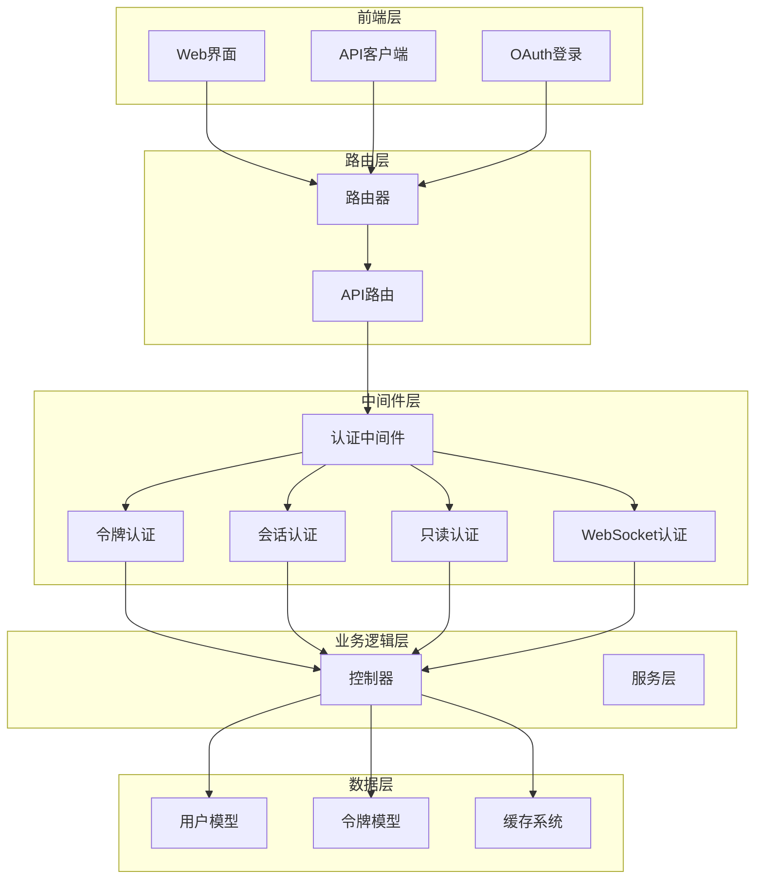
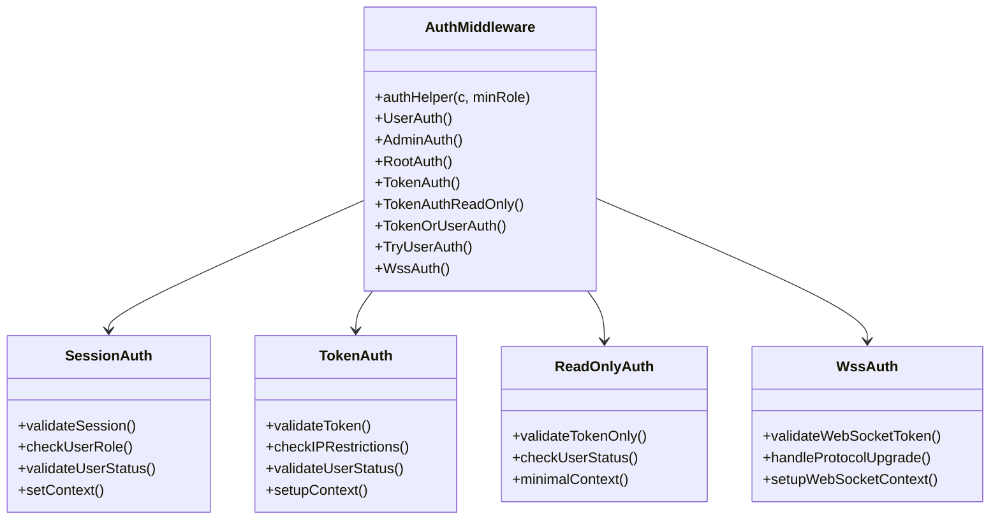
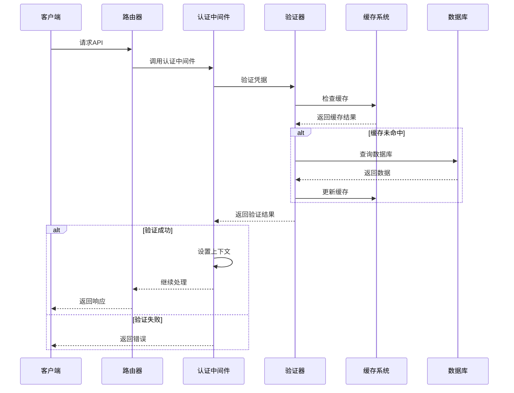
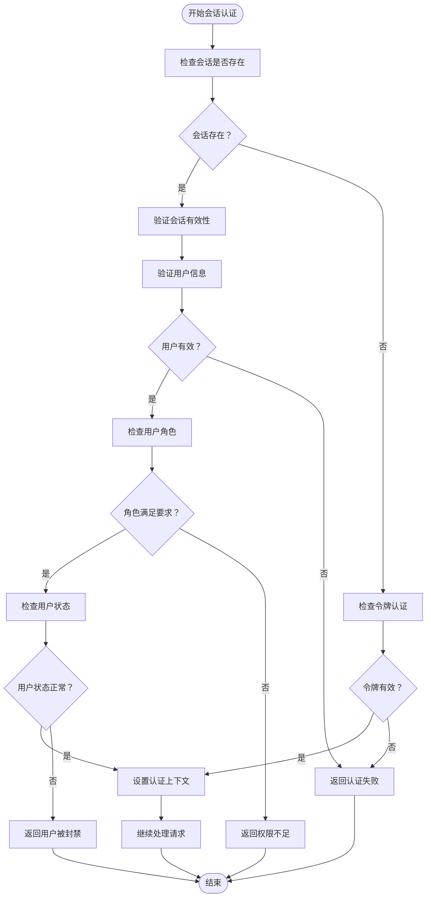
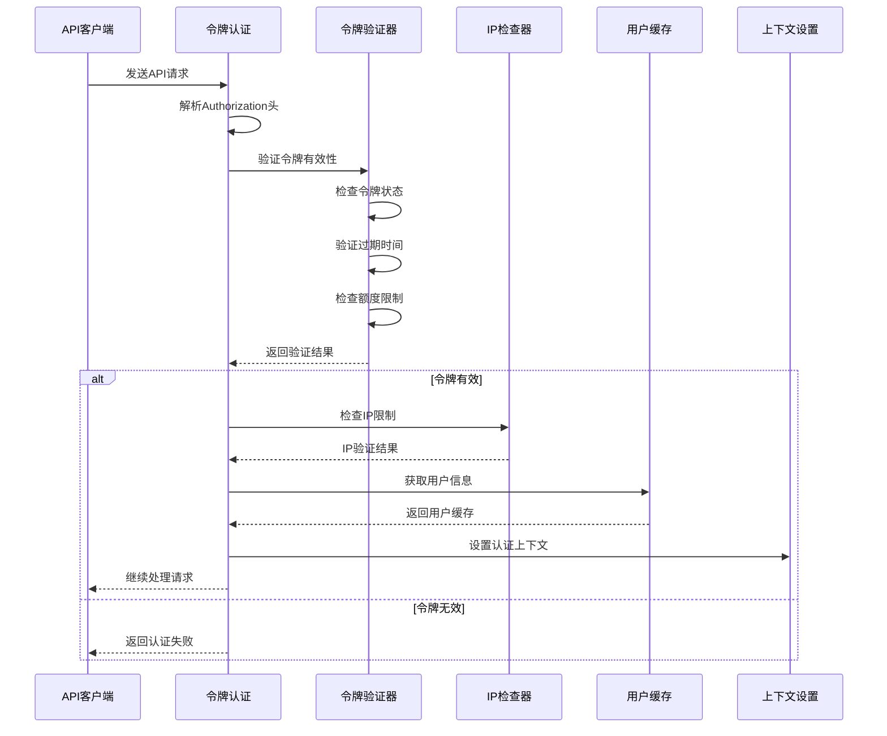
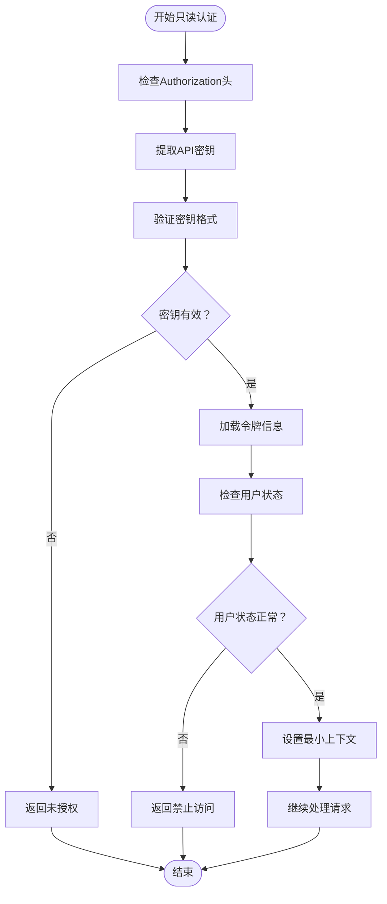
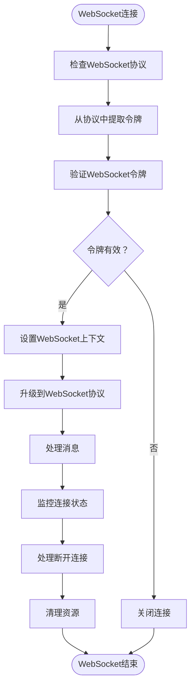
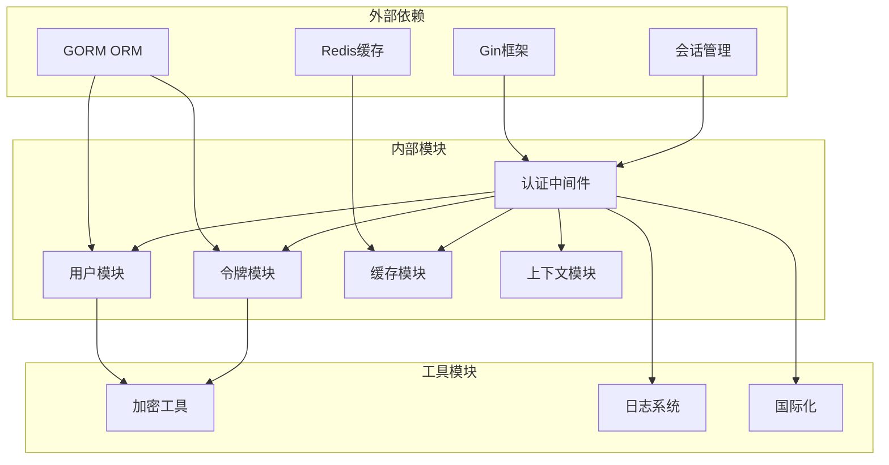

# 认证中间件

<cite>
**本文档引用的文件**
- [middleware/auth.go](file://middleware/auth.go)
- [common/constants.go](file://common/constants.go)
- [model/user.go](file://model/user.go)
- [model/token.go](file://model/token.go)
- [model/user_cache.go](file://model/user_cache.go)
- [constant/context_key.go](file://constant/context_key.go)
- [router/api-router.go](file://router/api-router.go)
- [controller/oauth.go](file://controller/oauth.go)
- [controller/user.go](file://controller/user.go)
- [relay/websocket.go](file://relay/websocket.go)
- [relay/channel/api_request.go](file://relay/channel/api_request.go)
</cite>

## 目录
1. [简介](#简介)
2. [项目结构](#项目结构)
3. [核心组件](#核心组件)
4. [架构概览](#架构概览)
5. [详细组件分析](#详细组件分析)
6. [依赖关系分析](#依赖关系分析)
7. [性能考虑](#性能考虑)
8. [故障排除指南](#故障排除指南)
9. [结论](#结论)

## 简介

New API 项目的认证中间件是一个多层次的安全框架，提供了完整的身份验证和授权机制。该系统支持多种认证方式，包括会话认证、令牌认证、只读令牌认证和WebSocket认证，并集成了OAuth第三方登录、密码学安全和会话管理功能。

认证中间件的核心设计目标是提供灵活而强大的安全控制，既能满足Web仪表板的会话需求，又能支持API客户端的令牌认证，同时还具备扩展性以适应未来的需求变化。

## 项目结构

认证中间件在整个项目中的位置和作用：

**图表来源**
- [middleware/auth.go:1-440](file://middleware/auth.go#L1-L440)
- [router/api-router.go:1-380](file://router/api-router.go#L1-L380)

## 核心组件

### 认证中间件架构

认证中间件采用分层设计，每个层次负责特定的认证职责：

**图表来源**
- [middleware/auth.go:36-440](file://middleware/auth.go#L36-L440)

### 角色权限体系

系统实现了多级角色权限控制：

| 角色 | 权限级别 | 描述 | 可访问范围 |
|------|----------|------|------------|
| Guest | 0 | 游客用户 | 基础公共接口 |
| Common User | 1 | 普通用户 | 用户个人功能 |
| Admin | 10 | 管理员 | 管理功能 |
| Root | 100 | 超级管理员 | 系统完全控制 |

**章节来源**
- [common/constants.go:141-150](file://common/constants.go#L141-L150)
- [common/constants.go:188-198](file://common/constants.go#L188-L198)

## 架构概览

认证系统的整体架构设计体现了模块化和可扩展性的原则：

**图表来源**
- [middleware/auth.go:36-157](file://middleware/auth.go#L36-L157)
- [model/user_cache.go:74-113](file://model/user_cache.go#L74-L113)

## 详细组件分析

### 会话认证中间件

会话认证是Web仪表板的主要认证方式，通过浏览器会话维持用户登录状态：

**图表来源**
- [middleware/auth.go:36-157](file://middleware/auth.go#L36-L157)

**章节来源**
- [middleware/auth.go:36-157](file://middleware/auth.go#L36-L157)

### 令牌认证中间件

令牌认证支持API客户端的身份验证，具有严格的安全检查机制：

**图表来源**
- [middleware/auth.go:276-407](file://middleware/auth.go#L276-L407)
- [model/token.go:188-226](file://model/token.go#L188-L226)

**章节来源**
- [middleware/auth.go:276-407](file://middleware/auth.go#L276-L407)
- [model/token.go:188-226](file://model/token.go#L188-L226)

### 只读令牌认证

只读令牌认证专为查询接口设计，提供宽松的认证机制：

**图表来源**
- [middleware/auth.go:214-274](file://middleware/auth.go#L214-L274)

**章节来源**
- [middleware/auth.go:214-274](file://middleware/auth.go#L214-L274)

### WebSocket认证

WebSocket认证处理实时通信的连接建立：

**图表来源**
- [middleware/auth.go:188-190](file://middleware/auth.go#L188-L190)
- [relay/websocket.go:15-46](file://relay/websocket.go#L15-L46)

**章节来源**
- [middleware/auth.go:188-190](file://middleware/auth.go#L188-L190)
- [relay/websocket.go:15-46](file://relay/websocket.go#L15-L46)

## 依赖关系分析

认证中间件的依赖关系体现了清晰的分层架构：

**图表来源**
- [middleware/auth.go:3-23](file://middleware/auth.go#L3-L23)
- [model/user.go:3-17](file://model/user.go#L3-L17)
- [model/token.go:3-12](file://model/token.go#L3-L12)

**章节来源**
- [middleware/auth.go:3-23](file://middleware/auth.go#L3-L23)
- [model/user.go:3-17](file://model/user.go#L3-L17)
- [model/token.go:3-12](file://model/token.go#L3-L12)

## 性能考虑

认证系统的性能优化策略：

### 缓存策略
- **用户信息缓存**: 使用Redis缓存用户基本信息，减少数据库查询
- **令牌状态缓存**: 缓存令牌验证结果，提高重复请求的响应速度
- **角色权限缓存**: 缓存用户权限信息，避免重复计算

### 连接池管理
- **数据库连接池**: 合理配置GORM连接池大小
- **Redis连接池**: 使用连接池管理Redis连接
- **HTTP客户端连接池**: 复用HTTP连接减少握手开销

### 异步处理
- **缓存更新**: 使用异步方式更新缓存，不影响主请求流程
- **日志记录**: 异步写入日志，避免阻塞请求处理

## 故障排除指南

### 常见认证问题

| 问题类型 | 症状 | 可能原因 | 解决方案 |
|----------|------|----------|----------|
| 会话失效 | 401未授权错误 | 会话过期或被清除 | 重新登录获取新会话 |
| 令牌无效 | 401未授权错误 | 令牌格式错误或不存在 | 检查Authorization头格式 |
| IP限制 | 403禁止访问 | 客户端IP不在允许列表 | 联系管理员添加IP白名单 |
| 用户被封禁 | 403禁止访问 | 用户账户被禁用 | 联系系统管理员解封 |
| 权限不足 | 403禁止访问 | 用户角色权限不够 | 提升用户角色或联系管理员 |

### 调试技巧

1. **启用调试模式**: 设置`DebugEnabled=true`获取详细日志
2. **检查会话状态**: 验证会话是否正确保存和恢复
3. **验证令牌格式**: 确保Authorization头符合标准格式
4. **监控缓存命中率**: 检查Redis缓存是否正常工作

**章节来源**
- [middleware/auth.go:47-93](file://middleware/auth.go#L47-L93)
- [middleware/auth.go:218-248](file://middleware/auth.go#L218-L248)

## 结论

New API项目的认证中间件提供了一个完整、灵活且安全的身份验证解决方案。其设计特点包括：

### 主要优势
- **多认证方式支持**: 同时支持会话认证、令牌认证和WebSocket认证
- **严格的权限控制**: 基于角色的细粒度权限管理
- **高性能设计**: 通过缓存和异步处理提升系统性能
- **安全可靠**: 集成密码学安全和多种防护机制
- **易于扩展**: 模块化设计便于功能扩展和维护

### 最佳实践建议
1. **合理选择认证方式**: 根据使用场景选择合适的认证方式
2. **定期审查权限配置**: 确保权限设置符合最小权限原则
3. **监控系统性能**: 关注认证系统的性能指标和错误率
4. **及时更新安全补丁**: 保持依赖库和框架的安全更新

该认证中间件为New API项目提供了坚实的安全基础，能够满足从简单用户认证到复杂企业级安全需求的各种场景。