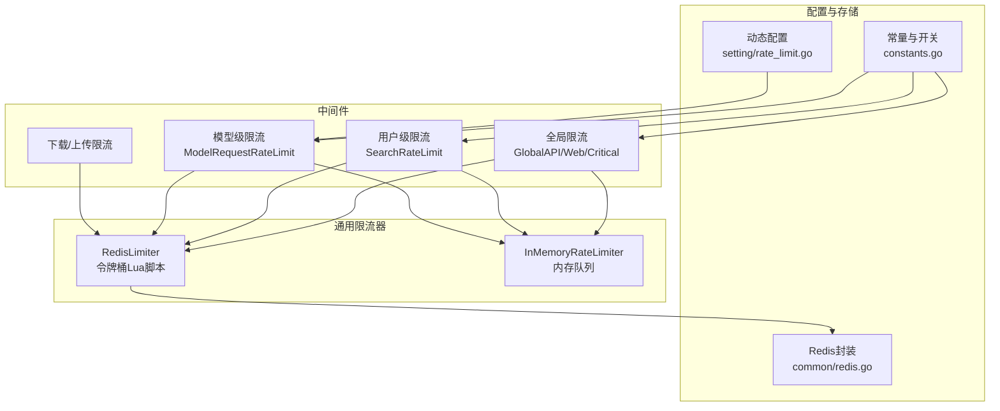
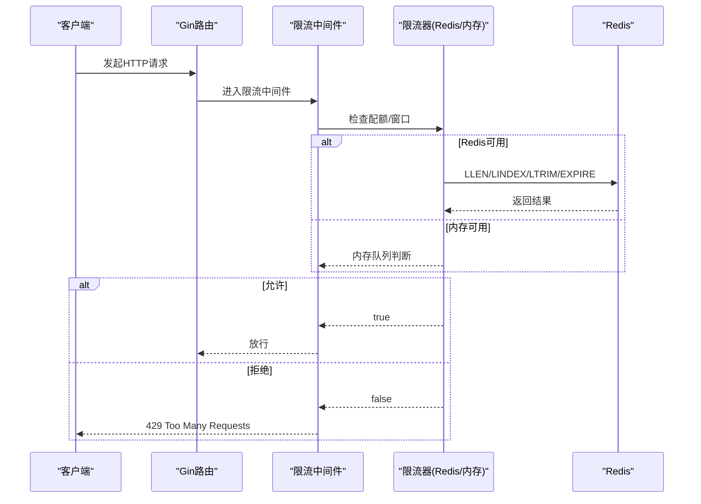
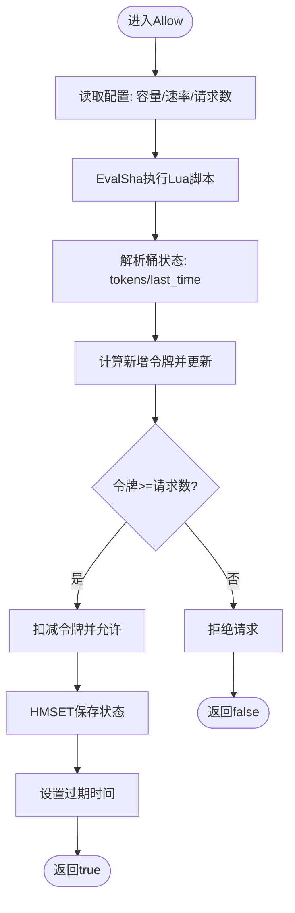
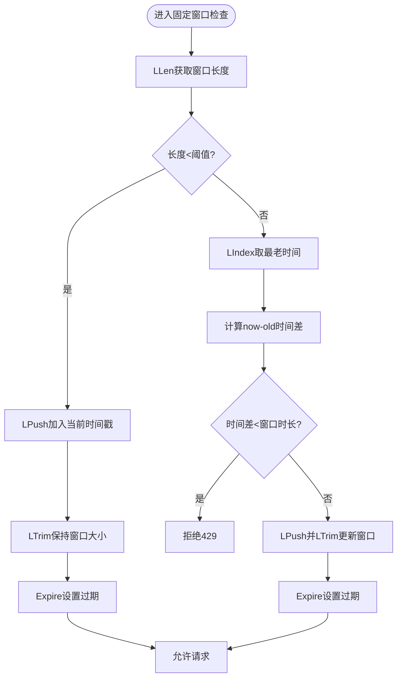
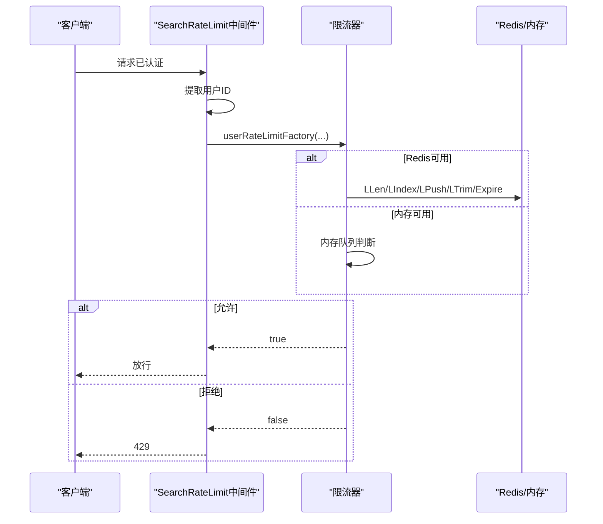
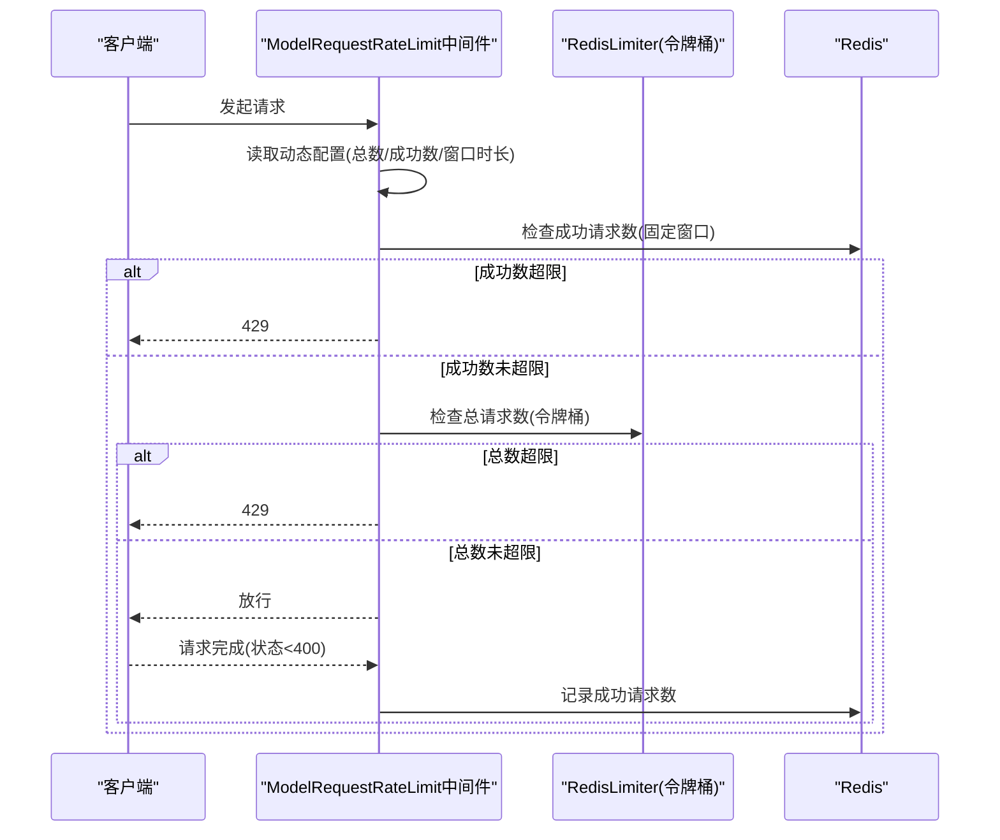
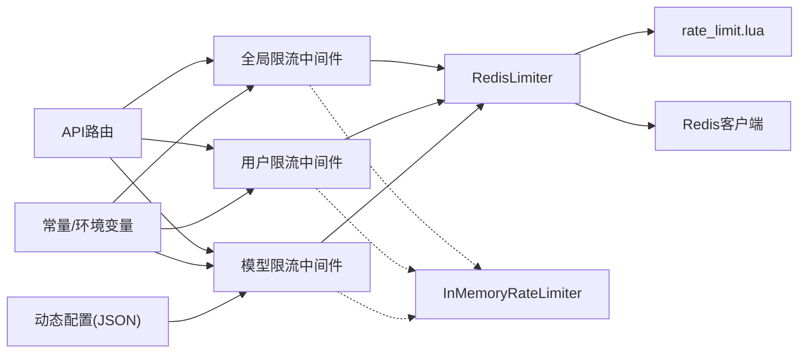

# 限流中间件

<cite>
**本文引用的文件**
- [limiter.go](file://common/limiter/limiter.go)
- [rate_limit.lua](file://common/limiter/lua/rate_limit.lua)
- [rate-limit.go](file://middleware/rate-limit.go)
- [model-rate-limit.go](file://middleware/model-rate-limit.go)
- [rate_limit.go](file://setting/rate_limit.go)
- [rate-limit.go](file://common/rate-limit.go)
- [constants.go](file://common/constants.go)
- [redis.go](file://common/redis.go)
- [init.go](file://common/init.go)
- [api-router.go](file://router/api-router.go)
- [main.go](file://router/main.go)
</cite>

## 目录
1. [简介](#简介)
2. [项目结构](#项目结构)
3. [核心组件](#核心组件)
4. [架构总览](#架构总览)
5. [详细组件分析](#详细组件分析)
6. [依赖分析](#依赖分析)
7. [性能考虑](#性能考虑)
8. [故障排查指南](#故障排查指南)
9. [结论](#结论)
10. [附录](#附录)

## 简介
本技术文档围绕 New API 项目的限流中间件展开，系统性解析其设计原理与实现机制，覆盖以下主题：
- 限流策略：令牌桶、滑动窗口与固定窗口
- 限流粒度：全局限流、用户级限流、令牌级限流、模型级限流
- 规则定义、配额计算与冷却时间管理
- 实现示例、性能优化与 Redis 缓存集成
- 与缓存系统的交互、分布式限流与动态配置更新
- 自定义策略、白名单机制与紧急降级处理

## 项目结构
限流相关代码主要分布在以下模块：
- 中间件层：全局限流、用户级限流、下载/上传限流、搜索限流、模型级限流
- 通用限流器：内存限流器与 Redis 令牌桶封装
- 配置与常量：限流开关、阈值、窗口时长等
- Redis 封装：连接、键操作、事务与 TTL 维护
- 路由注册：在 API 路由上挂载限流中间件

**图表来源**
- [rate-limit.go:90-117](file://middleware/rate-limit.go#L90-L117)
- [model-rate-limit.go:166-200](file://middleware/model-rate-limit.go#L166-L200)
- [limiter.go:16-40](file://common/limiter/limiter.go#L16-L40)
- [rate-limit.go:8-26](file://common/rate-limit.go#L8-L26)
- [constants.go:161-186](file://common/constants.go#L161-L186)
- [rate_limit.go:12-17](file://setting/rate_limit.go#L12-L17)
- [redis.go:16-54](file://common/redis.go#L16-L54)

**章节来源**
- [rate-limit.go:1-206](file://middleware/rate-limit.go#L1-L206)
- [model-rate-limit.go:1-201](file://middleware/model-rate-limit.go#L1-L201)
- [limiter.go:1-91](file://common/limiter/limiter.go#L1-L91)
- [rate-limit.go:1-71](file://common/rate-limit.go#L1-L71)
- [constants.go:161-186](file://common/constants.go#L161-L186)
- [rate_limit.go:1-70](file://setting/rate_limit.go#L1-L70)
- [redis.go:1-328](file://common/redis.go#L1-L328)

## 核心组件
- RedisLimiter：基于 Redis 的令牌桶限流器，通过 Lua 脚本原子化地维护桶状态与过期时间。
- InMemoryRateLimiter：内存队列式限流器，用于单机场景或 Redis 不可用时的降级。
- 全局/用户/模型/下载/上传限流中间件：按需在路由层挂载，支持固定窗口与滑动窗口两种实现路径。
- 动态配置：支持从环境变量与 JSON 配置动态更新模型级限流规则。

**章节来源**
- [limiter.go:16-91](file://common/limiter/limiter.go#L16-L91)
- [rate-limit.go:8-70](file://common/rate-limit.go#L8-L70)
- [rate-limit.go:76-117](file://middleware/rate-limit.go#L76-L117)
- [model-rate-limit.go:166-200](file://middleware/model-rate-limit.go#L166-L200)
- [rate_limit.go:19-51](file://setting/rate_limit.go#L19-L51)

## 架构总览
限流中间件在 Gin 路由中以“中间件链”的形式串联，根据配置选择 Redis 或内存实现；模型级限流同时结合令牌桶与固定窗口策略，并支持按用户/令牌组动态调整。

**图表来源**
- [rate-limit.go:21-65](file://middleware/rate-limit.go#L21-L65)
- [rate-limit.go:155-196](file://middleware/rate-limit.go#L155-L196)
- [rate-limit.go:45-70](file://common/rate-limit.go#L45-L70)
- [redis.go:23-54](file://common/redis.go#L23-L54)

## 详细组件分析

### 令牌桶限流器（RedisLimiter + Lua）
- 设计要点
  - 使用 Lua 原子脚本维护“令牌数”和“最后更新时间”，避免竞态。
  - 支持容量上限、生成速率与请求令牌数可配置。
  - 通过 SHA 预加载脚本，降低网络往返与编译开销。
- 关键流程
  - 计算时间差与新增令牌，更新桶状态。
  - 若令牌足够则扣减并允许，否则拒绝。
  - 设置键过期时间，避免无限增长。

**图表来源**
- [limiter.go:42-69](file://common/limiter/limiter.go#L42-L69)
- [rate_limit.lua:1-44](file://common/limiter/lua/rate_limit.lua#L1-L44)

**章节来源**
- [limiter.go:16-91](file://common/limiter/limiter.go#L16-L91)
- [rate_limit.lua:1-44](file://common/limiter/lua/rate_limit.lua#L1-L44)

### 固定窗口与滑动窗口限流（全局/用户/下载/上传）
- 固定窗口
  - 以时间窗口为单位统计请求数，超过阈值则拒绝。
  - 使用 Redis List 维护窗口内的请求时间戳，配合 LLEN/LINDEX/LTRIM 控制长度与过期。
- 滑动窗口
  - 通过比较最老请求与当前时间差判断是否超限，更平滑地控制速率。
  - 与固定窗口共享同一数据结构，仅在判定逻辑上差异。

**图表来源**
- [rate-limit.go:21-65](file://middleware/rate-limit.go#L21-L65)
- [rate-limit.go:155-196](file://middleware/rate-limit.go#L155-L196)

**章节来源**
- [rate-limit.go:21-65](file://middleware/rate-limit.go#L21-L65)
- [rate-limit.go:155-196](file://middleware/rate-limit.go#L155-L196)

### 用户级限流（SearchRateLimit）
- 特点
  - 基于认证后的用户 ID 构建键，抵御代理轮换攻击。
  - 支持 Redis 与内存两种实现，自动切换。
- 流程
  - 从上下文提取用户 ID，构造用户级键。
  - 调用 Redis 或内存限流器进行判定。
  - 成功后放行，失败返回 429。

**图表来源**
- [rate-limit.go:119-151](file://middleware/rate-limit.go#L119-L151)
- [rate-limit.go:153-196](file://middleware/rate-limit.go#L153-L196)

**章节来源**
- [rate-limit.go:119-151](file://middleware/rate-limit.go#L119-L151)
- [rate-limit.go:153-196](file://middleware/rate-limit.go#L153-L196)

### 模型级限流（ModelRequestRateLimit）
- 设计目标
  - 同时控制“总请求数”和“成功请求数”，支持按用户/令牌组差异化配置。
  - 总请求数采用 Redis 令牌桶，成功请求数采用固定窗口（Redis List）。
- 关键逻辑
  - 读取动态配置（开关、窗口时长、总数阈值、成功数阈值），支持分组覆盖。
  - 先检查成功请求数阈值，再在需要时检查总请求数阈值（若总数阈值为 0 则跳过）。
  - 请求成功后仅对成功请求数进行记录。

**图表来源**
- [model-rate-limit.go:78-129](file://middleware/model-rate-limit.go#L78-L129)
- [limiter.go:42-69](file://common/limiter/limiter.go#L42-L69)

**章节来源**
- [model-rate-limit.go:1-201](file://middleware/model-rate-limit.go#L1-L201)
- [rate_limit.go:12-51](file://setting/rate_limit.go#L12-L51)

### 配置与动态更新
- 环境变量初始化
  - 全局 API/WEB 限流、关键接口限流、搜索限流、上传/下载限流等开关与阈值均来自环境变量初始化。
- 动态模型级限流配置
  - 支持将分组与阈值以 JSON 形式存储，提供校验、序列化与反序列化接口。
  - 运行时可更新，中间件在每次请求时读取最新配置。

**章节来源**
- [constants.go:161-186](file://common/constants.go#L161-L186)
- [init.go:111-127](file://common/init.go#L111-L127)
- [rate_limit.go:19-69](file://setting/rate_limit.go#L19-L69)

## 依赖分析
- 中间件依赖
  - 全局限流/用户限流/下载/上传限流依赖 Redis 或内存限流器。
  - 模型级限流同时依赖 RedisLimiter（令牌桶）与 Redis List（成功请求数）。
- 配置依赖
  - 常量与环境变量决定限流策略与阈值。
  - 动态配置决定模型级限流的分组与阈值。
- Redis 依赖
  - 连接初始化、PING 测试、键操作、事务与 TTL 维护。

**图表来源**
- [api-router.go:14-200](file://router/api-router.go#L14-L200)
- [rate-limit.go:76-117](file://middleware/rate-limit.go#L76-L117)
- [model-rate-limit.go:166-200](file://middleware/model-rate-limit.go#L166-L200)
- [limiter.go:16-40](file://common/limiter/limiter.go#L16-L40)
- [rate_limit.lua:1-44](file://common/limiter/lua/rate_limit.lua#L1-L44)
- [constants.go:161-186](file://common/constants.go#L161-L186)
- [rate_limit.go:19-51](file://setting/rate_limit.go#L19-L51)

**章节来源**
- [api-router.go:14-200](file://router/api-router.go#L14-L200)
- [rate-limit.go:76-117](file://middleware/rate-limit.go#L76-L117)
- [model-rate-limit.go:166-200](file://middleware/model-rate-limit.go#L166-L200)
- [limiter.go:16-40](file://common/limiter/limiter.go#L16-L40)
- [rate_limit.lua:1-44](file://common/limiter/lua/rate_limit.lua#L1-L44)
- [constants.go:161-186](file://common/constants.go#L161-L186)
- [rate_limit.go:19-51](file://setting/rate_limit.go#L19-L51)

## 性能考虑
- Redis 侧
  - 预加载 Lua 脚本 SHA，减少网络往返与脚本编译开销。
  - 使用管道化（Pipeline）与事务（TxPipeline）合并命令，降低 RTT。
  - 合理设置键过期时间，避免内存泄漏。
- 内存侧
  - 内存队列采用并发安全的互斥锁与后台清理协程，定期剔除过期项。
  - 队列容量按阈值预分配，减少扩容成本。
- 算法侧
  - 令牌桶适合突发流量控制，固定窗口实现简单、开销低。
  - 滑动窗口更平滑，但需要额外的时间戳管理。
- 路由挂载
  - 将限流中间件置于路由组的早期位置，尽早拒绝请求，节省下游资源。

[本节为通用性能建议，无需特定文件引用]

## 故障排查指南
- 常见问题
  - Redis 连接失败：检查连接字符串与 Ping 结果。
  - 限流误判：确认时间格式一致、时区与系统时间同步。
  - 内存限流不生效：确认初始化调用与过期时间设置。
  - 模型级限流异常：核对动态配置 JSON 格式与阈值范围。
- 排查步骤
  - 查看中间件日志输出与错误码。
  - 使用 Redis 客户端检查键是否存在、过期时间与列表长度。
  - 核对环境变量与动态配置是否正确加载。
  - 在单机模式下验证内存限流器行为。

**章节来源**
- [redis.go:23-54](file://common/redis.go#L23-L54)
- [rate-limit.go:21-65](file://middleware/rate-limit.go#L21-L65)
- [rate-limit.go:28-42](file://common/rate-limit.go#L28-L42)
- [rate_limit.go:53-69](file://setting/rate_limit.go#L53-L69)

## 结论
该限流中间件体系以“Redis 令牌桶 + 固定/滑动窗口”为核心，结合内存降级与动态配置，实现了高可用、可扩展的多粒度限流能力。通过在路由层灵活挂载，既能满足全局与用户级限流需求，也能针对模型级别进行精细化控制。建议在生产环境中优先启用 Redis 并合理设置窗口与阈值，同时利用动态配置实现快速迭代与灰度发布。

[本节为总结性内容，无需特定文件引用]

## 附录

### 限流规则与配置清单
- 全局限流
  - 开关：全局 API/WEB 限流
  - 阈值：请求数与时间窗口
  - 实现：固定窗口（Redis List）
- 用户级限流
  - 开关：搜索限流
  - 阈值：请求数与时间窗口
  - 实现：固定窗口（Redis List）
- 模型级限流
  - 开关：模型请求限流
  - 阈值：总请求数、成功请求数、时间窗口（分钟）
  - 实现：成功数=固定窗口；总请求数=令牌桶
- 下载/上传限流
  - 阈值：请求数与时间窗口
  - 实现：固定窗口（Redis List）

**章节来源**
- [constants.go:161-186](file://common/constants.go#L161-L186)
- [rate-limit.go:111-117](file://middleware/rate-limit.go#L111-L117)
- [model-rate-limit.go:166-200](file://middleware/model-rate-limit.go#L166-L200)
- [rate_limit.go:12-17](file://setting/rate_limit.go#L12-L17)

### 路由挂载示例（节选）
- 全局限流中间件挂载于 API 路由组
- 关键接口（如登录、注册、支付回调等）挂载“关键限流”
- 搜索接口挂载“用户级限流”

**章节来源**
- [api-router.go:14-200](file://router/api-router.go#L14-L200)