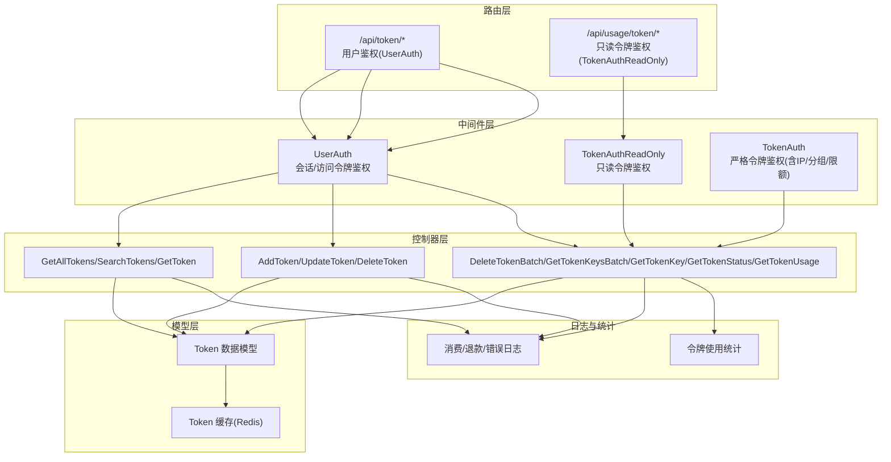
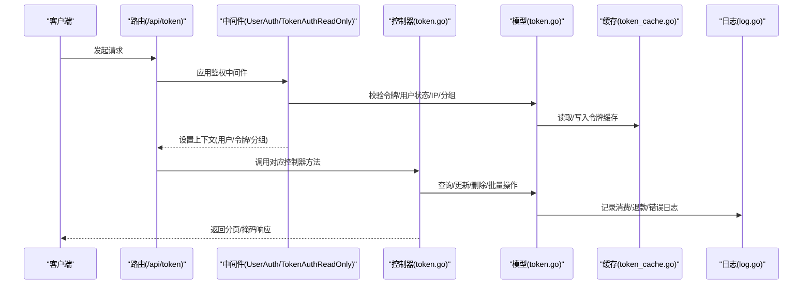
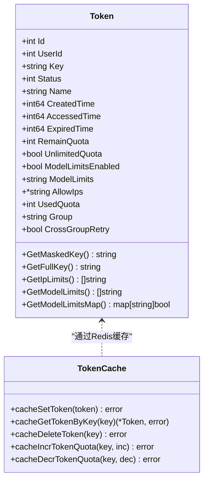
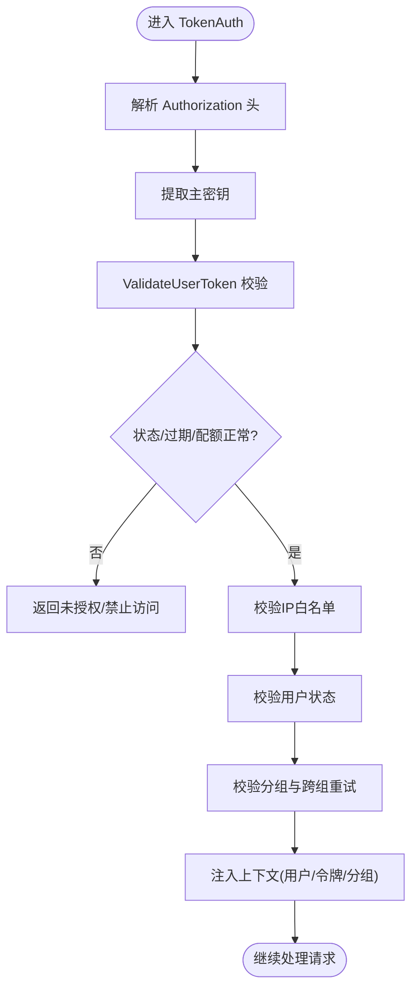
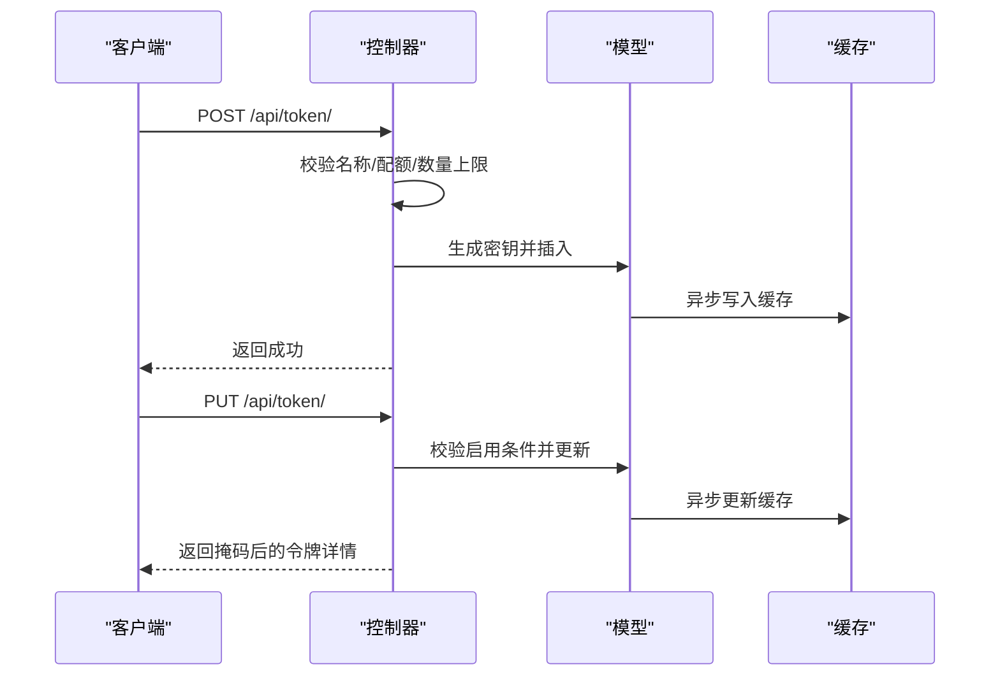
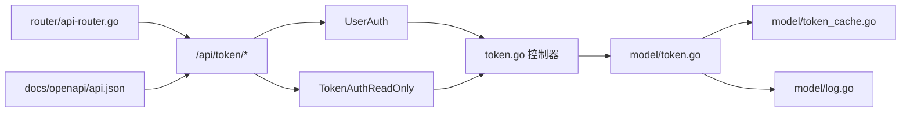

# 令牌控制器

<cite>
**本文引用的文件**
- [controller/token.go](file://controller/token.go)
- [model/token.go](file://model/token.go)
- [model/token_cache.go](file://model/token_cache.go)
- [middleware/auth.go](file://middleware/auth.go)
- [common/constants.go](file://common/constants.go)
- [setting/operation_setting/token_setting.go](file://setting/operation_setting/token_setting.go)
- [router/api-router.go](file://router/api-router.go)
- [service/token_counter.go](file://service/token_counter.go)
- [model/log.go](file://model/log.go)
- [docs/openapi/api.json](file://docs/openapi/api.json)
- [controller/token_test.go](file://controller/token_test.go)
</cite>

## 目录
1. [简介](#简介)
2. [项目结构](#项目结构)
3. [核心组件](#核心组件)
4. [架构总览](#架构总览)
5. [详细组件分析](#详细组件分析)
6. [依赖分析](#依赖分析)
7. [性能考虑](#性能考虑)
8. [故障排查指南](#故障排查指南)
9. [结论](#结论)
10. [附录](#附录)

## 简介
本文件系统性梳理“令牌控制器”的技术实现，覆盖访问令牌的生成、管理、权限控制与安全验证；详解令牌的创建、编辑、删除与批量操作；阐述令牌权限模型、配额控制与使用限制机制；给出令牌验证流程、权限检查与访问控制的具体实现路径；解释令牌与用户组的关系、模型限制与有效期管理；并涵盖令牌统计、使用记录与审计日志功能，以及令牌安全机制、防滥用策略与异常处理。目标是帮助开发者全面理解令牌控制器的安全架构与权限管理体系。

## 项目结构
令牌控制器位于后端控制器层，围绕 Gin 路由组织，配合中间件完成鉴权与速率限制，并通过模型层访问数据库与缓存，最终在日志与统计模块中沉淀审计与运营数据。

图示来源
- [router/api-router.go:249-271](file://router/api-router.go#L249-L271)
- [middleware/auth.go:170-440](file://middleware/auth.go#L170-L440)
- [controller/token.go:34-360](file://controller/token.go#L34-L360)
- [model/token.go:14-483](file://model/token.go#L14-L483)
- [model/token_cache.go:11-66](file://model/token_cache.go#L11-L66)
- [model/log.go:19-482](file://model/log.go#L19-L482)

章节来源
- [router/api-router.go:249-271](file://router/api-router.go#L249-L271)
- [middleware/auth.go:170-440](file://middleware/auth.go#L170-L440)
- [controller/token.go:34-360](file://controller/token.go#L34-L360)
- [model/token.go:14-483](file://model/token.go#L14-L483)
- [model/token_cache.go:11-66](file://model/token_cache.go#L11-L66)
- [model/log.go:19-482](file://model/log.go#L19-L482)

## 核心组件
- 控制器层：提供令牌的增删改查、批量操作与使用状态查询接口，统一输出分页与掩码响应。
- 模型层：定义令牌数据结构、检索/校验/配额变更、缓存与批量删除等能力。
- 中间件层：提供严格令牌鉴权（TokenAuth）、只读令牌鉴权（TokenAuthReadOnly）与用户鉴权（UserAuth）。
- 日志与统计：记录消费、退款、错误与任务结算日志，提供令牌使用统计与审计能力。
- 配置与常量：令牌最大数量限制、令牌状态与用户状态常量、Redis缓存开关等。

章节来源
- [controller/token.go:34-360](file://controller/token.go#L34-L360)
- [model/token.go:14-483](file://model/token.go#L14-L483)
- [middleware/auth.go:170-440](file://middleware/auth.go#L170-L440)
- [model/log.go:19-482](file://model/log.go#L19-L482)
- [setting/operation_setting/token_setting.go:1-29](file://setting/operation_setting/token_setting.go#L1-L29)
- [common/constants.go:137-219](file://common/constants.go#L137-L219)

## 架构总览
令牌控制器遵循“路由-中间件-控制器-模型-缓存/日志”的分层设计，关键流程包括：
- 用户令牌管理：通过 UserAuth 保护，支持分页、搜索、详情、创建、更新、删除与批量操作。
- 令牌使用只读查询：通过 TokenAuthReadOnly 提供令牌额度与限额信息查询。
- 严格令牌鉴权：通过 TokenAuth 校验令牌有效性、状态、过期、配额、IP 白名单、用户组与跨组重试策略。

图示来源
- [router/api-router.go:249-271](file://router/api-router.go#L249-L271)
- [middleware/auth.go:276-440](file://middleware/auth.go#L276-L440)
- [controller/token.go:34-360](file://controller/token.go#L34-L360)
- [model/token.go:188-226](file://model/token.go#L188-L226)
- [model/token_cache.go:11-66](file://model/token_cache.go#L11-L66)
- [model/log.go:75-201](file://model/log.go#L75-L201)

## 详细组件分析

### 令牌数据模型与缓存
- 数据模型字段：包含用户ID、密钥、状态、名称、创建/访问时间、过期时间、剩余配额、无限配额、模型限制开关与列表、允许IP、使用配额、分组、跨组重试等。
- 掩码与可见性：对外响应使用掩码显示密钥，避免泄露真实密钥。
- 缓存策略：支持基于 HMAC 的 Redis 哈希缓存，异步更新令牌字段与配额，提升读取性能。
- 搜索与限制：对搜索模式进行清洗与硬限制，防止高成本模糊查询；超量用户仅允许精确搜索。

图示来源
- [model/token.go:14-79](file://model/token.go#L14-L79)
- [model/token_cache.go:11-66](file://model/token_cache.go#L11-L66)

章节来源
- [model/token.go:14-79](file://model/token.go#L14-L79)
- [model/token_cache.go:11-66](file://model/token_cache.go#L11-L66)

### 令牌验证与访问控制
- 严格令牌鉴权（TokenAuth）：
  - 解析 Authorization 头，兼容多种前缀与格式，提取主密钥。
  - 调用模型层 ValidateUserToken 校验令牌有效性、状态、过期与配额。
  - 校验用户状态与IP白名单，支持分组切换与跨组重试策略。
  - 将令牌上下文注入到请求上下文中，供后续处理使用。
- 只读令牌鉴权（TokenAuthReadOnly）：
  - 仅校验令牌是否存在，不检查状态、过期与配额，仍检查用户封禁状态。
  - 适用于统计查询等只读场景。
- 用户鉴权（UserAuth）：
  - 支持会话与访问令牌两种方式，校验用户角色与状态。

图示来源
- [middleware/auth.go:276-440](file://middleware/auth.go#L276-L440)
- [model/token.go:188-226](file://model/token.go#L188-L226)

章节来源
- [middleware/auth.go:276-440](file://middleware/auth.go#L276-L440)
- [model/token.go:188-226](file://model/token.go#L188-L226)

### 令牌管理功能
- 创建令牌（AddToken）：
  - 校验名称长度与配额范围；检查用户令牌数量上限；生成唯一密钥；插入数据库。
- 更新令牌（UpdateToken）：
  - 支持状态仅更新与全量更新；校验启用条件（未过期、未耗尽）；更新数据库并异步刷新缓存。
- 删除令牌（DeleteToken）：
  - 校验用户与令牌归属；删除数据库记录并清理缓存。
- 批量删除（DeleteTokenBatch）：
  - 校验参数合法性；事务批量删除；返回成功数量。
- 批量获取密钥（GetTokenKeysBatch）：
  - 校验批量大小限制；查询真实密钥并返回映射。
- 获取密钥与状态（GetTokenKey/GetTokenStatus）：
  - 返回真实密钥（需严格速率限制与缓存禁用）；返回额度与过期信息。
- 使用查询（GetTokenUsage）：
  - 只读令牌鉴权；返回额度、模型限制与过期时间等信息。

图示来源
- [controller/token.go:167-313](file://controller/token.go#L167-L313)
- [model/token.go:279-315](file://model/token.go#L279-L315)
- [model/token_cache.go:11-19](file://model/token_cache.go#L11-L19)

章节来源
- [controller/token.go:167-313](file://controller/token.go#L167-L313)
- [model/token.go:279-315](file://model/token.go#L279-L315)
- [model/token_cache.go:11-19](file://model/token_cache.go#L11-L19)

### 令牌权限模型、配额控制与使用限制
- 权限模型：
  - 令牌状态：启用、禁用、过期、耗尽。
  - 用户状态：启用、禁用。
  - 分组与跨组重试：令牌可绑定分组，支持自动分组选择与跨组重试。
  - IP 白名单：支持 CIDR/IP 列表限制访问来源。
  - 模型限制：可开启模型白名单，限制可用模型集合。
- 配额控制：
  - 无限配额与固定配额；支持增加/减少配额并异步更新缓存。
  - 额度不足或过期时拒绝访问；支持只读查询额度。
- 使用限制：
  - 搜索关键词与令牌关键字的模糊查询有硬限制与用户令牌数量上限保护。
  - 批量操作大小限制与速率限制。

章节来源
- [common/constants.go:193-198](file://common/constants.go#L193-L198)
- [model/token.go:188-226](file://model/token.go#L188-L226)
- [model/token.go:375-433](file://model/token.go#L375-L433)
- [model/token.go:125-186](file://model/token.go#L125-L186)
- [setting/operation_setting/token_setting.go:5-29](file://setting/operation_setting/token_setting.go#L5-L29)

### 令牌与用户组、模型限制与有效期管理
- 用户组关系：
  - 令牌可绑定分组；若令牌分组与用户分组不一致，需满足可用分组与比率配置校验；支持跨组重试策略。
- 模型限制：
  - 可开启模型限制开关并设置模型白名单；提供映射结构便于快速判断。
- 有效期管理：
  - 过期时间字段支持“永不过期”标记；过期或耗尽状态会在严格校验中阻断访问；支持只读查询额度与过期时间。

章节来源
- [middleware/auth.go:382-398](file://middleware/auth.go#L382-L398)
- [model/token.go:332-350](file://model/token.go#L332-L350)
- [model/token.go:20,22:20-22](file://model/token.go#L20-L22)

### 令牌统计、使用记录与审计日志
- 统计维度：
  - 总消耗配额、近一分钟请求数（RPM）、提示与补全总token数（TPM）。
- 日志类型：
  - 消费、退款、错误、充值、系统、管理等类型。
- 记录内容：
  - 包含用户、令牌、模型、通道、分组、IP、请求ID、耗时、明细等。
- 导出与聚合：
  - 支持按时间段、模型、令牌、通道、分组等条件聚合统计。

章节来源
- [model/log.go:42-51](file://model/log.go#L42-L51)
- [model/log.go:152-201](file://model/log.go#L152-L201)
- [model/log.go:383-437](file://model/log.go#L383-L437)

### 令牌安全机制、防滥用策略与异常处理
- 安全机制：
  - 掩码密钥输出；只读查询接口需严格速率限制与缓存禁用；IP白名单与用户封禁检查。
  - 严格令牌鉴权中间件在访问链路早期拦截无效令牌。
- 防滥用策略：
  - 关键接口（如获取密钥、批量获取密钥）应用“危急速率限制”与缓存禁用。
  - 搜索接口应用“搜索速率限制”，并限制模糊查询模式。
  - 用户令牌数量上限配置，防止滥用创建大量令牌。
- 异常处理：
  - 国际化错误消息；数据库错误与记录不存在区分处理；系统日志记录异常。

章节来源
- [controller/token.go:80-95](file://controller/token.go#L80-L95)
- [controller/token.go:338-359](file://controller/token.go#L338-L359)
- [router/api-router.go:255,260,267](file://router/api-router.go#L255-L260,L267-L267)
- [middleware/auth.go:214-274](file://middleware/auth.go#L214-L274)
- [setting/operation_setting/token_setting.go:25-29](file://setting/operation_setting/token_setting.go#L25-L29)

## 依赖分析
- 控制器依赖中间件与模型层，模型层依赖缓存与日志模块。
- 路由层为控制器提供统一入口与鉴权组合。
- OpenAPI 文档定义了各接口的鉴权要求与参数。

图示来源
- [router/api-router.go:249-271](file://router/api-router.go#L249-L271)
- [controller/token.go:34-360](file://controller/token.go#L34-L360)
- [model/token.go:14-483](file://model/token.go#L14-L483)
- [model/token_cache.go:11-66](file://model/token_cache.go#L11-L66)
- [model/log.go:19-482](file://model/log.go#L19-L482)
- [docs/openapi/api.json:3313-3527](file://docs/openapi/api.json#L3313-L3527)

章节来源
- [router/api-router.go:249-271](file://router/api-router.go#L249-L271)
- [controller/token.go:34-360](file://controller/token.go#L34-L360)
- [model/token.go:14-483](file://model/token.go#L14-L483)
- [model/token_cache.go:11-66](file://model/token_cache.go#L11-L66)
- [model/log.go:19-482](file://model/log.go#L19-L482)
- [docs/openapi/api.json:3313-3527](file://docs/openapi/api.json#L3313-L3527)

## 性能考虑
- 缓存优先：令牌查询与配额变更通过 Redis 缓存加速，异步更新保证一致性。
- 批量操作：批量删除与批量获取密钥限制数量，降低数据库压力。
- 搜索限制：对模糊查询进行硬限制与用户令牌数量上限保护，避免全表扫描。
- 速率限制：关键接口采用危急速率限制与搜索速率限制，防止滥用。

## 故障排查指南
- 令牌无效/未提供：
  - 检查 Authorization 头格式与前缀；确认令牌未过期、未耗尽、未禁用。
- IP 不在白名单：
  - 核对令牌允许IP列表与客户端实际IP；确认CIDR格式正确。
- 用户被封禁：
  - 检查用户状态；只读令牌鉴权仍会校验用户状态。
- 配额不足：
  - 通过只读查询接口确认剩余配额；检查是否为无限配额。
- 搜索失败：
  - 检查是否使用了过多通配符或关键词过短；确认用户令牌数量未超过上限。
- 日志缺失：
  - 检查日志记录开关与导出开关；确认请求上下文包含必要字段。

章节来源
- [middleware/auth.go:351-365](file://middleware/auth.go#L351-L365)
- [model/token.go:188-226](file://model/token.go#L188-L226)
- [model/log.go:75-201](file://model/log.go#L75-L201)

## 结论
令牌控制器通过严格的鉴权中间件、完善的模型与缓存策略、清晰的权限与配额控制、以及完备的日志与统计体系，构建了安全、可控、可观测的令牌管理能力。开发者可据此实现安全的令牌生命周期管理与访问控制，同时利用审计与统计能力优化运营与风控策略。

## 附录
- 接口与鉴权对照（OpenAPI）
  - 令牌管理接口均需用户鉴权（UserAuth）。
  - 令牌使用只读查询接口需只读令牌鉴权（TokenAuthReadOnly）。
  - 获取密钥与批量获取密钥接口需危急速率限制与缓存禁用。

章节来源
- [docs/openapi/api.json:3313-3527](file://docs/openapi/api.json#L3313-L3527)
- [router/api-router.go:249-271](file://router/api-router.go#L249-L271)