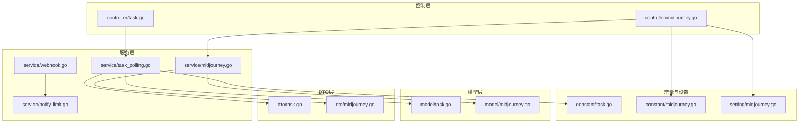
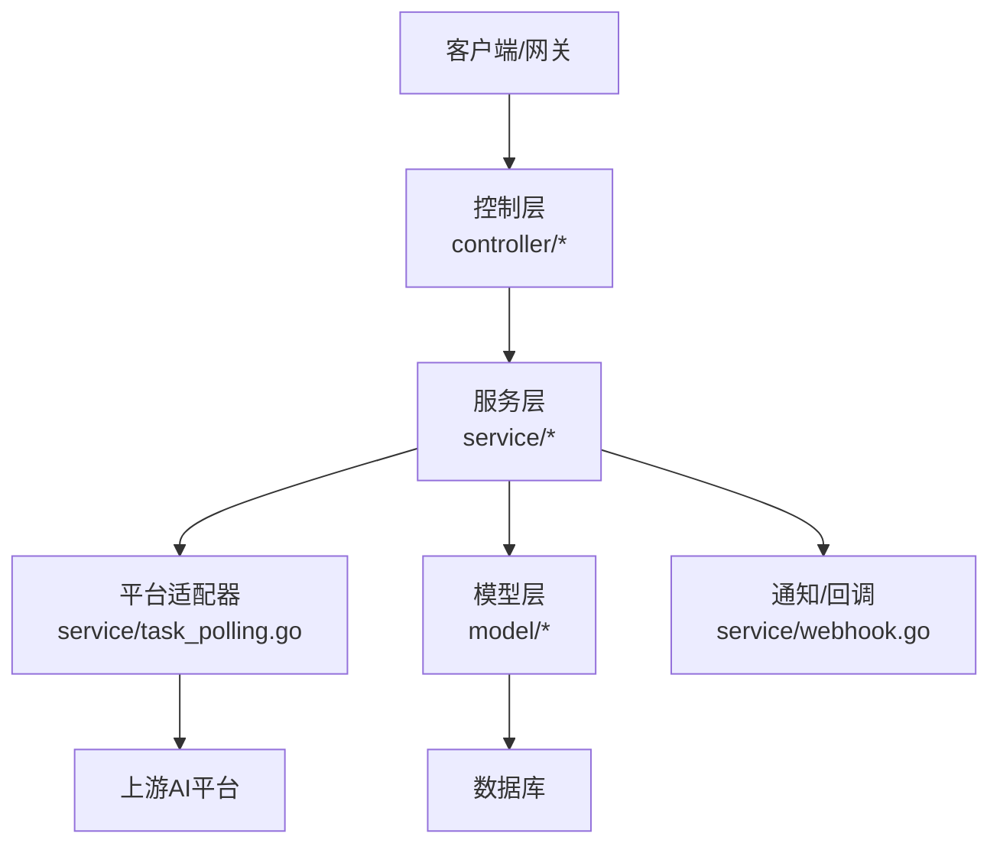
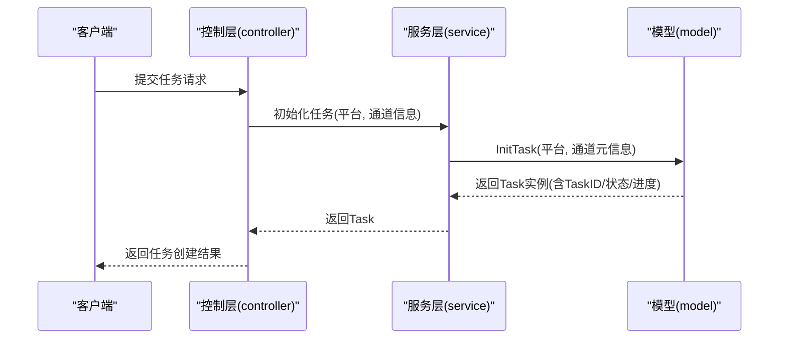
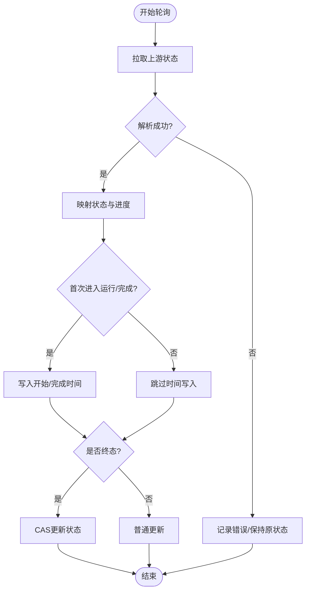
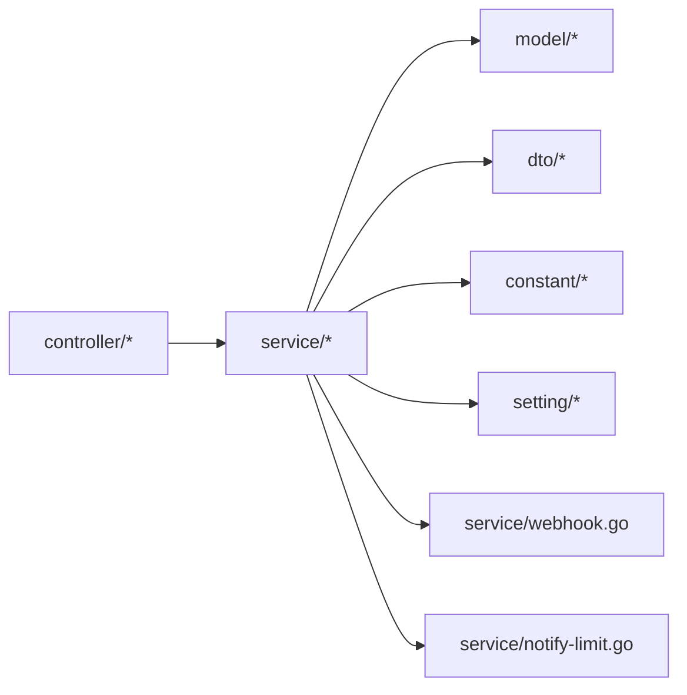

# 任务控制器

<cite>
**本文引用的文件**
- [controller/task.go](file://controller/task.go)
- [service/task_polling.go](file://service/task_polling.go)
- [model/task.go](file://model/task.go)
- [dto/task.go](file://dto/task.go)
- [controller/midjourney.go](file://controller/midjourney.go)
- [service/midjourney.go](file://service/midjourney.go)
- [model/midjourney.go](file://model/midjourney.go)
- [dto/midjourney.go](file://dto/midjourney.go)
- [constant/task.go](file://constant/task.go)
- [constant/midjourney.go](file://constant/midjourney.go)
- [setting/midjourney.go](file://setting/midjourney.go)
- [service/webhook.go](file://service/webhook.go)
- [service/notify-limit.go](file://service/notify-limit.go)
</cite>

## 目录
1. [简介](#简介)
2. [项目结构](#项目结构)
3. [核心组件](#核心组件)
4. [架构总览](#架构总览)
5. [详细组件分析](#详细组件分析)
6. [依赖分析](#依赖分析)
7. [性能考虑](#性能考虑)
8. [故障排查指南](#故障排查指南)
9. [结论](#结论)
10. [附录](#附录)

## 简介
本技术文档围绕“任务控制器”展开，系统性阐述异步任务的创建、调度、状态管理与结果获取实现，覆盖任务队列管理、优先级控制、并发处理、状态跟踪与进度监控、超时处理、与AI服务的集成、回调与通知机制、日志与错误处理及恢复策略。文档特别针对Midjourney等特定任务类型的处理流程进行深入解析，帮助开发者快速理解任务控制器的异步架构与任务管理机制。

## 项目结构
任务控制器相关代码主要分布在以下模块：
- 控制层：负责HTTP接口与分页查询、批量轮询入口
- 服务层：负责任务轮询、适配器调度、计费结算、退款与通知
- 模型层：定义任务数据结构、状态机、持久化与查询
- DTO层：定义任务响应与传输对象
- 常量与设置：定义任务平台与动作常量、Midjourney开关
- Midjourney专用：Midjourney控制器、服务与模型



**图表来源**
- [controller/task.go:1-95](file://controller/task.go#L1-L95)
- [controller/midjourney.go:1-306](file://controller/midjourney.go#L1-L306)
- [service/task_polling.go:1-561](file://service/task_polling.go#L1-L561)
- [service/midjourney.go:1-260](file://service/midjourney.go#L1-L260)
- [model/task.go:1-509](file://model/task.go#L1-L509)
- [model/midjourney.go:1-221](file://model/midjourney.go#L1-L221)
- [dto/task.go:1-58](file://dto/task.go#L1-L58)
- [dto/midjourney.go:1-108](file://dto/midjourney.go#L1-L108)
- [constant/task.go:1-25](file://constant/task.go#L1-L25)
- [constant/midjourney.go:1-49](file://constant/midjourney.go#L1-L49)
- [setting/midjourney.go:1-8](file://setting/midjourney.go#L1-L8)

**章节来源**
- [controller/task.go:1-95](file://controller/task.go#L1-L95)
- [controller/midjourney.go:1-306](file://controller/midjourney.go#L1-L306)
- [service/task_polling.go:1-561](file://service/task_polling.go#L1-L561)
- [service/midjourney.go:1-260](file://service/midjourney.go#L1-L260)
- [model/task.go:1-509](file://model/task.go#L1-L509)
- [model/midjourney.go:1-221](file://model/midjourney.go#L1-L221)
- [dto/task.go:1-58](file://dto/task.go#L1-L58)
- [dto/midjourney.go:1-108](file://dto/midjourney.go#L1-L108)
- [constant/task.go:1-25](file://constant/task.go#L1-L25)
- [constant/midjourney.go:1-49](file://constant/midjourney.go#L1-L49)
- [setting/midjourney.go:1-8](file://setting/midjourney.go#L1-L8)

## 核心组件
- 任务模型与状态机：定义任务状态、属性、私有数据与计费上下文，支持CAS更新与批量更新。
- 任务轮询服务：按平台分发轮询，统一处理超时清理、进度更新、计费结算与退款。
- Midjourney专用控制器与服务：独立轮询流程，支持超时判定、按钮与属性映射、额度退还。
- 控制器接口：提供任务列表查询、分页与批量轮询入口。
- DTO与常量：标准化任务响应结构与平台/动作常量。

**章节来源**
- [model/task.go:15-120](file://model/task.go#L15-L120)
- [service/task_polling.go:24-561](file://service/task_polling.go#L24-L561)
- [controller/midjourney.go:23-200](file://controller/midjourney.go#L23-L200)
- [dto/task.go:32-58](file://dto/task.go#L32-L58)
- [constant/task.go:3-25](file://constant/task.go#L3-L25)

## 架构总览
任务控制器采用“控制层-服务层-模型层”的分层架构，配合DTO与常量，形成可扩展的任务管理闭环。服务层通过适配器模式对接不同平台，统一执行轮询、状态推进与计费结算；控制层提供REST接口与批量轮询入口；模型层负责数据持久化与并发安全更新。



**图表来源**
- [controller/task.go:17-20](file://controller/task.go#L17-L20)
- [service/task_polling.go:24-36](file://service/task_polling.go#L24-L36)
- [service/webhook.go:18-59](file://service/webhook.go#L18-L59)
- [model/task.go:360-431](file://model/task.go#L360-L431)

## 详细组件分析

### 异步任务创建与初始化
- 控制层接收请求后，调用服务层初始化任务模型，填充平台、用户、渠道、分组、提交时间、初始状态与进度等元数据。
- 任务ID生成策略：优先使用外部公开ID，否则自动生成唯一ID。
- 私有数据与属性：根据通道元信息写入密钥、上游模型名与原始模型名，便于后续轮询与计费。



**图表来源**
- [controller/task.go:17-20](file://controller/task.go#L17-L20)
- [model/task.go:172-209](file://model/task.go#L172-L209)

**章节来源**
- [controller/task.go:17-20](file://controller/task.go#L17-L20)
- [model/task.go:172-209](file://model/task.go#L172-L209)

### 任务轮询与状态推进
- 主轮询循环：每15秒扫描未完成任务，按平台与渠道聚合，调用对应适配器批量拉取状态。
- 超时清理：独立清理超时未完成任务，使用CAS保证并发安全，必要时触发退款。
- 状态推进：根据上游返回状态映射进度，首次进入运行/开始/完成时写入起始/完成时间；失败时记录原因并可退款。
- 计费结算：优先由适配器决定最终额度，其次按token重算，最后保持预扣不变。

```mermaid
sequenceDiagram
participant Loop as "轮询循环"
participant Svc as "服务层"
participant Adpt as "平台适配器"
participant Up as "上游平台"
participant DB as "数据库"
Loop->>Svc : TaskPollingLoop()
Svc->>DB : 查询未完成任务(按平台/渠道分组)
Svc->>Adpt : FetchTask(批量)
Adpt->>Up : 拉取任务状态
Up-->>Adpt : 返回状态/结果
Adpt-->>Svc : ParseTaskResult()
Svc->>DB : UpdateWithStatus(CAS)
alt 成功终态
Svc->>DB : 结算/退款
end
```

**图表来源**
- [service/task_polling.go:90-138](file://service/task_polling.go#L90-L138)
- [service/task_polling.go:290-502](file://service/task_polling.go#L290-L502)
- [model/task.go:404-431](file://model/task.go#L404-L431)

**章节来源**
- [service/task_polling.go:90-138](file://service/task_polling.go#L90-L138)
- [service/task_polling.go:290-502](file://service/task_polling.go#L290-L502)
- [model/task.go:404-431](file://model/task.go#L404-L431)

### Midjourney任务处理流程
- 独立轮询：每15秒扫描未完成Midjourney任务，按渠道聚合请求列表接口。
- 超时判定：若任务耗时超过1小时且进度非100%，标记失败。
- 状态映射：进度、状态、图片/视频URL、按钮与属性等字段映射至本地任务。
- 额度退还：失败或中途失败时，按预扣额度退还并记录账单日志。

```mermaid
sequenceDiagram
participant Loop as "Midjourney轮询"
participant Ctrl as "控制器"
participant Svc as "服务层"
participant Up as "Midjourney平台"
participant DB as "数据库"
Loop->>Ctrl : UpdateMidjourneyTaskBulk()
Ctrl->>DB : 查询未完成任务(按渠道分组)
Ctrl->>Up : POST /mj/task/list-by-condition
Up-->>Ctrl : 返回任务列表
Ctrl->>DB : UpdateWithStatus(CAS)
alt 失败或超时
Ctrl->>DB : 退还额度/记录日志
end
```

**图表来源**
- [controller/midjourney.go:23-200](file://controller/midjourney.go#L23-L200)
- [model/midjourney.go:160-171](file://model/midjourney.go#L160-L171)

**章节来源**
- [controller/midjourney.go:23-200](file://controller/midjourney.go#L23-L200)
- [model/midjourney.go:93-102](file://model/midjourney.go#L93-L102)

### 任务状态跟踪与进度监控
- 进度映射：根据状态映射标准进度（提交/排队/进行中/完成/失败），首次进入运行态写入开始时间，完成态写入结束时间。
- 数据脱敏：对上游返回的敏感内容进行脱敏与截断，仅保留必要字段。
- 变更检测：比较快照以减少无效更新，提升并发安全性。



**图表来源**
- [service/task_polling.go:344-502](file://service/task_polling.go#L344-L502)
- [model/task.go:366-396](file://model/task.go#L366-L396)

**章节来源**
- [service/task_polling.go:344-502](file://service/task_polling.go#L344-L502)
- [model/task.go:366-396](file://model/task.go#L366-L396)

### 超时处理与退款
- 超时清理：独立扫描超时未完成任务，使用CAS更新状态为失败并标记100%进度，必要时触发退款。
- 旧任务区分：对历史遗留任务给出特殊失败原因提示，不进行退款。
- Midjourney超时：超过1小时仍未完成标记失败。

**章节来源**
- [service/task_polling.go:38-88](file://service/task_polling.go#L38-L88)
- [controller/midjourney.go:125-129](file://controller/midjourney.go#L125-L129)

### 任务队列管理、优先级与并发控制
- 并发轮询：按平台与渠道分组，逐渠道顺序拉取，渠道内逐任务间隔1秒，避免上游限流。
- CAS更新：使用基于状态的CAS更新，确保并发场景下只有一个进程推进状态，避免竞态。
- 批量更新：提供无CAS的批量更新函数，仅用于非计费生命周期的场景。

**章节来源**
- [service/task_polling.go:290-342](file://service/task_polling.go#L290-L342)
- [model/task.go:404-431](file://model/task.go#L404-L431)

### 任务与AI服务的集成、回调与通知
- 适配器接口：定义Init/FetchTask/Parsing/计费调整接口，屏蔽平台差异。
- Midjourney回调：通过设置项控制是否启用通知、账户过滤与模式清理。
- 通知系统：支持Webhook签名、限流与内存/Redis双存储限速，防止通知风暴。

**章节来源**
- [service/task_polling.go:24-32](file://service/task_polling.go#L24-L32)
- [setting/midjourney.go:3-8](file://setting/midjourney.go#L3-L8)
- [service/webhook.go:18-59](file://service/webhook.go#L18-L59)
- [service/notify-limit.go:60-118](file://service/notify-limit.go#L60-L118)

### 日志记录、错误处理与恢复策略
- 日志分级：调试、信息、警告、错误日志，关键路径均记录上下文。
- 错误分类：上游空状态、未知错误格式、429限流等，分别采取不同处理策略。
- 恢复策略：超时清理、批量修复空ID任务、渠道不可用时批量标记失败。

**章节来源**
- [service/task_polling.go:391-420](file://service/task_polling.go#L391-L420)
- [service/task_polling.go:119-129](file://service/task_polling.go#L119-L129)
- [controller/midjourney.go:47-57](file://controller/midjourney.go#L47-L57)

### Midjourney特定任务类型处理
- 动作映射：将多种Plus动作转换为标准动作（如Upscale/Variation/Reroll等），并支持简单变更语法。
- 模型名生成：根据动作生成对应模型名，便于计费与统计。
- 图片/视频URL：支持单URL与多URL映射，必要时构造代理URL。

**章节来源**
- [service/midjourney.go:30-75](file://service/midjourney.go#L30-L75)
- [constant/midjourney.go:8-27](file://constant/midjourney.go#L8-L27)
- [dto/midjourney.go:47-68](file://dto/midjourney.go#L47-L68)

## 依赖分析
- 控制层依赖服务层与模型层，提供REST接口与批量轮询入口。
- 服务层依赖模型层与DTO，通过适配器对接上游平台。
- Midjourney路径具有独立控制器与服务，依赖设置项与模型层。
- 通知与限流服务独立，供任务完成/失败时触发。



**图表来源**
- [controller/task.go:1-15](file://controller/task.go#L1-L15)
- [service/task_polling.go:1-22](file://service/task_polling.go#L1-L22)
- [model/task.go:1-13](file://model/task.go#L1-L13)
- [dto/task.go:1-6](file://dto/task.go#L1-L6)
- [constant/task.go:1-6](file://constant/task.go#L1-L6)
- [setting/midjourney.go:1-8](file://setting/midjourney.go#L1-L8)

**章节来源**
- [controller/task.go:1-15](file://controller/task.go#L1-L15)
- [service/task_polling.go:1-22](file://service/task_polling.go#L1-L22)
- [model/task.go:1-13](file://model/task.go#L1-L13)
- [dto/task.go:1-6](file://dto/task.go#L1-L6)
- [constant/task.go:1-6](file://constant/task.go#L1-L6)
- [setting/midjourney.go:1-8](file://setting/midjourney.go#L1-L8)

## 性能考虑
- 轮询频率：主轮询每15秒一次，Midjourney轮询每15秒一次，兼顾实时性与上游限流。
- 批量处理：按渠道聚合批量请求，减少网络往返。
- 并发安全：CAS更新避免状态竞态，批量更新仅用于非计费场景。
- 限流与降噪：渠道内逐任务间隔1秒，通知限流防止风暴。

[本节为通用建议，无需具体文件引用]

## 故障排查指南
- 任务长时间无进展
  - 检查上游返回状态是否为空或错误格式，确认429限流处理逻辑。
  - 查看超时清理日志与批量修复记录。
- 任务失败但未退款
  - 确认计费上下文与适配器结算逻辑，检查退款触发条件。
- Midjourney任务超时
  - 检查超时阈值与失败标记逻辑，确认渠道可用性与请求头设置。
- 通知风暴或失败
  - 检查通知限流配置与签名生成，核对Webhook URL与密钥。

**章节来源**
- [service/task_polling.go:391-420](file://service/task_polling.go#L391-L420)
- [service/task_polling.go:119-129](file://service/task_polling.go#L119-L129)
- [controller/midjourney.go:125-129](file://controller/midjourney.go#L125-L129)
- [service/webhook.go:27-59](file://service/webhook.go#L27-L59)
- [service/notify-limit.go:60-118](file://service/notify-limit.go#L60-L118)

## 结论
任务控制器通过清晰的分层设计与适配器模式，实现了对多平台异步任务的统一管理。借助CAS更新、批量处理与超时清理等机制，系统在高并发场景下仍能保持状态一致性与稳定性。Midjourney等特定任务类型的独立处理流程进一步增强了系统的可扩展性与可维护性。开发者可据此快速接入新平台、优化轮询策略与计费结算，并完善通知与日志体系。

[本节为总结，无需具体文件引用]

## 附录

### API与数据模型概览
- 任务模型字段：任务ID、平台、用户ID、渠道ID、分组、配额、动作、状态、失败原因、提交/开始/完成时间、进度、属性、私有数据、数据载荷。
- Midjourney模型字段：与任务模型类似，额外包含图片/视频URL、按钮、属性等。
- DTO任务响应：统一的响应结构，包含状态码、消息与数据体。

**章节来源**
- [model/task.go:44-136](file://model/task.go#L44-L136)
- [model/midjourney.go:3-26](file://model/midjourney.go#L3-L26)
- [dto/task.go:22-58](file://dto/task.go#L22-L58)
- [dto/midjourney.go:47-108](file://dto/midjourney.go#L47-L108)

### 任务平台与动作常量
- 平台：Suno、Midjourney。
- Midjourney动作：Imagine、Describe、Blend、Upscale、Variation、Reroll、Inpaint、Modal、Zoom、CustomZoom、Shorten、High/Low Variation、Pan、SwapFace、Upload、Video、Edits。

**章节来源**
- [constant/task.go:5-8](file://constant/task.go#L5-L8)
- [constant/midjourney.go:8-27](file://constant/midjourney.go#L8-L27)