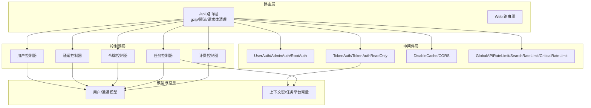
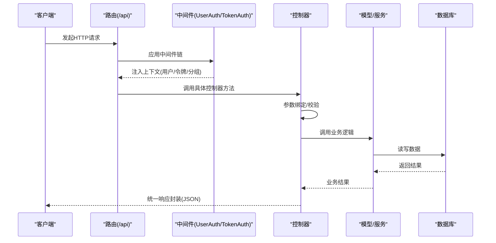
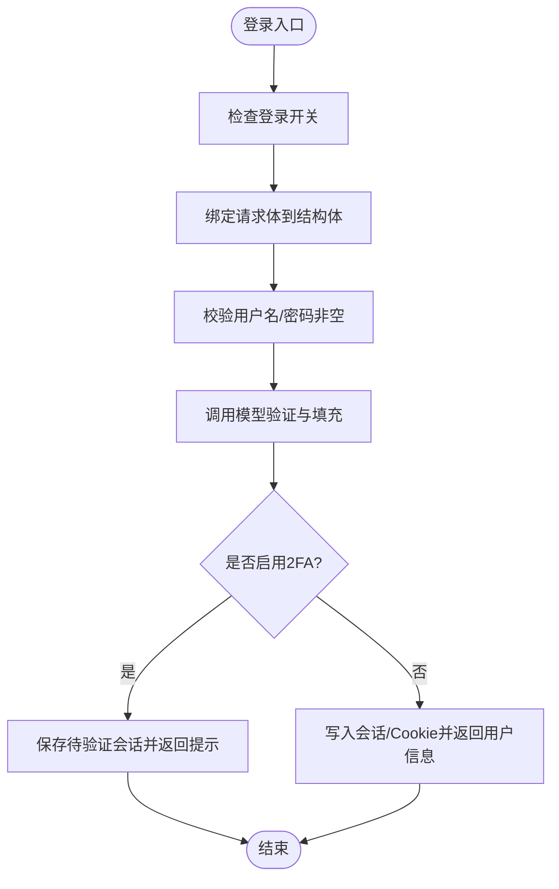
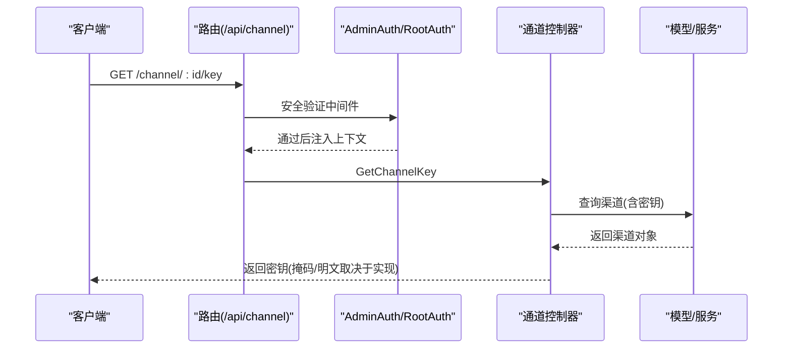
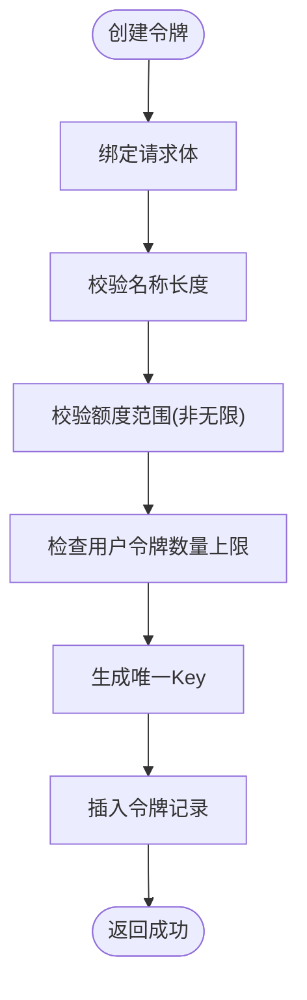
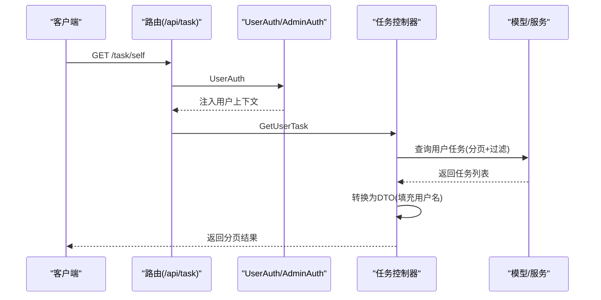
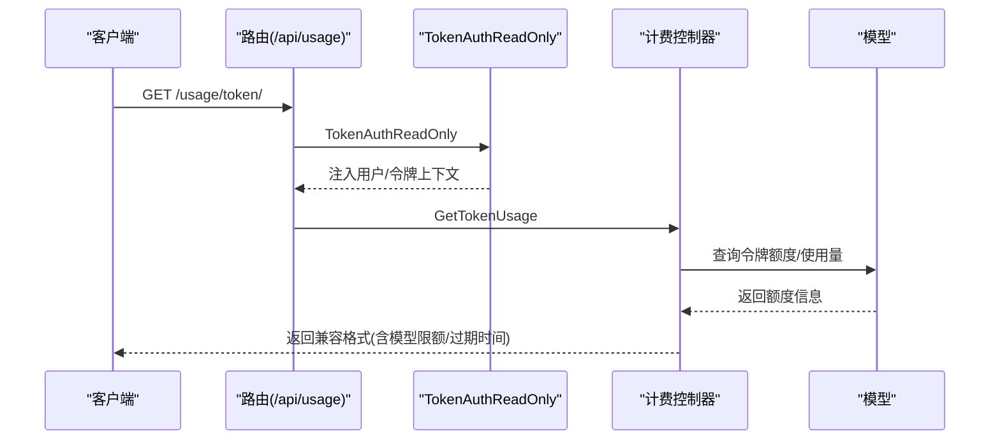
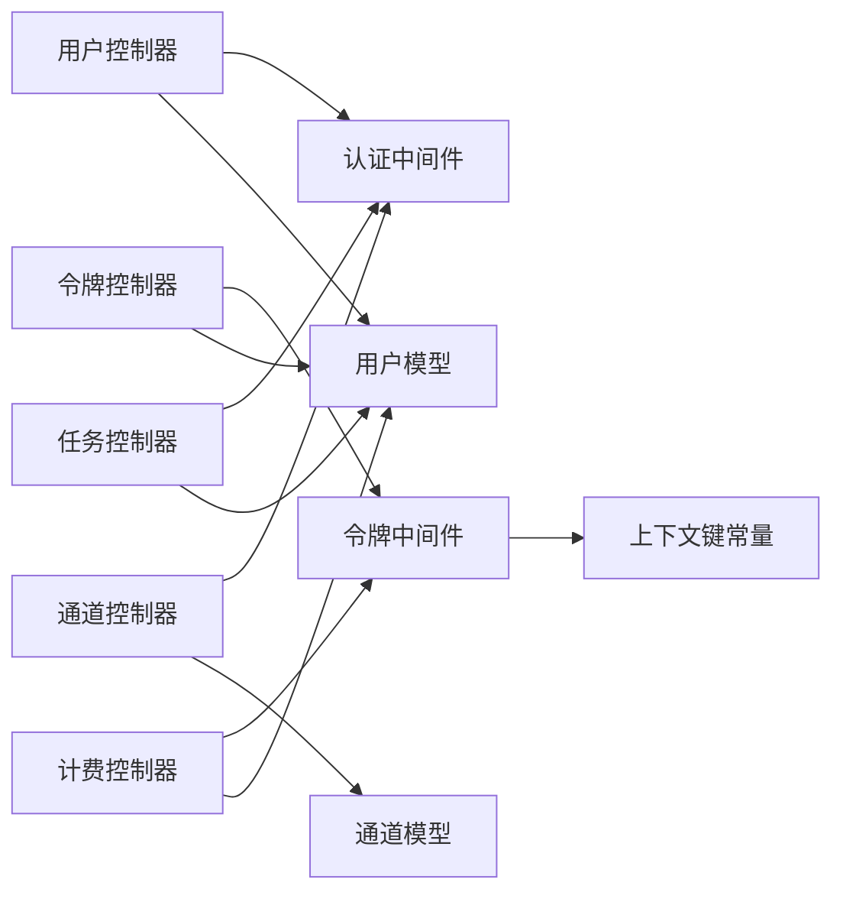

# 控制器层

<cite>
**本文引用的文件**
- [controller/user.go](file://controller/user.go)
- [controller/channel.go](file://controller/channel.go)
- [controller/token.go](file://controller/token.go)
- [controller/task.go](file://controller/task.go)
- [controller/billing.go](file://controller/billing.go)
- [router/api-router.go](file://router/api-router.go)
- [middleware/auth.go](file://middleware/auth.go)
- [router/main.go](file://router/main.go)
- [model/user.go](file://model/user.go)
- [model/channel.go](file://model/channel.go)
- [constant/context_key.go](file://constant/context_key.go)
- [constant/task.go](file://constant/task.go)
- [dto/error.go](file://dto/error.go)
- [common/api_type.go](file://common/api_type.go)
</cite>

## 目录
1. [简介](#简介)
2. [项目结构](#项目结构)
3. [核心组件](#核心组件)
4. [架构总览](#架构总览)
5. [详细组件分析](#详细组件分析)
6. [依赖分析](#依赖分析)
7. [性能考量](#性能考量)
8. [故障排查指南](#故障排查指南)
9. [结论](#结论)
10. [附录](#附录)

## 简介
本文件面向 New API 项目的控制器层，系统性梳理控制器的设计模式、职责划分与请求处理流程，覆盖用户管理、通道管理、令牌管理、任务处理与计费相关控制器的实现要点。文档重点阐述：
- 请求参数验证与绑定策略
- 响应格式化与错误处理机制
- 控制器与服务层的交互模式、依赖注入与事务管理
- RESTful 设计原则、HTTP 方法使用与资源命名规范
- 与中间件协作的认证授权、速率限制与缓存控制
- 状态码管理与国际化消息输出

## 项目结构
控制器层位于 controller 目录，按业务域拆分：用户、通道、令牌、任务、计费等；路由由 router 统一注册，中间件在路由层集中装配，形成清晰的分层与解耦。

图示来源
- [router/api-router.go:14-380](file://router/api-router.go#L14-L380)
- [middleware/auth.go:36-440](file://middleware/auth.go#L36-L440)
- [controller/user.go:32-134](file://controller/user.go#L32-L134)
- [controller/channel.go:71-174](file://controller/channel.go#L71-L174)
- [controller/token.go:34-46](file://controller/token.go#L34-L46)
- [controller/task.go:22-43](file://controller/task.go#L22-L43)
- [controller/billing.go:11-69](file://controller/billing.go#L11-L69)
- [model/user.go:23-53](file://model/user.go#L23-L53)
- [model/channel.go:21-58](file://model/channel.go#L21-L58)
- [constant/context_key.go:5-70](file://constant/context_key.go#L5-L70)
- [constant/task.go:3-25](file://constant/task.go#L3-L25)

章节来源
- [router/api-router.go:14-380](file://router/api-router.go#L14-L380)
- [router/main.go:16-36](file://router/main.go#L16-L36)

## 核心组件
- 用户控制器：负责登录、注册、会话管理、个人信息、权限与配额、邀请与分成、绑定清理等。
- 通道控制器：负责渠道的增删改查、测试、余额更新、模型拉取、多键模式、标签管理、Codex 凭证刷新等。
- 令牌控制器：负责令牌的增删改查、额度与有效期、模型限额、IP 白名单、批量操作等。
- 任务控制器：负责任务列表查询、用户任务查询、批量轮询入口。
- 计费控制器：负责订阅与用量的 OpenAI 兼容接口响应。

章节来源
- [controller/user.go:32-800](file://controller/user.go#L32-L800)
- [controller/channel.go:71-800](file://controller/channel.go#L71-L800)
- [controller/token.go:34-360](file://controller/token.go#L34-L360)
- [controller/task.go:17-95](file://controller/task.go#L17-L95)
- [controller/billing.go:11-109](file://controller/billing.go#L11-L109)

## 架构总览
控制器层遵循“薄控制器、厚模型/服务”的设计原则，控制器仅负责：
- 参数解析与绑定（含 JSON、路径参数、查询参数）
- 调用服务层执行业务逻辑
- 统一响应封装与错误处理
- 与中间件协作完成认证、授权、限流、缓存与请求体清理

图示来源
- [router/api-router.go:14-380](file://router/api-router.go#L14-L380)
- [middleware/auth.go:36-440](file://middleware/auth.go#L36-L440)
- [controller/user.go:32-134](file://controller/user.go#L32-L134)
- [controller/channel.go:71-174](file://controller/channel.go#L71-L174)
- [controller/token.go:34-46](file://controller/token.go#L34-L46)
- [controller/task.go:22-43](file://controller/task.go#L22-L43)
- [controller/billing.go:11-69](file://controller/billing.go#L11-L69)

## 详细组件分析

### 用户控制器（用户管理）
- 登录/登出/注册
  - 登录：参数校验、用户凭据验证、2FA 流程、会话写入与 Cookie 设置、国际化错误处理。
  - 注销：清空会话并持久化。
  - 注册：参数校验、邮箱验证码校验（可选）、去重检查、默认令牌生成与额度初始化。
- 个人信息与权限
  - 获取自身信息：隐藏敏感备注、合并用户设置与权限计算、返回 sidebar_modules 与权限映射。
  - 更新自身：支持设置项与语言偏好更新，以及常规字段更新。
  - 权限计算：根据角色动态生成侧边栏模块与权限开关。
- 管理端能力
  - 获取全部用户/搜索用户、获取单个用户详情、更新用户（含角色与密码）、删除用户、清除第三方绑定。
- 邀请与配额
  - 生成推广邀请码、推广配额转移、Aff 配额统计与历史累计。

图示来源
- [controller/user.go:32-117](file://controller/user.go#L32-L117)
- [controller/user.go:136-232](file://controller/user.go#L136-L232)

章节来源
- [controller/user.go:32-800](file://controller/user.go#L32-L800)
- [model/user.go:23-53](file://model/user.go#L23-L53)

### 通道控制器（通道管理）
- 列表与搜索
  - 获取全部通道：支持分页、排序、状态过滤、类型过滤、标签模式聚合。
  - 搜索通道：关键词/分组/模型关键字/状态过滤/类型过滤/分页。
- 详情与密钥
  - 获取单个通道：清理敏感信息后返回。
  - 获取渠道密钥：需安全验证中间件保护，记录操作日志。
- 增删改与修复
  - 添加通道：支持单键、多键、批量导入、多键模式选择、Vertex AI 多 Key 校验与清洗。
  - 删除通道：单个/禁用清理。
  - 修复能力：自动修复渠道能力字段。
- 上游模型与测试
  - 拉取上游模型列表、测试通道连通性、更新余额。
- 标签与多键管理
  - 标签禁用/启用/编辑、多键模式管理、上游模型变更检测与应用。
- 通用校验与头部构建
  - validateChannel：统一校验渠道设置、模型名长度、特定渠道（如 VertexAI）区域字段、Codex JSON 校验。
  - 构建请求头：按渠道类型设置鉴权头与覆盖规则。

图示来源
- [router/api-router.go:206-248](file://router/api-router.go#L206-L248)
- [controller/channel.go:383-416](file://controller/channel.go#L383-L416)
- [controller/channel.go:566-664](file://controller/channel.go#L566-L664)
- [controller/channel.go:435-493](file://controller/channel.go#L435-L493)

章节来源
- [controller/channel.go:71-800](file://controller/channel.go#L71-L800)
- [model/channel.go:21-58](file://model/channel.go#L21-L58)

### 令牌控制器（令牌管理）
- 列表与搜索
  - 获取用户全部令牌：分页、掩码密钥返回。
  - 搜索令牌：关键词/令牌号过滤。
- 详情与密钥
  - 获取令牌详情：掩码密钥返回。
  - 获取令牌完整密钥：需安全验证中间件保护。
  - 令牌额度查询：兼容 OpenAI 计费接口字段语义。
- 创建与更新
  - 创建令牌：名称长度限制、额度范围校验、用户令牌数量上限、生成唯一 Key。
  - 更新令牌：名称长度、额度范围、状态合法性（过期/耗尽不可启用）、模型限额/IP 白名单等。
- 批量操作
  - 批量删除、批量导出密钥（上限限制）。

图示来源
- [controller/token.go:167-234](file://controller/token.go#L167-L234)
- [controller/token.go:250-313](file://controller/token.go#L250-L313)

章节来源
- [controller/token.go:34-360](file://controller/token.go#L34-L360)

### 任务控制器（任务处理）
- 批量轮询入口：薄入口，实际轮询逻辑在服务层。
- 任务列表
  - 获取全部任务：支持平台、任务ID、状态、动作、时间戳、渠道ID过滤。
  - 获取用户任务：同上，按用户维度过滤。
- DTO 转换：批量加载用户基础信息，填充用户名，转换为 DTO。

图示来源
- [router/api-router.go:322-326](file://router/api-router.go#L322-L326)
- [controller/task.go:45-67](file://controller/task.go#L45-L67)
- [controller/task.go:69-95](file://controller/task.go#L69-L95)
- [constant/task.go:3-25](file://constant/task.go#L3-L25)

章节来源
- [controller/task.go:17-95](file://controller/task.go#L17-L95)

### 计费控制器（计费相关）
- 订阅查询：兼容 OpenAI 订阅接口，支持按令牌或用户维度返回软/硬限额与到期时间。
- 用量查询：兼容 OpenAI 用量接口，支持按令牌或用户维度返回总使用量。

图示来源
- [router/api-router.go:263-271](file://router/api-router.go#L263-L271)
- [controller/billing.go:71-108](file://controller/billing.go#L71-L108)

章节来源
- [controller/billing.go:11-109](file://controller/billing.go#L11-L109)

## 依赖分析
- 控制器与中间件
  - 路由层集中装配 gzip、全局限流、请求体清理、CORS、速率限制等中间件。
  - 认证中间件按角色注入上下文（UserAuth/AdminAuth/RootAuth），令牌中间件负责令牌解析、IP 白名单、分组切换与上下文设置。
- 控制器与模型/服务
  - 控制器仅做参数绑定与响应封装，业务逻辑委托给模型/服务层；部分控制器直接调用服务层（如任务轮询）。
- 上下文键与分组
  - 通过常量定义的上下文键在令牌中间件中注入用户/令牌/通道/分组等信息，供后续处理使用。

图示来源
- [router/api-router.go:14-380](file://router/api-router.go#L14-L380)
- [middleware/auth.go:36-440](file://middleware/auth.go#L36-L440)
- [constant/context_key.go:5-70](file://constant/context_key.go#L5-L70)

章节来源
- [router/api-router.go:14-380](file://router/api-router.go#L14-L380)
- [middleware/auth.go:36-440](file://middleware/auth.go#L36-L440)
- [constant/context_key.go:5-70](file://constant/context_key.go#L5-L70)

## 性能考量
- 中间件链顺序与开销
  - gzip 压缩、全局限流、请求体清理、CORS、速率限制等中间件对吞吐与延迟有直接影响，建议在路由层合理组合，避免重复执行。
- 令牌中间件的上下文注入
  - 令牌中间件会进行 IP 白名单校验与分组切换，建议在高并发场景下减少不必要的数据库查询与日志输出。
- 通道多键轮询
  - 通道模型的多键轮询采用锁保护，避免竞态；在高并发场景下注意锁粒度与缓存命中率。
- 任务轮询
  - 任务控制器提供批量轮询入口，建议结合后台任务调度与限流策略，避免阻塞主请求线程。

## 故障排查指南
- 认证与授权
  - 未登录/令牌无效：检查 Authorization 头、Bearer 前缀、sk- 前缀处理与 Sec-WebSocket-Protocol 兼容。
  - 用户被封禁：检查用户状态与 IP 白名单。
  - 角色不足：确认中间件角色级别与用户角色。
- 参数与绑定
  - JSON 解析失败：检查请求体格式与字段大小写。
  - 绑定校验失败：关注结构体 tag 与必填字段。
- 错误响应格式
  - 统一使用通用错误 DTO，优先尝试解析 OpenAI 风格错误消息，便于前端与上游系统识别。
- 日志与可观测性
  - 关键路径记录系统日志与操作日志，便于定位问题。

章节来源
- [middleware/auth.go:36-440](file://middleware/auth.go#L36-L440)
- [dto/error.go:17-94](file://dto/error.go#L17-L94)

## 结论
控制器层通过明确的职责边界与中间件协作，实现了清晰的请求处理流水线。用户、通道、令牌、任务与计费控制器分别聚焦于各自领域，配合统一的响应封装与错误处理，既保证了易用性，也为扩展与维护提供了良好基础。建议在后续迭代中持续优化中间件链路、增强可观测性与完善单元测试覆盖。

## 附录
- RESTful 设计要点
  - 资源命名：使用名词复数形式，如 /user、/channel、/token、/task、/usage。
  - HTTP 方法：GET/POST/PUT/DELETE/HEAD/OPTIONS 等按资源与动作正确使用。
  - 状态码：遵循语义化状态码，错误时返回 4xx/5xx 并携带错误信息。
- 与服务层交互
  - 控制器不直接处理复杂业务，仅做参数校验与调用服务层；事务与一致性在服务层保证。
- 依赖注入与上下文
  - 通过中间件向上下文注入用户/令牌/分组等信息，控制器按需读取，避免重复查询。