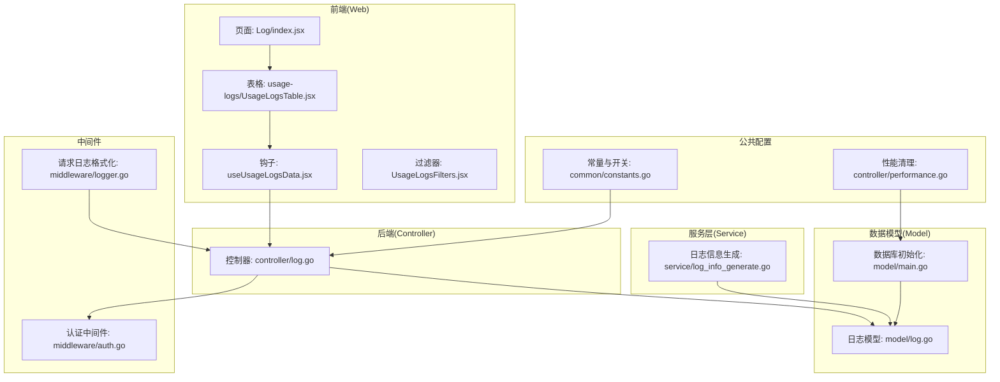
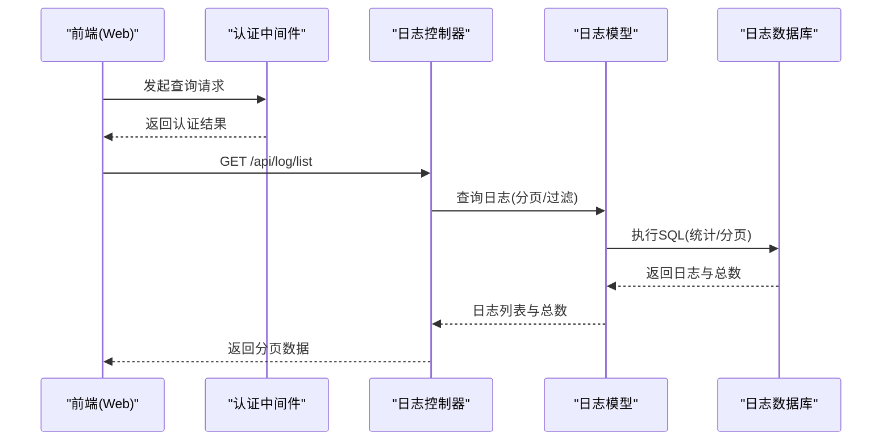
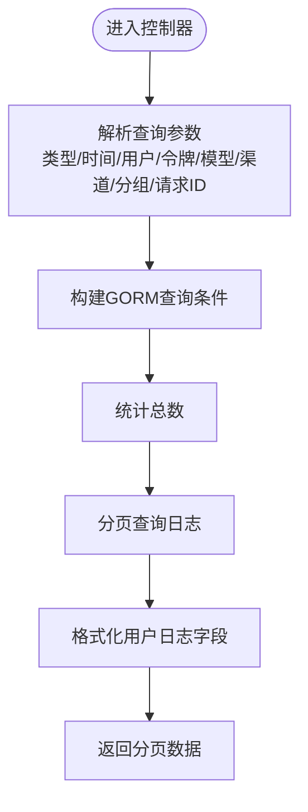
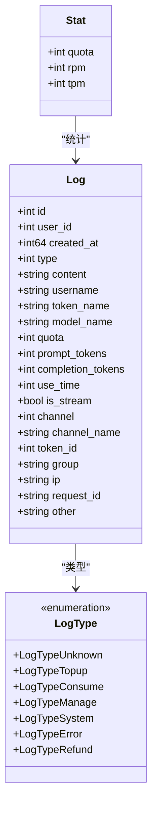
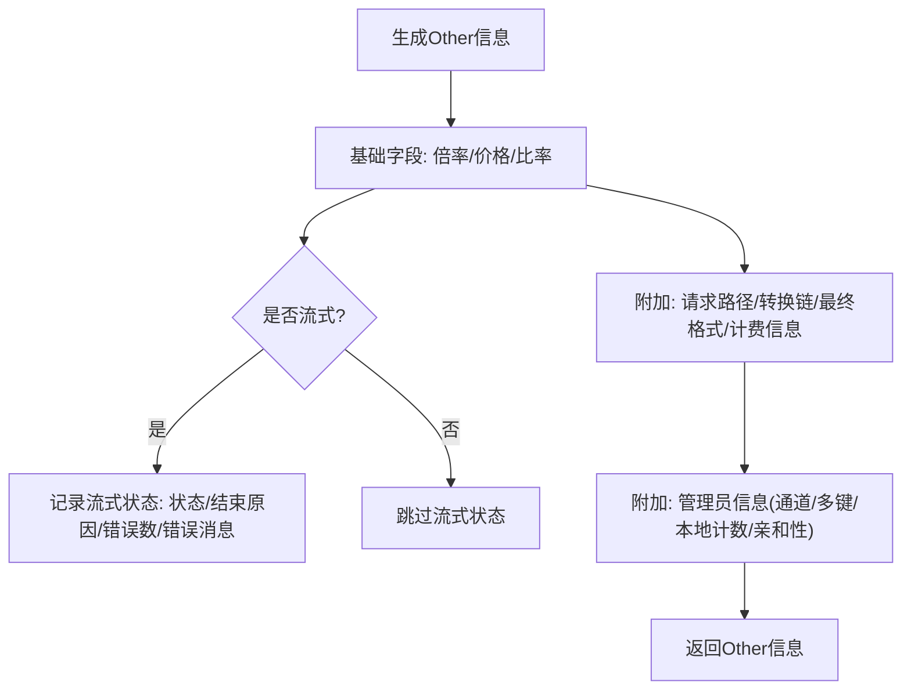
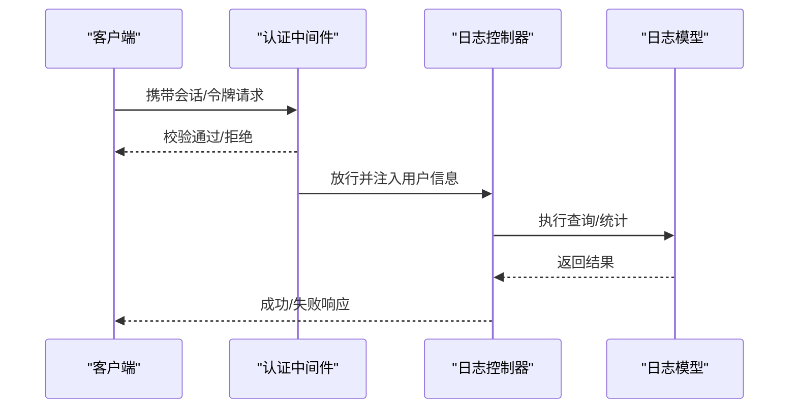
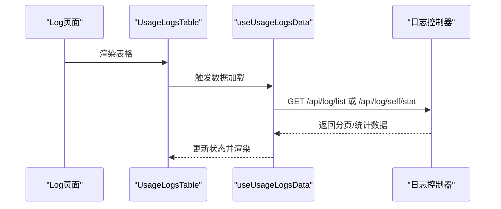
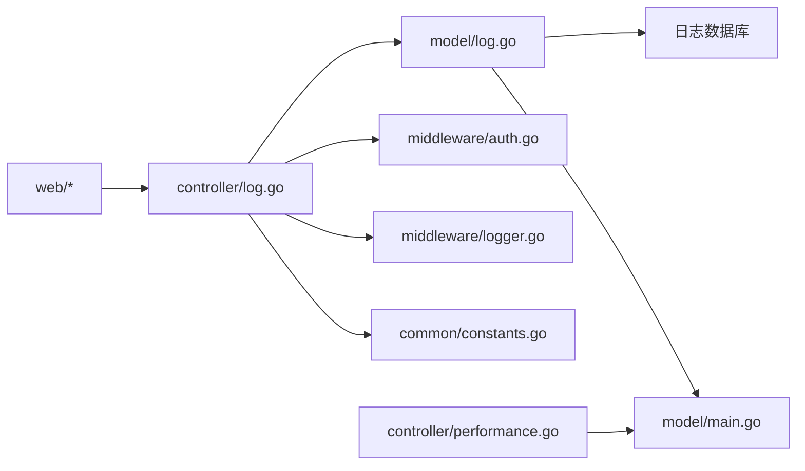

# 日志控制器

<cite>
**本文引用的文件**
- [controller/log.go](file://controller/log.go)
- [model/log.go](file://model/log.go)
- [service/log_info_generate.go](file://service/log_info_generate.go)
- [middleware/auth.go](file://middleware/auth.go)
- [middleware/logger.go](file://middleware/logger.go)
- [common/constants.go](file://common/constants.go)
- [model/main.go](file://model/main.go)
- [controller/performance.go](file://controller/performance.go)
- [web/src/pages/Log/index.jsx](file://web/src/pages/Log/index.jsx)
- [web/src/components/table/usage-logs/UsageLogsTable.jsx](file://web/src/components/table/usage-logs/UsageLogsTable.jsx)
- [web/src/hooks/usage-logs/useUsageLogsData.jsx](file://web/src/hooks/usage-logs/useUsageLogsData.jsx)
- [web/src/components/table/usage-logs/UsageLogsFilters.jsx](file://web/src/components/table/usage-logs/UsageLogsFilters.jsx)
- [.github/SECURITY.md](file://.github/SECURITY.md)
</cite>

## 目录
1. [简介](#简介)
2. [项目结构](#项目结构)
3. [核心组件](#核心组件)
4. [架构总览](#架构总览)
5. [详细组件分析](#详细组件分析)
6. [依赖关系分析](#依赖关系分析)
7. [性能考量](#性能考量)
8. [故障排查指南](#故障排查指南)
9. [结论](#结论)
10. [附录](#附录)

## 简介
本技术文档围绕“日志控制器”展开，系统化阐述系统日志、使用记录与操作日志的管理实现，覆盖日志查询、筛选与分页机制，日志分类与重要性级别，以及统计分析与报表生成思路。同时，文档提供使用日志记录、API 调用统计与用户行为追踪的实现要点，涵盖日志清理、归档与存储优化策略，并强调日志安全机制、隐私保护与访问控制，帮助开发者全面掌握日志控制器的监控与审计能力。

## 项目结构
日志控制器位于后端 Go 代码的 controller 层，数据模型位于 model 层，前端通过 web 组件进行日志表格展示与交互。中间件负责认证与请求日志格式化，常量与配置贯穿于日志开关、导出与性能设置。

**图表来源**
- [controller/log.go:1-172](file://controller/log.go#L1-L172)
- [model/log.go:1-482](file://model/log.go#L1-L482)
- [service/log_info_generate.go:1-265](file://service/log_info_generate.go#L1-L265)
- [middleware/auth.go:36-208](file://middleware/auth.go#L36-L208)
- [middleware/logger.go:1-40](file://middleware/logger.go#L1-L40)
- [common/constants.go:1-219](file://common/constants.go#L1-L219)
- [model/main.go:1-379](file://model/main.go#L1-L379)
- [controller/performance.go:291-353](file://controller/performance.go#L291-L353)
- [web/src/pages/Log/index.jsx:1-30](file://web/src/pages/Log/index.jsx#L1-L30)
- [web/src/components/table/usage-logs/UsageLogsTable.jsx:1-133](file://web/src/components/table/usage-logs/UsageLogsTable.jsx#L1-L133)
- [web/src/hooks/usage-logs/useUsageLogsData.jsx:250-285](file://web/src/hooks/usage-logs/useUsageLogsData.jsx#L250-L285)
- [web/src/components/table/usage-logs/UsageLogsFilters.jsx:155-193](file://web/src/components/table/usage-logs/UsageLogsFilters.jsx#L155-L193)

**章节来源**
- [controller/log.go:1-172](file://controller/log.go#L1-L172)
- [model/log.go:1-482](file://model/log.go#L1-L482)
- [service/log_info_generate.go:1-265](file://service/log_info_generate.go#L1-L265)
- [middleware/auth.go:36-208](file://middleware/auth.go#L36-L208)
- [middleware/logger.go:1-40](file://middleware/logger.go#L1-L40)
- [common/constants.go:1-219](file://common/constants.go#L1-L219)
- [model/main.go:1-379](file://model/main.go#L1-L379)
- [controller/performance.go:291-353](file://controller/performance.go#L291-L353)
- [web/src/pages/Log/index.jsx:1-30](file://web/src/pages/Log/index.jsx#L1-L30)
- [web/src/components/table/usage-logs/UsageLogsTable.jsx:1-133](file://web/src/components/table/usage-logs/UsageLogsTable.jsx#L1-L133)
- [web/src/hooks/usage-logs/useUsageLogsData.jsx:250-285](file://web/src/hooks/usage-logs/useUsageLogsData.jsx#L250-L285)
- [web/src/components/table/usage-logs/UsageLogsFilters.jsx:155-193](file://web/src/components/table/usage-logs/UsageLogsFilters.jsx#L155-L193)

## 核心组件
- 控制器层：提供日志查询、统计、清理等接口，封装分页与过滤参数。
- 模型层：定义日志数据结构、日志类型枚举、查询与统计方法、清理方法。
- 服务层：生成日志附加信息（如计费、流式状态、参数覆盖等），供消费日志记录使用。
- 中间件：认证与请求日志格式化，保障访问控制与可观测性。
- 前端：日志表格、过滤器、统计展示与分页交互。
- 公共配置：日志开关、导出开关、角色权限、请求 ID 等。

**章节来源**
- [controller/log.go:13-172](file://controller/log.go#L13-L172)
- [model/log.go:19-482](file://model/log.go#L19-L482)
- [service/log_info_generate.go:15-265](file://service/log_info_generate.go#L15-L265)
- [middleware/auth.go:36-208](file://middleware/auth.go#L36-L208)
- [middleware/logger.go:19-40](file://middleware/logger.go#L19-L40)
- [common/constants.go:28-76](file://common/constants.go#L28-L76)

## 架构总览
日志控制器遵循典型的 MVC 架构：前端发起查询请求，经认证中间件处理后进入控制器，控制器调用模型层进行数据库查询与统计，模型层通过 GORM 访问日志数据库，必要时生成附加信息并写入日志表。请求日志中间件统一输出请求链路信息，便于审计与排障。

**图表来源**
- [controller/log.go:13-33](file://controller/log.go#L13-L33)
- [model/log.go:246-328](file://model/log.go#L246-L328)
- [middleware/auth.go:36-208](file://middleware/auth.go#L36-L208)

## 详细组件分析

### 日志控制器接口
- 获取全部日志：支持按类型、时间范围、用户名、令牌名、模型名、渠道、分组、请求 ID 进行过滤，返回分页数据。
- 获取用户日志：仅限当前用户可见，支持相同过滤条件。
- 日志统计：按类型与过滤条件统计配额、每分钟请求数（RPM）、每分钟令牌数（TPM）。
- 自身统计：当前用户维度的统计。
- 删除历史日志：按目标时间戳清理过期日志。
- 废弃接口：SearchAllLogs、SearchUserLogs 已废弃。

**图表来源**
- [controller/log.go:13-54](file://controller/log.go#L13-L54)
- [model/log.go:246-375](file://model/log.go#L246-L375)

**章节来源**
- [controller/log.go:13-172](file://controller/log.go#L13-L172)
- [model/log.go:246-375](file://model/log.go#L246-L375)

### 日志模型与数据结构
- 日志结构体包含用户标识、时间戳、类型、内容、令牌与模型信息、配额与令牌用量、渠道、IP、请求 ID、其他扩展信息等。
- 日志类型枚举：未知、充值、消费、管理、系统、错误、退款等。
- 查询与统计：
  - 全部日志：支持多维过滤与渠道名称映射。
  - 用户日志：限制用户维度并带搜索上限。
  - 统计：按类型与过滤条件聚合配额、RPM、TPM，RPM/TPM 限定最近 60 秒窗口。
- 清理：按时间戳分批删除，支持上下文取消。

**图表来源**
- [model/log.go:19-51](file://model/log.go#L19-L51)
- [model/log.go:377-381](file://model/log.go#L377-L381)

**章节来源**
- [model/log.go:19-482](file://model/log.go#L19-L482)

### 日志信息生成与附加字段
- 文本类日志：记录模型倍率、分组倍率、完成度倍率、缓存令牌与比率、模型价格、用户分组倍率、首响应时间、推理努力、模型映射、系统提示覆写、通道选择、多键模式、本地计数令牌、通道亲和性、请求路径、转换链、最终格式、计费来源与偏好、订阅相关信息、流式状态等。
- 实时语音/音频类日志：在文本基础上增加音频输入/输出令牌与倍率。
- Claude 类日志：额外记录缓存创建相关指标。
- Midjourney 类日志：记录模型价格与分组倍率及特殊倍率。

**图表来源**
- [service/log_info_generate.go:34-81](file://service/log_info_generate.go#L34-L81)
- [service/log_info_generate.go:90-115](file://service/log_info_generate.go#L90-L115)
- [service/log_info_generate.go:117-169](file://service/log_info_generate.go#L117-L169)
- [service/log_info_generate.go:171-208](file://service/log_info_generate.go#L171-L208)
- [service/log_info_generate.go:210-232](file://service/log_info_generate.go#L210-L232)
- [service/log_info_generate.go:234-253](file://service/log_info_generate.go#L234-L253)
- [service/log_info_generate.go:255-265](file://service/log_info_generate.go#L255-L265)

**章节来源**
- [service/log_info_generate.go:15-265](file://service/log_info_generate.go#L15-L265)

### 认证与访问控制
- 支持会话与访问令牌两种认证方式，管理员与根用户具备更高权限。
- 提供“用户或令牌”混合认证，优先会话，否则走令牌校验。
- 日志中间件统一输出请求标签与请求 ID，便于审计。

**图表来源**
- [middleware/auth.go:36-208](file://middleware/auth.go#L36-L208)
- [middleware/logger.go:19-40](file://middleware/logger.go#L19-L40)

**章节来源**
- [middleware/auth.go:36-208](file://middleware/auth.go#L36-L208)
- [middleware/logger.go:19-40](file://middleware/logger.go#L19-L40)

### 前端交互与分页
- 页面入口加载使用日志表格组件。
- 表格组件支持列可见性切换、紧凑模式、分页与空态展示。
- 钩子负责组装查询参数（含时间戳、类型、用户、令牌、模型、渠道、分组、请求 ID），并调用统计接口。
- 过滤器提供查询与重置按钮，支持列设置弹窗。

**图表来源**
- [web/src/pages/Log/index.jsx:20-30](file://web/src/pages/Log/index.jsx#L20-L30)
- [web/src/components/table/usage-logs/UsageLogsTable.jsx:29-133](file://web/src/components/table/usage-logs/UsageLogsTable.jsx#L29-L133)
- [web/src/hooks/usage-logs/useUsageLogsData.jsx:250-285](file://web/src/hooks/usage-logs/useUsageLogsData.jsx#L250-L285)
- [web/src/components/table/usage-logs/UsageLogsFilters.jsx:155-193](file://web/src/components/table/usage-logs/UsageLogsFilters.jsx#L155-L193)

**章节来源**
- [web/src/pages/Log/index.jsx:1-30](file://web/src/pages/Log/index.jsx#L1-L30)
- [web/src/components/table/usage-logs/UsageLogsTable.jsx:1-133](file://web/src/components/table/usage-logs/UsageLogsTable.jsx#L1-L133)
- [web/src/hooks/usage-logs/useUsageLogsData.jsx:250-285](file://web/src/hooks/usage-logs/useUsageLogsData.jsx#L250-L285)
- [web/src/components/table/usage-logs/UsageLogsFilters.jsx:155-193](file://web/src/components/table/usage-logs/UsageLogsFilters.jsx#L155-L193)

## 依赖关系分析
- 控制器依赖模型层进行查询与统计，依赖公共分页工具与 API 响应封装。
- 模型层依赖 GORM 进行数据库操作，依赖日志数据库连接与迁移。
- 服务层为消费日志记录提供丰富的 Other 字段，增强审计粒度。
- 中间件提供认证与请求日志格式化，保障访问控制与可观测性。
- 前端通过钩子与表格组件与控制器交互，实现查询、统计与展示。

**图表来源**
- [controller/log.go:1-172](file://controller/log.go#L1-L172)
- [model/log.go:1-482](file://model/log.go#L1-L482)
- [middleware/auth.go:36-208](file://middleware/auth.go#L36-L208)
- [middleware/logger.go:19-40](file://middleware/logger.go#L19-L40)
- [model/main.go:213-248](file://model/main.go#L213-L248)
- [common/constants.go:28-76](file://common/constants.go#L28-L76)
- [controller/performance.go:291-353](file://controller/performance.go#L291-L353)

**章节来源**
- [controller/log.go:1-172](file://controller/log.go#L1-L172)
- [model/log.go:1-482](file://model/log.go#L1-L482)
- [middleware/auth.go:36-208](file://middleware/auth.go#L36-L208)
- [middleware/logger.go:19-40](file://middleware/logger.go#L19-L40)
- [model/main.go:213-248](file://model/main.go#L213-L248)
- [common/constants.go:28-76](file://common/constants.go#L28-L76)
- [controller/performance.go:291-353](file://controller/performance.go#L291-L353)

## 性能考量
- 分页与索引：日志表对关键字段建立复合索引，查询时按类型、时间、用户、渠道等过滤，避免全表扫描。
- 统计窗口：RPM/TPM 统计限定最近 60 秒，降低计算开销。
- 搜索上限：用户日志查询设置搜索上限，防止超大结果集影响性能。
- 导出异步：消费日志记录时，若开启数据导出，统计写入采用协程异步执行，避免阻塞主流程。
- 数据库连接池：日志数据库连接池参数可配置，提升并发能力。
- 前端分页：前端使用分页控件，减少一次性传输大量数据。

**章节来源**
- [model/log.go:246-328](file://model/log.go#L246-L328)
- [model/log.go:383-437](file://model/log.go#L383-L437)
- [model/log.go:362-375](file://model/log.go#L362-L375)
- [model/log.go:196-201](file://model/log.go#L196-L201)
- [model/main.go:234-236](file://model/main.go#L234-L236)
- [web/src/components/table/usage-logs/UsageLogsTable.jsx:116-128](file://web/src/components/table/usage-logs/UsageLogsTable.jsx#L116-L128)

## 故障排查指南
- 接口返回失败：检查控制器中错误处理与 API 错误封装，确认参数合法性与权限。
- 查询无结果：确认过滤条件（时间范围、类型、模型名等）是否过于严格；查看搜索上限与分页参数。
- 统计异常：确认统计接口传参与时间窗口设置；检查日志类型是否正确。
- 日志清理失败：确认清理模式与阈值设置；检查文件是否被占用或权限不足。
- 安全与隐私：注意日志中可能包含敏感信息（如 IP），可通过用户设置控制是否记录 IP；前端展示时移除管理员专用调试字段。

**章节来源**
- [controller/log.go:25-28](file://controller/log.go#L25-L28)
- [model/log.go:362-371](file://model/log.go#L362-L371)
- [controller/performance.go:320-337](file://controller/performance.go#L320-L337)
- [model/log.go:53-67](file://model/log.go#L53-L67)

## 结论
日志控制器通过清晰的分层设计与完善的过滤、统计、清理机制，实现了对系统日志、使用记录与操作日志的高效管理。结合前端表格与统计展示，开发者可以快速定位问题、评估资源消耗并制定优化策略。配合认证中间件与日志中间件，系统具备良好的审计与可观测性。建议在生产环境中合理配置日志开关、清理策略与导出频率，以平衡性能与合规要求。

## 附录
- 日志类型枚举与含义：未知、充值、消费、管理、系统、错误、退款。
- 关键配置项：日志消费开关、数据导出开关、请求 ID 键、角色权限常量。
- 安全最佳实践：HTTPS、最小权限、定期轮换密钥、监控异常使用、数据库隔离与备份。

**章节来源**
- [model/log.go:42-51](file://model/log.go#L42-L51)
- [common/constants.go:137-146](file://common/constants.go#L137-L146)
- [common/constants.go:148-150](file://common/constants.go#L148-L150)
- [.github/SECURITY.md:41-72](file://.github/SECURITY.md#L41-L72)