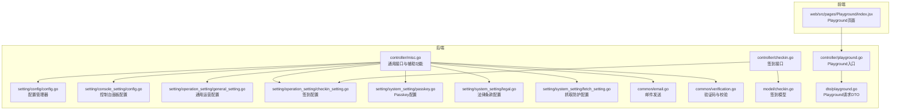
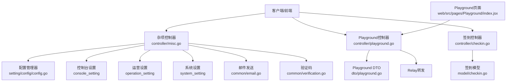
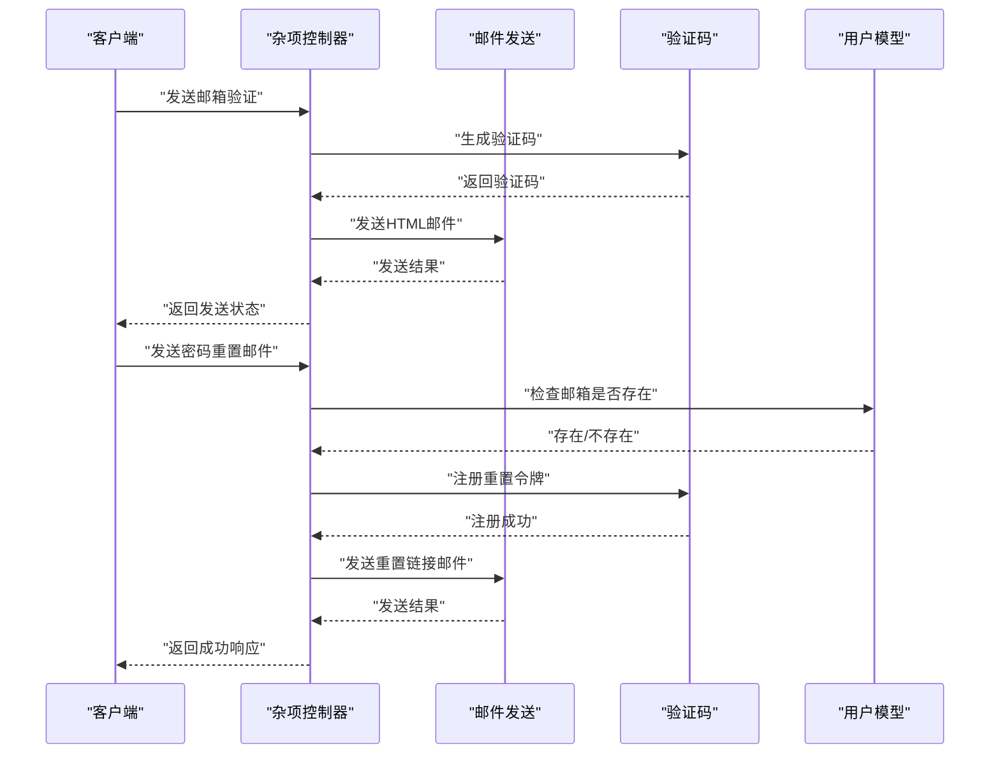
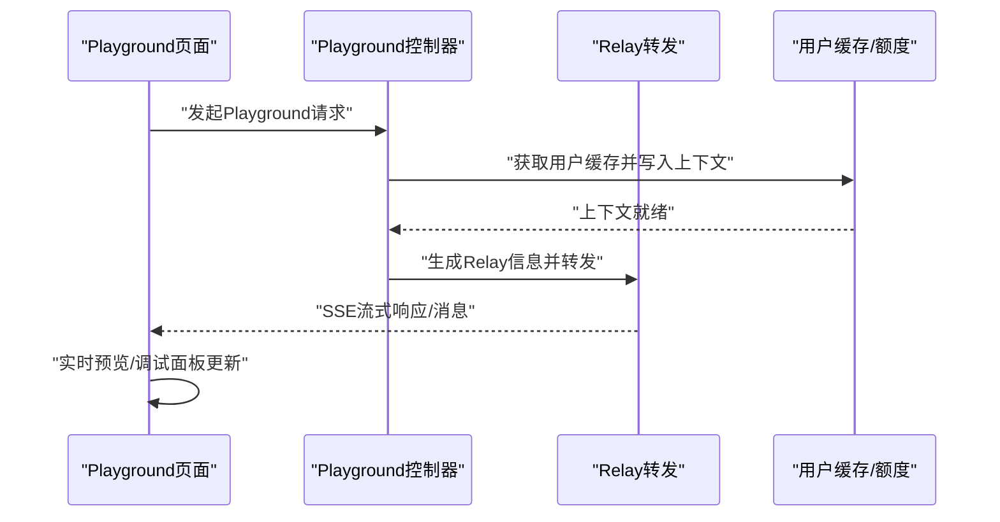
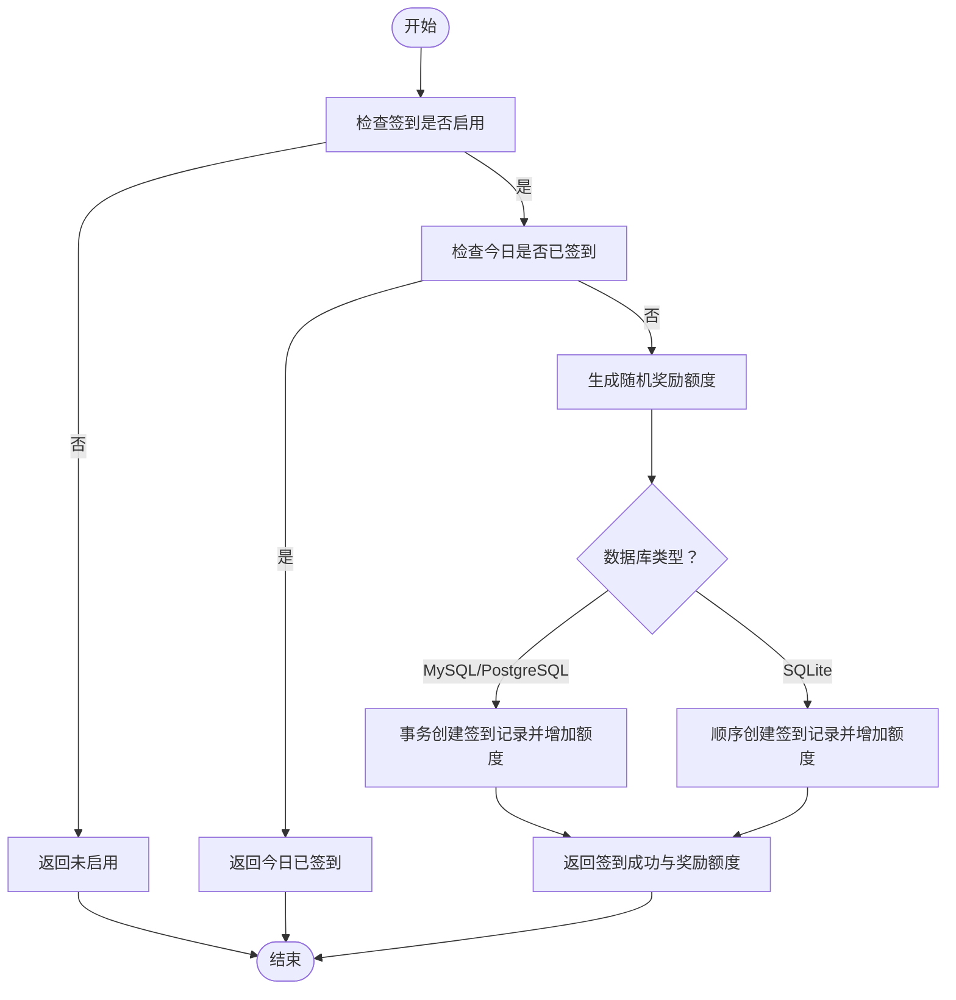
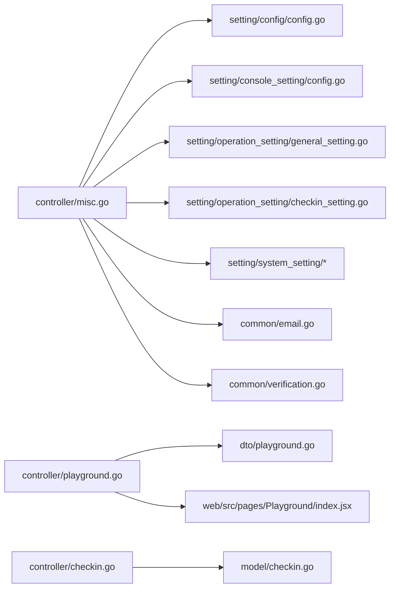

# 杂项控制器

<cite>
**本文引用的文件**
- [controller/misc.go](file://controller/misc.go)
- [controller/playground.go](file://controller/playground.go)
- [controller/checkin.go](file://controller/checkin.go)
- [setting/config/config.go](file://setting/config/config.go)
- [setting/console_setting/config.go](file://setting/console_setting/config.go)
- [setting/operation_setting/general_setting.go](file://setting/operation_setting/general_setting.go)
- [setting/operation_setting/checkin_setting.go](file://setting/operation_setting/checkin_setting.go)
- [setting/system_setting/passkey.go](file://setting/system_setting/passkey.go)
- [setting/system_setting/legal.go](file://setting/system_setting/legal.go)
- [setting/system_setting/fetch_setting.go](file://setting/system_setting/fetch_setting.go)
- [common/email.go](file://common/email.go)
- [common/verification.go](file://common/verification.go)
- [model/checkin.go](file://model/checkin.go)
- [dto/playground.go](file://dto/playground.go)
- [web/src/pages/Playground/index.jsx](file://web/src/pages/Playground/index.jsx)
</cite>

## 目录
1. [简介](#简介)
2. [项目结构](#项目结构)
3. [核心组件](#核心组件)
4. [架构总览](#架构总览)
5. [详细组件分析](#详细组件分析)
6. [依赖分析](#依赖分析)
7. [性能考虑](#性能考虑)
8. [故障排查指南](#故障排查指南)
9. [结论](#结论)
10. [附录](#附录)

## 简介
本技术文档聚焦于“杂项控制器”，系统性梳理其在系统配置、游乐场（Playground）调试工具、签到系统与其他辅助功能方面的实现与交互。重点包括：
- 系统选项管理、配置更新与动态配置机制
- Playground 调试工具、参数测试与实时预览能力
- 签到奖励、活动管理与用户激励机制
- 系统初始化、设置向导与环境检测
- 邮件发送、通知推送与系统公告管理
- 验证码生成、安全验证与防护机制

## 项目结构
杂项控制器位于后端 Go 服务的 controller 层，围绕 misc.go 提供通用接口；Playground 与签到分别由独立控制器与模型支撑；配置体系通过统一的配置管理器集中管理；前端 Playground 页面提供可视化调试与参数测试。



**图表来源**
- [controller/misc.go:1-367](file://controller/misc.go#L1-L367)
- [controller/playground.go:1-57](file://controller/playground.go#L1-L57)
- [controller/checkin.go:1-73](file://controller/checkin.go#L1-L73)
- [setting/config/config.go:1-298](file://setting/config/config.go#L1-L298)
- [setting/console_setting/config.go:1-40](file://setting/console_setting/config.go#L1-L40)
- [setting/operation_setting/general_setting.go:1-92](file://setting/operation_setting/general_setting.go#L1-L92)
- [setting/operation_setting/checkin_setting.go:1-38](file://setting/operation_setting/checkin_setting.go#L1-L38)
- [setting/system_setting/passkey.go:1-51](file://setting/system_setting/passkey.go#L1-L51)
- [setting/system_setting/legal.go:1-22](file://setting/system_setting/legal.go#L1-L22)
- [setting/system_setting/fetch_setting.go:1-35](file://setting/system_setting/fetch_setting.go#L1-L35)
- [common/email.go:1-105](file://common/email.go#L1-L105)
- [common/verification.go:1-79](file://common/verification.go#L1-L79)
- [model/checkin.go:1-180](file://model/checkin.go#L1-L180)
- [dto/playground.go:1-7](file://dto/playground.go#L1-L7)
- [web/src/pages/Playground/index.jsx:1-566](file://web/src/pages/Playground/index.jsx#L1-L566)

**章节来源**
- [controller/misc.go:1-367](file://controller/misc.go#L1-L367)
- [controller/playground.go:1-57](file://controller/playground.go#L1-L57)
- [controller/checkin.go:1-73](file://controller/checkin.go#L1-L73)
- [setting/config/config.go:1-298](file://setting/config/config.go#L1-L298)
- [setting/console_setting/config.go:1-40](file://setting/console_setting/config.go#L1-L40)
- [setting/operation_setting/general_setting.go:1-92](file://setting/operation_setting/general_setting.go#L1-L92)
- [setting/operation_setting/checkin_setting.go:1-38](file://setting/operation_setting/checkin_setting.go#L1-L38)
- [setting/system_setting/passkey.go:1-51](file://setting/system_setting/passkey.go#L1-L51)
- [setting/system_setting/legal.go:1-22](file://setting/system_setting/legal.go#L1-L22)
- [setting/system_setting/fetch_setting.go:1-35](file://setting/system_setting/fetch_setting.go#L1-L35)
- [common/email.go:1-105](file://common/email.go#L1-L105)
- [common/verification.go:1-79](file://common/verification.go#L1-L79)
- [model/checkin.go:1-180](file://model/checkin.go#L1-L180)
- [dto/playground.go:1-7](file://dto/playground.go#L1-L7)
- [web/src/pages/Playground/index.jsx:1-566](file://web/src/pages/Playground/index.jsx#L1-L566)

## 核心组件
- 系统状态与运行信息：提供健康检查、HTTP 统计、版本与启动时间等信息。
- 配置聚合与动态开关：整合控制台面板、额度展示类型、OAuth、Passkey、法律条款、签到开关等。
- 邮件与验证码：邮箱验证、密码重置邮件发送与验证码校验。
- Playground 调试：基于 Relay 的 OpenAI 兼容格式，支持参数测试与实时预览。
- 签到系统：按日签到、随机额度奖励、统计与记录查询。
- 安全与防护：Turnstile、Passkey、Fetch 抓取防护、邮箱白名单/别名限制。

**章节来源**
- [controller/misc.go:23-167](file://controller/misc.go#L23-L167)
- [controller/playground.go:15-57](file://controller/playground.go#L15-L57)
- [controller/checkin.go:15-73](file://controller/checkin.go#L15-L73)
- [setting/config/config.go:27-90](file://setting/config/config.go#L27-L90)
- [setting/operation_setting/checkin_setting.go:5-38](file://setting/operation_setting/checkin_setting.go#L5-L38)
- [common/email.go:36-104](file://common/email.go#L36-L104)
- [common/verification.go:26-79](file://common/verification.go#L26-L79)

## 架构总览
杂项控制器通过统一配置管理器集中读取与导出配置，结合系统设置模块与业务设置模块，向客户端提供动态开关与运行时参数。Playground 与签到分别通过各自的控制器与模型完成请求转发与数据持久化。



**图表来源**
- [controller/misc.go:1-367](file://controller/misc.go#L1-L367)
- [controller/playground.go:1-57](file://controller/playground.go#L1-L57)
- [controller/checkin.go:1-73](file://controller/checkin.go#L1-L73)
- [setting/config/config.go:1-298](file://setting/config/config.go#L1-L298)
- [setting/console_setting/config.go:1-40](file://setting/console_setting/config.go#L1-L40)
- [setting/operation_setting/general_setting.go:1-92](file://setting/operation_setting/general_setting.go#L1-L92)
- [setting/operation_setting/checkin_setting.go:1-38](file://setting/operation_setting/checkin_setting.go#L1-L38)
- [setting/system_setting/passkey.go:1-51](file://setting/system_setting/passkey.go#L1-L51)
- [setting/system_setting/legal.go:1-22](file://setting/system_setting/legal.go#L1-L22)
- [setting/system_setting/fetch_setting.go:1-35](file://setting/system_setting/fetch_setting.go#L1-L35)
- [common/email.go:1-105](file://common/email.go#L1-L105)
- [common/verification.go:1-79](file://common/verification.go#L1-L79)
- [model/checkin.go:1-180](file://model/checkin.go#L1-L180)
- [dto/playground.go:1-7](file://dto/playground.go#L1-L7)
- [web/src/pages/Playground/index.jsx:1-566](file://web/src/pages/Playground/index.jsx#L1-L566)

## 详细组件分析

### 系统配置与动态开关
- 配置注册与导出：配置管理器负责注册各模块配置并提供从数据库加载与保存到数据库的能力，键命名采用“模块名.配置项”格式，便于前端设置面板统一管理。
- 动态面板开关：控制台设置包含 API 信息、Uptime Kuma、公告、FAQ 面板的启用状态，杂项控制器在聚合系统状态时按开关注入对应数据。
- 运营配置：通用运营设置包含文档链接、额度展示类型（USD/CNY/TOKENS/CUSTOM）、自定义货币符号与汇率等，影响前端显示与计算。
- 系统设置：Passkey 登录、OIDC、Turnstile、服务器地址等，影响前端登录与安全体验。
- 法律条款：用户协议与隐私政策的存在与否决定前端是否展示相应入口。
- 签到配置：签到开关、最小/最大奖励额度，决定签到功能可用性与奖励范围。

```mermaid
classDiagram
class ConfigManager {
+Register(name, config)
+Get(name) interface{}
+LoadFromDB(options)
+SaveToDB(updateFunc)
+ExportAllConfigs() map[string]string
}
class ConsoleSetting {
+api_info_enabled bool
+announcements_enabled bool
+faq_enabled bool
}
class GeneralSetting {
+quota_display_type string
+custom_currency_symbol string
+custom_currency_exchange_rate float64
}
class CheckinSetting {
+enabled bool
+min_quota int
+max_quota int
}
class PasskeySettings {
+enabled bool
+rp_id string
+origins string
}
class LegalSettings {
+user_agreement string
+privacy_policy string
}
ConfigManager --> ConsoleSetting : "注册/导出"
ConfigManager --> GeneralSetting : "注册/导出"
ConfigManager --> CheckinSetting : "注册/导出"
ConfigManager --> PasskeySettings : "注册/导出"
ConfigManager --> LegalSettings : "注册/导出"
```

**图表来源**
- [setting/config/config.go:13-90](file://setting/config/config.go#L13-L90)
- [setting/console_setting/config.go:5-14](file://setting/console_setting/config.go#L5-L14)
- [setting/operation_setting/general_setting.go:13-23](file://setting/operation_setting/general_setting.go#L13-L23)
- [setting/operation_setting/checkin_setting.go:6-10](file://setting/operation_setting/checkin_setting.go#L6-L10)
- [setting/system_setting/passkey.go:11-19](file://setting/system_setting/passkey.go#L11-L19)
- [setting/system_setting/legal.go:5-8](file://setting/system_setting/legal.go#L5-L8)

**章节来源**
- [setting/config/config.go:27-90](file://setting/config/config.go#L27-L90)
- [setting/console_setting/config.go:31-39](file://setting/console_setting/config.go#L31-L39)
- [setting/operation_setting/general_setting.go:40-92](file://setting/operation_setting/general_setting.go#L40-L92)
- [setting/operation_setting/checkin_setting.go:19-38](file://setting/operation_setting/checkin_setting.go#L19-L38)
- [setting/system_setting/passkey.go:31-51](file://setting/system_setting/passkey.go#L31-L51)
- [setting/system_setting/legal.go:15-22](file://setting/system_setting/legal.go#L15-L22)

### 邮件发送与验证码机制
- 邮件发送：封装 SMTP 认证、TLS 连接、多收件人、HTML 内容与 Message-ID，兼容 Outlook 与 LoginAuth 场景。
- 验证码：生成 UUID 并截断长度，支持邮箱验证与密码重置两种用途，带有效期与内存级存储上限清理。
- 杂项控制器：提供邮箱验证与密码重置邮件发送接口，前置参数校验、域名白名单与别名限制、邮箱占用检测。



**图表来源**
- [controller/misc.go:231-329](file://controller/misc.go#L231-L329)
- [common/email.go:36-104](file://common/email.go#L36-L104)
- [common/verification.go:26-79](file://common/verification.go#L26-L79)
- [model/checkin.go:1-180](file://model/checkin.go#L1-L180)

**章节来源**
- [controller/misc.go:231-329](file://controller/misc.go#L231-L329)
- [common/email.go:36-104](file://common/email.go#L36-L104)
- [common/verification.go:26-79](file://common/verification.go#L26-L79)

### Playground 调试工具与实时预览
- 控制器入口：Playground 控制器基于 Relay 信息生成与上下文写入，临时令牌与用户分组上下文确保请求转发正确。
- 前端页面：提供聊天界面、参数面板、调试面板、自定义请求体模式、图片输入、消息编辑与复制、SSE 实时流式输出与停止。
- 实时预览：根据消息与参数构建预览请求体，支持 JSON 解析错误提示与自动保存配置。



**图表来源**
- [controller/playground.go:15-57](file://controller/playground.go#L15-L57)
- [dto/playground.go:3-6](file://dto/playground.go#L3-L6)
- [web/src/pages/Playground/index.jsx:188-306](file://web/src/pages/Playground/index.jsx#L188-L306)

**章节来源**
- [controller/playground.go:15-57](file://controller/playground.go#L15-L57)
- [dto/playground.go:3-6](file://dto/playground.go#L3-L6)
- [web/src/pages/Playground/index.jsx:188-306](file://web/src/pages/Playground/index.jsx#L188-L306)

### 签到系统与用户激励
- 策略：每日签到一次，随机额度奖励在最小与最大之间，事务保证签到记录与用户额度更新原子性（MySQL/PostgreSQL 使用事务，SQLite 使用顺序操作+手动回滚）。
- 接口：获取签到状态与历史统计（当月签到次数、是否今日已签、累计额度与签到次数），执行签到并记录系统日志。
- 配置：签到开关与奖励区间由运营设置模块管理，支持动态调整。



**图表来源**
- [controller/checkin.go:15-73](file://controller/checkin.go#L15-L73)
- [model/checkin.go:52-141](file://model/checkin.go#L52-L141)
- [setting/operation_setting/checkin_setting.go:5-38](file://setting/operation_setting/checkin_setting.go#L5-L38)

**章节来源**
- [controller/checkin.go:15-73](file://controller/checkin.go#L15-L73)
- [model/checkin.go:52-141](file://model/checkin.go#L52-L141)
- [setting/operation_setting/checkin_setting.go:5-38](file://setting/operation_setting/checkin_setting.go#L5-L38)

### 系统初始化、设置向导与环境检测
- 初始化：配置管理器在进程启动时注册各模块默认配置，并可通过 LoadFromDB 从数据库加载覆盖值；ExportAllConfigs 提供统一导出。
- 设置向导：前端设置页面通过拉取系统状态与面板开关，结合运营与系统设置，引导用户完成初始配置。
- 环境检测：健康检查接口返回数据库连通性与 HTTP 统计，辅助运维监控。

**章节来源**
- [setting/config/config.go:27-90](file://setting/config/config.go#L27-L90)
- [controller/misc.go:23-40](file://controller/misc.go#L23-L40)

### 公告、通知与系统信息
- 公告与FAQ：控制台设置提供开关与内容字段，杂项控制器在聚合系统状态时按需注入。
- API 信息：控制台设置包含 API 信息面板内容，前端可展示接口说明与分组信息。

**章节来源**
- [setting/console_setting/config.go:5-14](file://setting/console_setting/config.go#L5-L14)
- [controller/misc.go:123-131](file://controller/misc.go#L123-L131)

### 安全验证与防护机制
- 验证码与有效期：验证码注册与校验带时间窗口，超时自动清理，避免重放攻击。
- 邮箱限制：支持域名白名单与别名限制，减少滥用风险。
- SSRF 保护：抓取设置提供域名/IP 过滤模式、允许端口与私网 IP 策略，降低 SSRF 风险。
- 人机验证：Turnstile 开关与站点密钥，提升注册/登录安全性。
- Passkey：RPID、Origins、用户验证偏好与附件偏好，支持现代无密码登录。

**章节来源**
- [common/verification.go:26-79](file://common/verification.go#L26-L79)
- [controller/misc.go:250-275](file://controller/misc.go#L250-L275)
- [setting/system_setting/fetch_setting.go:5-14](file://setting/system_setting/fetch_setting.go#L5-L14)
- [setting/system_setting/passkey.go:11-19](file://setting/system_setting/passkey.go#L11-L19)

## 依赖分析
- 杂项控制器对配置管理器、系统设置与运营设置模块存在强依赖，用于聚合动态开关与运行参数。
- Playground 控制器依赖 DTO 与 Relay 转发，前端页面通过 Hooks 与上下文驱动交互。
- 签到控制器依赖签到配置与签到模型，确保奖励发放与记录一致性。
- 邮件与验证码模块为杂项控制器提供安全通信能力。



**图表来源**
- [controller/misc.go:1-367](file://controller/misc.go#L1-L367)
- [controller/playground.go:1-57](file://controller/playground.go#L1-L57)
- [controller/checkin.go:1-73](file://controller/checkin.go#L1-L73)
- [setting/config/config.go:1-298](file://setting/config/config.go#L1-L298)
- [setting/console_setting/config.go:1-40](file://setting/console_setting/config.go#L1-L40)
- [setting/operation_setting/general_setting.go:1-92](file://setting/operation_setting/general_setting.go#L1-L92)
- [setting/operation_setting/checkin_setting.go:1-38](file://setting/operation_setting/checkin_setting.go#L1-L38)
- [setting/system_setting/passkey.go:1-51](file://setting/system_setting/passkey.go#L1-L51)
- [setting/system_setting/legal.go:1-22](file://setting/system_setting/legal.go#L1-L22)
- [setting/system_setting/fetch_setting.go:1-35](file://setting/system_setting/fetch_setting.go#L1-L35)
- [common/email.go:1-105](file://common/email.go#L1-L105)
- [common/verification.go:1-79](file://common/verification.go#L1-L79)
- [model/checkin.go:1-180](file://model/checkin.go#L1-L180)
- [dto/playground.go:1-7](file://dto/playground.go#L1-L7)
- [web/src/pages/Playground/index.jsx:1-566](file://web/src/pages/Playground/index.jsx#L1-L566)

**章节来源**
- [controller/misc.go:1-367](file://controller/misc.go#L1-L367)
- [controller/playground.go:1-57](file://controller/playground.go#L1-L57)
- [controller/checkin.go:1-73](file://controller/checkin.go#L1-L73)
- [setting/config/config.go:1-298](file://setting/config/config.go#L1-L298)
- [setting/console_setting/config.go:1-40](file://setting/console_setting/config.go#L1-L40)
- [setting/operation_setting/general_setting.go:1-92](file://setting/operation_setting/general_setting.go#L1-L92)
- [setting/operation_setting/checkin_setting.go:1-38](file://setting/operation_setting/checkin_setting.go#L1-L38)
- [setting/system_setting/passkey.go:1-51](file://setting/system_setting/passkey.go#L1-L51)
- [setting/system_setting/legal.go:1-22](file://setting/system_setting/legal.go#L1-L22)
- [setting/system_setting/fetch_setting.go:1-35](file://setting/system_setting/fetch_setting.go#L1-L35)
- [common/email.go:1-105](file://common/email.go#L1-L105)
- [common/verification.go:1-79](file://common/verification.go#L1-L79)
- [model/checkin.go:1-180](file://model/checkin.go#L1-L180)
- [dto/playground.go:1-7](file://dto/playground.go#L1-L7)
- [web/src/pages/Playground/index.jsx:1-566](file://web/src/pages/Playground/index.jsx#L1-L566)

## 性能考虑
- 配置读取：配置管理器采用读写锁保护，导出与加载均进行结构化序列化，建议在高频调用场景下缓存关键配置键值。
- 邮件发送：TLS 握手与认证可能成为瓶颈，建议复用连接或使用连接池（若 SMTP 支持），并合理设置超时。
- 签到事务：MySQL/PostgreSQL 使用事务保证原子性，SQLite 采用顺序操作+回滚，注意并发冲突下的重试与回滚成本。
- Playground：SSE 流式输出与前端渲染应避免频繁重绘，建议使用虚拟滚动与消息节流。

## 故障排查指南
- 邮件发送失败：检查 SMTP 配置、端口与 TLS 设置、认证方式与服务器可达性；确认邮件内容编码与收件人格式。
- 验证码失效：确认验证码有效期与注册时间，检查内存上限清理逻辑；核对用途前缀与邮箱键拼接。
- 签到异常：检查签到开关与额度范围配置；查看数据库唯一索引冲突与事务回滚日志；SQLite 下注意顺序操作失败的回滚。
- Playground 无法访问：确认 Relay 信息生成与用户分组上下文写入；检查前端预览构建与 SSE 连接状态。
- 安全相关：Turnstile 验证失败、Passkey 参数不匹配、SSRF 防护导致请求被阻断时，核查对应配置与网络策略。

**章节来源**
- [common/email.go:36-104](file://common/email.go#L36-L104)
- [common/verification.go:47-79](file://common/verification.go#L47-L79)
- [model/checkin.go:94-141](file://model/checkin.go#L94-L141)
- [controller/playground.go:15-57](file://controller/playground.go#L15-L57)

## 结论
杂项控制器通过统一配置管理与系统设置模块，为前端提供了灵活的动态开关与运行参数；Playground 与签到系统分别覆盖了开发调试与用户激励场景；邮件与验证码机制配合安全策略（Turnstile、Passkey、Fetch 防护）保障了系统的可用性与安全性。建议在生产环境中结合监控与日志，持续优化配置加载与邮件发送性能，并完善签到与 Relay 的并发处理策略。

## 附录
- 关键配置键命名规范：模块名.配置项（如 console_setting.api_info_enabled）
- 前端 Playground 常用交互：参数切换、自定义请求体模式、图片粘贴、消息编辑与复制、SSE 停止与预览刷新
- 签到奖励范围：最小/最大额度由运营设置控制，随机生成并在事务中原子落库