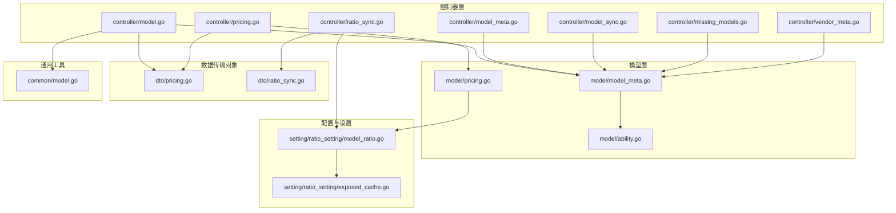
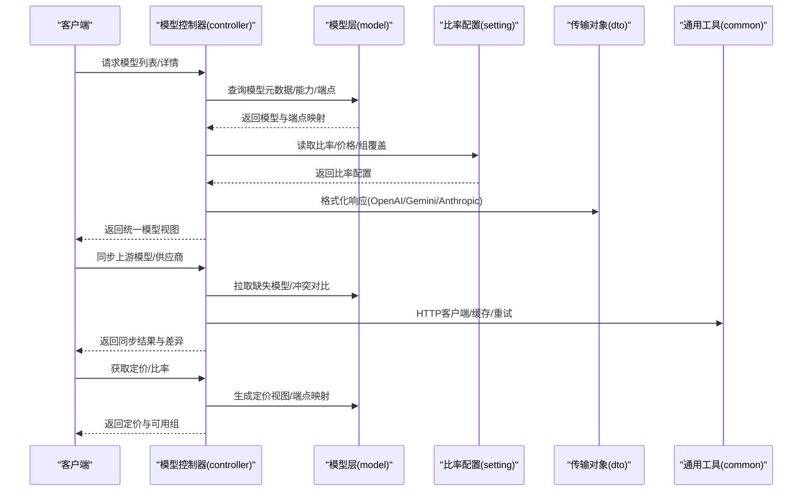
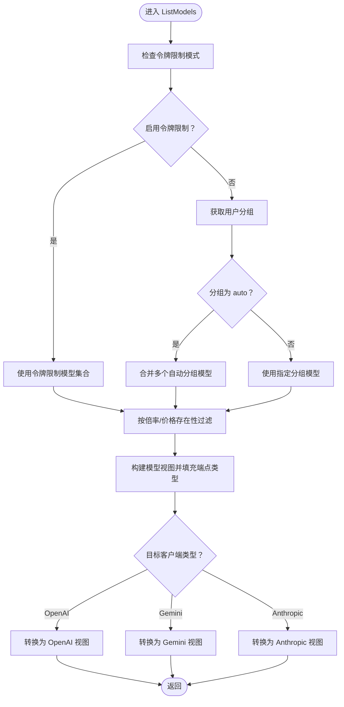
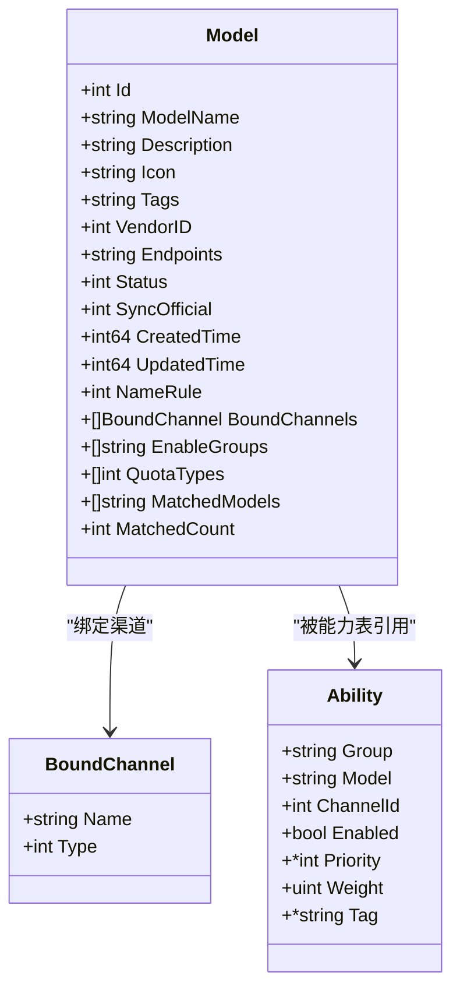
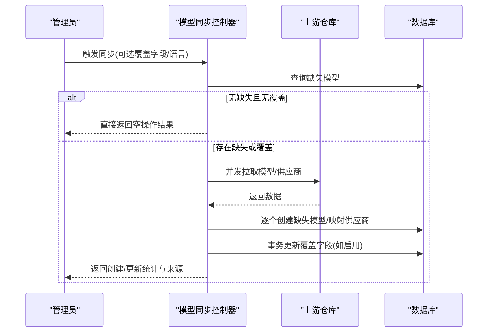
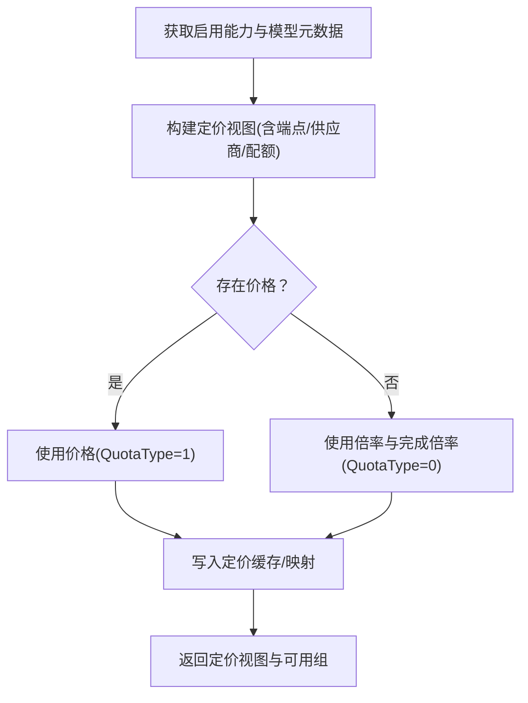
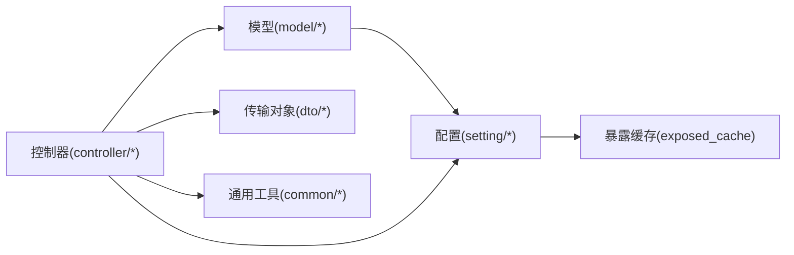

# 模型控制器

<cite>
**本文引用的文件**
- [controller/model.go](file://controller/model.go)
- [controller/model_meta.go](file://controller/model_meta.go)
- [controller/model_sync.go](file://controller/model_sync.go)
- [controller/missing_models.go](file://controller/missing_models.go)
- [controller/pricing.go](file://controller/pricing.go)
- [controller/ratio_sync.go](file://controller/ratio_sync.go)
- [controller/vendor_meta.go](file://controller/vendor_meta.go)
- [model/model_meta.go](file://model/model_meta.go)
- [model/ability.go](file://model/ability.go)
- [model/pricing.go](file://model/pricing.go)
- [dto/pricing.go](file://dto/pricing.go)
- [dto/ratio_sync.go](file://dto/ratio_sync.go)
- [setting/ratio_setting/model_ratio.go](file://setting/ratio_setting/model_ratio.go)
- [setting/ratio_setting/exposed_cache.go](file://setting/ratio_setting/exposed_cache.go)
- [common/model.go](file://common/model.go)
</cite>

## 目录
1. [简介](#简介)
2. [项目结构](#项目结构)
3. [核心组件](#核心组件)
4. [架构总览](#架构总览)
5. [详细组件分析](#详细组件分析)
6. [依赖分析](#依赖分析)
7. [性能考虑](#性能考虑)
8. [故障排查指南](#故障排查指南)
9. [结论](#结论)
10. [附录](#附录)

## 简介
本技术文档围绕“模型控制器”展开，系统性阐述 AI 模型的管理、元数据处理与同步机制，覆盖以下关键主题：
- 模型列表获取、模型映射与格式转换
- 模型元数据管理、供应商适配与版本控制
- 模型同步、自动发现与冲突解决
- 缺失模型检测、模型可用性检查与兼容性处理
- 模型定价配置、价格同步与比率管理
- 模型缓存策略、性能优化与错误处理

目标是帮助开发者全面理解模型控制器的数据管理与同步架构，快速定位实现细节并进行扩展与维护。

## 项目结构
模型控制器位于后端服务的 controller 层，配合 model 层的数据模型、setting 层的比率与定价配置、dto 层的传输对象以及 common 层的通用工具，形成完整的模型生命周期管理闭环。

**图表来源**
- [controller/model.go:1-290](file://controller/model.go#L1-L290)
- [controller/model_meta.go:1-331](file://controller/model_meta.go#L1-L331)
- [controller/model_sync.go:1-635](file://controller/model_sync.go#L1-L635)
- [controller/missing_models.go:1-29](file://controller/missing_models.go#L1-L29)
- [controller/pricing.go:1-102](file://controller/pricing.go#L1-L102)
- [controller/ratio_sync.go:1-915](file://controller/ratio_sync.go#L1-L915)
- [controller/vendor_meta.go:1-125](file://controller/vendor_meta.go#L1-L125)
- [model/model_meta.go:1-161](file://model/model_meta.go#L1-L161)
- [model/ability.go:1-342](file://model/ability.go#L1-L342)
- [model/pricing.go:1-347](file://model/pricing.go#L1-L347)
- [dto/pricing.go:1-36](file://dto/pricing.go#L1-L36)
- [dto/ratio_sync.go:1-40](file://dto/ratio_sync.go#L1-L40)
- [setting/ratio_setting/model_ratio.go:1-735](file://setting/ratio_setting/model_ratio.go#L1-L735)
- [setting/ratio_setting/exposed_cache.go:1-57](file://setting/ratio_setting/exposed_cache.go#L1-L57)
- [common/model.go:1-60](file://common/model.go#L1-L60)

**章节来源**
- [controller/model.go:1-290](file://controller/model.go#L1-L290)
- [controller/model_meta.go:1-331](file://controller/model_meta.go#L1-L331)
- [controller/model_sync.go:1-635](file://controller/model_sync.go#L1-L635)
- [controller/missing_models.go:1-29](file://controller/missing_models.go#L1-L29)
- [controller/pricing.go:1-102](file://controller/pricing.go#L1-L102)
- [controller/ratio_sync.go:1-915](file://controller/ratio_sync.go#L1-L915)
- [controller/vendor_meta.go:1-125](file://controller/vendor_meta.go#L1-L125)
- [model/model_meta.go:1-161](file://model/model_meta.go#L1-L161)
- [model/ability.go:1-342](file://model/ability.go#L1-L342)
- [model/pricing.go:1-347](file://model/pricing.go#L1-L347)
- [dto/pricing.go:1-36](file://dto/pricing.go#L1-L36)
- [dto/ratio_sync.go:1-40](file://dto/ratio_sync.go#L1-L40)
- [setting/ratio_setting/model_ratio.go:1-735](file://setting/ratio_setting/model_ratio.go#L1-L735)
- [setting/ratio_setting/exposed_cache.go:1-57](file://setting/ratio_setting/exposed_cache.go#L1-L57)
- [common/model.go:1-60](file://common/model.go#L1-L60)

## 核心组件
- 模型列表与映射
  - 控制器初始化时聚合各通道适配器的模型清单，构建统一的 OpenAI 模型视图，并建立模型到端点类型的映射。
  - 提供用户维度的模型过滤、令牌限制与分组自动组合等逻辑，输出多格式模型响应（OpenAI/Gemini/Anthropic）。
- 模型元数据管理
  - 支持模型元数据的增删改查、名称冲突检测、端点与渠道绑定、分组与配额类型汇总。
  - 批量填充附加字段以降低 N+1 查询开销，提升列表接口性能。
- 模型同步与自动发现
  - 从上游仓库拉取模型与供应商元数据，仅创建缺失模型或按需覆盖已有模型字段。
  - 提供预览差异与冲突检测，辅助管理员决策。
- 定价与比率配置
  - 维护模型倍率、价格、缓存比率、音频/图像比率等配置，支持按组覆盖与动态刷新。
  - 提供比率同步接口，从上游渠道或公开数据源转换为本地比率格式。
- 供应商适配与版本控制
  - 供应商元数据与模型元数据分离，支持图标、描述、状态等属性。
  - 通过版本字段与缓存映射保障前端展示一致性与性能。

**章节来源**
- [controller/model.go:28-110](file://controller/model.go#L28-L110)
- [controller/model.go:112-241](file://controller/model.go#L112-L241)
- [controller/model_meta.go:163-330](file://controller/model_meta.go#L163-L330)
- [controller/model_sync.go:265-469](file://controller/model_sync.go#L265-L469)
- [controller/model_sync.go:498-634](file://controller/model_sync.go#L498-L634)
- [controller/pricing.go:36-77](file://controller/pricing.go#L36-L77)
- [controller/ratio_sync.go:70-405](file://controller/ratio_sync.go#L70-L405)
- [controller/vendor_meta.go:12-125](file://controller/vendor_meta.go#L12-L125)
- [model/model_meta.go:11-44](file://model/model_meta.go#L11-L44)
- [model/pricing.go:63-341](file://model/pricing.go#L63-L341)
- [setting/ratio_setting/model_ratio.go:336-735](file://setting/ratio_setting/model_ratio.go#L336-L735)
- [setting/ratio_setting/exposed_cache.go:11-57](file://setting/ratio_setting/exposed_cache.go#L11-L57)

## 架构总览
模型控制器围绕“控制器-模型-配置-传输对象-通用工具”的分层设计，实现模型生命周期的完整闭环：

**图表来源**
- [controller/model.go:112-241](file://controller/model.go#L112-L241)
- [controller/model_sync.go:265-469](file://controller/model_sync.go#L265-L469)
- [controller/pricing.go:36-77](file://controller/pricing.go#L36-L77)
- [model/pricing.go:63-341](file://model/pricing.go#L63-L341)
- [dto/pricing.go:6-36](file://dto/pricing.go#L6-L36)
- [common/model.go:1-60](file://common/model.go#L1-L60)

## 详细组件分析

### 模型列表与映射
- 初始化聚合
  - 遍历通道适配器，收集模型清单并注入“拥有者”信息，构建统一的 OpenAI 模型视图。
  - 建立模型到端点类型的映射，用于后续列表渲染与可用性判断。
- 用户维度过滤
  - 支持令牌限制模式下的白名单模型过滤。
  - 支持“自动分组”模式下合并多个分组的启用模型。
  - 未配置倍率/价格时可按开关决定是否返回模型。
- 格式转换
  - 针对不同客户端（OpenAI/Gemini/Anthropic）输出对应的数据结构，确保兼容性。

**图表来源**
- [controller/model.go:112-241](file://controller/model.go#L112-L241)

**章节来源**
- [controller/model.go:28-110](file://controller/model.go#L28-L110)
- [controller/model.go:112-241](file://controller/model.go#L112-L241)

### 模型元数据管理
- 数据模型
  - 模型实体包含名称、描述、图标、标签、供应商、端点、状态、同步开关、命名规则等字段。
  - 支持“精确/前缀/包含/后缀”四种命名规则，用于与上游定价规则匹配。
- 列表与搜索
  - 支持分页、关键词与供应商筛选，批量填充端点、渠道、分组、配额类型等附加字段。
  - 通过“精确/规则”两阶段匹配，减少数据库往返，提升性能。
- 增删改查
  - 名称冲突检测、状态只更新模式、插入/更新时间戳管理。
  - 刷新定价缓存，确保下游视图一致性。

**图表来源**
- [model/model_meta.go:23-44](file://model/model_meta.go#L23-L44)
- [model/ability.go:16-29](file://model/ability.go#L16-L29)

**章节来源**
- [model/model_meta.go:11-44](file://model/model_meta.go#L11-L44)
- [model/model_meta.go:106-161](file://model/model_meta.go#L106-L161)
- [controller/model_meta.go:16-78](file://controller/model_meta.go#L16-L78)
- [controller/model_meta.go:108-145](file://controller/model_meta.go#L108-L145)
- [controller/model_meta.go:147-161](file://controller/model_meta.go#L147-L161)

### 模型同步与自动发现
- 上游数据拉取
  - 并发拉取模型与供应商 JSON，支持 ETag 缓存与 304 协议，降低带宽与延迟。
  - 支持国际化域名与环境变量配置，便于多地区部署。
- 同步策略
  - 默认仅创建“未配置模型”，避免覆盖本地定制。
  - 支持按需覆盖字段（描述、图标、标签、供应商、命名规则、状态），事务内安全更新。
- 冲突检测与预览
  - 预览缺失模型与冲突字段（描述、图标、标签、供应商、命名规则、状态），辅助管理员决策。
  - 冲突字段采用“本地 vs 上游”对比，支持信任度标记。

**图表来源**
- [controller/model_sync.go:265-469](file://controller/model_sync.go#L265-L469)
- [controller/model_sync.go:498-634](file://controller/model_sync.go#L498-L634)

**章节来源**
- [controller/model_sync.go:29-80](file://controller/model_sync.go#L29-L80)
- [controller/model_sync.go:126-131](file://controller/model_sync.go#L126-L131)
- [controller/model_sync.go:133-235](file://controller/model_sync.go#L133-L235)
- [controller/model_sync.go:265-469](file://controller/model_sync.go#L265-L469)
- [controller/model_sync.go:498-634](file://controller/model_sync.go#L498-L634)

### 定价与比率配置
- 定价视图生成
  - 基于启用能力与模型元数据，生成前端友好的定价视图，包含模型名称、描述、图标、标签、供应商、配额类型、支持端点、倍率/价格等。
  - 支持自定义端点覆盖默认端点映射。
- 比率配置
  - 维护模型倍率、价格、缓存比率、音频/图像比率等，支持按组覆盖与动态刷新。
  - 提供默认值与硬编码规则，处理特殊模型（如带思考预算的 Gemini/GPT）。
- 比率同步
  - 从上游渠道或公开数据源（OpenRouter、models.dev）转换为本地比率格式。
  - 对比本地与上游差异，支持信任度评估与冲突消解。

**图表来源**
- [model/pricing.go:98-341](file://model/pricing.go#L98-L341)
- [controller/pricing.go:36-77](file://controller/pricing.go#L36-L77)
- [setting/ratio_setting/model_ratio.go:336-735](file://setting/ratio_setting/model_ratio.go#L336-L735)

**章节来源**
- [controller/pricing.go:36-77](file://controller/pricing.go#L36-L77)
- [model/pricing.go:63-341](file://model/pricing.go#L63-L341)
- [setting/ratio_setting/model_ratio.go:336-735](file://setting/ratio_setting/model_ratio.go#L336-L735)
- [controller/ratio_sync.go:70-405](file://controller/ratio_sync.go#L70-L405)

### 供应商适配与版本控制
- 供应商管理
  - 支持供应商的增删改查、名称冲突检测与图标/描述/状态维护。
  - 供应商与模型元数据解耦，便于独立演进。
- 版本控制
  - 定价视图包含版本字段，用于前端缓存与兼容性校验。
  - 端点映射支持默认与自定义覆盖，确保灵活性与稳定性。

**章节来源**
- [controller/vendor_meta.go:12-125](file://controller/vendor_meta.go#L12-L125)
- [model/pricing.go:325-341](file://model/pricing.go#L325-L341)

### 缺失模型检测与可用性检查
- 缺失模型检测
  - 识别被渠道引用但未在模型元数据表中配置的模型，辅助管理员快速补齐。
- 可用性检查
  - 结合用户分组、令牌限制、模型端点支持类型与可用组，动态过滤不可用模型。
- 兼容性处理
  - 通用工具提供模型分类（文本/图像/仅 OpenAI 响应），用于路由与格式兼容。

**章节来源**
- [controller/missing_models.go:11-29](file://controller/missing_models.go#L11-L29)
- [controller/model.go:112-203](file://controller/model.go#L112-L203)
- [common/model.go:1-60](file://common/model.go#L1-60)

## 依赖分析
- 控制器层依赖模型层与配置层，通过 DTO 与通用工具进行数据传递与格式化。
- 模型层依赖数据库与能力表，提供定价视图与端点映射。
- 配置层提供比率/价格/端点映射缓存，支持 TTL 与失效策略。
- 传输对象定义前后端交互的数据结构，确保一致性。

**图表来源**
- [controller/model.go:1-290](file://controller/model.go#L1-L290)
- [controller/model_meta.go:1-331](file://controller/model_meta.go#L1-L331)
- [controller/model_sync.go:1-635](file://controller/model_sync.go#L1-L635)
- [controller/pricing.go:1-102](file://controller/pricing.go#L1-L102)
- [controller/ratio_sync.go:1-915](file://controller/ratio_sync.go#L1-L915)
- [model/pricing.go:1-347](file://model/pricing.go#L1-L347)
- [setting/ratio_setting/exposed_cache.go:1-57](file://setting/ratio_setting/exposed_cache.go#L1-L57)

**章节来源**
- [controller/model.go:1-290](file://controller/model.go#L1-L290)
- [controller/model_meta.go:1-331](file://controller/model_meta.go#L1-L331)
- [controller/model_sync.go:1-635](file://controller/model_sync.go#L1-L635)
- [controller/pricing.go:1-102](file://controller/pricing.go#L1-L102)
- [controller/ratio_sync.go:1-915](file://controller/ratio_sync.go#L1-L915)
- [model/pricing.go:1-347](file://model/pricing.go#L1-L347)
- [setting/ratio_setting/exposed_cache.go:1-57](file://setting/ratio_setting/exposed_cache.go#L1-L57)

## 性能考虑
- 批量填充与缓存
  - 列表接口通过“精确/规则”两阶段匹配与批量查询，减少 N+1 查询。
  - 定价视图与端点映射采用缓存与 TTL，避免重复计算。
- 并发与重试
  - 上游同步采用并发拉取与指数退避重试，提升可靠性与吞吐。
- 连接与超时
  - HTTP 客户端配置连接池、超时与 DNS 回退策略，适配多网络环境。

[本节为通用性能建议，不直接分析具体文件]

## 故障排查指南
- 上游同步失败
  - 检查网络与域名解析（IPv4/IPv6 回退）、TLS 配置与超时设置。
  - 查看重试日志与错误码，确认上游返回格式与内容类型。
- 缓存命中问题
  - 确认 ETag 与本地缓存键是否一致，检查缓存失效策略与并发访问。
- 定价视图异常
  - 核对模型状态（仅启用状态才会返回）、端点映射与自定义覆盖。
  - 检查组覆盖与可用组过滤逻辑。
- 比率同步差异
  - 关注信任度标记与“same”值，确认上游数据格式与转换逻辑。
  - 对比 OpenRouter 与 models.dev 的特殊处理分支。

**章节来源**
- [controller/model_sync.go:126-131](file://controller/model_sync.go#L126-L131)
- [controller/model_sync.go:133-235](file://controller/model_sync.go#L133-L235)
- [controller/ratio_sync.go:70-405](file://controller/ratio_sync.go#L70-L405)
- [model/pricing.go:330-341](file://model/pricing.go#L330-L341)

## 结论
模型控制器通过清晰的分层设计与完善的同步机制，实现了模型元数据、定价与比率的统一管理与高效分发。其核心优势在于：
- 统一的模型视图与端点映射，简化客户端适配
- 灵活的同步策略与冲突检测，保障数据一致性
- 高效的缓存与批量填充，优化列表性能
- 完备的比率与定价配置，支持多场景与多渠道

开发者可基于现有架构快速扩展新供应商、新增模型规则与增强同步策略。

## 附录
- 关键流程参考
  - 模型列表获取与格式化：[controller/model.go:112-241](file://controller/model.go#L112-L241)
  - 元数据批量填充与规则匹配：[controller/model_meta.go:163-330](file://controller/model_meta.go#L163-L330)
  - 上游同步与覆盖更新：[controller/model_sync.go:265-469](file://controller/model_sync.go#L265-L469)
  - 定价视图生成与端点映射：[model/pricing.go:98-341](file://model/pricing.go#L98-L341)
  - 比率同步与差异对比：[controller/ratio_sync.go:70-405](file://controller/ratio_sync.go#L70-L405)
  - 供应商管理与版本控制：[controller/vendor_meta.go:12-125](file://controller/vendor_meta.go#L12-L125)
  - 通用模型分类与兼容性：[common/model.go:1-60](file://common/model.go#L1-L60)