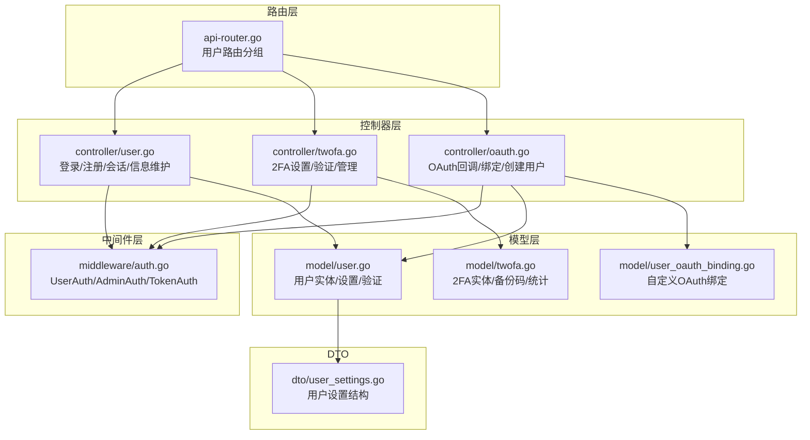
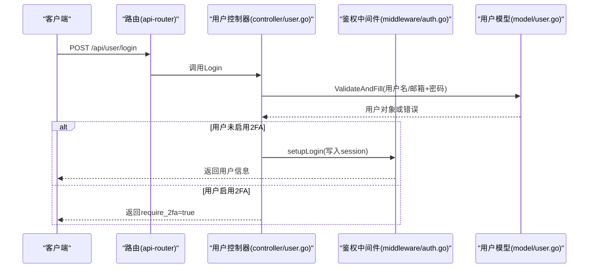
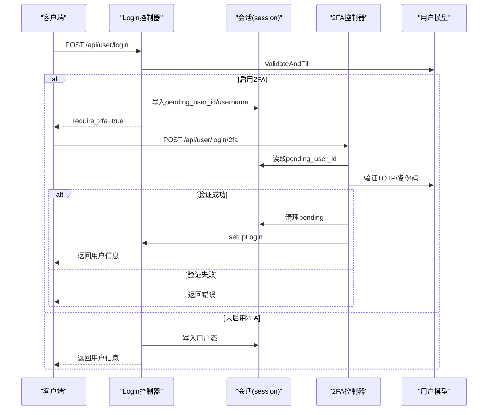
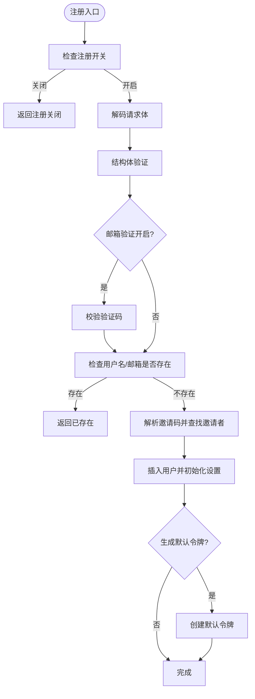
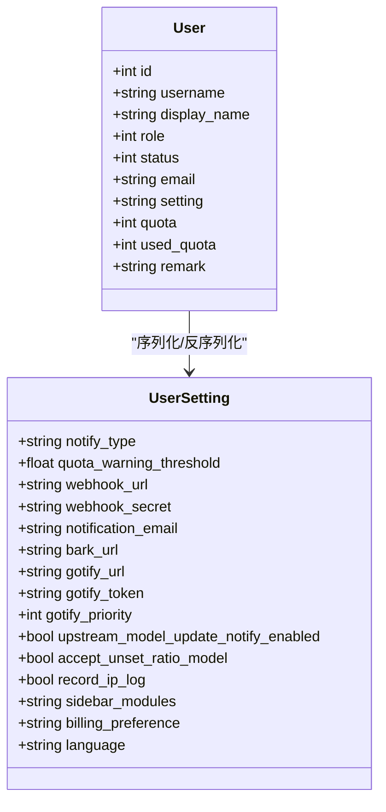
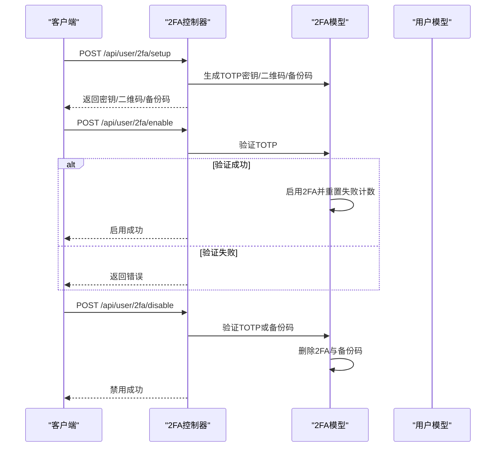
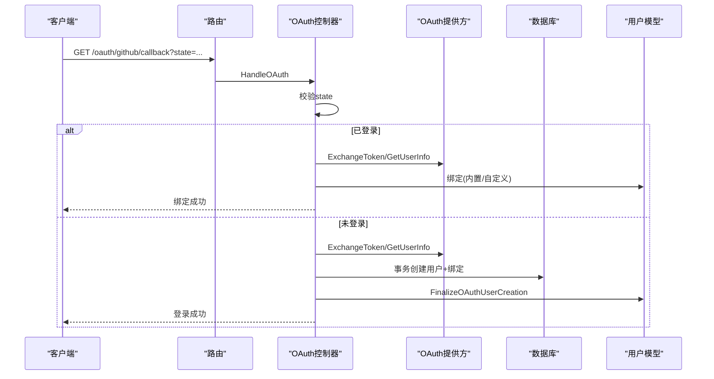
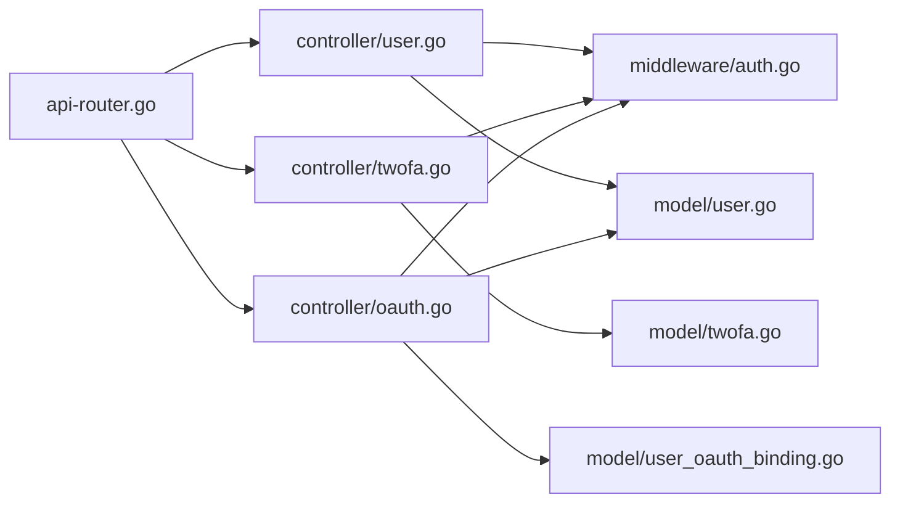

# 用户控制器

<cite>
**本文档引用的文件**
- [controller/user.go](file://controller/user.go)
- [controller/twofa.go](file://controller/twofa.go)
- [controller/oauth.go](file://controller/oauth.go)
- [middleware/auth.go](file://middleware/auth.go)
- [model/user.go](file://model/user.go)
- [model/twofa.go](file://model/twofa.go)
- [model/user_oauth_binding.go](file://model/user_oauth_binding.go)
- [dto/user_settings.go](file://dto/user_settings.go)
- [router/api-router.go](file://router/api-router.go)
- [common/constants.go](file://common/constants.go)
</cite>

## 目录
1. [简介](#简介)
2. [项目结构](#项目结构)
3. [核心组件](#核心组件)
4. [架构总览](#架构总览)
5. [详细组件分析](#详细组件分析)
6. [依赖关系分析](#依赖关系分析)
7. [性能考量](#性能考量)
8. [故障排查指南](#故障排查指南)
9. [结论](#结论)

## 简介
本技术文档围绕用户控制器展开，系统性阐述用户认证、注册、权限管理、个人信息管理、会话与2FA、OAuth绑定、邀请与配额转移等关键能力。文档提供控制器方法的调用序列图、数据流图、类关系图，并结合路由定义与中间件机制，帮助开发者快速理解用户模块的完整功能与安全实现。

## 项目结构
用户相关代码主要分布在以下模块：
- 控制器层：用户登录/注册/会话、用户信息维护、2FA、OAuth绑定、邀请与配额转移
- 中间件层：统一鉴权、用户态注入、只读令牌校验
- 模型层：用户实体、2FA实体、OAuth绑定实体、用户设置DTO
- 路由层：用户相关REST接口分组与权限控制

图表来源
- [router/api-router.go:56-134](file://router/api-router.go#L56-L134)
- [controller/user.go:1-1246](file://controller/user.go#L1-L1246)
- [controller/twofa.go:1-555](file://controller/twofa.go#L1-L555)
- [controller/oauth.go:1-363](file://controller/oauth.go#L1-L363)
- [middleware/auth.go:1-440](file://middleware/auth.go#L1-L440)
- [model/user.go:1-1049](file://model/user.go#L1-L1049)
- [model/twofa.go:1-322](file://model/twofa.go#L1-L322)
- [model/user_oauth_binding.go:1-148](file://model/user_oauth_binding.go#L1-L148)
- [dto/user_settings.go:1-27](file://dto/user_settings.go#L1-L27)

章节来源
- [router/api-router.go:56-134](file://router/api-router.go#L56-L134)

## 核心组件
- 用户控制器：负责登录、注册、会话、个人信息查询与更新、邀请码与配额转移、管理员管理等
- 2FA控制器：负责2FA初始化、启用、禁用、验证码验证、备份码管理、管理员统计与强制禁用
- OAuth控制器：负责OAuth回调、绑定、以及OAuth注册创建用户（含事务保证原子性）
- 鉴权中间件：提供用户态注入、角色校验、只读令牌校验、WebSocket协议适配
- 用户模型：用户实体、设置、验证、绑定清理、配额转移事务
- 2FA模型：TOTP密钥、备份码、失败计数与锁定、统计
- OAuth绑定模型：自定义OAuth绑定关系、唯一性约束、跨表查询

章节来源
- [controller/user.go:1-1246](file://controller/user.go#L1-L1246)
- [controller/twofa.go:1-555](file://controller/twofa.go#L1-L555)
- [controller/oauth.go:1-363](file://controller/oauth.go#L1-L363)
- [middleware/auth.go:1-440](file://middleware/auth.go#L1-L440)
- [model/user.go:1-1049](file://model/user.go#L1-L1049)
- [model/twofa.go:1-322](file://model/twofa.go#L1-L322)
- [model/user_oauth_binding.go:1-148](file://model/user_oauth_binding.go#L1-L148)

## 架构总览
用户模块采用“路由-控制器-中间件-模型”的分层设计，通过会话与令牌两种方式实现身份认证；2FA作为可选的安全增强；OAuth提供第三方登录与绑定能力；管理员中间件保障后台管理接口的权限控制。

图表来源
- [router/api-router.go:58-60](file://router/api-router.go#L58-L60)
- [controller/user.go:32-90](file://controller/user.go#L32-L90)
- [middleware/auth.go:36-157](file://middleware/auth.go#L36-L157)
- [model/user.go:592-615](file://model/user.go#L592-L615)

## 详细组件分析

### 登录流程（含2FA）
- 登录入口：/api/user/login
- 流程要点：
  - 参数校验与解码
  - 用户凭据验证（用户名/邮箱+密码），状态检查
  - 若启用2FA：写入待确认会话，返回require_2fa=true
  - 若未启用2FA：写入session并返回用户信息
- 2FA验证：/api/user/login/2fa
  - 从会话读取pending_user_id
  - 验证TOTP或备份码
  - 成功后清理pending会话并完成登录

图表来源
- [controller/user.go:32-90](file://controller/user.go#L32-L90)
- [controller/twofa.go:399-487](file://controller/twofa.go#L399-L487)
- [model/twofa.go:56-63](file://model/twofa.go#L56-L63)

章节来源
- [controller/user.go:32-90](file://controller/user.go#L32-L90)
- [controller/twofa.go:399-487](file://controller/twofa.go#L399-L487)
- [model/twofa.go:56-63](file://model/twofa.go#L56-L63)

### 注册与邮箱验证
- 注册入口：/api/user/register
- 流程要点：
  - 参数校验与结构体验证
  - 邮箱验证开关与验证码校验
  - 检查用户名/邮箱是否存在
  - 解析邀请码并查找邀请者
  - 插入用户并生成默认令牌（可选）
  - 返回注册结果

图表来源
- [controller/user.go:136-232](file://controller/user.go#L136-L232)
- [model/user.go:379-433](file://model/user.go#L379-L433)

章节来源
- [controller/user.go:136-232](file://controller/user.go#L136-L232)
- [model/user.go:379-433](file://model/user.go#L379-L433)

### 会话管理与登出
- 登录成功后写入session：id、username、role、status、group
- 登出：清空session并保存
- 会话用于UserAuth中间件注入用户态

章节来源
- [controller/user.go:93-134](file://controller/user.go#L93-L134)
- [middleware/auth.go:36-157](file://middleware/auth.go#L36-L157)

### 权限体系与中间件
- 角色常量：访客(0)、普通用户(1)、管理员(10)、超级管理员(100)
- 中间件：
  - UserAuth：要求普通用户及以上
  - AdminAuth：要求管理员及以上
  - RootAuth：要求超级管理员
  - TokenAuth：令牌校验（支持多种上游协议头）
  - TokenOrUserAuth：会话或令牌二选一
- 权限检查贯穿用户管理、2FA管理、自定义OAuth管理等接口

章节来源
- [common/constants.go:141-150](file://common/constants.go#L141-L150)
- [middleware/auth.go:170-186](file://middleware/auth.go#L170-L186)
- [middleware/auth.go:276-407](file://middleware/auth.go#L276-L407)

### 个人信息管理与设置
- 查询自身：/api/user/self
  - 隐藏管理员备注字段
  - 计算权限并返回sidebar_modules与permissions
- 更新自身：/api/user/self
  - 支持更新sidebar_modules与language
  - 支持常规字段更新与密码校验
- 用户设置DTO：包含通知、Webhook、语言偏好、侧边栏模块等

图表来源
- [model/user.go:23-53](file://model/user.go#L23-L53)
- [dto/user_settings.go:3-19](file://dto/user_settings.go#L3-L19)

章节来源
- [controller/user.go:373-425](file://controller/user.go#L373-L425)
- [controller/user.go:625-735](file://controller/user.go#L625-L735)
- [dto/user_settings.go:1-27](file://dto/user_settings.go#L1-L27)

### 2FA功能
- 初始化2FA：生成TOTP密钥、二维码数据与备份码，保存未启用状态
- 启用2FA：校验TOTP验证码，启用并重置失败计数
- 禁用2FA：支持TOTP或备份码验证后禁用
- 备份码管理：重新生成备份码
- 统计与管理：管理员查看统计、强制禁用用户2FA

图表来源
- [controller/twofa.go:34-202](file://controller/twofa.go#L34-L202)
- [controller/twofa.go:204-274](file://controller/twofa.go#L204-L274)
- [controller/twofa.go:312-396](file://controller/twofa.go#L312-L396)
- [controller/twofa.go:398-487](file://controller/twofa.go#L398-L487)
- [model/twofa.go:38-112](file://model/twofa.go#L38-L112)
- [model/twofa.go:212-224](file://model/twofa.go#L212-L224)

章节来源
- [controller/twofa.go:34-202](file://controller/twofa.go#L34-L202)
- [controller/twofa.go:204-274](file://controller/twofa.go#L204-L274)
- [controller/twofa.go:312-396](file://controller/twofa.go#L312-L396)
- [controller/twofa.go:398-487](file://controller/twofa.go#L398-L487)
- [model/twofa.go:38-112](file://model/twofa.go#L38-L112)
- [model/twofa.go:212-224](file://model/twofa.go#L212-L224)

### OAuth集成与绑定
- 回调入口：/oauth/:provider/callback
- 流程要点：
  - CSRF校验（state）
  - 已登录用户走绑定流程（区分内置与自定义Provider）
  - 未登录用户走OAuth登录/注册流程，必要时使用事务保证原子性
  - 支持邀请码传递与迁移期间的遗留ID兼容
- 自定义OAuth绑定：user_oauth_bindings表，唯一性约束

图表来源
- [controller/oauth.go:43-128](file://controller/oauth.go#L43-L128)
- [controller/oauth.go:130-196](file://controller/oauth.go#L130-L196)
- [controller/oauth.go:198-331](file://controller/oauth.go#L198-L331)
- [model/user_oauth_binding.go:63-130](file://model/user_oauth_binding.go#L63-L130)

章节来源
- [controller/oauth.go:43-128](file://controller/oauth.go#L43-L128)
- [controller/oauth.go:130-196](file://controller/oauth.go#L130-L196)
- [controller/oauth.go:198-331](file://controller/oauth.go#L198-L331)
- [model/user_oauth_binding.go:63-130](file://model/user_oauth_binding.go#L63-L130)

### 邀请机制与配额转移
- 邀请码生成：/api/user/aff
- 配额转移：/api/user/aff_transfer
  - 事务内校验与扣减邀请额度、增加可用额度
  - 最小转移单位由系统常量控制
- 管理端清理绑定：/api/user/admin/:id/bindings/:binding_type

章节来源
- [controller/user.go:348-371](file://controller/user.go#L348-L371)
- [controller/user.go:328-346](file://controller/user.go#L328-L346)
- [model/user.go:342-377](file://model/user.go#L342-L377)

### 管理员与根用户权限
- 管理员路由组：/api/user/admin/*
  - 用户查询、搜索、管理、删除、重置Passkey等
- 根用户路由组：/api/option/* 等
- 权限检查：管理员不可对同级或更高级别用户进行变更；超级管理员可提升/降级管理员

章节来源
- [router/api-router.go:113-134](file://router/api-router.go#L113-L134)
- [controller/user.go:587-623](file://controller/user.go#L587-L623)
- [controller/user.go:804-956](file://controller/user.go#L804-L956)

## 依赖关系分析
- 控制器依赖中间件注入用户态与权限校验
- 控制器依赖模型进行数据持久化与业务逻辑
- 2FA与OAuth控制器依赖各自模型与会话
- 路由层按用户态与角色划分子路由组

图表来源
- [router/api-router.go:56-134](file://router/api-router.go#L56-L134)
- [controller/user.go:1-1246](file://controller/user.go#L1-L1246)
- [controller/twofa.go:1-555](file://controller/twofa.go#L1-L555)
- [controller/oauth.go:1-363](file://controller/oauth.go#L1-L363)
- [middleware/auth.go:1-440](file://middleware/auth.go#L1-L440)
- [model/user.go:1-1049](file://model/user.go#L1-L1049)
- [model/twofa.go:1-322](file://model/twofa.go#L1-L322)
- [model/user_oauth_binding.go:1-148](file://model/user_oauth_binding.go#L1-L148)

章节来源
- [router/api-router.go:56-134](file://router/api-router.go#L56-L134)

## 性能考量
- 事务使用：用户注册与OAuth创建均使用事务保证原子性，避免脏数据
- 缓存与回滚：配额转移使用事务并回滚，确保一致性
- 会话与令牌：会话用于Web端，令牌用于API调用，二者互不干扰
- 速率限制：注册/登录/2FA等关键接口均受速率限制中间件保护

## 故障排查指南
- 登录失败
  - 检查用户名/邮箱与密码是否正确
  - 若启用2FA，确认会话中的pending信息是否过期
- 2FA问题
  - 验证码错误：检查失败计数与锁定状态
  - 备份码重复使用：确认未使用过的备份码数量
- OAuth绑定
  - 已绑定：同一OAuth账号不可重复绑定
  - 事务失败：检查事务回滚日志
- 权限错误
  - 管理员不可对同级或更高级别用户操作
  - 超级管理员方可提升/降级管理员

章节来源
- [controller/user.go:32-90](file://controller/user.go#L32-L90)
- [controller/twofa.go:399-487](file://controller/twofa.go#L399-L487)
- [controller/oauth.go:130-196](file://controller/oauth.go#L130-L196)
- [model/twofa.go:114-140](file://model/twofa.go#L114-L140)

## 结论
用户控制器通过清晰的路由分层、严格的中间件权限控制、完善的2FA与OAuth能力，构建了安全、可扩展的用户管理体系。开发者可据此快速定位问题、扩展功能，并在保持一致性的前提下进行二次开发。