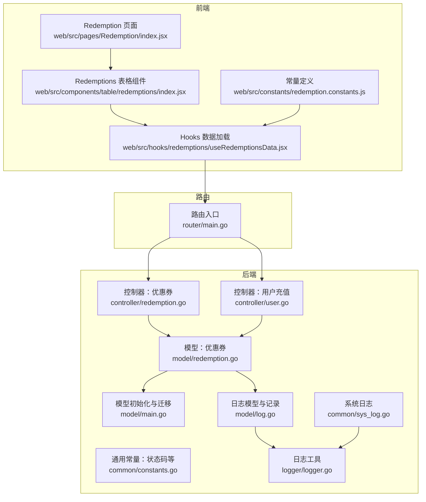
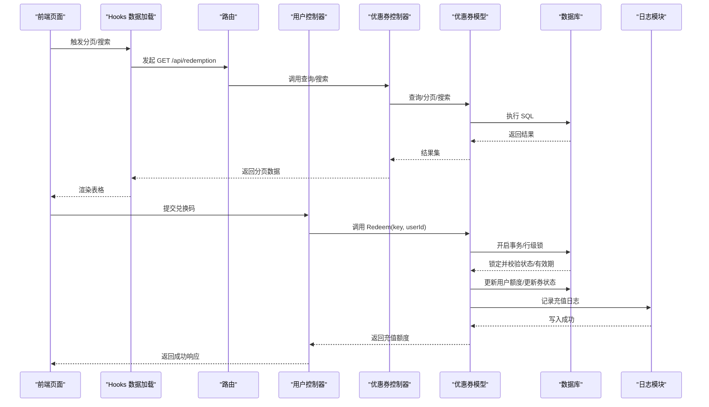
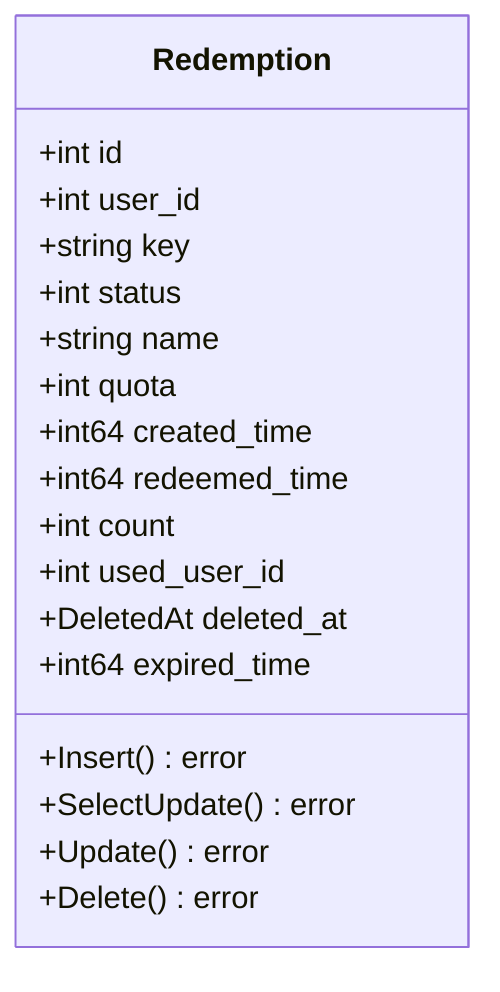
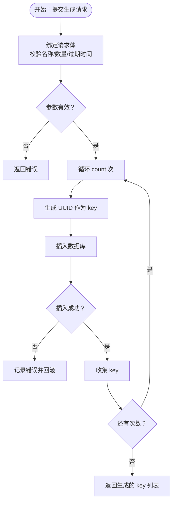
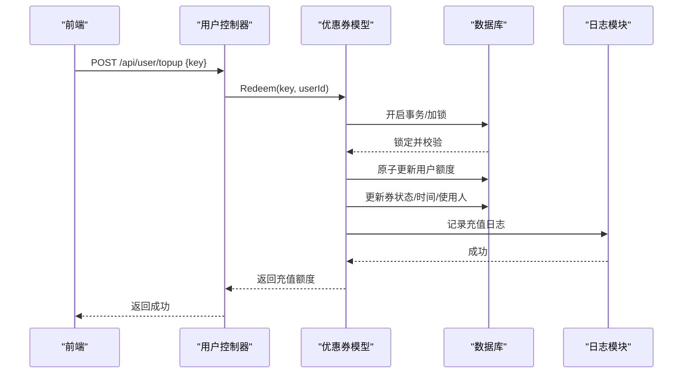
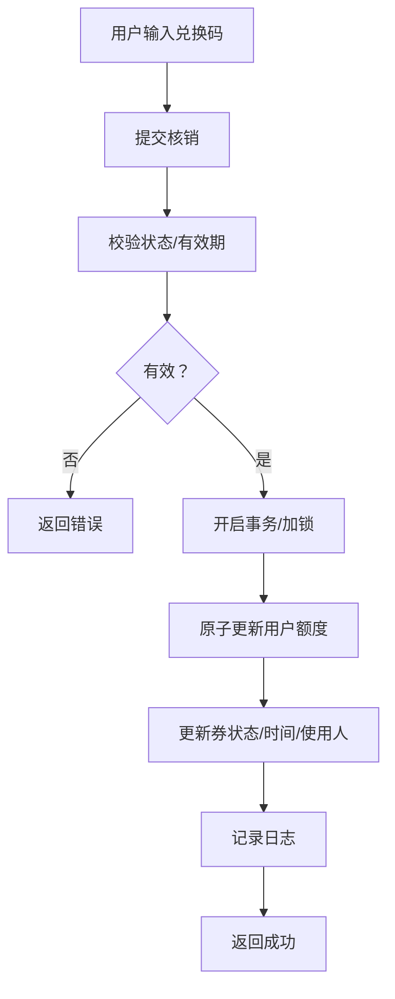
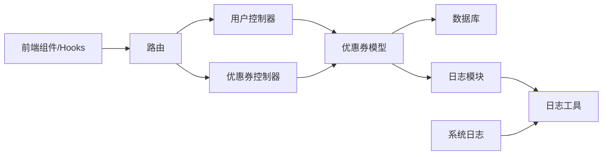

# 优惠券系统

<cite>
**本文引用的文件**
- [controller/redemption.go](file://controller/redemption.go)
- [model/redemption.go](file://model/redemption.go)
- [common/constants.go](file://common/constants.go)
- [controller/user.go](file://controller/user.go)
- [model/log.go](file://model/log.go)
- [logger/logger.go](file://logger/logger.go)
- [web/src/constants/redemption.constants.js](file://web/src/constants/redemption.constants.js)
- [web/src/pages/Redemption/index.jsx](file://web/src/pages/Redemption/index.jsx)
- [web/src/components/table/redemptions/index.jsx](file://web/src/components/table/redemptions/index.jsx)
- [web/src/hooks/redemptions/useRedemptionsData.jsx](file://web/src/hooks/redemptions/useRedemptionsData.jsx)
- [model/main.go](file://model/main.go)
- [router/main.go](file://router/main.go)
- [common/sys_log.go](file://common/sys_log.go)
</cite>

## 目录
1. [简介](#简介)
2. [项目结构](#项目结构)
3. [核心组件](#核心组件)
4. [架构总览](#架构总览)
5. [详细组件分析](#详细组件分析)
6. [依赖关系分析](#依赖关系分析)
7. [性能考量](#性能考量)
8. [故障排查指南](#故障排查指南)
9. [结论](#结论)
10. [附录](#附录)

## 简介
本技术文档围绕“优惠券系统”进行深入解析，覆盖优惠券的生成、分发与使用验证机制，规则配置、使用条件与有效期管理，批量生成与唯一性保障、防作弊策略，以及使用流程、核销处理与状态跟踪。同时提供统计、使用记录与效果分析能力，并强调安全机制、防重复使用与异常处理，帮助开发者全面理解业务流程与实现细节。

## 项目结构
优惠券系统在后端采用 Go/GORM 模型层与 Gin 控制器层，在前端采用 React 组件与 Hooks 实现管理界面与交互。数据库迁移自动包含优惠券模型，日志系统支持消费与充值等关键事件记录。

**图表来源**
- [router/main.go:16-35](file://router/main.go#L16-L35)
- [controller/redemption.go:15-187](file://controller/redemption.go#L15-L187)
- [controller/user.go:1060-1088](file://controller/user.go#L1060-L1088)
- [model/redemption.go:14-199](file://model/redemption.go#L14-L199)
- [model/main.go:250-296](file://model/main.go#L250-L296)
- [common/constants.go:200-204](file://common/constants.go#L200-L204)
- [model/log.go:42-91](file://model/log.go#L42-L91)
- [logger/logger.go:76-118](file://logger/logger.go#L76-L118)
- [common/sys_log.go:17-29](file://common/sys_log.go#L17-L29)

**章节来源**
- [router/main.go:16-35](file://router/main.go#L16-L35)
- [model/main.go:250-296](file://model/main.go#L250-L296)

## 核心组件
- 控制器层
  - 优惠券控制器：提供查询、搜索、新增、更新、删除、清理失效券等接口。
  - 用户充值控制器：调用优惠券核销并增加用户额度。
- 模型层
  - 优惠券模型：定义字段、唯一索引、状态、有效期、计数等；提供批量插入、分页查询、搜索、更新、删除等方法。
  - 日志模型：记录充值、消费等事件，便于审计与统计。
- 前端组件
  - Redemption 页面与表格组件：提供列表、筛选、批量操作、复制、删除失效券等功能。
  - Hooks：封装分页、搜索、批量操作与状态管理。
  - 常量：定义优惠券状态与动作常量。

**章节来源**
- [controller/redemption.go:15-187](file://controller/redemption.go#L15-L187)
- [controller/user.go:1060-1088](file://controller/user.go#L1060-L1088)
- [model/redemption.go:14-199](file://model/redemption.go#L14-L199)
- [model/log.go:42-91](file://model/log.go#L42-L91)
- [web/src/pages/Redemption/index.jsx:23-29](file://web/src/pages/Redemption/index.jsx#L23-L29)
- [web/src/components/table/redemptions/index.jsx:31-123](file://web/src/components/table/redemptions/index.jsx#L31-L123)
- [web/src/hooks/redemptions/useRedemptionsData.jsx:31-361](file://web/src/hooks/redemptions/useRedemptionsData.jsx#L31-L361)
- [web/src/constants/redemption.constants.js:20-47](file://web/src/constants/redemption.constants.js#L20-L47)

## 架构总览
优惠券系统采用经典的 MVC 分层：
- 前端通过路由访问控制器接口，控制器调用模型层执行业务逻辑。
- 模型层通过 GORM 访问数据库，使用唯一索引保证键唯一性。
- 使用核销时采用数据库事务与行级锁，确保并发安全与幂等。
- 日志模块记录关键事件，便于审计与统计。

**图表来源**
- [router/main.go:16-35](file://router/main.go#L16-L35)
- [controller/user.go:1060-1088](file://controller/user.go#L1060-L1088)
- [controller/redemption.go:15-187](file://controller/redemption.go#L15-L187)
- [model/redemption.go:115-156](file://model/redemption.go#L115-L156)
- [model/log.go:75-91](file://model/log.go#L75-L91)

## 详细组件分析

### 优惠券模型与状态
- 字段设计
  - 主键自增 id
  - 用户标识 user_id
  - 唯一键 key（char(32)，唯一索引）
  - 状态 status（启用/禁用/已使用）
  - 名称 name（带索引）
  - 额度 quota（默认 100）
  - 创建时间 created_time、核销时间 redeemed_time
  - 过期时间 expired_time（0 表示不过期）
  - 使用人 used_user_id
  - 软删除 deleted_at
- 状态常量
  - 启用：1
  - 禁用：2
  - 已使用：3
- 关键方法
  - 分页查询、搜索（按名称或 ID 前缀）
  - 批量插入（count 字段控制生成数量）
  - 更新（可仅更新状态）
  - 删除失效券（已使用、已禁用或已过期且未使用的券）

**图表来源**
- [model/redemption.go:14-27](file://model/redemption.go#L14-L27)

**章节来源**
- [model/redemption.go:14-199](file://model/redemption.go#L14-L199)
- [common/constants.go:200-204](file://common/constants.go#L200-L204)

### 优惠券生成与批量发放
- 接口职责
  - 校验名称长度与生成数量范围
  - 校验过期时间有效性
  - 循环生成唯一 key 并插入数据库
- 唯一性保障
  - 数据库层对 key 建立唯一索引
  - 服务层通过循环与错误回滚保证幂等
- 前端交互
  - 通过 Redemption 页面与表格组件提交生成请求
  - 成功后返回生成的 key 列表

**图表来源**
- [controller/redemption.go:61-113](file://controller/redemption.go#L61-L113)
- [model/redemption.go:158-162](file://model/redemption.go#L158-L162)

**章节来源**
- [controller/redemption.go:61-113](file://controller/redemption.go#L61-L113)
- [web/src/pages/Redemption/index.jsx:23-29](file://web/src/pages/Redemption/index.jsx#L23-L29)
- [web/src/components/table/redemptions/index.jsx:31-123](file://web/src/components/table/redemptions/index.jsx#L31-L123)

### 优惠券使用验证与核销流程
- 核销入口
  - 用户提交兑换码，控制器调用模型 Redeem 方法
- 并发与原子性
  - 使用数据库事务包裹
  - 对 key 加行级锁（FOR UPDATE），防止并发重复使用
  - 校验状态与有效期，再原子性更新用户额度与券状态
- 审计与日志
  - 成功后记录充值日志，内容包含券 ID 与额度
- 失败处理
  - 无效 key、已被使用、已过期、余额不足等均返回明确错误

**图表来源**
- [controller/user.go:1060-1088](file://controller/user.go#L1060-L1088)
- [model/redemption.go:115-156](file://model/redemption.go#L115-L156)
- [model/log.go:75-91](file://model/log.go#L75-L91)

**章节来源**
- [controller/user.go:1060-1088](file://controller/user.go#L1060-L1088)
- [model/redemption.go:115-156](file://model/redemption.go#L115-L156)
- [model/log.go:75-91](file://model/log.go#L75-L91)

### 优惠券规则配置、使用条件与有效期管理
- 规则配置
  - 名称：长度限制与中文友好显示
  - 额度：默认 100，可按需调整
  - 数量：生成数量范围限制（例如最大 100）
  - 过期时间：0 表示不过期；小于当前时间视为无效
- 使用条件
  - 状态必须为启用
  - 未过期
  - 未被使用
- 有效期管理
  - 前端可识别过期状态并禁用显示
  - 后端在核销时再次校验

**章节来源**
- [controller/redemption.go:68-83](file://controller/redemption.go#L68-L83)
- [controller/redemption.go:142-151](file://controller/redemption.go#L142-L151)
- [web/src/hooks/redemptions/useRedemptionsData.jsx:209-226](file://web/src/hooks/redemptions/useRedemptionsData.jsx#L209-L226)
- [web/src/constants/redemption.constants.js:20-47](file://web/src/constants/redemption.constants.js#L20-L47)

### 批量生成、唯一性保证与防作弊机制
- 批量生成
  - 通过 count 字段控制生成数量
  - 循环插入并返回生成列表
- 唯一性保证
  - 数据库 key 唯一索引
  - 服务层循环生成 UUID 并插入，失败回滚
- 防作弊机制
  - 并发核销使用行级锁与事务
  - 核销时严格校验状态与有效期
  - 前端禁用过期券显示与操作
  - 日志记录便于审计追踪

**章节来源**
- [controller/redemption.go:84-112](file://controller/redemption.go#L84-L112)
- [model/redemption.go:17-17](file://model/redemption.go#L17-L17)
- [model/redemption.go:129-149](file://model/redemption.go#L129-L149)
- [web/src/hooks/redemptions/useRedemptionsData.jsx:209-226](file://web/src/hooks/redemptions/useRedemptionsData.jsx#L209-L226)

### 使用流程、核销处理与状态跟踪
- 使用流程
  - 用户在前端输入兑换码
  - 控制器调用 Redeem，核销成功后返回充值额度
- 状态跟踪
  - 启用/禁用/已使用三态
  - 前端根据状态与过期时间动态禁用行
  - 支持批量删除失效券（已使用、已禁用、过期）

**图表来源**
- [controller/user.go:1060-1088](file://controller/user.go#L1060-L1088)
- [model/redemption.go:115-156](file://model/redemption.go#L115-L156)
- [model/log.go:75-91](file://model/log.go#L75-L91)

**章节来源**
- [controller/user.go:1060-1088](file://controller/user.go#L1060-L1088)
- [web/src/components/table/redemptions/index.jsx:31-123](file://web/src/components/table/redemptions/index.jsx#L31-L123)
- [web/src/hooks/redemptions/useRedemptionsData.jsx:255-273](file://web/src/hooks/redemptions/useRedemptionsData.jsx#L255-L273)

### 统计、使用记录与效果分析
- 日志记录
  - 充值类型日志记录券 ID 与额度
  - 日志模块统一格式化输出
- 效果分析
  - 前端可通过表格查看券状态、过期时间、使用人等
  - 可结合用户额度变化进行效果评估

**章节来源**
- [model/log.go:42-91](file://model/log.go#L42-L91)
- [logger/logger.go:120-145](file://logger/logger.go#L120-L145)

## 依赖关系分析
- 控制器依赖模型层执行业务逻辑
- 模型层依赖数据库驱动与迁移脚本
- 日志模块独立于业务，但被业务调用
- 前端组件依赖 Hooks 与常量定义

**图表来源**
- [router/main.go:16-35](file://router/main.go#L16-L35)
- [controller/user.go:1060-1088](file://controller/user.go#L1060-L1088)
- [controller/redemption.go:15-187](file://controller/redemption.go#L15-L187)
- [model/redemption.go:14-199](file://model/redemption.go#L14-L199)
- [model/log.go:42-91](file://model/log.go#L42-L91)
- [logger/logger.go:76-118](file://logger/logger.go#L76-L118)
- [common/sys_log.go:17-29](file://common/sys_log.go#L17-L29)

**章节来源**
- [model/main.go:250-296](file://model/main.go#L250-L296)

## 性能考量
- 数据库层面
  - 唯一键索引提升查找与去重效率
  - 行级锁与事务保证并发安全，建议合理设置数据库连接池参数
- 服务层面
  - 批量生成时逐条插入，注意数据库压力；可考虑批处理优化
  - 日志写入异步化可降低阻塞风险
- 前端层面
  - 分页与搜索减少一次性传输数据量
  - 过滤过期券避免无效渲染

## 故障排查指南
- 常见错误与定位
  - 无效兑换码：检查 key 是否存在、大小写与格式
  - 已被使用：确认券状态是否为已使用
  - 已过期：检查 expired_time 与当前时间对比
  - 参数校验失败：检查名称长度、数量范围、过期时间
- 日志与审计
  - 查看日志模块记录的充值日志，定位核销失败原因
  - 使用系统日志辅助排查数据库连接与迁移问题
- 前端提示
  - 过期券在表格中禁用显示，避免误操作
  - 批量删除失效券可清理冗余数据

**章节来源**
- [controller/redemption.go:182-187](file://controller/redemption.go#L182-L187)
- [model/redemption.go:134-139](file://model/redemption.go#L134-L139)
- [web/src/hooks/redemptions/useRedemptionsData.jsx:209-226](file://web/src/hooks/redemptions/useRedemptionsData.jsx#L209-L226)
- [model/log.go:75-91](file://model/log.go#L75-L91)
- [common/sys_log.go:17-29](file://common/sys_log.go#L17-L29)

## 结论
优惠券系统通过清晰的分层设计与严格的并发控制，实现了从生成、分发到核销与审计的完整闭环。数据库唯一索引与行级锁确保了唯一性与幂等性；前端提供友好的管理界面与批量操作；日志模块为审计与效果分析提供支撑。开发者可在此基础上扩展更多规则与统计维度，持续优化用户体验与系统稳定性。

## 附录
- 前端常量与页面
  - 状态映射与动作常量
  - Redemption 页面与表格组件
  - Hooks 封装的数据加载与批量操作
- 数据库迁移
  - 自动迁移包含优惠券模型，确保表结构一致

**章节来源**
- [web/src/constants/redemption.constants.js:20-47](file://web/src/constants/redemption.constants.js#L20-L47)
- [web/src/pages/Redemption/index.jsx:23-29](file://web/src/pages/Redemption/index.jsx#L23-L29)
- [web/src/components/table/redemptions/index.jsx:31-123](file://web/src/components/table/redemptions/index.jsx#L31-L123)
- [web/src/hooks/redemptions/useRedemptionsData.jsx:31-361](file://web/src/hooks/redemptions/useRedemptionsData.jsx#L31-L361)
- [model/main.go:250-296](file://model/main.go#L250-L296)