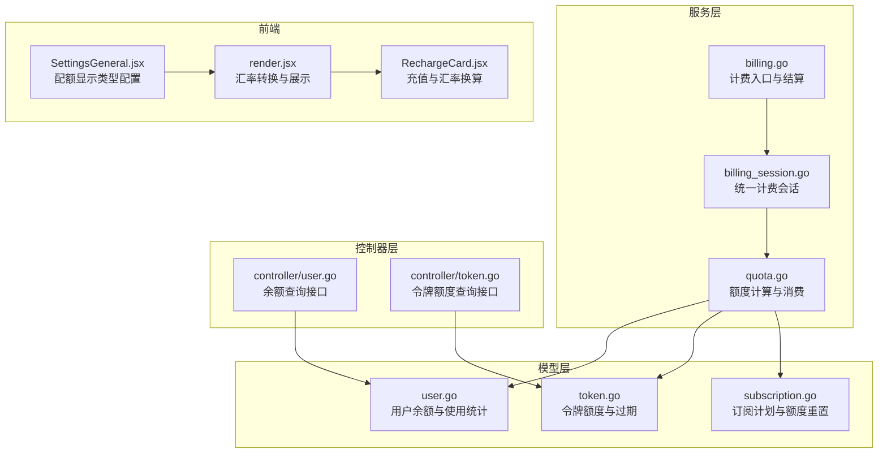
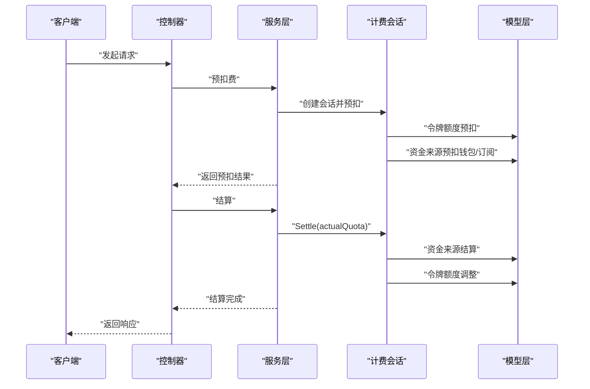
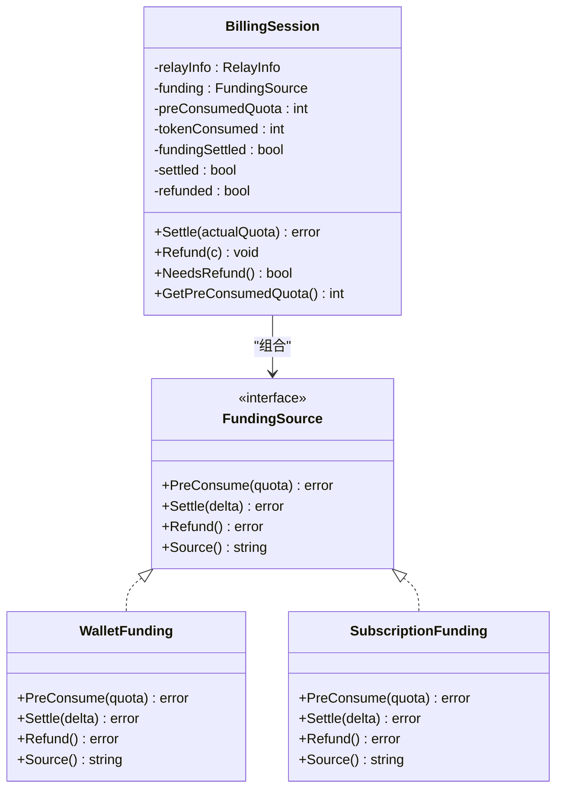
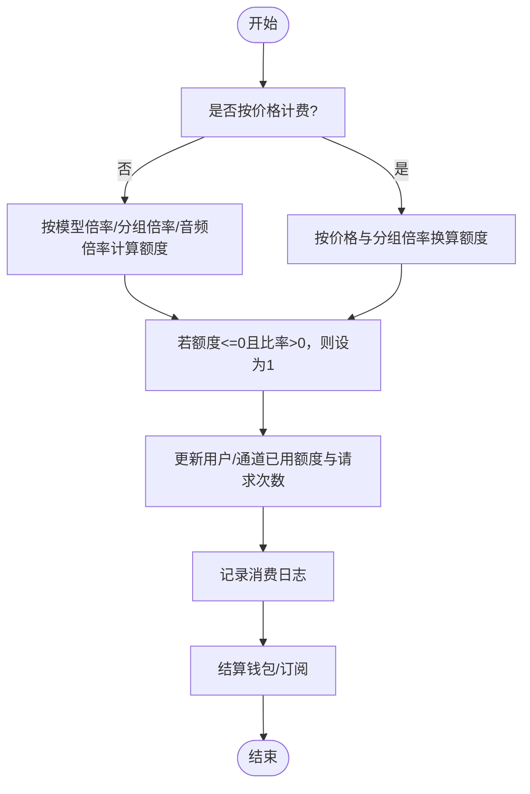
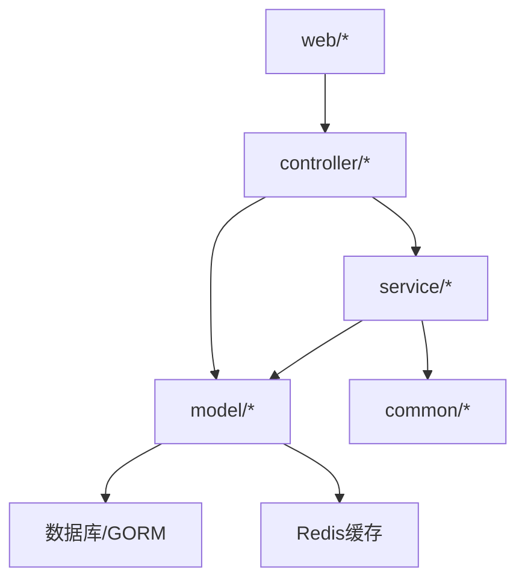

# 余额管理

<cite>
**本文引用的文件**
- [billing.go](file://service/billing.go)
- [billing_session.go](file://service/billing_session.go)
- [quota.go](file://service/quota.go)
- [user.go](file://model/user.go)
- [token.go](file://model/token.go)
- [subscription.go](file://model/subscription.go)
- [general_setting.go](file://setting/operation_setting/general_setting.go)
- [quota_setting.go](file://setting/operation_setting/quota_setting.go)
- [quota.go](file://common/quota.go)
- [token.go](file://controller/token.go)
- [user.go](file://controller/user.go)
- [task_billing_test.go](file://service/task_billing_test.go)
- [render.jsx](file://web/src/helpers/render.jsx)
- [SettingsGeneral.jsx](file://web/src/pages/Setting/Operation/SettingsGeneral.jsx)
- [RechargeCard.jsx](file://web/src/components/topup/RechargeCard.jsx)
</cite>

## 目录
1. [简介](#简介)
2. [项目结构](#项目结构)
3. [核心组件](#核心组件)
4. [架构总览](#架构总览)
5. [详细组件分析](#详细组件分析)
6. [依赖分析](#依赖分析)
7. [性能考虑](#性能考虑)
8. [故障排查指南](#故障排查指南)
9. [结论](#结论)
10. [附录](#附录)

## 简介
本技术文档围绕余额管理系统，系统性阐述余额计算、消费记录、退款处理、配额显示类型配置、汇率转换与TOKENS计价模式、余额查询、使用统计与限额控制、无限配额处理、过期时间管理、余额同步、余额安全机制、并发控制与数据一致性保障，以及余额统计、报表生成与财务对账能力。目标是帮助开发者快速理解并正确扩展余额管理的核心算法与业务逻辑。

## 项目结构
余额管理涉及服务层、模型层、控制器层与前端展示层的协同：
- 服务层负责统一计费会话、预扣费/结算/退款、额度计算与通知
- 模型层负责用户、令牌、订阅等实体的持久化与缓存
- 控制器层提供余额查询、令牌额度查询等接口
- 前端负责配额显示类型配置、汇率转换与展示

图表来源
- [billing.go:1-79](file://service/billing.go#L1-L79)
- [billing_session.go:1-348](file://service/billing_session.go#L1-L348)
- [quota.go:1-508](file://service/quota.go#L1-L508)
- [user.go:1-800](file://model/user.go#L1-L800)
- [token.go:1-483](file://model/token.go#L1-L483)
- [subscription.go:1-800](file://model/subscription.go#L1-L800)
- [user.go:1-800](file://controller/user.go#L1-L800)
- [token.go:1-360](file://controller/token.go#L1-L360)
- [SettingsGeneral.jsx:106-199](file://web/src/pages/Setting/Operation/SettingsGeneral.jsx#L106-L199)
- [render.jsx:1122-1135](file://web/src/helpers/render.jsx#L1122-L1135)
- [RechargeCard.jsx:398-425](file://web/src/components/topup/RechargeCard.jsx#L398-L425)

章节来源
- [billing.go:1-79](file://service/billing.go#L1-L79)
- [billing_session.go:1-348](file://service/billing_session.go#L1-L348)
- [quota.go:1-508](file://service/quota.go#L1-L508)
- [user.go:1-800](file://model/user.go#L1-L800)
- [token.go:1-483](file://model/token.go#L1-L483)
- [subscription.go:1-800](file://model/subscription.go#L1-L800)
- [user.go:1-800](file://controller/user.go#L1-L800)
- [token.go:1-360](file://controller/token.go#L1-L360)
- [SettingsGeneral.jsx:106-199](file://web/src/pages/Setting/Operation/SettingsGeneral.jsx#L106-L199)
- [render.jsx:1122-1135](file://web/src/helpers/render.jsx#L1122-L1135)
- [RechargeCard.jsx:398-425](file://web/src/components/topup/RechargeCard.jsx#L398-L425)

## 核心组件
- 统一计费会话（BillingSession）：封装预扣费、结算、退款的完整生命周期，支持钱包与订阅两种资金来源，并具备幂等与回滚能力
- 额度计算与消费（quota.go）：根据模型倍率、分组倍率、音频/文本令牌等计算实际消耗额度，支持按价格计费与按比率计费
- 用户余额与使用统计（model/user.go）：用户余额、已用额度、请求次数等字段，提供余额查询与使用统计更新
- 令牌额度与过期（model/token.go）：令牌剩余额度、使用额度、过期时间、无限额度标志，支持令牌级限额与跨分组重试
- 订阅额度与重置（model/subscription.go）：订阅计划、订单、用户订阅实例与额度重置周期，支持日/周/月/自定义重置
- 前端配额显示与汇率（web）：支持USD/CNY/TOKENS/CUSTOM四种显示类型，前端进行汇率换算与展示

章节来源
- [billing_session.go:23-141](file://service/billing_session.go#L23-L141)
- [quota.go:32-87](file://service/quota.go#L32-L87)
- [user.go:39-41](file://model/user.go#L39-L41)
- [token.go:23-28](file://model/token.go#L23-L28)
- [subscription.go:26-33](file://model/subscription.go#L26-L33)
- [general_setting.go:5-11](file://setting/operation_setting/general_setting.go#L5-L11)

## 架构总览
余额管理采用“服务层统一计费 + 模型层数据持久化 + 控制器层接口 + 前端展示”的分层设计。服务层通过BillingSession协调令牌与资金来源，确保在一次请求内完成预扣、结算与退款的原子性与一致性。

图表来源
- [billing.go:17-78](file://service/billing.go#L17-L78)
- [billing_session.go:36-77](file://service/billing_session.go#L36-L77)
- [quota.go:367-411](file://service/quota.go#L367-L411)

## 详细组件分析

### 统一计费会话（BillingSession）
- 预扣费流程：令牌额度预扣 -> 资金来源预扣（钱包/订阅），任一步骤失败则回滚已扣额度
- 结算流程：根据实际消耗与预扣差额进行资金来源结算与令牌额度调整，支持订阅与钱包两种来源
- 退款流程：幂等安全，异步执行，优先退回资金来源，再退回令牌额度
- 信任额度旁路：当令牌剩余额度超过信任阈值时，可跳过预扣，直接信任用户可用额度

图表来源
- [billing_session.go:23-34](file://service/billing_session.go#L23-L34)
- [billing_session.go:254-347](file://service/billing_session.go#L254-L347)

章节来源
- [billing_session.go:36-192](file://service/billing_session.go#L36-L192)
- [billing_session.go:194-228](file://service/billing_session.go#L194-L228)
- [billing_session.go:230-248](file://service/billing_session.go#L230-L248)

### 额度计算与消费（quota.go）
- 音频/文本令牌计价：根据模型倍率、分组倍率、音频/文本输入输出令牌计算最终额度
- 按价格计费：使用模型价格与分组倍率直接换算额度
- 实时流式消费：支持WebSocket实时流式消费的预扣与结算
- 通知机制：当剩余额度低于阈值时，异步发送额度提醒通知

图表来源
- [quota.go:50-87](file://service/quota.go#L50-L87)
- [quota.go:259-341](file://service/quota.go#L259-L341)
- [quota.go:367-411](file://service/quota.go#L367-L411)

章节来源
- [quota.go:50-87](file://service/quota.go#L50-L87)
- [quota.go:259-341](file://service/quota.go#L259-L341)
- [quota.go:367-411](file://service/quota.go#L367-L411)

### 用户余额与使用统计（model/user.go）
- 用户余额字段：quota（剩余额度）、used_quota（已用额度）、request_count（请求次数）
- 余额查询：支持从缓存或数据库读取用户剩余额度
- 余额变更：提供增加/减少用户余额的方法，支持事务与批量更新
- 邀请奖励与转账：邀请奖励额度转入余额，支持最小额度校验与事务一致性

章节来源
- [user.go:39-41](file://model/user.go#L39-L41)
- [user.go:779-800](file://model/user.go#L779-L800)
- [user.go:342-377](file://model/user.go#L342-L377)

### 令牌额度与过期（model/token.go）
- 令牌额度字段：remain_quota（剩余额度）、used_quota（已用额度）、unlimited_quota（无限额度）
- 令牌校验：状态、过期时间、剩余额度校验，支持Redis缓存与批量更新
- 令牌额度调整：支持增加/减少令牌额度，异步更新缓存
- 令牌搜索与限制：支持关键词搜索、模糊搜索限制与最大令牌数量限制

章节来源
- [token.go:23-28](file://model/token.go#L23-L28)
- [token.go:188-226](file://model/token.go#L188-L226)
- [token.go:375-433](file://model/token.go#L375-L433)
- [token.go:127-186](file://model/token.go#L127-L186)

### 订阅额度与重置（model/subscription.go）
- 订阅计划：总额度、有效期、额度重置周期（日/周/月/自定义）
- 用户订阅：活跃状态、起止时间、已用额度、下次重置时间
- 完成订单：创建用户订阅快照、更新充值记录、记录日志
- 降级用户分组：当取消/删除订阅后，按需回退用户分组

章节来源
- [subscription.go:145-180](file://model/subscription.go#L145-L180)
- [subscription.go:233-255](file://model/subscription.go#L233-L255)
- [subscription.go:508-572](file://model/subscription.go#L508-L572)
- [subscription.go:714-757](file://model/subscription.go#L714-L757)

### 配额显示类型配置、汇率转换与TOKENS计价模式
- 显示类型：USD（美元）、CNY（人民币）、TOKENS（令牌单位）、CUSTOM（自定义货币）
- 汇率换算：前端根据当前显示类型与汇率配置进行换算展示
- TOKENS模式：系统内部计费精度默认为500000，修改可能影响计费，需谨慎

章节来源
- [general_setting.go:5-11](file://setting/operation_setting/general_setting.go#L5-L11)
- [general_setting.go:76-91](file://setting/operation_setting/general_setting.go#L76-L91)
- [SettingsGeneral.jsx:106-199](file://web/src/pages/Setting/Operation/SettingsGeneral.jsx#L106-L199)
- [render.jsx:1122-1135](file://web/src/helpers/render.jsx#L1122-L1135)
- [RechargeCard.jsx:398-425](file://web/src/components/topup/RechargeCard.jsx#L398-L425)

### 余额查询、使用统计与限额控制
- 余额查询：控制器提供余额查询接口，返回用户quota、used_quota、request_count等
- 使用统计：服务层在结算后更新用户与通道的已用额度与请求次数
- 限额控制：令牌过期时间、剩余额度、无限额度标志共同构成限额控制

章节来源
- [user.go:373-424](file://controller/user.go#L373-L424)
- [quota.go:312-341](file://service/quota.go#L312-L341)
- [token.go:188-226](file://model/token.go#L188-L226)

### 无限配额处理、过期时间管理与余额同步
- 无限配额：令牌unlimited_quota为true时，不限制剩余额度
- 过期时间：expired_time=-1表示永不过期，否则按时间戳判断
- 余额同步：支持Redis缓存与批量更新，异步刷新缓存

章节来源
- [token.go:22-24](file://model/token.go#L22-L24)
- [token.go:199-218](file://model/token.go#L199-L218)
- [token.go:375-433](file://model/token.go#L375-L433)

### 余额安全机制、并发控制与数据一致性
- 并发控制：令牌与订阅额度调整使用数据库事务与行级锁，确保并发一致性
- 数据一致性：预扣费失败自动回滚，结算与退款幂等，避免重复扣费或退款
- 缓存一致性：余额与令牌额度变更后异步更新缓存，降低缓存不一致风险

章节来源
- [billing_session.go:149-192](file://service/billing_session.go#L149-L192)
- [billing_session.go:36-77](file://service/billing_session.go#L36-L77)
- [subscription.go:521-560](file://model/subscription.go#L521-L560)

### 余额统计、报表生成与财务对账
- 消费日志：记录每次消费的模型名、令牌名、额度、耗时、分组等信息
- 报表生成：结合消费日志与订阅使用情况，生成余额使用报表
- 财务对账：订阅订单与充值记录与用户订阅实例对账，确保账实相符

章节来源
- [quota.go:222-235](file://service/quota.go#L222-L235)
- [subscription.go:508-572](file://model/subscription.go#L508-L572)

## 依赖分析
余额管理模块的依赖关系如下：

图表来源
- [billing.go:1-79](file://service/billing.go#L1-L79)
- [billing_session.go:1-348](file://service/billing_session.go#L1-L348)
- [quota.go:1-508](file://service/quota.go#L1-L508)
- [user.go:1-800](file://model/user.go#L1-L800)
- [token.go:1-483](file://model/token.go#L1-L483)
- [subscription.go:1-800](file://model/subscription.go#L1-L800)
- [user.go:1-800](file://controller/user.go#L1-L800)
- [token.go:1-360](file://controller/token.go#L1-L360)

章节来源
- [billing.go:1-79](file://service/billing.go#L1-L79)
- [billing_session.go:1-348](file://service/billing_session.go#L1-L348)
- [quota.go:1-508](file://service/quota.go#L1-L508)
- [user.go:1-800](file://model/user.go#L1-L800)
- [token.go:1-483](file://model/token.go#L1-L483)
- [subscription.go:1-800](file://model/subscription.go#L1-L800)
- [user.go:1-800](file://controller/user.go#L1-L800)
- [token.go:1-360](file://controller/token.go#L1-L360)

## 性能考虑
- 缓存策略：用户余额与令牌额度支持Redis缓存，减少数据库压力
- 批量更新：支持批量更新令牌额度，降低写入开销
- 异步通知：额度提醒通过异步协程发送，避免阻塞主流程
- 计费偏好回退：钱包优先与订阅优先的回退逻辑，提升成功率与吞吐

## 故障排查指南
- 预扣费失败：检查令牌剩余额度、过期状态与无限额度标志；查看回滚日志
- 结算异常：确认实际消耗与预扣差额；检查资金来源结算与令牌额度调整
- 退款问题：确认是否已结算；幂等退款不应重复执行
- 测试用例参考：包含零额度退款、无令牌退款、订阅退款等边界场景

章节来源
- [task_billing_test.go:201-288](file://service/task_billing_test.go#L201-L288)

## 结论
余额管理系统通过统一计费会话、严格的预扣/结算/退款流程与完善的并发控制，实现了高可靠性的余额管理。配合灵活的配额显示类型、汇率转换与TOKENS计价模式，满足多币种与多展示需求。通过消费日志与订阅对账，可支撑报表生成与财务对账。建议在扩展时遵循现有设计原则，确保数据一致性与用户体验。

## 附录
- 信任额度阈值：系统默认信任额度为10倍QuotaPerUnit，可通过配置调整
- TOKENS计价：系统内部计费精度默认为500000，修改可能导致计费异常

章节来源
- [quota.go:3-5](file://common/quota.go#L3-L5)
- [SettingsGeneral.jsx:176-179](file://web/src/pages/Setting/Operation/SettingsGeneral.jsx#L176-L179)