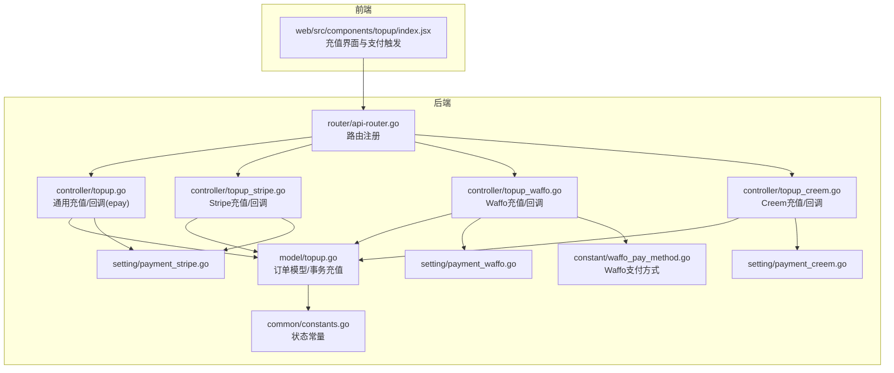
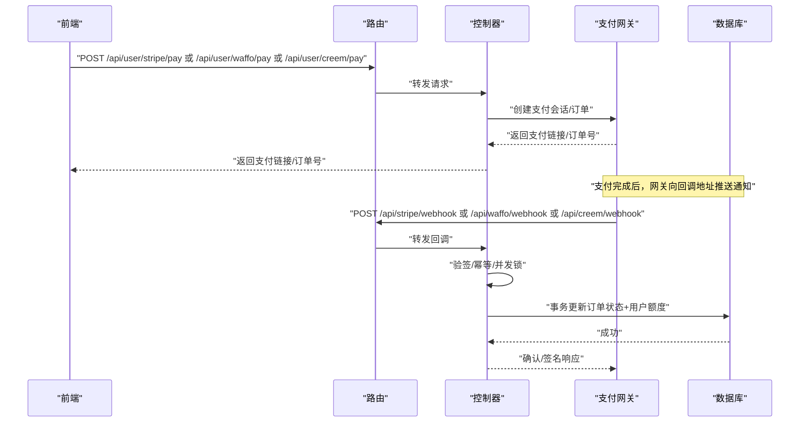
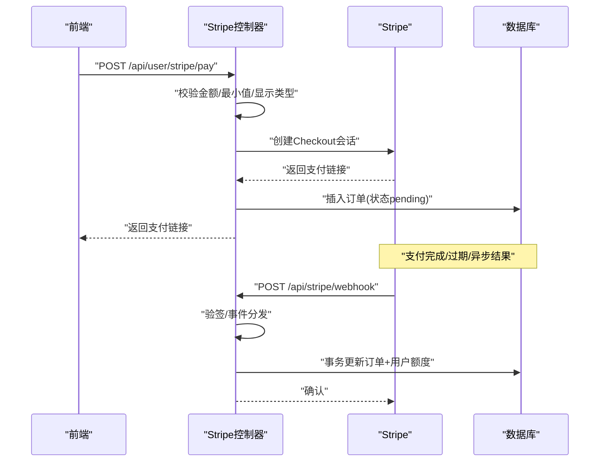
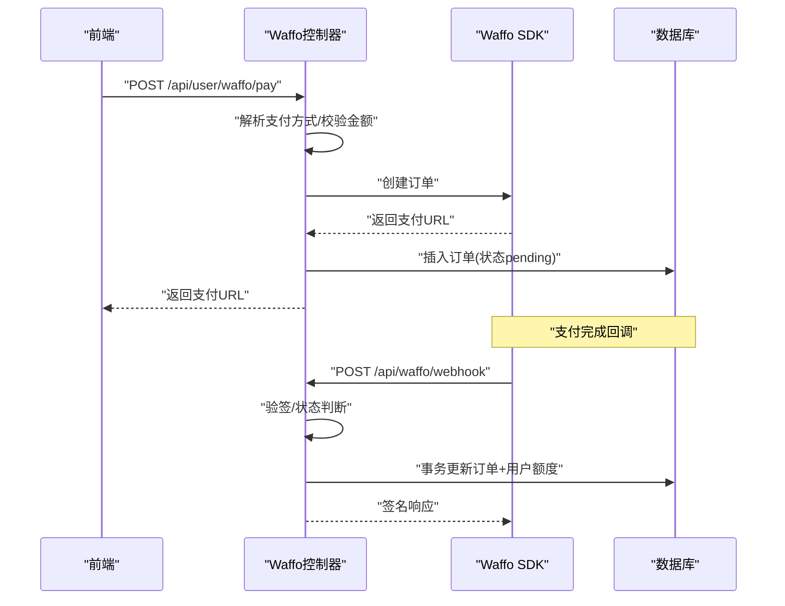
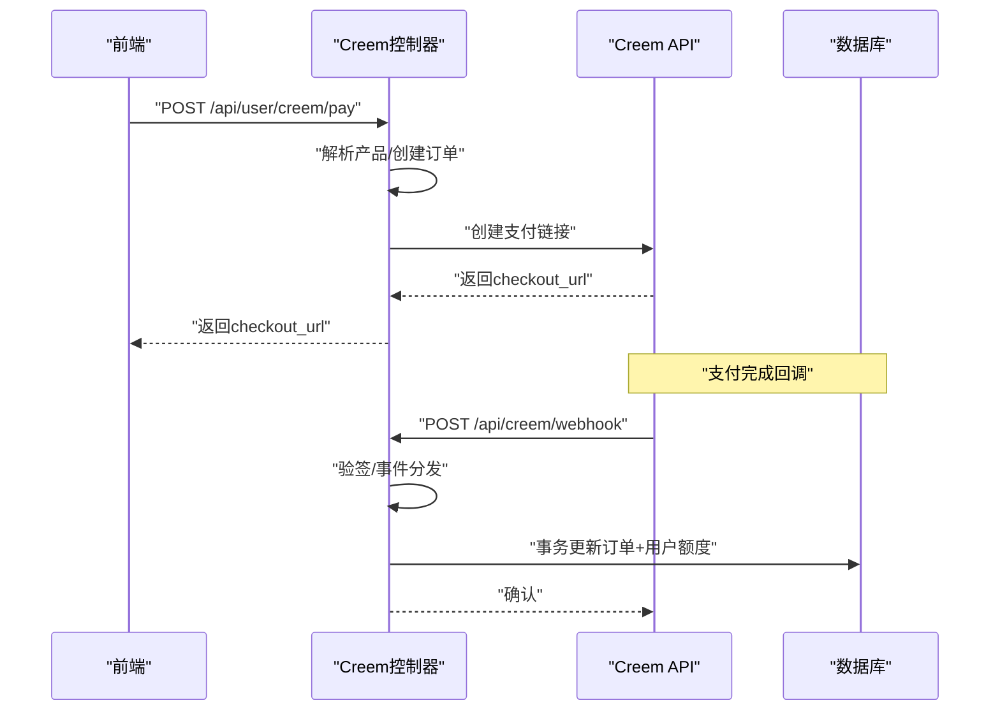
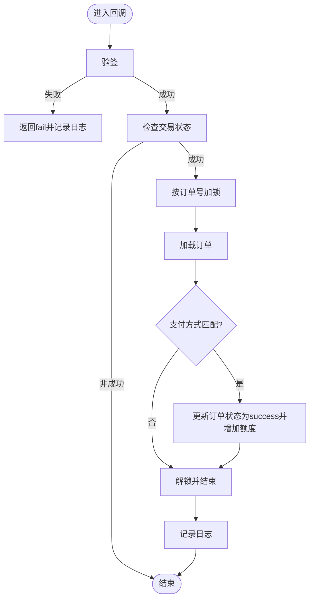
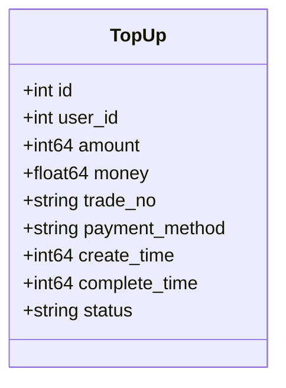
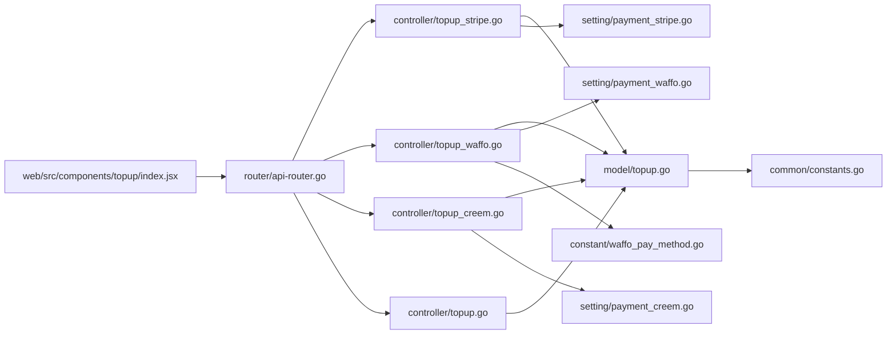

# 在线充值

<cite>
**本文档引用的文件**
- [controller/topup.go](file://controller/topup.go)
- [controller/topup_stripe.go](file://controller/topup_stripe.go)
- [controller/topup_waffo.go](file://controller/topup_waffo.go)
- [controller/topup_creem.go](file://controller/topup_creem.go)
- [router/api-router.go](file://router/api-router.go)
- [model/topup.go](file://model/topup.go)
- [setting/payment_stripe.go](file://setting/payment_stripe.go)
- [setting/payment_waffo.go](file://setting/payment_waffo.go)
- [setting/payment_creem.go](file://setting/payment_creem.go)
- [constant/waffo_pay_method.go](file://constant/waffo_pay_method.go)
- [common/constants.go](file://common/constants.go)
- [web/src/components/topup/index.jsx](file://web/src/components/topup/index.jsx)
</cite>

## 目录
1. [简介](#简介)
2. [项目结构](#项目结构)
3. [核心组件](#核心组件)
4. [架构总览](#架构总览)
5. [详细组件分析](#详细组件分析)
6. [依赖关系分析](#依赖关系分析)
7. [性能考量](#性能考量)
8. [故障排查指南](#故障排查指南)
9. [结论](#结论)
10. [附录](#附录)

## 简介
本文件面向开发者与运维人员，系统性梳理在线充值系统的多支付网关集成方案，覆盖 Stripe、Waffo Pay 与 Creem 三种支付方式。文档重点阐述充值流程、订单管理、支付状态跟踪、回调处理与异步通知、幂等与并发控制、防重复支付策略、异常处理与安全机制，并提供充值金额配置、汇率与手续费计算的实现要点与最佳实践。

## 项目结构
在线充值相关代码主要分布在以下模块：
- 控制器层：负责接收前端请求、调用支付网关、处理回调与异步通知、更新订单状态与用户额度。
- 路由层：暴露充值与回调接口，统一鉴权与限流。
- 模型层：持久化充值订单、查询与更新状态、事务内完成额度变更。
- 设置层：支付网关密钥、价格、最小充值额、币种等配置项。
- 常量与前端组件：支付方式枚举、默认支付方式列表、前端充值界面与交互。

**图表来源**
- [router/api-router.go:49-51](file://router/api-router.go#L49-L51)
- [controller/topup.go:25-101](file://controller/topup.go#L25-L101)
- [controller/topup_stripe.go:68-146](file://controller/topup_stripe.go#L68-L146)
- [controller/topup_waffo.go:102-270](file://controller/topup_waffo.go#L102-L270)
- [controller/topup_creem.go:68-169](file://controller/topup_creem.go#L68-L169)
- [model/topup.go:14-111](file://model/topup.go#L14-L111)
- [setting/payment_stripe.go:1-9](file://setting/payment_stripe.go#L1-L9)
- [setting/payment_waffo.go:1-68](file://setting/payment_waffo.go#L1-L68)
- [setting/payment_creem.go:1-7](file://setting/payment_creem.go#L1-L7)
- [common/constants.go:213-218](file://common/constants.go#L213-L218)
- [constant/waffo_pay_method.go:1-17](file://constant/waffo_pay_method.go#L1-L17)

**章节来源**
- [router/api-router.go:49-51](file://router/api-router.go#L49-L51)
- [controller/topup.go:25-101](file://controller/topup.go#L25-L101)
- [controller/topup_stripe.go:68-146](file://controller/topup_stripe.go#L68-L146)
- [controller/topup_waffo.go:102-270](file://controller/topup_waffo.go#L102-L270)
- [controller/topup_creem.go:68-169](file://controller/topup_creem.go#L68-L169)
- [model/topup.go:14-111](file://model/topup.go#L14-L111)
- [setting/payment_stripe.go:1-9](file://setting/payment_stripe.go#L1-L9)
- [setting/payment_waffo.go:1-68](file://setting/payment_waffo.go#L1-L68)
- [setting/payment_creem.go:1-7](file://setting/payment_creem.go#L1-L7)
- [common/constants.go:213-218](file://common/constants.go#L213-L218)
- [constant/waffo_pay_method.go:1-17](file://constant/waffo_pay_method.go#L1-L17)

## 核心组件
- 支付控制器
  - 通用充值与回调：处理易支付（epay）的下单与回调，含并发锁与幂等处理。
  - Stripe：创建 Checkout 会话、校验回调、处理完成/过期/异步支付结果。
  - Waffo：创建订单、回调验签、处理支付成功/失败。
  - Creem：创建支付链接、回调验签、处理支付完成。
- 路由
  - 注册各支付网关回调与充值接口，统一中间件。
- 模型
  - 充值订单结构、查询、更新、事务内充值额度变更。
- 设置
  - Stripe/Waffo/Creem 的密钥、价格、最小充值额、币种、回调地址等。
- 常量
  - 充值状态常量（pending/success/failed/expired）。

**章节来源**
- [controller/topup.go:25-101](file://controller/topup.go#L25-L101)
- [controller/topup_stripe.go:68-146](file://controller/topup_stripe.go#L68-L146)
- [controller/topup_waffo.go:102-270](file://controller/topup_waffo.go#L102-L270)
- [controller/topup_creem.go:68-169](file://controller/topup_creem.go#L68-L169)
- [router/api-router.go:49-51](file://router/api-router.go#L49-L51)
- [model/topup.go:14-111](file://model/topup.go#L14-L111)
- [common/constants.go:213-218](file://common/constants.go#L213-L218)

## 架构总览
在线充值采用“前端发起—后端对接—支付网关—回调确认—数据库落账”的闭环流程。所有支付回调均通过独立接口接入，控制器负责验签与幂等处理，模型层在事务内完成订单状态更新与用户额度增加，保证一致性与可审计性。

**图表来源**
- [router/api-router.go:49-51](file://router/api-router.go#L49-L51)
- [controller/topup_stripe.go:148-187](file://controller/topup_stripe.go#L148-L187)
- [controller/topup_waffo.go:288-337](file://controller/topup_waffo.go#L288-L337)
- [controller/topup_creem.go:232-284](file://controller/topup_creem.go#L232-L284)
- [model/topup.go:60-111](file://model/topup.go#L60-L111)

## 详细组件分析

### Stripe 支付集成
- 下单与金额计算
  - 根据用户分组倍率与可选折扣计算应付金额，支持令牌显示与美元显示切换。
  - 金额与最小充值额校验，超限保护。
- 支付链接生成
  - 使用 PriceId 与数量创建 Checkout 会话，支持促销码开关。
  - 成功后创建本地订单，状态 pending。
- 回调处理
  - 验证签名，处理完成、过期、异步支付成功/失败事件。
  - 对订阅订单与充值订单分别处理，最终在事务内完成额度入账。
- 安全与并发
  - 使用订单级互斥锁，避免并发重复入账。
  - 支付状态与支付方式一致性校验。

**图表来源**
- [controller/topup_stripe.go:68-146](file://controller/topup_stripe.go#L68-L146)
- [controller/topup_stripe.go:148-187](file://controller/topup_stripe.go#L148-L187)
- [controller/topup_stripe.go:256-286](file://controller/topup_stripe.go#L256-L286)
- [model/topup.go:60-111](file://model/topup.go#L60-L111)

**章节来源**
- [controller/topup_stripe.go:68-146](file://controller/topup_stripe.go#L68-L146)
- [controller/topup_stripe.go:148-187](file://controller/topup_stripe.go#L148-L187)
- [controller/topup_stripe.go:256-286](file://controller/topup_stripe.go#L256-L286)
- [setting/payment_stripe.go:1-9](file://setting/payment_stripe.go#L1-L9)
- [common/constants.go:213-218](file://common/constants.go#L213-L218)

### Waffo Pay 支付集成
- 下单与金额计算
  - 仅支持美元计价，根据显示类型与分组倍率计算应付金额，支持折扣。
  - 支付方式由服务端配置列表解析，支持自动选择或指定索引。
- 支付链接生成
  - 通过 SDK 创建订单，返回可跳转 URL；支持自定义回调与回跳地址。
- 回调处理
  - 验证签名，区分支付成功/失败；失败订单标记为 failed，避免悬置。
  - 事务内完成额度入账与日志记录。

**图表来源**
- [controller/topup_waffo.go:102-270](file://controller/topup_waffo.go#L102-L270)
- [controller/topup_waffo.go:288-337](file://controller/topup_waffo.go#L288-L337)
- [controller/topup_waffo.go:339-368](file://controller/topup_waffo.go#L339-L368)
- [model/topup.go:390-451](file://model/topup.go#L390-L451)

**章节来源**
- [controller/topup_waffo.go:102-270](file://controller/topup_waffo.go#L102-L270)
- [controller/topup_waffo.go:288-337](file://controller/topup_waffo.go#L288-L337)
- [controller/topup_waffo.go:339-368](file://controller/topup_waffo.go#L339-L368)
- [setting/payment_waffo.go:1-68](file://setting/payment_waffo.go#L1-L68)
- [constant/waffo_pay_method.go:1-17](file://constant/waffo_pay_method.go#L1-L17)

### Creem 支付集成
- 下单与金额计算
  - 从服务端配置的产品列表中解析产品，直接使用产品价格与额度。
  - 先创建订单，再调用 Creem API 获取支付链接。
- 回调处理
  - 验证签名（测试模式可跳过），处理 checkout.completed 事件。
  - 事务内完成额度入账与日志记录；邮箱为空时进行防护性提示。

**图表来源**
- [controller/topup_creem.go:68-169](file://controller/topup_creem.go#L68-L169)
- [controller/topup_creem.go:232-284](file://controller/topup_creem.go#L232-L284)
- [controller/topup_creem.go:286-366](file://controller/topup_creem.go#L286-L366)
- [model/topup.go:315-388](file://model/topup.go#L315-L388)

**章节来源**
- [controller/topup_creem.go:68-169](file://controller/topup_creem.go#L68-L169)
- [controller/topup_creem.go:232-284](file://controller/topup_creem.go#L232-L284)
- [controller/topup_creem.go:286-366](file://controller/topup_creem.go#L286-L366)
- [setting/payment_creem.go:1-7](file://setting/payment_creem.go#L1-L7)

### 通用充值与回调（易支付 epay）
- 下单
  - 校验金额与最小充值额，根据显示类型换算美元金额，创建订单并调用支付网关下单。
- 回调
  - 验签通过后，仅处理非 Stripe/Creem/Waffo 的订单，避免跨渠道误认。
  - 并发锁保护，事务内更新订单与用户额度。

**图表来源**
- [controller/topup.go:283-370](file://controller/topup.go#L283-L370)
- [model/topup.go:60-111](file://model/topup.go#L60-L111)

**章节来源**
- [controller/topup.go:166-239](file://controller/topup.go#L166-L239)
- [controller/topup.go:283-370](file://controller/topup.go#L283-L370)
- [model/topup.go:60-111](file://model/topup.go#L60-L111)

### 订单管理与状态跟踪
- 订单结构
  - 包含用户ID、金额、货币金额、交易号、支付方式、创建时间、完成时间与状态。
- 查询与分页
  - 支持按用户与关键字搜索，管理员可查询全平台记录。
- 状态常量
  - pending/success/failed/expired 四态管理，确保状态机清晰。

**图表来源**
- [model/topup.go:14-24](file://model/topup.go#L14-L24)

**章节来源**
- [model/topup.go:14-24](file://model/topup.go#L14-L24)
- [model/topup.go:113-174](file://model/topup.go#L113-L174)
- [common/constants.go:213-218](file://common/constants.go#L213-L218)

### 支付金额配置、汇率与手续费
- Stripe
  - 单价与分组倍率相乘，支持可选折扣；最小充值额按显示类型换算。
- Waffo
  - 仅支持美元计价，按显示类型与倍率计算；零小数币种需整数金额。
- Creem
  - 从产品列表直接取价格与额度，无需换算。
- 显示类型
  - 支持美元/人民币/令牌显示，前端传参与后端换算逻辑一致。

**章节来源**
- [controller/topup_stripe.go:399-418](file://controller/topup_stripe.go#L399-L418)
- [controller/topup_waffo.go:77-93](file://controller/topup_waffo.go#L77-L93)
- [controller/topup.go:126-154](file://controller/topup.go#L126-L154)
- [common/constants.go:213-218](file://common/constants.go#L213-L218)

### 支付安全机制与防重复支付
- 签名验证
  - Stripe：使用 webhook 秘钥验签。
  - Waffo：SDK 提供签名验证工具。
  - Creem：HMAC-SHA256 验签，测试模式可跳过。
- 幂等与并发
  - 订单级互斥锁，避免并发重复入账。
  - 事务内更新订单与额度，失败回滚。
  - 订单状态非 pending 直接返回，避免重复处理。
- 重定向与可信域
  - Stripe 支付成功/取消重定向 URL 进行可信域校验。

**章节来源**
- [controller/topup_stripe.go:148-187](file://controller/topup_stripe.go#L148-L187)
- [controller/topup_waffo.go:288-337](file://controller/topup_waffo.go#L288-L337)
- [controller/topup_creem.go:232-284](file://controller/topup_creem.go#L232-L284)
- [controller/topup_stripe.go:82-90](file://controller/topup_stripe.go#L82-L90)

### 异步通知与回调处理
- Stripe
  - 支持完成、过期、异步支付成功/失败事件；订阅与充值分别处理。
- Waffo
  - 支付事件，失败订单标记为 failed。
- Creem
  - checkout.completed 事件，仅处理一次性订单。

**章节来源**
- [controller/topup_stripe.go:173-184](file://controller/topup_stripe.go#L173-L184)
- [controller/topup_waffo.go:322-336](file://controller/topup_waffo.go#L322-L336)
- [controller/topup_creem.go:277-283](file://controller/topup_creem.go#L277-L283)

### 充值统计、交易记录与财务对账
- 交易记录
  - 用户维度与全平台维度分页查询，支持关键字搜索。
- 日志记录
  - 充值成功后记录日志，便于审计与对账。
- 对账建议
  - 建议以支付网关对账单为准，结合系统订单状态与日志进行差异核对。

**章节来源**
- [model/topup.go:113-174](file://model/topup.go#L113-L174)
- [model/topup.go:147-242](file://model/topup.go#L147-L242)
- [model/topup.go:108-108](file://model/topup.go#L108-L108)

## 依赖关系分析
- 控制器依赖
  - 控制器依赖设置模块读取密钥与配置，依赖模型层进行订单与用户操作。
- 路由依赖
  - 路由统一注册回调与充值接口，应用中间件（鉴权、限流、gzip）。
- 前端依赖
  - 前端根据后端返回的支付能力动态展示支付方式与最小充值额。

**图表来源**
- [router/api-router.go:49-51](file://router/api-router.go#L49-L51)
- [controller/topup_stripe.go:68-146](file://controller/topup_stripe.go#L68-L146)
- [controller/topup_waffo.go:102-270](file://controller/topup_waffo.go#L102-L270)
- [controller/topup_creem.go:68-169](file://controller/topup_creem.go#L68-L169)
- [controller/topup.go:166-239](file://controller/topup.go#L166-L239)
- [model/topup.go:14-111](file://model/topup.go#L14-L111)
- [setting/payment_stripe.go:1-9](file://setting/payment_stripe.go#L1-L9)
- [setting/payment_waffo.go:1-68](file://setting/payment_waffo.go#L1-L68)
- [setting/payment_creem.go:1-7](file://setting/payment_creem.go#L1-L7)
- [constant/waffo_pay_method.go:1-17](file://constant/waffo_pay_method.go#L1-L17)
- [common/constants.go:213-218](file://common/constants.go#L213-L218)

**章节来源**
- [router/api-router.go:49-51](file://router/api-router.go#L49-L51)
- [controller/topup_stripe.go:68-146](file://controller/topup_stripe.go#L68-L146)
- [controller/topup_waffo.go:102-270](file://controller/topup_waffo.go#L102-L270)
- [controller/topup_creem.go:68-169](file://controller/topup_creem.go#L68-L169)
- [controller/topup.go:166-239](file://controller/topup.go#L166-L239)
- [model/topup.go:14-111](file://model/topup.go#L14-L111)
- [setting/payment_stripe.go:1-9](file://setting/payment_stripe.go#L1-L9)
- [setting/payment_waffo.go:1-68](file://setting/payment_waffo.go#L1-L68)
- [setting/payment_creem.go:1-7](file://setting/payment_creem.go#L1-L7)
- [constant/waffo_pay_method.go:1-17](file://constant/waffo_pay_method.go#L1-L17)
- [common/constants.go:213-218](file://common/constants.go#L213-L218)

## 性能考量
- 并发控制
  - 订单级互斥锁避免高并发下的重复入账与资源竞争。
- 数据库事务
  - 事务内完成订单状态与用户额度更新，保证一致性与原子性。
- 接口限流
  - 路由层统一应用限流中间件，降低突发流量对下游的影响。
- 响应优化
  - gzip 压缩与轻量 JSON 返回，减少网络开销。

[本节为通用指导，不直接分析具体文件]

## 故障排查指南
- 回调验签失败
  - 检查支付网关签名密钥与回调地址配置是否正确。
- 订单状态异常
  - 核对回调事件类型与订单状态机，确保幂等处理生效。
- 并发重复入账
  - 确认订单级互斥锁是否正确加锁与解锁。
- 用户额度未到账
  - 检查事务是否提交成功，日志是否记录，必要时使用管理员补单接口。

**章节来源**
- [controller/topup_stripe.go:148-187](file://controller/topup_stripe.go#L148-L187)
- [controller/topup_waffo.go:288-337](file://controller/topup_waffo.go#L288-L337)
- [controller/topup.go:241-281](file://controller/topup.go#L241-L281)
- [model/topup.go:244-314](file://model/topup.go#L244-L314)

## 结论
该在线充值系统通过标准化的控制器与模型层设计，实现了 Stripe、Waffo Pay 与 Creem 的统一接入与一致的回调处理流程。借助订单级互斥锁与数据库事务，系统在高并发场景下仍能保证幂等与一致性。配合完善的日志与对账能力，开发者可以快速定位问题并完成财务对账。

[本节为总结性内容，不直接分析具体文件]

## 附录
- 前端充值界面
  - 动态展示可用支付方式与最小充值额，触发对应支付接口并打开支付页面。
- 配置项参考
  - Stripe：密钥、Webhook密钥、PriceId、单价、最小充值额、促销码开关。
  - Waffo：启用开关、密钥、证书、沙箱模式、商户号、回调/回跳地址、币种、单价、最小充值额、支付方式列表。
  - Creem：密钥、产品列表、测试模式、Webhook密钥。

**章节来源**
- [web/src/components/topup/index.jsx:43-362](file://web/src/components/topup/index.jsx#L43-L362)
- [setting/payment_stripe.go:1-9](file://setting/payment_stripe.go#L1-L9)
- [setting/payment_waffo.go:1-68](file://setting/payment_waffo.go#L1-L68)
- [setting/payment_creem.go:1-7](file://setting/payment_creem.go#L1-L7)