# 计费控制器

<cite>
**本文档引用的文件**
- [controller/billing.go](file://controller/billing.go)
- [controller/topup.go](file://controller/topup.go)
- [controller/topup_stripe.go](file://controller/topup_stripe.go)
- [controller/topup_waffo.go](file://controller/topup_waffo.go)
- [controller/topup_creem.go](file://controller/topup_creem.go)
- [controller/subscription.go](file://controller/subscription.go)
- [controller/subscription_payment_stripe.go](file://controller/subscription_payment_stripe.go)
- [controller/redemption.go](file://controller/redemption.go)
- [model/topup.go](file://model/topup.go)
- [model/subscription.go](file://model/subscription.go)
- [model/redemption.go](file://model/redemption.go)
- [service/billing.go](file://service/billing.go)
- [service/epay.go](file://service/epay.go)
- [setting/payment_stripe.go](file://setting/payment_stripe.go)
- [setting/payment_waffo.go](file://setting/payment_waffo.go)
- [constant/waffo_pay_method.go](file://constant/waffo_pay_method.go)
</cite>

## 目录
1. [简介](#简介)
2. [项目结构](#项目结构)
3. [核心组件](#核心组件)
4. [架构总览](#架构总览)
5. [详细组件分析](#详细组件分析)
6. [依赖关系分析](#依赖关系分析)
7. [性能考量](#性能考量)
8. [故障排查指南](#故障排查指南)
9. [结论](#结论)
10. [附录](#附录)

## 简介
本技术文档面向计费控制器，系统性阐述余额管理、在线充值、订阅服务与优惠券系统的实现与交互。重点覆盖以下方面：
- 余额计算、消费记录与退款处理机制
- 支付网关集成：EPay、Stripe、Waffo 的实现细节与差异
- 订阅计划管理、自动续费与配额重置策略
- 优惠券生成、使用与验证流程
- 计费统计、报表生成与财务对账要点
- 安全机制、防重复支付与异常处理策略

## 项目结构
计费相关代码主要分布在以下模块：
- 控制器层：负责对外接口、参数校验、支付流程编排
- 模型层：负责数据库持久化、事务与幂等处理
- 服务层：封装计费会话、预扣费与结算逻辑
- 设置与常量：支付网关配置、默认支付方式等

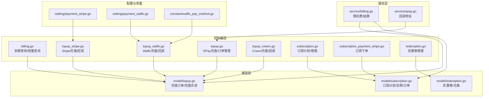

图表来源
- [controller/billing.go:1-109](file://controller/billing.go#L1-L109)
- [controller/topup.go:1-471](file://controller/topup.go#L1-L471)
- [controller/topup_stripe.go:1-427](file://controller/topup_stripe.go#L1-L427)
- [controller/topup_waffo.go:1-381](file://controller/topup_waffo.go#L1-L381)
- [controller/topup_creem.go:1-466](file://controller/topup_creem.go#L1-L466)
- [controller/subscription.go:1-384](file://controller/subscription.go#L1-L384)
- [controller/subscription_payment_stripe.go:1-139](file://controller/subscription_payment_stripe.go#L1-L139)
- [controller/redemption.go:1-188](file://controller/redemption.go#L1-L188)
- [model/topup.go:1-452](file://model/topup.go#L1-L452)
- [model/subscription.go:1-800](file://model/subscription.go#L1-L800)
- [model/redemption.go:1-199](file://model/redemption.go#L1-L199)
- [service/billing.go:1-79](file://service/billing.go#L1-L79)
- [service/epay.go:1-14](file://service/epay.go#L1-L14)
- [setting/payment_stripe.go:1-9](file://setting/payment_stripe.go#L1-L9)
- [setting/payment_waffo.go:1-68](file://setting/payment_waffo.go#L1-L68)
- [constant/waffo_pay_method.go:1-17](file://constant/waffo_pay_method.go#L1-L17)

章节来源
- [controller/billing.go:1-109](file://controller/billing.go#L1-L109)
- [controller/topup.go:1-471](file://controller/topup.go#L1-L471)
- [controller/topup_stripe.go:1-427](file://controller/topup_stripe.go#L1-L427)
- [controller/topup_waffo.go:1-381](file://controller/topup_waffo.go#L1-L381)
- [controller/topup_creem.go:1-466](file://controller/topup_creem.go#L1-L466)
- [controller/subscription.go:1-384](file://controller/subscription.go#L1-L384)
- [controller/subscription_payment_stripe.go:1-139](file://controller/subscription_payment_stripe.go#L1-L139)
- [controller/redemption.go:1-188](file://controller/redemption.go#L1-L188)
- [model/topup.go:1-452](file://model/topup.go#L1-L452)
- [model/subscription.go:1-800](file://model/subscription.go#L1-L800)
- [model/redemption.go:1-199](file://model/redemption.go#L1-L199)
- [service/billing.go:1-79](file://service/billing.go#L1-L79)
- [service/epay.go:1-14](file://service/epay.go#L1-L14)
- [setting/payment_stripe.go:1-9](file://setting/payment_stripe.go#L1-L9)
- [setting/payment_waffo.go:1-68](file://setting/payment_waffo.go#L1-L68)
- [constant/waffo_pay_method.go:1-17](file://constant/waffo_pay_method.go#L1-L17)

## 核心组件
- 余额与用量接口：提供 OpenAI 兼容的订阅与用量查询，支持多种展示类型的额度换算。
- 在线充值：统一入口聚合 EPay、Stripe、Waffo、Creem 多种支付方式，支持最小充值限制、折扣与分组倍率。
- 订阅服务：订阅计划管理、下单、自动续费、配额重置与到期处理。
- 优惠券系统：生成、管理、验证与兑换，支持过期与状态控制。
- 计费会话：预扣费与后结算，支持订阅与钱包两种计费来源的通知与对账。

章节来源
- [controller/billing.go:11-108](file://controller/billing.go#L11-L108)
- [controller/topup.go:25-101](file://controller/topup.go#L25-L101)
- [controller/subscription.go:26-384](file://controller/subscription.go#L26-L384)
- [controller/redemption.go:15-188](file://controller/redemption.go#L15-L188)
- [service/billing.go:17-79](file://service/billing.go#L17-L79)

## 架构总览
计费控制器采用“控制器-模型-服务-配置”的分层架构，支付流程通过回调与订单状态机保证一致性，订阅通过计划缓存与重置策略实现自动化运营。

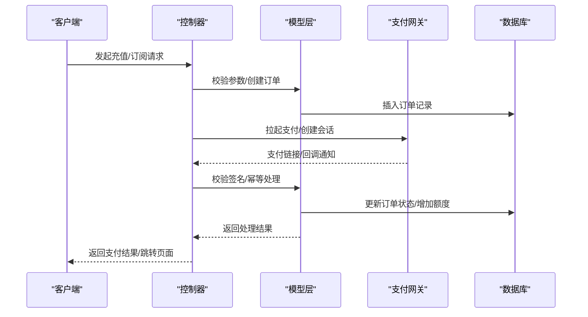

图表来源
- [controller/topup.go:166-239](file://controller/topup.go#L166-L239)
- [controller/topup_stripe.go:68-126](file://controller/topup_stripe.go#L68-L126)
- [controller/topup_waffo.go:103-270](file://controller/topup_waffo.go#L103-L270)
- [controller/topup_creem.go:146-169](file://controller/topup_creem.go#L146-L169)
- [model/topup.go:60-111](file://model/topup.go#L60-L111)
- [model/topup.go:390-451](file://model/topup.go#L390-L451)

## 详细组件分析

### 余额与用量查询
- 订阅查询：根据用户或令牌维度返回可用额度、硬软限额与到期时间，并按展示类型进行换算。
- 用量查询：返回累计用量，支持不同展示类型的换算。

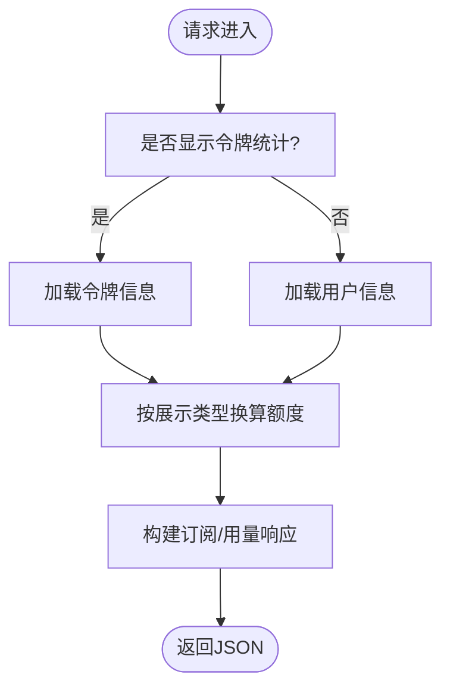

图表来源
- [controller/billing.go:11-69](file://controller/billing.go#L11-L69)
- [controller/billing.go:71-108](file://controller/billing.go#L71-L108)

章节来源
- [controller/billing.go:11-108](file://controller/billing.go#L11-L108)

### 在线充值（EPay）
- 支付方式聚合：动态检测配置，自动注入 Stripe/Waffo 支付方式。
- 金额计算：根据展示类型、分组倍率与预设折扣计算应付金额。
- 最小充值：按展示类型换算最小充值额度。
- 订单创建：生成唯一交易号、记录订单状态为待支付。
- 回调处理：签名验证、幂等处理、状态更新与额度入账。

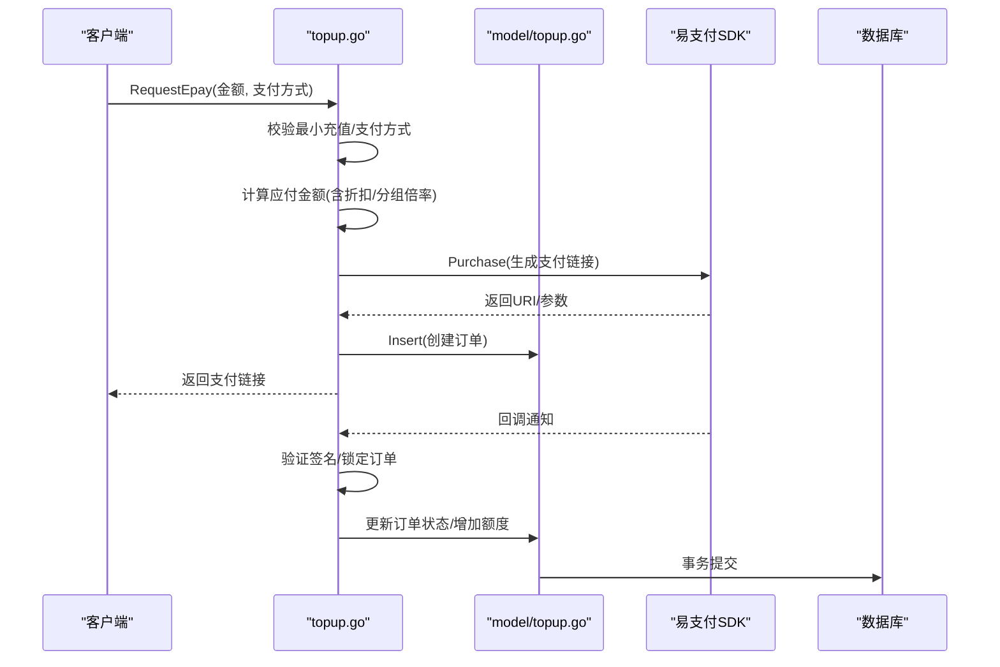

图表来源
- [controller/topup.go:25-101](file://controller/topup.go#L25-L101)
- [controller/topup.go:166-239](file://controller/topup.go#L166-L239)
- [controller/topup.go:283-370](file://controller/topup.go#L283-L370)
- [model/topup.go:60-111](file://model/topup.go#L60-L111)

章节来源
- [controller/topup.go:25-101](file://controller/topup.go#L25-L101)
- [controller/topup.go:166-239](file://controller/topup.go#L166-L239)
- [controller/topup.go:283-370](file://controller/topup.go#L283-L370)
- [model/topup.go:60-111](file://model/topup.go#L60-L111)

### 在线充值（Stripe）
- 金额计算：考虑分组倍率与预设折扣。
- 会话创建：使用 Stripe Checkout Session，支持促销码与自定义回调地址。
- 回调处理：支持完成、过期、异步支付成功/失败事件，幂等处理与额度入账。

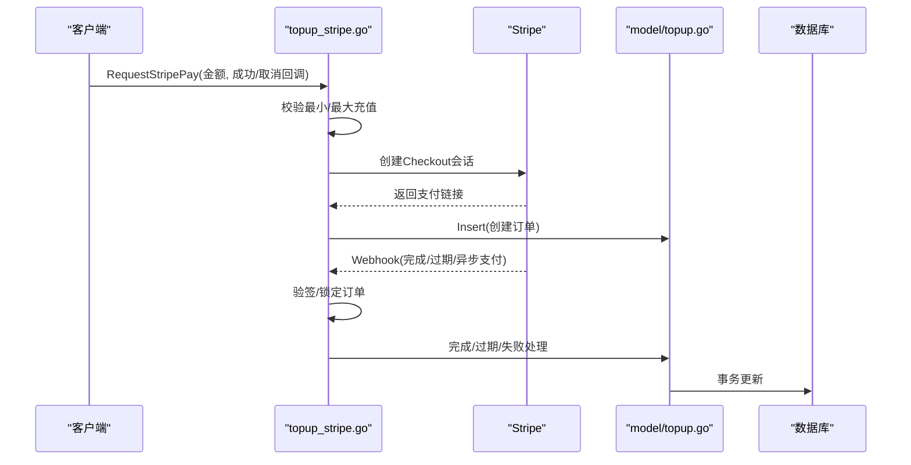

图表来源
- [controller/topup_stripe.go:68-126](file://controller/topup_stripe.go#L68-L126)
- [controller/topup_stripe.go:148-187](file://controller/topup_stripe.go#L148-L187)
- [controller/topup_stripe.go:189-330](file://controller/topup_stripe.go#L189-L330)
- [model/topup.go:60-111](file://model/topup.go#L60-L111)

章节来源
- [controller/topup_stripe.go:68-126](file://controller/topup_stripe.go#L68-L126)
- [controller/topup_stripe.go:148-187](file://controller/topup_stripe.go#L148-L187)
- [controller/topup_stripe.go:189-330](file://controller/topup_stripe.go#L189-L330)
- [model/topup.go:60-111](file://model/topup.go#L60-L111)

### 在线充值（Waffo）
- 支付方式：支持索引或名称映射，零小数币种处理。
- 金额计算：按展示类型换算为 USD，考虑分组倍率与折扣。
- 订单创建：生成商户订单号与支付请求号，回调地址可配置。
- 回调处理：签名验证、状态判断、幂等处理与额度入账。

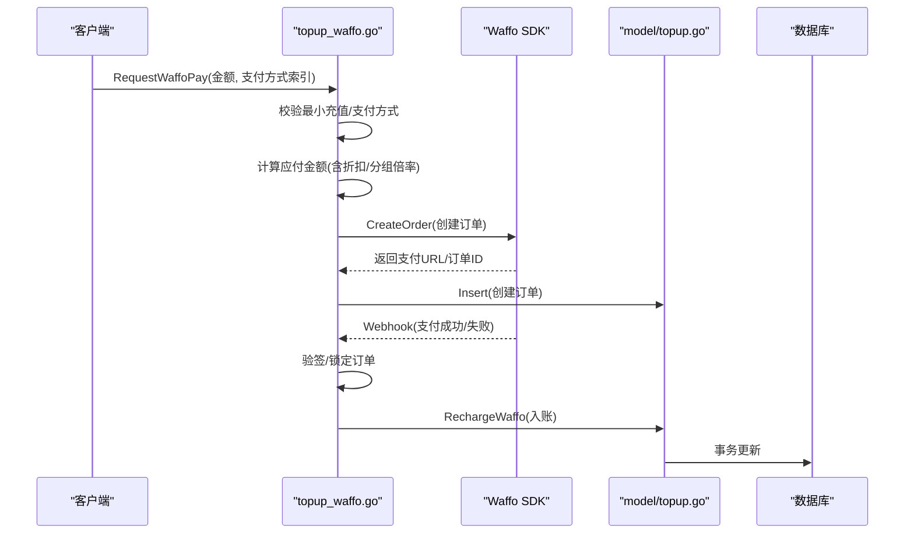

图表来源
- [controller/topup_waffo.go:103-270](file://controller/topup_waffo.go#L103-L270)
- [controller/topup_waffo.go:288-381](file://controller/topup_waffo.go#L288-L381)
- [model/topup.go:390-451](file://model/topup.go#L390-L451)

章节来源
- [controller/topup_waffo.go:103-270](file://controller/topup_waffo.go#L103-L270)
- [controller/topup_waffo.go:288-381](file://controller/topup_waffo.go#L288-L381)
- [model/topup.go:390-451](file://model/topup.go#L390-L451)

### 在线充值（Creem）
- 产品选择：从配置中解析产品列表，按 productId 匹配。
- 金额与额度：产品配置直接决定支付金额与充值额度。
- 回调处理：签名验证、事件类型判断、订单状态校验与入账。

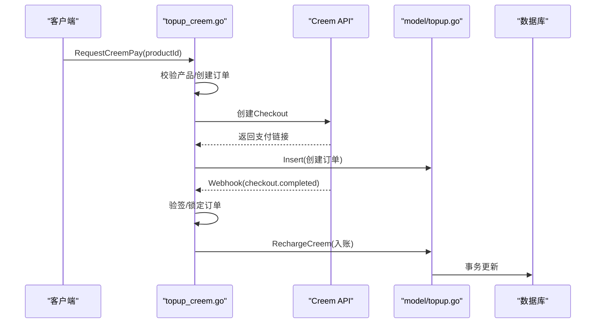

图表来源
- [controller/topup_creem.go:146-169](file://controller/topup_creem.go#L146-L169)
- [controller/topup_creem.go:232-284](file://controller/topup_creem.go#L232-L284)
- [controller/topup_creem.go:286-366](file://controller/topup_creem.go#L286-L366)
- [model/topup.go:315-388](file://model/topup.go#L315-L388)

章节来源
- [controller/topup_creem.go:146-169](file://controller/topup_creem.go#L146-L169)
- [controller/topup_creem.go:232-284](file://controller/topup_creem.go#L232-L284)
- [controller/topup_creem.go:286-366](file://controller/topup_creem.go#L286-L366)
- [model/topup.go:315-388](file://model/topup.go#L315-L388)

### 订阅服务
- 计划管理：启用/禁用、排序、价格、周期、总量、升级分组、配额重置周期等。
- 下单与续费：Stripe 订阅下单，Webhook 完成后创建用户订阅实例。
- 配额重置：按日/周/月/自定义周期重置配额，到期后自动失效。
- 管理操作：管理员绑定、失效、删除订阅，支持分组降级。

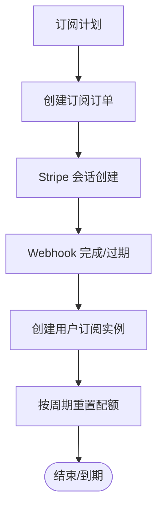

图表来源
- [controller/subscription.go:26-87](file://controller/subscription.go#L26-L87)
- [controller/subscription_payment_stripe.go:24-106](file://controller/subscription_payment_stripe.go#L24-L106)
- [model/subscription.go:508-572](file://model/subscription.go#L508-L572)
- [model/subscription.go:299-347](file://model/subscription.go#L299-L347)
- [model/subscription.go:631-757](file://model/subscription.go#L631-L757)

章节来源
- [controller/subscription.go:26-87](file://controller/subscription.go#L26-L87)
- [controller/subscription_payment_stripe.go:24-106](file://controller/subscription_payment_stripe.go#L24-L106)
- [model/subscription.go:508-572](file://model/subscription.go#L508-L572)
- [model/subscription.go:299-347](file://model/subscription.go#L299-L347)
- [model/subscription.go:631-757](file://model/subscription.go#L631-L757)

### 优惠券系统
- 生成：批量生成唯一兑换码，支持名称、数量、有效期与额度。
- 管理：启用/禁用、编辑、删除无效券。
- 兑换：行级锁保证幂等，更新用户额度与使用记录。

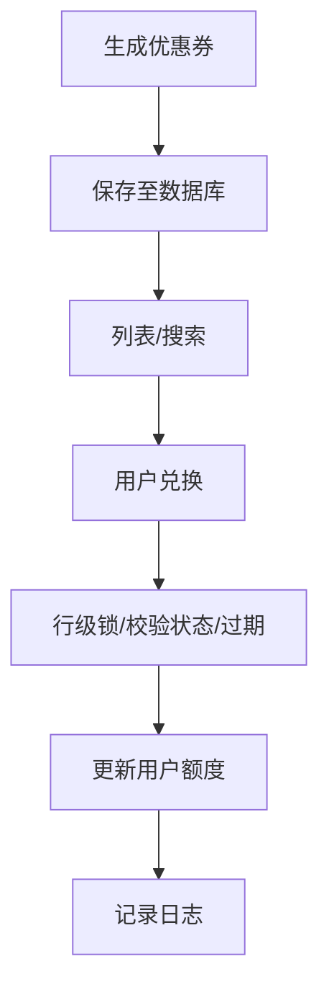

图表来源
- [controller/redemption.go:61-113](file://controller/redemption.go#L61-L113)
- [controller/redemption.go:15-40](file://controller/redemption.go#L15-L40)
- [model/redemption.go:115-156](file://model/redemption.go#L115-L156)

章节来源
- [controller/redemption.go:61-113](file://controller/redemption.go#L61-L113)
- [controller/redemption.go:15-40](file://controller/redemption.go#L15-L40)
- [model/redemption.go:115-156](file://model/redemption.go#L115-L156)

### 计费会话与结算
- 预扣费：根据用户计费偏好创建会话，记录预扣额度。
- 后结算：比较预扣与实际消耗，补扣或返还，支持订阅与钱包两种来源的通知。

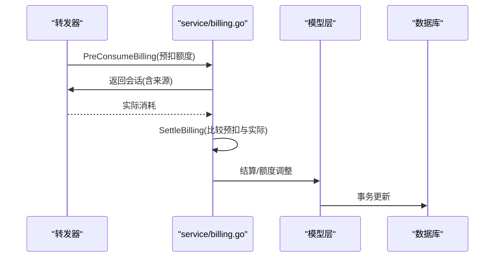

图表来源
- [service/billing.go:17-79](file://service/billing.go#L17-L79)

章节来源
- [service/billing.go:17-79](file://service/billing.go#L17-L79)

## 依赖关系分析
- 控制器依赖模型层进行数据持久化与事务控制，依赖服务层进行计费会话编排。
- 支付网关配置通过设置模块注入，Waffo 支付方式通过常量默认值与运行时配置组合。
- 订阅计划缓存通过混合缓存提升查询性能，避免频繁访问数据库。

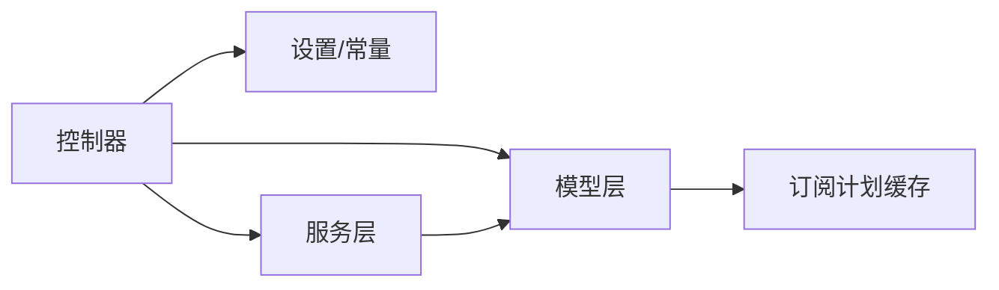

图表来源
- [model/subscription.go:85-125](file://model/subscription.go#L85-L125)
- [setting/payment_stripe.go:1-9](file://setting/payment_stripe.go#L1-L9)
- [setting/payment_waffo.go:27-52](file://setting/payment_waffo.go#L27-L52)
- [constant/waffo_pay_method.go:12-17](file://constant/waffo_pay_method.go#L12-L17)

章节来源
- [model/subscription.go:85-125](file://model/subscription.go#L85-L125)
- [setting/payment_stripe.go:1-9](file://setting/payment_stripe.go#L1-L9)
- [setting/payment_waffo.go:27-52](file://setting/payment_waffo.go#L27-L52)
- [constant/waffo_pay_method.go:12-17](file://constant/waffo_pay_method.go#L12-L17)

## 性能考量
- 订阅计划缓存：通过混合缓存与 TTL 管理，降低数据库压力。
- 分页查询：充值与优惠券列表均采用事务内分页，保证一致性与性能平衡。
- 并发控制：订单级互斥锁（基于 trade_no）避免并发回调导致的重复入账。
- 事务原子性：充值与额度更新在单事务内完成，确保数据一致性。

## 故障排查指南
- EPay 回调失败
  - 现象：回调返回 fail 或未入账
  - 排查：检查签名验证、订单状态、支付方式匹配、最小充值限制
  - 参考：[controller/topup.go:283-370](file://controller/topup.go#L283-L370)
- Stripe Webhook 异常
  - 现象：异步支付失败或过期未处理
  - 排查：确认 webhook 密钥、事件类型、订单状态与锁定逻辑
  - 参考：[controller/topup_stripe.go:148-187](file://controller/topup_stripe.go#L148-L187)
- Waffo 回调签名失败
  - 现象：回调验签失败或订单状态非成功
  - 排查：核对签名算法、回调地址、支付方式映射
  - 参考：[controller/topup_waffo.go:288-381](file://controller/topup_waffo.go#L288-L381)
- Creem 回调签名缺失
  - 现象：测试模式下跳过验签，生产模式缺失签名头
  - 排查：检查 webhook secret 配置与签名头
  - 参考：[controller/topup_creem.go:232-284](file://controller/topup_creem.go#L232-L284)
- 订阅到期/重置异常
  - 现象：到期未失效或重置未生效
  - 排查：核对周期配置、重置边界与结束时间
  - 参考：[model/subscription.go:299-347](file://model/subscription.go#L299-L347)

章节来源
- [controller/topup.go:283-370](file://controller/topup.go#L283-L370)
- [controller/topup_stripe.go:148-187](file://controller/topup_stripe.go#L148-L187)
- [controller/topup_waffo.go:288-381](file://controller/topup_waffo.go#L288-L381)
- [controller/topup_creem.go:232-284](file://controller/topup_creem.go#L232-L284)
- [model/subscription.go:299-347](file://model/subscription.go#L299-L347)

## 结论
计费控制器通过清晰的分层设计与严格的事务与幂等控制，实现了多支付网关的统一接入、订阅的自动化管理与优惠券的可靠兑付。开发者可依据本文档快速理解各模块职责与交互流程，在保证安全与一致性的前提下扩展与维护计费体系。

## 附录
- 支付网关配置项
  - Stripe：API 密钥、Webhook 密钥、价格 ID、单价、最小充值、促销码开关
  - Waffo：启用开关、公私钥证书、沙盒模式、商户号、回调/回跳地址、币种、单价、最小充值、支付方式列表
- 展示类型与换算
  - 支持 USD/CNY/TOKENS 三种展示类型，按配置进行换算与显示

章节来源
- [setting/payment_stripe.go:1-9](file://setting/payment_stripe.go#L1-L9)
- [setting/payment_waffo.go:8-24](file://setting/payment_waffo.go#L8-L24)
- [constant/waffo_pay_method.go:12-17](file://constant/waffo_pay_method.go#L12-L17)
- [controller/billing.go:48-58](file://controller/billing.go#L48-L58)