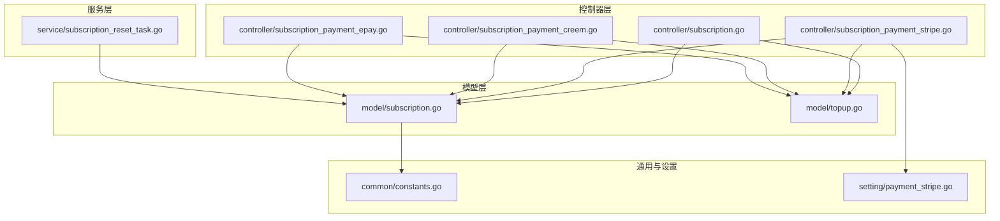
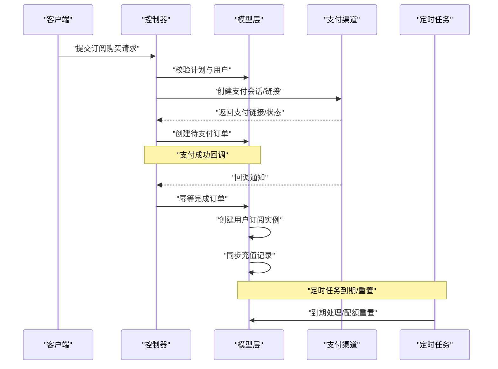
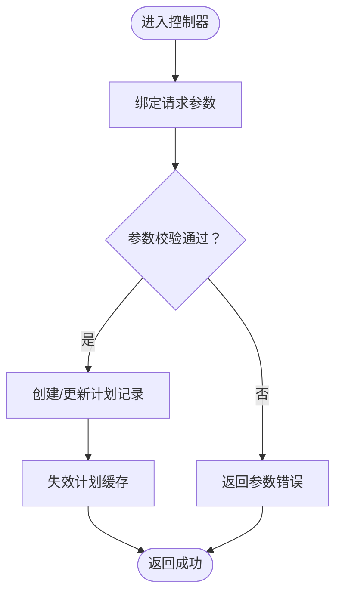
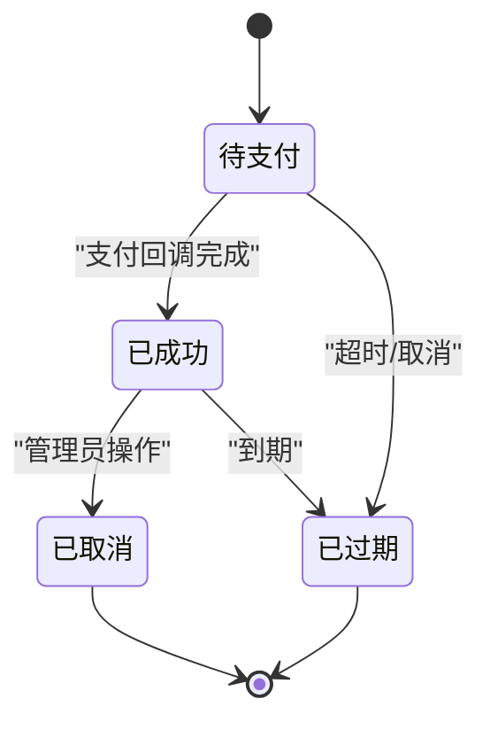
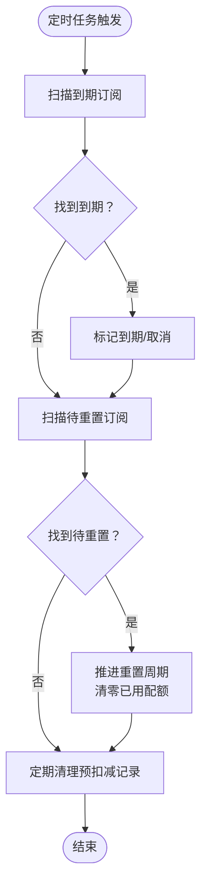
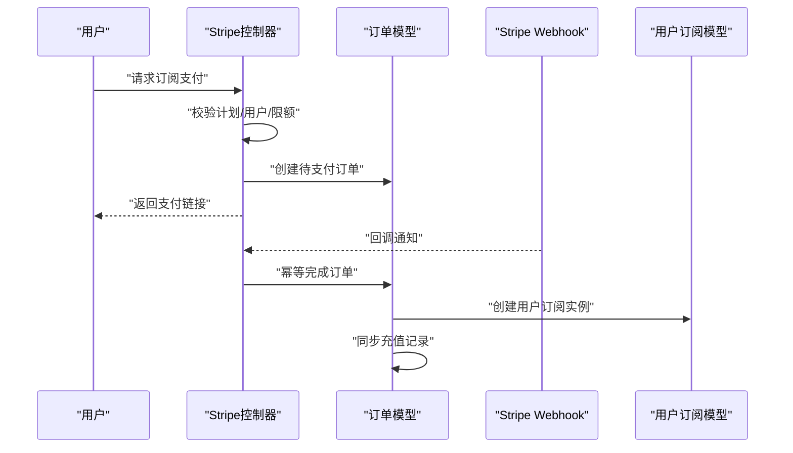
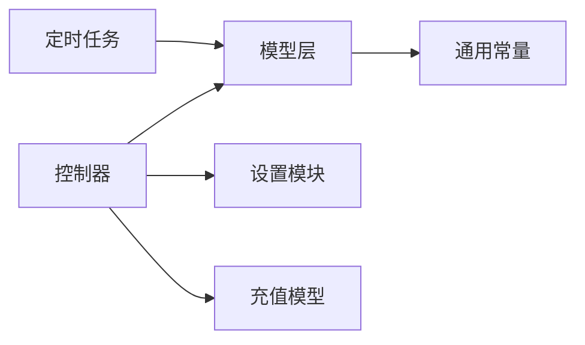

# 订阅管理

<cite>
**本文档引用的文件**
- [controller/subscription.go](file://controller/subscription.go)
- [controller/subscription_payment_stripe.go](file://controller/subscription_payment_stripe.go)
- [controller/subscription_payment_creem.go](file://controller/subscription_payment_creem.go)
- [controller/subscription_payment_epay.go](file://controller/subscription_payment_epay.go)
- [model/subscription.go](file://model/subscription.go)
- [model/topup.go](file://model/topup.go)
- [service/subscription_reset_task.go](file://service/subscription_reset_task.go)
- [common/constants.go](file://common/constants.go)
- [setting/payment_stripe.go](file://setting/payment_stripe.go)
</cite>

## 目录
1. [简介](#简介)
2. [项目结构](#项目结构)
3. [核心组件](#核心组件)
4. [架构总览](#架构总览)
5. [详细组件分析](#详细组件分析)
6. [依赖关系分析](#依赖关系分析)
7. [性能考量](#性能考量)
8. [故障排查指南](#故障排查指南)
9. [结论](#结论)
10. [附录](#附录)

## 简介
本技术文档围绕订阅管理系统进行深入解析，覆盖订阅计划的创建、管理与查询；订阅状态管理、自动续费与配额重置；支付流程、资金来源验证与订阅变更处理；订阅计划配置、定价策略与有效期管理；订阅统计、使用量计算与到期提醒；以及订阅安全机制、防重复支付与异常处理。目标是帮助开发者全面理解订阅管理的完整业务流程与实现细节。

## 项目结构
订阅管理相关模块主要分布在以下层次：
- 控制器层：提供用户与管理员的订阅计划与订单接口，以及多种支付渠道的请求与回调处理。
- 模型层：定义订阅计划、订单、用户订阅实例、预扣减记录等数据结构与核心业务逻辑。
- 服务层：定时任务负责到期与配额重置维护。
- 通用常量与设置：统一状态码、额度单位、支付渠道配置等。

图表来源
- [controller/subscription.go:1-384](file://controller/subscription.go#L1-L384)
- [controller/subscription_payment_stripe.go:1-139](file://controller/subscription_payment_stripe.go#L1-L139)
- [controller/subscription_payment_creem.go:1-130](file://controller/subscription_payment_creem.go#L1-L130)
- [controller/subscription_payment_epay.go:1-217](file://controller/subscription_payment_epay.go#L1-L217)
- [model/subscription.go:1-1193](file://model/subscription.go#L1-L1193)
- [model/topup.go:1-452](file://model/topup.go#L1-L452)
- [service/subscription_reset_task.go:1-94](file://service/subscription_reset_task.go#L1-L94)
- [common/constants.go:1-219](file://common/constants.go#L1-L219)
- [setting/payment_stripe.go:1-9](file://setting/payment_stripe.go#L1-L9)

章节来源
- [controller/subscription.go:1-384](file://controller/subscription.go#L1-L384)
- [model/subscription.go:1-1193](file://model/subscription.go#L1-L1193)

## 核心组件
- 订阅计划（SubscriptionPlan）：定义套餐标题、副标题、价格、货币、有效期单位与值、排序、启用状态、支付渠道标识、购买上限、总配额、配额重置周期与自定义重置秒数等。
- 订阅订单（SubscriptionOrder）：记录支付发起的订单号、用户、计划、金额、支付方式、状态、创建与完成时间、上游回调载荷。
- 用户订阅实例（UserSubscription）：记录用户订阅快照，包含开始/结束时间、状态、来源、上次/下次重置时间、升级/回退用户组、创建/更新时间。
- 预扣减记录（SubscriptionPreConsumeRecord）：幂等性保障，按请求ID记录预扣减额度与状态，配合后置扣减实现“预扣-确认/退款”模式。
- 定时任务（subscription_reset_task）：周期性执行到期与配额重置，清理过期预扣减记录。

章节来源
- [model/subscription.go:144-271](file://model/subscription.go#L144-L271)
- [model/subscription.go:194-208](file://model/subscription.go#L194-L208)
- [model/subscription.go:232-255](file://model/subscription.go#L232-L255)
- [model/subscription.go:906-917](file://model/subscription.go#L906-L917)
- [service/subscription_reset_task.go:29-94](file://service/subscription_reset_task.go#L29-L94)

## 架构总览
订阅管理采用“控制器-模型-服务-设置”的分层架构，支付渠道通过控制器对接Stripe、Creem、Epay等，订单完成后在模型层创建用户订阅实例并同步充值记录。定时任务负责到期与配额重置，确保业务闭环。

图表来源
- [controller/subscription_payment_stripe.go:24-106](file://controller/subscription_payment_stripe.go#L24-L106)
- [controller/subscription_payment_creem.go:21-129](file://controller/subscription_payment_creem.go#L21-L129)
- [controller/subscription_payment_epay.go:25-112](file://controller/subscription_payment_epay.go#L25-L112)
- [model/subscription.go:507-572](file://model/subscription.go#L507-L572)
- [service/subscription_reset_task.go:47-93](file://service/subscription_reset_task.go#L47-L93)

## 详细组件分析

### 订阅计划管理（创建、更新、查询）
- 查询订阅计划：按启用状态与排序返回计划列表，用于前端展示。
- 管理员创建/更新计划：包含标题、价格、货币、有效期单位与值、排序、支付渠道标识、购买上限、总配额、升级分组、配额重置周期与自定义重置秒数等字段的校验与持久化。
- 计划缓存：通过混合缓存（内存+Redis）提升读取性能，变更后主动失效缓存。

图表来源
- [controller/subscription.go:110-166](file://controller/subscription.go#L110-L166)
- [controller/subscription.go:168-255](file://controller/subscription.go#L168-L255)

章节来源
- [controller/subscription.go:26-39](file://controller/subscription.go#L26-L39)
- [controller/subscription.go:91-104](file://controller/subscription.go#L91-L104)
- [controller/subscription.go:110-166](file://controller/subscription.go#L110-L166)
- [controller/subscription.go:168-255](file://controller/subscription.go#L168-L255)
- [model/subscription.go:40-142](file://model/subscription.go#L40-L142)

### 订阅状态管理与生命周期
- 订单状态：pending（待支付）、success（成功）、failed（失败）、expired（过期）。
- 用户订阅状态：active（有效）、expired（已过期）、cancelled（已取消）。
- 生命周期关键节点：创建待支付订单、支付回调完成订单、创建用户订阅实例、到期/取消处理、回退用户组。

图表来源
- [common/constants.go:213-218](file://common/constants.go#L213-L218)
- [model/subscription.go:507-572](file://model/subscription.go#L507-L572)
- [model/subscription.go:714-757](file://model/subscription.go#L714-L757)

章节来源
- [common/constants.go:213-218](file://common/constants.go#L213-L218)
- [model/subscription.go:507-572](file://model/subscription.go#L507-L572)
- [model/subscription.go:714-757](file://model/subscription.go#L714-L757)

### 自动续费与配额重置逻辑
- 有效期计算：支持年、月、日、小时与自定义秒数，结合计划的持续时间单位与值计算结束时间。
- 配额重置周期：支持从不、每日、每周、每月、自定义秒数，按周期计算下次重置时间，支持“先进再重置”的推进式重置。
- 定时任务：每分钟扫描到期与重置任务，批量处理并清理过期预扣减记录。

图表来源
- [service/subscription_reset_task.go:47-93](file://service/subscription_reset_task.go#L47-L93)
- [model/subscription.go:273-297](file://model/subscription.go#L273-L297)
- [model/subscription.go:308-347](file://model/subscription.go#L308-L347)
- [model/subscription.go:1085-1136](file://model/subscription.go#L1085-L1136)

章节来源
- [model/subscription.go:273-297](file://model/subscription.go#L273-L297)
- [model/subscription.go:308-347](file://model/subscription.go#L308-L347)
- [service/subscription_reset_task.go:29-94](file://service/subscription_reset_task.go#L29-L94)

### 支付流程与资金来源验证
- Stripe支付：校验密钥与Webhook密钥、价格ID、用户存在性与购买上限，生成订阅会话链接，创建待支付订单，回调完成订单并创建用户订阅实例。
- Creem支付：校验Webhook密钥或测试模式、产品ID，创建待支付订单，生成支付链接，回调完成订单。
- Epay支付：校验支付方式有效性，生成订单号与回调地址，调用支付网关下单，回调/回跳验证后完成订单。

图表来源
- [controller/subscription_payment_stripe.go:24-106](file://controller/subscription_payment_stripe.go#L24-L106)
- [controller/subscription_payment_stripe.go:108-139](file://controller/subscription_payment_stripe.go#L108-L139)
- [model/subscription.go:507-572](file://model/subscription.go#L507-L572)

章节来源
- [controller/subscription_payment_stripe.go:24-106](file://controller/subscription_payment_stripe.go#L24-L106)
- [controller/subscription_payment_stripe.go:108-139](file://controller/subscription_payment_stripe.go#L108-L139)
- [controller/subscription_payment_creem.go:21-129](file://controller/subscription_payment_creem.go#L21-L129)
- [controller/subscription_payment_epay.go:25-112](file://controller/subscription_payment_epay.go#L25-L112)
- [controller/subscription_payment_epay.go:114-165](file://controller/subscription_payment_epay.go#L114-L165)
- [controller/subscription_payment_epay.go:167-217](file://controller/subscription_payment_epay.go#L167-L217)
- [model/subscription.go:507-572](file://model/subscription.go#L507-L572)

### 订阅变更处理与用户组升降级
- 变更订阅：管理员可绑定订阅（无支付），创建用户订阅实例并按计划升级用户组；取消订阅即时生效并回退用户组。
- 用户组回退：若无其他有效订阅仍在同一升级组内，则回退到之前的用户组并更新缓存。

章节来源
- [model/subscription.go:630-651](file://model/subscription.go#L630-L651)
- [model/subscription.go:714-757](file://model/subscription.go#L714-L757)
- [model/subscription.go:402-435](file://model/subscription.go#L402-L435)

### 订阅统计、使用量计算与到期提醒
- 使用量计算：预扣减（PreConsume）与后置扣减（PostConsume）配合，支持按请求ID幂等处理，避免重复计费。
- 到期提醒：定时任务扫描即将到期与到期的订阅，便于后续扩展到期提醒通知。
- 额度单位：统一使用“额度单位”，通过常量控制美元与额度的换算关系。

章节来源
- [model/subscription.go:955-1057](file://model/subscription.go#L955-L1057)
- [model/subscription.go:1059-1083](file://model/subscription.go#L1059-L1083)
- [service/subscription_reset_task.go:47-93](file://service/subscription_reset_task.go#L47-L93)
- [common/constants.go:22](file://common/constants.go#L22)

### 订阅安全机制与异常处理
- 防重复支付：订单行级锁与幂等完成，确保回调重复到达不会重复入账。
- 参数校验与状态校验：控制器层严格校验参数与计划状态，模型层校验订单状态与购买上限。
- 异常处理：统一返回错误信息，记录日志，必要时回滚事务。

章节来源
- [controller/subscription_payment_stripe.go:156-164](file://controller/subscription_payment_stripe.go#L156-L164)
- [controller/subscription_payment_epay.go:159-164](file://controller/subscription_payment_epay.go#L159-L164)
- [controller/subscription_payment_epay.go:206-215](file://controller/subscription_payment_epay.go#L206-L215)
- [model/subscription.go:507-572](file://model/subscription.go#L507-L572)

## 依赖关系分析
- 控制器依赖模型层完成业务逻辑与数据持久化。
- 支付控制器依赖支付渠道SDK与设置模块（如Stripe密钥）。
- 定时任务依赖模型层的到期与重置方法。
- 通用常量提供额度换算与状态码等跨层共享配置。

图表来源
- [controller/subscription_payment_stripe.go:10-18](file://controller/subscription_payment_stripe.go#L10-L18)
- [setting/payment_stripe.go:1-9](file://setting/payment_stripe.go#L1-L9)
- [service/subscription_reset_task.go:10-15](file://service/subscription_reset_task.go#L10-L15)
- [common/constants.go:22](file://common/constants.go#L22)

章节来源
- [controller/subscription_payment_stripe.go:10-18](file://controller/subscription_payment_stripe.go#L10-L18)
- [setting/payment_stripe.go:1-9](file://setting/payment_stripe.go#L1-L9)
- [service/subscription_reset_task.go:10-15](file://service/subscription_reset_task.go#L10-L15)
- [common/constants.go:22](file://common/constants.go#L22)

## 性能考量
- 计划缓存：混合缓存（内存+Redis）降低查询开销，变更时主动失效，平衡一致性与性能。
- 批量处理：定时任务按批次处理到期与重置，避免长时间阻塞。
- 幂等设计：预扣减记录按请求ID去重，减少重复消费与回滚成本。
- 数据库索引：订单与订阅实例的关键字段建立索引，提升查询与更新效率。

章节来源
- [model/subscription.go:40-142](file://model/subscription.go#L40-L142)
- [service/subscription_reset_task.go:17-21](file://service/subscription_reset_task.go#L17-L21)
- [model/subscription.go:955-1057](file://model/subscription.go#L955-L1057)

## 故障排查指南
- 支付回调失败：检查支付渠道密钥与Webhook配置，确认回调签名验证与订单状态流转。
- 订单重复入账：确认幂等完成逻辑与行级锁，避免重复回调导致的重复创建。
- 配额未重置：检查定时任务运行状态与重置周期计算逻辑，核对订阅实例的下次重置时间。
- 用户组未回退：确认是否存在其他有效订阅仍在同一升级组内，导致不触发回退。

章节来源
- [controller/subscription_payment_stripe.go:156-164](file://controller/subscription_payment_stripe.go#L156-L164)
- [controller/subscription_payment_epay.go:159-164](file://controller/subscription_payment_epay.go#L159-L164)
- [service/subscription_reset_task.go:47-93](file://service/subscription_reset_task.go#L47-L93)
- [model/subscription.go:402-435](file://model/subscription.go#L402-L435)

## 结论
订阅管理系统通过清晰的分层设计与完善的幂等机制，实现了从计划配置、支付到订阅生命周期管理的全链路闭环。定时任务保障了到期与配额重置的自动化，预扣减与后置扣减机制提升了资源利用率与安全性。开发者可据此快速扩展定价策略、支付渠道与到期提醒等功能。

## 附录
- 订阅计划配置要点
  - 有效期单位与值：支持年、月、日、小时与自定义秒数。
  - 购买上限：按用户与计划维度限制购买次数。
  - 升级分组：购买后自动提升用户组，取消时按规则回退。
  - 配额重置：按日、周、月或自定义周期重置已用配额。
- 定价策略与有效期管理
  - 价格与货币：统一以美元计价，货币字段可扩展。
  - 排序与启用：通过排序与启用状态控制展示顺序与可用性。
- 统计与提醒
  - 使用量计算：预扣减+后置扣减，支持退款回退。
  - 到期提醒：定时任务扫描到期订阅，便于扩展通知机制。

章节来源
- [controller/subscription.go:110-166](file://controller/subscription.go#L110-L166)
- [controller/subscription.go:168-255](file://controller/subscription.go#L168-L255)
- [model/subscription.go:273-297](file://model/subscription.go#L273-L297)
- [model/subscription.go:308-347](file://model/subscription.go#L308-L347)
- [model/subscription.go:955-1057](file://model/subscription.go#L955-L1057)
- [service/subscription_reset_task.go:47-93](file://service/subscription_reset_task.go#L47-L93)