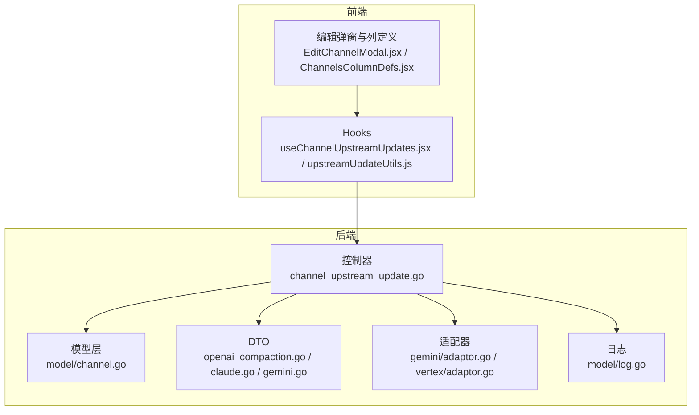
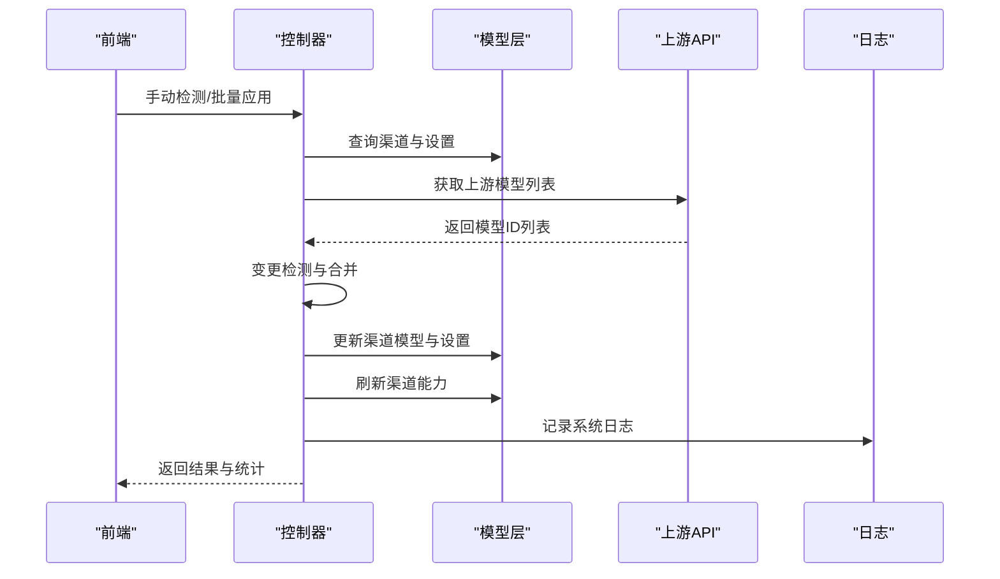
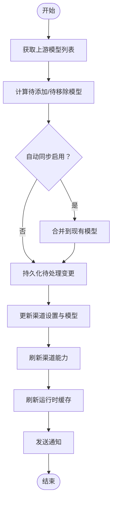
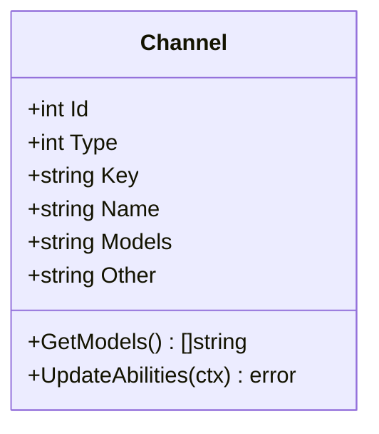
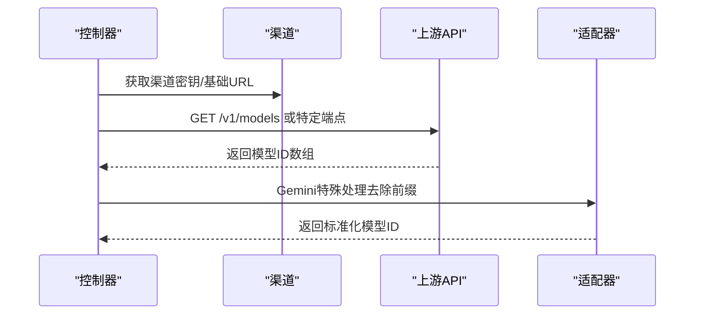
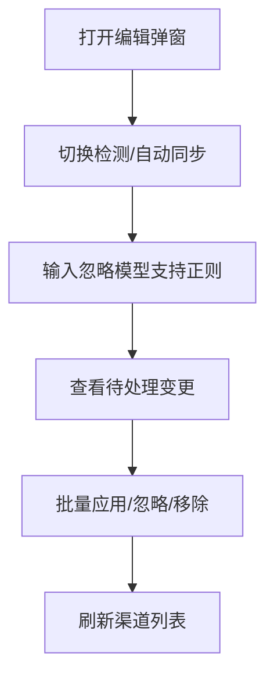
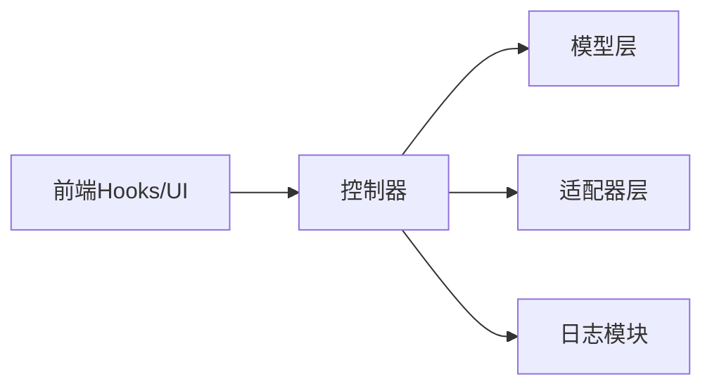

# 上游更新

<cite>
**本文档引用的文件**
- [controller/channel_upstream_update.go](file://controller/channel_upstream_update.go)
- [controller/channel_upstream_update_test.go](file://controller/channel_upstream_update_test.go)
- [model/channel.go](file://model/channel.go)
- [dto/openai_compaction.go](file://dto/openai_compaction.go)
- [dto/claude.go](file://dto/claude.go)
- [dto/gemini.go](file://dto/gemini.go)
- [relay/channel/gemini/adaptor.go](file://relay/relay/channel/gemini/adaptor.go)
- [relay/channel/vertex/adaptor.go](file://relay/relay/channel/vertex/adaptor.go)
- [common/endpoint_defaults.go](file://common/endpoint_defaults.go)
- [web/src/hooks/channels/useChannelUpstreamUpdates.jsx](file://web/src/hooks/channels/useChannelUpstreamUpdates.jsx)
- [web/src/hooks/channels/upstreamUpdateUtils.js](file://web/src/hooks/channels/upstreamUpdateUtils.js)
- [web/src/components/table/channels/modals/EditChannelModal.jsx](file://web/src/components/table/channels/modals/EditChannelModal.jsx)
- [web/src/components/table/channels/ChannelsColumnDefs.jsx](file://web/src/components/table/channels/ChannelsColumnDefs.jsx)
- [model/log.go](file://model/log.go)
</cite>

## 目录
1. [简介](#简介)
2. [项目结构](#项目结构)
3. [核心组件](#核心组件)
4. [架构总览](#架构总览)
5. [详细组件分析](#详细组件分析)
6. [依赖分析](#依赖分析)
7. [性能考虑](#性能考虑)
8. [故障排查指南](#故障排查指南)
9. [结论](#结论)
10. [附录](#附录)

## 简介
本技术文档面向“通道上游更新系统”，聚焦于上游模型同步的实现机制与运维实践。内容覆盖：
- 模型列表获取、变更检测与自动更新流程
- 不同AI服务提供商（OpenAI、Claude、Gemini等）的上游API集成要点
- 触发机制（定时同步、手动触发、事件驱动）
- 数据处理（模型信息解析、格式转换、本地缓存更新）
- 错误处理与回滚策略
- 日志记录与监控
- 配置管理（同步频率、过滤规则、更新策略）

目标是帮助开发者快速理解并维护该系统。

## 项目结构
上游更新系统由后端控制器、模型层、DTO定义、适配器层、前端交互与日志监控共同组成。关键模块如下：
- 控制器：负责定时任务、手动触发、批量应用、通知与缓存刷新
- 模型层：渠道实体、能力更新、密钥轮询与多键模式
- DTO：通用请求/响应结构、模型元数据
- 适配器：各上游渠道的请求构造与响应处理
- 前端：渠道编辑、变更预览、批量操作
- 日志：系统日志与消费日志记录

图表来源
- [controller/channel_upstream_update.go:1-120](file://controller/channel_upstream_update.go#L1-L120)
- [model/channel.go:21-80](file://model/channel.go#L21-L80)
- [dto/openai_compaction.go:1-21](file://dto/openai_compaction.go#L1-L21)
- [dto/claude.go:1-60](file://dto/claude.go#L1-L60)
- [dto/gemini.go:1-60](file://dto/gemini.go#L1-L60)
- [relay/channel/gemini/adaptor.go:1-60](file://relay/channel/gemini/adaptor.go#L1-L60)
- [relay/channel/vertex/adaptor.go:135-185](file://relay/channel/vertex/adaptor.go#L135-L185)
- [web/src/hooks/channels/useChannelUpstreamUpdates.jsx:1-59](file://web/src/hooks/channels/useChannelUpstreamUpdates.jsx#L1-L59)
- [web/src/hooks/channels/upstreamUpdateUtils.js:1-56](file://web/src/hooks/channels/upstreamUpdateUtils.js#L1-L56)
- [web/src/components/table/channels/modals/EditChannelModal.jsx:1788-1810](file://web/src/components/table/channels/modals/EditChannelModal.jsx#L1788-L1810)
- [web/src/components/table/channels/ChannelsColumnDefs.jsx:278-305](file://web/src/components/table/channels/ChannelsColumnDefs.jsx#L278-L305)
- [model/log.go:75-91](file://model/log.go#L75-L91)

章节来源
- [controller/channel_upstream_update.go:1-120](file://controller/channel_upstream_update.go#L1-L120)
- [model/channel.go:21-80](file://model/channel.go#L21-L80)
- [dto/openai_compaction.go:1-21](file://dto/openai_compaction.go#L1-L21)
- [dto/claude.go:1-60](file://dto/claude.go#L1-L60)
- [dto/gemini.go:1-60](file://dto/gemini.go#L1-L60)
- [relay/channel/gemini/adaptor.go:1-60](file://relay/channel/gemini/adaptor.go#L1-L60)
- [relay/channel/vertex/adaptor.go:135-185](file://relay/channel/vertex/adaptor.go#L135-L185)
- [web/src/hooks/channels/useChannelUpstreamUpdates.jsx:1-59](file://web/src/hooks/channels/useChannelUpstreamUpdates.jsx#L1-L59)
- [web/src/hooks/channels/upstreamUpdateUtils.js:1-56](file://web/src/hooks/channels/upstreamUpdateUtils.js#L1-L56)
- [web/src/components/table/channels/modals/EditChannelModal.jsx:1788-1810](file://web/src/components/table/channels/modals/EditChannelModal.jsx#L1788-L1810)
- [web/src/components/table/channels/ChannelsColumnDefs.jsx:278-305](file://web/src/components/table/channels/ChannelsColumnDefs.jsx#L278-L305)
- [model/log.go:75-91](file://model/log.go#L75-L91)

## 核心组件
- 上游模型同步控制器：提供定时任务、手动检测、批量应用、通知与缓存刷新
- 渠道模型与能力：封装渠道实体、密钥轮询、模型映射、能力更新
- DTO与适配器：统一请求/响应结构，适配不同上游渠道
- 前端交互：渠道编辑、变更预览、批量操作
- 日志与监控：系统日志记录与消费日志

章节来源
- [controller/channel_upstream_update.go:340-387](file://controller/channel_upstream_update.go#L340-L387)
- [model/channel.go:196-200](file://model/channel.go#L196-L200)
- [dto/openai_compaction.go:1-21](file://dto/openai_compaction.go#L1-L21)
- [dto/claude.go:206-237](file://dto/claude.go#L206-L237)
- [dto/gemini.go:14-23](file://dto/gemini.go#L14-L23)
- [relay/channel/gemini/adaptor.go:179-190](file://relay/channel/gemini/adaptor.go#L179-L190)
- [relay/channel/vertex/adaptor.go:368-401](file://relay/channel/vertex/adaptor.go#L368-L401)
- [web/src/hooks/channels/useChannelUpstreamUpdates.jsx:41-59](file://web/src/hooks/channels/useChannelUpstreamUpdates.jsx#L41-L59)
- [model/log.go:75-91](file://model/log.go#L75-L91)

## 架构总览
上游更新系统采用“控制器-模型-适配器-前端”的分层架构。控制器负责调度与编排，模型层负责渠道与能力，适配器负责上游API对接，前端负责可视化与交互。

图表来源
- [controller/channel_upstream_update.go:340-387](file://controller/channel_upstream_update.go#L340-L387)
- [controller/channel_upstream_update.go:760-808](file://controller/channel_upstream_update.go#L760-L808)
- [model/channel.go:196-200](file://model/channel.go#L196-L200)
- [model/log.go:75-91](file://model/log.go#L75-L91)

## 详细组件分析

### 组件A：上游模型同步控制器
- 功能职责
  - 定时任务：周期性扫描启用的渠道，检测上游模型变更并持久化
  - 手动触发：针对单个渠道执行检测，返回待处理变更
  - 批量应用：根据用户选择，批量添加/移除/忽略模型，更新渠道模型列表
  - 通知与缓存：变更汇总通知、运行时缓存刷新
- 关键流程
  - 检测流程：获取上游模型列表 → 计算待添加/待移除 → 合并自动同步策略 → 持久化设置
  - 应用流程：交集过滤 → 合并/移除 → 写回渠道模型 → 更新能力 → 刷新缓存
- 并发与节流
  - 分批查询与睡眠间隔，避免瞬时压力
  - 通知抑制窗口，防止频繁重复告警
- 错误处理
  - 检测失败仅持久化时间戳，不影响已有模型
  - 应用失败回滚至原设置，保证一致性

图表来源
- [controller/channel_upstream_update.go:217-229](file://controller/channel_upstream_update.go#L217-L229)
- [controller/channel_upstream_update.go:340-387](file://controller/channel_upstream_update.go#L340-L387)
- [controller/channel_upstream_update.go:760-808](file://controller/channel_upstream_update.go#L760-L808)

章节来源
- [controller/channel_upstream_update.go:217-229](file://controller/channel_upstream_update.go#L217-L229)
- [controller/channel_upstream_update.go:340-387](file://controller/channel_upstream_update.go#L340-L387)
- [controller/channel_upstream_update.go:760-808](file://controller/channel_upstream_update.go#L760-L808)

### 组件B：渠道模型与能力
- 渠道实体
  - 字段：类型、密钥、状态、基础URL、模型列表、其他设置、模型映射等
  - 密钥轮询：多键模式下安全轮询，避免使用失效密钥
- 能力更新
  - 模型变更后调用能力更新接口，确保路由与选择逻辑生效
- 模型映射
  - 支持别名映射，避免上游模型名称变化导致的路由中断

图表来源
- [model/channel.go:21-80](file://model/channel.go#L21-L80)
- [model/channel.go:196-200](file://model/channel.go#L196-L200)

章节来源
- [model/channel.go:21-80](file://model/channel.go#L21-L80)
- [model/channel.go:196-200](file://model/channel.go#L196-L200)

### 组件C：上游API集成（OpenAI、Claude、Gemini）
- OpenAI兼容
  - 通过统一的/v1/models端点获取模型ID列表
  - 对Gemini特殊处理：去除前缀“models/”
- Claude
  - 使用/v1/messages端点
  - 适配器支持请求转换与响应处理
- Gemini
  - 适配器支持聊天、图像生成、嵌入等多场景
  - 自动识别流式与非流式响应

图表来源
- [controller/channel_upstream_update.go:242-327](file://controller/channel_upstream_update.go#L242-L327)
- [relay/channel/gemini/adaptor.go:130-171](file://relay/channel/gemini/adaptor.go#L130-L171)
- [relay/channel/vertex/adaptor.go:135-185](file://relay/channel/vertex/adaptor.go#L135-L185)

章节来源
- [controller/channel_upstream_update.go:242-327](file://controller/channel_upstream_update.go#L242-L327)
- [relay/channel/gemini/adaptor.go:130-171](file://relay/channel/gemini/adaptor.go#L130-L171)
- [relay/channel/vertex/adaptor.go:135-185](file://relay/channel/vertex/adaptor.go#L135-L185)

### 组件D：前端交互与配置
- Hooks
  - 管理弹窗状态、批量操作、防抖与并发控制
- 编辑弹窗
  - 支持开启/关闭检测、自动同步、忽略模型（支持正则）
- 列定义
  - 展示渠道是否支持上游模型检测与当前待处理变更

图表来源
- [web/src/hooks/channels/useChannelUpstreamUpdates.jsx:41-59](file://web/src/hooks/channels/useChannelUpstreamUpdates.jsx#L41-L59)
- [web/src/components/table/channels/modals/EditChannelModal.jsx:1788-1810](file://web/src/components/table/channels/modals/EditChannelModal.jsx#L1788-L1810)
- [web/src/components/table/channels/ChannelsColumnDefs.jsx:278-305](file://web/src/components/table/channels/ChannelsColumnDefs.jsx#L278-L305)
- [web/src/hooks/channels/upstreamUpdateUtils.js:27-56](file://web/src/hooks/channels/upstreamUpdateUtils.js#L27-L56)

章节来源
- [web/src/hooks/channels/useChannelUpstreamUpdates.jsx:41-59](file://web/src/hooks/channels/useChannelUpstreamUpdates.jsx#L41-L59)
- [web/src/components/table/channels/modals/EditChannelModal.jsx:1788-1810](file://web/src/components/table/channels/modals/EditChannelModal.jsx#L1788-L1810)
- [web/src/components/table/channels/ChannelsColumnDefs.jsx:278-305](file://web/src/components/table/channels/ChannelsColumnDefs.jsx#L278-L305)
- [web/src/hooks/channels/upstreamUpdateUtils.js:27-56](file://web/src/hooks/channels/upstreamUpdateUtils.js#L27-L56)

## 依赖分析
- 控制器依赖模型层进行渠道查询与设置更新
- 控制器依赖适配器层获取上游模型列表
- 前端通过Hooks与控制器交互，读取渠道设置与变更元数据
- 日志模块提供系统级日志记录

图表来源
- [controller/channel_upstream_update.go:1-23](file://controller/channel_upstream_update.go#L1-L23)
- [model/channel.go:1-20](file://model/channel.go#L1-L20)
- [model/log.go:75-91](file://model/log.go#L75-L91)

章节来源
- [controller/channel_upstream_update.go:1-23](file://controller/channel_upstream_update.go#L1-L23)
- [model/channel.go:1-20](file://model/channel.go#L1-L20)
- [model/log.go:75-91](file://model/log.go#L75-L91)

## 性能考虑
- 分批处理：按批次查询渠道，避免一次性加载过多数据
- 请求间隔：在批次间插入睡眠，降低上游压力
- 缓存刷新：仅在必要时刷新运行时缓存，减少重建成本
- 通知抑制：24小时窗口内去重，避免频繁告警

章节来源
- [controller/channel_upstream_update.go:520-588](file://controller/channel_upstream_update.go#L520-L588)
- [controller/channel_upstream_update.go:605-629](file://controller/channel_upstream_update.go#L605-L629)

## 故障排查指南
- 常见问题
  - 上游API不可达：检测阶段仅记录时间戳，不影响现有模型
  - 应用阶段失败：回滚至原设置，保持渠道可用
  - 通知风暴：检查通知抑制窗口配置
- 排查步骤
  - 查看系统日志中的上游模型更新任务与失败渠道
  - 在前端确认渠道设置（检测开关、自动同步、忽略模型）
  - 核对上游密钥与基础URL配置
- 监控建议
  - 关注任务完成统计与失败计数
  - 结合消费日志定位异常请求

章节来源
- [controller/channel_upstream_update.go:532-538](file://controller/channel_upstream_update.go#L532-L538)
- [controller/channel_upstream_update.go:554-558](file://controller/channel_upstream_update.go#L554-L558)
- [model/log.go:75-91](file://model/log.go#L75-L91)

## 结论
上游更新系统通过清晰的分层设计与完善的错误处理，实现了对多渠道、多上游模型的自动化同步。配合前端可视化与通知机制，既保障了稳定性，也提升了可观测性。建议在生产环境中合理配置同步频率与忽略规则，并持续关注上游API变更与适配器兼容性。

## 附录

### 触发机制
- 定时同步：后台任务按固定间隔扫描启用渠道
- 手动触发：针对单个渠道执行检测
- 批量应用：根据用户选择批量应用或忽略变更

章节来源
- [controller/channel_upstream_update.go:632-661](file://controller/channel_upstream_update.go#L632-L661)
- [controller/channel_upstream_update.go:716-758](file://controller/channel_upstream_update.go#L716-L758)
- [controller/channel_upstream_update.go:663-714](file://controller/channel_upstream_update.go#L663-L714)

### 数据处理与格式转换
- 模型ID解析：统一标准化处理，去除前后空格与重复项
- 格式转换：Gemini特殊前缀处理，OpenAI兼容端点
- 本地缓存：模型变更后刷新渠道能力与运行时缓存

章节来源
- [controller/channel_upstream_update.go:77-127](file://controller/channel_upstream_update.go#L77-L127)
- [controller/channel_upstream_update.go:319-326](file://controller/channel_upstream_update.go#L319-L326)
- [controller/channel_upstream_update.go:389-401](file://controller/channel_upstream_update.go#L389-L401)

### 配置管理
- 同步频率：环境变量控制任务间隔
- 过滤规则：忽略模型（支持正则）
- 更新策略：自动同步与手动确认并存

章节来源
- [controller/channel_upstream_update.go:642-649](file://controller/channel_upstream_update.go#L642-L649)
- [web/src/components/table/channels/modals/EditChannelModal.jsx:1788-1810](file://web/src/components/table/channels/modals/EditChannelModal.jsx#L1788-L1810)
- [web/src/hooks/channels/upstreamUpdateUtils.js:27-56](file://web/src/hooks/channels/upstreamUpdateUtils.js#L27-L56)