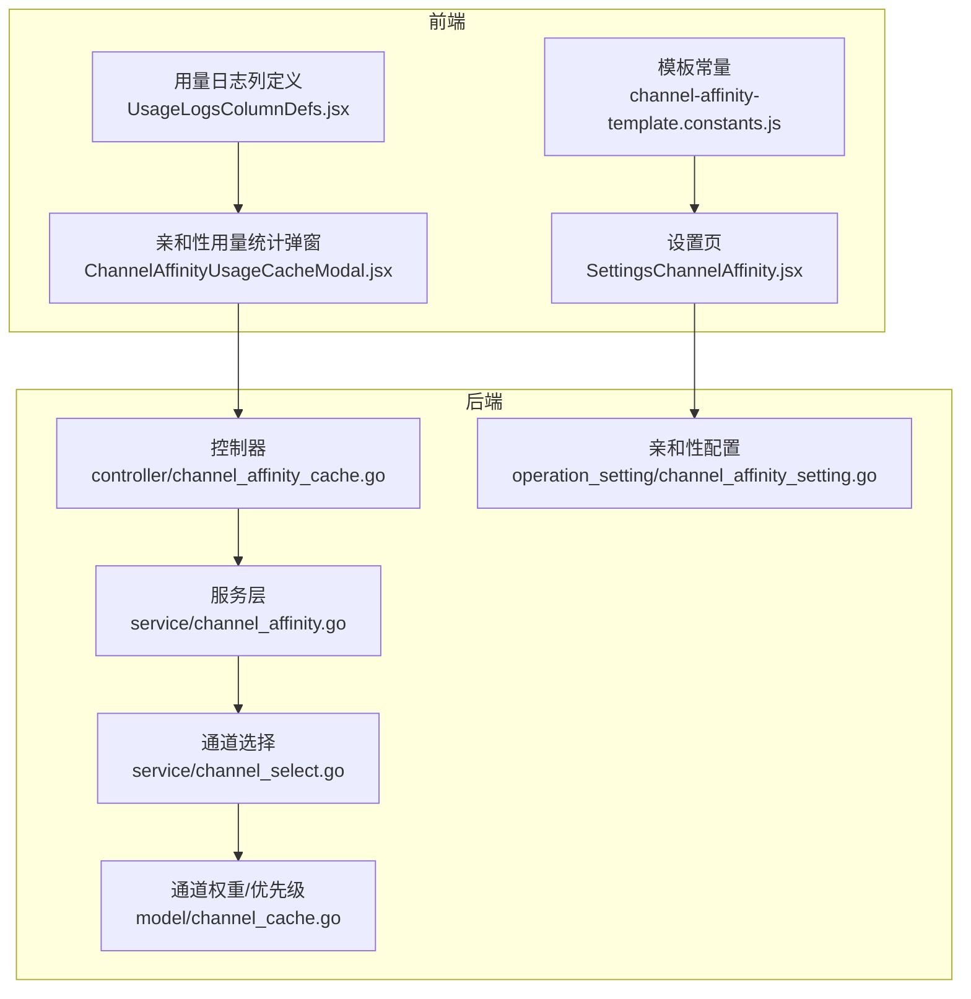
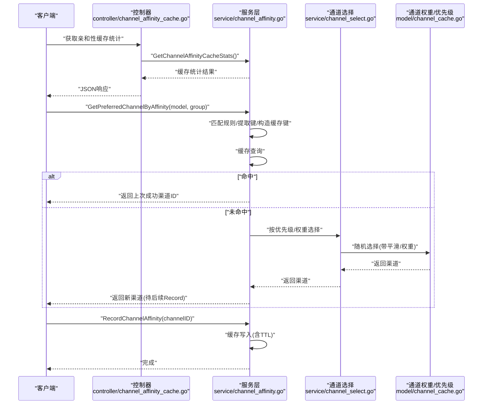
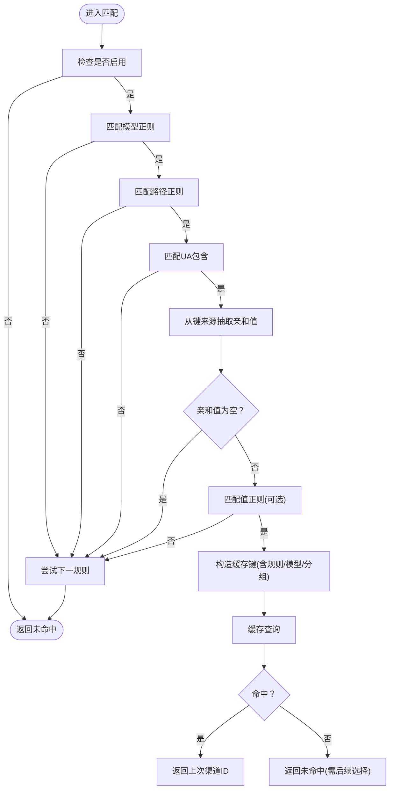
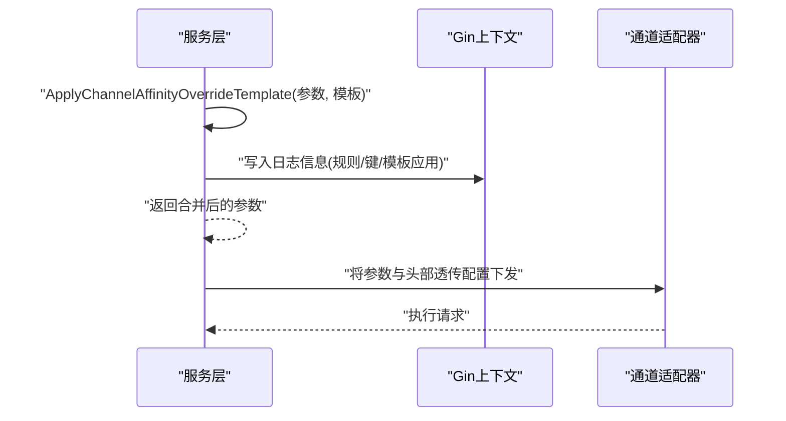
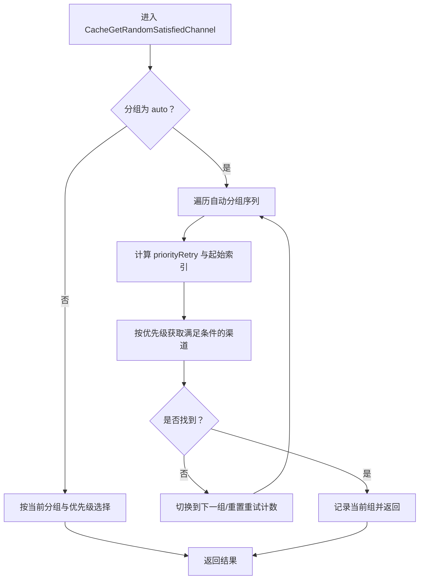
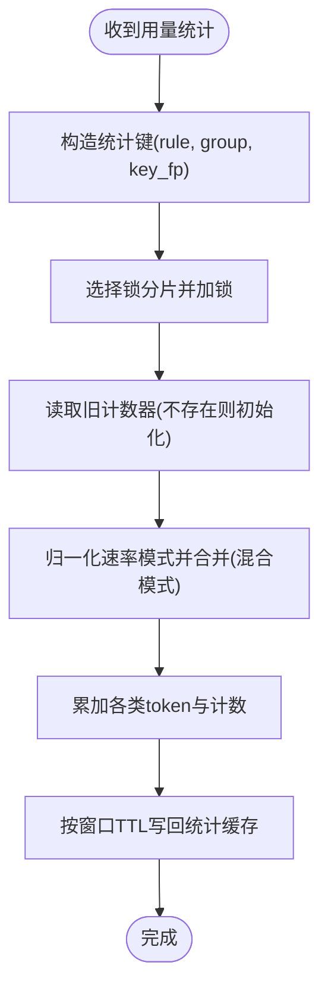
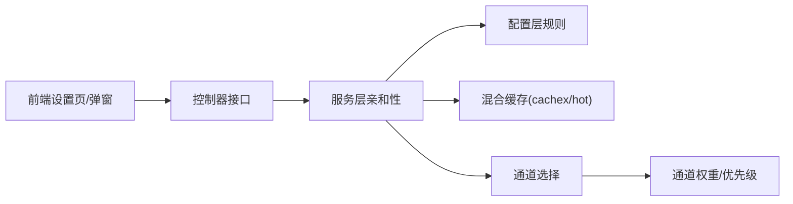
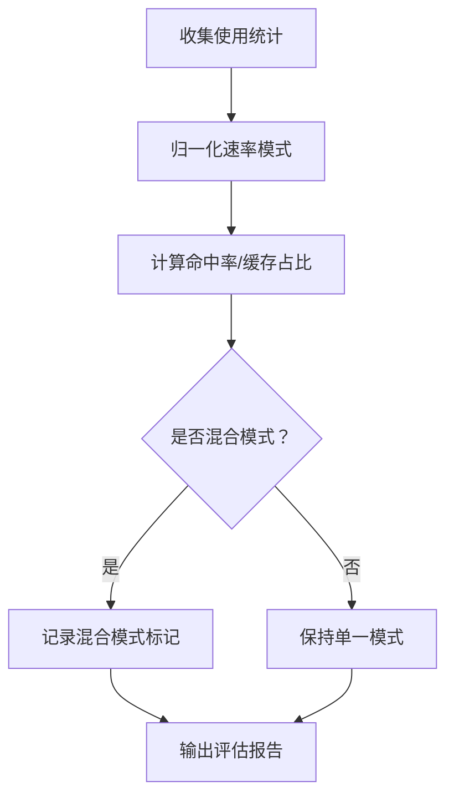

# 通道亲和性

<cite>
**本文引用的文件**
- [service/channel_affinity.go](file://service/channel_affinity.go)
- [controller/channel_affinity_cache.go](file://controller/channel_affinity_cache.go)
- [setting/operation_setting/channel_affinity_setting.go](file://setting/operation_setting/channel_affinity_setting.go)
- [web/src/constants/channel-affinity-template.constants.js](file://web/src/constants/channel-affinity-template.constants.js)
- [service/channel_affinity_template_test.go](file://service/channel_affinity_template_test.go)
- [service/channel_affinity_usage_cache_test.go](file://service/channel_affinity_usage_cache_test.go)
- [service/channel_select.go](file://service/channel_select.go)
- [model/channel_cache.go](file://model/channel_cache.go)
- [web/src/pages/Setting/Operation/SettingsChannelAffinity.jsx](file://web/src/pages/Setting/Operation/SettingsChannelAffinity.jsx)
- [web/src/components/table/usage-logs/UsageLogsColumnDefs.jsx](file://web/src/components/table/usage-logs/UsageLogsColumnDefs.jsx)
- [web/src/components/table/usage-logs/modals/ChannelAffinityUsageCacheModal.jsx](file://web/src/components/table/usage-logs/modals/ChannelAffinityUsageCacheModal.jsx)
- [controller/channel_affinity_cache.go](file://controller/channel_affinity_cache.go)
- [middleware/stats.go](file://middleware/stats.go)
</cite>

## 目录
1. [简介](#简介)
2. [项目结构](#项目结构)
3. [核心组件](#核心组件)
4. [架构总览](#架构总览)
5. [详细组件分析](#详细组件分析)
6. [依赖关系分析](#依赖关系分析)
7. [性能考量](#性能考量)
8. [故障排查指南](#故障排查指南)
9. [结论](#结论)
10. [附录](#附录)

## 简介
本技术文档围绕“通道亲和性”系统进行深入解析，目标是帮助开发者全面理解其设计理念、实现机制与优化策略。系统通过“规则匹配 + 键提取 + 缓存命中 + 参数模板覆盖”的闭环，实现对同一用户/请求特征的“粘滞选路”，提升稳定性与资源利用率。文档涵盖以下主题：
- 用户偏好学习与通道选择策略
- 亲和性缓存的实现、策略与一致性
- 亲和性评分与动态调整（基于使用模式）
- 与智能路由的集成与监控评估
- 配置管理与参数调优

## 项目结构
通道亲和性相关代码主要分布在如下模块：
- 后端服务层：service/channel_affinity.go 实现亲和性匹配、缓存与使用统计
- 控制器层：controller/channel_affinity_cache.go 提供缓存统计与清理接口
- 配置层：setting/operation_setting/channel_affinity_setting.go 定义规则与默认参数
- 前端常量与设置页：web/* 提供规则模板与可视化配置界面
- 测试：service/*_template_test.go 与 service/*_usage_cache_test.go 验证关键行为
- 通道选择与权重：service/channel_select.go 与 model/channel_cache.go 支持智能路由



**图表来源**
- [controller/channel_affinity_cache.go:1-89](file://controller/channel_affinity_cache.go#L1-L89)
- [service/channel_affinity.go:1-120](file://service/channel_affinity.go#L1-L120)
- [service/channel_select.go:1-163](file://service/channel_select.go#L1-L163)
- [model/channel_cache.go:139-180](file://model/channel_cache.go#L139-L180)
- [setting/operation_setting/channel_affinity_setting.go:1-122](file://setting/operation_setting/channel_affinity_setting.go#L1-L122)
- [web/src/pages/Setting/Operation/SettingsChannelAffinity.jsx:17-1103](file://web/src/pages/Setting/Operation/SettingsChannelAffinity.jsx#L17-L1103)
- [web/src/constants/channel-affinity-template.constants.js:1-91](file://web/src/constants/channel-affinity-template.constants.js#L1-L91)
- [web/src/components/table/usage-logs/UsageLogsColumnDefs.jsx:58-94](file://web/src/components/table/usage-logs/UsageLogsColumnDefs.jsx#L58-L94)
- [web/src/components/table/usage-logs/modals/ChannelAffinityUsageCacheModal.jsx:42-241](file://web/src/components/table/usage-logs/modals/ChannelAffinityUsageCacheModal.jsx#L42-L241)

**章节来源**
- [service/channel_affinity.go:1-120](file://service/channel_affinity.go#L1-L120)
- [controller/channel_affinity_cache.go:1-89](file://controller/channel_affinity_cache.go#L1-L89)
- [setting/operation_setting/channel_affinity_setting.go:1-122](file://setting/operation_setting/channel_affinity_setting.go#L1-L122)
- [web/src/pages/Setting/Operation/SettingsChannelAffinity.jsx:17-1103](file://web/src/pages/Setting/Operation/SettingsChannelAffinity.jsx#L17-L1103)
- [web/src/constants/channel-affinity-template.constants.js:1-91](file://web/src/constants/channel-affinity-template.constants.js#L1-L91)
- [web/src/components/table/usage-logs/UsageLogsColumnDefs.jsx:58-94](file://web/src/components/table/usage-logs/UsageLogsColumnDefs.jsx#L58-L94)
- [web/src/components/table/usage-logs/modals/ChannelAffinityUsageCacheModal.jsx:42-241](file://web/src/components/table/usage-logs/modals/ChannelAffinityUsageCacheModal.jsx#L42-L241)

## 核心组件
- 亲和性规则与配置：定义模型/路径/User-Agent 匹配条件、键来源、TTL、模板与开关
- 亲和性匹配与缓存：从请求中抽取键值，构建缓存键，查询/写入亲和性缓存，记录使用统计
- 参数模板覆盖：根据规则将模板合并到通道参数，支持运行时头部透传等操作
- 通道选择与权重：在自动分组/优先级/权重基础上进行随机选择，支持跨组重试
- 监控与可视化：缓存统计接口、用量统计弹窗、日志列提示

**章节来源**
- [setting/operation_setting/channel_affinity_setting.go:11-36](file://setting/operation_setting/channel_affinity_setting.go#L11-L36)
- [service/channel_affinity.go:545-619](file://service/channel_affinity.go#L545-L619)
- [service/channel_affinity.go:740-840](file://service/channel_affinity.go#L740-L840)
- [service/channel_select.go:48-163](file://service/channel_select.go#L48-L163)
- [model/channel_cache.go:139-180](file://model/channel_cache.go#L139-L180)

## 架构总览
通道亲和性贯穿“请求进入 -> 规则匹配 -> 键提取 -> 缓存查询 -> 通道选择 -> 成功记录 -> 使用统计”的链路。



**图表来源**
- [controller/channel_affinity_cache.go:11-88](file://controller/channel_affinity_cache.go#L11-L88)
- [service/channel_affinity.go:545-703](file://service/channel_affinity.go#L545-L703)
- [service/channel_select.go:48-163](file://service/channel_select.go#L48-L163)
- [model/channel_cache.go:139-180](file://model/channel_cache.go#L139-L180)

## 详细组件分析

### 1) 亲和性规则与配置
- 规则字段：名称、模型正则、路径正则、UA包含、键来源、值正则、TTL、模板、是否跳过失败重试、是否包含分组/模型名/规则名
- 默认配置：内置两条规则用于 CLI 场景，分别针对不同模型族与请求路径，携带头部透传模板
- 前端模板常量：提供与后端一致的模板字面量，便于可视化编辑与校验

```mermaid
classDiagram
class ChannelAffinityRule {
+string name
+[]string model_regex
+[]string path_regex
+[]string user_agent_include
+[]ChannelAffinityKeySource key_sources
+string value_regex
+int ttl_seconds
+map[string]interface{} param_override_template
+bool skip_retry_on_failure
+bool include_using_group
+bool include_model_name
+bool include_rule_name
}
class ChannelAffinityKeySource {
+string type
+string key
+string path
}
class ChannelAffinitySetting {
+bool enabled
+bool switch_on_success
+int max_entries
+int default_ttl_seconds
+[]ChannelAffinityRule rules
}
ChannelAffinitySetting --> ChannelAffinityRule : "包含"
ChannelAffinityRule --> ChannelAffinityKeySource : "使用"
```

**图表来源**
- [setting/operation_setting/channel_affinity_setting.go:5-36](file://setting/operation_setting/channel_affinity_setting.go#L5-L36)

**章节来源**
- [setting/operation_setting/channel_affinity_setting.go:76-122](file://setting/operation_setting/channel_affinity_setting.go#L76-L122)
- [web/src/constants/channel-affinity-template.constants.js:20-91](file://web/src/constants/channel-affinity-template.constants.js#L20-L91)

### 2) 亲和性匹配与缓存
- 匹配流程：按规则顺序匹配模型/路径/UA；从键来源抽取亲和值；可选值正则过滤；构造缓存键后查询
- 缓存键构成：可包含规则名/模型名/分组/亲和值，具体取决于规则开关
- 缓存实现：混合缓存（内存LRU + Redis），支持容量、TTL、算法查询与统计
- 失效与清理：支持按规则名前缀删除、全量删除；统计接口可按命名空间聚合



**图表来源**
- [service/channel_affinity.go:545-619](file://service/channel_affinity.go#L545-L619)
- [service/channel_affinity.go:332-345](file://service/channel_affinity.go#L332-L345)

**章节来源**
- [service/channel_affinity.go:545-619](file://service/channel_affinity.go#L545-L619)
- [service/channel_affinity.go:81-109](file://service/channel_affinity.go#L81-L109)
- [controller/channel_affinity_cache.go:11-60](file://controller/channel_affinity_cache.go#L11-L60)

### 3) 参数模板覆盖与运行时头部透传
- 模板合并：将规则模板与现有参数合并，特殊处理 operations 字段（追加而非覆盖）
- 运行时头部透传：通过模板将指定头部原样透传至上游，避免重复配置
- 日志增强：在管理日志中记录模板应用情况与亲和键信息



**图表来源**
- [service/channel_affinity.go:527-543](file://service/channel_affinity.go#L527-L543)
- [service/channel_affinity_template_test.go:37-117](file://service/channel_affinity_template_test.go#L37-L117)

**章节来源**
- [service/channel_affinity.go:527-543](file://service/channel_affinity.go#L527-L543)
- [service/channel_affinity_template_test.go:179-247](file://service/channel_affinity_template_test.go#L179-L247)

### 4) 通道选择与权重/优先级
- 自动分组与跨组重试：在“auto”分组下，按优先级递增，若当前组耗尽则切换到下一组
- 权重与平滑：当平均权重过低或总权重为0时引入平滑因子，保证随机选择的公平性
- 与亲和性的衔接：亲和命中直接返回渠道ID，未命中则走通道选择逻辑



**图表来源**
- [service/channel_select.go:48-163](file://service/channel_select.go#L48-L163)
- [model/channel_cache.go:139-180](file://model/channel_cache.go#L139-L180)

**章节来源**
- [service/channel_select.go:48-163](file://service/channel_select.go#L48-L163)
- [model/channel_cache.go:139-180](file://model/channel_cache.go#L139-L180)

### 5) 亲和性使用统计与缓存
- 统计维度：命中/总数、窗口秒数、prompt/completion/总token、缓存token、prompt缓存命中token、最后出现时间
- 缓存键：规则名 + 分组 + 键指纹，采用锁分片避免并发竞争
- 速率模式：根据上游格式推断缓存token统计口径（如 Claude 使用“缓存/(prompt+cached)”）
- 可视化：前端弹窗支持按规则名/分组/键指纹查询并展示统计



**图表来源**
- [service/channel_affinity.go:793-840](file://service/channel_affinity.go#L793-L840)
- [service/channel_affinity.go:866-874](file://service/channel_affinity.go#L866-L874)
- [service/channel_affinity.go:929-967](file://service/channel_affinity.go#L929-L967)

**章节来源**
- [service/channel_affinity.go:705-791](file://service/channel_affinity.go#L705-L791)
- [service/channel_affinity.go:842-864](file://service/channel_affinity.go#L842-L864)
- [service/channel_affinity_usage_cache_test.go:28-105](file://service/channel_affinity_usage_cache_test.go#L28-L105)
- [web/src/components/table/usage-logs/modals/ChannelAffinityUsageCacheModal.jsx:42-123](file://web/src/components/table/usage-logs/modals/ChannelAffinityUsageCacheModal.jsx#L42-L123)

### 6) 配置管理与策略定制
- 后端配置项：启用开关、成功后切换亲和、最大条目数、默认TTL、规则列表
- 前端设置页：提供表单编辑规则、模板、正则表达式、UA包含、TTL等；支持从模板常量快速填充
- 控制器接口：提供缓存统计与清理接口，支持按规则名或全量清理

**章节来源**
- [setting/operation_setting/channel_affinity_setting.go:30-36](file://setting/operation_setting/channel_affinity_setting.go#L30-L36)
- [web/src/pages/Setting/Operation/SettingsChannelAffinity.jsx:63-1103](file://web/src/pages/Setting/Operation/SettingsChannelAffinity.jsx#L63-L1103)
- [controller/channel_affinity_cache.go:11-88](file://controller/channel_affinity_cache.go#L11-L88)

## 依赖关系分析
- 服务层依赖配置层（规则与默认参数）、通用缓存库（cachex + hot）、JSON解析库（gjson）
- 控制器依赖服务层导出的统计与清理函数
- 前端设置页依赖模板常量与API接口
- 通道选择依赖模型层的优先级/权重实现



**图表来源**
- [service/channel_affinity.go:1-20](file://service/channel_affinity.go#L1-L20)
- [controller/channel_affinity_cache.go:1-18](file://controller/channel_affinity_cache.go#L1-L18)
- [service/channel_select.go:1-12](file://service/channel_select.go#L1-L12)
- [model/channel_cache.go:139-180](file://model/channel_cache.go#L139-L180)

**章节来源**
- [service/channel_affinity.go:1-20](file://service/channel_affinity.go#L1-L20)
- [controller/channel_affinity_cache.go:1-18](file://controller/channel_affinity_cache.go#L1-L18)
- [service/channel_select.go:1-12](file://service/channel_select.go#L1-L12)
- [model/channel_cache.go:139-180](file://model/channel_cache.go#L139-L180)

## 性能考量
- 缓存策略
  - 内存缓存：LRU + TTL + 清理器，容量与TTL来自配置，默认容量10万，TTL默认1小时
  - Redis缓存：可选启用，作为分布式缓存层，降低跨节点一致性成本
- 锁分片：统计缓存采用64把锁分片，降低热点键并发写入冲突
- 正则缓存：对规则中的正则表达式进行本地缓存，避免重复编译
- 平滑因子：在权重极低或为0时引入平滑，保证随机选择的稳定性
- 请求路径优化：键来源支持 gjson 直接从请求体提取，减少不必要的解析开销

**章节来源**
- [service/channel_affinity.go:81-109](file://service/channel_affinity.go#L81-L109)
- [service/channel_affinity.go:929-967](file://service/channel_affinity.go#L929-L967)
- [service/channel_affinity.go:248-270](file://service/channel_affinity.go#L248-L270)
- [model/channel_cache.go:162-174](file://model/channel_cache.go#L162-L174)

## 故障排查指南
- 缓存统计异常
  - 症状：统计接口返回空或计数异常
  - 排查：确认规则名/键指纹参数是否正确；检查缓存键前缀与规则开关；查看服务端日志中的错误信息
- 缓存清理无效
  - 症状：按规则名清理后仍有残留
  - 排查：确认规则是否启用 include_rule_name；核对规则名大小写与拼写
- 亲和未生效
  - 症状：请求未命中亲和缓存
  - 排查：检查模型/路径/UA正则是否匹配；确认键来源是否存在且非空；验证值正则是否过滤掉亲和值
- 参数模板未生效
  - 症状：头部透传未生效或被覆盖
  - 排查：确认模板中 operations 的 mode/value 是否正确；合并逻辑会保留已有参数，仅追加模板中的 operations
- 使用统计不显示
  - 症状：弹窗无法展示统计
  - 排查：确认请求路径与 relay format 是否支持缓存token统计；检查 key_fp 是否正确

**章节来源**
- [controller/channel_affinity_cache.go:20-60](file://controller/channel_affinity_cache.go#L20-L60)
- [service/channel_affinity_template_test.go:179-247](file://service/channel_affinity_template_test.go#L179-L247)
- [web/src/components/table/usage-logs/modals/ChannelAffinityUsageCacheModal.jsx:90-123](file://web/src/components/table/usage-logs/modals/ChannelAffinityUsageCacheModal.jsx#L90-L123)

## 结论
通道亲和性系统通过“规则 + 键 + 缓存 + 模板 + 选择”的闭环设计，在保障稳定性的同时提升了资源利用效率。其混合缓存、锁分片统计、正则缓存与权重平滑等机制共同构成了高可用、可观测的亲和性基础设施。配合前端可视化配置与弹窗统计，开发者可以高效地调试与优化策略。

## 附录

### A. 关键流程图：亲和性评分与动态调整
- 评分维度：命中率、缓存token占比、prompt/completion/总token趋势
- 动态调整：根据统计口径（OpenAI/Claude）自动归一化速率模式；混合模式用于多格式共存场景
- 个性化建议：结合 UA/路径/模型正则与键来源分布，持续优化规则开关与模板



**图表来源**
- [service/channel_affinity.go:842-864](file://service/channel_affinity.go#L842-L864)
- [service/channel_affinity.go:793-840](file://service/channel_affinity.go#L793-L840)

### B. 监控与评估指标
- 缓存层：启用状态、总条目、未知键、按规则名分布、容量与算法
- 使用层：命中/总数、窗口秒数、prompt/completion/总token、缓存token、prompt缓存命中token、最后出现时间
- 前端：弹窗支持按规则名/分组/键指纹查询，展示命中判定与统计口径说明

**章节来源**
- [service/channel_affinity.go:111-196](file://service/channel_affinity.go#L111-L196)
- [controller/channel_affinity_cache.go:62-88](file://controller/channel_affinity_cache.go#L62-L88)
- [web/src/components/table/usage-logs/modals/ChannelAffinityUsageCacheModal.jsx:194-241](file://web/src/components/table/usage-logs/modals/ChannelAffinityUsageCacheModal.jsx#L194-L241)

### C. 与智能路由的集成要点
- 亲和命中：直接返回上次成功渠道，避免二次选择
- 未命中：进入通道选择流程，按优先级/权重/平滑因子随机选择
- 成功后切换：可选策略，将亲和更新到最新成功渠道，强化学习效果

**章节来源**
- [service/channel_affinity.go:676-703](file://service/channel_affinity.go#L676-L703)
- [service/channel_select.go:48-163](file://service/channel_select.go#L48-L163)
- [model/channel_cache.go:162-174](file://model/channel_cache.go#L162-L174)