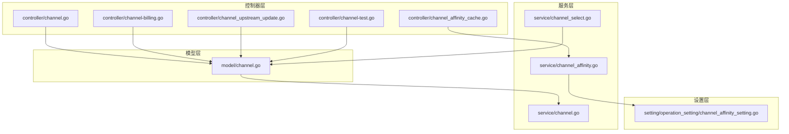
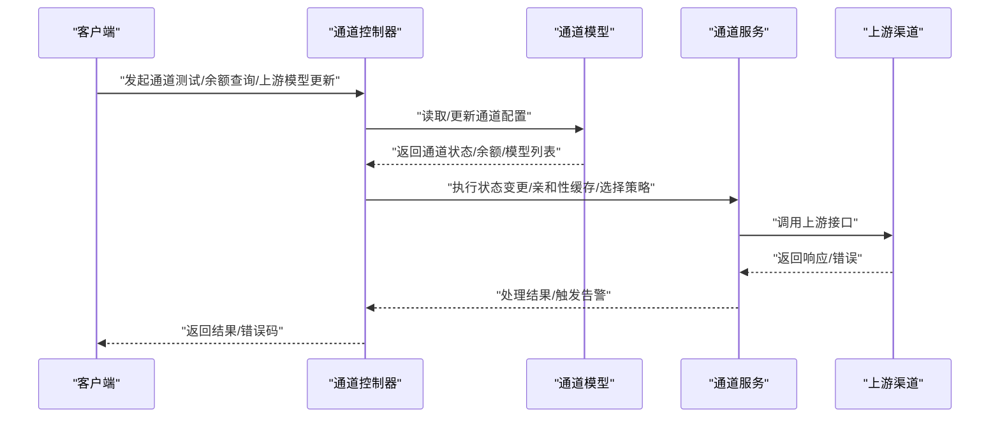
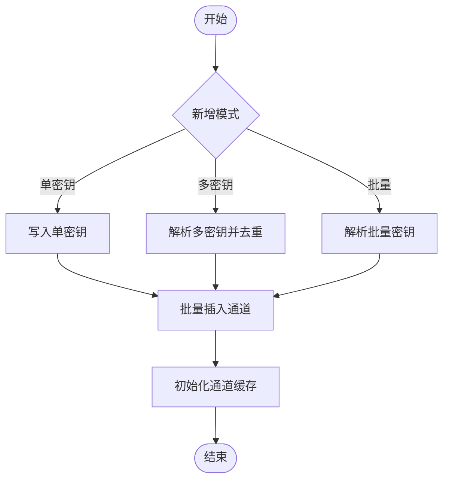
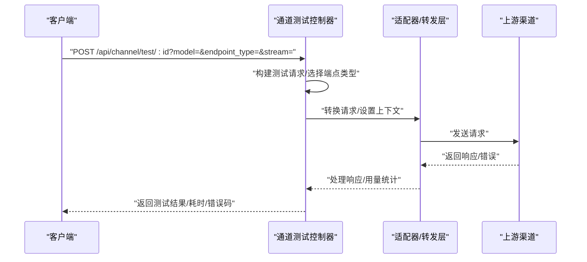
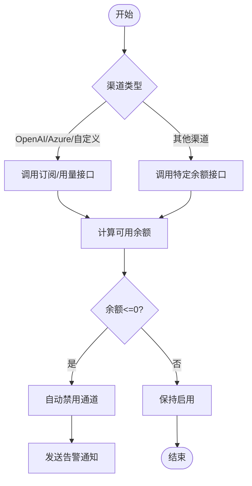
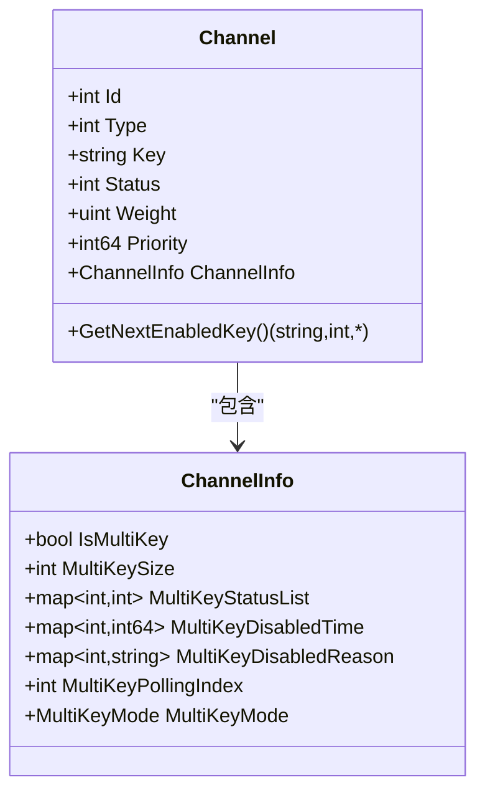
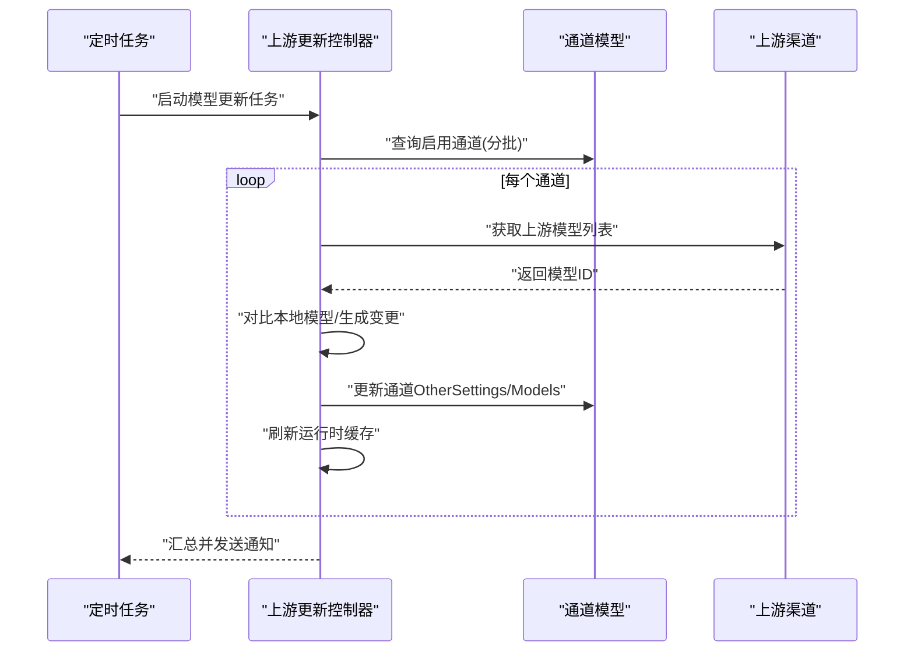
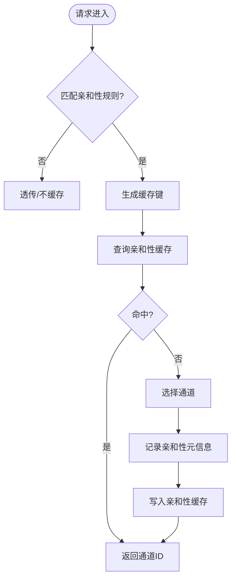
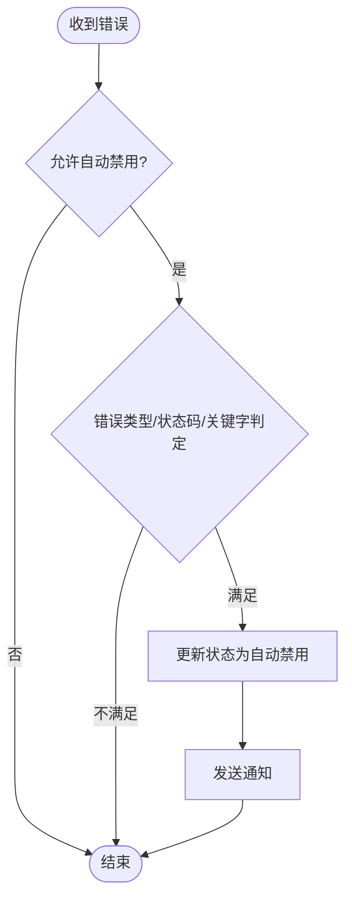
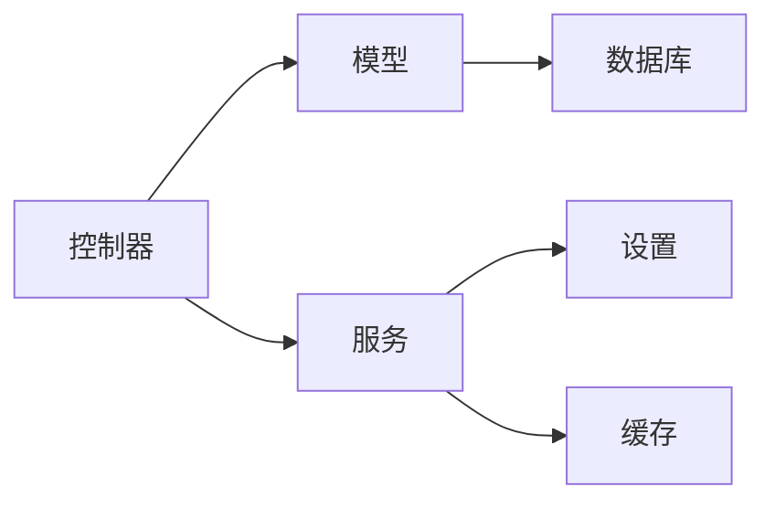

# 通道控制器

<cite>
**本文档引用的文件**
- [controller/channel.go](file://controller/channel.go)
- [controller/channel-billing.go](file://controller/channel-billing.go)
- [controller/channel_affinity_cache.go](file://controller/channel_affinity_cache.go)
- [controller/channel_upstream_update.go](file://controller/channel_upstream_update.go)
- [controller/channel-test.go](file://controller/channel-test.go)
- [model/channel.go](file://model/channel.go)
- [service/channel.go](file://service/channel.go)
- [service/channel_affinity.go](file://service/channel_affinity.go)
- [service/channel_select.go](file://service/channel_select.go)
- [setting/operation_setting/channel_affinity_setting.go](file://setting/operation_setting/channel_affinity_setting.go)
</cite>

## 目录
1. [简介](#简介)
2. [项目结构](#项目结构)
3. [核心组件](#核心组件)
4. [架构总览](#架构总览)
5. [详细组件分析](#详细组件分析)
6. [依赖关系分析](#依赖关系分析)
7. [性能考虑](#性能考虑)
8. [故障排查指南](#故障排查指南)
9. [结论](#结论)

## 简介
本技术文档围绕通道控制器展开，系统性阐述AI服务通道的管理、配置与监控实现。重点覆盖通道的增删改查、批量操作、健康检查、自动重试、权重分配与故障转移、连接验证与性能监控、计费管理与用量统计、通道亲和性缓存与上游更新、配置同步、状态管理与告警机制。旨在帮助开发者全面理解通道控制器的架构与运维能力。

## 项目结构
通道控制器位于后端服务的控制器层，配合模型层、服务层与设置层协同工作，形成完整的通道生命周期管理体系。关键模块包括：
- 控制器层：提供HTTP接口，封装业务逻辑与数据校验
- 模型层：定义通道实体、状态与数据库交互
- 服务层：实现通道选择、亲和性缓存、状态变更与告警
- 设置层：提供通道亲和性规则与运行参数

**图表来源**
- [controller/channel.go:1-1958](file://controller/channel.go#L1-L1958)
- [controller/channel-billing.go:1-506](file://controller/channel-billing.go#L1-L506)
- [controller/channel_affinity_cache.go:1-89](file://controller/channel_affinity_cache.go#L1-L89)
- [controller/channel_upstream_update.go:1-980](file://controller/channel_upstream_update.go#L1-L980)
- [controller/channel-test.go:1-905](file://controller/channel-test.go#L1-L905)
- [model/channel.go:1-1009](file://model/channel.go#L1-L1009)
- [service/channel.go:1-79](file://service/channel.go#L1-L79)
- [service/channel_affinity.go:1-967](file://service/channel_affinity.go#L1-L967)
- [service/channel_select.go:1-163](file://service/channel_select.go#L1-L163)
- [setting/operation_setting/channel_affinity_setting.go:1-122](file://setting/operation_setting/channel_affinity_setting.go#L1-L122)

**章节来源**
- [controller/channel.go:1-1958](file://controller/channel.go#L1-L1958)
- [model/channel.go:1-1009](file://model/channel.go#L1-L1009)

## 核心组件
- 通道管理控制器：提供通道的增删改查、批量操作、标签管理、模型同步与上游更新、多密钥管理、Ollama模型拉取与版本查询等接口
- 计费与余额控制器：对接多家上游渠道的余额查询与自动禁用逻辑
- 通道亲和性缓存控制器：提供亲和性缓存统计、清理与使用缓存统计查询
- 通道测试控制器：封装通道连通性测试、响应时间统计与错误检测
- 通道模型：定义通道实体、多密钥状态、优先级与权重、余额与配额等字段及方法
- 通道服务：实现通道状态变更、自动启停、错误处理与告警；通道选择策略与重试参数管理；亲和性缓存与使用统计
- 通道亲和性设置：定义亲和性规则、键来源、模板参数与TTL

**章节来源**
- [controller/channel.go:71-174](file://controller/channel.go#L71-L174)
- [controller/channel-billing.go:424-496](file://controller/channel-billing.go#L424-L496)
- [controller/channel_affinity_cache.go:11-89](file://controller/channel_affinity_cache.go#L11-L89)
- [controller/channel_upstream_update.go:632-661](file://controller/channel_upstream_update.go#L632-L661)
- [controller/channel-test.go:735-789](file://controller/channel-test.go#L735-L789)
- [model/channel.go:21-68](file://model/channel.go#L21-L68)
- [service/channel.go:19-79](file://service/channel.go#L19-L79)
- [service/channel_affinity.go:545-703](file://service/channel_affinity.go#L545-L703)
- [setting/operation_setting/channel_affinity_setting.go:30-122](file://setting/operation_setting/channel_affinity_setting.go#L30-L122)

## 架构总览
通道控制器采用分层架构，控制器负责接口与参数校验，模型负责数据持久化与状态维护，服务层负责业务策略与缓存，设置层提供可配置规则。通道选择与重试策略贯穿请求链路，亲和性缓存提升命中率与稳定性。

**图表来源**
- [controller/channel-test.go:735-789](file://controller/channel-test.go#L735-L789)
- [controller/channel-billing.go:424-496](file://controller/channel-billing.go#L424-L496)
- [controller/channel_upstream_update.go:632-661](file://controller/channel_upstream_update.go#L632-L661)
- [service/channel.go:19-79](file://service/channel.go#L19-L79)
- [service/channel_affinity.go:545-703](file://service/channel_affinity.go#L545-L703)

## 详细组件分析

### 通道管理与批量操作
- 列表与搜索：支持按状态、类型、标签、关键词搜索，分页与排序
- 新增通道：支持单密钥、多密钥、批量导入模式，自动清洗与去重
- 编辑通道：保留多密钥状态，支持追加/覆盖密钥，更新优先级与权重
- 删除与批量删除：支持按ID批量删除与清理禁用通道
- 标签管理：支持按标签启用/禁用/编辑，批量设置标签
- 复制通道：克隆通道并可重置余额与配额
- 多密钥管理：支持禁用/启用/删除密钥、删除自动禁用密钥、查询密钥状态与分页过滤

**图表来源**
- [controller/channel.go:566-664](file://controller/channel.go#L566-L664)
- [controller/channel.go:812-834](file://controller/channel.go#L812-L834)
- [controller/channel.go:1093-1115](file://controller/channel.go#L1093-L1115)

**章节来源**
- [controller/channel.go:71-174](file://controller/channel.go#L71-L174)
- [controller/channel.go:566-664](file://controller/channel.go#L566-L664)
- [controller/channel.go:812-834](file://controller/channel.go#L812-L834)
- [controller/channel.go:1093-1115](file://controller/channel.go#L1093-L1115)
- [controller/channel.go:1158-1208](file://controller/channel.go#L1158-L1208)
- [controller/channel.go:1242-1698](file://controller/channel.go#L1242-L1698)

### 通道健康检查与连接验证
- 通道测试：构造不同端点类型的测试请求，自动推断请求路径与适配器，支持流式与非流式，记录响应时间与用量
- 错误检测：解析上游错误消息，返回标准化错误码与提示
- 性能监控：记录测试耗时，便于评估通道性能

**图表来源**
- [controller/channel-test.go:735-789](file://controller/channel-test.go#L735-L789)
- [controller/channel-test.go:59-506](file://controller/channel-test.go#L59-L506)

**章节来源**
- [controller/channel-test.go:735-789](file://controller/channel-test.go#L735-L789)
- [controller/channel-test.go:59-506](file://controller/channel-test.go#L59-L506)

### 计费管理与余额查询
- 余额查询：针对不同渠道类型调用对应接口，解析订阅与用量，计算可用余额
- 自动禁用：当余额低于阈值时自动禁用通道，并通过通知机制告警
- 批量更新：定时任务扫描启用中的通道，异步更新余额并处理禁用逻辑

**图表来源**
- [controller/channel-billing.go:359-422](file://controller/channel-billing.go#L359-L422)
- [controller/channel-billing.go:454-496](file://controller/channel-billing.go#L454-L496)
- [service/channel.go:19-34](file://service/channel.go#L19-L34)

**章节来源**
- [controller/channel-billing.go:424-496](file://controller/channel-billing.go#L424-L496)
- [controller/channel-billing.go:454-496](file://controller/channel-billing.go#L454-L496)
- [service/channel.go:19-34](file://service/channel.go#L19-L34)

### 权重分配与故障转移
- 通道选择策略：基于用户分组、模型名与重试参数，按优先级与权重随机或轮询选择可用通道
- 跨分组重试：当当前分组优先级用尽时，切换到下一组继续重试
- 多密钥轮询：在多密钥通道中按模式轮询或随机选择可用密钥

**图表来源**
- [model/channel.go:21-68](file://model/channel.go#L21-L68)
- [model/channel.go:105-190](file://model/channel.go#L105-L190)

**章节来源**
- [service/channel_select.go:83-163](file://service/channel_select.go#L83-L163)
- [model/channel.go:105-190](file://model/channel.go#L105-L190)

### 上游模型更新与配置同步
- 模型同步：自动检测上游模型变化，支持自动同步新增模型与忽略策略
- 配置更新：持久化检测结果与忽略列表，必要时刷新运行时缓存
- 通知机制：周期性汇总变更并发送通知，抑制重复通知窗口

**图表来源**
- [controller/channel_upstream_update.go:502-630](file://controller/channel_upstream_update.go#L502-L630)
- [controller/channel_upstream_update.go:632-661](file://controller/channel_upstream_update.go#L632-L661)

**章节来源**
- [controller/channel_upstream_update.go:25-83](file://controller/channel_upstream_update.go#L25-L83)
- [controller/channel_upstream_update.go:242-327](file://controller/channel_upstream_update.go#L242-L327)
- [controller/channel_upstream_update.go:340-387](file://controller/channel_upstream_update.go#L340-L387)
- [controller/channel_upstream_update.go:502-630](file://controller/channel_upstream_update.go#L502-L630)

### 通道亲和性缓存与使用统计
- 亲和性匹配：根据规则匹配模型、路径、User-Agent与键来源，生成缓存键
- 缓存记录：命中则返回通道ID，未命中则记录亲和性元信息
- 使用统计：统计命中/总数、Token用量与缓存命中信号，支持多种计费模式

**图表来源**
- [service/channel_affinity.go:545-703](file://service/channel_affinity.go#L545-L703)
- [setting/operation_setting/channel_affinity_setting.go:30-122](file://setting/operation_setting/channel_affinity_setting.go#L30-L122)

**章节来源**
- [controller/channel_affinity_cache.go:11-89](file://controller/channel_affinity_cache.go#L11-L89)
- [service/channel_affinity.go:545-703](file://service/channel_affinity.go#L545-L703)
- [service/channel_affinity.go:745-840](file://service/channel_affinity.go#L745-L840)
- [setting/operation_setting/channel_affinity_setting.go:30-122](file://setting/operation_setting/channel_affinity_setting.go#L30-L122)

### 状态管理、错误处理与告警
- 状态变更：支持启用/禁用/自动禁用，多密钥场景下按密钥粒度更新状态
- 错误判定：根据状态码、关键字与错误类型决定是否自动禁用
- 告警通知：通过根用户通知机制发送禁用/启用事件

**图表来源**
- [service/channel.go:45-79](file://service/channel.go#L45-L79)
- [service/channel.go:19-34](file://service/channel.go#L19-L34)

**章节来源**
- [service/channel.go:19-79](file://service/channel.go#L19-L79)
- [model/channel.go:611-680](file://model/channel.go#L611-L680)

## 依赖关系分析
- 控制器依赖模型进行数据访问与更新，依赖服务层执行业务策略与通知
- 模型依赖GORM进行数据库操作，提供多密钥状态与通道信息的序列化
- 服务层依赖设置层的亲和性规则，依赖缓存组件实现高性能缓存
- 设置层提供可热加载的亲和性配置，支持规则扩展与模板参数

**图表来源**
- [controller/channel.go:1-50](file://controller/channel.go#L1-L50)
- [model/channel.go:1-50](file://model/channel.go#L1-L50)
- [service/channel_affinity.go:1-50](file://service/channel_affinity.go#L1-L50)
- [setting/operation_setting/channel_affinity_setting.go:1-50](file://setting/operation_setting/channel_affinity_setting.go#L1-L50)

**章节来源**
- [controller/channel.go:1-50](file://controller/channel.go#L1-L50)
- [model/channel.go:1-50](file://model/channel.go#L1-L50)
- [service/channel_affinity.go:1-50](file://service/channel_affinity.go#L1-L50)
- [setting/operation_setting/channel_affinity_setting.go:1-50](file://setting/operation_setting/channel_affinity_setting.go#L1-L50)

## 性能考虑
- 批量操作：新增/删除/更新采用分批处理，减少锁竞争与内存占用
- 缓存策略：亲和性缓存与使用统计缓存结合LRU与TTL，支持Redis与内存双层缓存
- 请求间隔：定时任务与上游调用之间设置请求间隔，避免触发上游限流
- 多密钥轮询：线程安全的轮询索引与状态列表，避免并发冲突

[本节为通用指导，无需具体文件分析]

## 故障排查指南
- 通道测试失败：检查测试模型、端点类型与上游认证头；查看错误消息与状态码
- 余额查询异常：确认渠道类型与BaseURL配置；检查代理设置与网络连通性
- 上游模型未同步：检查检测开关、最小检测间隔与忽略列表；确认上游模型接口可达
- 亲和性缓存异常：检查规则配置、键来源与TTL；核对缓存容量与算法
- 自动禁用频繁：检查错误关键字与状态码映射；评估上游稳定性与配额情况

**章节来源**
- [controller/channel-test.go:454-600](file://controller/channel-test.go#L454-L600)
- [controller/channel-billing.go:139-167](file://controller/channel-billing.go#L139-L167)
- [controller/channel_upstream_update.go:231-240](file://controller/channel_upstream_update.go#L231-L240)
- [service/channel_affinity.go:111-196](file://service/channel_affinity.go#L111-L196)
- [service/channel.go:45-79](file://service/channel.go#L45-L79)

## 结论
通道控制器通过清晰的分层设计与完善的业务策略，实现了对AI服务通道的全生命周期管理。其具备强大的批量操作、健康检查、计费监控、亲和性缓存与上游同步能力，同时提供灵活的权重分配与故障转移机制。结合自动禁用与告警通知，能够有效保障系统的稳定性与可观测性，满足生产环境的运维需求。