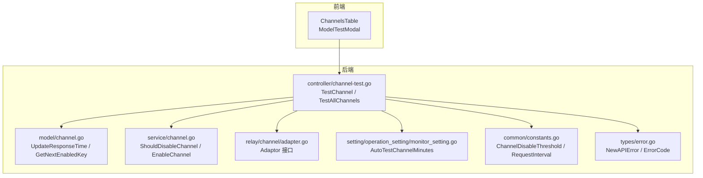
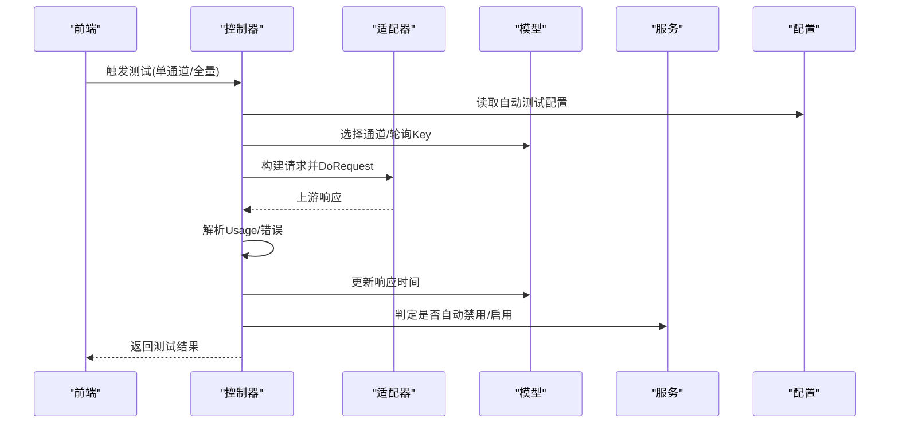
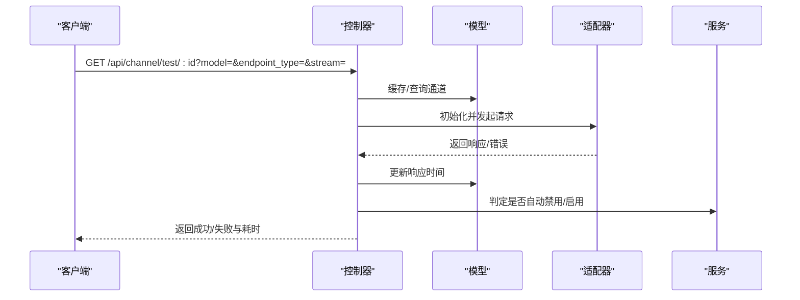
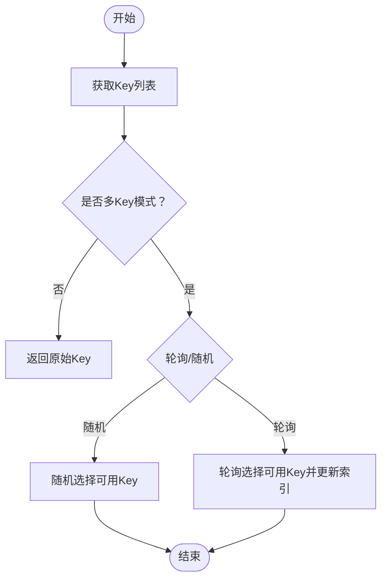
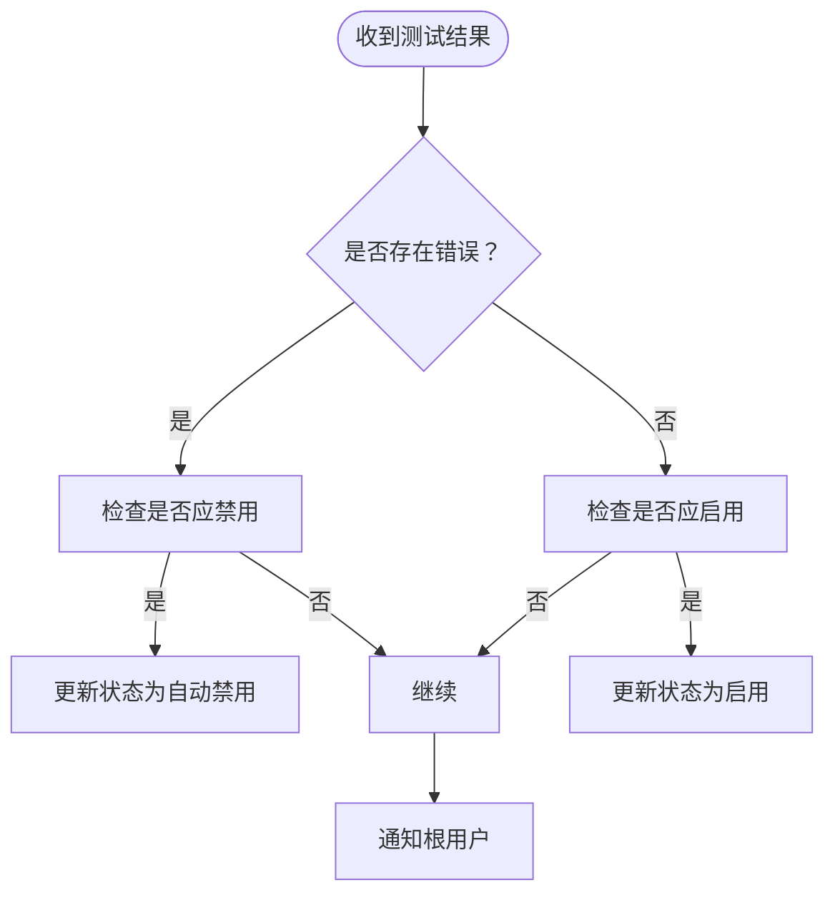
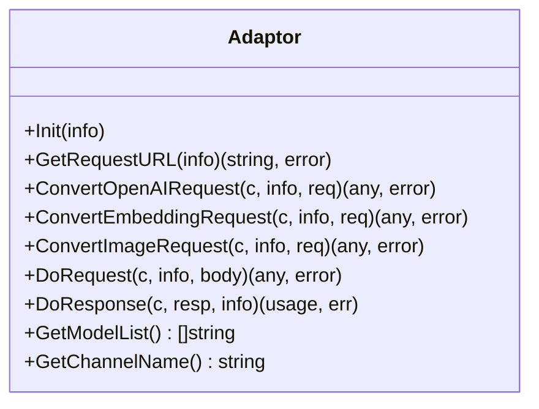
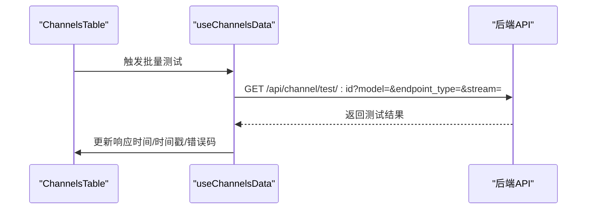
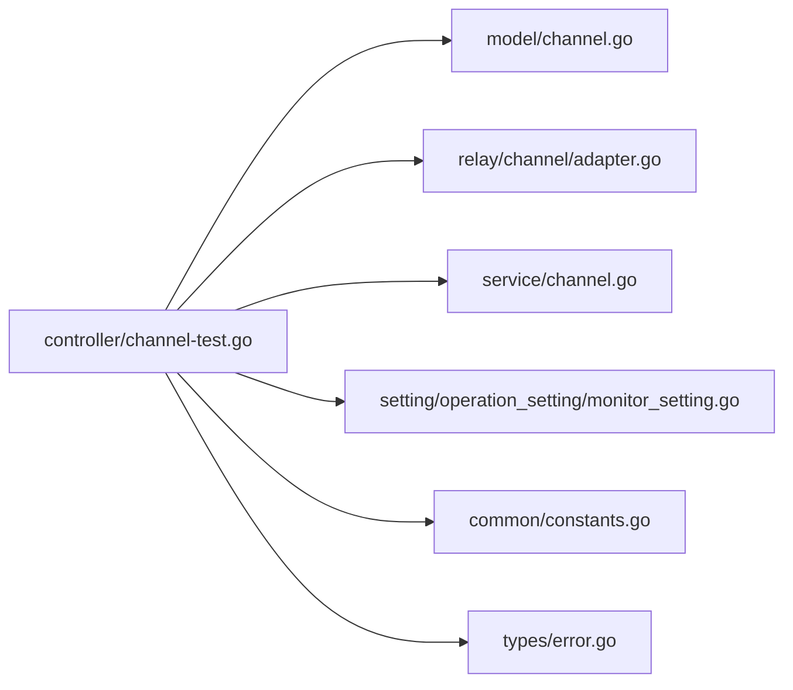

# 通道测试

<cite>
**本文引用的文件**
- [controller/channel-test.go](file://controller/channel-test.go)
- [model/channel.go](file://model/channel.go)
- [service/channel.go](file://service/channel.go)
- [relay/channel/adapter.go](file://relay/channel/adapter.go)
- [setting/operation_setting/monitor_setting.go](file://setting/operation_setting/monitor_setting.go)
- [common/constants.go](file://common/constants.go)
- [types/error.go](file://types/error.go)
- [web/src/hooks/channels/useChannelsData.jsx](file://web/src/hooks/channels/useChannelsData.jsx)
- [web/src/components/table/channels/index.jsx](file://web/src/components/table/channels/index.jsx)
- [web/src/pages/Channel/index.jsx](file://web/src/pages/Channel/index.jsx)
</cite>

## 目录
1. [简介](#简介)
2. [项目结构](#项目结构)
3. [核心组件](#核心组件)
4. [架构总览](#架构总览)
5. [详细组件分析](#详细组件分析)
6. [依赖分析](#依赖分析)
7. [性能考虑](#性能考虑)
8. [故障排查指南](#故障排查指南)
9. [结论](#结论)
10. [附录](#附录)

## 简介
本技术文档围绕通道测试系统展开，全面解析通道连通性测试的实现机制与自动化流程，覆盖以下关键主题：
- API密钥验证与服务可用性检测
- 响应时间测量与阈值控制
- 自动化测试流程：批量测试、定时测试、手动触发测试
- 不同AI服务提供商的测试协议与验证方法
- 测试结果评估标准：成功率、响应时间、服务质量评分
- 报告生成与历史记录管理
- 异常处理与错误诊断机制
- 配置管理：测试频率、超时设置、重试策略

## 项目结构
通道测试系统主要分布在后端控制器、模型层、服务层、适配器层以及前端交互层：
- 后端控制器负责接收测试请求、组装测试上下文、调用适配器并返回结果
- 模型层负责通道状态、响应时间、多Key轮询与禁用逻辑
- 服务层负责自动禁用/启用通道、关键词匹配与通知
- 适配器层抽象各AI服务提供商的请求转换与响应处理
- 前端负责用户触发测试、展示测试结果与批量测试UI

**图表来源**
- [controller/channel-test.go:735-789](file://controller/channel-test.go#L735-L789)
- [model/channel.go:507-551](file://model/channel.go#L507-L551)
- [service/channel.go:45-79](file://service/channel.go#L45-L79)
- [relay/channel/adapter.go:15-32](file://relay/channel/adapter.go#L15-L32)
- [setting/operation_setting/monitor_setting.go:10-35](file://setting/operation_setting/monitor_setting.go#L10-L35)
- [common/constants.go:107-120](file://common/constants.go#L107-L120)
- [types/error.go:38-88](file://types/error.go#L38-L88)

**章节来源**
- [controller/channel-test.go:735-789](file://controller/channel-test.go#L735-L789)
- [model/channel.go:507-551](file://model/channel.go#L507-L551)
- [service/channel.go:45-79](file://service/channel.go#L45-L79)
- [relay/channel/adapter.go:15-32](file://relay/channel/adapter.go#L15-L32)
- [setting/operation_setting/monitor_setting.go:10-35](file://setting/operation_setting/monitor_setting.go#L10-L35)
- [common/constants.go:107-120](file://common/constants.go#L107-L120)
- [types/error.go:38-88](file://types/error.go#L38-L88)

## 核心组件
- 通道测试控制器：负责单通道与全量通道测试，封装测试请求构建、适配器调用、响应解析与结果上报
- 通道模型：维护通道状态、响应时间、多Key轮询与禁用/启用逻辑
- 服务层：基于错误码与状态码判定是否自动禁用/启用通道，并进行通知
- 适配器接口：统一各AI服务提供商的请求转换与响应处理
- 运行时配置：监控设置（自动测试开关与周期）、常量阈值（响应时间阈值、请求间隔）

**章节来源**
- [controller/channel-test.go:59-506](file://controller/channel-test.go#L59-L506)
- [model/channel.go:507-551](file://model/channel.go#L507-L551)
- [service/channel.go:45-79](file://service/channel.go#L45-L79)
- [relay/channel/adapter.go:15-32](file://relay/channel/adapter.go#L15-L32)
- [setting/operation_setting/monitor_setting.go:10-35](file://setting/operation_setting/monitor_setting.go#L10-L35)
- [common/constants.go:107-120](file://common/constants.go#L107-L120)

## 架构总览
通道测试系统采用“控制器-适配器-模型-服务-配置”的分层架构：
- 控制器接收请求，构造测试上下文，选择适配器并发起上游请求
- 适配器负责将通用请求转换为具体提供商协议，并解析响应
- 模型层负责通道状态与指标更新
- 服务层负责自动禁用/启用通道与通知
- 配置层提供自动测试周期与阈值控制

**图表来源**
- [controller/channel-test.go:735-789](file://controller/channel-test.go#L735-L789)
- [controller/channel-test.go:794-864](file://controller/channel-test.go#L794-L864)
- [model/channel.go:507-551](file://model/channel.go#L507-L551)
- [service/channel.go:45-79](file://service/channel.go#L45-L79)
- [setting/operation_setting/monitor_setting.go:26-35](file://setting/operation_setting/monitor_setting.go#L26-L35)

## 详细组件分析

### 通道测试控制器（单通道与全量）
- 单通道测试入口：解析请求参数（模型、端点类型、是否流式），构造测试上下文，选择适配器并发起请求，统计耗时并更新通道响应时间
- 全量测试入口：串行遍历所有通道，按配置周期与阈值自动禁用/启用通道，并支持完成后通知

**图表来源**
- [controller/channel-test.go:735-789](file://controller/channel-test.go#L735-L789)
- [controller/channel-test.go:59-506](file://controller/channel-test.go#L59-L506)

**章节来源**
- [controller/channel-test.go:735-789](file://controller/channel-test.go#L735-L789)
- [controller/channel-test.go:794-864](file://controller/channel-test.go#L794-L864)

### 通道模型与多Key轮询
- 响应时间更新：每次测试后更新通道的响应时间与测试时间
- 多Key轮询：支持随机与轮询两种模式，线程安全地选择可用Key并更新轮询索引
- 禁用/启用：根据状态与自动禁用策略更新通道状态

**图表来源**
- [model/channel.go:105-190](file://model/channel.go#L105-L190)
- [model/channel.go:507-551](file://model/channel.go#L507-L551)

**章节来源**
- [model/channel.go:105-190](file://model/channel.go#L105-L190)
- [model/channel.go:507-551](file://model/channel.go#L507-L551)

### 服务层自动禁用/启用
- 自动禁用：基于错误类型、状态码、关键词匹配判定是否禁用通道
- 自动启用：通道处于自动禁用状态且测试成功时自动启用
- 通知：对根用户发送通道状态变更通知

**图表来源**
- [service/channel.go:45-79](file://service/channel.go#L45-L79)

**章节来源**
- [service/channel.go:45-79](file://service/channel.go#L45-L79)

### 适配器接口与请求转换
- 统一接口：Init、GetRequestURL、ConvertOpenAIRequest、DoRequest、DoResponse、GetModelList、GetChannelName等
- 适配器职责：将通用请求转换为具体提供商协议，处理请求头、请求体与响应解析

**图表来源**
- [relay/channel/adapter.go:15-32](file://relay/channel/adapter.go#L15-L32)

**章节来源**
- [relay/channel/adapter.go:15-32](file://relay/channel/adapter.go#L15-L32)

### 前端交互与批量测试
- 前端页面：通道表格页集成测试弹窗与批量测试功能
- 批量测试：按并发限制逐批测试渠道模型，收集结果并更新UI

**图表来源**
- [web/src/hooks/channels/useChannelsData.jsx:875-1005](file://web/src/hooks/channels/useChannelsData.jsx#L875-L1005)
- [web/src/components/table/channels/index.jsx:39-117](file://web/src/components/table/channels/index.jsx#L39-L117)
- [web/src/pages/Channel/index.jsx:20-32](file://web/src/pages/Channel/index.jsx#L20-L32)

**章节来源**
- [web/src/hooks/channels/useChannelsData.jsx:875-1005](file://web/src/hooks/channels/useChannelsData.jsx#L875-L1005)
- [web/src/components/table/channels/index.jsx:39-117](file://web/src/components/table/channels/index.jsx#L39-L117)
- [web/src/pages/Channel/index.jsx:20-32](file://web/src/pages/Channel/index.jsx#L20-L32)

## 依赖分析
- 控制器依赖模型层进行通道状态与指标更新，依赖适配器层进行请求转换与响应处理，依赖服务层进行自动禁用/启用判定，依赖配置层进行自动测试周期控制
- 错误类型与错误码定义集中于types包，便于统一处理与上报

**图表来源**
- [controller/channel-test.go:735-789](file://controller/channel-test.go#L735-L789)
- [model/channel.go:507-551](file://model/channel.go#L507-L551)
- [service/channel.go:45-79](file://service/channel.go#L45-L79)
- [relay/channel/adapter.go:15-32](file://relay/channel/adapter.go#L15-L32)
- [setting/operation_setting/monitor_setting.go:26-35](file://setting/operation_setting/monitor_setting.go#L26-L35)
- [common/constants.go:107-120](file://common/constants.go#L107-L120)
- [types/error.go:38-88](file://types/error.go#L38-L88)

**章节来源**
- [controller/channel-test.go:735-789](file://controller/channel-test.go#L735-L789)
- [model/channel.go:507-551](file://model/channel.go#L507-L551)
- [service/channel.go:45-79](file://service/channel.go#L45-L79)
- [relay/channel/adapter.go:15-32](file://relay/channel/adapter.go#L15-L32)
- [setting/operation_setting/monitor_setting.go:26-35](file://setting/operation_setting/monitor_setting.go#L26-L35)
- [common/constants.go:107-120](file://common/constants.go#L107-L120)
- [types/error.go:38-88](file://types/error.go#L38-L88)

## 性能考虑
- 并发与限速：全量测试采用串行遍历并在每轮之间应用请求间隔，避免对上游造成过大压力
- 响应时间阈值：超过阈值将触发自动禁用，保障整体服务稳定性
- 多Key轮询：线程安全的轮询机制避免竞态，提升多Key场景下的吞吐能力
- 日志与错误屏蔽：敏感信息在错误消息中进行掩码处理，减少泄露风险

[本节为通用指导，无需列出具体文件来源]

## 故障排查指南
- 常见错误码与含义
  - invalid_api_type：API类型无效或适配器不存在
  - do_request_failed：上游请求失败
  - bad_response：上游响应异常
  - channel:no_available_key：通道无可用Key
  - channel:response_time_exceeded：响应时间超过阈值
- 自动禁用条件
  - 错误类型为通道错误
  - 状态码命中禁用规则
  - 错误消息匹配关键词
- 自动启用条件
  - 通道处于自动禁用状态
  - 测试成功
- 建议排查步骤
  - 检查通道状态与Key有效性
  - 查看上游返回的状态码与错误消息
  - 核对测试模型与端点类型是否匹配
  - 调整响应时间阈值与请求间隔

**章节来源**
- [types/error.go:38-88](file://types/error.go#L38-L88)
- [service/channel.go:45-79](file://service/channel.go#L45-L79)
- [controller/channel-test.go:794-864](file://controller/channel-test.go#L794-L864)

## 结论
通道测试系统通过清晰的分层设计与完善的自动化机制，实现了对多AI服务提供商通道的连通性、可用性与性能的持续监测。结合阈值控制、自动禁用/启用与前端可视化，系统能够在保证稳定性的同时，为运维与运营提供可靠的数据支撑。

[本节为总结性内容，无需列出具体文件来源]

## 附录

### 测试协议与验证方法（概览）
- OpenAI系列：通用聊天/补全/嵌入/图像生成/重排等端点类型
- Claude/Gemini等：对应特定端点类型与消息格式
- 响应解析：统一解析Usage与错误消息，支持流式与非流式
- 参数覆写：支持按通道维度的参数与头部覆写

**章节来源**
- [controller/channel-test.go:59-506](file://controller/channel-test.go#L59-L506)

### 测试结果评估标准
- 成功率：以测试是否返回成功与错误码作为判定依据
- 响应时间：以秒为单位，超过阈值触发自动禁用
- 服务质量评分：可基于成功率与平均响应时间综合计算（建议在上层业务中实现）

**章节来源**
- [controller/channel-test.go:735-789](file://controller/channel-test.go#L735-L789)
- [common/constants.go:107](file://common/constants.go#L107)

### 报告生成与历史记录
- 历史记录：通道模型维护测试时间与响应时间，可用于趋势分析
- 前端展示：批量测试结果在表格中实时更新，包含时间戳与错误码

**章节来源**
- [model/channel.go:507-551](file://model/channel.go#L507-L551)
- [web/src/hooks/channels/useChannelsData.jsx:875-1005](file://web/src/hooks/channels/useChannelsData.jsx#L875-L1005)

### 配置管理
- 自动测试周期：通过环境变量或配置中心设置，支持分钟级周期
- 超时与重试：通过公共常量与适配器层的错误处理机制协同
- 请求间隔：全量测试间歇性休眠，避免对上游造成冲击

**章节来源**
- [setting/operation_setting/monitor_setting.go:26-35](file://setting/operation_setting/monitor_setting.go#L26-L35)
- [common/constants.go:107-120](file://common/constants.go#L107-L120)