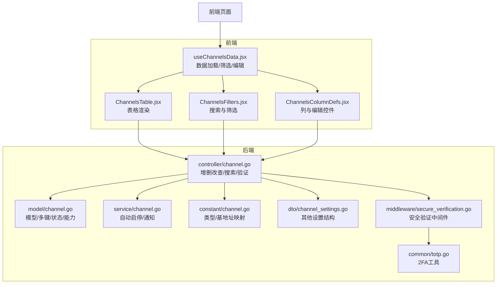
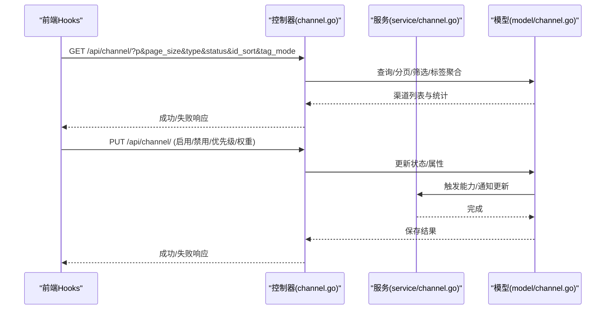
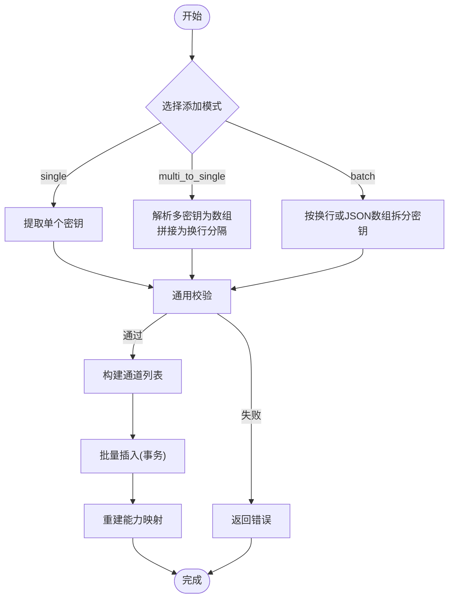
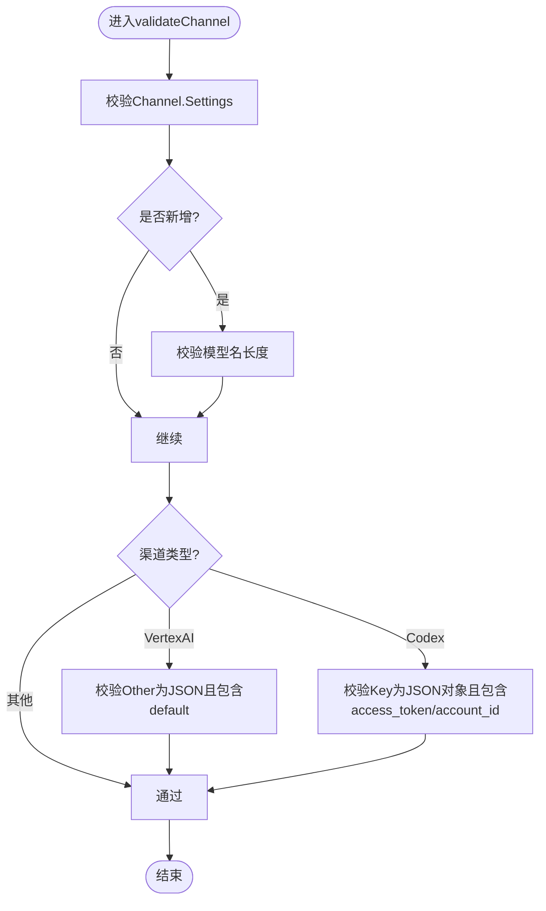
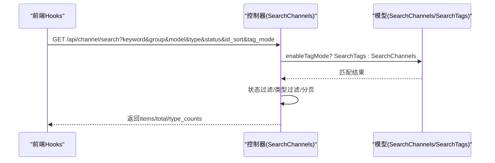
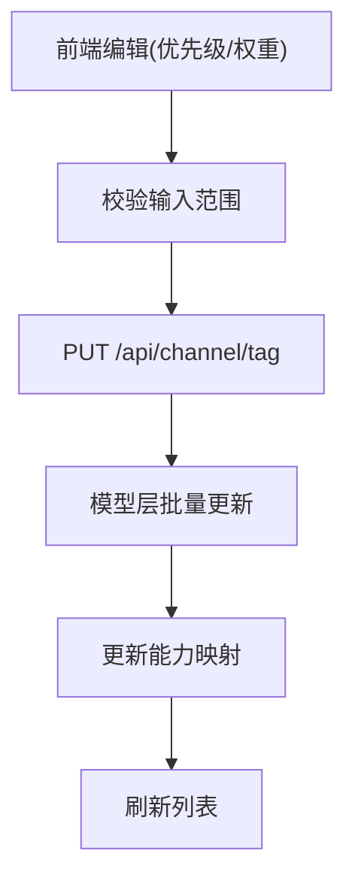
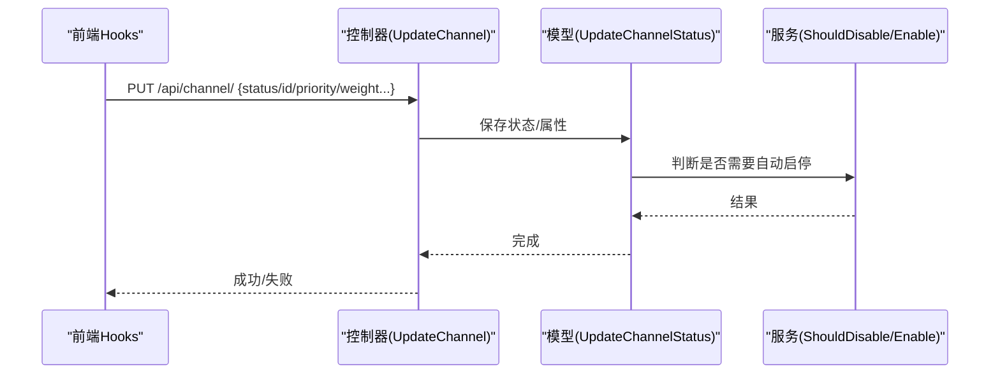
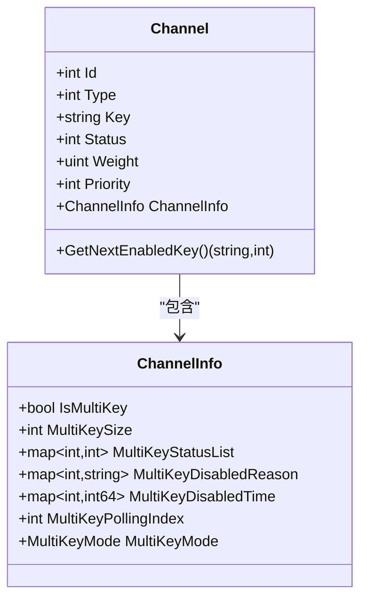
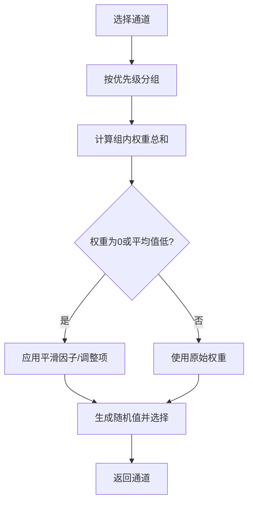
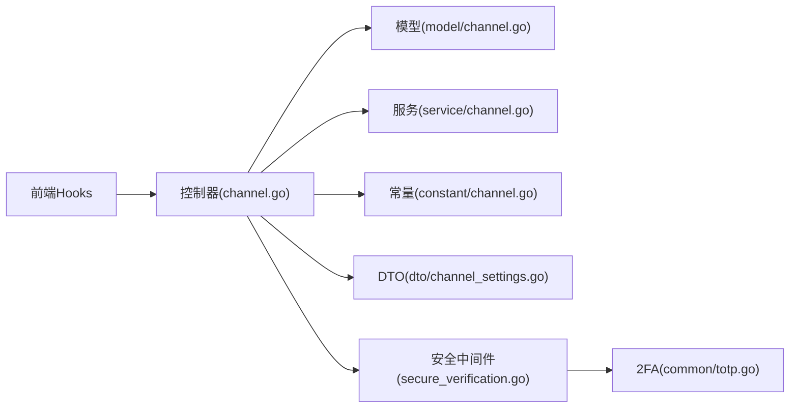

# 通道管理

<cite>
**本文引用的文件**
- [controller/channel.go](file://controller/channel.go)
- [model/channel.go](file://model/channel.go)
- [service/channel.go](file://service/channel.go)
- [constant/channel.go](file://constant/channel.go)
- [web/src/hooks/channels/useChannelsData.jsx](file://web/src/hooks/channels/useChannelsData.jsx)
- [web/src/components/table/channels/ChannelsFilters.jsx](file://web/src/components/table/channels/ChannelsFilters.jsx)
- [web/src/components/table/channels/ChannelsColumnDefs.jsx](file://web/src/components/table/channels/ChannelsColumnDefs.jsx)
- [web/src/components/table/channels/ChannelsTable.jsx](file://web/src/components/table/channels/ChannelsTable.jsx)
- [middleware/secure_verification.go](file://middleware/secure_verification.go)
- [common/totp.go](file://common/totp.go)
- [dto/channel_settings.go](file://dto/channel_settings.go)
- [relay/channel/vertex/constants.go](file://relay/channel/vertex/constants.go)
- [service/codex_credential_refresh.go](file://service/codex_credential_refresh.go)
- [model/channel_cache.go](file://model/channel_cache.go)
</cite>

## 目录
1. [简介](#简介)
2. [项目结构](#项目结构)
3. [核心组件](#核心组件)
4. [架构总览](#架构总览)
5. [详细组件分析](#详细组件分析)
6. [依赖分析](#依赖分析)
7. [性能考虑](#性能考虑)
8. [故障排查指南](#故障排查指南)
9. [结论](#结论)
10. [附录](#附录)

## 简介
本技术文档围绕通道管理系统进行全面解析，覆盖通道的增删改查、批量添加与多键模式、配置验证（含VertexAI地区与Codex OAuth校验）、搜索与筛选（关键词、状态、类型）、标签与优先级/权重管理、状态切换与启用禁用、密钥安全管理（显示验证与2FA流程），以及通道选择与负载均衡策略。文档面向开发者与运维人员，帮助快速理解系统设计与实现细节。

## 项目结构
通道管理涉及后端控制器、模型层、服务层、常量定义、前端Hooks与表格组件，以及安全中间件与工具模块。整体采用前后端分离、控制器-服务-模型三层架构，配合前端Hooks封装数据加载、筛选、编辑与批量操作。

图表来源
- [controller/channel.go:1-800](file://controller/channel.go#L1-L800)
- [model/channel.go:1-800](file://model/channel.go#L1-L800)
- [service/channel.go:1-79](file://service/channel.go#L1-L79)
- [constant/channel.go:1-210](file://constant/channel.go#L1-L210)
- [dto/channel_settings.go:26-35](file://dto/channel_settings.go#L26-L35)
- [web/src/hooks/channels/useChannelsData.jsx:1-200](file://web/src/hooks/channels/useChannelsData.jsx#L1-L200)
- [web/src/components/table/channels/ChannelsFilters.jsx:112-159](file://web/src/components/table/channels/ChannelsFilters.jsx#L112-L159)
- [web/src/components/table/channels/ChannelsColumnDefs.jsx:571-660](file://web/src/components/table/channels/ChannelsColumnDefs.jsx#L571-L660)
- [web/src/components/table/channels/ChannelsTable.jsx:1-178](file://web/src/components/table/channels/ChannelsTable.jsx#L1-L178)
- [middleware/secure_verification.go:1-132](file://middleware/secure_verification.go#L1-L132)
- [common/totp.go:1-151](file://common/totp.go#L1-L151)

章节来源
- [controller/channel.go:1-800](file://controller/channel.go#L1-L800)
- [model/channel.go:1-800](file://model/channel.go#L1-L800)
- [web/src/hooks/channels/useChannelsData.jsx:1-200](file://web/src/hooks/channels/useChannelsData.jsx#L1-L200)

## 核心组件
- 控制器层：提供通道列表、搜索、新增、更新、删除、批量删除、启用/禁用、密钥获取、凭证刷新等接口；内置通用校验函数与VertexAI/Codex特殊校验。
- 模型层：定义通道实体、多键模式、状态机、能力映射、标签与优先级/权重、响应时间/余额更新、批量插入/删除、按标签启用/禁用/编辑等。
- 服务层：封装自动启停策略、通知、Codex凭证刷新等业务逻辑。
- 前端Hooks：负责分页、搜索、筛选、标签模式、列可见性、批量操作、优先级/权重编辑、状态切换等交互。
- 安全中间件与工具：提供安全验证会话控制与2FA相关工具。

章节来源
- [controller/channel.go:248-359](file://controller/channel.go#L248-L359)
- [model/channel.go:21-254](file://model/channel.go#L21-L254)
- [service/channel.go:18-79](file://service/channel.go#L18-L79)
- [web/src/hooks/channels/useChannelsData.jsx:234-650](file://web/src/hooks/channels/useChannelsData.jsx#L234-L650)

## 架构总览
通道管理遵循“前端Hooks驱动数据流 + 后端控制器统一入口 + 模型层持久化”的架构。前端通过Hooks发起HTTP请求，控制器进行参数解析、权限与安全校验、调用模型层执行业务操作，并返回标准化响应。

图表来源
- [controller/channel.go:71-174](file://controller/channel.go#L71-L174)
- [controller/channel.go:842-898](file://controller/channel.go#L842-L898)
- [service/channel.go:18-79](file://service/channel.go#L18-L79)
- [model/channel.go:611-680](file://model/channel.go#L611-L680)

## 详细组件分析

### 通道增删改查与批量添加
- 单个通道添加
  - 支持三种模式：single（单个密钥）、multi_to_single（多密钥合并为单通道）、batch（批量拆分）。
  - VertexAI在非API Key模式下要求密钥为JSON数组格式，控制器会解析并拼接为换行分隔的密钥串。
  - 添加前统一调用通用校验函数，确保设置结构正确、模型名长度限制、特定类型校验（见下节）。
- 批量添加
  - 当类型为VertexAI且非API Key模式时，批量输入需为标准JSON数组；否则按换行分割。
  - 批量插入使用事务分批写入，并逐条重建能力映射。
- 更新与删除
  - 更新支持保留原有ChannelInfo（特别是多键模式状态），可选择覆盖多键模式与密钥追加/覆盖策略。
  - 删除支持单个与批量删除；禁用通道清理任务会删除手动/自动禁用状态的通道记录。

图表来源
- [controller/channel.go:527-664](file://controller/channel.go#L527-L664)
- [controller/channel.go:534-564](file://controller/channel.go#L534-L564)
- [model/channel.go:358-385](file://model/channel.go#L358-L385)

章节来源
- [controller/channel.go:527-664](file://controller/channel.go#L527-L664)
- [model/channel.go:358-385](file://model/channel.go#L358-L385)

### 通道配置验证机制
- 通用校验
  - 校验Channel.Settings结构合法性；对模型名长度进行限制。
- VertexAI地区配置
  - Other字段必须为标准JSON，包含default区域；否则报错。
- Codex OAuth密钥格式
  - 若提供密钥，必须为JSON对象，且包含access_token与account_id字段；否则报错。
- 其他设置
  - ChannelOtherSettings中包含针对特定供应商的透传/过滤选项（如service_tier、inference_geo、speed、safety_identifier、store等），用于控制请求参数与头部透传行为。

图表来源
- [controller/channel.go:436-493](file://controller/channel.go#L436-L493)
- [dto/channel_settings.go:26-35](file://dto/channel_settings.go#L26-L35)

章节来源
- [controller/channel.go:436-493](file://controller/channel.go#L436-L493)
- [dto/channel_settings.go:26-35](file://dto/channel_settings.go#L26-L35)

### 通道搜索与筛选
- 关键词搜索
  - 支持按ID、名称、密钥、BaseURL、模型关键字与分组进行模糊匹配。
- 状态过滤
  - 支持“全部/已启用/已禁用”，控制器内部对结果集进行二次过滤。
- 类型过滤
  - 通过type参数过滤指定类型；类型枚举与默认BaseURL由常量模块维护。
- 标签模式
  - 开启后根据关键词匹配到的标签聚合对应通道，同时统计各类型数量。

图表来源
- [controller/channel.go:248-359](file://controller/channel.go#L248-L359)
- [model/channel.go:292-339](file://model/channel.go#L292-L339)
- [model/channel.go:787-842](file://model/channel.go#L787-L842)

章节来源
- [controller/channel.go:248-359](file://controller/channel.go#L248-L359)
- [model/channel.go:292-339](file://model/channel.go#L292-L339)
- [model/channel.go:787-842](file://model/channel.go#L787-L842)

### 标签管理、优先级与权重
- 标签模式
  - 前端支持开启/关闭标签模式，聚合同标签通道并展示汇总优先级/权重。
- 优先级与权重
  - 支持单通道与标签批量编辑；前端对输入进行校验（优先级为整数，权重为非负整数）。
  - 后端按标签批量更新优先级/权重，并触发能力映射更新。

图表来源
- [web/src/components/table/channels/ChannelsColumnDefs.jsx:571-660](file://web/src/components/table/channels/ChannelsColumnDefs.jsx#L571-L660)
- [web/src/hooks/channels/useChannelsData.jsx:619-650](file://web/src/hooks/channels/useChannelsData.jsx#L619-L650)
- [controller/channel.go:697-800](file://controller/channel.go#L697-L800)

章节来源
- [web/src/components/table/channels/ChannelsColumnDefs.jsx:571-660](file://web/src/components/table/channels/ChannelsColumnDefs.jsx#L571-L660)
- [web/src/hooks/channels/useChannelsData.jsx:619-650](file://web/src/hooks/channels/useChannelsData.jsx#L619-L650)
- [controller/channel.go:697-800](file://controller/channel.go#L697-L800)

### 状态切换与启用/禁用
- 单通道状态切换
  - 前端通过PUT /api/channel/传递status字段，控制器更新状态并触发能力映射更新。
- 标签批量启停
  - 支持按标签批量启用/禁用，后端更新状态并同步能力。
- 自动启停策略
  - 服务层根据错误类型、状态码与关键词判断是否自动禁用/启用通道，并发送通知。

图表来源
- [controller/channel.go:842-898](file://controller/channel.go#L842-L898)
- [model/channel.go:611-680](file://model/channel.go#L611-L680)
- [service/channel.go:18-79](file://service/channel.go#L18-L79)

章节来源
- [controller/channel.go:842-898](file://controller/channel.go#L842-L898)
- [model/channel.go:611-680](file://model/channel.go#L611-L680)
- [service/channel.go:18-79](file://service/channel.go#L18-L79)

### 多键模式支持与密钥管理
- 多键模式
  - 支持随机与轮询两种模式；每通道独立锁保证轮询线程安全。
  - 密钥状态列表记录每个密钥的启用/禁用状态与禁用原因/时间；当所有密钥均禁用时，通道整体禁用。
- 密钥显示与安全验证
  - 获取密钥需通过安全验证中间件，检查会话内验证时间戳与有效期。
  - 2FA验证支持TOTP与备用码，提供生成、校验与标准化工具。

图表来源
- [model/channel.go:21-68](file://model/channel.go#L21-L68)
- [model/channel.go:105-190](file://model/channel.go#L105-L190)

章节来源
- [model/channel.go:105-190](file://model/channel.go#L105-L190)
- [middleware/secure_verification.go:18-80](file://middleware/secure_verification.go#L18-L80)
- [common/totp.go:24-151](file://common/totp.go#L24-L151)

### 通道选择与负载均衡
- 优先级与权重
  - 按优先级分组，计算该组内权重总和，结合平滑因子与调整项进行随机选择。
- 平滑策略
  - 当平均权重小于阈值或总权重为0时，采用平滑因子/调整项提升公平性。

图表来源
- [model/channel_cache.go:139-180](file://model/channel_cache.go#L139-L180)

章节来源
- [model/channel_cache.go:139-180](file://model/channel_cache.go#L139-L180)

### VertexAI与Codex特殊配置
- VertexAI
  - 非API Key模式下，密钥需为JSON数组；Other字段需包含default区域。
- Codex
  - 密钥必须为JSON对象，包含access_token与account_id；服务层提供凭证刷新能力。

章节来源
- [controller/channel.go:456-490](file://controller/channel.go#L456-L490)
- [relay/channel/vertex/constants.go:1-15](file://relay/channel/vertex/constants.go#L1-L15)
- [service/codex_credential_refresh.go:31-52](file://service/codex_credential_refresh.go#L31-L52)

## 依赖分析
- 控制器依赖模型与服务层，调用统一校验函数与设置解析；前端Hooks依赖控制器提供的REST接口。
- 常量模块提供渠道类型与默认BaseURL映射，影响渠道选择与请求路由。
- 安全中间件与2FA工具保障密钥访问与系统操作的安全性。

图表来源
- [controller/channel.go:1-800](file://controller/channel.go#L1-L800)
- [model/channel.go:1-800](file://model/channel.go#L1-L800)
- [service/channel.go:1-79](file://service/channel.go#L1-L79)
- [constant/channel.go:1-210](file://constant/channel.go#L1-L210)
- [dto/channel_settings.go:26-35](file://dto/channel_settings.go#L26-L35)
- [middleware/secure_verification.go:1-132](file://middleware/secure_verification.go#L1-L132)
- [common/totp.go:1-151](file://common/totp.go#L1-L151)

章节来源
- [controller/channel.go:1-800](file://controller/channel.go#L1-L800)
- [model/channel.go:1-800](file://model/channel.go#L1-L800)
- [service/channel.go:1-79](file://service/channel.go#L1-L79)
- [constant/channel.go:1-210](file://constant/channel.go#L1-L210)
- [dto/channel_settings.go:26-35](file://dto/channel_settings.go#L26-L35)
- [middleware/secure_verification.go:1-132](file://middleware/secure_verification.go#L1-L132)
- [common/totp.go:1-151](file://common/totp.go#L1-L151)

## 性能考虑
- 批量插入采用分块事务，降低单次写入压力并保证原子性。
- 多键轮询使用通道级互斥锁，避免并发读写状态导致的数据竞争。
- 通道选择阶段引入平滑因子与调整项，提升低权重场景的公平性与稳定性。
- 前端分页与标签聚合减少一次性传输与渲染压力。

## 故障排查指南
- 通道密钥无法显示
  - 检查安全验证中间件是否生效、会话是否过期；确认2FA配置与验证码有效性。
- VertexAI添加失败
  - 确认Other为标准JSON且包含default字段；非API Key模式下密钥需为JSON数组。
- Codex密钥格式错误
  - 确认密钥为JSON对象且包含access_token与account_id。
- 通道状态异常
  - 检查是否所有多键均被禁用导致整体禁用；查看禁用原因与时间。
- 自动启停未生效
  - 检查错误类型、状态码与关键词匹配规则；确认全局自动启停开关。

章节来源
- [middleware/secure_verification.go:18-80](file://middleware/secure_verification.go#L18-L80)
- [common/totp.go:24-151](file://common/totp.go#L24-L151)
- [controller/channel.go:456-490](file://controller/channel.go#L456-L490)
- [service/channel.go:45-79](file://service/channel.go#L45-L79)
- [model/channel.go:573-609](file://model/channel.go#L573-L609)

## 结论
通道管理系统通过清晰的前后端职责划分、严格的配置校验、灵活的标签与优先级/权重机制、完善的多键模式与安全验证，实现了高可用、易维护、可扩展的通道生命周期管理。开发者可基于本文档快速定位实现细节并进行定制化扩展。

## 附录
- 常用接口路径
  - GET /api/channel/ —— 分页与筛选
  - GET /api/channel/search —— 搜索与标签聚合
  - GET /api/channel/:id/key —— 获取密钥（需安全验证）
  - PUT /api/channel/ —— 更新状态/属性
  - PUT /api/channel/tag —— 标签批量编辑
  - DELETE /api/channel/:id —— 删除单个
  - POST /api/channel/batch_delete —— 批量删除
  - POST /api/channel/:id/refresh_codex_credential —— 刷新Codex凭证