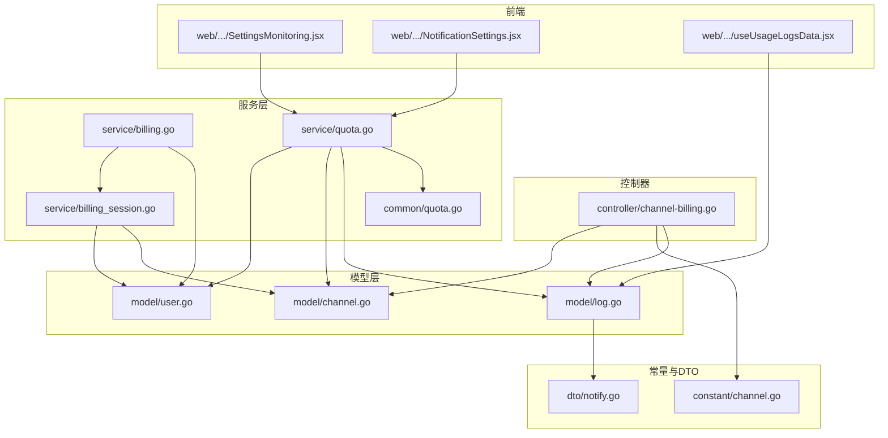
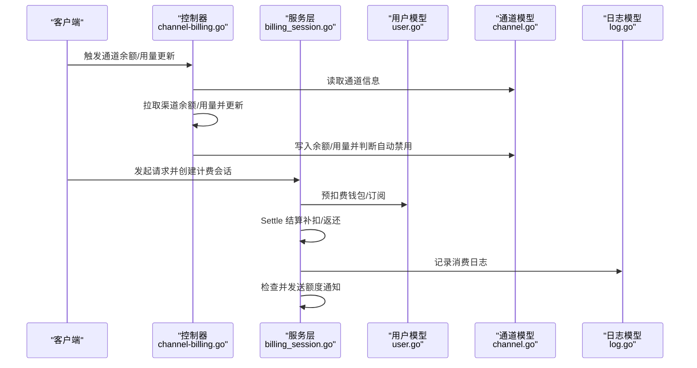
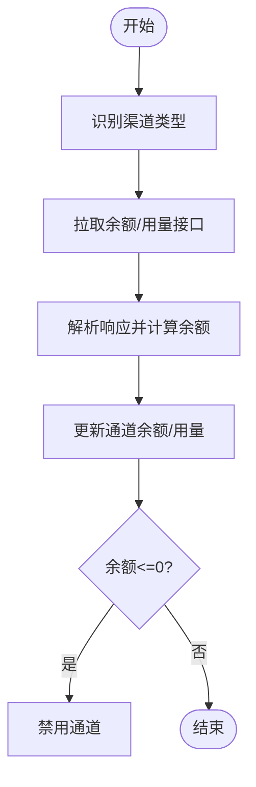
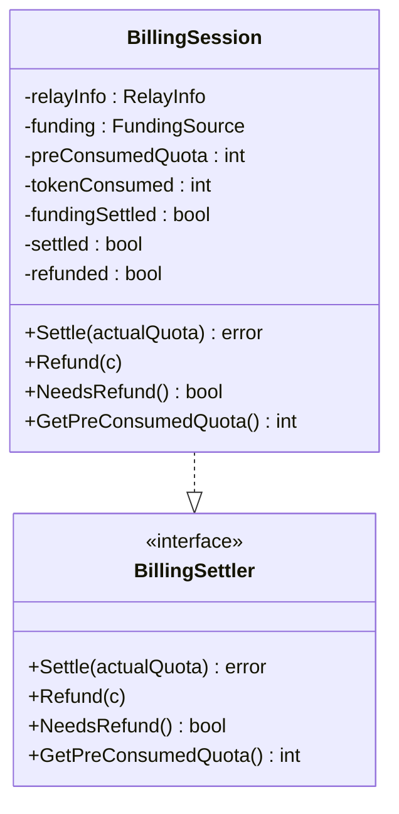
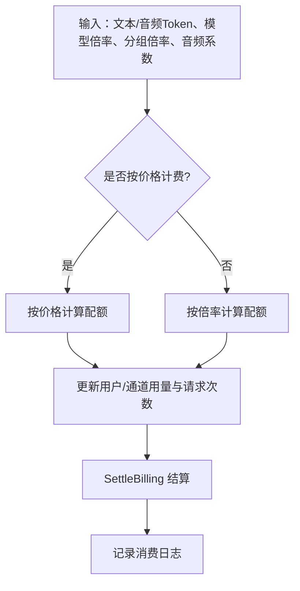
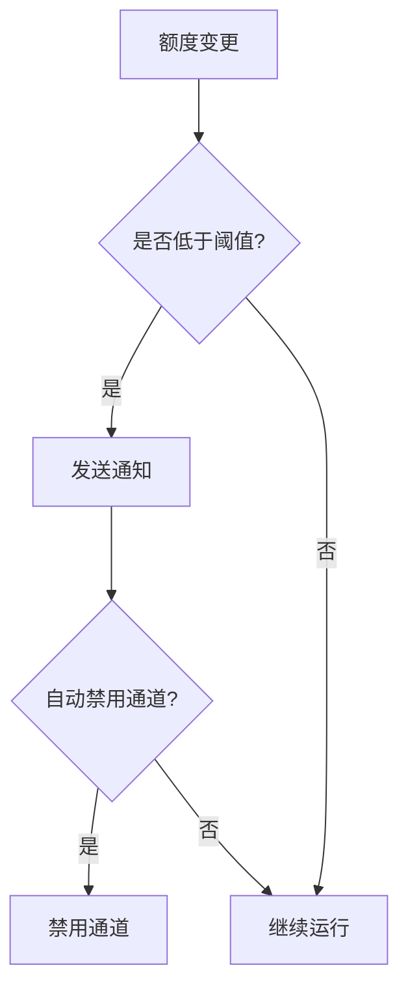
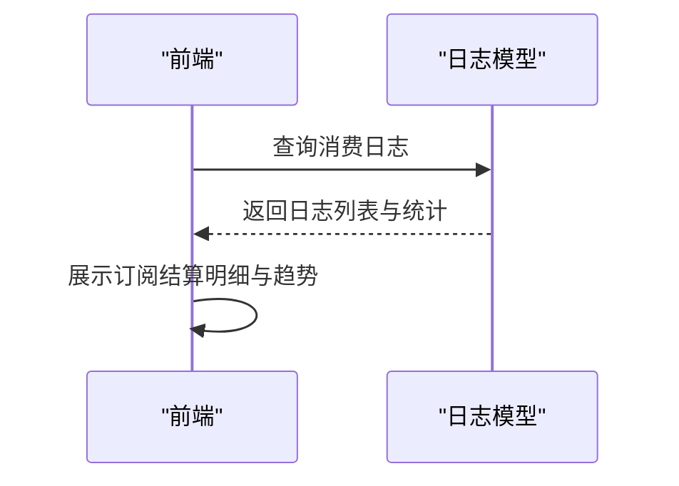
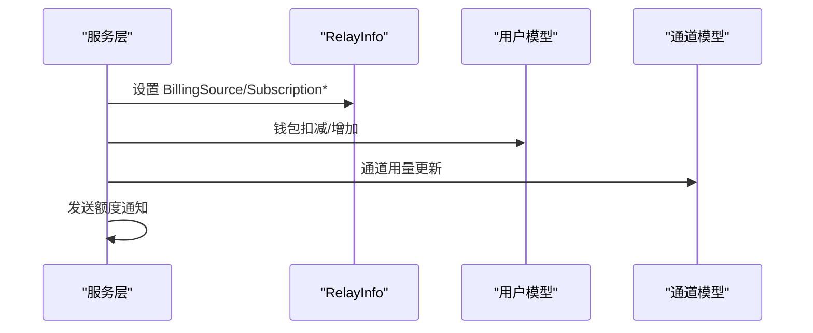
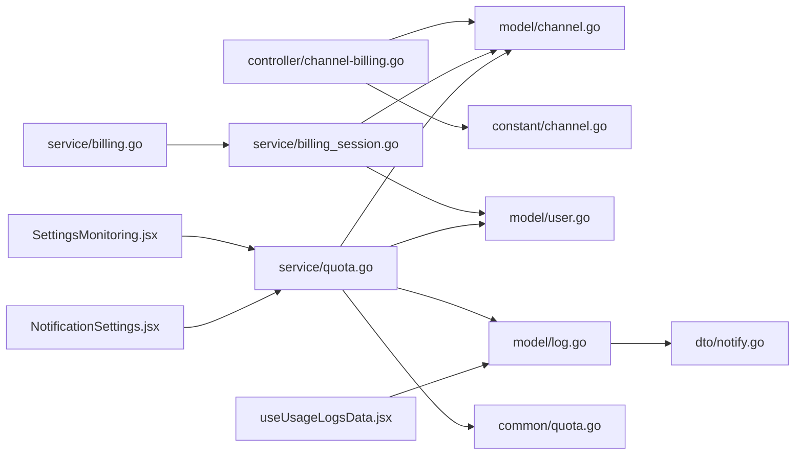

# 通道计费

<cite>
**本文档引用的文件**
- [controller/channel-billing.go](file://controller/channel-billing.go)
- [service/billing.go](file://service/billing.go)
- [service/billing_session.go](file://service/billing_session.go)
- [relay/common/billing.go](file://relay/common/billing.go)
- [relay/common/relay_info.go](file://relay/common/relay_info.go)
- [model/channel.go](file://model/channel.go)
- [model/user.go](file://model/user.go)
- [constant/channel.go](file://constant/channel.go)
- [service/quota.go](file://service/quota.go)
- [common/quota.go](file://common/quota.go)
- [model/log.go](file://model/log.go)
- [setting/operation_setting/quota_setting.go](file://setting/operation_setting/quota_setting.go)
- [dto/notify.go](file://dto/notify.go)
- [web/src/pages/Setting/Operation/SettingsMonitoring.jsx](file://web/src/pages/Setting/Operation/SettingsMonitoring.jsx)
- [web/src/components/settings/personal/cards/NotificationSettings.jsx](file://web/src/components/settings/personal/cards/NotificationSettings.jsx)
- [web/src/hooks/usage-logs/useUsageLogsData.jsx](file://web/src/hooks/usage-logs/useUsageLogsData.jsx)
</cite>

## 目录
1. [简介](#简介)
2. [项目结构](#项目结构)
3. [核心组件](#核心组件)
4. [架构总览](#架构总览)
5. [详细组件分析](#详细组件分析)
6. [依赖关系分析](#依赖关系分析)
7. [性能考量](#性能考量)
8. [故障排查指南](#故障排查指南)
9. [结论](#结论)
10. [附录](#附录)

## 简介
本文件面向通道计费系统，系统性阐述通道级别的计费管理实现，包括通道用量统计、费用计算与账单生成、通道计费模式（按次计费、按时间计费、包月计费）、通道配额管理（日配额、月配额、总配额）、异常检测与告警、数据导出与报表、通道计费与用户计费的关系及数据同步机制，并提供统计图表与趋势分析能力。

## 项目结构
通道计费系统围绕“控制器-服务层-模型层-常量与DTO-前端界面”协同工作：
- 控制器负责对外接口与定时任务调度
- 服务层负责统一计费会话、预扣费/结算/退款、额度计算与通知
- 模型层负责通道与用户实体、余额与用量更新、消费日志与统计
- 常量与DTO提供渠道类型、通知类型等基础定义
- 前端提供监控阈值配置、通知设置与消费日志详情展示

**图示来源**
- [controller/channel-billing.go:1-506](file://controller/channel-billing.go#L1-L506)
- [service/billing_session.go:1-348](file://service/billing_session.go#L1-L348)
- [service/billing.go:1-79](file://service/billing.go#L1-L79)
- [service/quota.go:1-508](file://service/quota.go#L1-L508)
- [common/quota.go:1-6](file://common/quota.go#L1-L6)
- [model/channel.go:1-800](file://model/channel.go#L1-L800)
- [model/user.go:1-800](file://model/user.go#L1-L800)
- [model/log.go:1-482](file://model/log.go#L1-L482)
- [constant/channel.go:1-210](file://constant/channel.go#L1-L210)
- [dto/notify.go:1-25](file://dto/notify.go#L1-L25)
- [web/src/pages/Setting/Operation/SettingsMonitoring.jsx:194-230](file://web/src/pages/Setting/Operation/SettingsMonitoring.jsx#L194-L230)
- [web/src/components/settings/personal/cards/NotificationSettings.jsx:437-472](file://web/src/components/settings/personal/cards/NotificationSettings.jsx#L437-L472)
- [web/src/hooks/usage-logs/useUsageLogsData.jsx:643-679](file://web/src/hooks/usage-logs/useUsageLogsData.jsx#L643-L679)

**章节来源**
- [controller/channel-billing.go:1-506](file://controller/channel-billing.go#L1-L506)
- [service/billing_session.go:1-348](file://service/billing_session.go#L1-L348)
- [service/billing.go:1-79](file://service/billing.go#L1-L79)
- [service/quota.go:1-508](file://service/quota.go#L1-L508)
- [common/quota.go:1-6](file://common/quota.go#L1-L6)
- [model/channel.go:1-800](file://model/channel.go#L1-L800)
- [model/user.go:1-800](file://model/user.go#L1-L800)
- [model/log.go:1-482](file://model/log.go#L1-L482)
- [constant/channel.go:1-210](file://constant/channel.go#L1-L210)
- [dto/notify.go:1-25](file://dto/notify.go#L1-L25)
- [web/src/pages/Setting/Operation/SettingsMonitoring.jsx:194-230](file://web/src/pages/Setting/Operation/SettingsMonitoring.jsx#L194-L230)
- [web/src/components/settings/personal/cards/NotificationSettings.jsx:437-472](file://web/src/components/settings/personal/cards/NotificationSettings.jsx#L437-L472)
- [web/src/hooks/usage-logs/useUsageLogsData.jsx:643-679](file://web/src/hooks/usage-logs/useUsageLogsData.jsx#L643-L679)

## 核心组件
- 通道余额与用量更新：通过控制器统一拉取各渠道余额与用量，写入通道模型并触发自动禁用逻辑
- 统一计费会话：封装预扣费、结算、退款生命周期，支持钱包与订阅两种资金来源
- 额度计算与消费：按模型倍率、分组倍率、音频/补全系数等计算配额，支持按次计费与按价格计费
- 通知与告警：基于用户设置与全局阈值，对钱包/订阅额度进行预警通知
- 日志与统计：消费日志记录、总量统计、RPM/TPM统计、数据导出与前端报表

**章节来源**
- [controller/channel-billing.go:359-422](file://controller/channel-billing.go#L359-L422)
- [service/billing_session.go:25-141](file://service/billing_session.go#L25-L141)
- [service/quota.go:50-87](file://service/quota.go#L50-L87)
- [service/quota.go:413-507](file://service/quota.go#L413-L507)
- [model/log.go:152-201](file://model/log.go#L152-L201)
- [model/log.go:383-437](file://model/log.go#L383-L437)

## 架构总览
通道计费系统采用“请求-预扣费-结算/退款-日志记录-通知”的闭环流程，结合通道余额与用量的周期性更新，形成完整的通道级计费管理。

**图示来源**
- [controller/channel-billing.go:359-422](file://controller/channel-billing.go#L359-L422)
- [service/billing_session.go:147-192](file://service/billing_session.go#L147-L192)
- [service/billing_session.go:36-77](file://service/billing_session.go#L36-L77)
- [service/quota.go:367-411](file://service/quota.go#L367-L411)
- [model/log.go:152-201](file://model/log.go#L152-L201)

## 详细组件分析

### 通道余额与用量更新
- 通道余额更新：针对不同渠道类型，构造对应请求，解析响应并更新通道余额
- 通道用量更新：拉取订阅与用量数据，计算可用余额并持久化
- 自动禁用：当余额为零或负值时，按策略禁用通道

**图示来源**
- [controller/channel-billing.go:359-422](file://controller/channel-billing.go#L359-L422)
- [controller/channel-billing.go:454-482](file://controller/channel-billing.go#L454-L482)
- [model/channel.go:517-525](file://model/channel.go#L517-L525)

**章节来源**
- [controller/channel-billing.go:169-422](file://controller/channel-billing.go#L169-L422)
- [controller/channel-billing.go:454-482](file://controller/channel-billing.go#L454-L482)
- [model/channel.go:517-525](file://model/channel.go#L517-L525)

### 统一计费会话（预扣费/结算/退款）
- 预扣费：支持信任额度旁路（钱包场景），否则预扣令牌与资金来源
- 结算：根据实际消耗与预扣差异进行补扣或返还，分别调整资金来源与令牌额度
- 退款：幂等异步退款，避免重复退款

**图示来源**
- [service/billing_session.go:25-141](file://service/billing_session.go#L25-L141)
- [relay/common/billing.go:5-22](file://relay/common/billing.go#L5-L22)

**章节来源**
- [service/billing_session.go:25-141](file://service/billing_session.go#L25-L141)
- [service/billing_session.go:36-77](file://service/billing_session.go#L36-L77)
- [relay/common/billing.go:5-22](file://relay/common/billing.go#L5-L22)

### 额度计算与消费（按次计费/按价格计费）
- 计算维度：模型倍率、分组倍率、音频/补全系数、价格模式
- 消费路径：钱包或订阅，分别调整用户额度与令牌额度
- 日志记录：消费日志包含模型名、令牌用量、分组、其他明细

**图示来源**
- [service/quota.go:50-87](file://service/quota.go#L50-L87)
- [service/quota.go:367-411](file://service/quota.go#L367-L411)
- [service/billing.go:34-78](file://service/billing.go#L34-L78)
- [model/log.go:152-201](file://model/log.go#L152-L201)

**章节来源**
- [service/quota.go:50-87](file://service/quota.go#L50-L87)
- [service/quota.go:259-341](file://service/quota.go#L259-L341)
- [service/billing.go:34-78](file://service/billing.go#L34-L78)
- [model/log.go:152-201](file://model/log.go#L152-L201)

### 通道计费模式
- 按次计费：以令牌用量为基准，按倍率/价格折算配额
- 按时间计费：通过实时流或任务进度统计，按使用时长与令牌量综合计费
- 包月计费：通过订阅额度与剩余金额进行控制，结合通道余额与用量更新

说明：仓库中未发现专门的“包月计费”独立实现代码，包月主要通过订阅额度与通道余额联动实现。

**章节来源**
- [service/quota.go:259-341](file://service/quota.go#L259-L341)
- [service/billing_session.go:255-347](file://service/billing_session.go#L255-L347)
- [controller/channel-billing.go:359-422](file://controller/channel-billing.go#L359-L422)

### 通道配额管理（日配额、月配额、总配额）
- 日配额：通过通道余额与用量统计实现，结合通道余额更新与用量累计
- 月配额：通过通道余额与用量统计实现，结合通道余额更新与用量累计
- 总配额：通过通道余额与用量统计实现，结合通道余额更新与用量累计

注意：仓库中未发现独立的“日/月/总配额”字段与校验逻辑，通道层面主要维护余额与已用额度。用户层面的配额与统计见用户模型与日志统计。

**章节来源**
- [model/channel.go:39-39](file://model/channel.go#L39-L39)
- [model/channel.go:756-769](file://model/channel.go#L756-L769)
- [model/log.go:383-437](file://model/log.go#L383-L437)

### 异常检测与告警
- 额度预警：基于全局阈值与用户设置，对钱包与订阅剩余额度进行预警通知
- 通知类型：邮件、Bark、Gotify、Webhook等
- 自动禁用：通道余额为零或负值时，按策略自动禁用通道

**图示来源**
- [service/quota.go:413-507](file://service/quota.go#L413-L507)
- [dto/notify.go:1-25](file://dto/notify.go#L1-L25)
- [controller/channel-billing.go:475-477](file://controller/channel-billing.go#L475-L477)

**章节来源**
- [service/quota.go:413-507](file://service/quota.go#L413-L507)
- [dto/notify.go:1-25](file://dto/notify.go#L1-L25)
- [web/src/pages/Setting/Operation/SettingsMonitoring.jsx:194-230](file://web/src/pages/Setting/Operation/SettingsMonitoring.jsx#L194-L230)
- [web/src/components/settings/personal/cards/NotificationSettings.jsx:437-472](file://web/src/components/settings/personal/cards/NotificationSettings.jsx#L437-L472)

### 数据导出与报表
- 消费日志：记录每次消费的模型、令牌用量、分组、其他明细
- 统计接口：支持按时间段、模型、令牌、通道、分组聚合统计
- 前端展示：消费日志详情中展示订阅结算信息（预扣、结算差额、最终抵扣）

**图示来源**
- [model/log.go:152-201](file://model/log.go#L152-L201)
- [model/log.go:383-437](file://model/log.go#L383-L437)
- [web/src/hooks/usage-logs/useUsageLogsData.jsx:643-679](file://web/src/hooks/usage-logs/useUsageLogsData.jsx#L643-L679)

**章节来源**
- [model/log.go:152-201](file://model/log.go#L152-L201)
- [model/log.go:383-437](file://model/log.go#L383-L437)
- [web/src/hooks/usage-logs/useUsageLogsData.jsx:643-679](file://web/src/hooks/usage-logs/useUsageLogsData.jsx#L643-L679)

### 通道计费与用户计费的关系与数据同步
- 资金来源：支持钱包与订阅两种来源，订阅优先策略可配置
- 数据同步：计费会话在结算后同步到RelayInfo，记录订阅预扣与后结算差额
- 通知联动：订阅与钱包均支持额度预警通知

**图示来源**
- [relay/common/relay_info.go:122-146](file://relay/common/relay_info.go#L122-L146)
- [service/billing_session.go:255-347](file://service/billing_session.go#L255-L347)
- [service/billing.go:34-78](file://service/billing.go#L34-L78)
- [model/channel.go:756-769](file://model/channel.go#L756-L769)

**章节来源**
- [relay/common/relay_info.go:122-146](file://relay/common/relay_info.go#L122-L146)
- [service/billing_session.go:255-347](file://service/billing_session.go#L255-L347)
- [service/billing.go:34-78](file://service/billing.go#L34-L78)
- [model/channel.go:756-769](file://model/channel.go#L756-L769)

## 依赖关系分析
- 控制器依赖通道模型与常量，用于渠道类型识别与余额/用量更新
- 服务层依赖用户模型、通道模型、日志模型与通用额度工具
- 前端依赖运营设置与个人设置，配置额度预警阈值与通知方式

**图示来源**
- [controller/channel-billing.go:1-506](file://controller/channel-billing.go#L1-L506)
- [service/billing.go:1-79](file://service/billing.go#L1-L79)
- [service/billing_session.go:1-348](file://service/billing_session.go#L1-L348)
- [service/quota.go:1-508](file://service/quota.go#L1-L508)
- [common/quota.go:1-6](file://common/quota.go#L1-L6)
- [model/channel.go:1-800](file://model/channel.go#L1-L800)
- [model/user.go:1-800](file://model/user.go#L1-L800)
- [model/log.go:1-482](file://model/log.go#L1-L482)
- [constant/channel.go:1-210](file://constant/channel.go#L1-L210)
- [dto/notify.go:1-25](file://dto/notify.go#L1-L25)
- [web/src/pages/Setting/Operation/SettingsMonitoring.jsx:194-230](file://web/src/pages/Setting/Operation/SettingsMonitoring.jsx#L194-L230)
- [web/src/components/settings/personal/cards/NotificationSettings.jsx:437-472](file://web/src/components/settings/personal/cards/NotificationSettings.jsx#L437-L472)
- [web/src/hooks/usage-logs/useUsageLogsData.jsx:643-679](file://web/src/hooks/usage-logs/useUsageLogsData.jsx#L643-L679)

**章节来源**
- [controller/channel-billing.go:1-506](file://controller/channel-billing.go#L1-L506)
- [service/billing.go:1-79](file://service/billing.go#L1-L79)
- [service/billing_session.go:1-348](file://service/billing_session.go#L1-L348)
- [service/quota.go:1-508](file://service/quota.go#L1-L508)
- [common/quota.go:1-6](file://common/quota.go#L1-L6)
- [model/channel.go:1-800](file://model/channel.go#L1-L800)
- [model/user.go:1-800](file://model/user.go#L1-L800)
- [model/log.go:1-482](file://model/log.go#L1-L482)
- [constant/channel.go:1-210](file://constant/channel.go#L1-L210)
- [dto/notify.go:1-25](file://dto/notify.go#L1-L25)
- [web/src/pages/Setting/Operation/SettingsMonitoring.jsx:194-230](file://web/src/pages/Setting/Operation/SettingsMonitoring.jsx#L194-L230)
- [web/src/components/settings/personal/cards/NotificationSettings.jsx:437-472](file://web/src/components/settings/personal/cards/NotificationSettings.jsx#L437-L472)
- [web/src/hooks/usage-logs/useUsageLogsData.jsx:643-679](file://web/src/hooks/usage-logs/useUsageLogsData.jsx#L643-L679)

## 性能考量
- 通道余额批量更新：带间隔休眠，避免对上游渠道造成压力
- 异步退款：退款通过协程异步执行，降低主流程阻塞
- 日志导出：消费日志导出在后台协程中执行，避免影响主线程
- 倍率计算：在内存中进行浮点运算，注意精度与边界值处理

[本节为通用指导，不直接分析具体文件]

## 故障排查指南
- 通道余额为零或负值：检查上游渠道余额接口返回与解析逻辑，确认自动禁用策略是否生效
- 额度不足：检查用户钱包/订阅额度与令牌额度，确认预扣费与结算流程
- 通知未发送：检查用户设置与全局阈值配置，确认通知类型与通道
- 日志缺失：检查日志开关与导出开关，确认查询条件与权限

**章节来源**
- [controller/channel-billing.go:475-477](file://controller/channel-billing.go#L475-L477)
- [service/quota.go:413-507](file://service/quota.go#L413-L507)
- [model/log.go:196-201](file://model/log.go#L196-L201)

## 结论
通道计费系统通过统一的计费会话、灵活的额度计算与完善的日志统计，实现了对通道级别的精细化计费管理。结合余额与用量的周期性更新、订阅与钱包双通道资金来源、以及预警通知与数据导出能力，系统能够满足多渠道、多模式的计费需求，并为后续扩展（如包月计费）提供良好基础。

## 附录
- 配额设置：免费模型预扣费开关
- 额度预警阈值：运营与个人设置均可配置

**章节来源**
- [setting/operation_setting/quota_setting.go:1-22](file://setting/operation_setting/quota_setting.go#L1-L22)
- [web/src/pages/Setting/Operation/SettingsMonitoring.jsx:194-230](file://web/src/pages/Setting/Operation/SettingsMonitoring.jsx#L194-L230)
- [web/src/components/settings/personal/cards/NotificationSettings.jsx:437-472](file://web/src/components/settings/personal/cards/NotificationSettings.jsx#L437-L472)