# 数据访问层

<cite>
**本文引用的文件**
- [common/database.go](file://common/database.go)
- [model/main.go](file://model/main.go)
- [model/user.go](file://model/user.go)
- [model/channel.go](file://model/channel.go)
- [model/token.go](file://model/token.go)
- [model/log.go](file://model/log.go)
- [model/task.go](file://model/task.go)
- [model/ability.go](file://model/ability.go)
- [model/model_meta.go](file://model/model_meta.go)
- [model/pricing.go](file://model/pricing.go)
- [model/setup.go](file://model/setup.go)
- [model/utils.go](file://model/utils.go)
- [bin/migration_v0.2-v0.3.sql](file://bin/migration_v0.2-v0.3.sql)
- [bin/migration_v0.3-v0.4.sql](file://bin/migration_v0.3-v0.4.sql)
</cite>

## 目录
1. [简介](#简介)
2. [项目结构](#项目结构)
3. [核心组件](#核心组件)
4. [架构总览](#架构总览)
5. [详细组件分析](#详细组件分析)
6. [依赖分析](#依赖分析)
7. [性能考量](#性能考量)
8. [故障排查指南](#故障排查指南)
9. [结论](#结论)
10. [附录](#附录)

## 简介
本技术文档聚焦 New API 项目的“数据访问层”，系统性阐述基于 GORM 的数据库配置、模型定义与操作模式。内容覆盖用户、通道、令牌、日志、任务、能力与定价等核心模型，以及数据库连接管理、事务处理、查询优化、数据迁移与版本管理、批量更新与性能调优策略。旨在帮助开发者快速理解并高效使用数据访问层，确保在多数据库（MySQL、PostgreSQL、SQLite）与日志库分离场景下的稳定性与可维护性。

## 项目结构
数据访问层主要位于 model 包，配合 common/database.go 提供数据库类型常量与默认配置；迁移脚本位于 bin 目录；批量更新与工具方法位于 model/utils.go。

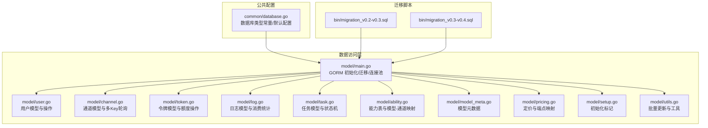

**图表来源**
- [model/main.go:177-248](file://model/main.go#L177-L248)
- [common/database.go:3-16](file://common/database.go#L3-L16)
- [bin/migration_v0.2-v0.3.sql:1-7](file://bin/migration_v0.2-v0.3.sql#L1-L7)
- [bin/migration_v0.3-v0.4.sql:1-18](file://bin/migration_v0.3-v0.4.sql#L1-L18)

**章节来源**
- [model/main.go:177-248](file://model/main.go#L177-L248)
- [common/database.go:3-16](file://common/database.go#L3-L16)

## 核心组件
- 数据库初始化与连接池
  - 支持从环境变量选择数据库类型（SQL_DSN、LOG_SQL_DSN），自动识别 MySQL/PostgreSQL/SQLite，并设置 PrepareStmt、连接池参数与字符集校验。
  - 主库与日志库可分离配置，分别执行迁移与写入。
- 模型与表结构
  - 用户、通道、令牌、日志、任务、能力、模型元数据、定价、初始化标记等。
- 查询与事务
  - 统一使用 GORM，提供分页、搜索、聚合统计、事务封装与 CAS 更新。
- 批量更新
  - 基于内存缓冲与定时批量提交，降低数据库写放大。
- 迁移与版本管理
  - AutoMigrate 自动化表结构演进，结合 SQL 脚本处理特定版本差异。

**章节来源**
- [model/main.go:177-248](file://model/main.go#L177-L248)
- [model/utils.go:33-98](file://model/utils.go#L33-L98)

## 架构总览
数据访问层采用“单主库 + 日志库”分离架构，GORM 作为 ORM 层，统一抽象不同数据库方言；通过能力表（abilities）实现模型到通道的解耦路由；日志库独立写入，便于容量与性能隔离。

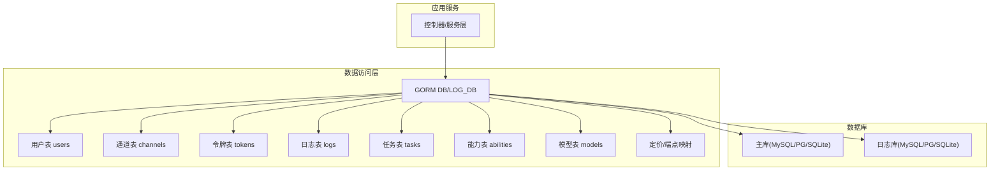

**图表来源**
- [model/main.go:177-248](file://model/main.go#L177-L248)
- [model/log.go:75-91](file://model/log.go#L75-L91)

## 详细组件分析

### 数据库初始化与连接管理
- 初始化流程
  - 依据环境变量选择数据库类型，自动设置 PrepareStmt、连接池最大空闲/打开连接数、生命周期。
  - 对 MySQL 进行中文字符集与排序规则校验，确保支持中文。
  - 主库与日志库分别初始化，日志库可独立配置。
- 迁移策略
  - 主库执行 AutoMigrate，按需执行列类型迁移（如 tokens.model_limits 文本化、subscription_plans.price_amount 精确小数）。
  - 日志库仅迁移 logs 表。
- 连接健康
  - 提供 PingDB 定期探测，避免长时间闲置导致的连接失效。

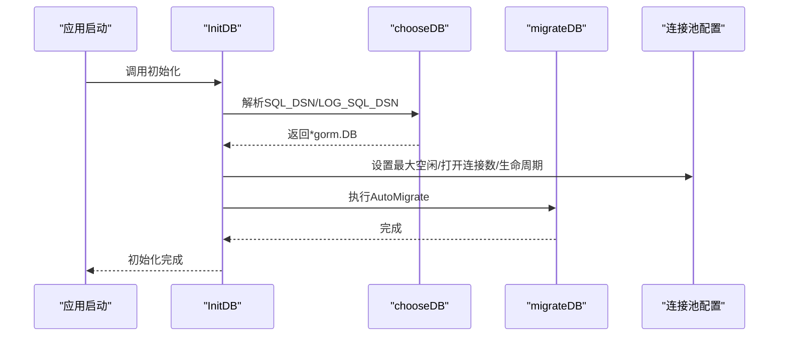

**图表来源**
- [model/main.go:177-248](file://model/main.go#L177-L248)

**章节来源**
- [model/main.go:118-175](file://model/main.go#L118-L175)
- [model/main.go:250-297](file://model/main.go#L250-L297)
- [model/main.go:584-674](file://model/main.go#L584-L674)

### 用户模型与操作
- 关键字段与索引
  - 唯一用户名、显示名索引、邮箱/第三方标识索引、邀请码唯一索引、软删除索引、分组字段等。
- 核心操作
  - 分页查询、搜索（用户名/邮箱/昵称）、启用/禁用、额度变更、邀请奖励、OAuth 注册后置处理。
  - 事务封装：分页与搜索均在事务内执行，保证总数与数据一致性。
- 安全与合规
  - 密码哈希、敏感字段不在响应中返回、访问令牌字段独立管理。

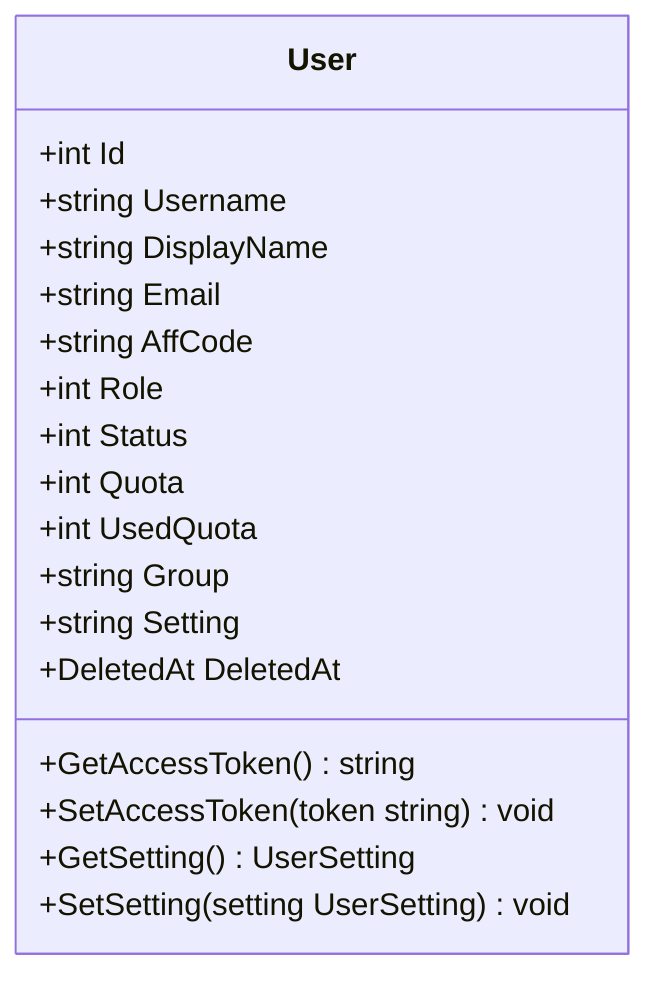

**图表来源**
- [model/user.go:23-53](file://model/user.go#L23-L53)

**章节来源**
- [model/user.go:191-223](file://model/user.go#L191-L223)
- [model/user.go:225-290](file://model/user.go#L225-L290)
- [model/user.go:379-433](file://model/user.go#L379-L433)

### 通道模型与多Key轮询
- 结构特性
  - 支持多Key模式（单Key/多Key），内置状态与禁用原因、轮询索引；支持优先级、权重、分组、模型映射、状态码映射等。
- 多Key策略
  - 随机与轮询两种模式，线程安全锁保障并发一致性；当全部Key禁用时整体禁用。
- 能力映射
  - 通过 abilities 表将通道与模型/分组/权重/优先级建立映射，查询时按优先级与权重随机选择。

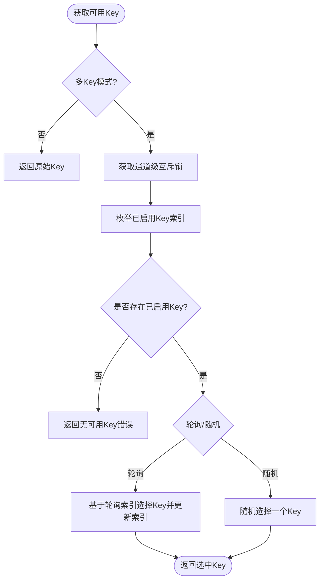

**图表来源**
- [model/channel.go:105-190](file://model/channel.go#L105-L190)

**章节来源**
- [model/channel.go:21-58](file://model/channel.go#L21-L58)
- [model/channel.go:105-190](file://model/channel.go#L105-L190)
- [model/ability.go:106-144](file://model/ability.go#L106-L144)

### 令牌模型与额度管理
- 字段与限制
  - 唯一键、到期时间、剩余配额、模型白名单、IP白名单、跨分组重试等。
- 额度操作
  - 增减额度支持批量更新缓冲，减少写放大；Redis 缓存命中时异步更新。
- 搜索与安全
  - LIKE 模糊搜索带 ESCAPE 转义与硬上限保护，防止全表扫描。

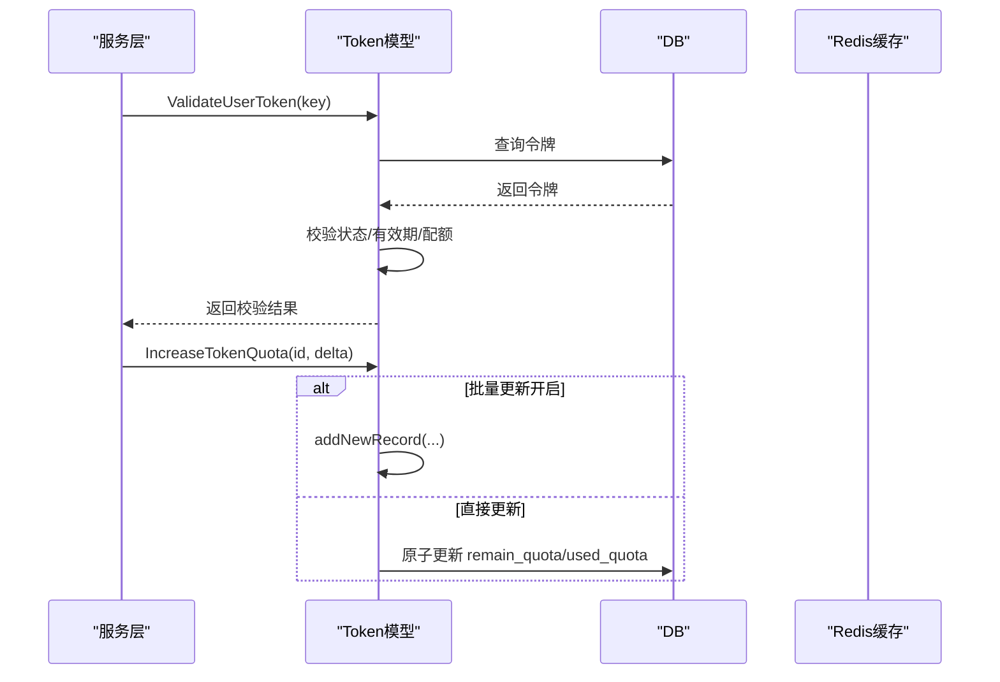

**图表来源**
- [model/token.go:188-226](file://model/token.go#L188-L226)
- [model/token.go:375-403](file://model/token.go#L375-L403)
- [model/utils.go:42-98](file://model/utils.go#L42-L98)

**章节来源**
- [model/token.go:14-32](file://model/token.go#L14-L32)
- [model/token.go:127-186](file://model/token.go#L127-L186)
- [model/token.go:375-433](file://model/token.go#L375-L433)
- [model/utils.go:33-98](file://model/utils.go#L33-L98)

### 日志模型与统计
- 表结构与索引
  - 用户、时间、类型、模型名、令牌名、请求ID等复合索引，支持高频查询。
- 日志写入
  - 消费日志与错误日志分离，支持按用户/模型/令牌/分组/请求ID检索。
- 统计接口
  - 汇总消耗额度、RPM/TPM 近期统计，支持时间窗口与过滤条件。

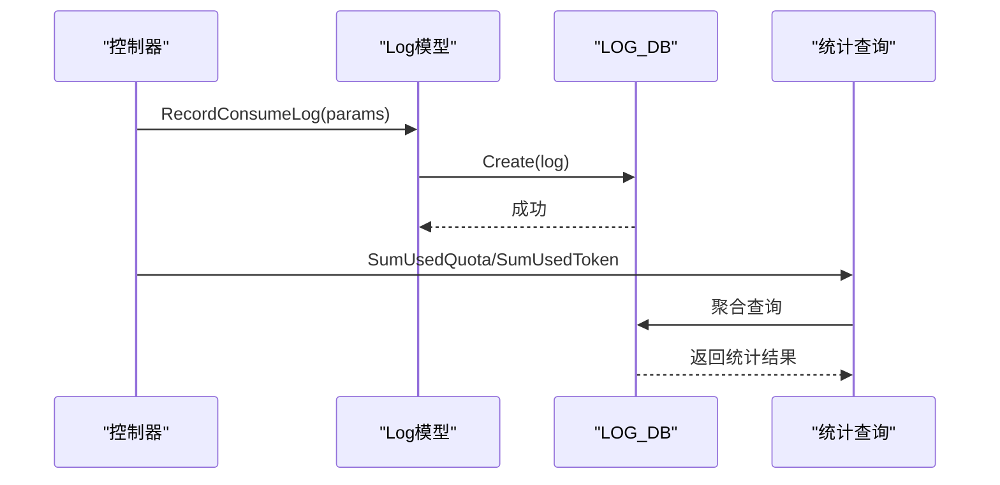

**图表来源**
- [model/log.go:152-201](file://model/log.go#L152-L201)
- [model/log.go:383-437](file://model/log.go#L383-L437)

**章节来源**
- [model/log.go:19-40](file://model/log.go#L19-L40)
- [model/log.go:246-328](file://model/log.go#L246-L328)
- [model/log.go:383-458](file://model/log.go#L383-L458)

### 任务模型与状态机
- 状态与平台
  - 任务状态包含提交、排队、进行中、成功、失败、未知；平台类型与 Action 类型区分任务类型。
- 查询与计费
  - 支持按平台/通道/用户/任务ID/时间范围等条件组合查询；支持按次计费与轮询阶段差额结算。
- 批量更新
  - 提供无 CAS 的批量更新接口，注意仅用于非计费关键路径。

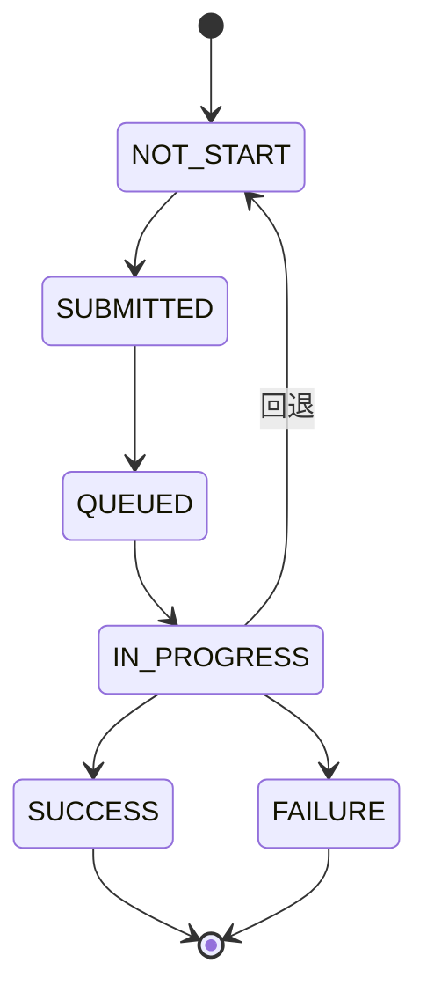

**图表来源**
- [model/task.go:34-42](file://model/task.go#L34-L42)
- [model/task.go:404-431](file://model/task.go#L404-L431)

**章节来源**
- [model/task.go:44-66](file://model/task.go#L44-L66)
- [model/task.go:211-290](file://model/task.go#L211-L290)
- [model/task.go:404-431](file://model/task.go#L404-L431)

### 能力表与模型-通道映射
- 能力表结构
  - 三元主键（分组、模型、通道ID），启用状态、优先级、权重、标签。
- 路由逻辑
  - 按分组与模型查询启用的能力，优先级降序，权重随机选择通道；支持重试切换不同优先级。
- 维护策略
  - 通道增删改时同步维护 abilities，支持按 Tag 批量启停与属性更新。

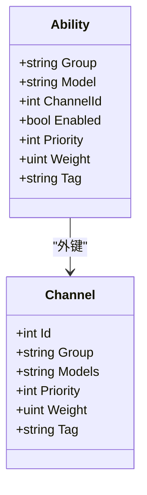

**图表来源**
- [model/ability.go:16-29](file://model/ability.go#L16-L29)
- [model/channel.go:21-58](file://model/channel.go#L21-L58)

**章节来源**
- [model/ability.go:16-29](file://model/ability.go#L16-L29)
- [model/ability.go:146-185](file://model/ability.go#L146-L185)
- [model/ability.go:191-261](file://model/ability.go#L191-L261)

### 模型元数据与定价
- 模型元数据
  - 模型名唯一、描述、图标、标签、端点自定义、名称匹配规则（精确/前缀/包含/后缀）。
- 定价与端点
  - 基于启用能力与模型元数据，动态构建前端可用的定价与端点映射；支持缓存与并发读写锁。
- 供应商与端点
  - 默认端点与模型自定义端点叠加，优先使用模型自定义覆盖。

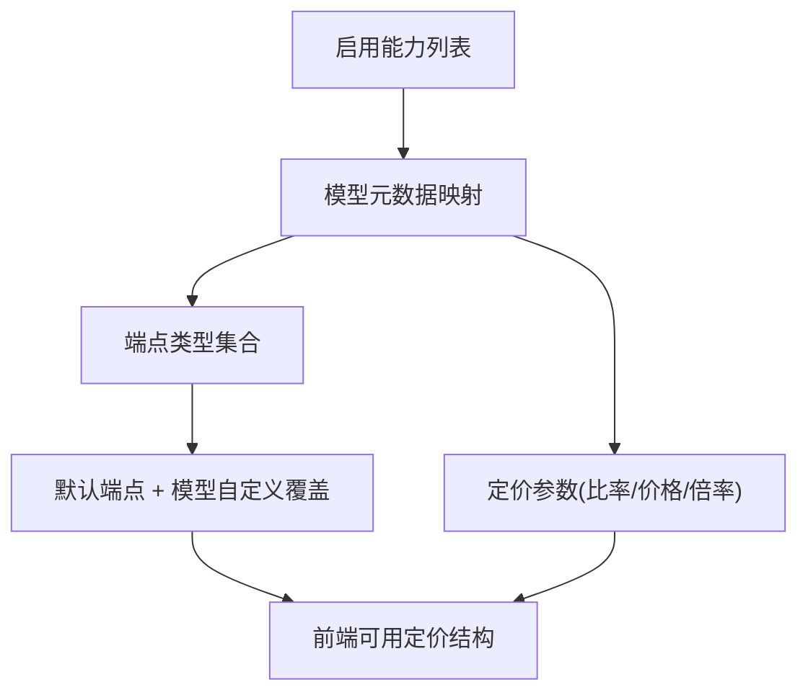

**图表来源**
- [model/pricing.go:98-341](file://model/pricing.go#L98-L341)
- [model/model_meta.go:23-44](file://model/model_meta.go#L23-L44)

**章节来源**
- [model/model_meta.go:23-44](file://model/model_meta.go#L23-L44)
- [model/pricing.go:98-341](file://model/pricing.go#L98-L341)

### 初始化标记与系统检查
- 初始化标记
  - Setup 记录用于判断系统是否已完成初始化；首次启动时若存在根用户则自动创建初始化记录。
- 根账户检查
  - 若无用户存在，自动创建根用户并赋予初始配额。

**章节来源**
- [model/setup.go:3-16](file://model/setup.go#L3-L16)
- [model/main.go:68-89](file://model/main.go#L68-L89)

### 批量更新与工具
- 批量更新机制
  - 按类型维护内存缓冲，定时器周期性批量提交，显著降低写放大。
- 工具方法
  - 记录存在性判断、Redis 更新策略开关等。

**章节来源**
- [model/utils.go:14-31](file://model/utils.go#L14-L31)
- [model/utils.go:33-98](file://model/utils.go#L33-L98)
- [model/utils.go:100-113](file://model/utils.go#L100-L113)

## 依赖分析
- 组件耦合
  - model/main.go 是核心入口，其他模型围绕其提供的 DB/LOG_DB 进行 CRUD。
  - 通道与能力表强关联，能力表驱动模型到通道的路由。
  - 日志库独立，避免消费日志对主库压力影响。
- 外部依赖
  - GORM、SQLite/MySQL/PG 驱动、Redis（可选）、协程池（gopool）。

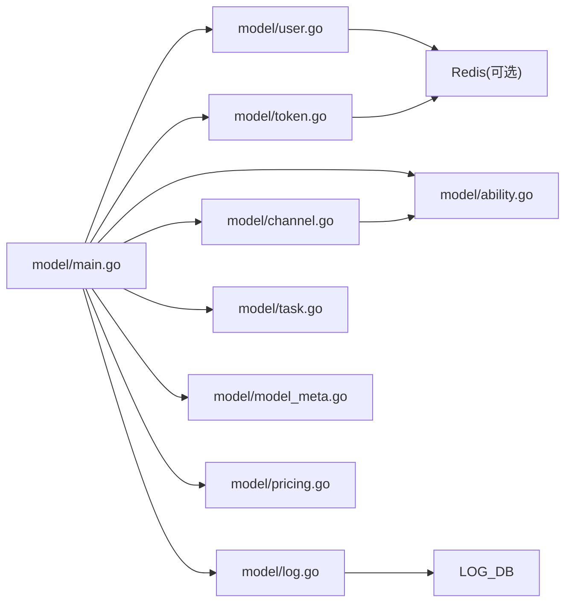

**图表来源**
- [model/main.go:250-297](file://model/main.go#L250-L297)
- [model/channel.go:146-185](file://model/channel.go#L146-L185)
- [model/log.go:75-91](file://model/log.go#L75-L91)

**章节来源**
- [model/main.go:250-297](file://model/main.go#L250-L297)
- [model/channel.go:146-185](file://model/channel.go#L146-L185)
- [model/log.go:75-91](file://model/log.go#L75-L91)

## 性能考量
- 连接池与预编译
  - 启用 PrepareStmt，合理设置最大空闲/打开连接数与生命周期，避免连接抖动。
- 查询优化
  - 为高频字段建立复合索引（如 logs 的多字段索引），使用事务包裹分页与总数统计，避免脏读。
  - LIKE 查询使用 ESCAPE 转义与硬上限，避免全表扫描。
- 批量更新
  - 使用批量更新缓冲与定时提交，降低写放大；仅在非计费关键路径使用无 CAS 批量更新。
- 日志分离
  - 日志库独立部署，避免消费日志对主库的影响；必要时开启压缩与分区策略。

[本节为通用指导，无需具体文件引用]

## 故障排查指南
- 数据库连接失败
  - 检查 SQL_DSN/LOG_SQL_DSN 格式与数据库可达性；确认字符集与排序规则满足中文要求（MySQL）。
- 迁移异常
  - 查看 AutoMigrate 输出与列类型迁移（tokens.model_limits、subscription_plans.price_amount）是否成功。
- 令牌/额度异常
  - 检查批量更新缓冲是否堆积；确认 Redis 缓存一致性与降级策略。
- 日志缺失
  - 确认 LOG_DB 初始化与写入路径；检查日志库容量与清理策略。

**章节来源**
- [model/main.go:584-674](file://model/main.go#L584-L674)
- [model/main.go:250-297](file://model/main.go#L250-L297)
- [model/utils.go:52-98](file://model/utils.go#L52-L98)
- [model/log.go:460-481](file://model/log.go#L460-L481)

## 结论
数据访问层以 GORM 为核心，结合能力表解耦模型与通道路由、日志库分离与批量更新机制，在多数据库与高并发场景下实现了稳定与高性能。通过完善的迁移与版本管理、事务与查询优化策略，开发者可在保证数据一致性的前提下，高效扩展业务能力。

[本节为总结，无需具体文件引用]

## 附录

### 数据模型概览（ER）
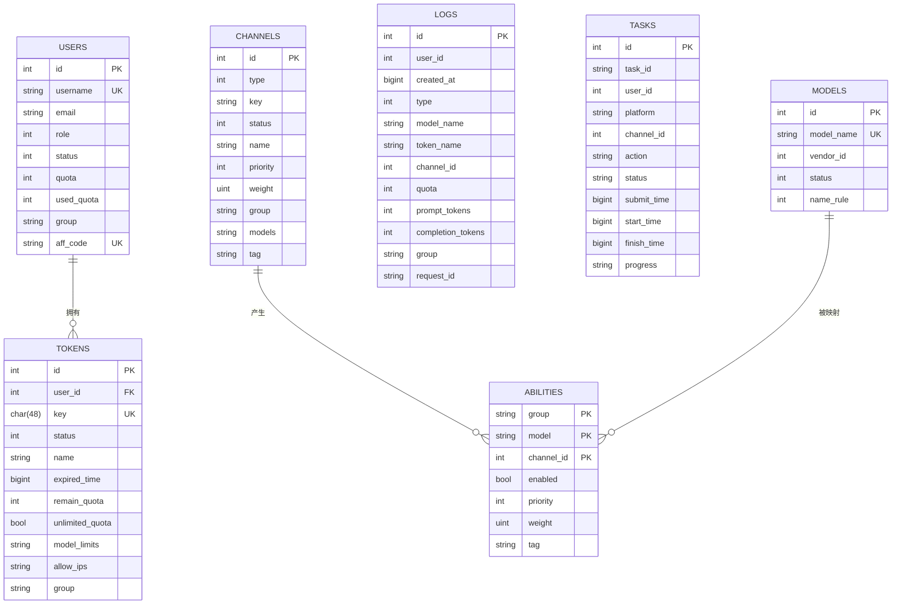

**图表来源**
- [model/user.go:23-53](file://model/user.go#L23-L53)
- [model/channel.go:21-58](file://model/channel.go#L21-L58)
- [model/token.go:14-32](file://model/token.go#L14-L32)
- [model/log.go:19-40](file://model/log.go#L19-L40)
- [model/task.go:44-66](file://model/task.go#L44-L66)
- [model/ability.go:16-29](file://model/ability.go#L16-L29)
- [model/model_meta.go:23-44](file://model/model_meta.go#L23-L44)

### 数据迁移与版本管理
- 版本间迁移
  - v0.2 → v0.3：将用户配额累加到用户表。
  - v0.3 → v0.4：为通道生成默认能力条目。
- 自动迁移
  - 主库与日志库分别执行 AutoMigrate；特殊列类型迁移在初始化时执行。

**章节来源**
- [bin/migration_v0.2-v0.3.sql:1-7](file://bin/migration_v0.2-v0.3.sql#L1-L7)
- [bin/migration_v0.3-v0.4.sql:1-18](file://bin/migration_v0.3-v0.4.sql#L1-L18)
- [model/main.go:250-297](file://model/main.go#L250-L297)